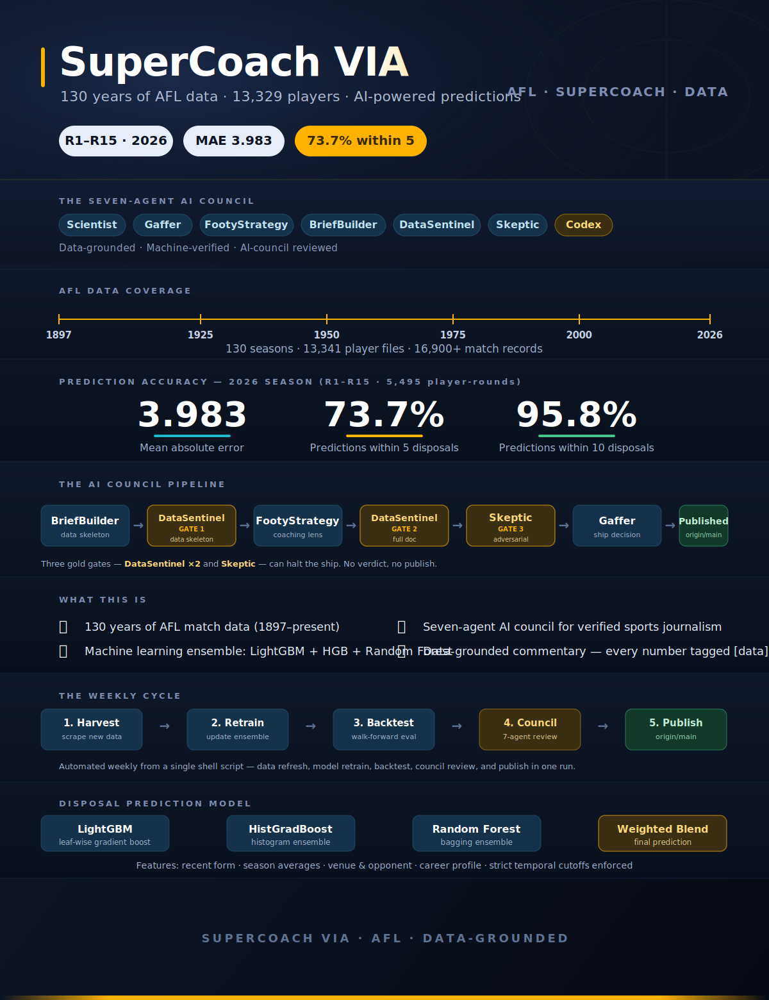

# AFL SuperCoach VIA



<div align="center">
  
  
  
  
  
  
  
</div>

---

The most complete public AFL dataset (1897–present), paired with a machine-learning prediction engine and a seven-agent AI council that writes data-grounded match analysis. Built for SuperCoach players who want the edge — and for ML engineers who want a production architecture small enough to read end to end.

**For the footy fan:** 130 years of AFL data plus a set of AI agents that reason like a coaching staff — weekly player predictions, team trends, all-time rankings, and debate-ready insight, no coding required.

**For the ML engineer:** a production-architecture reference in one legible repo — a feature pipeline with strict temporal cutoffs, a three-model ensemble, multi-agent LLM reasoning, deterministic RAG over structured data, a walk-forward eval harness, and an MCP tool gateway. Small enough to read end to end, complete enough to map onto a real deployment.

The whole pipeline runs from a single shell script: scrape new match and player data, retrain the disposal model, run a leak-proof walk-forward backtest, regenerate the all-time top-100, and update the documentation. The football is the domain; the architecture is the point.

⭐ **If this project is useful to you, please star the repo.**

---

## The numbers

| Metric | Value | Source |
|---|--:|---|
| AFL history covered | **[data]** 1897–present | `data/matches/` |
| Player performance files | **[data]** 13,329 | `data/player_data/` (one CSV per player, one row per game) |
| Backtest window | **[data]** R1–R13, 2026 | `data/prediction/backtest/` |
| Player-round predictions scored | **[data]** 4,806 | walk-forward backtest |
| Mean absolute error (disposals) | **[data]** 4.019 | player-weighted across all rounds |
| Within 5 disposals | **[data]** 73.3% | player-weighted |
| Within 10 disposals | **[data]** 95.8% | player-weighted |
| Aggregate bias | **[data]** −0.093 | essentially unbiased at population level |

**Plain English:** the model misses a player's next-round disposal count by about four disposals on average — usable signal on a 0–45 range, measured honestly across 4,806 predictions. The known weak spot is the elite tier, where error runs roughly 2.5× the global figure.

---

## How to run it — quick start

```bash
git clone https://github.com/apur27/SuperCoach-VIA
cd SuperCoach-VIA
# Install venv
python -m venv .venv && source .venv/bin/activate
pip install -r requirements.txt
# Refresh data + predictions
bash refresh_and_rank.sh
# Run backtest (latest round only - incremental)
python backtest.py --start-year 2026 --start-round 12 --end-year 2026 --end-round 12
# Generate weekly fan pack
python scripts/generate_weekly_cheat_sheet.py --year 2026
```

Full setup (GPU notes, data layout, first-time troubleshooting) is in [docs/installation.md](docs/installation.md).

### Start here — I want to...

| I want to... | Go to | Setup needed |
|---|---|---|
| **See this week's predicted disposal leaders** | [docs/afl-predictions-2026.md](docs/afl-predictions-2026.md) | None - browser only |
| **Browse the no-code fan landing page** | [docs/start-here-no-code.md](docs/start-here-no-code.md) | None - browser only |
| **Understand what this is good for in SuperCoach** | [docs/how-to-use-this-for-supercoach.md](docs/how-to-use-this-for-supercoach.md) | None - browser only |
| **Get the prediction CSV into Google Sheets** | [templates/google-sheets-template.md](templates/google-sheets-template.md) | A free Google account |
| **Read the auto-updated 2026 season hub** | [docs/afl-season-2026.md](docs/afl-season-2026.md) | None - browser only |
| **See the all-time top 100 and Hall of Fame** | [docs/hall-of-fame.md](docs/hall-of-fame.md) | None - browser only |
| **Look up a footy or data term** | [docs/glossary.md](docs/glossary.md) | None - browser only |
| **See how accurate the model has been (backtest + pre-registered report card)** | [docs/afl-backtest-2026.md](docs/afl-backtest-2026.md) | None - browser only |
| **Run predictions or retrain the model myself** | [docs/installation.md](docs/installation.md) (For Contributors section) | Python, Git, terminal |
| **Get tactical analysis on an AFL team's list and draft picks** | [docs/coaches-strategy-corner/afl-2026-team-list-analysis.md](docs/coaches-strategy-corner/afl-2026-team-list-analysis.md) | None - browser only |
| **Read the AFL news desk - data-grounded long-form on current stories** | [docs/news/README.md](docs/news/README.md) | None - browser only |
| **AI design patterns — how this maps to a production deployment (RAG, MCP, eval harness, AI Ethics, sovereign deployment)** | [docs/ai-architecture.md](docs/ai-architecture.md) | None - browser only |
| **AI security — risks, controls, prompt injection, data poisoning, governance and secure design** | [docs/ai-architecture.md#ai-security--risks-controls-and-secure-design-in-this-repo](docs/ai-architecture.md#ai-security--risks-controls-and-secure-design-in-this-repo) | None - browser only |
| **Operator's manual — how this specific repo works end-to-end (data inventory, scripts, match lifecycle, live pipeline, runbooks)** | [docs/ARCHITECTURE.md](docs/ARCHITECTURE.md) | None - browser only |
| **Read the Crumb Phase 2 design doc** | [docs/footy-ai-chatbot-phase2.md](docs/footy-ai-chatbot-phase2.md) | None - browser only |

---

## The seven-agent council

This is the differentiator. Six agents live in `.claude/agents/`; the seventh (Codex) is an external model queried for outside-the-frame commentary. Each has a bounded role, and together they form a methodology layer that makes every published claim falsifiable against a CSV in this repo.

| # | Agent | Model | Primary role | One-line description |
|---|-------|-------|--------------|----------------------|
| 1 | **Scientist** | Opus | Data, code, model, pipeline | Owns the data layer — EDA, stat verification, prediction code, live pipeline, doc structure. Enforces the CLAUDE.md verification rule. |
| 2 | **FootyStrategy** | Opus | Tactical interpretation | Eight-lens coaching council (Conditioner, Tempo Architect, Structuralist, Match-up Tactician, Talent Developer, Innovator, Culture Custodian, List Strategist). Translates Scientist's numbers into coach-grade reads. Never names specific coaches without attribution. |
| 3 | **DataSentinel** | Haiku | Pre-commit verification gate | Walks every `**[data]**` tag in a draft, confirms it against the source CSV. Flags untagged numbers, coach-name violations, schema violations. Emits machine-readable JSON for a pre-commit hook to consume. |
| 4 | **BriefBuilder** | Sonnet | Brief data-skeleton drafter | Given two teams and a round, auto-populates the data skeleton of a pre-match brief — H2H ledger, season form, model predictions, top-5-per-side tracking list. Leaves `<!-- FOOTYSTRATEGY INSERT -->` placeholders for the interpretation layer. |
| 5 | **Skeptic** | Opus | Adversarial reviewer | Probes tripwire observability, caveat-hierarchy fidelity, and lens-tension smoothing on FootyStrategy drafts. Outputs `PASS / PASS_WITH_CONCERNS / BLOCK`. Never modifies the doc — the author decides what to incorporate. |
| 6 | **Gaffer** | Opus | Delivery lead / editor-in-chief | Delivery Lead / Editor-in-Chief — orchestrates the chain, decides 'ready to ship' on PASS; boss of process, not of truth. Never authors or edits a `**[data]**` number, never overrides a DataSentinel FAIL or Skeptic BLOCK. |
| 7 | **Codex (GPT-5.4)** | External | Outside-the-frame commentary | Queried for views from outside this repo's data frame. All Codex outputs are attributed explicitly as external commentary and cross-checked against repo data where possible. |

**The chain:** BriefBuilder → Scientist → FootyStrategy → DataSentinel → (optionally Skeptic). Full architecture: [`docs/ARCHITECTURE.md`](docs/ARCHITECTURE.md) §2 and §6.

**The data verification contract:** every specific number in any published doc must be tagged `**[data]**` and verified against the actual CSV before commit. CLAUDE.md is the policy; DataSentinel is the gate. Verification reports land in [`docs/sentinel-reports/`](docs/sentinel-reports/).

### The council in plain football terms

- **Scientist** — the stats analyst in the coaches' box who doesn't just answer a question, they go and do the work. Ask "does this player drop off in wet weather?" and they pull the data, run the numbers, draw the chart, then write it up with honest caveats. If the answer is "we can't tell from this data," they say so.
- **FootyStrategy** — a panel of eight assistant coaches, each obsessed with one thing (fitness, structure, match-ups, list management). They hand back a single recommendation, upfront about how sure they are and where they disagreed — and every call comes with a **tripwire**: the specific thing you'd see on the ground that means the plan is wrong.
- **DataSentinel** — the fact-checker at the door of every commit. It refuses to let a stat past if the number does not actually match the CSV it came from.
- **BriefBuilder** — the analyst's apprentice who lays out the bones of next week's match brief (season records, head-to-head ledger, model predictions, players worth tracking) so the senior coaches start from a populated draft, not a blank page.
- **Skeptic** — the devil's advocate the panel keeps in the room. It reads finished briefs and asks the awkward questions ("is that tripwire really observable on the day?", "did you upgrade the call beyond what the data supports?") and refuses to silently rewrite anything — the call stays with the author.
- **Gaffer** — the delivery lead and editor-in-chief who runs the week. They sequence the agents, hold the line on every gate, and only call "ready to ship" once DataSentinel and the Skeptic have signed off. They are boss of process, not of truth: they never touch a `**[data]**` number and never publish around a FAIL or a BLOCK.

### The Crumb — a 13-agent coaching staff

A 13-agent, 6-tier AI coaching staff — a senior coach, line coaches, specialists, analysts, a data steward — that you ask one question and it dispatches the right specialists and merges their answers. Named after the crumber: the small forward who reads where the ball will spill before the pack resolves. At the top sits the Senior Coach, who doesn't crunch numbers personally — they hand the right pieces to the right specialists and pull the answers back into one plan. Everyone has a lane.

**Phase 1** uses Claude Opus (Senior Coach), Claude Sonnet specialists, and a Claude Haiku data steward, invoked through the Claude Code Agent pattern with prompt-based scoping and model-driven tool calls.

**Phase 2** makes the structure load-bearing: agents talk through a validated schema, the Senior Coach is split into a Planner (picks the agents) and a Synthesiser (merges findings, with no data access at all), data reads go through parameterised query templates instead of arbitrary code, low-confidence answers are routed to a human queue, and a nightly eval harness measures citation precision, era-coverage refusal, role isolation, calibration, and falsifiability. The patterns come from João Moura (CrewAI): Planner-Executor split, role-based crew with IAM isolation, supervisor-worker graph with durable state. The football is incidental — the same five changes apply to any multi-agent deployment.

Full spec — build order, sample Planner output, the `FootyFinding` Pydantic envelope, and the local IAM adaptation: [docs/footy-ai-chatbot-phase2.md](docs/footy-ai-chatbot-phase2.md).

---

## The data

130 years of AFL history, structured. Every match since 1897, and **[data]** 13,329 individual player files — one CSV per player, a row for every game they ever played. A scraper refreshes it weekly so the numbers stay current.

Think of the club's archivist who has kept a card for every player in every game since 1897 — every kick, mark, and goal, filed and cross-referenced. Each week after the round finishes, a runner collects the latest match sheets and adds them to the cabinet before the analysts come in Monday morning. The whole system is useless if the cabinet is out of date or has gaps, so keeping it complete and current is the unglamorous job everything else depends on.

### The prediction model

Three different prediction models look at a player's recent form, who they're playing, where, and under what conditions — then they vote on how many disposals that player will get next round. Across the 2026 season so far it has been within 5 disposals **[data]** 73.3% of the time and within 10 **[data]** 95.8% of the time. Averaging three models is steadier than trusting any one: when all three lean the same way you can be confident; when they split, that disagreement is itself a useful signal that the match is genuinely hard to call.

### The weekly fan pack

A weekly cheat sheet and prediction bundle, packaged every Sunday night — the kind of thing you'd actually open before locking in a SuperCoach lineup. It's the form guide you'd grab on the way into the track: it tells you where to start your thinking before the gates open. It'll be a length or two off on most runners (the typical four-disposal error is just the going on the day), and it can't see a late scratching or a jockey change — a tag job or a role switch will catch it flat-footed. Read it the night before, then check for late mail before you put your money down.

### The news section

Data-grounded footy journalism, where the numbers are not decoration — they are the argument. Every number in every article is reproducible from the CSVs in this repo: no remembered stats, no quoted-without-source figures. This is the Monday press conference, done properly — the Scientist brings what the numbers honestly say about the weekend's footy, FootyStrategy translates that into what it means for how teams should play.

---

## Under the hood — for the engineer

Each layer below is small on purpose. The interest is that all of them are present at once.

| Layer | What it is |
|---|---|
| **Data** | 130 years of AFL match and player CSVs — **[data]** 13,329 player performance files (one row per player per game, 1897–present) plus per-season match files. Weekly scrape via `refresh_data.py`. Feature engineering builds rolling-window features per player (3-game, 5-game, season-to-date form), opponent strength, venue effects, and contextual flags. The `LeakProofPredictor` enforces a strict temporal cutoff: predicting round N sees only data strictly before round N. |
| **ML inference** | A `VotingRegressor` ensemble of three diverse base learners: `HistGradientBoostingRegressor`, `LightGBM` (GPU-capable, CPU fallback), and `RandomForestRegressor`. Hyperparameters tuned via Optuna's TPE sampler over a 50-trial budget. Post-hoc out-of-fold linear calibration corrects top-end compression. Walk-forward backtest: **[data]** MAE 4.019 across 4,806 player-rounds (R1–R13, 2026). Cross-validation is `GroupKFold` keyed on player ID, so no player appears in both train and validation folds. |
| **LLM reasoning — Scientist** | Claude Opus running a ReAct loop (Reason, Act, Observe, repeat) for 50+ turns on complex tasks. Tool surface: Bash, Read/Write/Edit, WebFetch, Agent subagents. `CLAUDE.md` is the versioned system prompt and policy doc — data-coverage caveats, ranking constants, behavioural constraints, all in source control and diffable. |
| **LLM reasoning — FootyStrategy** | An 8-lens tactical council, each lens produced separately then reconciled. Output is tiered — Settled, Probationary, Contested, Insufficient Evidence — and every Settled or Probationary recommendation must carry a **tripwire**: an explicit observable that would overturn it. Caveats from the Scientist's upstream findings propagate through unchanged; the data tier caps the recommendation tier. |
| **LLM reasoning — extended council** | **DataSentinel** (Haiku) is a pre-commit verification gate that walks every `**[data]**` tag and emits machine-readable JSON (`PASS \| FAIL` with per-violation detail) for a pre-commit hook. **BriefBuilder** (Sonnet) is a structured-assembly drafter that pulls H2H, season form, model predictions, and a top-5-per-side tracking list. **Skeptic** (Opus) is an adversarial critic that probes tripwire observability, caveat-hierarchy honour, and lens-tension smoothing, then emits `PASS / PASS_WITH_CONCERNS / BLOCK` — never silently modifying the doc. Ship order: DataSentinel first (closes the runtime-enforcement gap on CLAUDE.md), then BriefBuilder, then Skeptic. Full design in [`docs/ARCHITECTURE.md`](docs/ARCHITECTURE.md) §2.4 and §13. |
| **RAG** | Deterministic retrieval — pandas filters over CSVs. No embedding model, no vector store for structured numeric data, because semantic similarity adds noise where the query maps directly to a structured filter. Hybrid upgrade path documented: pgvector or Qdrant for unstructured commentary, the pandas layer staying authoritative for any numeric claim. |
| **Eval harness** | Walk-forward backtest with strict temporal cutoff. Per-round MAE, RMSE, within-5, within-10, signed bias, and a top-10-player MAE slice that surfaces the worst failure mode. Team-level bias across all 18 teams. `backtest.py --start-round N --end-round N` for incremental runs; output persisted as CSV under `data/prediction/backtest/`. |
| **MCP gateway** | Claude Code's built-in MCP implementation. Tool surface: Bash, Read/Write/Edit, WebFetch/WebSearch, Agent subagents. JSON-schema tool definitions; tool selection is model-driven, no hand-coded routing logic. |
| **Observability** | `git log` as the audit trail — every doc change is an attributable commit with author, timestamp, diff, message. Backtest CSVs are the ML performance history; a regression is visible by diffing two runs. `CLAUDE.md` is version-controlled, so the agent's policy state at any past commit is reconstructable. |

---

## Eval results — current

Walk-forward backtest, 2026 season, Rounds 1–13. For each round the model is retrained using only data from before that round, predicts every player who played, and is scored against actuals.

| Window | Player-rounds | MAE | Within 5 | Within 10 | Bias |
|---|--:|--:|--:|--:|--:|
| **R1-R13 player-weighted** | **[data]** 4,806 | **[data]** 4.019 | **[data]** 73.3% | **[data]** 95.8% | **[data]** -0.093 |
| Round 1 (hardest) | **[data]** 230 | **[data]** 4.83 | **[data]** 60.4% | **[data]** 92.6% | — |
| Round 13 (best MAE) | **[data]** 320 | **[data]** 3.51 | **[data]** 79.4% | **[data]** 96.9% | — |

**Plain English:** the typical prediction misses by about four disposals. On a per-player range of roughly 0–45 that is usable signal, not a solved problem. Round 1 is hardest because there are no within-season form features before any 2026 game has been played.

**Technical:** the model is essentially unbiased in aggregate. The known failure mode is the elite tier — top-10-player MAE runs ~2.5x the global figure, driven by a residual ceiling effect and context (tag absorption, role rotations) the feature set captures only partially. Team-level signed bias spans **[data]** -0.73 (Sydney, most under-predicted) to **[data]** +0.57 (Richmond, most over-predicted), with mean absolute team bias **[data]** 0.28 disposals.

Full per-round table (all 13 rounds), team-level breakdown for every club, biggest misses per round, and pre-registered methodology: **[docs/afl-backtest-2026.md](docs/afl-backtest-2026.md)**.

---

## AFL News & Analysis

Long-form footy journalism where the numbers are not decoration — they are the argument. Every piece is co-authored by the agents in this repo: **Scientist** pulls verified stats from 130 years of match data (every claim reproducible from the CSVs), **FootyStrategy** turns them into coach-grade tactical reads, **BriefBuilder** drafts the data skeleton, **DataSentinel** verifies every stat at the door, and **Skeptic** stress-tests finished drafts before they go out. No hot takes, no recycled commentary.

<!-- NEWS-LATEST-START -->
**Latest:** [List Management 101: Is the Top-10 Draft Pick Strategy a Path to Premiership Dominance?](docs/list-management-101.md) - Data analysis across 127 premierships of whether early draft picks build dynasties, or whether retention and an experienced core matter more *(2026-06-05)*

[AI Harness 101: How to Turn a Language Model Into a System That Actually Ships](https://medium.com/@abh1shek/ai-harness-101-how-to-turn-a-language-model-into-a-system-that-actually-ships-b4d0ab5bdf21) - Uses this repo as the worked example for production AI harness design *(2026-06-02)*
<!-- NEWS-LATEST-END -->

→ [All news entries](docs/news/README.md)

---

## AI architecture & security

- [Repository architecture](docs/ARCHITECTURE.md) — how this repo works end-to-end: seven-agent council, data inventory, scripts inventory, match lifecycle, live pipeline, prediction model
- [AI system architecture](docs/ai-architecture.md) — RAG, tool router, eval harness, MCP gateway, sovereign deployment
  - [Australia's AI Ethics Principles — how this project maps to the 8 principles](docs/ai-architecture.md#australias-ai-ethics-principles--how-this-project-maps)
  - [AI security — risks, controls, and secure design in this repo](docs/ai-architecture.md#ai-security--risks-controls-and-secure-design-in-this-repo)
- [Building The Crumb (Phase 1)](docs/footy-ai-chatbot-setup.md) — 13-agent Claude staff, end-to-end build guide
- [The Crumb — Phase 2 design doc](docs/footy-ai-chatbot-phase2.md) — Planner-Executor, parameterised tools, FootyFinding envelope, HITL routing, eval harness
- [How this repo uses Claude](docs/how-this-repo-uses-claude.md) — custom agent design, policy-as-code, multi-agent orchestration

---

## Hall of Fame & all docs

### Hall of Fame
- [AFL Hall of Fame](docs/hall-of-fame.md) — all-time top 100, statistical leaders, captains, coaches, dynasties
- [100 Forgotten Heroes](docs/hall-of-fame-forgotten-heroes.md) — underappreciated players across 8 categories, data-verified from the player CSVs

### For fans (no code)
- [Start here - no code](docs/start-here-no-code.md)
- [How to use this for SuperCoach](docs/how-to-use-this-for-supercoach.md)
- [Glossary](docs/glossary.md)
- [Google Sheets template](templates/google-sheets-template.md)
- [Weekly cheat sheet (current round)](docs/weekly/round-current-2026.md)

### AFL insights & live data
- [AFL insights hub](docs/afl-insights.md)
  - [2026 season hub](docs/afl-season-2026.md)
    - [Team analysis](docs/afl-team-analysis-2026.md) *(auto-updates)*
    - [Finals pathway](docs/afl-finals-2026.md) *(auto-updates)*
    - [Brownlow predictor](docs/afl-brownlow-2026.md) *(auto-updates)*
    - [Player stat leaders](docs/afl-stat-leaders-2026.md) *(auto-updates)*
    - [Next round predictions](docs/afl-predictions-2026.md) *(auto-updates)*
    - [Backtest results](docs/afl-backtest-2026.md) *(auto-updates)*
  - [5-year team profiles](docs/afl-team-profiles.md) *(auto-updates)*
  - [Coaches strategy corner](docs/coaches-strategy-corner/README.md) - match-by-match tactical briefs built from the data
  - [AFL history - 130 years](docs/afl-history.md)
  - [For the footy expert](docs/footy-expert-guide.md)
  - [For the coaching staff](docs/coaching-guide.md)
  - [AFL 2026 team list analysis](docs/coaches-strategy-corner/afl-2026-team-list-analysis.md) - all 18 clubs

### Further reading
- [AI Harness 101: How to Turn a Language Model Into a System That Actually Ships](https://medium.com/@abh1shek/ai-harness-101-how-to-turn-a-language-model-into-a-system-that-actually-ships-b4d0ab5bdf21) *(Medium)* — uses this repo as the worked example: deterministic Python + bounded agent tasks + Git as audit trail
- [How it works: data science deep-dive](docs/data-science.md) - dataset, model, backtest, ranking algorithm, written in three layers from layperson to ML practitioner
- [How predictions work](docs/prediction-model.md) - the model, the backtest framework, the all-time-100 algorithm
- [Using the Scientist agent](docs/scientist-agent.md) - when plain Claude vs the Scientist, the improvement loop
- [Using the FootyStrategy agent](docs/coaching-guide.md#leveraging-the-footystrategy-agent) - tactical brainstorming, list analysis, Scientist x FootyStrategy workflow
- [Quick start](docs/quick-start.md) / [Installation](docs/installation.md) / [Usage](docs/usage.md) / [Troubleshooting](docs/troubleshooting.md)
- [Claude Code setup on Ubuntu](docs/claude-code-setup.md) - install Node.js, Claude Code, Python venv
- [Technical reference](docs/technical-reference.md) - GPU setup, data layout, scripts

### About
- [Roadmap & contributing](docs/roadmap.md)
- [Changelog](CHANGELOG.md)

---

## Why this repo exists

> What this repo is for, in the end, is none of the engineering above — it is this.

This is not a commercial project. It is not affiliated with any gambling service, and nothing here is intended to encourage betting of any kind. The motivation is the game itself - the patterns inside it, the history it carries, and the people it brings together.

It started, honestly, as competitive edge. I have been playing SuperCoach with the same group for over a decade, and this repo exists in no small part because of the arguments about who the better player really was. Somewhere along the line a Sunday-night lineup tweak turned into feature engineering, then into a backtest framework, then into this.

But this repo is also a return gift. To the friends and colleagues who got me up to speed on this game - who explained what a clearance was, why ruck craft matters, how to read a scoreline - and who introduced me to SuperCoach in the first place. You did not have to, and you did. This is, in part, a thank you back.

A specific and heartfelt thank you goes to the families, coaches and community of Cranbourne Junior Football Club, who welcomed my son and trained him in the right spirit of the game. The coaches who give their time freely on cold mornings, the families who stand on the boundary in the rain - these are the people who actually make the game what it is. AFL doesn't exist without them, and a polished dataset of senior careers means very little without remembering where every one of those players came from.

It is also why I think AFL is one of the things that can make Australia genuinely multicultural. Sport breaks boundaries in a way that policy never quite manages to. A new Australian turning up at a junior football club and being welcomed onto a team is not a small thing - it is one of the more honest forms of belonging this country has to offer.

And finally, this work is an homage to the giants of the game - past, present and future. To the players whose careers are quietly recorded in the rows of this dataset, who gave everything on the field, and who made generations of fans care deeply about something together. The numbers in here are theirs. The rest of us are just keeping the ledger.
