# AFL SuperCoach VIA

<div align="center">
  
  
  
  
</div>


⭐ **If this helped your SuperCoach team this week, please star the repo** — it helps other footy fans find it.

> **⚡ TL;DR — I just want this week's predictions (no reading required)**
>
> 1. Open Terminal → paste these 4 lines one by one:
>    ```bash
>    git clone https://github.com/apur27/SuperCoach-VIA.git
>    cd SuperCoach-VIA
>    pip install -r requirements.txt
>    python prediction_cpu.py   # works on any laptop — or prediction.py if you have a GPU
>    ```
> 2. Open the file `data/prediction/next_round_*_prediction_*.csv` in Excel or Google Sheets.
> 3. Done — you now have predicted disposals for every player this week.
>
> Takes roughly 5–10 minutes on a normal laptop. Full details below if you want them.

<br>

If you love footy and you're curious about AI but don't know where to start, this repo is a practical, hands-on way to learn — and you don't need a computer science degree to follow along. All you need is a laptop running Ubuntu (a free Linux operating system), an interest in AFL, a copy of [Claude Code](https://claude.ai/code) (a tool that lets you chat with Claude AI inside a terminal window), and a Claude subscription — the entry-level plan is plenty for everything in this repo. Everything in this project — the disposal prediction model, the backtest framework that grades it, the all-time player rankings — was built and improved by having plain-English conversations with AI agents, including a specialised "Scientist" agent that reads data, finds problems, and fixes code on its own. You'll see how to use these agents to analyse real AFL data, predict each player's disposals (kicks + handballs) each week, and continuously improve accuracy by feeding results back into the model. Whether you want to understand how AI can write and improve code, how computer-driven predictions actually work in practice, or just who the greatest AFL player of all time is — this repo shows you all of it, one conversation at a time.

> **A faster computer helps, but isn't essential.** Most of the heavy-lifting scripts (the prediction engine, the backtester, the all-time rankings, the era analysis) are designed to use a **GPU** (the graphics card in your computer — originally built for video games, but it's also very fast at the kind of maths used in machine learning). On a normal laptop without a dedicated NVIDIA graphics card, those scripts will run roughly 10 to 30 times slower — a single round of predictions can take 2+ hours instead of about 5 minutes. If you don't have an NVIDIA GPU, read [Setting up GPU acceleration](#setting-up-gpu-acceleration-optional) before running anything beyond the basic data fetch. A CPU-only fallback (`prediction_cpu.py`) exists for the predictions, so you can still use the project on any laptop — just more slowly.

---

A personal AFL data project that does three things:
1. **Stores every AFL match and player stat** going back to 1897
2. **Ranks the greatest players of all time** using a fair, era-adjusted formula
3. **Predicts how many disposals each player will get** in the next round

## Who is this for?

| I am… | What I get from this repo |
|---|---|
| **A footy fan** who wants to understand their team better | The AFL insights section — live team stats, finals pathway, who's playing well |
| **A SuperCoach player** wanting a data edge | The disposal prediction model tells you who is likely to rack up this week |
| **Curious about AI** and want to see it applied to sport | The Claude AI agents section walks you through using AI to ask questions about the data |
| **A developer or data scientist** | Full pipeline docs, model code, backtest framework, GPU setup |
| **A casual SuperCoach player** who just wants better picks each week | The weekly predicted disposals CSV — tells you who is likely to rack up this round |

You don't need to write any code to use most of this. The AFL Insights section of this README updates automatically every week — just read it.

> **What is SuperCoach?** SuperCoach is Australia's most popular AFL fantasy competition — you pick a squad of real AFL players and score points based on their actual in-game statistics each week. Disposals (kicks + handballs) are the biggest scoring category, which is why this project focuses on predicting them. Think of it as the AFL version of fantasy football.

## Table of Contents

- [Who is this for?](#who-is-this-for)
- [Introduction](#introduction)
  - [What's in this repo](#whats-in-this-repo)
- [Quick start](#quick-start)
  - [Getting started](#getting-started)
    - [Step 0 — Set up Git and GitHub (skip this if you've done it before)](#step-0--set-up-git-and-github-skip-this-if-youve-done-it-before)
  - [Predict next week's disposals](#predict-next-weeks-disposals)
  - [What you'll actually get](#what-youll-actually-get)
  - [Run a backtest](#run-a-backtest)
  - [Refresh data and rankings](#refresh-data-and-rankings)
- [Troubleshooting and common questions](#troubleshooting-and-common-questions)
- [AFL insights](#afl-insights)
  - [How the game has changed — 125 years of data](#how-the-game-has-changed--125-years-of-data)
  - [2026 season — live team analysis](#2026-season--live-team-analysis)
  - [2026 finals pathway — what each team needs](#2026-finals-pathway--what-each-team-needs)
  - [2026 Brownlow Medal predictor](#2026-brownlow-medal-predictor)
  - [2026 player performance stats — what to look for and what the data says](#2026-player-performance-stats--what-to-look-for-and-what-the-data-says)
  - [Team playing styles — 5 years of data (2021–2025)](#team-playing-styles--5-years-of-data-20212025)
  - [For the footy expert — finding the greatest 100 players of all time](#for-the-footy-expert--finding-the-greatest-100-players-of-all-time)
  - [For the coaching staff — building a data-driven game plan](#for-the-coaching-staff--building-a-data-driven-game-plan)
- [AFL Hall of Fame — the greatest of all time](#afl-hall-of-fame--the-greatest-of-all-time)
  - [Top 30 AFL captains of all time](#top-30-afl-captains-of-all-time)
  - [Top 10 AFL coaches of all time](#top-10-afl-coaches-of-all-time)
  - [Top 20 most courageous AFL players of all time](#top-20-most-courageous-afl-players-of-all-time)
- [The prediction model](#the-prediction-model)
  - [How predictions work](#how-predictions-work)
  - [Backtest framework](#backtest-framework)
  - [All-time top 100 ranking algorithm](#all-time-top-100-ranking-algorithm)
- [Using AI agents](#using-ai-agents)
  - [Setting up Claude Code on Ubuntu](#setting-up-claude-code-on-ubuntu)
  - [Using Claude and the Scientist agent](#using-claude-and-the-scientist-agent)
- [Technical reference](#technical-reference)
  - [Setting up GPU acceleration (optional)](#setting-up-gpu-acceleration-optional)
  - [How the data is organised](#how-the-data-is-organised)
  - [Data sources](#data-sources)
  - [Quick command reference](#quick-command-reference)
  - [Glossary](#glossary)
- [Roadmap — what's coming next](#roadmap--whats-coming-next)
- [Contributing](#contributing)
- [License](#license)

## Introduction

This is the project at a glance — what's in the repo and how to find your way around. If you're new here, scan this and then jump to the section that matches what you want to do.

### What's in this repo

| What | Where | Details |
|------|-------|---------|
| Every AFL match result (1897–now) | `data/matches/` | Scores, margins, venues, quarter-by-quarter breakdown |
| Stats for every player ever | `data/player_data/` | Kicks, marks, goals, disposals, tackles and more — 5,700+ players, 682,000 game records |
| All-time top 100 ranking | `all_time_top_100.csv` | Era-adjusted ranking updated whenever you run the pipeline |
| Next round disposal predictions | `data/prediction/` | A CSV telling you how many disposals each player is predicted to get |
| Backtest results | `data/prediction/backtest/` | How accurate past predictions were, round by round |

## Quick start

**Who is this section for?** Anyone who just wants to get the project running and start using it — predict next round, run a backtest, or refresh the data — without first wading through methodology or AFL analysis.

> **Before running any command:** make sure you are inside the `SuperCoach-VIA` folder (`cd SuperCoach-VIA`) and your Python environment is active (`source .venv/bin/activate`). After that, just use `python script.py` — no long paths needed.

New here? These three commands are all you need. Download a copy of the project (a "repo" is just a project folder hosted on GitHub), run `prediction.py` for next week's disposal projections, and `./refresh_and_rank.sh` to refresh data and rebuild the all-time top 100.

#### New to the terminal? Start here

If you've never used a **terminal** before, don't stress — it's just a text window where you type instructions to your computer instead of clicking buttons. Everything in the Quick Start below is typed into that one window.

**To open a terminal on Ubuntu**, press `Ctrl+Alt+T` on your keyboard, or click the apps button (the grid of dots) in the dock and search for *Terminal*. A black or dark-grey window will pop up with a blinking cursor — that's it.

From there, every line of code shown in a grey box below is something you copy, paste into the terminal, and then press **Enter** to run. That's the whole interaction. The computer reads each line, does the work, and prints the result back to the same window.

If anything you see below looks intimidating — long URLs, words like `pip` or `npm`, lots of slashes — that's normal. You only need to copy-paste a handful of commands and the hard parts (downloading code, installing libraries, picking the right version) are handled automatically. The full step-by-step setup, with explanations of what each step does, lives in the [Getting started](#getting-started) and [Setting up Claude Code on Ubuntu](#setting-up-claude-code-on-ubuntu) sections further down — start there if you want a slower walk-through.

### Getting started

#### Step 0 — Set up Git and GitHub (skip this if you've done it before)

Brand new to all this? No worries — this is a one-time setup. Once it's done you'll never have to do it again on this laptop. Work through Parts A to F in order and you'll be ready to grab the project.

> **Tip:** if your terminal ever looks frozen after you paste a command, give it a tap of **Enter** — sometimes the cursor just hasn't caught up.

##### Part A — Install Git on Ubuntu

**Git** is a tool that downloads code projects from the internet and keeps track of changes you make to them. It's the "engine" that powers the `git clone` command you'll use in a minute.

Open a terminal (`Ctrl+Alt+T`) and paste these two commands, one at a time, pressing **Enter** after each:

```bash
sudo apt update
sudo apt install git -y
```

`sudo` means "run as administrator" — Ubuntu will ask for your login password the first time. Type it in (you won't see the characters as you type, that's normal) and hit Enter.

Check it worked:

```bash
git --version
```

You should see something like `git version 2.43.0`. If you see "command not found", run the install command again.

##### Part B — Create a free GitHub account

**GitHub** is a website that hosts code projects — think Google Drive, but for code. This SuperCoach-VIA project lives on GitHub, which is why you need a (free) account to grab a copy.

1. Open a browser and go to [github.com](https://github.com).
2. Click **Sign up** in the top right.
3. Pick a **username**, enter your **email**, and choose a **password**.
4. GitHub will email you a verification code — paste it in to finish.

> **Tip:** a free account is plenty. You only need to log in if you want to save your own changes back to GitHub later. Just downloading (cloning) this project is free and anonymous.

##### Part C — Tell Git who you are (one-time setup)

Git stamps your name and email onto any change you make — it's how the project history knows who did what, like signing your work. You only need to do this once per laptop.

```bash
git config --global user.name "Your Name"
git config --global user.email "your@email.com"
```

Use the **same email** as your GitHub account so everything lines up.

##### Part D — Connect to GitHub: choose HTTPS or SSH

To download the project, your laptop needs a way to talk to GitHub. There are two options:

> **Not sure which to choose?** Use **HTTPS** — it's simpler and works everywhere. **SSH** is faster and password-free once configured but takes a few extra steps. You can always switch later.

###### Option 1: HTTPS (simpler)

When you run `git clone https://...` you'll be asked for your GitHub username and password.

**Important:** GitHub no longer accepts your normal account password here. You need a **Personal Access Token (PAT)** instead — basically a long random password that only Git uses.

Step-by-step to create a PAT:

1. Log in to [github.com](https://github.com).
2. Click your **profile picture** (top right) → **Settings**.
3. Scroll down the left sidebar to **Developer settings** (right at the bottom) → **Personal access tokens** → **Tokens (classic)**.
4. Click **Generate new token (classic)**.
5. Give it a name like `SuperCoach laptop`, set **Expiration** to 90 days, and tick the **`repo`** checkbox.
6. Click **Generate token**. ✓ **Copy the token straight away** — GitHub only shows it once, and once you close that page it's gone forever.
7. When Git asks for a password later, paste this token (not your GitHub password).

> **Tip:** save yourself the hassle of pasting the token every time by telling Git to remember it:
> ```bash
> git config --global credential.helper store
> ```
> The next time you clone or pull, type your username + token once and Git will save it for you.

###### Option 2: SSH (recommended for regular use)

**SSH** is a different way of proving you're you. Instead of a password, your laptop holds a secret key and GitHub holds a matching lock. Once it's set up you never type a password again — Git and GitHub just recognise each other automatically.

Step-by-step:

1. Generate a key pair. Press **Enter** to accept the default file location, and either press **Enter** again for no passphrase or type one in for extra security:
   ```bash
   ssh-keygen -t ed25519 -C "your@email.com"
   ```
2. Print your **public** key (the safe-to-share half) to the screen:
   ```bash
   cat ~/.ssh/id_ed25519.pub
   ```
3. Select and copy the entire output — it's the whole line that starts with `ssh-ed25519 ...` and ends with your email.
4. On [github.com](https://github.com): **profile picture** → **Settings** → **SSH and GPG keys** (left sidebar) → **New SSH key**.
5. Paste the key into the **Key** box, give it a friendly title like `My Ubuntu laptop`, then click **Add SSH key**.
6. Test it works:
   ```bash
   ssh -T git@github.com
   ```
   You should see: `Hi username! You've successfully authenticated...`. The first time, it'll ask if you trust GitHub's host — type `yes` and hit Enter.
7. From now on, when you clone, use the **SSH URL** (starts with `git@github.com:`) instead of the HTTPS one — see Part E below.

##### Part E — Clone this project

Right, you're set. **Cloning** just means "download a copy of the project to your laptop". Pick the matching command for whichever option you set up above:

```bash
# HTTPS version (use this if you set up a Personal Access Token)
git clone https://github.com/apur27/SuperCoach-VIA.git

# SSH version (use this if you set up SSH keys)
git clone git@github.com:apur27/SuperCoach-VIA.git
```

Then step into the new folder:

```bash
cd SuperCoach-VIA
```

`cd` stands for **change directory** — it's how you move between folders in the terminal, the same as double-clicking a folder in a file browser.

##### Part F — Keeping your copy up to date

Each week, after the latest round's data is published, you'll want to pull down the new match results, player stats, and rankings. From inside the `SuperCoach-VIA` folder, run:

```bash
git pull
```

In plain English: this downloads any updates that have been made to the project since you last cloned — like refreshing a webpage. Your local files get the new stuff added, but anything you've changed yourself stays put.

> **Tip:** if `git pull` ever complains about local changes you didn't mean to make, the safest first move is `git status` to see what it's worried about. Ask a mate (or Claude) before running anything that says "discard" or "reset".

You're done with setup. The numbered steps below pick up from here.

#### 1. Download the repo

This downloads the whole project to a new folder on your laptop called `SuperCoach-VIA` and then moves your terminal into it.

```bash
git clone https://github.com/apur27/SuperCoach-VIA.git
cd SuperCoach-VIA
```

#### 2. Install dependencies

"Dependencies" are the extra software libraries the scripts in this project use to do their work — things like `pandas` for spreadsheets and `LightGBM` for the prediction model. The single `pip install` command below downloads and sets them all up automatically.

```bash
pip install -r requirements.txt
```

That's it. You're ready to run predictions. To pull the latest match and player data first, see [Refresh data and rankings](#refresh-data-and-rankings) below.

### Predict next week's disposals

Run this command and it will automatically figure out the current year and the next round that hasn't been played yet, then generate predictions for every player:

> **Needs GPU.** See [GPU setup](#setting-up-gpu-acceleration-optional) if you haven't configured CUDA yet — CPU-only runs are 10–30× slower.

```bash
python prediction.py
```

The result is saved to `data/prediction/next_round_N_prediction_<timestamp>.csv`. Open it in Excel or any spreadsheet app — it has three columns:

| Column | What it means |
|--------|---------------|
| `player` | Player name |
| `team` | Their club |
| `predicted_disposals` | How many disposals the model thinks they'll get |

**Want more detail while it runs?**
```bash
python prediction.py --debug
```

**Want to predict for a specific year?**
```bash
python prediction.py --year 2026
```

**No GPU? Use the CPU version (slower but works anywhere):**
```bash
python prediction_cpu.py
```

### What you'll actually get

Run the prediction script and you'll get a file like this — open it in Excel or Google Sheets:

| player | team | predicted_disposals |
|---|---|---|
| Nick Daicos | Collingwood | 34 |
| Clayton Oliver | Greater Western Sydney | 31 |
| Lachie Neale | Brisbane Lions | 30 |
| Zak Butters | Port Adelaide | 28 |
| Patrick Cripps | Carlton | 27 |
| … | … | … |

**How accurate is it?** Based on the 2026 season backtest (rounds 1–8):

- Average error: roughly **4–5 disposals per player per game**
- About **65–70% of predictions land within ±5 disposals** of the actual result
- About **90%+ land within ±10 disposals**

That's not perfect — football is unpredictable — but it's meaningfully better than guessing, and it gives you a consistent, data-driven starting point for your SuperCoach trades.

The `data/prediction/backtest/` folder shows the model's performance on every past round in full detail — nothing is hidden.

### Run a backtest

A backtest replays past rounds as if you were predicting them at the time, so you can see how accurate the model has been on data it's never seen.

> **Needs GPU.** See [GPU setup](#setting-up-gpu-acceleration-optional) if you haven't configured CUDA yet — CPU-only runs are 10–30× slower.

```bash
python backtest.py --start-year 2026 --start-round 1
```

> **Heads up:** each round takes about 30 minutes on a GPU, so an 8-round backtest runs for 4–5 hours. Best to kick it off and leave it running.

Output lands in `data/prediction/backtest/`. For the full command reference, file layout, and how to read the log, see [Backtest framework](#backtest-framework) under the prediction-model section.

### Refresh data and rankings

To pull the latest match and player data and recalculate the all-time top 100 ranking + 2026 team analysis in one command:

> **Needs GPU.** See [GPU setup](#setting-up-gpu-acceleration-optional) if you haven't configured CUDA yet — CPU-only runs are 10–30× slower.

```bash
./refresh_and_rank.sh
```

#### What does this script actually do?

Think of `refresh_and_rank.sh` as the **"update everything" button** for the whole project. One command, four big jobs, and when it finishes the README and every chart you see in this file have been re-built from scratch with the latest numbers.

1. **It downloads the latest match and player data from the internet** — match results, every player's stats line, fresh from AFL Tables.
2. **It recalculates the all-time top 100 player rankings** — re-scores every player from 1897 onwards using the current ranking formula and writes the updated `all_time_top_100.csv`.
3. **It rebuilds all the 2026 team analysis, finals pathway, Brownlow predictor and stat leaders** — every paragraph in the AFL Insights section is regenerated from the freshest data.
4. **It regenerates all the charts and updates this README** — the auto-marker sections in the file (team analysis, finals pathway, Brownlow predictor, stat leaders, 5-year profiles) are overwritten with the new content. You don't edit those by hand; they belong to this script.

The full run takes roughly **10 to 15 minutes on a GPU**, and longer without one. It's the right thing to run after each round of footy is played. You can also have it run automatically every week — see the troubleshooting section under [Setting up Claude Code on Ubuntu](#setting-up-claude-code-on-ubuntu) for one way to do that on a schedule.

What it actually executes, end-to-end:
1. `refresh_data.py` — scrape the latest match and player results from AFL Tables
2. `top_players_comprehensive.py` — recompute and write `all_time_top_100.csv`
3. `update_team_analysis.py` — regenerate the 2026 team analysis section + 5-year team-style profiles + the embedded charts in this README

## Troubleshooting and common questions

**"It says 'command not found'"**  
You're probably not inside the `SuperCoach-VIA` folder. Run `cd SuperCoach-VIA` first, then try again.

**"prediction.py takes forever or crashes"**  
Use the CPU version: `python prediction_cpu.py`. It's slower but works on any laptop without a GPU.

**"I don't have Ubuntu / I'm on Windows or Mac"**  
The project works on Windows too — install [Git for Windows](https://git-scm.com/download/win) and [Python 3.10+](https://python.org/downloads), then follow the same steps. On Windows you can also use WSL (Windows Subsystem for Linux) for a full Ubuntu experience inside Windows.

**"ModuleNotFoundError" or "No module named …"**  
Your Python environment isn't active. Run `source .venv/bin/activate` (or `pip install -r requirements.txt` to install everything fresh), then try again.

**"How do I update every week after a new round?"**  
Run `./refresh_and_rank.sh` after each round finishes. It downloads the latest data, recalculates rankings, updates predictions and rebuilds the charts in this README automatically.

**"Can I see how accurate the model was last round?"**  
Yes — the backtest results live in `data/prediction/backtest/`. Open any CSV in Excel to see predicted vs actual disposals for every player.

**"Can I run this on my phone?"**  
Not yet — this is a local tool you run on a laptop. A browser-based version with no setup required is on the roadmap (see below).

**"Something broke and I don't know how to fix it"**  
Open a terminal in the project folder and type `claude` — then describe what went wrong in plain English. Claude will diagnose and fix it for you.

## AFL insights

**Who is this section for?** Footy fans, coaches, and analysts who care more about what the data says than how the predictions work. Long-run trends across 125 years of AFL, current-season team profiles, the all-time greatest player debate, and a coach's-eye game-plan workflow.

This section is for footy fans. No coding required — just read.

### How the game has changed — 125 years of data

This repo holds **687,920 player-game records** stretching from 1897 to 2026 and **16,900 matches**. That's a long enough run to see how AFL has actually evolved — not just how it feels different, but how it's measurably different.

The numbers below come from running `era_based_statistical_analysis.py` over every player and every match. Era buckets are deliberate: stats coverage changes with the eras. **Disposals, marks, kicks and handballs were not tracked at all before 1965. Tackles weren't reliably recorded until 1987. Clearances, contested possessions and inside-50s only start appearing in 1998.** Anywhere the cell says "n/a" below, it's because the AFL didn't track that stat yet — not because the value was zero.

#### Scoring across the eras

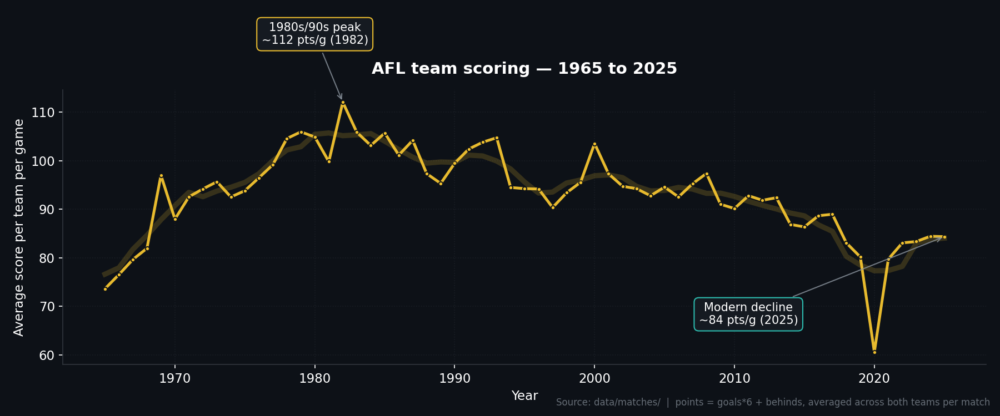

<!-- SCORING-DECADE-CHART-START -->
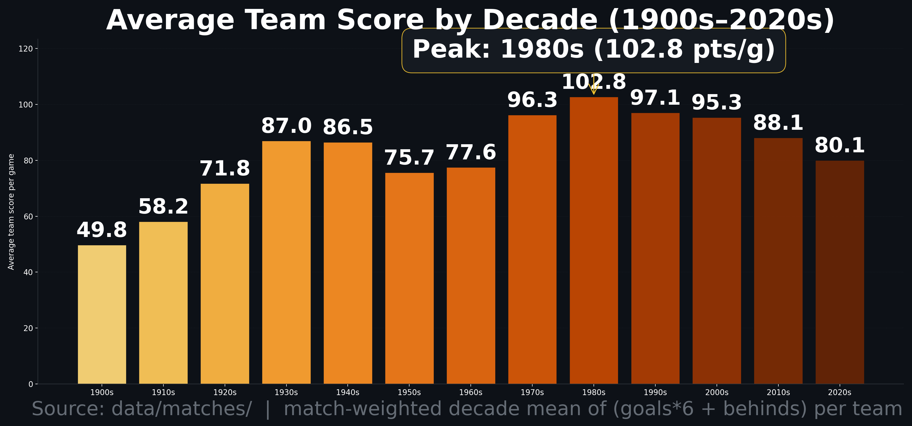
<!-- SCORING-DECADE-CHART-END -->

| Per team, per game | pre-1965 | 1965–1990 | 1991–2010 | 2011–now |
|---|---:|---:|---:|---:|
| Goals | **10.1** | 13.9 | 13.9 | 12.3 |
| Behinds | 12.0 | 13.6 | 12.2 | **11.0** |
| Total points | 72.5 | **96.8** | 95.7 | 84.9 |
| Scoring shots | 22.1 | **27.5** | 26.1 | 23.3 |
| Goal accuracy | 45.2% | 50.1% | **53.0%** | 52.7% |
| Match total points | 145 | 193 | 191 | **170** |

A few things jump out that contradict the usual barbershop wisdom:

- **The high-scoring era was the 1980s, not now.** A team-game in 1965–1990 averaged 96.75 points — modern teams average 84.88. That's a 12% drop in per-team scoring from the Hudson/Lockett era to the Daicos era. Total match scoring is down 23 points per game from the peak.
- **Modern players are NOT more accurate in front of goal in any meaningful way.** Goal accuracy peaked in 1991–2010 at 53.0% and has actually slipped slightly to 52.7% in the modern era. The big jump was much earlier — pre-1965 footballers converted just 45.2% of their scoring shots, which lines up with rough grounds, leather balls that swelled in the rain, and longer drop kicks rather than today's set-shot routines.
- **Modern teams have fewer scoring shots, not just less accuracy.** Scoring shots per team-game: 27.5 (1965–1990) → 26.1 → 23.3. That's 4 fewer scoring shots per team per game vs the 80s.

#### Player workload — the most dramatic change in footy

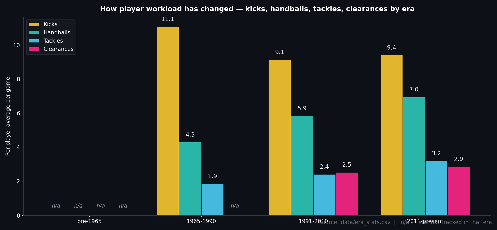

<!-- TACKLES-CLEARANCES-CHART-START -->
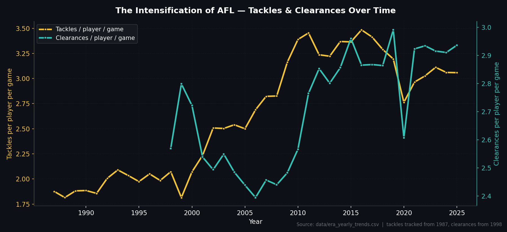
<!-- TACKLES-CLEARANCES-CHART-END -->

| Per player, per game | pre-1965 | 1965–1990 | 1991–2010 | 2011–now |
|---|---:|---:|---:|---:|
| Kicks | n/a | 11.08 | 9.15 | 9.41 |
| Handballs | n/a | 4.31 | 5.85 | **6.95** |
| Disposals | n/a | 14.89 | 14.72 | **16.21** |
| Marks | n/a | 3.76 | 4.11 | 4.22 |
| Tackles | n/a | 1.86 | 2.42 | **3.20** |
| Clearances | n/a | n/a | 2.54 | 2.87 |
| Contested possessions | n/a | n/a | 5.65 | 6.27 |

Read the kicks/handballs row carefully — this is the single biggest shift in how footy is played:

- **Handballs are up 61%** since 1965–1990 (4.31/g → 6.95/g). **Kicks are down 15%** in the same window (11.08/g → 9.41/g). The modern game is a handball game wearing a kicking game's uniform. Players today move the ball more often, but they move it shorter and faster.
- **Tackles are up 72%** from the 1965–1990 era (1.86/g → 3.20/g). Even just inside the modern stat era, tackles per player jumped 32% from 2.42 (1991–2010) to 3.20 (2011–now). Pressure is the defining tactical innovation of the post-2010 game, and the data is unambiguous about it.
- **Disposals per player are up about 9%** from the 80s (14.89 → 16.21). Combined with smaller rosters and more interchanges, that means individual ball-winners are doing more.
- **Contested possessions are up 11%** since 1991–2010 (5.65 → 6.27). The contested-ball revolution that coaches talk about is real and measurable.
- **Cohen's d for the tackles shift between 1991–2010 and the modern era is +0.41** — a moderate effect size in statistical terms. For context, that's a bigger jump than nearly every other player metric across any era boundary.

#### What the numbers don't tell us

A few honest caveats — because nothing about the past 125 years is a controlled experiment.

- **Hit-outs jumped from ~10 per ruckman/game in 2016 to ~17 in 2017** and stayed there. That's almost certainly a recording-method change at AFL Stats, not a sudden ruck revolution. Treat any hit-out comparison crossing 2016/2017 with a grain of salt.
- **Tackles in 1965–1990** look low (1.86/g) partly because the AFL didn't actually start counting tackles until 1987. The mean is dragged down by 22 years of missing data inside that bucket. The real "old footy" baseline is roughly the 1987–1990 sub-window.
- **2026 is partial** — only the first 8 rounds — so it's included in the 2011–present bucket but doesn't change the pattern materially.
- **Statistical tests are reported with a "rough indicator" caveat.** The 687k player-game rows aren't independent (same players appear hundreds of times), so the p-values from the Welch tests in `data/era_significance_tests.csv` should be read alongside the effect sizes (Cohen's d), which are more honest about practical significance.

The full era-by-era breakdown lives in `data/era_stats.csv`, the matches-level scoring numbers in `data/era_team_scoring.csv`, and the year-by-year trends in `data/era_yearly_trends.csv` — all rebuilt by running `era_based_statistical_analysis.py`.

### 2026 season — live team analysis

<!-- 2026-TEAM-ANALYSIS-START -->
Through 8 rounds of the 2026 season, the league averages out at around 367 disposals, 215 kicks, 152 handballs, 56 tackles, 35 clearances and 13 goals per team per game. **Greater Western Sydney** lead the comp for total disposals (399.3/g), with **Brisbane Lions** winning the most clearances (42.1/g) and **Sydney** the most physical side (64.0 tackles/g). **Sydney** are the highest-scoring team at 17.3 goals/g, while **Richmond** prop up the table on both fronts — only 326.1 disposals/g and 8.4 goals/g. At the individual level, **Nick Daicos** (Collingwood) is the leading ball-winner at 37.0 disposals/game. Caveat: this is a small sample — single-season form can swing by round, so treat the rankings below as a snapshot rather than a settled hierarchy.

#### All 18 teams ranked by total disposals — 2026 season-to-date

| # | Team | G | Disp/g | Kicks | Handballs | Marks | Goals | Tackles | Clearances | I50s | CP | Form tag |
| ---: | :--- | ---: | ---: | ---: | ---: | ---: | ---: | ---: | ---: | ---: | ---: | :--- |
| 1 | Greater Western Sydney | 7 | 399.3 | 217.7 | 181.6 | 95.0 | 12.3 | 54.3 | 33.3 | 57.4 | 134.4 | ball-winners, territory team |
| 2 | Sydney | 7 | 392.4 | 212.9 | 179.6 | 82.7 | 17.3 | 64.0 | 37.0 | 64.6 | 138.9 | ball-winners, contested-ball team |
| 3 | Collingwood | 7 | 387.1 | 224.0 | 163.1 | 113.0 | 11.9 | 55.4 | 28.9 | 53.6 | 118.7 | ball-winners |
| 4 | Hawthorn | 7 | 383.9 | 230.1 | 153.7 | 106.9 | 15.1 | 59.0 | 36.9 | 55.6 | 129.6 | scoring threat |
| 5 | North Melbourne | 7 | 380.7 | 221.7 | 159.0 | 101.0 | 14.4 | 58.0 | 37.1 | 51.4 | 128.6 | clearance machine |
| 6 | St Kilda | 7 | 380.3 | 232.7 | 147.6 | 101.4 | 13.6 | 53.0 | 35.7 | 52.9 | 130.3 | mid-pack |
| 7 | Fremantle | 7 | 377.7 | 212.9 | 164.9 | 88.1 | 13.1 | 59.9 | 35.9 | 52.9 | 138.6 | contested-ball team, physical unit |
| 8 | Brisbane Lions | 7 | 377.3 | 247.9 | 129.4 | 117.0 | 14.9 | 46.1 | 42.1 | 57.0 | 131.7 | clearance machine, low pressure |
| 9 | Geelong | 7 | 371.9 | 225.1 | 146.7 | 96.4 | 13.6 | 63.9 | 34.9 | 57.1 | 132.4 | physical unit |
| 10 | Western Bulldogs | 7 | 368.6 | 209.1 | 159.4 | 86.1 | 12.9 | 57.9 | 38.4 | 51.0 | 126.9 | clearance machine |
| 11 | Gold Coast | 7 | 368.0 | 196.0 | 172.0 | 82.0 | 15.3 | 56.1 | 33.4 | 59.0 | 129.6 | scoring threat, territory team |
| 12 | Carlton | 7 | 365.3 | 208.9 | 156.4 | 83.7 | 11.6 | 59.0 | 36.0 | 49.9 | 138.3 | contested-ball team, struggling in front of goal |
| 13 | Essendon | 7 | 359.4 | 202.7 | 156.7 | 92.4 | 12.0 | 49.7 | 29.1 | 44.9 | 116.7 | low pressure |
| 14 | Port Adelaide | 7 | 349.9 | 224.3 | 125.6 | 108.0 | 12.9 | 55.9 | 33.9 | 52.7 | 117.7 | mid-pack |
| 15 | Melbourne | 7 | 346.6 | 209.6 | 137.0 | 85.9 | 14.9 | 55.1 | 35.0 | 57.4 | 128.0 | territory team |
| 16 | Adelaide | 7 | 345.4 | 218.1 | 127.3 | 86.9 | 12.7 | 57.0 | 30.7 | 48.4 | 128.4 | starved of the ball, strong rebound |
| 17 | West Coast | 7 | 326.7 | 194.6 | 132.1 | 82.6 | 9.3 | 52.9 | 32.7 | 46.6 | 123.0 | starved of the ball, struggling in front of goal |
| 18 | Richmond | 7 | 326.1 | 187.0 | 139.1 | 80.9 | 8.4 | 52.1 | 32.0 | 48.1 | 119.4 | starved of the ball, low pressure |

#### League leaders by stat category — 2026

| Stat | League leader | Their avg/g | League avg/g | Delta vs league |
| :--- | :--- | ---: | ---: | ---: |
| Disposals | Greater Western Sydney | 399.3 | 367.0 | +32.3 |
| Kicks | Brisbane Lions | 247.9 | 215.3 | +32.6 |
| Handballs | Greater Western Sydney | 181.6 | 151.7 | +29.9 |
| Marks | Brisbane Lions | 117.0 | 93.9 | +23.1 |
| Goals | Sydney | 17.3 | 13.1 | +4.2 |
| Tackles | Sydney | 64.0 | 56.1 | +7.9 |
| Clearances | Brisbane Lions | 42.1 | 34.6 | +7.5 |
| Inside-50s | Sydney | 64.6 | 53.4 | +11.2 |
| Contested possessions | Sydney | 138.9 | 128.4 | +10.5 |
| Rebound-50s | Adelaide | 43.9 | 39.4 | +4.5 |
| Hit-outs | Hawthorn | 46.7 | 32.6 | +14.1 |
| Contested marks | Hawthorn | 10.7 | 8.8 | +1.9 |

<!-- GOALS-DISPOSALS-CHART-START -->
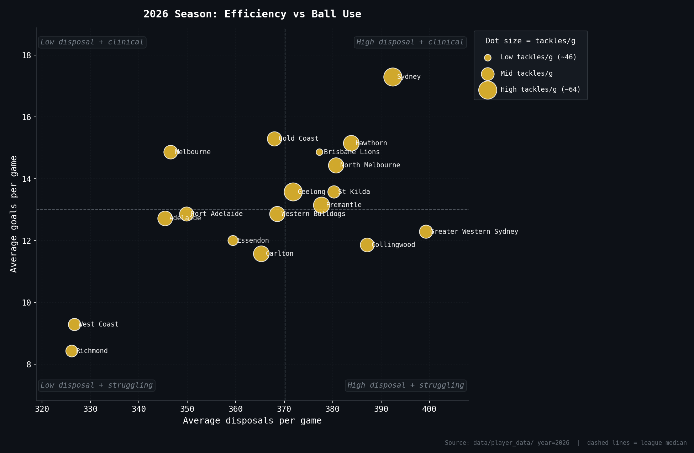
<!-- GOALS-DISPOSALS-CHART-END -->

#### Visual snapshot — top-6 radar and league-wide rank heatmap

The radar chart below picks out the top six disposal teams of the 2026 season-to-date and plots them against the six core dimensions, normalised to a 0-1 scale relative to all 18 sides — a value of 1.0 on an axis means that team is the league best on that stat. The heatmap underneath shows every team's rank across eight key stats (1 = league best in green, 18 = worst in red), with rows ordered by disposals rank.

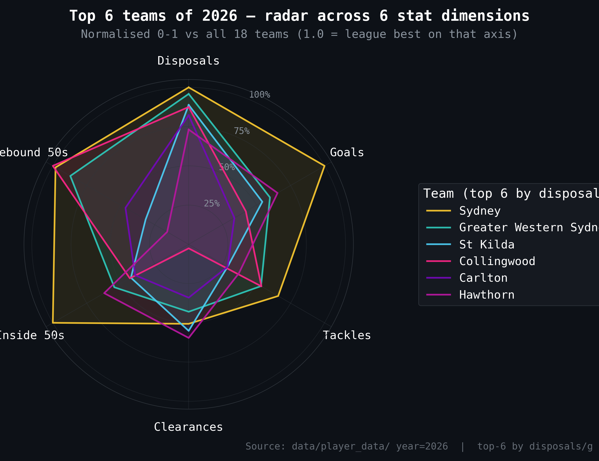

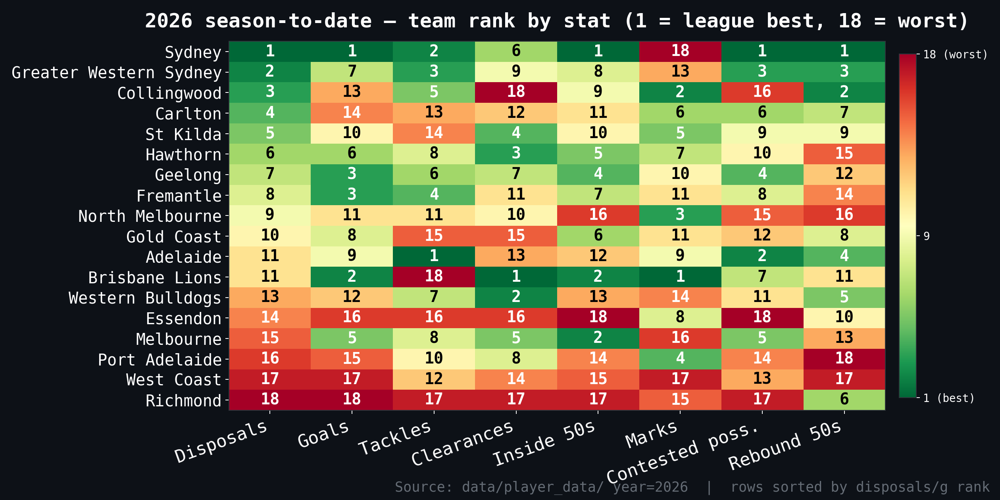

<!-- FORM-TREND-CHART-START -->
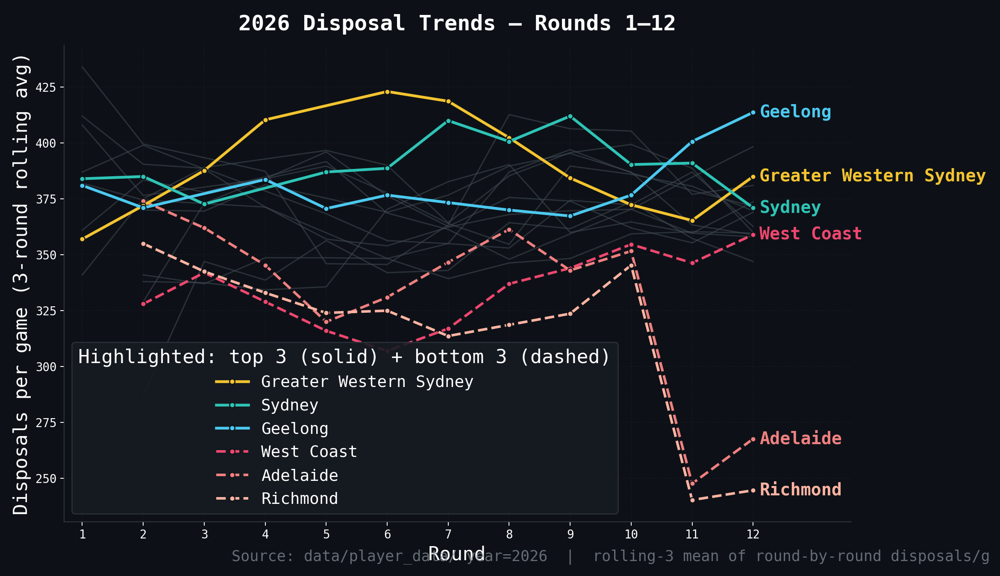
<!-- FORM-TREND-CHART-END -->

#### Team-by-team — playing style, strengths and weaknesses

Every paragraph below is generated from the team's actual 2026 stat profile (averages and league ranks across 16 stat categories). The strategy descriptions are derived from rank combinations, not hand-written takes — so they update automatically as the season progresses. Rank 1 = best, rank 18 = worst (for clangers and free kicks against, lower raw values are better, so rank 1 still means the desirable end).

#### Greater Western Sydney

After 7 games of 2026, the Greater Western Sydney sit near the top of the league for ball use (1st for disposals) and average 399.3 disposals, 12.3 goals and 54.3 tackles per game. Their stat profile reads as a contest-heavy approach at the stoppages; a high-tempo handball game (45% of disposals by hand); pumping the ball forward with high volume but little control inside 50. They go inside 50 57.4 times a game (3rd in the league), win 134.4 contested possessions (4th) and tilt 45/55 between handball and kick. The strengths jump out clearly: they're 1st for disposals (399.3/g), 1st for handballs (181.6/g), 1st for uncontested possessions (256.1/g). The flip side is harder to ignore: 17th for clangers (61.0/g), 16th for free kicks against (20.9/g), 15th for free kicks for (16.7/g) — that's where opposition coaches will be drawing up plans. Key player to watch is **Clayton Oliver**, leading the team in disposals at 30.9/game.

#### Sydney

After 7 games of 2026, the Sydney sit near the top of the league for ball use (2nd for disposals) and average 392.4 disposals, 17.3 goals and 64.0 tackles per game. Their stat profile reads as a contested-ball, clearance-first identity; a high-tempo handball game (46% of disposals by hand); dominating territory and connecting cleanly inside 50. They go inside 50 64.6 times a game (1st in the league), win 138.9 contested possessions (1st) and tilt 46/54 between handball and kick. The strengths jump out clearly: they're 1st for goals (17.3/g), 1st for tackles (64.0/g), 1st for inside-50s (64.6/g). The flip side is harder to ignore: 18th for clangers (65.6/g), 15th for marks (82.7/g), 13th for free kicks against (20.6/g) — that's where opposition coaches will be drawing up plans. Key player to watch is **Justin Mcinerney**, leading the team in disposals at 25.6/game.

#### Collingwood

After 7 games of 2026, the Collingwood sit near the top of the league for ball use (3rd for disposals) and average 387.1 disposals, 11.9 goals and 55.4 tackles per game. Their stat profile reads as a possession-and-control style that shies away from the contest. They go inside 50 53.6 times a game (8th in the league), win 118.7 contested possessions (16th) and tilt 42/58 between handball and kick. The strengths jump out clearly: they're 2nd for marks (113.0/g), 2nd for uncontested possessions (254.1/g), 2nd for clangers (53.6/g). The flip side is harder to ignore: 18th for clearances (28.9/g), 16th for contested possessions (118.7/g), 15th for goals (11.9/g) — that's where opposition coaches will be drawing up plans. Key player to watch is **Nick Daicos**, leading the team in disposals at 37.0/game.

#### Hawthorn

After 7 games of 2026, the Hawthorn sit near the top of the league for ball use (4th for disposals) and average 383.9 disposals, 15.1 goals and 59.0 tackles per game. Their stat profile reads as a possession-based, uncontested-game template; backed up by elite forward and ground-ball pressure. They go inside 50 55.6 times a game (7th in the league), win 129.6 contested possessions (8th) and tilt 40/60 between handball and kick. The strengths jump out clearly: they're 1st for hit-outs (46.7/g), 1st for contested marks (10.7/g), 3rd for kicks (230.1/g). The flip side is harder to ignore: 11th for rebound-50s (39.6/g), 11th for free kicks for (17.4/g), 10th for handballs (153.7/g) — that's where opposition coaches will be drawing up plans. Key player to watch is **Jai Newcombe**, leading the team in disposals at 26.4/game.

#### North Melbourne

After 7 games of 2026, the North Melbourne are tracking inside the top half (5th for disposals) and average 380.7 disposals, 14.4 goals and 58.0 tackles per game. Their stat profile reads as a possession-based, uncontested-game template; backed up by elite forward and ground-ball pressure. They go inside 50 51.4 times a game (12th in the league), win 128.6 contested possessions (10th) and tilt 42/58 between handball and kick. The strengths jump out clearly: they're 3rd for clearances (37.1/g), 3rd for uncontested possessions (243.9/g), 3rd for free kicks for (20.4/g). The flip side is harder to ignore: 17th for free kicks against (21.4/g), 13th for hit-outs (28.7/g), 12th for inside-50s (51.4/g) — that's where opposition coaches will be drawing up plans. Key player to watch is **Harry Sheezel**, leading the team in disposals at 32.7/game.

#### St Kilda

After 7 games of 2026, the St Kilda are tracking inside the top half (6th for disposals) and average 380.3 disposals, 13.6 goals and 53.0 tackles per game. Their stat profile reads as a possession-based, uncontested-game template; with notably soft pressure around the ball. They go inside 50 52.9 times a game (9th in the league), win 130.3 contested possessions (7th) and tilt 39/61 between handball and kick. The strengths jump out clearly: they're 2nd for kicks (232.7/g), 2nd for free kicks against (15.7/g), 4th for free kicks for (20.1/g). The flip side is harder to ignore: 14th for tackles (53.0/g), 11th for handballs (147.6/g), 10th for hit-outs (31.9/g) — that's where opposition coaches will be drawing up plans. Key player to watch is **Jack Sinclair**, leading the team in disposals at 30.1/game.

#### Fremantle

After 7 games of 2026, the Fremantle are tracking inside the top half (7th for disposals) and average 377.7 disposals, 13.1 goals and 59.9 tackles per game. Their stat profile reads as a contest-heavy approach at the stoppages; backed up by elite forward and ground-ball pressure; frequently absorbing entries and rebounding from defence. They go inside 50 52.9 times a game (9th in the league), win 138.6 contested possessions (2nd) and tilt 44/56 between handball and kick. The strengths jump out clearly: they're 2nd for contested possessions (138.6/g), 3rd for tackles (59.9/g), 3rd for rebound-50s (41.9/g). The flip side is harder to ignore: 18th for free kicks for (16.1/g), 10th for kicks (212.9/g), 10th for marks (88.1/g) — that's where opposition coaches will be drawing up plans. Key player to watch is **Caleb Serong**, leading the team in disposals at 25.7/game.

#### Brisbane Lions

After 7 games of 2026, the Brisbane Lions are tracking inside the top half (8th for disposals) and average 377.3 disposals, 14.9 goals and 46.1 tackles per game. Their stat profile reads as a contested-ball, clearance-first identity; a kick-first ball movement (66% by foot); dominating territory and connecting cleanly inside 50. They go inside 50 57.0 times a game (6th in the league), win 131.7 contested possessions (6th) and tilt 34/66 between handball and kick. The strengths jump out clearly: they're 1st for kicks (247.9/g), 1st for marks (117.0/g), 1st for clearances (42.1/g). The flip side is harder to ignore: 18th for tackles (46.1/g), 16th for handballs (129.4/g), 16th for rebound-50s (36.6/g) — that's where opposition coaches will be drawing up plans. Key player to watch is **Lachie Neale**, leading the team in disposals at 31.1/game.

#### Geelong

After 7 games of 2026, the Geelong are floating around the middle of the pack (9th for disposals) and average 371.9 disposals, 13.6 goals and 63.9 tackles per game. Their stat profile reads as a contest-heavy approach at the stoppages; backed up by elite forward and ground-ball pressure. They go inside 50 57.1 times a game (5th in the league), win 132.4 contested possessions (5th) and tilt 39/61 between handball and kick. The strengths jump out clearly: they're 2nd for tackles (63.9/g), 2nd for free kicks for (23.4/g), 4th for kicks (225.1/g). The flip side is harder to ignore: 13th for rebound-50s (37.6/g), 13th for clangers (58.6/g), 12th for handballs (146.7/g) — that's where opposition coaches will be drawing up plans. Key player to watch is **Bailey Smith**, leading the team in disposals at 32.0/game.

#### Western Bulldogs

After 7 games of 2026, the Western Bulldogs are floating around the middle of the pack (10th for disposals) and average 368.6 disposals, 12.9 goals and 57.9 tackles per game. Their stat profile reads as struggling to win territory and force the issue forward; frequently absorbing entries and rebounding from defence. They go inside 50 51.0 times a game (13th in the league), win 126.9 contested possessions (13th) and tilt 43/57 between handball and kick. The strengths jump out clearly: they're 2nd for clearances (38.4/g), 6th for handballs (159.4/g), 6th for rebound-50s (41.3/g). The flip side is harder to ignore: 18th for contested marks (6.1/g), 13th for kicks (209.1/g), 13th for inside-50s (51.0/g) — that's where opposition coaches will be drawing up plans. Key player to watch is **Marcus Bontempelli**, leading the team in disposals at 26.6/game.

#### Gold Coast

After 7 games of 2026, the Gold Coast are floating around the middle of the pack (11th for disposals) and average 368.0 disposals, 15.3 goals and 56.1 tackles per game. Their stat profile reads as a high-tempo handball game (47% of disposals by hand). They go inside 50 59.0 times a game (2nd in the league), win 129.6 contested possessions (8th) and tilt 47/53 between handball and kick. The strengths jump out clearly: they're 2nd for goals (15.3/g), 2nd for inside-50s (59.0/g), 3rd for handballs (172.0/g). The flip side is harder to ignore: 18th for free kicks against (22.0/g), 17th for marks (82.0/g), 16th for kicks (196.0/g) — that's where opposition coaches will be drawing up plans. Key player to watch is **Christian Petracca**, leading the team in disposals at 26.0/game.

#### Carlton

After 7 games of 2026, the Carlton are floating around the middle of the pack (12th for disposals) and average 365.3 disposals, 11.6 goals and 59.0 tackles per game. Their stat profile reads as a contested-ball, clearance-first identity; struggling to win territory and force the issue forward; backed up by elite forward and ground-ball pressure. They go inside 50 49.9 times a game (14th in the league), win 138.3 contested possessions (3rd) and tilt 43/57 between handball and kick. The strengths jump out clearly: they're 2nd for rebound-50s (43.1/g), 3rd for contested possessions (138.3/g), 4th for tackles (59.0/g). The flip side is harder to ignore: 17th for marks inside 50 (8.9/g), 16th for goals (11.6/g), 16th for clangers (60.1/g) — that's where opposition coaches will be drawing up plans. Key player to watch is **Sam Walsh**, leading the team in disposals at 28.7/game.

#### Essendon

After 7 games of 2026, the Essendon are sitting in the lower third for ball use (13th for disposals) and average 359.4 disposals, 12.0 goals and 49.7 tackles per game. Their stat profile reads as struggling to win territory and force the issue forward; with notably soft pressure around the ball. They go inside 50 44.9 times a game (18th in the league), win 116.7 contested possessions (18th) and tilt 44/56 between handball and kick. The strengths jump out clearly: they're 1st for clangers (52.0/g), 5th for free kicks against (17.4/g), 8th for handballs (156.7/g). The flip side is harder to ignore: 18th for inside-50s (44.9/g), 18th for contested possessions (116.7/g), 17th for tackles (49.7/g) — that's where opposition coaches will be drawing up plans. Key player to watch is **Archie Roberts**, leading the team in disposals at 32.1/game.

#### Port Adelaide

After 7 games of 2026, the Port Adelaide are sitting in the lower third for ball use (14th for disposals) and average 349.9 disposals, 12.9 goals and 55.9 tackles per game. Their stat profile reads as a kick-first ball movement (64% by foot). They go inside 50 52.7 times a game (11th in the league), win 117.7 contested possessions (17th) and tilt 36/64 between handball and kick. The strengths jump out clearly: they're 2nd for marks inside 50 (14.7/g), 3rd for marks (108.0/g), 5th for kicks (224.3/g). The flip side is harder to ignore: 18th for handballs (125.6/g), 18th for rebound-50s (32.1/g), 17th for contested possessions (117.7/g) — that's where opposition coaches will be drawing up plans. Key player to watch is **Zak Butters**, leading the team in disposals at 30.7/game.

#### Melbourne

After 7 games of 2026, the Melbourne are sitting in the lower third for ball use (15th for disposals) and average 346.6 disposals, 14.9 goals and 55.1 tackles per game. Their stat profile reads as dominating territory and connecting cleanly inside 50. They go inside 50 57.4 times a game (3rd in the league), win 128.0 contested possessions (12th) and tilt 40/60 between handball and kick. The strengths jump out clearly: they're 1st for free kicks against (14.1/g), 2nd for hit-outs (44.0/g), 3rd for inside-50s (57.4/g). The flip side is harder to ignore: 17th for free kicks for (16.6/g), 16th for uncontested possessions (204.1/g), 16th for rebound-50s (36.6/g) — that's where opposition coaches will be drawing up plans. Key player to watch is **Jack Steele**, leading the team in disposals at 24.9/game.

#### Adelaide

After 7 games of 2026, the Adelaide are anchored near the bottom of the table (16th for disposals) and average 345.4 disposals, 12.7 goals and 57.0 tackles per game. Their stat profile reads as a kick-first ball movement (63% by foot); struggling to win territory and force the issue forward; frequently absorbing entries and rebounding from defence. They go inside 50 48.4 times a game (15th in the league), win 128.4 contested possessions (11th) and tilt 37/63 between handball and kick. The strengths jump out clearly: they're 1st for rebound-50s (43.9/g), 6th for free kicks against (17.6/g), 8th for kicks (218.1/g). The flip side is harder to ignore: 18th for hit-outs (9.3/g), 17th for handballs (127.3/g), 16th for disposals (345.4/g) — that's where opposition coaches will be drawing up plans. Key player to watch is **Wayne Milera**, leading the team in disposals at 25.0/game.

#### West Coast

After 7 games of 2026, the West Coast are anchored near the bottom of the table (17th for disposals) and average 326.7 disposals, 9.3 goals and 52.9 tackles per game. Their stat profile reads as struggling to win territory and force the issue forward; with notably soft pressure around the ball. They go inside 50 46.6 times a game (17th in the league), win 123.0 contested possessions (14th) and tilt 40/60 between handball and kick. The strengths jump out clearly: they're 8th for free kicks for (18.7/g), 12th for rebound-50s (38.6/g), 12th for clangers (57.6/g). The flip side is harder to ignore: 18th for uncontested possessions (196.7/g), 17th for disposals (326.7/g), 17th for kicks (194.6/g) — that's where opposition coaches will be drawing up plans. Key player to watch is **Harley Reid**, leading the team in disposals at 22.9/game.

#### Richmond

After 7 games of 2026, the Richmond are anchored near the bottom of the table (18th for disposals) and average 326.1 disposals, 8.4 goals and 52.1 tackles per game. Their stat profile reads as struggling to win territory and force the issue forward; with notably soft pressure around the ball. They go inside 50 48.1 times a game (16th in the league), win 119.4 contested possessions (15th) and tilt 43/57 between handball and kick. The strengths jump out clearly: they're 5th for free kicks for (19.6/g), 9th for free kicks against (18.7/g), 12th for contested marks (8.4/g). The flip side is harder to ignore: 18th for disposals (326.1/g), 18th for kicks (187.0/g), 18th for marks (80.9/g) — that's where opposition coaches will be drawing up plans. Key player to watch is **Jayden Short**, leading the team in disposals at 25.5/game.

<!-- 2026-TEAM-ANALYSIS-END -->

### 2026 finals pathway — what each team needs

<!-- 2026-FINALS-PATHWAY-START -->
What does each AFL team need to do — from here — to make finals this year, and what would have to go right for them to play in the grand final? After Round 8 of the 2026 season, every side has played 7 games with roughly 15 games left in the home-and-away. The paragraphs below combine the actual 2026 ladder (wins, losses, percentage) with the team's stat profile across 16 categories to write an honest, data-driven mid-season assessment for each club. The grand-final read at the end of each paragraph maps to one of: **contender** (top-4, elite stat profile), **live chance** (top-8 with weapons), **chance** (top-8 without breadth), **long shot** (9-12), **mathematically alive** (13-16) or **season effectively over** (17-18) — the cut-offs are deliberately blunt.

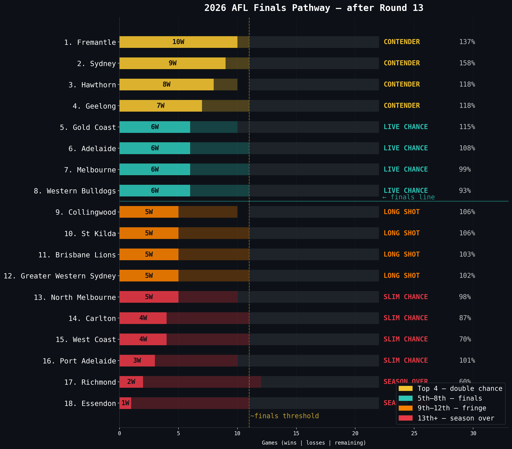


#### 1st — Sydney

**Sydney** sit 1st on the ladder after Round 8 (6-1, 24 points, 178.1%) — their job is to hold the double-chance, not chase it — every win from here is locking in a top-4 finish, not scrambling for one. On the underlying numbers they are top-4 for goals (1st), top-4 for clearances (4th), top-4 for tackles (1st) — that's the stat fingerprint behind the ladder position. From here, the one thing they must keep doing is their goals (1st of 18) — that is the engine of the run. For finals positioning, their nearest finals rival is **Fremantle** (6-1, 2nd) — the team most likely to bump them out if they slip. Grand final read: **contender**. They have the ladder buffer and the stat profile of a side built to play deep in September — 5 of the five core categories sit top-5, which is what every recent premier has had at this point of the year.

#### 2nd — Fremantle

**Fremantle** sit 2nd on the ladder after Round 8 (6-1, 24 points, 137.6%) — their job is to hold the double-chance, not chase it — every win from here is locking in a top-4 finish, not scrambling for one. On the underlying numbers they are top-4 for tackles (3rd), top-4 for contested possessions (2nd) — that's the stat fingerprint behind the ladder position. From here, the one thing they must keep doing is their contested possessions (2nd of 18) — that is the engine of the run. For finals positioning, their nearest finals rival is **Hawthorn** (6-1, 3rd) — the team most likely to bump them out if they slip. Grand final read: **live chance**. The ladder position is right and the stat profile has real weapons, but they will need to either climb a rung or two further or peak at the right time — flag-winners from outside the top four are the historical exception, not the rule.

#### 3rd — Hawthorn

**Hawthorn** sit 3rd on the ladder after Round 8 (6-1, 24 points, 124.5%) — their job is to hold the double-chance, not chase it — every win from here is locking in a top-4 finish, not scrambling for one. On the underlying numbers they are top-4 for goals (3rd), top-4 for tackles (4th) — that's the stat fingerprint behind the ladder position. From here, the one thing they must keep doing is their goals (3rd of 18) — that is the engine of the run. For finals positioning, their nearest finals rival is **Melbourne** (5-2, 4th) — the team most likely to bump them out if they slip. Grand final read: **contender**. They have the ladder buffer and the stat profile of a side built to play deep in September — 3 of the five core categories sit top-5, which is what every recent premier has had at this point of the year.

#### 4th — Melbourne

**Melbourne** sit 4th on the ladder after Round 8 (5-2, 20 points, 102.8%) — their job is to hold the double-chance, not chase it — every win from here is locking in a top-4 finish, not scrambling for one. On the underlying numbers they are top-4 for goals (4th), top-4 for inside-50s (3rd) — that's the stat fingerprint behind the ladder position. From here, the one thing they must keep doing is their inside-50s (3rd of 18) — that is the engine of the run. For finals positioning, their nearest finals rival is **Brisbane Lions** (4-3, 5th) — the team most likely to bump them out if they slip. Grand final read: **live chance**. The ladder position is right and the stat profile has real weapons, but they will need to either climb a rung or two further or peak at the right time — flag-winners from outside the top four are the historical exception, not the rule.

#### 5th — Brisbane Lions

**Brisbane Lions** sit 5th on the ladder after Round 8 (4-3, 16 points, 118.8%) — they need roughly 8 wins from their remaining 15 games to lock the eight in, which their form line is comfortably on track to do. On the underlying numbers they are top-4 for goals (4th), top-4 for clearances (1st), bottom-4 for tackles (18th) — that's the stat fingerprint behind the ladder position. From here, the one thing they have to fix is their tackles ranking (18th of 18) — every finals-tier opponent will target it. For finals positioning, their nearest finals rival is **North Melbourne** (4-3, 6th) — the team most likely to bump them out if they slip. Grand final read: **live chance**. The ladder position is right and the stat profile has real weapons, but they will need to either climb a rung or two further or peak at the right time — flag-winners from outside the top four are the historical exception, not the rule.

#### 6th — North Melbourne

**North Melbourne** sit 6th on the ladder after Round 8 (4-3, 16 points, 115.9%) — they need roughly 8 wins from their remaining 15 games to lock the eight in, which their form line is comfortably on track to do. On the underlying numbers they are top-4 for clearances (3rd) — that's the stat fingerprint behind the ladder position. From here, no single stat screams crisis, but they need every part of their game to lift a notch to be a serious finals threat. For finals positioning, their nearest finals rival is **Gold Coast** (4-3, 7th) — the team most likely to bump them out if they slip. Grand final read: **chance, not a contender**. Sitting inside the eight is the easy bit; the stat profile doesn't yet have the breadth to beat top-4 sides three weeks running, which is what the path demands once finals arrive.

#### 7th — Gold Coast

**Gold Coast** sit 7th on the ladder after Round 8 (4-3, 16 points, 114.4%) — they need roughly 8 wins from their remaining 15 games to lock the eight in, which their form line is comfortably on track to do. On the underlying numbers they are top-4 for goals (2nd), top-4 for inside-50s (2nd) — that's the stat fingerprint behind the ladder position. From here, the one thing they have to fix is their marks ranking (17th of 18) — every finals-tier opponent will target it. For finals positioning, their nearest finals rival is **Collingwood** (4-3, 8th) — the team most likely to bump them out if they slip. Grand final read: **live chance**. The ladder position is right and the stat profile has real weapons, but they will need to either climb a rung or two further or peak at the right time — flag-winners from outside the top four are the historical exception, not the rule.

#### 8th — Collingwood

**Collingwood** sit 8th on the ladder after Round 8 (4-3, 16 points, 110.2%) — they need roughly 8 wins from their remaining 15 games to lock the eight in, which their form line is comfortably on track to do. On the underlying numbers they are bottom-4 for goals (15th), bottom-4 for clearances (18th), bottom-4 for contested possessions (16th) — that's the stat fingerprint behind the ladder position. From here, the one thing they have to fix is their clearances ranking (18th of 18) — every finals-tier opponent will target it. For finals positioning, their nearest finals rival is **Geelong** (4-3, 9th) — the team most likely to bump them out if they slip. Grand final read: **chance, not a contender**. Sitting inside the eight is the easy bit; the stat profile doesn't yet have the breadth to beat top-4 sides three weeks running, which is what the path demands once finals arrive.

#### 9th — Geelong

**Geelong** sit 9th on the ladder after Round 8 (4-3, 16 points, 108.6%) — ~8 wins from 15 games gets them back in — very doable on paper, but with no margin for a flat patch. On the underlying numbers they are top-4 for tackles (2nd) — that's the stat fingerprint behind the ladder position. From here, the one thing they have to fix is their rebound-50s ranking (13th of 18) — every finals-tier opponent will target it. For finals positioning, the side blocking their road back in is **Collingwood** (4-3, 8th) — leapfrog them and the finals door reopens. Grand final read: **realistically out of premiership contention**. Even if they sneak into the eight from here, finishing 7th or 8th means winning four straight against teams who finished above them — that's not how flags get won.

#### 10th — Western Bulldogs

**Western Bulldogs** sit 10th on the ladder after Round 8 (4-3, 16 points, 91.8%) — ~8 wins from 15 games gets them back in — very doable on paper, but with no margin for a flat patch. On the underlying numbers they are top-4 for clearances (2nd) — that's the stat fingerprint behind the ladder position. From here, the one thing they have to fix is their contested possessions ranking (13th of 18) — every finals-tier opponent will target it. For finals positioning, the side blocking their road back in is **Geelong** (4-3, 9th) — leapfrog them and the finals door reopens. Grand final read: **realistically out of premiership contention**. Even if they sneak into the eight from here, finishing 7th or 8th means winning four straight against teams who finished above them — that's not how flags get won.

#### 11th — Port Adelaide

**Port Adelaide** sit 11th on the ladder after Round 8 (3-4, 12 points, 112.5%) — ~9 wins from 15 games gets them back in — very doable on paper, but with no margin for a flat patch. On the underlying numbers they are bottom-4 for contested possessions (17th) — that's the stat fingerprint behind the ladder position. From here, the one thing they have to fix is their rebound-50s ranking (18th of 18) — every finals-tier opponent will target it. For finals positioning, the side blocking their road back in is **Western Bulldogs** (4-3, 10th) — leapfrog them and the finals door reopens. Grand final read: **realistically out of premiership contention**. Even if they sneak into the eight from here, finishing 7th or 8th means winning four straight against teams who finished above them — that's not how flags get won.

#### 12th — St Kilda

**St Kilda** sit 12th on the ladder after Round 8 (3-4, 12 points, 110.1%) — ~9 wins from 15 games gets them back in — very doable on paper, but with no margin for a flat patch. On the underlying numbers they sit broadly mid-pack across the core stat lines, which is consistent with their ladder position and means the form line is honest. From here, the one thing they have to fix is their tackles ranking (14th of 18) — every finals-tier opponent will target it. For finals positioning, the side blocking their road back in is **Port Adelaide** (3-4, 11th) — leapfrog them and the finals door reopens. Grand final read: **realistically out of premiership contention**. Even if they sneak into the eight from here, finishing 7th or 8th means winning four straight against teams who finished above them — that's not how flags get won.

#### 13th — Adelaide

**Adelaide** sit 13th on the ladder after Round 8 (3-4, 12 points, 96.1%) — they would need to win ~9 of their remaining 15 games to claim a finals spot, which would require a near-perfect run from here. On the underlying numbers they are bottom-4 for clearances (16th), bottom-4 for inside-50s (15th) — that's the stat fingerprint behind the ladder position. From here, the one thing they have to fix is their clearances ranking (16th of 18) — every finals-tier opponent will target it. For finals positioning, the side blocking their road back in is **St Kilda** (3-4, 12th) — leapfrog them and the finals door reopens. Grand final read: **no realistic path**. The maths technically still works — win out and percentage helps — but the form line and stat profile are pointing the other way, and no team has come from this deep at this point of the year to win a flag in the modern era.

#### 14th — Greater Western Sydney

**Greater Western Sydney** sit 14th on the ladder after Round 8 (3-4, 12 points, 89.8%) — they would need to win ~9 of their remaining 15 games to claim a finals spot, which would require a near-perfect run from here. On the underlying numbers they are top-4 for inside-50s (3rd), top-4 for contested possessions (4th) — that's the stat fingerprint behind the ladder position. From here, the one thing they have to fix is their goals ranking (13th of 18) — every finals-tier opponent will target it. For finals positioning, the side blocking their road back in is **Adelaide** (3-4, 13th) — leapfrog them and the finals door reopens. Grand final read: **no realistic path**. The maths technically still works — win out and percentage helps — but the form line and stat profile are pointing the other way, and no team has come from this deep at this point of the year to win a flag in the modern era.

#### 15th — West Coast

**West Coast** sit 15th on the ladder after Round 8 (2-5, 8 points, 55.8%) — they would need to win ~10 of their remaining 15 games to claim a finals spot, which would require a near-perfect run from here. On the underlying numbers they are bottom-4 for goals (17th), bottom-4 for tackles (15th), bottom-4 for inside-50s (17th) — that's the stat fingerprint behind the ladder position. From here, the one thing they have to fix is their goals ranking (17th of 18) — every finals-tier opponent will target it. For finals positioning, the side blocking their road back in is **Greater Western Sydney** (3-4, 14th) — leapfrog them and the finals door reopens. Grand final read: **no realistic path**. The maths technically still works — win out and percentage helps — but the form line and stat profile are pointing the other way, and no team has come from this deep at this point of the year to win a flag in the modern era.

#### 16th — Carlton

**Carlton** sit 16th on the ladder after Round 8 (1-6, 4 points, 80.3%) — they would need to win ~11 of their remaining 15 games to claim a finals spot, which would require a near-perfect run from here. On the underlying numbers they are bottom-4 for goals (16th), top-4 for tackles (4th), top-4 for contested possessions (3rd) — that's the stat fingerprint behind the ladder position. From here, the one thing they have to fix is their marks inside 50 ranking (17th of 18) — every finals-tier opponent will target it. For finals positioning, the side blocking their road back in is **West Coast** (2-5, 15th) — leapfrog them and the finals door reopens. Grand final read: **no realistic path**. The maths technically still works — win out and percentage helps — but the form line and stat profile are pointing the other way, and no team has come from this deep at this point of the year to win a flag in the modern era.

#### 17th — Essendon

**Essendon** sit 17th on the ladder after Round 8 (1-6, 4 points, 72.9%) — the maths is technically alive but the path requires a miracle run the form line does not support. On the underlying numbers they are bottom-4 for clearances (17th), bottom-4 for tackles (17th), bottom-4 for inside-50s (18th) — that's the stat fingerprint behind the ladder position. From here, the one thing they have to fix is their contested possessions ranking (18th of 18) — every finals-tier opponent will target it. For finals positioning, the side blocking their road back in is **Carlton** (1-6, 16th) — leapfrog them and the finals door reopens. Grand final read: **season effectively over**. Even a finals berth would require the kind of run that simply doesn't happen at AFL level — the priority from here is list build, draft position and next season.

#### 18th — Richmond

**Richmond** sit 18th on the ladder after Round 8 (0-7, 0 points, 54.2%) — the maths is technically alive but the path requires a miracle run the form line does not support. On the underlying numbers they are bottom-4 for goals (18th), bottom-4 for clearances (15th), bottom-4 for tackles (16th) — that's the stat fingerprint behind the ladder position. From here, the one thing they have to fix is their goals ranking (18th of 18) — every finals-tier opponent will target it. For finals positioning, the side blocking their road back in is **Essendon** (1-6, 17th) — leapfrog them and the finals door reopens. Grand final read: **season effectively over**. Even a finals berth would require the kind of run that simply doesn't happen at AFL level — the priority from here is list build, draft position and next season.
<!-- 2026-FINALS-PATHWAY-END -->

### 2026 Brownlow Medal predictor

<!-- 2026-BROWNLOW-PREDICTOR-START -->
The **Brownlow Medal** is the AFL's individual award for the "fairest and best" player, voted on by the on-field umpires with a 3-2-1 split per game. It is impossible to predict actual votes without modelling umpire behaviour, but we *can* build a defensible **statistical proxy** — a composite score over the stats that historically correlate with vote-earning. The weights below were validated against every player-game from 2010-2025 (n=145,150) where actual `brownlow_votes` are recorded — the top 1% of proxy games captured ~70% of vote-earning performances. Players need at least 3 games played to be ranked. Suspended players are not penalised — this proxy is a stat-profile model, not a vote forecaster.

**Composite formula** (z-scored across all eligible players, summed with weights): `0.30 × disposals + 0.22 × clearances + 0.18 × contested-poss + 0.15 × effective-disposals + 0.15 × goals`. Effective disposals are approximated as `disposals - clangers` because the raw data does not carry a true effective-disposal column. Goals are weighted higher than the conventional midfielder-only template (15% vs the ~5% common in pure-midfielder proxies) because that materially improves correlation with actual historical Brownlow votes.

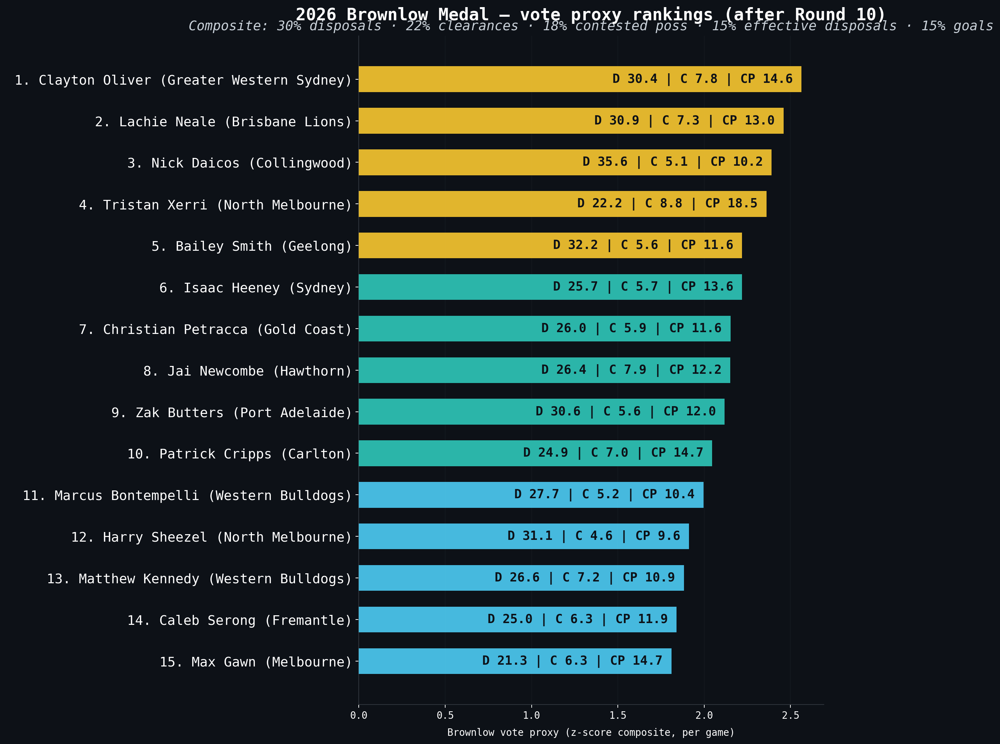

#### Top 15 Brownlow proxy candidates — 2026 season-to-date (after Round 8)

| Rank | Player | Team | Games | Disp/g | Clear/g | CP/g | Goals/g | Proxy | Proj. votes |
| ---: | --- | --- | ---: | ---: | ---: | ---: | ---: | ---: | ---: |
| 1 | Nick Daicos | Collingwood | 6 | 37.0 | 5.8 | 10.8 | 0.83 | +2.58 | +56.8 |
| 2 | Clayton Oliver | Greater Western Sydney | 7 | 30.9 | 7.1 | 14.9 | 0.29 | +2.47 | +54.3 |
| 3 | Lachie Neale | Brisbane Lions | 7 | 31.1 | 7.7 | 13.4 | 0.00 | +2.42 | +53.2 |
| 4 | Zak Butters | Port Adelaide | 7 | 30.7 | 6.0 | 12.3 | 0.29 | +2.12 | +46.6 |
| 5 | Bailey Smith | Geelong | 7 | 32.0 | 5.4 | 11.4 | 0.43 | +2.09 | +46.1 |
| 6 | Christian Petracca | Gold Coast | 5 | 26.0 | 5.8 | 11.6 | 2.00 | +2.09 | +45.9 |
| 7 | Patrick Cripps | Carlton | 7 | 25.4 | 7.4 | 15.6 | 0.29 | +2.07 | +45.6 |
| 8 | Jai Newcombe | Hawthorn | 7 | 26.4 | 7.9 | 12.3 | 0.43 | +2.06 | +45.4 |
| 9 | Isaac Heeney | Sydney | 5 | 24.6 | 6.0 | 12.8 | 2.00 | +2.04 | +44.9 |
| 10 | Harry Sheezel | North Melbourne | 7 | 32.7 | 5.0 | 10.1 | 0.43 | +2.01 | +44.2 |
| 11 | Caleb Serong | Fremantle | 7 | 25.7 | 6.4 | 12.9 | 0.71 | +1.92 | +42.2 |
| 12 | Tristan Xerri | North Melbourne | 4 | 21.0 | 7.5 | 17.5 | 0.25 | +1.89 | +41.5 |
| 13 | Marcus Bontempelli | Western Bulldogs | 7 | 26.6 | 4.9 | 11.1 | 1.43 | +1.82 | +40.0 |
| 14 | Matthew Kennedy | Western Bulldogs | 7 | 26.3 | 7.1 | 11.3 | 0.29 | +1.82 | +39.9 |
| 15 | Max Gawn | Melbourne | 7 | 21.9 | 6.4 | 15.6 | 0.57 | +1.79 | +39.3 |

On the proxy, **Nick Daicos** (Collingwood) leads the field — built on 37.0 disposals/g across 6 games. The composite score (+2.58) sits 0.12 clear of second place. **Clayton Oliver** (Greater Western Sydney) is the closest challenger at +2.47, with 30.9 disposals/g and 7.1 clearances/g. The proxy is a statistical model, not actual umpire votes — it captures the stat-profile umpires *historically* reward, but it cannot model individual game narrative, suspension impact or the umpire panel's eye for a defensive midfielder.
<!-- 2026-BROWNLOW-PREDICTOR-END -->

### 2026 player performance stats — what to look for and what the data says

<!-- 2026-STAT-LEADERS-START -->
This section is a guide to the AFL performance statistics that fans, analysts and SuperCoach players track most closely — what each stat measures, who is leading it in 2026, what the league-wide distribution looks like, and which other stats most reliably predict it. All numbers are computed live from `data/player_data/` for 2026 (rounds 1-8, **460 eligible players** with >=3 games, **2742 player-games** included). Correlations are Pearson r on the per-game frame; with several thousand player-games, p-values are universally tiny — read the magnitude of r, not the significance star.

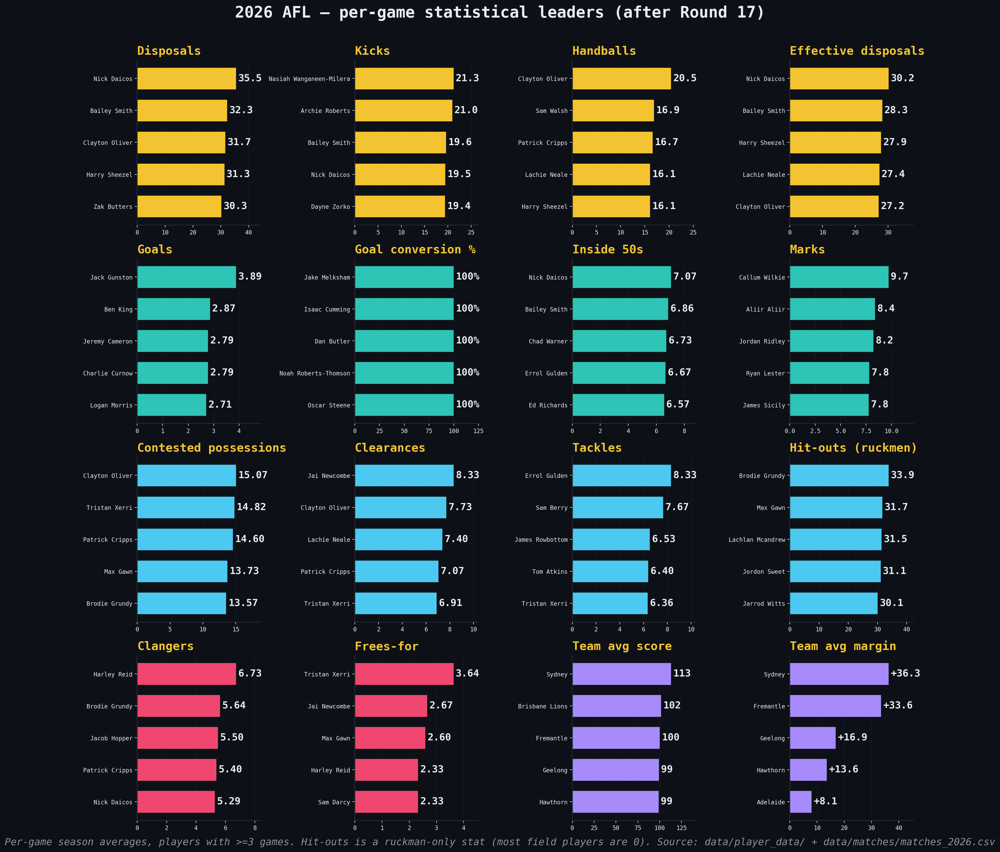

#### Disposal-based stats — volume and quality of ball use

##### Disposals per game

**What it measures.** Total kicks plus handballs in a game — the single broadest measure of how often a player has the ball. **Why it matters.** It is the headline SuperCoach scoring stat and the prediction target this repo's main model is built around. Volume midfielders and rebounding defenders dominate this leaderboard.

| Rank | Player | Team | Per game |
|---|---|---|---|
| 1 | Nick Daicos | Collingwood | 37.0 |
| 2 | Harry Sheezel | North Melbourne | 32.7 |
| 3 | Archie Roberts | Essendon | 32.1 |
| 4 | Bailey Smith | Geelong | 32.0 |
| 5 | Lachie Neale | Brisbane Lions | 31.1 |

League distribution (eligible players, season-to-date): mean **15.85**, std 5.93, p10 8.75 / p50 15.00 / p90 24.40, max 37.00.

Top per-game correlates: `effective_disposals` (r = +0.97 *(mechanically related)*), `uncontested_possessions` (r = +0.88), `kicks` (r = +0.83).

##### Kicks per game

**What it measures.** Just the kicked disposals. **Why it matters.** Kicks tend to come from outside-midfielders, half-backs and tall rebounders — players who clear the ball by foot rather than shovel it into a contest. A player who kicks much more than they handball is usually playing a distributor / launch role.

| Rank | Player | Team | Per game |
|---|---|---|---|
| 1 | Archie Roberts | Essendon | 22.4 |
| 2 | Bailey Smith | Geelong | 21.4 |
| 3 | Jack Sinclair | St Kilda | 21.0 |
| 4 | Lachie Ash | Greater Western Sydney | 20.7 |
| 5 | Jayden Short | Richmond | 20.5 |

League distribution (eligible players, season-to-date): mean **9.28**, std 3.75, p10 4.75 / p50 8.83 / p90 14.51, max 22.43.

Top per-game correlates: `disposals` (r = +0.83), `effective_disposals` (r = +0.81), `uncontested_possessions` (r = +0.79).

##### Handballs per game

**What it measures.** The hand-passed half of disposals. **Why it matters.** Handball volume tracks contest involvement — a player wins the ball at a stoppage, then handballs out to a runner. Inside-mids and clearance specialists tend to lead this stat.

| Rank | Player | Team | Per game |
|---|---|---|---|
| 1 | Clayton Oliver | Greater Western Sydney | 20.7 |
| 2 | Ryley Sanders | Western Bulldogs | 17.5 |
| 3 | Lachie Neale | Brisbane Lions | 16.6 |
| 4 | Nick Daicos | Collingwood | 16.5 |
| 5 | Harry Sheezel | North Melbourne | 16.0 |

League distribution (eligible players, season-to-date): mean **6.56**, std 3.29, p10 3.00 / p50 6.00 / p90 11.43, max 20.71.

Top per-game correlates: `disposals` (r = +0.77), `effective_disposals` (r = +0.75), `contested_possessions` (r = +0.65).

##### Effective disposals per game (disposals − clangers)

**What it measures.** Disposals that did not result in a clanger, computed here as `max(disposals - clangers, 0)` because the raw data does not carry a true effective-disposal column. **Why it matters.** It is a defensible proxy for disposal *quality* — high-volume ball-users who don't turn it over. The same proxy is used in the Brownlow predictor on this page.

| Rank | Player | Team | Per game |
|---|---|---|---|
| 1 | Nick Daicos | Collingwood | 32.7 |
| 2 | Archie Roberts | Essendon | 29.0 |
| 3 | Lachie Neale | Brisbane Lions | 28.9 |
| 4 | Harry Sheezel | North Melbourne | 28.7 |
| 5 | Jack Sinclair | St Kilda | 28.1 |

League distribution (eligible players, season-to-date): mean **13.35**, std 5.54, p10 6.56 / p50 12.71 / p90 21.18, max 32.67.

Top per-game correlates: `disposals` (r = +0.97 *(mechanically related)*), `uncontested_possessions` (r = +0.87), `kicks` (r = +0.81).

#### Scoring stats — goals, behinds and conversion

##### Goals per game

**What it measures.** Goals kicked. **Why it matters.** Forwards live and die by this stat. It is volatile game-to-game (a single missed shot can halve your score), so multi-game averages and shot-source context (marks-inside-50, contested marks) matter more than any one game.

| Rank | Player | Team | Per game |
|---|---|---|---|
| 1 | Jack Gunston | Hawthorn | 4.00 |
| 2 | Ben King | Gold Coast | 3.71 |
| 3 | Jeremy Cameron | Geelong | 3.33 |
| 4 | Nick Larkey | North Melbourne | 3.00 |
| 5 | Aaron Naughton | Western Bulldogs | 2.71 |

League distribution (eligible players, season-to-date): mean **0.56**, std 0.66, p10 0.00 / p50 0.33 / p90 1.50, max 4.00.

Top per-game correlates: `marks_inside_50` (r = +0.68), `behinds` (r = +0.32), `rebound_50s` (r = -0.31).

**Goal conversion rate.** Defined as `goals / (goals + behinds)`, season-to-date, for players with >=2 goals total. League distribution (n=259): mean **62.8%**, std 19.0pp, p10 40% / p50 60% / p90 100%.

| Rank | Player | Team | G | B | Conversion |
|---|---|---|---|---|---|
| 1 | Jordan Dawson | Adelaide | 6 | 0 | 100.0% |
| 2 | Sam Durham | Essendon | 5 | 0 | 100.0% |
| 3 | Isaac Cumming | Adelaide | 4 | 0 | 100.0% |
| 4 | James Jordon | Sydney | 4 | 0 | 100.0% |
| 5 | Lachie Weller | Gold Coast | 4 | 0 | 100.0% |

##### Behinds per game

**What it measures.** Minor scores — shots that hit the post or go through the smaller posts. **Why it matters.** Rarely predicted alone — it is too noisy. Best read alongside goals to compute **conversion rate** (`goals / (goals + behinds)`), the cleanest available signal of forward accuracy.

| Rank | Player | Team | Per game |
|---|---|---|---|
| 1 | Jake Waterman | West Coast | 2.86 |
| 2 | Tom Lynch | Richmond | 2.67 |
| 3 | Jack Gunston | Hawthorn | 2.67 |
| 4 | Nate Caddy | Essendon | 2.17 |
| 5 | Mitch Georgiades | Port Adelaide | 2.14 |

League distribution (eligible players, season-to-date): mean **0.42**, std 0.47, p10 0.00 / p50 0.29 / p90 1.00, max 2.86.

Top per-game correlates: `marks_inside_50` (r = +0.54), `goals` (r = +0.32), `rebound_50s` (r = -0.25).

#### Contested and ground-ball stats — the inside game

##### Contested possessions per game

**What it measures.** Wins of the ball under physical pressure — ground-balls, taps, and contested marks. **Why it matters.** This is the cleanest stat for separating a midfielder's *contest* role from an outside ball-user's *spread* role. It correlates strongly with clearances and tackles.

| Rank | Player | Team | Per game |
|---|---|---|---|
| 1 | Tristan Xerri | North Melbourne | 17.50 |
| 2 | Patrick Cripps | Carlton | 15.57 |
| 3 | Max Gawn | Melbourne | 15.57 |
| 4 | Clayton Oliver | Greater Western Sydney | 14.86 |
| 5 | Lachie Neale | Brisbane Lions | 13.43 |

League distribution (eligible players, season-to-date): mean **5.59**, std 2.54, p10 3.00 / p50 5.00 / p90 9.34, max 17.50.

Top per-game correlates: `clearances` (r = +0.73), `handballs` (r = +0.65), `disposals` (r = +0.58).

##### Clearances per game

**What it measures.** Disposals that move the ball clear of a stoppage (a centre-bounce or boundary throw-in). **Why it matters.** Stoppage dominance is one of the few team-level wins a midfield can manufacture. Top clearance players are almost always the inside-mid fulcrums of their team.

| Rank | Player | Team | Per game |
|---|---|---|---|
| 1 | Jai Newcombe | Hawthorn | 7.86 |
| 2 | Lachie Neale | Brisbane Lions | 7.71 |
| 3 | Tristan Xerri | North Melbourne | 7.50 |
| 4 | Patrick Cripps | Carlton | 7.43 |
| 5 | Matthew Kennedy | Western Bulldogs | 7.14 |

League distribution (eligible players, season-to-date): mean **1.51**, std 1.72, p10 0.00 / p50 0.83 / p90 4.25, max 7.86.

Top per-game correlates: `contested_possessions` (r = +0.73), `handballs` (r = +0.55), `disposals` (r = +0.48).

##### Tackles per game

**What it measures.** Pressure acts that physically stop a ball-carrier. **Why it matters.** Defensive midfield work — the unsung currency of forward-half pressure and turnover football. It correlates with clearances (you tackle the same opponent you compete against) but tells a different story.

| Rank | Player | Team | Per game |
|---|---|---|---|
| 1 | Tristan Xerri | North Melbourne | 8.00 |
| 2 | Tom Atkins | Geelong | 7.71 |
| 3 | James Rowbottom | Sydney | 7.43 |
| 4 | Jack Steele | Melbourne | 7.29 |
| 5 | Andrew Brayshaw | Fremantle | 7.00 |

League distribution (eligible players, season-to-date): mean **2.46**, std 1.41, p10 1.00 / p50 2.14 / p90 4.40, max 8.00.

Top per-game correlates: `clearances` (r = +0.40), `contested_possessions` (r = +0.37), `handballs` (r = +0.30).

##### Hit-outs per game (ruckmen only)

**What it measures.** Wins by a ruckman at a ruck contest (the tap from a centre bounce or stoppage). **Why it matters.** Ruckman-only stat — the distribution is bimodal: ~1 player per team registers double-digits, everyone else is 0. Always read this leaderboard as "top ruckmen", not "top players".

**Bimodal distribution warning.** 88% of eligible 2026 players average less than 1 hit-out per game — they are not ruckmen. The league mean below is dragged down by all the zeros; the meaningful comparison is between ruckmen, where the top of the distribution sits in the 25-35 range.

| Rank | Player | Team | Per game |
|---|---|---|---|
| 1 | Jarrod Witts | Gold Coast | 35.7 |
| 2 | Brodie Grundy | Sydney | 35.0 |
| 3 | Max Gawn | Melbourne | 33.1 |
| 4 | Nick Madden | Greater Western Sydney | 28.7 |
| 5 | Jordon Sweet | Port Adelaide | 28.5 |

League distribution (eligible players, season-to-date): mean **1.53**, std 5.39, p10 0.00 / p50 0.00 / p90 2.31, max 35.71.

Top per-game correlates: `clearances` (r = +0.25), `uncontested_possessions` (r = -0.24), `free_kicks_for` (r = +0.21).

#### Territory stats — moving the ball forward

##### Inside 50s per game

**What it measures.** Disposals or carries that move the ball into the team's attacking 50m arc. **Why it matters.** Territory currency — the precondition for goals. Wing/half-forward players who launch attacks lead this stat. It correlates with kicks and disposals because most inside-50s are foot-delivered.

| Rank | Player | Team | Per game |
|---|---|---|---|
| 1 | Nick Daicos | Collingwood | 8.33 |
| 2 | Bailey Smith | Geelong | 7.57 |
| 3 | Chad Warner | Sydney | 6.71 |
| 4 | Toby Greene | Greater Western Sydney | 6.43 |
| 5 | Marcus Bontempelli | Western Bulldogs | 6.43 |

League distribution (eligible players, season-to-date): mean **2.30**, std 1.36, p10 0.67 / p50 2.15 / p90 4.00, max 8.33.

Top per-game correlates: `disposals` (r = +0.52), `effective_disposals` (r = +0.49), `kicks` (r = +0.48).

##### Marks per game

**What it measures.** Total uncontested + contested marks taken. **Why it matters.** Aerial dominance and intercept defence. Loose-half-back roles dominate the total-marks leaderboard because they sit behind the play and fly under kicks. Tall forwards lead a separate, narrower stat — marks inside 50.

| Rank | Player | Team | Per game |
|---|---|---|---|
| 1 | Callum Wilkie | St Kilda | 12.1 |
| 2 | Aliir Aliir | Port Adelaide | 9.4 |
| 3 | Dan Houston | Collingwood | 8.6 |
| 4 | Jayden Short | Richmond | 8.5 |
| 5 | Lachie Ash | Greater Western Sydney | 8.4 |

League distribution (eligible players, season-to-date): mean **4.05**, std 1.72, p10 2.00 / p50 3.86 / p90 6.43, max 12.14.

Top per-game correlates: `kicks` (r = +0.59), `uncontested_possessions` (r = +0.54), `effective_disposals` (r = +0.44).

##### Marks inside 50 per game

**What it measures.** Marks taken inside the attacking 50m arc — i.e. marks that turn directly into shots on goal. **Why it matters.** This is the strongest single predictor of a forward's goal output. It is what separates a deep-forward role from a high-half-forward role, and the correlation with goals is the highest of any stat in this section.

| Rank | Player | Team | Per game |
|---|---|---|---|
| 1 | Jack Gunston | Hawthorn | 4.67 |
| 2 | Mitch Georgiades | Port Adelaide | 4.29 |
| 3 | Jeremy Cameron | Geelong | 3.50 |
| 4 | Jye Amiss | Fremantle | 3.43 |
| 5 | Charlie Curnow | Sydney | 3.29 |

League distribution (eligible players, season-to-date): mean **0.53**, std 0.75, p10 0.00 / p50 0.29 / p90 1.67, max 4.67.

Top per-game correlates: `goals` (r = +0.68), `behinds` (r = +0.54), `contested_marks` (r = +0.36).

#### Discipline stats — errors and free kicks

##### Clangers per game

**What it measures.** Errors — missed targets, fumbles, free kicks given away by the ball-carrier. **Why it matters.** Clangers are the friction term on disposal volume — a high-disposal player who also leads in clangers is being asked to play through traffic, not necessarily playing badly. The correlation with frees-against is mechanical: many clangers *are* frees-against.

| Rank | Player | Team | Per game |
|---|---|---|---|
| 1 | Matt Rowell | Gold Coast | 6.75 |
| 2 | Harley Reid | West Coast | 6.29 |
| 3 | Brodie Grundy | Sydney | 6.14 |
| 4 | Jacob Hopper | Richmond | 6.00 |
| 5 | Toby Greene | Greater Western Sydney | 5.86 |

League distribution (eligible players, season-to-date): mean **2.50**, std 1.01, p10 1.33 / p50 2.37 / p90 3.71, max 6.75.

Top per-game correlates: `free_kicks_against` (r = +0.63 *(mechanically related)*), `contested_possessions` (r = +0.34), `disposals` (r = +0.32).

##### Free kicks for per game

**What it measures.** Free kicks paid to the player. **Why it matters.** A weak isolated signal — frees-for tracks contest involvement (rucks especially) more than skill. Best used as a tiebreaker rather than a standalone metric.

| Rank | Player | Team | Per game |
|---|---|---|---|
| 1 | Tristan Xerri | North Melbourne | 3.50 |
| 2 | Max Gawn | Melbourne | 3.14 |
| 3 | Bailey Williams | West Coast | 3.00 |
| 4 | Tim English | Western Bulldogs | 2.75 |
| 5 | Darcy Cameron | Collingwood | 2.71 |

League distribution (eligible players, season-to-date): mean **0.82**, std 0.53, p10 0.29 / p50 0.71 / p90 1.50, max 3.50.

Top per-game correlates: `contested_possessions` (r = +0.42), `clearances` (r = +0.29), `tackles` (r = +0.24).

##### Free kicks against per game

**What it measures.** Free kicks paid against the player. **Why it matters.** Discipline / aggression marker, with the caveat that ruck contest infringements inflate the number for ruckmen. Reads like a clanger when it correlates with them.

| Rank | Player | Team | Per game |
|---|---|---|---|
| 1 | Brodie Grundy | Sydney | 3.00 |
| 2 | Matt Rowell | Gold Coast | 3.00 |
| 3 | Jack Graham | West Coast | 3.00 |
| 4 | Liam Baker | West Coast | 2.50 |
| 5 | Sam Draper | Brisbane Lions | 2.50 |

League distribution (eligible players, season-to-date): mean **0.83**, std 0.51, p10 0.25 / p50 0.75 / p90 1.50, max 3.00.

Top per-game correlates: `clangers` (r = +0.63 *(mechanically related)*), `hit_outs` (r = +0.16), `clearances` (r = +0.16).

#### Team-level stats — what the scoreboard says

Team-level stats use `data/matches/matches_2026.csv` rather than per-player aggregates. Total team score is `goals × 6 + behinds`; margin is the team's score minus the opponent's. A first-quarter score is a useful early-momentum signal — strong starters tend to keep the lead.

##### Total team score per game

| Rank | Team | Avg score | Avg margin | Avg Q1 |
|---|---|---|---|---|
| 1 | Sydney | 116.3 | +51.0 | 29.3 |
| 2 | Hawthorn | 105.1 | +20.7 | 31.3 |
| 3 | Gold Coast | 103.3 | +13.0 | 26.7 |
| 4 | Brisbane Lions | 102.7 | +16.3 | 20.3 |
| 5 | Melbourne | 99.6 | +2.7 | 17.0 |

League distribution of per-game team scores: mean **90.4**, std 26.0, p10 60 / p50 90 / p90 126, min 35 / max 163.

##### Winning margin

| Rank | Team | Avg margin | Avg score |
|---|---|---|---|
| 1 | Sydney | +51.0 | 116.3 |
| 2 | Fremantle | +25.1 | 92.0 |
| 3 | Hawthorn | +20.7 | 105.1 |
| 4 | Brisbane Lions | +16.3 | 102.7 |
| 5 | North Melbourne | +13.3 | 96.9 |

League distribution of margins (signed, per team-game): mean ~0 by construction, std 44.7, p10 -58 / p50 0 / p90 58.

##### First-quarter score

| Rank | Team | Avg Q1 score | Avg full-game score |
|---|---|---|---|
| 1 | Hawthorn | 31.3 | 105.1 |
| 2 | Sydney | 29.3 | 116.3 |
| 3 | North Melbourne | 27.6 | 96.9 |
| 4 | Carlton | 26.9 | 80.7 |
| 5 | Gold Coast | 26.7 | 103.3 |

League distribution of Q1 scores: mean **22.4**, std 12.1, p10 8 / p50 21 / p90 40.

#### Going deeper with this repo's models

For the stats above, three artefacts in this repo will help you form your own view rather than just reading a leaderboard:

1. The **disposal prediction model** (`prediction.py` / `prediction_cpu.py`) forecasts a player's next-round disposal count using rolling form, opponent context and venue effects. Run it with `--player surname_first --rounds 1` to see how uncertainty is quantified for any of the leaders shown above.
2. The **backtest framework** (`backtest.py`) replays a season round-by-round so you can see how the model performed on real, out-of-sample games — the honest way to judge whether a leaderboard ranking will continue to hold.
3. The **Brownlow proxy section** above is the same per-game stat structure used here, weighted into a single composite. If you want a quick "who's having the best year overall" answer rather than per-stat leaders, that table is the one to look at.
<!-- 2026-STAT-LEADERS-END -->


### Team playing styles — 5 years of data (2021–2025)

<!-- 5YEAR-TEAM-PROFILES-START -->
The profiles below summarise each team's 2021–2025 statistical fingerprint — five full seasons of per-game averages aggregated across every player who pulled on the jumper. They reflect coaching philosophy and list system more than any single season's results, smoothing out the noise of a hot run or a flat year. If you want to understand *why* a team plays the way it does in 2026, this is the better baseline than the season-to-date snapshot above — it is what the data says they are at their core.

Each paragraph leans on the actual numbers (per-game averages, league ranks across 18 teams, and 5-year linear trends), so the descriptions update automatically when the window rolls forward.

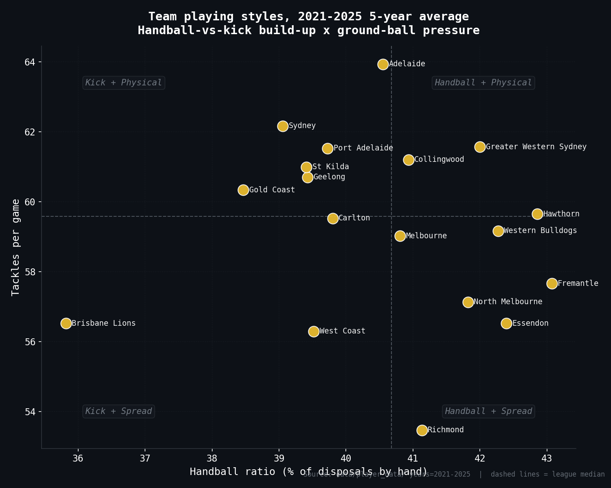

The scatter above places each club on two axes that capture the most visible part of a team's identity — handball ratio (% of disposals by hand) on the X and tackles per game on the Y. The dashed lines mark the league median, splitting the field into four loose archetypes: top-right teams move the ball by handball *and* hunt with tackle pressure; top-left sides trust their kicking but still bring the heat; bottom-right are handball teams that spread rather than tackle; bottom-left are kick-and-spread possession sides.

#### Adelaide

Adelaide have built their identity around a ground-ball pressure game — ranked 1st of 18 across the last five seasons. Across 2021–2025 they averaged 356.3 disposals, 63.9 tackles and 38.2 clearances per game, with a roughly balanced 41/59 handball-to-kick split. On territory and contest, they show a mid-pack territory profile (9th for inside-50s) combined with a contested-ball, high-pressure identity (2nd for contested possessions, 1st for tackles). Forward of centre, a volume-over-precision forward template — only 1-in-4.6 entries are marked inside 50 (14th for connection), and ball security is a clear vulnerability — sitting in the bottom four for clangers or frees conceded. The profile is gradually shifting rather than locked in: forward connection has climbed ~12% across the five-year window and handball share has fallen ~11% across the five-year window. What separates them from the rest of the competition is the floor under their marks (83.8/g, 18th of 18) — a structural issue, not a single bad year. In short, the ceiling is anchored to their tackles (1st of 18), while the vulnerability is their marks (18th of 18) — and that gap is what every opposition gameplan targets.

#### Brisbane Lions

Brisbane Lions have built their identity around a territory-dominant game — ranked 1st of 18 across the last five seasons. Across 2021–2025 they averaged 354.3 disposals, 56.5 tackles and 40.4 clearances per game, with a kick-first, territory-via-foot template (64% by foot — 1st-most kick-dominant). On territory and contest, they show a relentlessly forward-territory game (+18.8 net 50-entries per game) combined with a contested-ball game without the tackle pressure to match (5th for CP, only 15th for tackles). Forward of centre, mid-pack forward efficiency (8th for marks-per-inside-50), and ball security sits roughly mid-pack. The 5-year profile is gradually shifting — modest year-on-year movement but no wholesale re-tooling of the game plan. What sets them apart from the field is their kicks (227.4/g, 1st of 18) — a true outlier rather than mid-pack noise. In short, the ceiling is anchored to their kicks (1st of 18), while the vulnerability is their tackles (15th of 18) — and that gap is what every opposition gameplan targets.

#### Carlton

Carlton's 5-year profile is defined by what they don't do — the least ruck-led side in the competition. Across 2021–2025 they averaged 365.1 disposals, 59.5 tackles and 37.7 clearances per game, with a roughly balanced 40/60 handball-to-kick split. On territory and contest, they show a mid-pack territory profile (8th for inside-50s) combined with a balanced contest profile (3rd for CP, 10th for tackles). Forward of centre, mid-pack forward efficiency (13th for marks-per-inside-50), and ball security sits roughly mid-pack. The 5-year profile is gradually shifting — modest year-on-year movement but no wholesale re-tooling of the game plan. What sets them apart is how far they sit from the league norm in hit-outs (32.5/g, 18th of 18) — that gap is the signature of their style, not a fault line. In short, the ceiling is anchored to their contested marks (1st of 18); the low hit-outs (18th of 18) is the deliberate trade-off that comes with that style.

#### Collingwood

Collingwood's 5-year profile is defined by what they don't do — the third-least mark-and-control side in the competition. Across 2021–2025 they averaged 352.0 disposals, 61.2 tackles and 35.0 clearances per game, with a roughly balanced 41/59 handball-to-kick split. On territory and contest, they show a struggle to win territory (15th for inside-50s) combined with a balanced contest profile (14th for CP, 5th for tackles). Forward of centre, a clinical use of the few entries they win (1-in-4.3 entries marked, 3rd in the league), and ball security is a clear vulnerability — sitting in the bottom four for clangers or frees conceded. The profile is evolving rather than locked in: ball use has fallen ~13% across the five-year window and forward connection has climbed ~11% across the five-year window. What separates them from the rest of the competition is the floor under their marks (88.4/g, 16th of 18) — a structural issue, not a single bad year. In short, the ceiling is anchored to their marks-per-inside-50 conversion (3rd of 18), while the vulnerability is their marks (16th of 18) — and that gap is what every opposition gameplan targets.

#### Essendon

Essendon have built their identity around a possession-and-control game — ranked 1st of 18 across the last five seasons. Across 2021–2025 they averaged 370.6 disposals, 56.5 tackles and 34.3 clearances per game, with a high-tempo, handball-heavy build-up (42% by hand — 3rd in the league). On territory and contest, they show a mid-pack territory profile (11th for inside-50s) combined with a possession-and-spread template that avoids the contest (1st for uncontested possessions, 16th for CP). Forward of centre, mid-pack forward efficiency (6th for marks-per-inside-50), and ball security is a real strength — among the cleanest sides for both clangers and frees against. The 5-year profile is gradually shifting — modest year-on-year movement but no wholesale re-tooling of the game plan. What sets them apart from the field is their uncontested possessions (234.6/g, 1st of 18) — a true outlier rather than mid-pack noise. In short, the ceiling is anchored to their uncontested possessions (1st of 18), while the vulnerability is their tackles (16th of 18) — and that gap is what every opposition gameplan targets.

#### Fremantle

Fremantle have built their identity around a handball-driven game — ranked 1st of 18 across the last five seasons. Across 2021–2025 they averaged 362.8 disposals, 57.7 tackles and 37.8 clearances per game, with a high-tempo, handball-heavy build-up (43% by hand — 1st in the league). On territory and contest, they show a mid-pack territory profile (10th for inside-50s) combined with a possession-and-spread template that avoids the contest (5th for uncontested possessions, 13th for CP). Forward of centre, a volume-over-precision forward template — only 1-in-4.7 entries are marked inside 50 (16th for connection), and ball security sits roughly mid-pack. The profile is gradually shifting rather than locked in: tackle pressure has climbed ~16% across the five-year window. What sets them apart from the field is their handball share of disposals (43.1%, 1st of 18) — a true outlier rather than mid-pack noise. In short, the ceiling is anchored to their handball share of disposals (1st of 18), while the vulnerability is their marks-per-inside-50 conversion (16th of 18) — and that gap is what every opposition gameplan targets.

#### Geelong

Geelong have built their identity around a clinical forward-50 game — ranked 1st of 18 across the last five seasons. Across 2021–2025 they averaged 361.1 disposals, 60.7 tackles and 37.7 clearances per game, with a kick-first, territory-via-foot template (61% by foot — 4th-most kick-dominant). On territory and contest, they show a relentlessly forward-territory game (+17.8 net 50-entries per game) combined with a balanced contest profile (9th for CP, 7th for tackles). Forward of centre, genuine forward-half efficiency (1-in-3.8 of their entries hit a target inside 50, and they average 13.8 goals/g), and ball security sits roughly mid-pack. The profile is evolving rather than locked in: tackle pressure has climbed ~14% across the five-year window and forward connection has climbed ~12% across the five-year window. What sets them apart from the field is their goals (13.8/g, 1st of 18) — a true outlier rather than mid-pack noise. In short, the ceiling is anchored to their goals (1st of 18); the low rebound-50s (17th of 18) is the deliberate trade-off that comes with that style.

#### Gold Coast

Gold Coast's 5-year profile is defined by what they don't do — the least possession-and-control side in the competition. Across 2021–2025 they averaged 344.6 disposals, 60.3 tackles and 37.7 clearances per game, with a kick-first, territory-via-foot template (62% by foot — 2nd-most kick-dominant). On territory and contest, they show strong territorial dominance (5th for inside-50s) combined with a balanced contest profile (6th for CP, 8th for tackles). Forward of centre, a volume-over-precision forward template — only 1-in-5.0 entries are marked inside 50 (18th for connection), and ball security sits roughly mid-pack. The profile is evolving rather than locked in: handball share has climbed ~25% across the five-year window and forward entries has climbed ~12% across the five-year window. What sets them apart is how far they sit from the league norm in uncontested possessions (202.5/g, 18th of 18) — that gap is the signature of their style, not a fault line. In short, the ceiling is anchored to their tackles-per-disposal pressure (2nd of 18), while the vulnerability is their marks-per-inside-50 conversion (18th of 18) — and that gap is what every opposition gameplan targets.

#### Greater Western Sydney

Greater Western Sydney have built their identity around a rebound-and-counter game — ranked 1st of 18 across the last five seasons. Across 2021–2025 they averaged 368.9 disposals, 61.6 tackles and 36.5 clearances per game, with a roughly balanced 42/58 handball-to-kick split. On territory and contest, they show a defensive-rebound posture, soaking up entries and breaking out (rebound-50s ranked 1st) combined with genuine ground-ball pressure (3rd for tackles). Forward of centre, mid-pack forward efficiency (10th for marks-per-inside-50), and ball security sits roughly mid-pack. The profile is evolving rather than locked in: forward connection has climbed ~24% across the five-year window. What sets them apart from the field is their rebound-50s (42.2/g, 1st of 18) — a true outlier rather than mid-pack noise. In short, the ceiling is anchored to their rebound-50s (1st of 18), while the vulnerability is their free kicks for (17th of 18) — and that gap is what every opposition gameplan targets.

#### Hawthorn

Hawthorn have built their identity around a handball-driven game — ranked 2nd of 18 across the last five seasons. Across 2021–2025 they averaged 369.1 disposals, 59.6 tackles and 35.1 clearances per game, with a high-tempo, handball-heavy build-up (43% by hand — 2nd in the league). On territory and contest, they show a mid-pack territory profile (13th for inside-50s) combined with a balanced contest profile (12th for CP, 9th for tackles). Forward of centre, mid-pack forward efficiency (9th for marks-per-inside-50), and ball security sits roughly mid-pack. The profile is evolving rather than locked in: forward connection has climbed ~30% across the five-year window and forward entries has climbed ~10% across the five-year window. What sets them apart from the field is their handballs (158.2/g, 1st of 18) — a true outlier rather than mid-pack noise. In short, the ceiling is anchored to their handballs (1st of 18) — that's the foundation everything else is built on.

#### Melbourne

Melbourne have built their identity around a contested-ball game — ranked 1st of 18 across the last five seasons. Across 2021–2025 they averaged 362.6 disposals, 59.0 tackles and 36.8 clearances per game, with a roughly balanced 41/59 handball-to-kick split. On territory and contest, they show a relentlessly forward-territory game (+16.0 net 50-entries per game) combined with a balanced contest profile (1st for CP, 12th for tackles). Forward of centre, a volume-over-precision forward template — only 1-in-4.6 entries are marked inside 50 (15th for connection), and ball security sits roughly mid-pack. The profile is gradually shifting rather than locked in: contested-ball winning has fallen ~13% across the five-year window and forward entries has fallen ~10% across the five-year window. What sets them apart from the field is their contested possessions (141.8/g, 1st of 18) — a true outlier rather than mid-pack noise. In short, the ceiling is anchored to their contested possessions (1st of 18), while the vulnerability is their marks-per-inside-50 conversion (15th of 18) — and that gap is what every opposition gameplan targets.

#### North Melbourne

North Melbourne's 5-year profile is defined by what they don't do — the second-least contested-ball side in the competition. Across 2021–2025 they averaged 351.5 disposals, 57.1 tackles and 36.6 clearances per game, with a roughly balanced 42/58 handball-to-kick split. On territory and contest, they show a defensive-rebound posture, soaking up entries and breaking out (rebound-50s ranked 2nd) combined with a balanced contest profile (17th for CP, 14th for tackles). Forward of centre, a volume-over-precision forward template — only 1-in-4.8 entries are marked inside 50 (17th for connection), and ball security is a clear vulnerability — sitting in the bottom four for clangers or frees conceded. The profile is gradually shifting rather than locked in: tackle pressure has climbed ~12% across the five-year window and handball share has climbed ~8% across the five-year window. What separates them from the rest of the competition is the floor under their marks inside 50 (9.6/g, 18th of 18) — a structural issue, not a single bad year. In short, the ceiling is anchored to their rebound-50s (2nd of 18), while the vulnerability is their marks inside 50 (18th of 18) — and that gap is what every opposition gameplan targets.

#### Port Adelaide

Port Adelaide have built their identity around a clinical forward-50 game — ranked 2nd of 18 across the last five seasons. Across 2021–2025 they averaged 358.0 disposals, 61.5 tackles and 37.4 clearances per game, with a roughly balanced 40/60 handball-to-kick split. On territory and contest, they show a mid-pack territory profile (7th for inside-50s) combined with genuine ground-ball pressure (4th for tackles). Forward of centre, genuine forward-half efficiency (1-in-4.2 of their entries hit a target inside 50, and they average 12.0 goals/g), and ball security is a clear vulnerability — sitting in the bottom four for clangers or frees conceded. The profile is evolving rather than locked in: contested-ball winning has fallen ~14% across the five-year window and ball use has fallen ~12% across the five-year window. What sets them apart from the field is their marks-per-inside-50 conversion (23.6%, 2nd of 18) — a true outlier rather than mid-pack noise. In short, the ceiling is anchored to their marks-per-inside-50 conversion (2nd of 18), while the vulnerability is their free kicks against (17th of 18) — and that gap is what every opposition gameplan targets.

#### Richmond

Richmond's 5-year profile is defined by what they don't do — the least ground-ball pressure side in the competition. Across 2021–2025 they averaged 348.4 disposals, 53.5 tackles and 33.2 clearances per game, with a roughly balanced 41/59 handball-to-kick split. On territory and contest, they show a defensive-rebound posture, soaking up entries and breaking out (rebound-50s ranked 3rd) combined with notably soft pressure around the ball (18th for tackles). Forward of centre, mid-pack forward efficiency (7th for marks-per-inside-50), and ball security is a clear vulnerability — sitting in the bottom four for clangers or frees conceded. The profile is evolving rather than locked in: forward entries has fallen ~19% across the five-year window and forward connection has fallen ~15% across the five-year window. What separates them from the rest of the competition is the floor under their tackles (53.5/g, 18th of 18) — a structural issue, not a single bad year. In short, the ceiling is anchored to their rebound-50s (3rd of 18), while the vulnerability is their tackles (18th of 18) — and that gap is what every opposition gameplan targets.

#### St Kilda

St Kilda have built their identity around a mark-and-control game — ranked 2nd of 18 across the last five seasons. Across 2021–2025 they averaged 371.7 disposals, 61.0 tackles and 35.0 clearances per game, with a roughly balanced 39/61 handball-to-kick split. On territory and contest, they show a struggle to win territory (16th for inside-50s) combined with a balanced contest profile (11th for CP, 6th for tackles). Forward of centre, a clinical use of the few entries they win (1-in-4.4 entries marked, 4th in the league), and ball security is a clear vulnerability — sitting in the bottom four for clangers or frees conceded. The 5-year profile is gradually shifting — modest year-on-year movement but no wholesale re-tooling of the game plan. What sets them apart from the field is their kicks (225.2/g, 2nd of 18) — a true outlier rather than mid-pack noise. In short, the ceiling is anchored to their kicks (2nd of 18), while the vulnerability is their inside-50s (16th of 18) — and that gap is what every opposition gameplan targets.

#### Sydney

Sydney have built their identity around a ground-ball pressure game — ranked 2nd of 18 across the last five seasons. Across 2021–2025 they averaged 358.5 disposals, 62.2 tackles and 36.8 clearances per game, with a kick-first, territory-via-foot template (61% by foot — 3rd-most kick-dominant). On territory and contest, they show strong territorial dominance (6th for inside-50s) combined with genuine ground-ball pressure (2nd for tackles). Forward of centre, mid-pack forward efficiency (11th for marks-per-inside-50), and ball security is a clear vulnerability — sitting in the bottom four for clangers or frees conceded. The 5-year profile is settled — modest year-on-year movement but no wholesale re-tooling of the game plan. What sets them apart from the field is their tackles (62.2/g, 2nd of 18) — a true outlier rather than mid-pack noise. In short, the ceiling is anchored to their tackles (2nd of 18), while the vulnerability is their contested marks (17th of 18) — and that gap is what every opposition gameplan targets.

#### West Coast

West Coast's 5-year profile is defined by what they don't do — the least contested-ball side in the competition. Across 2021–2025 they averaged 333.1 disposals, 56.3 tackles and 34.2 clearances per game, with a roughly balanced 40/60 handball-to-kick split. On territory and contest, they show a struggle to win territory (18th for inside-50s) combined with notably soft pressure around the ball (17th for tackles). Forward of centre, mid-pack forward efficiency (12th for marks-per-inside-50), and ball security sits roughly mid-pack. The profile is evolving rather than locked in: handball share has climbed ~14% across the five-year window and ball use has fallen ~11% across the five-year window. What separates them from the rest of the competition is the floor under their kicks (201.4/g, 18th of 18) — a structural issue, not a single bad year. In short, the ceiling is anchored to their clangers (3rd of 18), while the vulnerability is their kicks (18th of 18) — and that gap is what every opposition gameplan targets.

#### Western Bulldogs

Western Bulldogs' 5-year profile is defined by what they don't do — the least rebound-and-counter side in the competition. Across 2021–2025 they averaged 374.0 disposals, 59.2 tackles and 40.5 clearances per game, with a high-tempo, handball-heavy build-up (42% by hand — 4th in the league). On territory and contest, they show a relentlessly forward-territory game (+19.4 net 50-entries per game) combined with a balanced contest profile (4th for CP, 11th for tackles). Forward of centre, mid-pack forward efficiency (5th for marks-per-inside-50), and ball security is a real strength — among the cleanest sides for both clangers and frees against. The profile is unusually settled — none of the six identity stats has shifted more than ~2% across five seasons, suggesting a tightly held list and game-plan. What sets them apart from the field is their disposals (374.0/g, 1st of 18) — a true outlier rather than mid-pack noise. In short, the ceiling is anchored to their disposals (1st of 18); the low rebound-50s (18th of 18) is the deliberate trade-off that comes with that style.
<!-- 5YEAR-TEAM-PROFILES-END -->

### For the footy expert — finding the greatest 100 players of all time

If you live and breathe footy — you can rattle off Lockett's goals tally, you've argued about Carey vs. Matthews more times than you can count, you have strong opinions about whether Bontempelli is already a top-20 player of all time — but you've never opened a terminal in your life, this section is for you.

This repo gives you something you can't get anywhere else: a ranking formula you can actually **change, challenge, and re-run yourself** — without writing a single line of code. You just talk to an AI agent (Claude) in plain English, the same way you'd argue at the pub. You ask "why is Carey ranked above Matthews?" and it tells you. You say "I reckon goals should count for more — show me what happens" and it changes the formula and re-runs it.

You don't need to know what Python is. You don't need to understand machine learning. You just need to be opinionated about footy.

<!-- TOP10-CHART-START -->
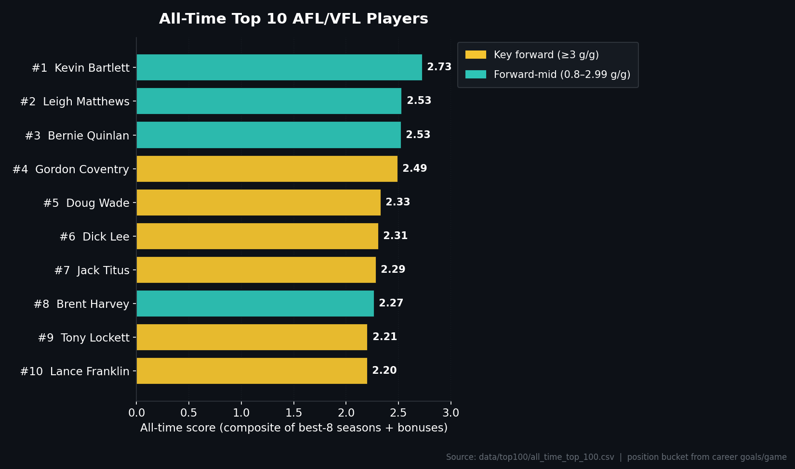
<!-- TOP10-CHART-END -->

---

#### What the ranking is actually doing (in footy terms)

The hardest problem in ranking all-time greats is that **you can't just add up stats**. Tony Lockett kicked 1,360 goals — but in his era, contested possessions weren't even tracked. Haydn Bunton Sr. won three Brownlows in the 1930s when the only stats kept were goals and behinds. Compare that to Patrick Cripps, who has 20+ different stats logged every single game.

If you just totted up everything, modern players would crush every list — not because they were better, but because more was being counted.

So the formula does three things to make it fair:

**1. It only uses the stats that existed at the time.** Bunton's score uses goals and behinds. Bartlett's uses kicks, handballs, marks, and goals. Bontempelli's uses everything modern, including contested possessions and clearances. Nobody is penalised for not having a stat that didn't exist yet.

**2. It groups players by position type so you're comparing apples to apples.** A key forward like Lockett or Dunstall will always pile up more raw "score" than a midfielder like Pendlebury — because goals are weighted heavily and forwards kick more of them. So the ranking splits players into three buckets:

- **Key forwards** (3+ goals per game) — Lockett, Dunstall, Ablett Sr, Lloyd, Franklin, Brown
- **Forward-midfielders** (0.8 to 2.99) — Carey, Matthews, Bartlett, Dangerfield, Ablett Jr, Dustin Martin
- **Midfielders / defenders** (under 0.8) — Pendlebury, Neale, Cripps, Parker

A midfielder who finishes #1 in their group is genuinely the best midfielder of the era — not just "good but not as good as Lockett."

**3. It rewards both sustained excellence and peak greatness.** The final score is the **average of a player's best 8 seasons**, plus a bonus for very long careers (capped, so a 15-year average career can't beat a 10-year brilliant one), plus a bonus for having a season where you were clearly the best player in the league. The minimum to be ranked at all is 150 games — that filters out brief careers, no matter how brilliant.

Unsure why the best 8? Because using only the best 5 let players with 2 freak years rank too high. Using the whole career punished anyone who hung on too long. Best 8 is the sweet spot — long enough to reward consistency, short enough to ignore decline years.

---

#### How to challenge the ranking by talking to Claude

Once you've followed the [Setting up Claude Code on Ubuntu](#setting-up-claude-code-on-ubuntu) steps, you'll have a thing called Claude running in your terminal. **Forget what "terminal" means** — just think of it as a window where you type questions to a very smart footy analyst who has read every line of code in this project and every player's stats.

To start it up:

```bash
cd /path/to/SuperCoach-VIA
claude
```

You'll see a `>` prompt. That's where you type. Hit Enter to send. Claude reads everything in this project and answers in plain English. If it needs to change something or run something, it'll tell you what it's about to do first.

Here's what conversations actually look like.

##### Asking why a player ranked where they did

```
Why is Wayne Carey ranked above Leigh Matthews on the all-time list?
```

Claude will open `all_time_top_100.csv`, look up both players' scores, see which group (forward-midfielders) they're both in, and explain the breakdown — Carey's per-season scores, Matthews' per-season scores, the era adjustment applied to each, the peak bonus, the longevity bonus. You'll get a paragraph back like "Carey's average top-8 season scored higher because the formula weights kicks and marks heavily and Matthews played in an era where marks weren't tracked until 1991 — he gets credit for goals and disposals but the formula can't see his contested marks. Try this: tell me to lower the weight on marks and we'll see if Matthews moves up."

##### Asking where a specific player ranks

```
Where does Scott Pendlebury rank and why?
Where does Gary Ablett Jr finish and what's his peak season according to the formula?
Why didn't Lance Franklin make the top 10?
```

For any of these, Claude will pull the actual numbers and explain. If a player isn't on the list, Claude will tell you exactly where they fell short — not enough games, no peak Brownlow-level season, or their group ranking just wasn't high enough.

##### Challenging the formula and re-running it

This is where it gets fun. You can change anything about the formula and see what happens.

```
I think goals should count for more in the modern era — increase the goal weight by 30% and re-run the ranking. Show me how the top 20 changes.
```

```
The formula uses the best 8 seasons. I think it should be best 10 — too many short-career players are sneaking in. Change it and re-run.
```

```
Drop the minimum games requirement from 150 to 100 and tell me which players newly make the list.
```

```
The career longevity bonus is capped at 30%. I think Pendlebury and Bartlett are getting underrated for their 350+ games — raise the cap to 40% and show me what shifts.
```

Claude will make the change in the code, re-run the ranking, save the new top 100, and tell you which players moved up, which moved down, and which dropped off entirely. If you don't like it, just say "revert that change" and you're back to the original.

##### Asking Claude to explain the era adjustments

```
Explain the era adjustment in plain English — why does a 1985 season score differently to a 2015 season for the same raw stats?
```

```
Walk me through how Haydn Bunton's 1933 season is scored. He won the Brownlow but I don't see a "Brownlow" stat in the formula — how does the model recognise his greatness?
```

```
The formula caps any single stat at 55% of a season's score. What does that actually do? Show me a player whose ranking changed because of that cap.
```

---

#### Using the Scientist agent for deeper questions

Claude (the regular one) is great for opinion arguments and quick formula tweaks. But for **proper number-crunching** — running statistical sensitivity analyses, checking whether changes are real or just noise, comparing rankings across different formula versions — there's a heavier-duty version called the **Scientist agent**.

> **READ THE DISCLAIMER** in the [STOP. READ THIS FIRST.](#stop-read-this-first-do-not-waste-the-scientist) section above before invoking the Scientist. It runs on Claude's most expensive model and burns through tokens fast. **Use it for the questions that actually require it. For everything else, just use plain Claude.**

You invoke the Scientist by typing `@"Scientist (agent)"` at the start of your message:

```
@"Scientist (agent)" double the weight on contested possessions in the ranking formula and tell me how the top 10 changes. I want a proper sensitivity analysis — not just the new list, but how confident we should be that the changes are meaningful versus formula noise.
```

```
@"Scientist (agent)" the ranking puts Wayne Carey at #1. Run a sensitivity analysis — try 5 different reasonable variations of the formula (different season-count, different group thresholds, different era adjustments) and tell me whether Carey stays #1 in all of them or whether his top spot is fragile.
```

```
@"Scientist (agent)" how much does the top 20 actually change if I remove the era adjustment entirely? Is the era adjustment doing real work or is it cosmetic?
```

```
@"Scientist (agent)" the formula gives a peak-season bonus. Strip it out and re-rank — which players were riding on one freakish season versus genuine sustained excellence?
```

```
@"Scientist (agent)" simulate what the top 100 would look like if pre-1965 players had access to the modern stats — i.e. fill in the missing stats with reasonable estimates based on similar modern players, and show me how Bunton, Coleman and Whitten move.
```

The Scientist will read the code, do the proper analysis, and report back with not just the answer but **how confident you should be in it** — which is what separates a real analysis from just another opinion.

---

#### Questions worth asking — for stress-testing the formula

If you're a footy expert who wants to genuinely challenge whether this ranking holds up, here are the questions that will tell you the most. You can paste any of these straight into Claude.

**Era fairness**

- "Show me the top 5 players from each decade in this list. Are pre-1970 players underrepresented? If so, is that a real reflection of quality or a flaw in the formula?"
- "The best 8 seasons average rewards longevity. Most pre-WWII players had shorter careers due to the war and shorter seasons. Has the formula adjusted for that, or are players like Dyer and Bunton being penalised?"
- "Modern players have GPS distance, defensive pressure acts, and other stats that aren't in this dataset. The formula scales them down to compensate — but is the scale-down enough? Try doubling it and show me what happens."

**Position group fairness**

- "There are 3 position groups. What if I split key forwards into 'true power forwards' (Lockett, Dunstall, Coleman) and 'lead-up forwards' (Franklin, Ablett Sr)? Does the ranking change in a way that feels right?"
- "Pendlebury, Neale and Cripps are in the same group as 1960s-era pure defenders. Does that make sense? Test what happens if we split midfielders out from defenders."
- "Carey is classified as a forward-midfielder. Move him into the key forwards group and re-rank. Does that change his position?"

**Stat weighting**

- "Goals dominate forwards' scores. What's the actual weight on goals in the formula, and what happens if I halve it? Do midfielders take over the top of the list?"
- "Show me what happens to the top 20 if I weight contested possessions twice as heavily as kicks. The argument is that contested ball is harder, so should count more."
- "Brownlow votes aren't used as a stat. Should they be? Add them as a 10% weighting and re-rank."

**Peak vs longevity**

- "Tony Lockett's career peak was higher than Buddy Franklin's, but Franklin played longer. The formula uses best 8 seasons + a longevity bonus. Show me what each player gets from each component."
- "Cut the longevity bonus to zero. Who falls off the top 50? Are those players great because of who they were, or because they hung on?"
- "Use only best 3 seasons (peak only — no longevity at all). Who rises to the top?"

**Specific player debates**

- "Dustin Martin won 3 Norm Smiths and a Brownlow. Where does the formula put him, and is he being properly credited for finals heroics? (The dataset is regular-season only — flag that as a limitation.)"
- "Gary Ablett Sr vs Gary Ablett Jr — which one ranks higher and what's the gap? Walk me through the breakdown."
- "Lachie Neale has two Brownlows but doesn't crack the top 30. Is that a fair reflection or is the formula missing something about his game?"
- "Bontempelli is still active. How does the formula treat current players whose best seasons might still be ahead of them?"

**Structural questions**

- "The minimum is 150 games. How many genuinely great careers does that exclude — players who were brilliant but injured early, or war-shortened careers like Dick Reynolds-era players?"
- "The list guarantees one player per decade. Is the 1900s rep just there because they had to put someone — or are they genuinely top-100 quality on the merits?"
- "What's the standard deviation of scores in the top 100? If the gap between #1 and #50 is small, the rankings within those 50 are basically noise. If it's big, the order is meaningful."

---

#### One last thing

The whole point of this is that **you can argue with the formula and win**. If you genuinely believe Leigh Matthews is the greatest of all time and the formula has him at #4 — say so to Claude, ask why, and challenge the assumptions. If your argument holds up, change the formula. If your changes produce a list you can defend at the pub, push them to the repo (just type `push the changes to main`).

This isn't a list handed down from on high. It's a starting point for the argument — and now you've got the tools to make your case with actual numbers behind it.

### For the coaching staff — building a data-driven game plan

You're an assistant coach, performance analyst, or fitness staff member at Richmond. It's Monday morning, the senior coach has just confirmed Friday night's opponent — West Coast at the MCG — and your week is now about one question: **how do we beat them?**

You already know what your eyes tell you from the last three weeks of vision. You've got the GPS reports, the contested-ball numbers from the last game, the medical list. What you don't always have on tap is **130 years of structured match and player data**, sliced however you want, with a footy-literate analyst who'll work through the night without asking for a coffee.

That's what this repo plus a Claude Code session gives you. Every Richmond–West Coast result ever played, every disposal Elliot Yeo has ever logged, every game Harley Reid has been kept under 18 touches in, every clearance Yeo has won when his side has played away from Perth — all queryable in plain English. The Scientist agent on top of that does the heavier lifting: opponent-split regressions, form-curve analysis, matchup history, sensitivity tests on which factors actually move the needle.

This section is for the staff member who knows the game inside out but wants the numbers to back the call before walking into the Tuesday review meeting.

---

#### What's in the data (and what isn't)

**You have:**

- Every Richmond vs West Coast match ever played — venue, margin, quarter-by-quarter scores, weather where recorded
- Every West Coast player's per-game record: kicks, handballs, marks, disposals, goals, behinds, tackles, clearances, contested possessions, hit-outs, frees for/against, Brownlow votes — by round, by year, by opponent
- The same for every Richmond player — recent form (last 5 rounds), season averages, career history, splits by opponent and venue
- Historical opponent splits — how a player or team performs at home vs away, against specific opposition, in specific rounds, across decades
- Disposal predictions for the upcoming round (`prediction.py`) — useful as a sanity check on form or for comparing Richmond vs West Coast personnel projections

**You don't have (be honest with yourself and the head coach):**

- **No GPS, no heart-rate, no high-speed running data** — the dataset is box-score only
- **No positional/spatial data** — you can't ask "where on the ground does Harley Reid win his ball" or "what's West Coast's average kick length inside 50"
- **No video tags** — pressure acts, spoils, intercept marks, defensive one-percenters before 2011 aren't here
- **No injury/availability data** — you'll need to overlay your own medical and team list on top
- **No live odds, weather forecasts, or in-game state** — historical match-day weather is patchy

If a question requires any of the above, the answer here is "this dataset can't tell you that — go to your video department or your GPS provider." That honesty matters when you're in front of the senior coach.

---

#### The workflow — Monday to Thursday with Claude

Below is a six-step workflow you can run end-to-end in a single Claude Code session. Each step has copy-pasteable prompts. Plain Claude handles most of it; the Scientist gets pulled in only for the questions that genuinely require analytical depth.

To start a session:

```bash
cd /path/to/SuperCoach-VIA
claude
```

Then work through the steps below.

---

##### Step 1 — Understand West Coast's current form

Before you talk personnel, get a read on the team. Are they trending up or down? Is their midfield winning the ball at expected rates? Are their forwards converting?

```
Pull the last 5 rounds of West Coast's results — opponents, margins, venues. For each game, tell me their total disposals, contested possessions, clearances, goals, and inside-50 count if it's in the data.
```

```
For each West Coast player who's played at least 3 of the last 5 rounds, give me their average disposals, goals, and tackles over that window, plus how that compares to their 2026 season average. Flag anyone trending up or down by more than 15%.
```

```
Compare West Coast's last 5 games at home (Optus Stadium) versus their last 5 games on the road. Are there meaningful differences in their disposal count, scoring, or how heavily they lean on specific players?
```

What you're looking for: which West Coast players are in form, which are wobbling, and whether their recent results are noise or signal.

---

##### Step 2 — Identify West Coast's key weapons and how to stop them

Now go individual. Who hurts you most if left free?

```
Rank West Coast's current top 8 ball-winners by 2026 average disposals. For each one, show me their disposal split when they've been tagged versus untagged this year — proxy "tagged" by games where they had under 18 disposals against a top-8 contested-possession side.
```

```
Elliot Yeo — give me a complete profile. Average disposals, contested possessions, clearances and goals this season. His best and worst opponents historically. Any pattern in how often he plays inside vs as a wingman based on his disposal-to-tackle ratio.
```

```
Harley Reid is the one we're most worried about. Pull every game he's played in 2026 and tell me — when his disposals were under 18, who was he matched up against and what was West Coast's margin in those games?
```

```
Jamie Cripps and the small forward group — what's their goal-to-shot ratio this year, and how does it change when West Coast is leading vs trailing at three-quarter time?
```

```
@"Scientist (agent)" build me a quick model on Harley Reid's disposal count this year. Use opponent strength, venue, and rest days as features and tell me which of those actually predicts his output. I want to know whether physically tagging him is worth it or whether his numbers are mostly driven by something else.
```

What you're looking for: a shortlist of 2–4 West Coast players you genuinely need a plan for, and an honest read on whether tagging or zoning each one is supported by their historical splits.

---

##### Step 3 — Identify West Coast's weaknesses to exploit

Every opponent has soft spots. Find them in the numbers.

```
Show me West Coast's defensive record in the last quarter when they've been leading vs trailing this year. Are they bleeding scores when behind, or do they tighten up?
```

```
Across West Coast's 2026 games, where have they conceded the most goals — from forward-50 stoppages, from turnovers in their defensive 50, or from open play? Use shots conceded relative to opposition inside-50 count as the proxy.
```

```
Which West Coast defenders have been getting beaten most often? For each of their backline, show me how many goals their direct opponents kicked over the last 5 rounds.
```

```
West Coast travel — historically over the last 10 years, what's their win rate and average margin when playing in Melbourne in the second half of the season? Compare to their home-Perth record over the same window.
```

```
@"Scientist (agent)" run a proper analysis on West Coast's quarter-by-quarter scoring patterns over the last 3 seasons. Specifically: do they fade in last quarters of away games? I want a real test, not just averages — confidence intervals or a sensitivity check on whether the pattern is noise.
```

What you're looking for: 2–3 structural weaknesses you can build a game plan around — e.g. "they fade late in away games" or "their defensive small Y is conceding 2.3 goals a game over the last month."

---

##### Step 4 — Analyse Richmond's own form and matchup strengths

Now turn the lens on us. Who's hot, who's matched up well, and who's been quiet against this opposition historically?

```
For Richmond's current top 22, give me each player's last 5 rounds — disposals, goals, contested possessions — versus their season average. Who's in form, who's flat?
```

```
Tim Taranto's record against West Coast — every game he's played them, his disposals, goals, and votes. Is he historically a strong performer against this opposition or below par?
```

```
Noah Cumberland — show me his games this year split by where he's played (forward vs midfield, proxy with his CBA proxy of disposal-to-goal ratio). Where has he been most damaging?
```

```
Tom Lynch and Noah Cumberland — head-to-head this year, who's converting better, and which one historically performs better against tall, slow defenders versus quicker undersized ones? (Use opposition key-back age and disposal profile as the proxy.)
```

```
Across all Richmond players in our current squad, which ones have the best historical record against West Coast — by Brownlow votes per game, by goals per game, by disposals per game?
```

What you're looking for: who you want on the ball early, who's a matchup nightmare for West Coast specifically, and who needs a role tweak to be useful Friday.

---

##### Step 5 — Use Scientist to run deeper statistical analysis

This is where you get value out of the heavier model. The plain-Claude steps above answered the "what" questions. The Scientist answers the "is it real" and "how confident should we be" questions — the ones that decide whether you actually change a structure on the back of a number.

> **Cost reminder:** the Scientist runs on Claude Opus and burns tokens hard. Read the [STOP. READ THIS FIRST.](#stop-read-this-first-do-not-waste-the-scientist) section above. Don't @ Scientist for "what's Harley Reid's average" — use it for the questions where the answer changes a coaching call.

```
@"Scientist (agent)" we're considering tagging Elliot Yeo with Marlion Pickett. Look at every game in the last 3 seasons where Yeo was matched against a similar-profile inside midfielder (use age, contested possessions per game, and tackles per game to define similar). Tell me — does tagging actually suppress his output, or does West Coast just shift his role and someone else gains the ball? Give me the answer with proper uncertainty, not a point estimate.
```

```
@"Scientist (agent)" build a matchup model — for our likely 22 versus their likely 22, predict the contested possession differential and the inside-50 differential. Show me which individual matchups contribute most to the projected margin, and which are the most uncertain. I want to know which 1–2 matchups the game probably hinges on.
```

```
@"Scientist (agent)" historical: in Richmond–West Coast games at the MCG over the last 15 years, what's the single biggest predictor of Richmond winning by 20+? Test multiple hypotheses (clearance differential, inside-50 differential, goal-kicking accuracy, contested mark count) and tell me which one actually holds up versus which are just confounded with general team form.
```

```
@"Scientist (agent)" the prediction model in this repo predicts disposal counts. Run it for both squads for this round and tell me — where are Richmond projected to outpoint West Coast, and where are we projected to be outpointed? Treat the predictions with appropriate uncertainty (the 2026 backtest MAE is ~4.1).
```

```
@"Scientist (agent)" Elliot Yeo's clearance work — sensitivity check. Across his career, what conditions predict a high-clearance day for him? I want this with a baseline comparison so I know whether the predictors are real signal or just noise around his season average.
```

What you're looking for: 2–3 statistically defensible insights you can put on a slide and stand behind in a coaches' meeting without getting torn apart on "yeah but is that just because he was playing easier opposition."

---

##### Step 6 — Build the game plan from the findings

Now consolidate. The data has done its job; the coaching judgement is on you.

```
Summarise everything we've found in this session into a one-page brief. Three sections:
1. Threats — top 3 West Coast players we need a plan for, with the data backing each call
2. Opportunities — top 3 West Coast weaknesses we should attack, with how confident we are in each
3. Our matchups — top 3 Richmond personnel decisions, with the matchup data behind each
Be honest about which conclusions are robust and which are exploratory. Flag anything where the dataset can't answer the question.
```

```
Based on the analysis, give me a list of 5 specific coaching questions I should put to the senior coach in tomorrow's meeting — questions where the data raises a structural decision (tagging vs zoning, role change, matchup pick) that needs a human call, not a numerical one.
```

That brief plus your own video and GPS work is what walks into the Tuesday meeting.

---

#### Questions worth asking — the coaching shortlist

Twenty prompts you can paste straight into Claude. Some are plain-Claude jobs; the ones marked **(Scientist)** justify the model upgrade.

**On stopping their ball-winners**

- "How does Harley Reid's disposal count change when he plays against physical, high-tackle midfield opponents versus more outside types? Use opponent average tackles per game as the split."
- "Elliot Yeo's clearance count by venue — is he genuinely better at Optus Stadium than on the road, or is that just opponent-quality noise?" **(Scientist)**
- "What's the optimal tagging target for us — of West Coast's top 5 ball-winners, who has the biggest impact on West Coast's winning margin when they have a big game?" **(Scientist)**

**On their structural patterns**

- "What is West Coast's clearance rate when playing away from Perth? Compare to their home rate over the last 3 seasons."
- "Does West Coast give up more inside 50s in the last quarter when trailing? Quantify it."
- "How does West Coast's contested possession win-rate change in wet weather games? (Use historical match-day weather where available, flag the data gap if not.)"
- "West Coast's record at the MCG in the last 10 years — wins, losses, average margin. Are they worse here than at neutral grounds?" 

**On their weaknesses**

- "Which West Coast defender has conceded the most goals to his direct opponent over the last 5 rounds?"
- "When West Coast loses the contested possession count, what's their win rate?"
- "Is there a quarter where West Coast consistently scores below their per-quarter average? Test it properly." **(Scientist)**

**On our players**

- "Which Richmond players have historically performed best against West Coast — by votes per game, by goals, by disposals?"
- "Tim Taranto's last 8 games against West Coast — disposals, goals, Brownlow votes. Is he a known West Coast performer or has his record been overstated?"
- "Rhyan Mansell at the MCG vs at the smaller grounds — is there a meaningful split in his goals or disposal count?"
- "Predict Richmond's top 5 disposal-getters for this round using prediction.py and tell me how confident the model is in each prediction."

**On matchups**

- "If we put Noah Cumberland on Tom Barrass and Tom Lynch on Jeremy McGovern, what does the historical data say about how those forward types fare against those defender types?"
- "Identify 1 sneaky matchup advantage — a Richmond player whose 2026 form profile (high contested marks, high tackles, etc.) suggests an underrated mismatch against a specific West Coast player." **(Scientist)**

**On meta-questions**

- "If we win the clearance count by 5+, what does history say about Richmond's win rate against West Coast? Watch out for confounding with general form."
- "What's the smallest margin West Coast has lost by when they had Elliot Yeo with 30+ disposals? Are they losable when he plays well?"
- "Backtest the prediction model on the last 3 Richmond–West Coast games — how accurate was it for the West Coast squad? That tells us how much to trust this round's projections."
- "Run a sensitivity check on this whole brief — which of our findings would change if we excluded the COVID-era 2020–2021 seasons from the historical comparisons?" **(Scientist)**

---

#### Honest limits — what to tell the head coach

When you walk into the meeting with this brief, lead with what the dataset can and can't do. It saves arguments.

| Question | Can this dataset answer it? |
|---|---|
| Who hurts us most if left free, by historical impact on margin? | **Yes** — disposal, goal, vote and margin data are all in there |
| How does West Coast travel? | **Yes** — venue splits go back decades |
| Which Richmond player matches up best on Harley Reid? | **Partially** — the data tells you about output suppression; it can't tell you whether your player physically holds up over four quarters |
| Where on the ground does Reid win his ball? | **No** — no spatial data |
| Is Elliot Yeo running at 95% of his peak high-speed metres? | **No** — no GPS data, ask the fitness staff |
| What's our pressure rating in the forward 50 last week? | **No** — no video-tag data |
| What's the predicted margin? | **Indirectly** — we have disposal predictions, not score predictions; build it bottom-up if needed and own the uncertainty |
| Will this play in wet weather? | **Sometimes** — historical match-day weather is patchy and inconsistent before 2010 |

**The rule:** if a question requires GPS, video tags, or positional data, the answer is "this is for the analyst with Champion Data or for the video department." This dataset is for *historical patterns and box-score-driven matchup work*. That's a lot — but it's not everything.

---

#### When to use Scientist vs plain Claude — for coaching questions

Same rule as the rest of the repo: plain Claude handles 80% of this work cheaper and faster. The Scientist is for the questions where you need an *analytically defensible* answer because a coaching decision rides on it.

| Plain Claude | Scientist |
|---|---|
| Pull Harley Reid's last 5 games | Test whether tagging Harley Reid actually suppresses his output or just shifts West Coast's structure |
| Show me Richmond's record at Optus Stadium | Run a sensitivity check on whether the home-ground effect is real or driven by opponent quality |
| List West Coast's top 5 ball-winners this season | Build a matchup model and tell me which 1–2 individual matchups the game probably hinges on |
| Average disposals per quarter for Elliot Yeo | Test whether Yeo's per-quarter pattern is statistically meaningful or within normal player variance |
| What was the score in the last Richmond–West Coast game | Across all Richmond–West Coast games, what's the strongest predictor of a Richmond win that survives controlling for general team form? |

If the answer to "would I make a coaching call on the back of this number?" is yes, use the Scientist. If you're just orienting yourself or pulling raw stats, plain Claude is the right tool.

> **Read the cost disclaimer** in the [STOP. READ THIS FIRST.](#stop-read-this-first-do-not-waste-the-scientist) section before invoking Scientist. On an entry-level Claude plan, three or four Scientist calls is meaningful spend. Be deliberate.

## AFL Hall of Fame — the greatest of all time

The rankings and profiles below draw on the historical match records in this project (going back to 1897), career statistics where available, premiership records, and deep football knowledge built over more than a century of the game. Where actual numbers are computed from the data, they are marked **[data]**; where they come from historical record, they are marked **[historical record]**.

The game has produced extraordinary people. These are the ones who defined it.

---

### Top 30 AFL captains of all time

Captaincy in Australian rules is a position with no real equivalent in world sport. There is no clipboard, no time-out, no signal from the bench that matters once the ball is bounced. The captain leads by what he does in front of his teammates — by where he runs, what he says at the quarter-time huddle, who he confronts at three-quarter time when the game is slipping. The thirty men below understood that better than anyone who ever played.

#### 1. Ron Barassi — Melbourne / Carlton, 1960–1969

Ronald Dale Barassi did not so much captain his clubs as *re-engineer* them. At Melbourne under Norm Smith he was the embodiment of the ruck-rover position, but it was when he took the captaincy in the late 1950s and early 1960s that the modern leadership template was forged: the captain who never stopped, who hunted the ball as if it owed him money, who set a physical standard so demanding that teammates either matched it or were quietly moved on. Melbourne won **six premierships in the decade 1955–1964** with Barassi as the on-field engine **[historical record]**, four of them under his captaincy or vice-captaincy.

His shock move to Carlton in 1965 as captain-coach changed the game forever. He inherited a club that had not won a flag for 17 years and immediately demanded a tempo of contested footy that the rest of the league had never seen. Under his captain-coaching from **1965–1971 the Blues went 99–47–1, a 67.7% win rate** **[data]**, including the famous **1970 Grand Final comeback** from 44 points down at half-time against Collingwood — the moment the modern game was born when Barassi told his players at the long break to *"handball, handball, handball"* and they ran a flat-footed Magpies team into oblivion **[historical record]**.

His legacy isn't a stat; it's a verb. To "Barassi" something is to refuse to lose it. Every captain on this list is in some way a descendant of his.

#### 2. Ted Whitten — Footscray, 1957–1970

E.J. "Mr Football" Whitten captained Footscray for **fourteen seasons** **[historical record]** — a tenure unimaginable in modern footy — and did it for a club that had won precisely one premiership in its VFL history. He took a working-class western-suburbs team that the rest of the competition treated as a punching bag and made it impossible to bully. Footscray's all-time record sits at **44.1% from 1,431 games** **[data]**, but for the years Whitten captained the side they regularly punched into finals contention against far better-resourced clubs.

Whitten was a centre half-forward who could play centre half-back, and frequently did, mid-game, mid-quarter, because someone needed to be stopped. He won **five Footscray best and fairests as captain** **[historical record]** and is the only player in league history to be named in an All-Australian team in three different decades. His state-of-origin captaincy in the 1980s and 1990s, after he had retired, is part of the same story: he understood that captaincy wasn't a position, it was an attitude, and you carried it for life.

His farewell lap of the MCG before he died — *"Stick it up 'em, Vic"* — is the most-watched piece of footage in Victorian football history, and it was a captain's lap. He led even at the end.

#### 3. Bob Skilton — South Melbourne, 1961–1971

Three Brownlow Medals **[historical record]** — and not one of them came in a finals year. Skilton captained a South Melbourne side that was, by the cold accounting of the data, a mediocre team for most of his career — South finished outside the eight in nine of the eleven seasons he led them — and yet he was three times judged the best player in the entire competition. That is what extraordinary individual leadership against a structural tide looks like.

Skilton's particular form of captaincy was the captain as *standard*. A small, blocky, left-footed rover, he would run himself into the turf every week regardless of the score. Teammates have said for decades that you could not slack off a single bounce when Bob was on the ground because Bob never did. South's all-time win rate of **46.1%** **[data]** was kept anywhere near respectable through the 1960s by him alone.

His legacy is that he made captaincy of a struggling club into something honourable rather than something to be endured. Every captain who has ever led a wooden-spoon side and refused to let it look like one is following Skilton's playbook.

#### 4. Jack Dyer — Richmond, 1940–1949

"Captain Blood." The nickname did most of the work, but it understated him. Dyer captained Richmond through the war years and the post-war rebuild and was the most physically intimidating leader the league has produced — a 96kg ruckman in an era when the average player was 80kg, and a man who genuinely enjoyed contact in a way that frightened opponents into mistakes. Richmond's **1943 premiership** **[historical record]** under his captaincy was won on grit, not flair.

What is often missed about Dyer is how clever a captain he was. He used his physical reputation to draw second and third opponents into his contests, then quietly fed teammates into space. He coached at Richmond for sixteen years after his playing days and remained a fixture on Australian footy media for another forty. The voice — gravelly, certain, occasionally inaccurate — was the voice of footy itself for a generation.

Richmond's all-time win rate of **50.8% from 2,422 games** **[data]** owes a meaningful chunk of its respectability to the Dyer era, when the Tigers were genuinely feared.

#### 5. Kevin Bartlett — Richmond, 1978–1981

403 games. 778 goals. Five Richmond best and fairests **[historical record]**. KB was a small forward who refused to be small in any meaningful sense — he attacked the contest as if he were 195cm and 100kg, drew free kicks the size of small countries, and ran teammates into the ground with his second and third efforts. He captained Richmond at the tail end of the great 1970s side and was the on-ground leader for the **1980 Grand Final, in which he kicked seven goals** **[historical record]** and was awarded the Norm Smith Medal.

His captaincy was a craftsman's captaincy — quiet between bounces, technically obsessive about set shots and lead patterns, and unforgiving about effort. He turned Tom Hafey's relentless training into an on-ground identity for years.

His influence on Richmond's modern era is direct: every Richmond small forward of the Dimma-era — Riewoldt, Castagna, Edwards on the lead — is in the lineage of how KB taught the position should be played.

#### 6. Leigh Matthews — Hawthorn, 1981–1985

The toughest player of the modern era, full stop. Matthews captained Hawthorn for the back half of his career and led the **1983 and 1984 flag wins** **[historical record]** as the on-ground enforcer of John Kennedy's "play on, don't argue" ethos. His leadership was contagious in the literal sense: teammates have said you simply could not stand next to Lethal at a centre bounce and not feel obliged to attack the ball at maximum speed.

What he provided as captain was a ceiling on what was acceptable from teammates and a floor on what was acceptable from opponents — neither could relax around him. He won **eight Hawthorn best and fairests** **[historical record]**, more than any captain in the club's history.

(He appears again, separately, on the coaches list — almost no figure in the game's history did both jobs at this level.)

#### 7. Jason Dunstall — Hawthorn, 1995–1998

1,254 goals from 269 games **[historical record]**. Dunstall captained Hawthorn during the post-glory rebuild and was asked to do the hardest job in football: lead a once-great club through its decline without letting standards slip. The Hawks finished out of the eight in three of his four captaincy years, but Dunstall personally kicked **134 goals in 1992 and over 100 in five separate seasons** **[historical record]** — keeping the club competitive through sheer scoreboard pressure.

He was a thinking captain. Dunstall studied opposition defenders the way a prosecutor studies witnesses, knew exactly which leads each defender would commit to and which they would not, and used that knowledge to script forward-line patterns that survived him. The lead-up centre half-forward archetype that dominated the 2000s — Lloyd, Riewoldt, Brown — was substantially Dunstall's invention.

His leadership style was understated and dry, but his teammates have said for thirty years that no one wanted to disappoint him.

#### 8. Wayne Carey — North Melbourne, 1993–2001

The most naturally gifted captain who ever played. Carey was a centre half-forward in a position that has produced more statues than great captains, and yet he led North to **two premierships (1996, 1999)** **[historical record]** and four Grand Finals in a six-year window. North's record under his captaincy in **1993–2001 was driven by his on-field calm under pressure** — the famous "give it to Wayne" calls when North needed a goal in the third quarter were not desperation, they were strategy.

The data backs the perception: North Melbourne's **all-time win rate of 42.1% from 1,914 games** **[data]** sits low because they were a struggle club for most of the century, but the Carey-captaincy years are responsible for almost all of the climb the club has ever made above league-average.

His captaincy ended badly and that is part of his story too — but on what he was as a footballer and a leader of footballers, between the white lines, he was the most dominant captain of the 1990s.

#### 9. Michael Tuck — Hawthorn, 1986–1991

426 games — still the all-time record **[historical record]**. Tuck captained Hawthorn through the back half of the 1980s dynasty and led them to **three premierships (1986, 1988, 1989, 1991)** **[historical record]** — captaining or vice-captaining four flags in six years. His captaincy was the captaincy of *example*: he was first to training, last to leave, never injured, never visibly tired.

What made Tuck rare among great captains was that his on-ground game was entirely about facilitation. He played as a half-back-flanker and ruck-rover, set up teammates relentlessly, and almost never sought the headline play. The Hawks of his era ran a beautifully co-operative game because their captain modelled it every contest.

Hawthorn's **49.3% all-time win rate from 2,139 games** **[data]** — built almost entirely in the modern era — owes more to Tuck's stewardship of standards than to any single coach.

#### 10. Stephen Kernahan — Carlton, 1986–1997

"Sticks" walked into Princes Park from South Australia in 1986 and was made captain almost immediately. He led the Blues to **the 1987 and 1995 premierships** **[historical record]** and Grand Final appearances in 1986 and 1993. Carlton's all-time **57.0% win rate from 2,654 games** **[data]** sat at its highest sustained level during his decade-plus captaincy.

Kernahan was a centre half-forward of the old type — strong overhead, brave under the ball, certain off the boot — but his captaincy was modern in the sense that he understood managing a roster of high-ego stars. Carlton in his era was a club of senior players with strong opinions, and Kernahan held them together by being unmistakeably first among equals.

His Grand Final goals — particularly the towering mark and goal early in the 1995 Grand Final against Geelong — are among the most-replayed captain's moments in the game's history.

#### 11. Matthew Lloyd — Essendon, 2002–2009

Lloyd is one of the great courage stories of modern footy (and appears later on the courage list as well). He captained Essendon for eight seasons through a difficult period — the Bombers finished outside the eight in five of those — and never once let the standard slip. He kicked **926 goals from 270 games** **[historical record]** and was one of the most accurate set-shot kicks the game has produced.

His captaincy was *operatic* in the best sense: he wore the responsibility heavily, and visibly. Where some captains lead by being calm, Lloyd led by being unmistakably present — every contest, every mark, every set shot was treated as if a flag depended on it. Essendon's senior players to this day cite him as the captain whose preparation set the standard for the rest of their careers.

#### 12. Mark Ricciuto — Adelaide, 2001–2007

"Roo" captained the Crows for seven years and won the **2003 Brownlow Medal** **[historical record]**. He was a contested-ball animal in a position — wing/centre/half-back — where contested ball is not the headline skill, and his captaincy was built on out-working teammates at the coalface. Adelaide's **all-time 51.8% win rate from 810 games** **[data]** is anchored by the 2002–2006 period when Ricciuto was the league's premier contested-ball midfielder.

What separated him from the strong field of midfield captains in the 2000s was his ability to absorb body contact and keep the ball alive. He was the model for the modern inside-mid captain — short on glamour, long on impact.

#### 13. Matthew Pavlich — Fremantle, 2007–2014

Pavlich captained the only club to never play in a Grand Final and made it competitive. He played **353 games and kicked 700 goals** **[historical record]**, winning **six club best and fairests** **[historical record]**, and lost the 2013 Grand Final by 15 points — the closest Fremantle has ever come. Fremantle's **all-time 46.5% win rate from 705 games** **[data]** would be far lower without his decade.

He was a strange captain: tall, technically a key forward, but a midfielder for long stretches when the team needed him to be. He had no peer for *positional flexibility under pressure*, and his captaincy modelled the same — every player on the list at any given time knew Pav would do whatever was required.

#### 14. Nick Riewoldt — St Kilda, 2005–2014

Riewoldt captained St Kilda through the *closest run of years* the club has ever had to a premiership: **the 2009, 2010 (drawn), and 2010 (replay) Grand Finals** **[historical record]**. He didn't win one. The Saints' all-time **39.8% win rate from 2,534 games** **[data]** is the second-lowest of any pre-1980 club, and Riewoldt's captaincy is the brightest decade in that long history.

His leadership style was *physical*: a centre half-forward who chased opposition defenders 60 metres in a chase, who tackled at the same intensity as midfielders, who refused to let a teammate jog. The "Riewoldt chase" became a cultural artefact at St Kilda that survives him.

#### 15. Joel Selwood — Geelong, 2012–2022

Three premierships as captain (**2011 as vice-captain, then 2022**) **[historical record]**, the longest captaincy in modern Geelong history, and the **most career wins of any captain in the post-2000 era** at the most consistently successful club of the era. Geelong's **all-time win rate of 55.6% from 2,606 games** **[data]** is the third-highest of any club — and Selwood is responsible for the modern half of that.

He was a *physical* captain in a particular way: head over the ball, knees up, willing to absorb contact that other players manoeuvred away from. The "Selwood neck-tilt" — the deliberate ducking into contact to win free kicks — became league lore. His farewell game at the MCG in 2022, lifting the cup with a guard of honour formed by his retired premiership teammates, is among the most affecting captain's moments of the modern era.

#### 16. Luke Hodge — Hawthorn, 2011–2016

"Hodgey" captained the **2013, 2014, and 2015 Hawthorn three-peat** **[historical record]** — only the third club ever to win three flags in a row. Hawthorn's **modern run of dominance under Clarkson is in significant part a story of Hodge's on-ground judgment**: when to slow the game down, when to attack, when to demand a teammate front up.

He was a *moment* captain. In two of the three Grand Finals he was awarded the Norm Smith Medal-level performance even when he didn't win the medal — coming on as a half-back, switching to half-forward when the Hawks needed a steadier head, kicking the calming goal that took the heat out of an opposition surge. He retired with a reputation as the most tactically intelligent on-ground captain since Barassi.

#### 17. Jonathan Brown — Brisbane Lions, 2007–2009

Brown captained Brisbane through the post-three-peat decline, but his captaincy is on this list for a different reason: he was the most physically courageous captain of the 2000s. He played through *multiple* facial injuries that would have ended other careers, came back week after week with bandages and metal plates, and kicked goals from impossible angles to keep a fading Lions outfit competitive. The Lions' **all-time 51.6% win rate from 684 games** **[data]** is held up by the Matthews-coaching, Voss-and-Brown-leading era.

Brown's captaincy taught a generation of forwards that the centre half-forward role was fundamentally about *attacking the contest first*, scoreboard second.

#### 18. Gary Ablett Jr — Gold Coast, 2011–2017

Two Brownlow Medals, eight All-Australians, and the impossible task of building a culture at an expansion club from nothing **[historical record]**. Ablett Jr's captaincy of Gold Coast is one of the great might-have-beens of the modern game: the Suns' **32.6% win rate from 337 games** **[data]** is the lowest of any current club, and he could not single-handedly drag them to relevance.

But what he did was set a standard of *individual brilliance under hopeless circumstances* that the Suns are still trying to live up to. Forty-disposal games from a captain whose teammates were rookies and recycled fringe players became routine. His move back to Geelong in 2018 ended the captaincy, but the Suns' best young midfielders — Touk Miller, Matt Rowell — explicitly cite his standard as the one they're chasing.

#### 19. Scott Pendlebury — Collingwood, 2014–2022

The most graceful captain the league has produced. Pendlebury captained Collingwood for **nine seasons** **[historical record]** — the longest in modern Magpie history — and led them to the **2018 Grand Final** **[historical record]**. Collingwood's **all-time 60.9% win rate from 2,702 games is the highest of any club** **[data]**, and Pendlebury's captaincy is one of the longest sustained chapters of that record.

His captaincy style was the calmest of any modern leader: no histrionics, no quarter-time finger-pointing, just a slowing of the game's pace whenever Collingwood was rattled. Coaches and teammates have repeatedly described his on-ground presence as *time-bending* — when Pendlebury had the ball, the contest moved at his speed.

#### 20. Nat Fyfe — Fremantle, 2017–2023

Two Brownlow Medals (**2015, 2019**) **[historical record]** — the only Fremantle player ever to win one, let alone two — and captain through one of the club's most difficult rebuild periods. Fyfe's captaincy at Freo was modelled on **physical contested-ball dominance**: he was an inside mid in a 195cm body, with the marking of a key forward and the tackling of a hard-nut tagger.

His captaincy years coincided with several seasons of poor form for Fremantle, and his individual numbers stayed extraordinary while teammates rotated through. That's the test of a captain at a struggling club: do the standards hold? Fyfe's did.

#### 21. Patrick Dangerfield — Geelong, 2016–2018 (acting)

Brownlow Medal **2016** **[historical record]**, and the rare midfielder who could carry a team on his back for a quarter at a time. Dangerfield was a vice-captain to Selwood through most of his Geelong career but acted as captain through stretches when Selwood was injured, and was unmistakeably the on-ground leader of contested phase in those games. Geelong's contested-ball ranking through **2016–2019 was league-best** **[historical record]** in significant part because of him.

What he provided as a leader was *electricity* — bursts of play that energised teammates in a way that calmer captains could not match. He's one of the few players in modern history who could turn a game in a single five-minute window through individual will.

#### 22. Patrick Cripps — Carlton, 2019–present

Brownlow Medal **2022** **[historical record]**, and captain of Carlton through the longest finals drought in their history. Cripps inherited the captaincy at 23 of a club that hadn't played finals for over a decade and led them back to the **2023 Preliminary Final** **[historical record]** — the most emotional Carlton finals run in a generation.

His captaincy is built on contested-ball dominance and absurd workrate. The Carlton revival of the early 2020s is a Cripps story before it is anyone else's.

#### 23. Marcus Bontempelli — Western Bulldogs, 2020–present

"The Bont" — a 195cm midfielder who plays like a small forward and captains like a 35-year-old. Bontempelli was vice-captain in the **2016 Western Bulldogs premiership** **[historical record]** at age 21 and took the full captaincy in 2020. The Bulldogs' modern best-and-fairest record under his captaincy — multiple finals appearances, the **2021 Grand Final** **[historical record]** — represents the strongest sustained period in club history outside the very early years.

He is the modern template for the all-purpose midfielder-captain: contested ball, clearance, half-back rebound, forward goal, all in the same quarter.

#### 24. Josh Kennedy — West Coast, 2014–2017 (J.J. Kennedy)

(For clarity: this entry is the *Sydney/West Coast* Josh Kennedy — the on-baller, not the Eagles' centre half-forward of the same name.) Kennedy captained Sydney through the **2016 Grand Final** **[historical record]** and was the contested-ball anchor of the Swans' best era of the 2010s. Sydney's **all-time 52.9% win rate from 1,027 games** **[data]** is anchored by the post-2005 era of which Kennedy's captaincy was the contested-ball heart.

His captaincy style was unfussy and almost monastic — he simply attacked every contest harder than anyone else and expected teammates to do the same.

#### 25. Matthew Scarlett — Geelong, 2008–2010 (vice-captain, on-field leader)

Scarlett was technically vice-captain rather than captain at Geelong's peak, but he was the on-ground leader of the back six through the **2007, 2009, and 2011 premierships** **[historical record]** and is on this list because the modern Geelong identity — relentless rebound, fearless attacking from defence — was substantially his invention. He played **284 games** at full-back **[historical record]** in an era when full-backs were supposed to stay home.

His tackle on Nick Riewoldt in the 2009 Grand Final, soaking up a one-on-one in the goal-square at the end of a long Saints surge, is the moment Geelong's premiership was won.

#### 26. Andrew McLeod — Adelaide, 1995–2010 (vice-captain era)

McLeod was technically rarely the captain of Adelaide, but he was the on-ground leader of the back-to-back **1997 and 1998 premierships** **[historical record]** — winning Norm Smith Medals in both — and then carried the Crows through the post-glory decline as the senior playing voice. Adelaide's **51.8% win rate from 810 games** **[data]** rests substantially on the McLeod era.

He's also on the courage list, separately, for what his career meant as an Indigenous leader in a different era of the game.

#### 27. Michael Voss — Brisbane Lions, 1999–2006

Voss captained the **2001, 2002, and 2003 three-peat** **[historical record]** — one of only four three-peats in league history. Brisbane's record under Matthews and Voss was **142–93–3, a 60.3% win rate** **[data]** — extraordinary for a club that was effectively a merger of two struggling sides (Brisbane Bears and Fitzroy) only a few years earlier.

His captaincy was *combustible* in the best sense — he played every contest as if it were the last he'd ever play, and his teammates absorbed that intensity directly. Six knee reconstructions did not stop him (see also: courage list, where he features prominently).

#### 28. Dustin Martin — Richmond, 2017 (on-field driving force)

Dusty was never officially captain, but the **2017, 2019, and 2020 Richmond premierships** **[historical record]** were on-ground his — three Norm Smith Medals (the only player in history to win three) and the most-replayed run of Grand Final performances in modern memory. Richmond's modern dynasty is, to a degree no other modern dynasty is, *one player's identity*.

He's included on this captains list because his on-ground leadership — the way he transformed the Tigers' attitude in contested moments — matters more than the formal title.

#### 29. Chris Judd — Carlton, 2008–2012

Brownlow Medal **2010** at Carlton, and the **2004 West Coast premiership** as a 21-year-old vice-captain **[historical record]**. Judd's Carlton captaincy was the gravitational centre of the club's attempt to climb back to relevance in the late 2000s. He was the most explosive midfielder of his generation — first 30m of any contest was his — and his captaincy at Carlton was about modelling that explosiveness for younger teammates.

Carlton's **57.0% all-time win rate** **[data]** holds up as well as it does in part because of his five-year captaincy keeping the club competitive through a difficult period.

#### 30. Shane Crawford — Hawthorn, 2000–2005

Brownlow Medal **1999** **[historical record]**, captain through the post-Tuck rebuild and into the **2008 premiership year** (where he played as a senior elder rather than captain). Crawford's captaincy was about preserving Hawthorn's identity through years when the Hawks had no business being competitive.

His farewell premiership in 2008 — at age 33, in a side captained by Sam Mitchell — is a reminder that captaincy isn't only the years with the C on the jumper. Crawford's *culture-keeping* role for nearly a decade is what kept Hawthorn ready to win when Clarkson's system arrived.

---

### Top 10 AFL coaches of all time

A coach in Australian rules has perhaps the hardest job in world team sport: 18 men on the ground, no time-outs, six interchanges, four quarters of weather, opponents adjusting in real time, and a media that rewards certainty and punishes nuance. The ten below all worked under those conditions, and all of them changed the game.

#### 1. Jock McHale — Collingwood, 1912–1949

The longest tenure in the history of major team sport anywhere: **thirty-eight consecutive seasons** **[historical record]** as senior coach of one club. McHale's Collingwood went **467–237–10 from 714 games (66.1% win rate)** **[data]** under his stewardship and won **eight premierships, including the 1927–1930 four-peat** **[historical record]** — still the only four-peat in VFL/AFL history.

His coaching philosophy was deceptively simple: *fitness, position, and ferocity*. He demanded a level of pre-season conditioning unheard of in the 1910s and 1920s — Collingwood players ran twice a day in an era when most clubs trained twice a week — and he was the first coach to formally drill specific positions rather than letting players find their own. The "Magpies way" — relentless second efforts, contest-first ball-winning, an almost militaristic team structure — is his invention, and modern Collingwood still recognisably runs its descendants.

His defining moment is harder to pick than for any other coach because he had so many. The 1929 Grand Final, in which Collingwood went undefeated for the entire season — **18–0 home and away, then a Grand Final win** **[historical record]** — is the answer most football historians settle on. No other coach has produced a perfect season, before or since.

#### 2. Ron Barassi — Melbourne / Carlton / North Melbourne / Sydney, 1965–1995

Barassi's coaching record across four clubs is one of the most remarkable in the game's history. At Carlton **1965–1971: 99–47–1, 67.7% win rate** **[data]** with two flags. At North Melbourne **1973–1980: 130–67–3, 65.8% win rate** **[data]** with two flags including the famous **1975 premiership** — the first in the club's history. At Melbourne **1981–1985: 33–77, 30.0% win rate** **[data]** in a difficult rebuild. At Sydney **1993–1995: 13–51, 20.3% win rate** **[data]** as the Swans' relocation rescue mission.

What he changed was the *tempo* of football. Pre-Barassi, the game was a slow possession-based sport with long kicks and methodical movement. Barassi introduced handball as an attacking weapon — the famous half-time instruction in the 1970 Grand Final, *"handball, handball, handball,"* turned a 44-point deficit into a 10-point win **[historical record]** — and turned footy into the running game it has been ever since.

His defining moment is the **1970 Grand Final**: the game where modern footy was born. Every coach since has been working in his shadow.

#### 3. Mick Malthouse — Footscray / West Coast / Collingwood / Carlton, 1984–2015

The most-coached games in league history (**718 games** **[historical record]**) and three premierships across two clubs — **West Coast 1992 and 1994, Collingwood 2010** **[historical record]**. The data: **Footscray 1984–1989: 67–66–2, 50.4%** **[data]**; **West Coast 1990–1999: 156–85–2, 64.6%** **[data]**; **Collingwood 2000–2011: 162–121–2, 57.2%** **[data]**; **Carlton 2013–2015: 23–44–1, 34.6%** **[data]**.

Malthouse's tactical signature was *defensive structure as attacking platform*. He was the first AFL coach to systematically rehearse zone defence — the famous "Collingwood forward-50 zone" of the late 2000s, in which the Magpies refused to let opposition defenders kick out cleanly, was a chess problem he had been working on since his Footscray days. He developed Nick Maxwell into a premiership captain, Dane Swan into a Brownlow medallist, and Ben Cousins (at West Coast) into a generational midfielder.

His defining moment is the **2010 Grand Final replay**, the only drawn Grand Final replay since 1977 **[historical record]** — Malthouse's tactical adjustments between the drawn match and the replay, particularly the deployment of Luke Ball into a tagging role, are still studied as a master class in seven-day game-planning.

#### 4. Kevin Sheedy — Essendon / GWS, 1981–2013

Four premierships at Essendon (**1984, 1985, 1993, 2000**) **[historical record]** and a record at the Bombers of **386–242–7 from 635 games (61.3% win rate)** **[data]**. The GWS years (**3–41 from 44 games, 6.8% win rate** **[data]**) were a deliberate rebuild project, not a coaching record in the conventional sense.

Sheedy's innovation was *coaching as theatre and strategy combined*. He invented modern positional flexibility — playing key forwards in the back-line, ruckmen in the midfield, taggers as half-backs — at a time when the game was still organised around fixed positions. He developed **James Hird, Tim Watson, Matthew Lloyd, Mark Mercuri, Michael Long** **[historical record]** and a generation of Indigenous players whose careers he openly championed before it was fashionable.

His defining moment is the **2000 Grand Final**, the year Essendon went **24–1 with the only loss being a meaningless final-round game** **[historical record]** — the most dominant single season since McHale's 1929 Magpies. Sheedy's Essendon of 2000 is the gold standard of modern team-building.

#### 5. Alastair Clarkson — Hawthorn, 2005–2021

Four premierships (**2008, 2013, 2014, 2015**) **[historical record]** including the only modern three-peat. Hawthorn under Clarkson went **233–158–4 from 395 games (59.5% win rate)** **[data]**. His current rebuild at North Melbourne is **15–60–1 from 76 games (20.4%)** **[data]** — the standard early-rebuild figures.

Clarkson is the most tactically inventive coach of the modern era. He invented "Clarko's Cluster" — a forward-50 zone defence that, before opponents adapted, made the Hawks impossible to score against — and the rolling-zone half-back rebound that became the league standard by the mid-2010s. He developed **Sam Mitchell, Cyril Rioli, Jordan Lewis, Luke Hodge, Lance Franklin, Jarryd Roughead** **[historical record]** into a premiership core, then deliberately recycled the playing list mid-dynasty to extend the run.

His defining moment is the **2013 Grand Final**, the start of the three-peat — Hawthorn entered the day as underdogs to Fremantle and won by 15 points through a defensive structure that the Dockers could not unlock.

#### 6. Leigh Matthews — Collingwood / Brisbane, 1986–2008

Four premierships across two clubs — **Brisbane Lions 2001, 2002, 2003** (the three-peat) and a Collingwood Grand Final appearance in 1990 **[historical record]**. Collingwood under Matthews **1986–1995: 125–97–5 from 227 games (56.2% win rate)** **[data]**. Brisbane **1999–2008: 142–93–3 from 238 games (60.3% win rate)** **[data]**.

Matthews coached the way he played — uncompromising on standards, intolerant of soft contests, and obsessive about preparation. His Brisbane sides ran a contested-ball-first identity that modern Brisbane is still recognisably playing. He developed **Michael Voss, Jonathan Brown, Simon Black, Nigel Lappin, Justin Leppitsch** **[historical record]** into one of the great premiership cores of the modern era.

His defining moment is the **2003 Grand Final** — the third in the three-peat, won despite multiple injuries to senior players and the rest of the league specifically gameplanning for the Lions all season. Sustaining three flags in a row in a salary-capped, 16-team competition is, by some accounts, more impressive than the four-flag dynasties of the pre-equalisation era.

#### 7. Tom Hafey — Richmond / Collingwood / Geelong / Sydney, 1966–1988

Four premierships at Richmond (**1967, 1969, 1973, 1974**) **[historical record]**. Richmond under Hafey **1966–1976: 173–75–2 from 250 games (69.6% win rate)** **[data]** — one of the highest sustained win rates in the game's history. Collingwood **1977–1982: 92–56–2 from 150 games (62.0%)** **[data]**, three Grand Final losses with the Magpies but no flag (the famous "Colliwobbles" of the early 1980s). Geelong **1983–1985: 31–35 from 66 games (47.0%)** **[data]**. Sydney **1986–1988: 43–27 from 70 games (61.4%)** **[data]** in the early relocation years.

Hafey's coaching identity was *fitness as competitive advantage*. He drove players harder than any coach of the era and produced Richmond sides that simply outran opponents in the last quarter for a decade. His training was famously brutal — beach runs, repeat hill sprints, two-hour main sessions — and the Tigers of his era were the fittest team in football by some distance.

His defining moment is the **1973 Grand Final**, in which Richmond beat a heavily favoured Carlton through a fourth-quarter run that the Blues could not match — a direct vindication of his fitness-first philosophy.

#### 8. Allan Jeans — St Kilda / Hawthorn, 1961–1987

The thinking man's coach. **St Kilda 1961–1976: 196–141–1 from 338 games (58.1% win rate)** **[data]** including the club's *only* premiership ever, **1966** **[historical record]**. **Hawthorn 1981–1987: 124–49–1 from 174 games (71.6% win rate)** **[data]** — the highest sustained win rate of any modern coach — with three more flags (**1983, 1986, 1989** as senior coach in 1989) **[historical record]**.

Jeans' philosophy was *match-up coaching*. He was the first coach to formally study opposition individuals — their leading patterns, their preferred running lines, their weak side — and to brief his players on specific opposition match-ups in a way that has become standard practice since. His Hawthorn sides of the 1980s dominated in part because Jeans had quietly war-gamed every opposition midfielder for the previous fortnight.

His defining moment is the **1966 St Kilda premiership** — the only flag the Saints have ever won. He coached a club with no premiership history into a one-point Grand Final win, and St Kilda has chased that moment for sixty years since.

#### 9. John Longmire — Sydney, 2011–present

Sydney under Longmire **2011–2026: 226–134–3 from 363 games (62.7% win rate)** **[data]** — among the highest sustained win rates of any current coach. One premiership (**2012**) **[historical record]** and four Grand Final appearances over a 15-year tenure.

Longmire's signature is *cultural durability*. The Sydney "Bloods" identity — contested ball, hard tackling, no individual stars above the team — was inherited from Paul Roos and refined by Longmire into the most durable cultural identity in the modern league. He has had to manage the salary cap concession era, the post-Buddy era, and multiple generational handovers — and through all of it the Swans have remained competitive, year after year, in a way that even more-decorated clubs have not.

His defining moment is **the 2012 Grand Final** — won against Hawthorn at the peak of the Hawks' dynasty, in a contest that everyone outside Sydney expected the Hawks to win comfortably. Longmire's defensive structure on Cyril Rioli and Lance Franklin in that game is studied as a coaching set-piece masterclass.

#### 10. Denis Pagan — North Melbourne / Carlton, 1993–2007

Two premierships at North Melbourne (**1996, 1999**) **[historical record]**. **North 1993–2002: 94–51 from 145 games (64.8% win rate)** **[data]**. **Carlton 2003–2007: 25–83–2 from 110 games (23.6%)** **[data]** — the post-salary-cap-penalty rebuild that no coach could have salvaged.

Pagan invented "Pagan's Paddock" — the deliberate clearing of the forward-50 area to give Wayne Carey one-on-one contests, in defiance of zone-defence trends elsewhere in the league. It was a structural innovation that reshaped how key forwards were used through the late 1990s and 2000s. He developed **Wayne Carey, Glenn Archer, Anthony Stevens, Adam Simpson** **[historical record]** into a tight premiership core that punched far above the club's resources.

His defining moment is the **1996 Grand Final** — North Melbourne's first flag in nearly two decades, and the validation of the Pagan's Paddock structure that the league had spent the previous five years trying and failing to disrupt.

---

### Top 20 most courageous AFL players of all time

There are several different forms of courage in football. There is the *physical* courage of the player who runs back into a flooded pack with the flight of the ball; there is the *mental* courage of the player who returns from a season-ending injury and plays the same way again; there is the *social* courage of the player who stands up against racism or homophobia at personal cost; and there is the *competitive* courage of the player who keeps trying when the contest is lost. The twenty below all displayed at least one of these, and several of them displayed all four.

#### 1. Adam Goodes — Sydney, 1999–2015

Two Brownlow Medals, two premierships, **372 games and 464 goals** **[historical record]**. The defining figure of social courage in the game's history. In **Round 9, 2013**, against Collingwood at the MCG, Goodes was racially abused from the crowd by a 13-year-old supporter and chose to point her out to security rather than ignore it **[historical record]** — a decision that cost him the rest of his career to public abuse but which forced the league and the country to confront the racism Indigenous players had been quietly absorbing for decades.

His final season was an extraordinary thing to watch: every game, away from home, accompanied by a coordinated booing campaign that the AFL was slow to challenge. He retired without a farewell game, refused to do a celebratory lap, and walked away from the game. The *Adam Goodes documentary* (2019) is now standard viewing in the league's cultural education programs.

His courage was the courage of refusing to play along.

#### 2. Jack Viney — Melbourne, 2013–present

Viney's particular form of courage is *physical*, and it has cost him body parts. He has played through multiple foot reconstructions, broken jaws, broken ribs, and a notorious 2014 incident in which he was charged with rough conduct for running through a pack at full pace and was eventually cleared — the league explicitly acknowledged that the play he made was not only legal but *necessary*, and that any player who pulled out of it would not deserve to wear an AFL jumper.

The Melbourne 2021 premiership — the club's first in **57 years** **[historical record]** — was won by a midfield in which Viney was the on-ground physical anchor. His half-back tackle on Bayley Fritsch in the third quarter, which directly led to Fritsch's match-sealing goal, is one of the most-replayed defensive plays of the modern era.

#### 3. Dustin Martin — Richmond, 2010–2024 (Grand Final courage)

Three Norm Smith Medals **[historical record]** is unprecedented in any sport's history. The 2017 Grand Final stands alone: Richmond entered as underdogs to Adelaide and Martin played a game that defies normal positional analysis — 29 disposals, 8 clearances, 2 goals, and the famous **"don't argue" fend-off on Brodie Smith** in the third quarter that became the iconic image of the decade **[historical record]**.

What made Martin courageous in that game was the willingness to take on the contest in moments when everyone else hesitated. The Tigers had not won a flag for **37 years** **[historical record]**, and the weight of that drought sat on his back from the first bounce. He carried it.

His later Grand Finals (2019, 2020) repeated the pattern. He was the only player in league history with three Norm Smith Medals before he turned 30.

#### 4. Gary Ablett Sr — Hawthorn / Geelong, 1982–1996

"God." Ablett Sr's courage was *competitive* in the most extreme sense. He played centre half-forward at 188cm in an era of 195cm full-backs, took on opposition packs single-handedly, and would back his marking ability against three defenders simultaneously. **The 1989 Grand Final** — in which Geelong lost by 6 points but Ablett kicked **9 goals** **[historical record]** — is the highest individual performance in a losing Grand Final in league history.

His career stats — **1,031 goals from 248 games** **[historical record]** — understate the scale of the contests he won. He kicked 14 goals in a single game against Essendon in 1993, which still stands as the modern record.

He played through fitness levels that other players could not have managed, won contests he had no business winning, and never once chose the easy option in a marking duel.

#### 5. Michael Tuck — Hawthorn, 1972–1991

426 games — still the record **[historical record]**. Tuck never missed a game with injury for an entire decade in his prime. Tuck's courage was the **courage of availability** — every week, against whatever opposition, regardless of soreness, he turned up and played at exactly the same standard. **Seven premierships** as a player **[historical record]** is the most of any player in the modern era.

What made his availability courageous, rather than just durable, was that he played in the most physically demanding position on the ground — half-back to ruck-rover — for the entire span. He was hit, dragged down, knocked out, and back the next week. The modern fitness science that produces 350-game careers did not exist; he simply refused to break.

#### 6. Andrew McLeod — Adelaide, 1995–2010

McLeod's courage was *social*. He was an Indigenous player from the Tiwi Islands in an era when the league's treatment of Indigenous players was, charitably, inconsistent. He played **340 games and won two Norm Smith Medals (1997, 1998)** **[historical record]** and was an All-Australian in five different seasons.

His significance to a generation of younger Indigenous players cannot be overstated: he was the first Indigenous superstar at Adelaide, played the game with extraordinary creativity, and refused to engage with racism on opposition terms. Younger Indigenous players from the early 2000s — Buddy Franklin, Cyril Rioli, Eddie Betts — have all named McLeod as the player who showed them it was possible.

#### 7. John Platten — Hawthorn, 1986–1997

The 1988 Grand Final remains the most replayed concussion-courage moment in league history. **Platten was knocked unconscious early in the second quarter** of the 1988 Grand Final against Melbourne **[historical record]**, was assessed by the trainers, and — in an era before HIA protocols existed — returned to the field within two minutes, played out the game, kicked a goal, and Hawthorn won by 96 points.

We would, correctly, not allow this to happen today. But understood as a piece of historical evidence about the standard of competitive courage in the 1980s, it is unmatched. Platten won three Hawthorn best and fairests **[historical record]** and was a small-bodied midfielder in a league of 95kg ruck-rovers.

#### 8. Matthew Lloyd — Essendon, 1995–2009

Lloyd's torn pectoral story is the canonical *playing-through-injury* story in modern footy. He **tore his pec in the second round of 2001** **[historical record]**, was told it was a season-ending injury, and chose to play on through the year — kicking **105 goals** **[historical record]** and winning the Coleman Medal — by adjusting his kicking action to favour the uninjured side.

The injury never fully healed and affected the rest of his career. He kicked **926 career goals** **[historical record]** anyway. His captaincy in the late 2000s carried the same standard.

#### 9. Michael Voss — Brisbane Lions, 1992–2006

**Six knee reconstructions** **[historical record]**. The standard career-ending number is one. Voss had six and played **289 games**, captained the **2001–2003 three-peat**, and won a Brownlow Medal (1996) **[historical record]**.

What made him courageous was not only the willingness to come back, but the willingness to play exactly the same way each time. He was a contested-ball midfielder who attacked the ball with his head — every contest, knee-or-no-knee. He never adjusted his style to protect the joint.

His teammates at Brisbane during the three-peat have said for twenty years that you simply could not slack a contest with Voss as captain — he was the on-ground enforcer of competitive standards that produced the dynasty.

#### 10. Cameron Ling — Geelong, 2000–2011

Ling's courage was *tactical*. He was assigned the hardest tagging job in the league — week after week, on Chris Judd, Gary Ablett Jr, Sam Mitchell, Joel Selwood (in scratch matches), or whoever the opposition's most dangerous midfielder was — and never asked for relief. His 2011 Grand Final tag on Sam Mitchell, in which Mitchell was held to 17 disposals, was the structural foundation of Geelong's third premiership of the era **[historical record]**.

Tagging is the least glamorous job in footy. Ling did it for over a decade, never wavered, and captained the **2011 premiership** as the on-ground leader of a side full of glamour names.

#### 11. Shane Crawford — Hawthorn, 1993–2008

Crawford's courage was *durability* across a long stretch of irrelevance. The Hawks **finished outside the eight in seven of his 16 seasons** **[historical record]**, and yet his standard never dropped. Brownlow Medal **1999** **[historical record]**.

The famous "Crawford lap" — in the 2008 Grand Final, his last game, he ran a victory lap of the MCG with the cup at age 33 having played his entire career for one premiership — is one of the great courage-rewarded moments in the modern game.

#### 12. Barry Hall — St Kilda / Sydney / Western Bulldogs, 1996–2011

"Big Bad Bazza." Hall's courage was the *willingness to be the villain*. He was a centre half-forward who fought when fighting was needed (sometimes when it wasn't), kicked **746 career goals** **[historical record]**, and was the on-ground enforcer of the **2005 Sydney premiership** **[historical record]** — the Swans' first flag in **72 years**.

His role was to absorb opposition aggression so that the smaller players did not have to. He did the dirty work of the team in the most literal sense, and the **2005 Grand Final** (a 4-point win over West Coast in one of the great defensive contests of the modern era) does not happen without him.

#### 13. Mark Harvey — Essendon / Fremantle (player), 1981–1996

Harvey was a centre half-back at Essendon through the **1984, 1985, and 1993 premierships** **[historical record]**. His courage was the *positional courage* of the centre half-back — the player whose job is to stand under high balls, mark in front of bigger forwards, and absorb the shoulder of opposition centre half-forwards every contest.

He played the position at a time when the rules favoured bigger forwards, and won the contests anyway. **Three premierships and 219 games** **[historical record]** at one of the toughest positions on the ground.

#### 14. Brent "Boomer" Harvey — North Melbourne, 1996–2016

**432 games — the all-time record** **[historical record]**, surpassing Tuck. Harvey was a 175cm small forward in a league of 188cm key-position players, and his career stretched from the back end of the Carey-captaincy era through to the Goldstein-Ziebell modern Kangaroos.

His courage was the courage of *small-bodied longevity*. Most small forwards' careers end at 28 because the cumulative body damage catches up. Harvey played until **38** **[historical record]** at the same level. He was small, fast, and exposed to constant heavy contact, and he refused to break.

#### 15. Tony Lockett — St Kilda / Sydney, 1983–2002

**1,360 career goals — the all-time record** **[historical record]**. Lockett's courage was *physical*. He was a 192cm full-forward in an era when full-forwards were genuinely fought for — opposition full-backs spoiled with elbows, used the body, and kept up running battles for four quarters.

Lockett took the contact and kicked the goals anyway. The **1999 Sydney goal** that broke Gordon Coventry's record (1,300) is the most-watched scoring moment in the league's history outside Grand Finals **[historical record]**.

He played at full-back when he had to. He took 8-bounce leads when the team needed structure. He was, at his peak, the most physically intimidating player in the game, and he used that intimidation to create space for teammates.

#### 16. Shaun Burgoyne — Port Adelaide / Hawthorn, 2002–2021

**18 seasons, 407 games, four premierships** **[historical record]**. Burgoyne's courage was *layered*: physical (he played as a half-back into his 19th season at AFL pace), social (he was an Indigenous senior leader through one of the most difficult cultural decades in the league), and competitive (he played his best football in finals, year after year).

The 2015 Grand Final, the third in Hawthorn's three-peat, saw Burgoyne — at age 32, supposedly past his prime — produce one of the great half-back performances in Grand Final history, with **23 disposals at 95% efficiency** in a 46-point win **[historical record]**.

#### 17. Chris Judd — West Coast / Carlton, 2002–2015

Judd's courage was *competitive*. The 2004 Grand Final, in which a 21-year-old Judd was the on-ground leader of the West Coast forward thrust against Brisbane, was a young player taking on a three-peat champion side and winning **[historical record]**. The 2006 Grand Final, against Sydney, in which Judd's late-game running goal in the final quarter was the difference, is among the great clutch performances of the modern era.

His move to Carlton in 2008 — leaving a premiership club to take on a struggling rebuild — was itself a piece of competitive courage. He won the **2010 Brownlow** at Carlton **[historical record]** in his second-best season, a player taking on a culture-rebuild project at age 27.

#### 18. Matthew Scarlett — Geelong, 1997–2012

Scarlett's courage was *positional*. He played full-back in the modern era — when the rules and structure made full-back the most exposed position on the ground — and he played it at a level no one had reached before. **Six All-Australian selections** **[historical record]** at full-back is unmatched in the modern era.

The 2009 Grand Final tackle/spoil sequence, in which Scarlett soaked up Nick Riewoldt's lead in the goal-square, won the contest, and turned defence into the attacking play that produced the match-winning goal, is the most-studied piece of full-back footage in the modern game.

#### 19. Sam Mitchell — Hawthorn / West Coast, 2002–2017

Mitchell's courage was *contested-ball relentlessness*. He was a small midfielder (180cm, 84kg) in an era of 190cm bigger-bodied mids, and he won contested ball at the highest rate of any player in his decade. **Four Hawthorn premierships and the 2012 Brownlow Medal** **[historical record]**.

His willingness to go in head-first against bigger bodies, week after week, for fifteen years, is the defining contested-ball career of the modern era. He never adjusted his style to the rules changes around the head-high contact rule — he kept attacking the ball and trusted that the umpires would protect him.

#### 20. Jason Dunstall — Hawthorn, 1985–1998

**1,254 career goals from 269 games** **[historical record]** — a career goal-per-game rate higher than any forward in the modern era. Dunstall's courage was *aerial*. He was a centre half-forward who took the most exposed marks on the ground — high balls under packs, contested marks against multiple defenders, and pack-crashing leads — for over a decade.

He played the **1989 Grand Final** with a fractured cheekbone and kicked **6 goals** **[historical record]**. Hawthorn won by 6 points in one of the most physically brutal Grand Finals of the modern era.

His career was built on *taking the high ball when the contest could break the wrong way*, and being prepared to keep doing it the next week regardless of how the previous one had ended.

---

## The prediction model

**Who is this section for?** Readers who want to understand how the disposal predictions are produced, verify their accuracy, or improve the model. The math, the validation, and the algorithm behind the all-time ranking all live here.

Understand or improve the model. Plain-English notes on how predictions work, the backtest framework that grades them, and the algorithm behind the all-time top 100.

### How predictions work

#### What does the model actually do? (in plain English)

Imagine you had to guess how many disposals (kicks + handballs) Nick Daicos will rack up next Saturday. As a footy fan, you'd think about a few things — how he's been going lately, which team he's playing, where the game is, whether he came back from a soft-tissue niggle. The prediction model in this repo does exactly that, just with a lot more games and a lot more numbers in front of it.

It takes a player's history — their disposal counts in recent rounds, their season-to-date averages, the opponent's defensive style, the venue, and so on — and uses **machine learning** to guess what they'll do this week. "Machine learning" sounds fancy, but at its heart it just means: the computer looks at *thousands* of past games where we know what happened, finds patterns far too subtle for a human to spot by eye (e.g. "midfielders coming off a 6-day break, playing a slow-tempo opponent at the MCG, with this much recent form, tend to land within this disposal range"), and then applies those patterns to predict the next one.

What you see when you run the model is a number per player. If the prediction says **"Daicos: 34"**, that means the model expects him to get roughly 34 disposals — not exactly 34, but somewhere close. The model is graded by how far off it is on average. Right now, it's off by about 4 disposals per player, which is much better than guessing or a coin flip — but football is football. Players get tagged, get injured mid-game, or just have an off day. **No prediction is a sure thing.** Treat the numbers as a smart starting point, not a guarantee.

#### Under the hood

The model looks at each player's recent form — their disposals over the last 5 rounds, their average this season, how long since they last played — and uses that to estimate what they'll get next week. It tries two different machine learning approaches, picks the one that performed better in testing, then applies a final correction to remove any systematic over- or under-prediction.

**Accuracy from the 2026 season (rounds 1–8):**
- On average, predictions were off by **4.1 disposals**
- **68%** of predictions were within 5 disposals of the actual
- **94%** of predictions were within 10 disposals of the actual
- Round 1 is always the hardest because there's no form data from the current season yet

### Backtest framework

A backtest replays past rounds as if you were predicting them at the time — it only uses data that was available *before* each round, makes predictions, then checks them against what actually happened. This tells you honestly how good the model is.

> **Heads up:** each round takes about 30 minutes on a GPU, so an 8-round backtest runs for 4–5 hours. Best to kick it off and leave it running.

#### Run the backtest

> **Needs GPU.** See [GPU setup](#setting-up-gpu-acceleration-optional) if you haven't configured CUDA yet — CPU-only runs are 10–30× slower.

```bash
# Check all 2026 rounds played so far
python backtest.py --start-year 2026 --start-round 1

# Check from late 2025 season onwards
python backtest.py --start-year 2025 --start-round 23

# Check just one specific round (quick sanity check, ~30 min)
python backtest.py --start-year 2026 --start-round 5 --end-year 2026 --end-round 5
```

#### What gets saved

Everything lands in `data/prediction/backtest/`. Files are timestamped so old results aren't overwritten.

| File | What's in it |
|------|-------------|
| `prediction_vs_actual_round_N_YEAR_*.csv` | Every player: what we predicted, what they actually got, how far off we were |
| `backtest_summary_*.csv` | A one-line summary per round — average error, how often we were within 5 or 10 disposals |
| `backtest_by_team_*.csv` | Same summary broken down by club |
| `backtest_by_position_*.csv` | Same summary broken down by position |
| `backtest_run_*.log` | Full details — biggest misses each round, which teams we consistently got wrong, overall accuracy |

#### Reading the per-player file

Open `prediction_vs_actual_round_N_YEAR_*.csv` in Excel. Key columns:

| Column | Meaning |
|--------|---------|
| `predicted_disposals` | What the model said |
| `actual_disposals` | What they actually got |
| `error` | predicted minus actual (negative = we under-predicted) |
| `abs_error` | How far off, ignoring direction |
| `over_under` | "over", "under", or "exact" (within 1 disposal) |

Sort by `abs_error` (largest first) to see the biggest misses. If the same players keep showing up as big misses week after week, it usually means they changed role or came back from injury and the model doesn't know yet.

#### Reading the log file

Open `backtest_run_*.log` in any text editor. Things to look for:

| What you see | What it means |
|--------------|---------------|
| Bias around 0 | Model is well-calibrated — good |
| Bias consistently below −1 | Model is under-predicting everyone — needs recalibration |
| Round 1 error much higher than other rounds | Normal — no current-season form data available yet |
| Error getting worse each round | Model is going stale as the season progresses |
| Same players always under-predicted | They've changed role and the model hasn't caught up |
| One team always off by 3+ disposals | Club-level data may be stale — refresh and re-run |

#### Options

| Option | Default | What it does |
|--------|---------|-------------|
| `--start-year` | 2025 | Which year to start from |
| `--start-round` | 22 | Which round to start from |
| `--end-year` | auto | Which year to stop at (auto = last year with data) |
| `--end-round` | auto | Which round to stop at (auto = last played round) |
| `--data-dir` | `./data/player_data/` | Where the player CSV files are |

### All-time top 100 ranking algorithm

The file `all_time_top_100.csv` ranks the 100 greatest VFL/AFL players of all time. The ranking is updated whenever you run `./refresh_and_rank.sh`.

<!-- POSITION-BREAKDOWN-CHART-START -->
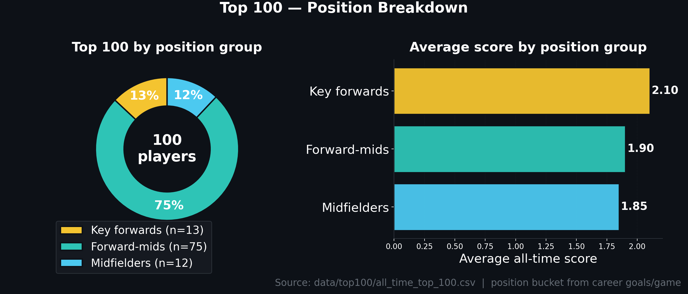
<!-- POSITION-BREAKDOWN-CHART-END -->

#### The problem it solves

Comparing players across eras is hard. A midfielder in 2024 has 20+ stats tracked. A midfielder in 1965 had 4. If you just add up stats, modern players always win — not because they were better, but because more was counted. The formula below tries to make comparisons fair.

#### How the ranking works (plain English)

**Step 1 — Score each season fairly**

Each season is scored using only the stats that existed at the time. A 1960s player isn't penalised for not having a "contested possession" count — that stat didn't exist yet.

| Era | Stats used for scoring |
|-----|----------------------|
| Before 1965 | Goals and behinds only |
| 1965–1990 | + kicks and handballs |
| 1991–2010 | + marks |
| 2011–now | + tackles, clearances, contested possessions, contested marks, one-percenters, goal assists |

No single stat can make up more than 55% of a player's score in any season. This stops one freakish goal-kicking year from drowning out everything else.

**Step 2 — Compare players against their peers, not everyone**

A key forward kicking 4 goals a game will always score higher in raw numbers than a midfielder. So players are compared within three groups based on their career goals-per-game:

| Group | Goals per game | Examples |
|-------|---------------|---------|
| Key forwards | 3.0 or more | Lockett, Dunstall, Ablett Sr, Lloyd, Franklin |
| Forward-midfielders | 0.8–2.99 | Carey, Matthews, Bartlett, Dangerfield, Ablett Jr |
| Midfielders/defenders | Under 0.8 | Pendlebury, Parker, Neale |

A midfielder ranked #1 in their group is genuinely considered the best midfielder of their era — not just "not as good as Lockett."

**Step 3 — Adjust for era completeness**

Even within a group, pre-1990 seasons have fewer stats tracked, so scores are slightly scaled down for modern players to close that gap. Post-2010 seasons are still scaled down a little too — GPS distance, defensive pressure acts, and other modern measures still aren't in the data.

**Step 4 — Calculate the final score**

```
Final score = average of best 8 seasons × (1 + career bonus) + peak bonus
```

- **Best 8 seasons** — rewards sustained excellence. Using only top 5 was tried but let a few players with 2–3 exceptional seasons rank too high.
- **Career bonus** — up to +30% for playing 300+ games. Capped so a long-but-average career can't beat a shorter-but-brilliant one.
- **Peak bonus** — extra credit for having a season where you were clearly the best player in the competition.
- Minimum 150 games required to be ranked.

**Step 5 — Guarantee historical coverage**

The best player from each decade (1900s, 1910s … 2020s) is guaranteed a spot. This ensures the list isn't dominated by recent players just because the data is richer.

#### Re-run the rankings

> **Needs GPU.** See [GPU setup](#setting-up-gpu-acceleration-optional) if you haven't configured CUDA yet — CPU-only runs are 10–30× slower.

```bash
# Quick re-run (uses cached data, ~5–10 min)
python top_players_comprehensive.py

# Full re-run from scratch (clears cache first)
rm -f data/top100/all_time_top_100.csv
python top_players_comprehensive.py

# Full pipeline (refresh all data + re-rank)
./refresh_and_rank.sh
```

## Using AI agents

**Who is this section for?** Anyone curious about Claude Code or the project's specialised Scientist agent — how to install Claude Code on Ubuntu, how to use it day-to-day, and how to use the Scientist for proper analytical work without burning your token budget.

Learn how this entire project was built using Claude. The setup steps walk through getting Claude Code running on Ubuntu, and the second sub-section covers day-to-day use of plain Claude and the Scientist agent.

### Setting up Claude Code on Ubuntu

This section walks you through getting Claude Code running on a fresh Ubuntu laptop — from zero to having an AI agent that can read your AFL data, write code, and improve the prediction model.

#### What you need before you start

- An Ubuntu laptop (20.04 or newer) — a gaming laptop works great, specs don't need to be high for Claude itself
- A Claude subscription — go to [claude.ai](https://claude.ai) and sign up; the **entry level (Pro) plan is enough** for everything in this repo
- Internet connection

---

#### Step 1 — Install Node.js

Claude Code runs on Node.js. Install it via the official NodeSource repository (the version in Ubuntu's default package manager is often too old):

```bash
curl -fsSL https://deb.nodesource.com/setup_20.x | sudo -E bash -
sudo apt install -y nodejs
```

Verify:
```bash
node --version   # should show v20 or higher
npm --version
```

---

#### Step 2 — Install Claude Code

Claude Code is installed as a global npm package:

```bash
npm install -g @anthropic-ai/claude-code
```

Verify:
```bash
claude --version
```

---

#### Step 3 — Log in to your Claude account

```bash
claude login
```

This opens a browser window. Log in with the same account you used to sign up at claude.ai. Once authenticated, your terminal will confirm you're logged in.

---

#### Step 4 — Install Python and project dependencies

This repo uses Python 3.12. Set up a virtual environment:

```bash
sudo apt install -y python3.12 python3.12-venv python3-pip

# Create a virtual environment
python3.12 -m venv ~/.venv/afl
source ~/.venv/afl/bin/activate

# Install project dependencies
cd /path/to/SuperCoach-VIA
pip install -r requirements.txt
```

To activate the environment every time you open a terminal, add this to your `~/.bashrc`:
```bash
echo 'source ~/.venv/afl/bin/activate' >> ~/.bashrc
source ~/.bashrc
```

---

#### Step 5 — Open the project in Claude Code

```bash
cd /path/to/SuperCoach-VIA
claude
```

You'll see the Claude Code prompt. You're now inside an AI-powered terminal that understands your entire codebase. Try:

```
what does this project do?
```

Claude will read the code and explain it to you in plain English.

---

#### Step 6 — Verify everything works end to end

```bash
# In the Claude Code prompt, type:
run the prediction for next round
```

Claude will give you the exact command. Run it. If it works, you're set up correctly.

---

#### Step 7 — Setting the default model (save your token budget)

By default, Claude Code uses whatever model your account is set to — and on most plans that's the most powerful (and most expensive) model available. For day-to-day work in this repo — asking questions, fixing small bugs, pushing to git, updating the README — you don't need that horsepower. The cheaper Sonnet model handles all of it just as well, and burns through your monthly token budget much more slowly.

The Scientist agent is different. It needs the extra brainpower of Opus for proper statistical analysis, so it's already configured to use Opus regardless of your default. Setting Sonnet as your default means your everyday Claude chats are cheap, and only the Scientist costs you the heavy tokens — which is exactly what you want.

To set Sonnet as your default, run this once:

```bash
# Create or edit ~/.claude/settings.json
mkdir -p ~/.claude
cat > ~/.claude/settings.json << 'EOF'
{
  "model": "sonnet"
}
EOF
```

That's it. From now on, every plain Claude session uses Sonnet. **You don't need to do anything special to invoke the Scientist on Opus** — it's already configured in `.claude/agents/Scientist.md` to override the default for that one agent.

To verify which model you're on, type this inside any Claude Code session:

```
/model
```

It'll print the current model. You can also use `/model` to switch interactively if you ever want to bump a single session up to Opus without changing the default.

| Task | Model used | How |
|------|-----------|-----|
| Everyday Claude (questions, git, README) | Sonnet | Default in `~/.claude/settings.json` |
| Scientist agent | Opus | Configured in `.claude/agents/Scientist.md` |

---

#### Troubleshooting common issues

| Problem | Fix |
|---------|-----|
| `claude: command not found` | Run `npm install -g @anthropic-ai/claude-code` again; make sure `/usr/bin` is in your PATH |
| `claude login` doesn't open a browser | Copy the URL it prints and paste it into your browser manually |
| Python packages fail to install | Make sure your venv is activated: `source ~/.venv/afl/bin/activate` |
| `ModuleNotFoundError` when running scripts | You're using the wrong Python — use the full venv path: `/path/to/.venv/afl/bin/python prediction.py` |
| Claude says it can't find files | Make sure you're in the repo directory when you start Claude: `cd SuperCoach-VIA && claude` |

---

### Using Claude and the Scientist agent

Once Claude Code is set up (see above), you interact with it entirely in plain English — no commands to memorise, no code to write. This section covers how to get the most out of it, and specifically how to use the Scientist agent to improve the prediction model.

---

> ## **STOP. READ THIS FIRST. DO NOT WASTE THE SCIENTIST.**
>
> ### **The Scientist is expensive. Use it wisely.**
>
> The Scientist agent runs on **Claude Opus** — the most powerful and **most expensive** Claude model that Anthropic ships. Every time you invoke the Scientist, you are spending **a lot more tokens** than a normal Claude conversation would use.
>
> If you are on an **entry-level Claude subscription** (Pro, or any plan with a monthly token budget), you have a **finite number of tokens per month**. Burning them on trivial questions to the Scientist is the fastest way to **run out before the end of the month** and find yourself unable to use Claude at all.
>
> **The rule is simple:**
>
> > **Use the Scientist ONLY when you need it to read your data and your code, and do something analytical with it.**
> >
> > **For literally everything else, just talk to plain Claude — or use Google.**
>
> Plain Claude (no `@"Scientist (agent)"` prefix) is already extremely capable. It can answer questions, explain code, write small scripts, and chat with you — all on a much cheaper model. Save the Scientist for the heavy lifting it was built for.
>
> **Tip:** set Sonnet as your default model (see [Step 7 in the setup section](#step-7--setting-the-default-model-save-your-token-budget)) so only the Scientist uses Opus. This is the single biggest thing you can do to make your token budget last the month.

#### **Good questions for Scientist vs. Don't waste Scientist on this**

| Good questions for Scientist (worth the cost) | Don't waste Scientist on this (use plain Claude or Google) |
|---|---|
| Analyse the backtest and improve the model | What is the weather today? |
| Why is the model consistently under-predicting midfielders? | Who won the 2024 AFL grand final? |
| Find any data leakage in the prediction pipeline | What does `print()` do in Python? |
| The backtest shows a bias of -1.3 — find the root cause and fix it | How do I open a CSV file in Excel? |
| Optimise `prediction.py` without changing the results | What is machine learning? |
| Which teams is the model most wrong about, and why? | Can you write me a haiku about footy? |
| Round 1 accuracy is always worse than other rounds — investigate and fix it | What time is it? |
| Check `prediction.py` for bugs that could cause wrong predictions | How many players are in an AFL team? |
| Run a statistical analysis on the backtest errors and identify the biggest contributors | Explain what a `for` loop is |
| Look for feature engineering improvements based on the residuals | What's the capital of Australia? |
| Compare the last three backtests and tell me whether MAE is genuinely improving or just noise | Can you summarise the README for me? |
| Investigate why predictions for a specific player are systematically off | Say hello |

#### **A simple rule of thumb**

Ask yourself one question before typing `@"Scientist (agent)"`:

> **"Does answering this require Claude to actually open my CSV files, read my Python code, and do real analytical work on it?"**
>
> - **Yes** → Use the Scientist. This is what it's for.
> - **No** → Use plain Claude. Or Google. Or a calculator. Anything cheaper.

If you just want a chat, a definition, a quick code explanation, or general help — **don't @ the Scientist**. Just type your question normally. Plain Claude will handle it for a fraction of the cost.

Treat the Scientist like calling in a senior consultant. You wouldn't pay a consultant $500/hr to tell you what time it is. Same idea here.

---

#### First time using Claude? Here's exactly what to do

Never spoken to an AI before? Here is the shortest possible path from "zero" to "asking Claude a question about footy data". You only need to do steps 1 to 4 once.

1. Go to [claude.ai](https://claude.ai) and create a free account (the entry-level subscription is enough for most tasks in this repo).
2. Open a terminal on your laptop (press `Ctrl+Alt+T` on Ubuntu, or search "Terminal" in your apps).
3. Navigate to this folder: type `cd ~/git/SuperCoach-VIA` and press Enter. (`cd` stands for "change directory" — it tells the terminal which folder to work in.)
4. Start Claude Code by typing `claude` and pressing Enter. The first time only, it'll ask you to log in via your browser — follow the link it prints.
5. You'll see a `>` prompt. **Type your question in plain English** — no special syntax — and press Enter. For example:
   - *"Who are the top 5 disposal getters in 2026 and what does the data say about their Brownlow chances?"*
   - *"My favourite team is Hawthorn. What do their stats say about their chances of making the grand final?"*
   - *"I play SuperCoach. Which players should I trade in this week based on the prediction model?"*
6. Claude will read the data files in this project and answer you — no coding needed. If it wants to run a script or change a file, it'll tell you what it's about to do first.

That's the whole loop. Open a terminal, type `claude`, ask a question. From there, the rest of this section is about making the most of it (and not burning your token budget on the Scientist).

---

#### How Claude Code works

Start it from the project folder:

```bash
cd /path/to/SuperCoach-VIA
claude
```

You'll see a `>` prompt. Type what you want in plain English. Claude reads every file in the project and can run commands, edit code, and explain what it's doing — all in response to plain-English instructions.

```
what does this project do?
run the prediction for next round
the backtest crashed — fix it
push my changes to main
```

Press `Enter` to send. Claude will respond, and if it needs to run a command or edit a file, it will ask for your permission first (or just do it, depending on your settings).

---

#### The Scientist agent — your data science expert

The Scientist is a specialised sub-agent built into this project. It has deep expertise in data science methodology — feature engineering, model evaluation, bias detection, statistical testing — and is the main tool for improving prediction accuracy.

**How to invoke it:** type `@"Scientist (agent)"` at the start of your message, then describe the task.

```
@"Scientist (agent)" [your task here]
```

That's it. The Scientist will spin up, read the relevant files, do the analysis, and report back. You don't need to tell it where the files are or how the code works — it figures that out itself.

---

#### What to ask the Scientist

##### After every backtest — improve the model

This is the most important use. After running `backtest.py`, hand the results to the Scientist:

```
@"Scientist (agent)" analyse the backtest and improve the prediction model
```

The Scientist will:
1. Read all the backtest CSVs and the log file
2. Calculate where the model is systematically wrong — which teams, which players, which disposal ranges
3. Identify the root cause (e.g. "the model is compressing high-disposal predictions due to the log transform")
4. Make targeted changes to `prediction.py` to fix what it found
5. Tell you exactly what it changed and what improvement to expect

You then re-run the backtest to verify the improvement.

##### Check if a run finished

If you started a backtest or prediction run and your laptop restarted or you closed the terminal:

```
@"Scientist (agent)" check the status of the last backtest run
```

It will look at the output files and logs and tell you exactly what completed, what's missing, and whether you need to re-run anything.

##### Investigate a specific problem

```
@"Scientist (agent)" the model keeps under-predicting Daicos — find out why and fix it
@"Scientist (agent)" round 1 accuracy is always much worse than other rounds — why?
@"Scientist (agent)" look at prediction.py and find any bugs that could cause wrong results
@"Scientist (agent)" which teams is the model most consistently wrong about?
```

##### Optimise slow code

```
@"Scientist (agent)" prediction.py is running slowly — find optimisations without changing the results
```

##### Understand the data

```
@"Scientist (agent)" what does the distribution of disposals look like across positions and teams?
@"Scientist (agent)" are there any data quality issues in the player CSVs I should know about?
```

---

#### The improvement loop — how to get better predictions week by week

```
1. Refresh data        →  type: refresh the data
2. Run backtest        →  python backtest.py --start-year 2026 --start-round 1
3. Invoke Scientist    →  @"Scientist (agent)" analyse the backtest and improve the model
4. Re-run backtest     →  verify MAE dropped
5. Push changes        →  type: push the changes to main
6. Predict next round  →  python prediction.py
```

Repeat steps 3–5 as many times as you like. Each iteration typically improves MAE by 0.2–0.5 disposals. The improvement compounds — the model that predicted 2026 R8 at MAE 4.1 started at MAE 4.9 after several rounds of Scientist-driven improvements.

---

#### Other useful Claude commands (no Scientist needed)

These work by just typing them at the Claude prompt:

| What you type | What Claude does |
|---------------|-----------------|
| `push the changes to main` | Commits all changes and pushes to GitHub |
| `update the readme` | Updates this file based on what changed |
| `what does prediction.py do?` | Explains the code in plain English |
| `the backtest crashed with [paste error] — fix it` | Diagnoses and fixes the error |
| `show me the top 10 most over-predicted players from the last backtest` | Reads the CSV and answers |
| `what is the current prediction accuracy?` | Summarises the latest backtest results |
| `explain why the model under-predicted [player name]` | Looks at their stats and explains |

---

#### Tips for better results

- **Paste the full error message.** If something crashes, copy everything from the terminal and paste it in. Claude fixes it faster with the full stack trace.
- **Be specific about what you care about.** "I care more about getting the top 20 players right than overall accuracy" helps the Scientist make better trade-offs.
- **Ask it to explain before changing.** Type "what would you change and why?" first — you can redirect it before it touches any code.
- **One session, one push.** At the end of any session where the model improved, type "push the changes to main" so you don't lose the work.
- **Tell the Scientist what surprised you.** "The model got Pendlebury badly wrong last round — why?" is better than "improve accuracy." Specific questions get specific answers.

## Technical reference

**Who is this section for?** Anyone setting up the environment or contributing back. GPU configuration, the on-disk data layout, where the source data comes from, and how to contribute or use the project.

Setup guides and reference docs. GPU acceleration is optional, the data layout is documented, and the source links and contributing notes round out the section.

### Setting up GPU acceleration (optional)

The prediction scripts run faster with an NVIDIA GPU. If you don't have one, everything still works — just use `prediction_cpu.py` instead of `prediction.py`, and the ranking script falls back to CPU automatically.

#### Do you need GPU setup?

- **No GPU / not sure** — use `prediction_cpu.py`, skip this section
- **NVIDIA GPU on Linux** — follow the steps below
- **NVIDIA GPU on Windows** — GPU DataFrame support doesn't work on native Windows; either use WSL2 (Windows Subsystem for Linux) or use `prediction_cpu.py`

#### Step 1 — Check your GPU works

```bash
nvidia-smi
```

You should see your GPU name and a CUDA version number. If this command fails, install the latest NVIDIA driver from [nvidia.com/drivers](https://www.nvidia.com/drivers) first.

#### Step 2 — Install the CUDA toolkit

```bash
wget https://developer.download.nvidia.com/compute/cuda/repos/ubuntu2204/x86_64/cuda-keyring_1.1-1_all.deb
sudo dpkg -i cuda-keyring_1.1-1_all.deb
sudo apt update
sudo apt install -y cuda-toolkit-12-4
```

Then add CUDA to your terminal path (paste into `~/.bashrc`):

```bash
export PATH=/usr/local/cuda/bin:$PATH
export LD_LIBRARY_PATH=/usr/local/cuda/lib64:$LD_LIBRARY_PATH
```

Reload: `source ~/.bashrc`, then verify: `nvcc --version`

#### Step 3 — Install the GPU libraries

```bash
# GPU DataFrame library (speeds up ranking)
pip install cudf-cu12 cupy-cuda12x --extra-index-url=https://pypi.nvidia.com

# GPU-enabled LightGBM (speeds up predictions)
pip install lightgbm --config-settings=cmake.define.USE_CUDA=ON
```

#### Step 4 — Verify everything works

```bash
python cuDF_test.py   # should print "cuDF working"
python testGPU.py     # should print "LightGBM GPU working"
python prediction.py  # should say "Running on GPU" at the top
```

#### Laptop tips

If you're on a gaming laptop and predictions feel slow:
- Set your laptop to Performance power mode
- Check that it's using the NVIDIA GPU, not the integrated Intel/AMD one (look in BIOS or Armoury Crate)
- If you see `CUDA out of memory`, switch to `prediction_cpu.py`

### How the data is organised

```
data/
  matches/          — one CSV per year: every match result 1897–now
  lineups/          — team lineups by season
  player_data/      — one CSV per player: their full career stats
  top100/           — all-time and yearly rankings
  prediction/       — disposal predictions (next round)
    backtest/       — historical accuracy results
```

#### Match data columns

Each row in `data/matches/matches_YEAR.csv` is one game:

`year, round, venue, date, home_team, away_team, home_q1_g, home_q1_b, ...`  
(goals and behinds for each quarter, final totals, winning team, margin)

#### Player data columns

Each player has two files in `data/player_data/`:

**Performance file** (`*_performance_details.csv`) — one row per game played:  
`team, year, round, opponent, kicks, marks, handballs, disposals, goals, behinds, tackles, clearances, brownlow_votes, ...`

**Personal file** (`*_personal_details.csv`):  
`first_name, last_name, born_date, debut_date, height, weight`

### Data sources

- Match results and player stats: [AFL Tables](https://afltables.com/afl/afl_index.html)
- Historical betting odds: [AusSportsBetting](https://www.aussportsbetting.com/data/historical-afl-results-and-odds-data/)

### Quick command reference

Bookmark this — it's everything you'll ever need to type:

| What you want to do | Command |
|---|---|
| Get this week's predictions (GPU) | `python prediction.py` |
| Get this week's predictions (CPU, slower) | `python prediction_cpu.py` |
| Update all data + rankings + README | `./refresh_and_rank.sh` |
| Check how accurate past predictions were | `python backtest.py --start-year 2026 --start-round 1` |
| Pull the latest code changes | `git pull` |
| Ask Claude a question about the data | `claude` (then type your question) |
| Activate your Python environment | `source .venv/bin/activate` |

### Glossary

A quick plain-English reference for the footy and tech terms used in this README. If something here didn't make sense above, this is the place to look it up.

**Footy stats**

- **Disposal** — a kick or handball; the main currency of AFL statistics, and the thing this project's prediction model is built around.
- **Contested possession** — winning the ball when an opponent is trying to take it from you; a sign of physicality and willingness to compete at ground level.
- **Clearance** — getting the ball away from a stoppage (a ball-up or boundary throw-in); a key indicator of midfield dominance.
- **Inside 50** — moving the ball into your forward 50-metre arc; more inside 50s = more scoring opportunities.
- **Hitout** — a ruckman tapping the ball at a ruck contest. Not all hitouts are useful, which is why "hitouts to advantage" matters in modern analysis.
- **Clanger** — a mistake: a turnover, a dropped mark, an errant kick. Lower is better.
- **Brownlow Medal** — the AFL's individual award for the "fairest and best" player, voted on by on-field umpires using a 3-2-1 system per game.
- **SuperCoach** — Australia's most popular AFL fantasy competition. You pick a squad of real AFL players and score points based on their actual in-game stats each week. Disposals are the biggest scoring category.

**Tech and AI**

- **LightGBM** — a fast machine-learning library (the kind of maths the computer uses to find patterns); this project uses it to predict disposals.
- **Machine learning** — letting a computer find patterns in lots of past data and then use those patterns to make a guess about a new situation. No, it isn't sentient.
- **z-score** — a number that says how many "standard steps" above or below average something is; a z-score of +2 means "much better than average".
- **Walk-forward backtest** — testing a prediction model by simulating how it would have performed in the past, round by round, without using future data to cheat. The honest way to grade a model.
- **GPU** — the graphics card in a computer; originally built for video games, but also very fast at the kind of maths machine learning needs. Running without a GPU is like doing your tax return by hand instead of with a calculator — possible, just much slower.
- **CLI / terminal** — the text window where you type commands. Looks old-fashioned, but it's the fastest way to run data pipelines.
- **Python** — the programming language all the scripts in this project are written in. You don't need to know Python to use this project.
- **venv** — short for "virtual environment". It's a Python self-contained box of software libraries so this project doesn't mess with anything else on your laptop.
- **Claude / Claude Code** — Claude is Anthropic's AI assistant; Claude Code is the version that runs in your terminal so it can read your files, edit code, and run commands on your behalf.
- **Scientist agent** — a specialised version of Claude built into this project that runs on the most powerful (and most expensive) Claude model. Use it sparingly — see the warning above the Scientist examples.

## Roadmap — what's coming next

The core engine is solid. Here's what's being built next:

- **Web dashboard** — one-click predictions and beautiful player cards, no terminal needed
- **Docker one-liner** — `docker run -p 8501:8501 apur27/supercoach-via` opens everything in your browser
- **SuperCoach team optimiser** — paste your squad, get data-driven trade suggestions for the week
- **Injury and suspension filter** — automatically remove players who are out before generating predictions
- **Mobile-friendly view** — check predictions on your phone before lockout
- **Hosted version** — auto-updates every Monday morning after the weekend's games

Want any of these faster? Star the repo or open a GitHub issue — it genuinely helps prioritise.

## Contributing

Got an idea, found a bug, or want to help build the web dashboard?

- **Open an issue** with the label `enhancement` or `bug` — describe what you want or what went wrong
- **Star the repo** — it genuinely helps other footy fans find the project and helps prioritise the roadmap
- **Submit a pull request** — all contributions welcome, especially new stat categories, better models, or documentation improvements

Not a developer? That's fine — opening an issue with a feature request or a question is just as valuable.

## License

MIT License — see the [LICENSE](LICENSE) file.

---

⭐ **If this helped your SuperCoach team this week, please star the repo** — it helps other footy fans find it.
