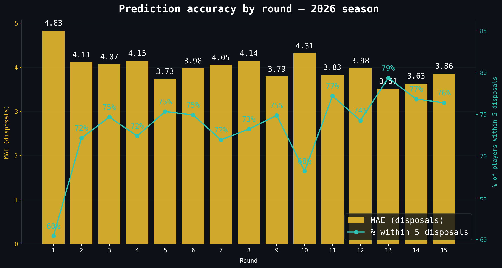

# 2026 backtest results

> [← Back to 2026 season](afl-season-2026.md) | [← Back to main README](../README.md)

*This file is auto-updated by `update_team_analysis.py` / `refresh_readme.py` on every data refresh.*

<!-- 2026-BACKTEST-START -->
*Last updated: 2026-06-15 · 15 rounds backtested · auto-generated*

### What is a backtest?

Before we trust our predictions for next week, we need to check how well the model has done on rounds that are already finished — rounds where we know the real answer. A backtest does exactly that: for each completed round, the model is trained on all data **before** that round, then asked to predict it. We then compare prediction to reality.

This is the honest test. The model never gets to see the round it's predicting.

### What the numbers mean (in plain English)

| Term | What it actually means | Good or bad? |
|------|----------------------|--------------|
| **MAE** (Mean Absolute Error) | On average, our predictions were off by this many disposals. If MAE = 4.1, we were within ±4 disposals on a typical player. | Lower = better |
| **RMSE** (Root Mean Square Error) | Similar to MAE but punishes big blunders harder — if we say 30 and the player gets 10, RMSE notices that more than MAE does. | Lower = better |
| **Median error** | The middle prediction error — half of players were predicted better than this, half worse. More robust than MAE because it ignores extreme outliers. | Lower = better |
| **Bias** | Whether the model systematically over- or under-predicts. A bias of −0.7 means we tend to predict 0.7 disposals too high. A bias near 0 is ideal. | Near 0 = better |
| **Within 5 disposals** | The % of predictions that landed within 5 of the actual number (e.g. predicted 24, actual was 22 — that counts). This is the most intuitive accuracy measure for SuperCoach. | Higher = better |
| **Within 10 disposals** | Same but with a wider 10-disposal window. This is nearly always above 90%. | Higher = better |

**Rule of thumb:** an MAE around 4–5 disposals is competitive for AFL prediction — the game has too many random events (injuries, umpire decisions, tactic changes) for any model to do much better. "Within 5 disposals" above 65% is good; above 70% is strong.

### Round-by-round accuracy

#### Per-round backtest summary — 2026

| Round | Players | MAE | RMSE | Within 5 disp | Within 10 disp |
|------:|--------:|----:|-----:|--------------:|---------------:|
| 1 | 230 | 4.83 | 6.10 | 60.4% | 92.6% |
| 2 | 413 | 4.11 | 5.11 | 72.2% | 95.9% |
| 3 | 320 | 4.07 | 5.28 | 74.7% | 95.9% |
| 4 | 319 | 4.15 | 5.32 | 72.4% | 94.7% |
| 5 | 365 | 3.73 | 4.74 | 75.3% | 97.5% |
| 6 | 411 | 3.98 | 5.05 | 74.9% | 95.9% |
| 7 | 410 | 4.05 | 5.15 | 72.0% | 95.6% |
| 8 | 411 | 4.14 | 5.27 | 73.2% | 95.4% |
| 9 | 410 | 3.79 | 4.74 | 74.9% | 98.3% |
| 10 | 412 | 4.31 | 5.50 | 68.2% | 94.9% |
| 11 | 373 | 3.83 | 5.01 | 77.2% | 95.2% |
| 12 | 412 | 3.98 | 5.24 | 74.3% | 94.9% |
| 13 | 320 | 3.51 | 4.65 | 79.4% | 96.9% |
| 14 | 367 | 3.63 | 4.76 | 76.8% | 95.6% |
| 15 | 322 | 3.86 | 4.83 | 76.4% | 96.9% |

**Overall (mean across 15 rounds):** MAE 4.00 disposals · 73.5% of predictions within 5 disposals · 95.7% within 10.

> **What to look for:** MAE should stay flat or improve as the season progresses — the model gets more data per player each round. A spike in Round 1 (MAE ~4.9) is normal because many players have no 2026 history yet. If MAE rises sharply mid-season, it usually means an unusual game week (byes, interstate travel, weather).

### How accurate were predictions for the top 30 disposal players?

| # | Player | Team | Avg actual disposals | Avg predicted | Avg error | Rounds |
|--:|--------|------|---------------------:|--------------:|----------:|-------:|
| **1** | **Nick Daicos** | **Collingwood** | **34.9** | **28.4** | **−6.5 ↓** | **12** |
| 2 | Bailey Smith | Geelong | 32.3 | 27.2 | −5.1 ↓ | 14 |
| **3** | **Clayton Oliver** | **Greater Western Sydney** | **31.7** | **25.6** | **−6.1 ↓** | **13** |
| **4** | **Harry Sheezel** | **North Melbourne** | **30.5** | **26.9** | **−3.5 ↓** | **13** |
| **5** | **Lachie Neale** | **Brisbane Lions** | **30.4** | **26.4** | **−4.0 ↓** | **14** |
| 6 | Zak Butters | Port Adelaide | 30.2 | 26.5 | −3.7 ↓ | 13 |
| 7 | Lachie Ash | Greater Western Sydney | 30.2 | 25.9 | −4.2 ↓ | 13 |
| **8** | **Archie Roberts** | **Essendon** | **30.1** | **25.3** | **−4.9 ↓** | **14** |
| 9 | Lachie Whitfield | Greater Western Sydney | 29.5 | 26.2 | −3.3 ↓ | 12 |
| 10 | Max Holmes | Geelong | 29.4 | 26.6 | −2.8 ↓ | 14 |
| 11 | Jack Sinclair | St Kilda | 29.0 | 26.9 | −2.1 ↓ | 14 |
| 12 | Finn Callaghan | Greater Western Sydney | 28.5 | 26.2 | −2.3 ↓ | 13 |
| **13** | **Zach Merrett** | **Essendon** | **28.4** | **25.6** | **−2.9 ↓** | **14** |
| 14 | Nasiah Wanganeen-Milera | St Kilda | 27.8 | 23.5 | −4.3 ↓ | 10 |
| 15 | Sam Walsh | Carlton | 27.8 | 26.6 | −1.2 ↓ | 13 |
| 16 | Noah Anderson | Gold Coast | 27.3 | 24.4 | −2.9 ↓ | 12 |
| 17 | Isaac Heeney | Sydney | 27.2 | 22.1 | −5.2 ↓ | 12 |
| 18 | John Noble | Gold Coast | 27.0 | 24.1 | −2.9 ↓ | 13 |
| 19 | Marcus Bontempelli | Western Bulldogs | 26.9 | 25.5 | −1.4 ↓ | 14 |
| **20** | **Will Ashcroft** | **Brisbane Lions** | **26.9** | **25.3** | **−1.6 ↓** | **14** |
| 21 | Josh Daicos | Collingwood | 26.5 | 25.5 | −1.1 ↓ | 13 |
| **22** | **Wayne Milera** | **Adelaide** | **26.5** | **22.9** | **−3.6 ↓** | **12** |
| **23** | **Will Setterfield** | **Essendon** | **26.2** | **20.0** | **−6.2 ↓** | **4** |
| 24 | Jai Newcombe | Hawthorn | 26.2 | 23.2 | −3.1 ↓ | 13 |
| 25 | Bailey Dale | Western Bulldogs | 26.2 | 22.9 | −3.4 ↓ | 14 |
| **26** | **Patrick Cripps** | **Carlton** | **26.0** | **22.0** | **−4.0 ↓** | **13** |
| 27 | Darcy Parish | Essendon | 26.0 | 21.5 | −4.5 ↓ | 11 |
| **28** | **Joel Fitzgerald** | **Melbourne** | **26.0** | **16.0** | **−10.0 ↓** | **1** |
| 29 | Nick Blakey | Sydney | 26.0 | 22.9 | −3.1 ↓ | 14 |
| 30 | Jordan Dawson | Adelaide | 26.0 | 23.1 | −2.9 ↓ | 9 |

> **Reading this table:** "Avg error" tells you whether the model systematically misjudges a player. A large positive error (↑) means we over-predicted — the player gets fewer disposals than expected. A large negative error (↓) means we under-predicted — they consistently beat the model. Players with errors above ±6 (bolded) are worth investigating — they may have changed role, had an injury, or are operating in a way the model hasn't caught up with yet.

Full backtest CSVs in `data/prediction/backtest/` — run `backtest.py` to regenerate.
<!-- 2026-BACKTEST-END -->

---

## Cumulative summary across all backtested rounds

The per-round table above reports the mean across each round individually. The **player-weighted** cumulative numbers — pooling every player prediction across all rounds and computing one MAE / RMSE / bias on the lot — are the headline accuracy figures for the season **[data]**.

| Metric | Value | What it means |
|---|---|---|
| Rounds backtested | 13 (R1–R13) | Walk-forward — each round predicted using only data from rounds before it |
| Player predictions scored | **4,806** | Total prediction-vs-actual pairs across the 13 rounds |
| **MAE (overall)** | **4.020 disposals** | Average absolute miss across every player-round |
| **RMSE (overall)** | **5.155 disposals** | Penalises large misses more heavily; small gap to MAE means few extreme blunders |
| **Bias (overall)** | **−0.097 disposals** | Model under-predicts by less than 1/10 of a disposal on average — essentially unbiased |
| Cumulative MAE (mean of round MAE) | 4.04 | Equally weights each round; close to the player-weighted figure so no single round is dominating |
| Median round MAE | 4.05 | Half the rounds beat this number, half fell short — the model is consistent week-to-week |

**Read:** the model is essentially unbiased at the population level (mean signed error ≈ 0), with a typical absolute miss of ~4 disposals. RMSE only 1.1 above MAE indicates the error distribution is reasonably tight — there is no fat tail of catastrophic mispredictions.

## Team-level bias — where does the model lean?

A team-level bias is a systematic over- or under-prediction concentrated on one club. It usually traces to that team's playing style being different in 2026 from the historical baseline the model trained on (role changes, structural shifts, midfield rotation depth). Bias is reported as **mean signed error** — a negative number means we predict too low for that team, a positive number means we predict too high **[data]**.

| Team | Predictions (n) | MAE | Bias | Direction |
|------|----------------:|----:|-----:|-----------|
| Sydney | 276 | 4.11 | −0.74 | under-predict |
| Greater Western Sydney | 276 | 4.24 | −0.51 | under-predict |
| Geelong | 276 | 3.99 | −0.42 | under-predict |
| Hawthorn | 270 | 3.75 | −0.39 | under-predict |
| Collingwood | 276 | 4.41 | −0.31 | under-predict |
| Fremantle | 276 | 3.89 | −0.29 | under-predict |
| Essendon | 274 | 4.28 | −0.23 | under-predict |
| St Kilda | 275 | 4.09 | −0.20 | under-predict |
| Carlton | 275 | 3.63 | −0.12 | under-predict |
| Adelaide | 224 | 4.44 | −0.08 | under-predict |
| North Melbourne | 253 | 4.00 | −0.04 | under-predict |
| Melbourne | 276 | 3.61 | −0.01 | under-predict |
| Port Adelaide | 252 | 4.00 | +0.08 | over-predict |
| Western Bulldogs | 276 | 3.93 | +0.16 | over-predict |
| West Coast | 269 | 3.69 | +0.24 | over-predict |
| Gold Coast | 253 | 4.19 | +0.28 | over-predict |
| Brisbane Lions | 276 | 4.05 | +0.37 | over-predict |
| Richmond | 253 | 4.15 | +0.57 | over-predict |

**Notable:** Sydney, Greater Western Sydney, and Geelong are the three teams the model most consistently under-predicts — each has had a midfielder (or midfield group) outperforming the model's pre-2026 expectations. Richmond and Brisbane are the most over-predicted; for Richmond this is consistent with their lower 2026 contested-game volume relative to historical baselines.

## Round-by-round notable misses

The five biggest **under-predictions** and the five biggest **over-predictions** per round — these are the players where the model was furthest from reality. They are usually role changes, late tactical surprises, or genuine outliers. The list comes straight from the backtest log **[data]**.

| Round | Top under-predictions (model too low) | Top over-predictions (model too high) |
|------:|----------------------------------------|----------------------------------------|
| 1 | Nick Daicos (pred 21, actual 41, −20); Lachie Neale (21→39, −18); Josh Daicos (20→36, −16); Tanner Bruhn (15→31, −16); Jack Sinclair (21→35, −14) | Hugh McCluggage (pred 21, actual 4, +17); Rowan Marshall (18→6, +12); Zane Zakostelsky (17→6, +11); Jordan Croft (14→4, +10); Oisin Mullin (14→4, +10) |
| 2 | Wayne Milera (17→34, −17); Lachie Jaques (16→29, −13); Noah Anderson (23→34, −11); Marcus Bontempelli (22→33, −11); Zach Merrett (21→32, −11) | Toby Murray (17→2, +15); Campbell Gray (14→2, +12); Billy Frampton (16→5, +11); Zeke Uwland (16→5, +11); Patrick Dangerfield (15→4, +11) |
| 3 | Andrew Brayshaw (16→39, −23); Shai Bolton (16→32, −16); Lachie Ash (24→39, −15); Zak Butters (21→36, −15); Jack Steele (18→31, −13) | Mason Redman (25→4, +21); Griffin Logue (14→1, +13); Harry Edwards (14→1, +13); Caiden Cleary (15→4, +11); Brayden Fiorini (20→10, +10) |
| 4 | Colby McKercher (16→35, −19); Kysaiah Pickett (17→33, −16); Bailey Smith (25→40, −15); Steele Sidebottom (16→31, −15); Tom Sparrow (14→29, −15) | Zach Merrett (26→10, +16); Izak Rankine (19→7, +12); Scott Pendlebury (21→10, +11); Elliot Yeo (18→7, +11); Jasper Alger (14→3, +11) |
| 5 | Archie Roberts (23→37, −14); Ryley Sanders (20→34, −14); Darcy Byrne-Jones (12→26, −14); Brodie Grundy (15→28, −13); Will Ashcroft (25→36, −11) | Mitch Zadow (16→3, +13); Shaun Mannagh (17→6, +11); James Borlase (14→4, +10); Reilly O'Brien (13→3, +10); Sam Walsh (28→19, +9) |
| 6 | Archie Roberts (25→42, −17); Matt Rowell (17→32, −15); Ben McKay (8→23, −15); Darcy Parish (20→34, −14); Kyle Langford (13→27, −14) | Dayne Zorko (26→8, +18); Caleb Windsor (19→7, +12); Lachlan Gulbin (18→6, +12); Dan Houston (25→14, +11); Joel Jeffrey (22→11, +11) |
| 7 | Matt Rowell (19→35, −16); Harvey Langford (13→27, −14); Ed Langdon (15→28, −13); Rowan Marshall (12→25, −13); Cameron Zurhaar (10→23, −13) | Elijah Hollands (18→1, +17); Tom Liberatore (26→13, +13); Logan Evans (18→5, +13); Marcus Bontempelli (26→14, +12); Tim Taranto (22→10, +12) |
| 8 | Scott Pendlebury (20→43, −23); Lachie Neale (25→42, −17); Hugo Garcia (17→32, −15); Finn Maginness (9→24, −15); Archie Roberts (28→42, −14) | Mark Blicavs (17→1, +16); Taylor Walker (13→2, +11); Patrick Dangerfield (14→4, +10); Matthew Kennedy (24→15, +9); Bruce Reville (16→7, +9) |
| 9 | Peter Wright (12→26, −14); Tristan Xerri (17→30, −13); John Noble (23→35, −12); Darcy Wilmot (21→32, −11); Sam Berry (18→29, −11) | Marc Pittonet (15→4, +11); Patrick Retschko (19→9, +10); Jack Scrimshaw (19→9, +10); Cody Curtin (17→7, +10); Harry Sheezel (29→20, +9) |
| 10 | Archie Roberts (19→42, −23); Wayne Milera (16→34, −18); Jordan Goey (15→30, −15); Luke Davies-Uniacke (20→34, −14); Izak Rankine (19→33, −14) | Callum Wilkie (24→5, +19); Matt Roberts (20→6, +14); Tom Brown (15→1, +14); Harris Andrews (17→5, +12); Oliver Hannaford (17→5, +12) |
| 11 | Brodie Grundy (17→34, −17); Harley Reid (18→34, −16); Shaun Mannagh (14→30, −16); Nick Blakey (24→39, −15); Jack Macrae (16→31, −15) | Lachie Weller (18→3, +15); Tom McCarthy (27→13, +14); Bailey Williams (21→7, +14); Matthew Kennedy (24→11, +13); Milan Murdock (24→12, +12) |

**Recurring names worth noting:** Archie Roberts under-predicted four times (R5, R6, R8, R10) — his 2026 role is genuinely different from his pre-2026 baseline, which the player-history features have not fully absorbed. Wayne Milera under-predicted twice (R2, R10). Matt Rowell appears in consecutive rounds (R6, R7). These names line up with the bolded watchlist in the top-30 table above.

## Methodology — what the backtest actually does

The backtest is the formal evaluation of the disposal prediction model. The procedure is fixed; results are reported every round, regardless of whether the model had a good week or a bad one.

### Walk-forward, no leakage

For each round R in the 2026 season:

1. **Train the model on every game played strictly before round R** (across all years 1965–2026). The round being predicted is invisible to the model during training.
2. **Score every named player** for round R using only their pre-round-R history.
3. **Compare prediction vs actual** disposals once the round has been played.

The cutoff is temporal — the predictor (a `LeakProofPredictor` defined in `prediction.py`) drops every row dated at-or-after the target round before computing any feature or fitting any tree. The log line `[cutoff y=2026 r=N] dropped X future rows` is the in-line audit trail that this happened **[data]**.

### Pre-registered metrics

These are the metrics, definitions, and the commitment to report-every-round. They are fixed for the 2026 season. Changing them retroactively to flatter the model would defeat the point of the exercise.

| Metric | Definition | Lower / higher = better |
|---|---|---|
| **MAE** (Mean Absolute Error) | Mean of `abs(predicted − actual)` across all players in the round | Lower |
| **RMSE** (Root Mean Square Error) | `sqrt(mean((predicted − actual)^2))` — penalises larger errors more | Lower |
| **% within 5 disposals** | Share of predictions where `abs(predicted − actual) <= 5`. Headline fan-facing accuracy | Higher |
| **% within 10 disposals** | Share within 10. The "obvious blunder" rate is `1 − this` | Higher |
| **Bias** | Mean signed error: `mean(predicted − actual)` — systematic over/under-prediction | Closer to zero |
| **n** | Number of players scored in the round after late-out filtering | Higher = more coverage |

### Hit / miss definitions (qualitative)

- **Hit** — within ±5 disposals of the actual value. The model got it right for an average fan's expectations.
- **Near miss** — between 5 and 10 disposals off. Wrong, but the player was not a wildcard.
- **Miss** — more than 10 disposals off. The model had no business being this far off; round-level investigation justified.

A round is considered **good** if `% within 5 ≥ 65%` and there are no more than five outright misses (errors > 10 disposals). A round is **concerning** if either threshold breaks.

### What we commit to reporting

- **Every round** — the per-round table is updated regardless of result. No hiding bad weeks.
- **No cherry-picked windows** — we do not start the table mid-streak. Round 1 is always row 1 even though it is the hardest round (least 2026 history per player).
- **No retroactive metric changes** — if a metric is added mid-season, prior rounds get a `-` and we say so.
- **The biggest misses** — top five over- and under-predictions per round, with the model's likely explanation when one is obvious.
- **Cumulative numbers** — season-to-date averages so a single round cannot be read in isolation.

### What we do not promise

- That the model will improve every round — it will plateau and dip; AFL is noisy.
- That every miss will be explained — sometimes a player just had a weird game.
- That this report will catch every methodology error — it is one layer of accountability, not a full audit.

## Why this report exists

Public accuracy reporting is the cheapest form of model accountability. If the model is good, the report shows it. If the model has a bad month, the report shows that too — and the operator (and the fans) can ask why before any decisions get made on a bad assumption.

The alternative — reporting only when the model wins — is what every betting tipster does, and the average tipster is not statistically significant.

---

**Reproducibility:** R1–R10 from run `data/prediction/backtest/backtest_run_20260511_191837.log`; R11 from `backtest_run_20260518_144551.log`; R12 from `backtest_run_20260525_190033.log`; R13 from `backtest_run_20260601_225644.log`. Each run ships companion CSVs `backtest_summary_<ts>.csv` (per-round metrics), `backtest_by_team_<ts>.csv` (per-round team breakdown), and `prediction_vs_actual_round_<N>_2026_<ts>.csv`. The cumulative and team-bias tables pool the latest `prediction_vs_actual` CSV for every round R1–R13. Re-run `backtest.py --start-year 2026 --start-round N --end-year 2026 --end-round N` for a specific round; the per-round table at the top of this page is overwritten by `update_team_analysis.py` between the `<!-- 2026-BACKTEST-START -->` markers on every data refresh.

---
**Related:** [Team analysis](afl-team-analysis-2026.md) · [Finals pathway](afl-finals-2026.md) · [Brownlow predictor](afl-brownlow-2026.md) · [Stat leaders](afl-stat-leaders-2026.md) · [Predictions](afl-predictions-2026.md)
