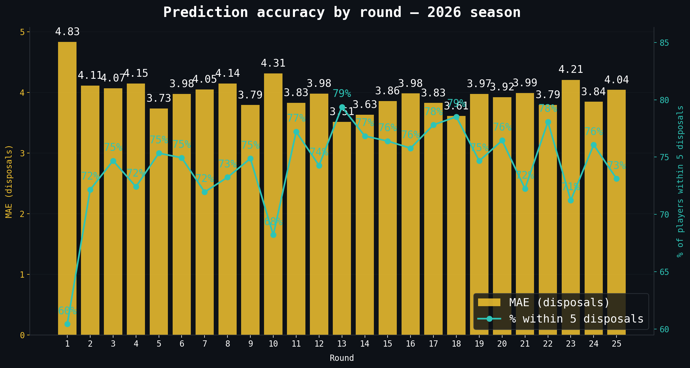

# 2026 backtest results

> [← Back to 2026 season](afl-season-2026.md) | [← Back to main README](../README.md)

*This file is auto-updated by `update_team_analysis.py` / `refresh_readme.py` / `scripts/update_eval_surface.sh` on every data refresh. Every figure on the page is generated from the backtest artifacts, with one deliberate exception: the Round-18 coverage-limitation record is a frozen, dated decision record and is explained as such where it appears.*

<!-- 2026-BACKTEST-START -->
*Last updated: 2026-08-18 · 24 rounds backtested · auto-generated*

### What is a backtest?

Before we trust our predictions for next week, we need to check how well the model has done on rounds that are already finished — rounds where we know the real answer. A backtest does exactly that: for each completed round, the model is trained only on **completed earlier seasons** — never on any part of the season being scored — and is then asked to predict the round using only lagged form. We then compare prediction to reality. See Methodology for the precise window.

This is the honest test: the model is not fitted on the round it is predicting. See the Methodology section for how each round is scored, including which rounds' ordering is independently attested and which rests on self-reported timestamps.

### What the numbers mean (in plain English)

| Term | What it actually means | Good or bad? |
|------|----------------------|--------------|
| **MAE** (Mean Absolute Error) | On average, our predictions were off by this many disposals. If MAE = 4.1, we were within ±4 disposals on a typical player. | Lower = better |
| **RMSE** (Root Mean Square Error) | Similar to MAE but punishes big blunders harder — if we say 30 and the player gets 10, RMSE notices that more than MAE does. | Lower = better |
| **Median error** | The middle prediction error — half of players were predicted better than this, half worse. More robust than MAE because it ignores extreme outliers. | Lower = better |
| **Bias** | Whether the model systematically over- or under-predicts. A bias of −0.7 means we tend to predict 0.7 disposals too **low** — bias is `mean(predicted − actual)`, so a negative number means the model came in under the real figure. A bias near 0 is ideal. | Near 0 = better |
| **Within 5 disposals** | The % of predictions that landed within 5 of the actual number (e.g. predicted 24, actual was 22 — that counts). This is the most intuitive accuracy measure for SuperCoach. | Higher = better |
| **Within 10 disposals** | Same but with a wider 10-disposal window. This is nearly always above 90%. | Higher = better |

**Rule of thumb:** an MAE around 4–5 disposals is competitive for AFL prediction — the game has too many random events (injuries, umpire decisions, tactic changes) for any model to do much better. "Within 5 disposals" above 65% is good; above 70% is strong.

### Round-by-round accuracy

#### Per-round backtest summary — 2026

Every cell below is read from the per-round backtest summaries in `data/prediction/backtest/backtest_summary_*.csv` (newest vintage per round) **[data]**.

| Round | Players | MAE | RMSE | Within 5 disp | Within 10 disp |
|------:|--------:|----:|-----:|--------------:|---------------:|
| 1 | 230 | 4.83 | 6.10 | 60.4% | 92.6% |
| 2 | 413 | 4.11 | 5.11 | 72.2% | 95.9% |
| 3 | 320 | 4.07 | 5.28 | 74.7% | 95.9% |
| 4 | 319 | 4.15 | 5.32 | 72.4% | 94.7% |
| 5 | 365 | 3.73 | 4.74 | 75.3% | 97.5% |
| 6 | 411 | 3.98 | 5.05 | 74.9% | 95.9% |
| 7 | 410 | 4.05 | 5.15 | 72.0% | 95.6% |
| 8 | 411 | 4.14 | 5.27 | 73.2% | 95.4% |
| 9 | 410 | 3.79 | 4.74 | 74.9% | 98.3% |
| 10 | 412 | 4.31 | 5.50 | 68.2% | 94.9% |
| 11 | 373 | 3.83 | 5.01 | 77.2% | 95.2% |
| 12 | 412 | 3.98 | 5.24 | 74.3% | 94.9% |
| 13 | 320 | 3.51 | 4.65 | 79.4% | 96.9% |
| 14 | 367 | 3.63 | 4.76 | 76.8% | 95.6% |
| 15 | 322 | 3.86 | 4.83 | 76.4% | 96.9% |
| 16 | 322 | 3.98 | 5.42 | 75.8% | 95.0% |
| 17 | 320 | 3.83 | 4.84 | 77.8% | 96.2% |
| 18 | 284 | 3.61 | 4.66 | 78.5% | 97.9% |
| 19 | 371 | 3.97 | 5.20 | 74.7% | 94.3% |
| 20 | 361 | 3.92 | 5.04 | 76.5% | 95.3% |
| 21 | 371 | 3.99 | 5.23 | 72.2% | 95.1% |
| 22 | 374 | 3.79 | 4.78 | 78.1% | 96.8% |
| 23 | 365 | 4.21 | 5.43 | 71.2% | 94.8% |
| 24 | 372 | 3.84 | 4.97 | 76.1% | 95.7% |

**Overall (mean across 24 rounds):** MAE 3.96 **[data]** disposals · 74.3% of predictions within 5 disposals · 95.7% within 10. These are unweighted means across rounds; the player-weighted equivalents are in the cumulative summary below and are expected to differ.

**Measured against our own pre-registered threshold:** a round counts as *concerning* if it carries more than five outright misses (error greater than 10 disposals). By that rule **[data]** 24 of 24 rounds are concerning, roughly 367 outright misses across the season. We publish that rather than re-calibrate the threshold: a pre-registered bar quietly moved once it is breached is not a bar. It means the five-miss threshold was set optimistically against how this model actually performs, and the honest reading is that outright misses are a routine feature of the predictions, not a rare event.

> **What to look for:** MAE should stay flat or improve as the season progresses — the model gets more data per player each round. A spike in Round 1 (MAE 4.83 **[data]**) is normal because many players have no 2026 history yet. If MAE rises sharply mid-season, that is worth investigating — this page does not measure the cause, and none of byes, travel or weather is a feature of the model or a recorded column in the backtest artifacts.

### How accurate were predictions for the top 30 disposal players?

Averages below are computed from the per-player backtest detail CSVs `data/prediction/backtest/prediction_vs_actual_round_*_2026_*.csv` (newest vintage per round, scored rows only) **[data]**.

| # | Player | Team | Avg actual disposals | Avg predicted | Avg error | Rounds |
|--:|--------|------|---------------------:|--------------:|----------:|-------:|
| **1** | **Nick Daicos** | **Collingwood** | **35.3** | **28.7** | **−6.6 ↓** | **21** |
| 2 | Bailey Smith | Geelong | 32.4 | 27.2 | −5.1 ↓ | 20 |
| **3** | **Errol Gulden** | **Sydney** | **30.5** | **23.2** | **−7.3 ↓** | **10** |
| **4** | **Harry Sheezel** | **North Melbourne** | **30.5** | **27.8** | **−2.7 ↓** | **22** |
| 5 | Clayton Oliver | Greater Western Sydney | 30.5 | 26.2 | −4.2 ↓ | 22 |
| **6** | **Lachie Neale** | **Brisbane Lions** | **29.8** | **26.9** | **−2.9 ↓** | **22** |
| 7 | Zak Butters | Port Adelaide | 29.8 | 26.4 | −3.4 ↓ | 17 |
| 8 | Max Holmes | Geelong | 29.1 | 26.6 | −2.5 ↓ | 17 |
| **9** | **Will Ashcroft** | **Brisbane Lions** | **28.9** | **25.7** | **−3.2 ↓** | **22** |
| 10 | Lachie Ash | Greater Western Sydney | 28.8 | 26.6 | −2.2 ↓ | 22 |
| 11 | Lachie Whitfield | Greater Western Sydney | 28.7 | 26.3 | −2.4 ↓ | 19 |
| 12 | Sam Walsh | Carlton | 28.5 | 26.7 | −1.8 ↓ | 22 |
| **13** | **Archie Roberts** | **Essendon** | **28.4** | **24.8** | **−3.6 ↓** | **19** |
| **14** | **Nasiah Wanganeen-Milera** | **St Kilda** | **28.1** | **25.4** | **−2.6 ↓** | **16** |
| 15 | Finn Callaghan | Greater Western Sydney | 28.1 | 26.7 | −1.3 ↓ | 19 |
| 16 | Noah Anderson | Gold Coast | 27.2 | 25.5 | −1.7 ↓ | 21 |
| 17 | Josh Daicos | Collingwood | 27.2 | 25.4 | −1.8 ↓ | 22 |
| 18 | Zach Merrett | Essendon | 27.1 | 25.8 | −1.3 ↓ | 22 |
| 19 | Jack Sinclair | St Kilda | 27.1 | 26.9 | −0.2 ↓ | 15 |
| 20 | Isaac Heeney | Sydney | 26.9 | 23.3 | −3.6 ↓ | 20 |
| 21 | Marcus Bontempelli | Western Bulldogs | 26.6 | 25.1 | −1.6 ↓ | 20 |
| **22** | **Patrick Cripps** | **Carlton** | **26.6** | **22.4** | **−4.2 ↓** | **22** |
| 23 | Bailey Dale | Western Bulldogs | 26.6 | 23.0 | −3.6 ↓ | 16 |
| 24 | Wayne Milera | Adelaide | 26.3 | 23.2 | −3.1 ↓ | 15 |
| 25 | Jai Newcombe | Hawthorn | 26.3 | 23.3 | −3.0 ↓ | 22 |
| 26 | Jordan Dawson | Adelaide | 26.1 | 24.1 | −2.0 ↓ | 18 |
| **27** | **Matt Rowell** | **Gold Coast** | **26.1** | **20.2** | **−5.8 ↓** | **17** |
| 28 | Bradley Hill | St Kilda | 26.0 | 22.6 | −3.4 ↓ | 21 |
| 29 | Ed Richards | Western Bulldogs | 25.6 | 23.8 | −1.9 ↓ | 20 |
| 30 | Nick Blakey | Sydney | 25.6 | 23.5 | −2.2 ↓ | 22 |

> **Reading this table:** "Avg error" tells you whether the model systematically misjudges a player. A large positive error (↑) means we over-predicted — the player gets fewer disposals than expected. A large negative error (↓) means we under-predicted — they consistently beat the model. Bolded rows are those whose mean ABSOLUTE error exceeds 6 disposals — a different quantity from the signed "Avg error" column shown here, so a bolded row need not read ±6 above. They are worth investigating — they may have changed role, had an injury, or are operating in a way the model hasn't caught up with yet.

Full backtest CSVs in `data/prediction/backtest/` — run `backtest.py` to regenerate.
<!-- 2026-BACKTEST-END -->

---

## Cumulative summary across all backtested rounds

The per-round table above reports the mean across each round individually. The **player-weighted** cumulative numbers — pooling every player prediction across all rounds and computing one MAE / RMSE / bias on the lot — are the headline accuracy figures for the season **[data]**.

<!-- CUMULATIVE-START -->
| Metric | Value | What it means |
|---|---|---|
| Rounds backtested | 24 (R1–R24) | Walk-forward — each round predicted using only data from rounds before it |
| Player predictions scored | **8,635** | Total prediction-vs-actual pairs across the 24 rounds |
| **MAE (overall)** | **3.957 disposals** | Average absolute miss across every player-round |
| **RMSE (overall)** | **5.096 disposals** | Penalises large misses more heavily; pooled in squared space, not averaged |
| **Bias (overall)** | **-0.104 disposals** | Signed mean error — negative means the model predicts too low |
| Cumulative MAE (mean of round MAE) | 3.96 | Equally weights each round, unlike the player-weighted figure above |
| Median round MAE | 3.97 | Half the rounds beat this number, half fell short |

**Read:** the population-level signed error is near zero, but that average hides a systematic pattern: every one of the top 30 disposal-winners is under-predicted, by **[data]** 3.04 disposals on average against a population figure of **[data]** -0.104 (mean of the top-30 average-error column, and the pooled cumulative bias, both from `data/prediction/backtest/prediction_vs_actual_round_*_2026_*.csv` at the keep-last vintage). The model runs low on exactly the high-volume players most likely to be a captaincy or trade decision. Outright misses are also not rare — see the pre-registered-threshold measurement above the round-by-round table.
<!-- CUMULATIVE-END -->

## Team-level bias — where does the model lean?

A team-level bias is a systematic over- or under-prediction concentrated on one club. It usually traces to that team's playing style being different in 2026 from the historical baseline the model trained on (role changes, structural shifts, midfield rotation depth). Bias is reported as **mean signed error** — a negative number means we predict too low for that team, a positive number means we predict too high **[data]**.

<!-- TEAMBIAS-START -->
| Team | Predictions (n) | Bias | Direction |
|------|----------------:|-----:|-----------|
| St Kilda | 469 | -0.54 | under-predict |
| Sydney | 484 | -0.46 | under-predict |
| Carlton | 494 | -0.40 | under-predict |
| Hawthorn | 475 | -0.32 | under-predict |
| North Melbourne | 492 | -0.28 | under-predict |
| Greater Western Sydney | 488 | -0.26 | under-predict |
| Collingwood | 490 | -0.25 | under-predict |
| Geelong | 468 | -0.20 | under-predict |
| Melbourne | 469 | -0.19 | under-predict |
| Fremantle | 496 | -0.08 | under-predict |
| Western Bulldogs | 462 | -0.02 | under-predict |
| Port Adelaide | 484 | +0.01 | over-predict |
| Brisbane Lions | 497 | +0.02 | over-predict |
| Essendon | 477 | +0.04 | over-predict |
| Adelaide | 452 | +0.09 | over-predict |
| Gold Coast | 490 | +0.26 | over-predict |
| West Coast | 484 | +0.36 | over-predict |
| Richmond | 464 | +0.37 | over-predict |
<!-- TEAMBIAS-END -->

## Round-by-round notable misses

The five biggest **under-predictions** and the five biggest **over-predictions** per round — these are the players where the model was furthest from reality. They are usually role changes, late tactical surprises, or genuine outliers. The list comes straight from the backtest log **[data]**.

<!-- MISSES-START -->
| Round | Top under-predictions (model too low) | Top over-predictions (model too high) |
|------:|----------------------------------------|----------------------------------------|
| 1 | Nick Daicos (21→41, -20); Lachie Neale (21→39, -18); Josh Daicos (20→36, -16); Tanner Bruhn (15→31, -16); Jack Sinclair (21→35, -14) | Hugh Mccluggage (21→4, +17); Rowan Marshall (18→6, +12); Zane Zakostelsky (17→6, +11); Jordan Croft (14→4, +10); Oisin Mullin (14→4, +10) |
| 2 | Wayne Milera (17→34, -17); Lachie Jaques (16→29, -13); Noah Anderson (23→34, -11); Marcus Bontempelli (22→33, -11); Zach Merrett (21→32, -11) | Toby Murray (17→2, +15); Campbell Gray (14→2, +12); Billy Frampton (16→5, +11); Zeke Uwland (16→5, +11); Patrick Dangerfield (15→4, +11) |
| 3 | Andrew Brayshaw (16→39, -23); Shai Bolton (16→32, -16); Lachie Ash (24→39, -15); Zak Butters (21→36, -15); Jack Steele (18→31, -13) | Mason Redman (25→4, +21); Griffin Logue (14→1, +13); Harry Edwards (14→1, +13); Caiden Cleary (15→4, +11); Brayden Fiorini (20→10, +10) |
| 4 | Colby Mckercher (16→35, -19); Kysaiah Pickett (17→33, -16); Bailey Smith (25→40, -15); Steele Sidebottom (16→31, -15); Tom Sparrow (14→29, -15) | Zach Merrett (26→10, +16); Izak Rankine (19→7, +12); Scott Pendlebury (21→10, +11); Elliot Yeo (18→7, +11); Jasper Alger (14→3, +11) |
| 5 | Archie Roberts (23→37, -14); Ryley Sanders (20→34, -14); Darcy Byrne-Jones (12→26, -14); Brodie Grundy (15→28, -13); Will Ashcroft (25→36, -11) | Mitch Zadow (16→3, +13); Shaun Mannagh (17→6, +11); James Borlase (14→4, +10); Reilly Obrien (13→3, +10); Sam Walsh (28→19, +9) |
| 6 | Archie Roberts (25→42, -17); Matt Rowell (17→32, -15); Ben Mckay (8→23, -15); Darcy Parish (20→34, -14); Kyle Langford (13→27, -14) | Dayne Zorko (26→8, +18); Caleb Windsor (19→7, +12); Lachlan Gulbin (18→6, +12); Dan Houston (25→14, +11); Joel Jeffrey (22→11, +11) |
| 7 | Matt Rowell (19→35, -16); Harvey Langford (13→27, -14); Ed Langdon (15→28, -13); Rowan Marshall (12→25, -13); Cameron Zurhaar (10→23, -13) | Elijah Hollands (18→1, +17); Tom Liberatore (26→13, +13); Logan Evans (18→5, +13); Marcus Bontempelli (26→14, +12); Tim Taranto (22→10, +12) |
| 8 | Scott Pendlebury (20→43, -23); Lachie Neale (25→42, -17); Hugo Garcia (17→32, -15); Finn Maginness (9→24, -15); Archie Roberts (28→42, -14) | Mark Blicavs (17→1, +16); Taylor Walker (13→2, +11); Patrick Dangerfield (14→4, +10); Matthew Kennedy (24→15, +9); Bruce Reville (16→7, +9) |
| 9 | Peter Wright (12→26, -14); Tristan Xerri (17→30, -13); John Noble (23→35, -12); Darcy Wilmot (21→32, -11); Sam Berry (18→29, -11) | Marc Pittonet (15→4, +11); Patrick Retschko (19→9, +10); Jack Scrimshaw (19→9, +10); Cody Curtin (17→7, +10); Harry Sheezel (29→20, +9) |
| 10 | Archie Roberts (19→42, -23); Wayne Milera (16→34, -18); Jordan Goey (15→30, -15); Luke Davies-Uniacke (20→34, -14); Izak Rankine (19→33, -14) | Callum Wilkie (24→5, +19); Matt Roberts (20→6, +14); Tom Brown (15→1, +14); Harris Andrews (17→5, +12); Oliver Hannaford (17→5, +12) |
| 11 | Brodie Grundy (17→34, -17); Harley Reid (18→34, -16); Shaun Mannagh (14→30, -16); Nick Blakey (24→39, -15); Jack Macrae (16→31, -15) | Lachie Weller (18→3, +15); Tom Mccarthy (27→13, +14); Bailey Williams (21→7, +14); Matthew Kennedy (24→11, +13); Milan Murdock (24→12, +12) |
| 12 | Phoenix Gothard (10→29, -19); Darcy Parish (23→41, -18); Riley Bice (18→34, -16); Mason Redman (15→30, -15); Lawson Humphries (20→33, -13) | Ollie Wines (21→5, +16); Andrew Mcgrath (19→6, +13); Sam Durham (19→6, +13); Jye Caldwell (18→5, +13); Dan Houston (24→13, +11) |
| 13 | James Sicily (19→33, -14); Angus Sheldrick (16→30, -14); Chad Warner (19→32, -13); Tylar Young (14→26, -12); Zac Bailey (19→30, -11) | Sam Flanders (26→9, +17); Justin Mcinerney (25→11, +14); Patrick Retschko (24→10, +14); Stephen Coniglio (17→6, +11); Keidean Coleman (17→6, +11) |
| 14 | Patrick Dangerfield (13→30, -17); Daniel Curtin (11→26, -15); Jai Newcombe (23→36, -13); Lachie Neale (25→37, -12); John Noble (24→36, -12) | Connor Budarick (21→9, +12); Luker Kentfield (16→4, +12); Mattaes Phillipou (16→4, +12); Brayden Maynard (19→8, +11); Dan Houston (22→12, +10) |
| 15 | Will Ashcroft (24→38, -14); Brent Daniels (18→31, -13); Rory Laird (23→35, -12); Hugo Garcia (15→27, -12); Clayton Oliver (24→35, -11) | Archie Roberts (28→12, +16); Hamish Davis (16→3, +13); Taylor Goad (16→4, +12); Tanner Bruhn (21→11, +10); Conor Stone (16→6, +10) |
| 16 | Caleb Daniel (22→40, -18); Hugo Garcia (18→36, -18); Noah Anderson (26→43, -17); Nasiah Wanganeen-Milera (28→44, -16); Bradley Hill (21→37, -16) | Jack Sinclair (27→1, +26); Jarman Impey (23→6, +17); Taj Hotton (14→4, +10); Joel Fitzgerald (25→16, +9); Jake Soligo (17→8, +9) |
| 17 | Caleb Daniel (24→40, -16); Harry Sheezel (28→43, -15); Sam Cumming (14→27, -13); Will Day (15→27, -12); Zak Butters (26→37, -11) | Brent Daniels (19→4, +15); Izak Rankine (25→12, +13); Peter Ladhams (16→5, +11); Mitch Zadow (15→4, +11); Brayden Cook (18→8, +10) |
| 18 | Zeke Uwland (13→32, -19); Harry Sheezel (28→40, -12); Karl Worner (18→29, -11); Cooper Harvey (15→25, -10); Blake Hardwick (15→25, -10) | Will Setterfield (25→10, +15); Cam Mackenzie (22→10, +12); Jack Ross (21→10, +11); Mitch Zadow (15→5, +10); Joe Berry (14→4, +10) |
| 19 | Shaun Mannagh (15→33, -18); Bradley Hill (23→39, -16); Lachie Neale (26→40, -14); Toby Greene (20→33, -13); Rowan Marshall (16→29, -13) | Zach Merrett (26→11, +15); George Hewett (23→9, +14); Tom Blamires (17→4, +13); Caleb Daniel (26→14, +12); Angus Sheldrick (20→8, +12) |
| 20 | Rowan Marshall (16→33, -17); Touk Miller (23→39, -16); Wil Powell (16→31, -15); Tom Sparrow (19→33, -14); Joe Richards (17→31, -14) | Toby Greene (20→6, +14); Adam Cerra (19→6, +13); Harry Mckay (14→1, +13); Joel Fitzgerald (21→9, +12); Daniel Turner (16→4, +12) |
| 21 | Marcus Herbert (17→36, -19); Nasiah Wanganeen-Milera (29→46, -17); Errol Gulden (24→41, -17); Jarman Impey (20→37, -17); Brady Hough (11→25, -14) | Nic Newman (23→2, +21); Caleb Lewis (16→1, +15); Jordan Ridley (15→1, +14); Josh Daicos (27→15, +12); Balyn Obrien (16→5, +11) |
| 22 | Marcus Herbert (17→34, -17); Harley Reid (20→34, -14); Joe Berry (11→24, -13); George Hewett (21→33, -12); Errol Gulden (23→34, -11) | James Rowbottom (16→1, +15); Matthew Kennedy (23→9, +14); Ollie Greeves (15→3, +12); Callum Mills (25→14, +11); Harry Morrison (19→8, +11) |
| 23 | Matt Rowell (21→40, -19); Errol Gulden (23→39, -16); Elliot Yeo (14→28, -14); Jase Burgoyne (21→34, -13); James Jordon (13→26, -13) | Nasiah Wanganeen-Milera (29→4, +25); Gryan Miers (21→9, +12); Mason Wood (20→8, +12); Christian Salem (18→6, +12); Archie Ludowyke (16→4, +12) |
| 24 | Errol Gulden (26→47, -21); Max Hall (24→40, -16); Izak Rankine (23→39, -16); Bradley Hill (26→41, -15); Sam Swadling (15→29, -14) | Connor Macdonald (23→8, +15); Harry Sheezel (29→16, +13); Lachie Neale (28→17, +11); Riley Bice (21→10, +11); Willem Duursma (17→6, +11) |
<!-- MISSES-END -->

## Methodology — what the backtest actually does

The backtest is the formal evaluation of the disposal prediction model. The procedure is fixed; results are reported every round, regardless of whether the model had a good week or a bad one.

### Walk-forward, no leakage

For each round R in the 2026 season:

1. **Train on completed seasons only; predict the target round from strictly-lagged in-season form.** The model is fitted exclusively on rows with `year < target_year`. **No 2026 row is ever a training target** — not the round being scored, and not the rounds before it either. Because the temporal cutoff removes only target-year rows, the training set is unchanged for every round of the 2026 walk-forward; what moves round to round is the prediction slice, not the fitted data. In-season 2026 information reaches the forecast solely as features on that slice — across-season and within-season rolling means, season-to-date expanding means, and EWM recent form — each `shift(1)`-lagged, so the round being scored cannot inform its own prediction.
2. **Score every named player** for round R using only their pre-round-R history.
3. **Compare prediction vs actual** disposals once the round has been played.

The scope of that corpus is re-derived on every refresh — the season span by reading the `year` column of the player files the loader actually admits, the two filters by locating them in `supercoach/prediction.py` — so these figures cannot drift from the code and data they describe **[data]**:

<!-- TRAINCORPUS-START -->
| Property | Value | Where it comes from |
|---|---|---|
| Training-row filter | `year < target_year` | `supercoach/prediction.py:598` |
| Seasons available to train on | 2005–2025 | `year` column of the loaded player files, target year excluded |
| File-loading filter | born after `target_year − 40` = 1986 | `supercoach/prediction.py:434` |
| Player files loaded | **[data]** 1,817 of 13,366 | `data/player_data/*performance_details.csv` |

That last row is a *loading* population, not the training set: it bounds which players' files are opened, not which rows are fitted. A file is admitted on the birth-year token in its filename, so the season span above is the span of the files the loader actually admits — not of the archive as a whole, which reaches much further back.
<!-- TRAINCORPUS-END -->

The cutoff is temporal, and a round is scored by one of two paths, which leak-proof it differently:

- **Retrain path.** The predictor (a `LeakProofPredictor` defined in `backtest.py`, subclassing `AFLDisposalPredictor` from `supercoach/prediction.py`) drops every row dated strictly after the target round before computing any feature or fitting any tree; the cutoff round itself is retained as the slice being predicted. The log line `[cutoff y=2026 r=N] dropped X future rows` in that round's `backtest_run_<ts>.log` is the in-line audit trail that this happened.
- **Archive path (`--from-csv`).** The round is scored against the forward prediction CSV that was published *before* the round was played, and no model is retrained. Nothing is dropped because nothing is fitted, so these runs emit no cutoff line — their log records `scoring archived prediction CSV … (no retrain)` instead. The leak-proofing here rests on publication order: a prediction genuinely written before the game cannot have seen it. Treat that as proven only where the order is independently attested. Committing forward predictions before the round is played is tracked as BL-07.

Both paths are in use. Which round took which path is not a matter of record-keeping: the table below is re-derived on every refresh from the keep-last vintage map and each vintage's own `backtest_run_<ts>.log`, and the ordering column is read from git history against that round's first bounce in `data/matches/matches_2026.csv` **[data]**. A round is marked **attested** only when its forward CSV entered git strictly before the earliest instant its first match could have started — the fixture time read at UTC+8, the earliest Australian venue offset, so the test is conservative for eastern-state venues. Anything else is **not attested**, including a CSV that was never committed. Do not read the absence of a cutoff line as evidence that the cutoff was skipped on a retrain round.

<!-- VINTAGEPATH-START -->
| Rounds | Vintage | Scoring path | Ordering evidence |
|---|---|---|---|
| R1–R10 | `20260511_191837` | retrain | `[cutoff y=2026 r=<N>] dropped <X> future rows` in that vintage's run log |
| R11 | `20260518_144551` | retrain | `[cutoff y=2026 r=<N>] dropped <X> future rows` in that vintage's run log |
| R12 | `20260525_190033` | retrain | `[cutoff y=2026 r=<N>] dropped <X> future rows` in that vintage's run log |
| R13 | `20260601_225644` | retrain | `[cutoff y=2026 r=<N>] dropped <X> future rows` in that vintage's run log |
| R14–R15 | `20260615_153220` | retrain | `[cutoff y=2026 r=<N>] dropped <X> future rows` in that vintage's run log |
| R16 | `20260622_205317` | retrain | `[cutoff y=2026 r=<N>] dropped <X> future rows` in that vintage's run log |
| R17 | `20260629_222805` | retrain | `[cutoff y=2026 r=<N>] dropped <X> future rows` in that vintage's run log |
| R18 | `20260710_214217` | archive (`--from-csv`) | `next_round_18_prediction_20260629_2253.csv` committed 2026-06-29T23:12, first bounce 2026-07-02 19:30 — **attested** |
| R19 | `20260713_205008` | archive (`--from-csv`) | `next_round_19_prediction_20260707_1606.csv` committed 2026-07-09T15:31, first bounce 2026-07-09 18:10 — **attested** |
| R20 | `20260725_173602` | archive (`--from-csv`) | `next_round_20_prediction_20260714_0730.csv` — never committed; ordering rests on the filename timestamp and mtime, **not attested** |
| R21 | `20260728_004513` | archive (`--from-csv`) | `next_round_21_prediction_20260720_2007.csv` committed 2026-07-20T20:13, first bounce 2026-07-23 19:00 — **attested** |
| R22 | `20260805_111331` | archive (`--from-csv`) | `next_round_22_prediction_20260728_0045.csv` committed 2026-07-28T08:12, first bounce 2026-07-30 19:30 — **attested** |
| R23 | `20260811_102810` | archive (`--from-csv`) | `next_round_23_prediction_20260805_1113.csv` committed 2026-08-05T13:32, first bounce 2026-08-06 19:30 — **attested** |
| R24 | `20260818_114620` | archive (`--from-csv`) | `next_round_24_prediction_20260811_1028.csv` committed 2026-08-11T10:41, first bounce 2026-08-14 18:10 — **attested** |

**Path split** across the **[data]** 24 rounds in the pool: **[data]** 17 scored on the retrain path and **[data]** 7 on the archive path; of the archive rounds, **[data]** 6 carry a publication order attested by git and **[data]** 1 does not.
<!-- VINTAGEPATH-END -->

### Pre-registered metrics

These are the metrics, definitions, and the commitment to report-every-round. They are fixed for the 2026 season. Changing them retroactively to flatter the model would defeat the point of the exercise.

| Metric | Definition | Lower / higher = better |
|---|---|---|
| **MAE** (Mean Absolute Error) | Mean of `abs(predicted − actual)` across all players in the round | Lower |
| **RMSE** (Root Mean Square Error) | `sqrt(mean((predicted − actual)^2))` — penalises larger errors more | Lower |
| **% within 5 disposals** | Share of predictions where `abs(predicted − actual) <= 5`. Headline fan-facing accuracy | Higher |
| **% within 10 disposals** | Share within 10. The "obvious blunder" rate is `1 − this` | Higher |
| **Bias** | Mean signed error: `mean(predicted − actual)` — systematic over/under-prediction | Closer to zero |
| **n** | Number of players scored in the round after late-out filtering | Higher = more coverage |

### Hit / miss definitions (qualitative)

- **Hit** — within ±5 disposals of the actual value. The model got it right for an average fan's expectations.
- **Near miss** — between 5 and 10 disposals off. Wrong, but the player was not a wildcard.
- **Miss** — more than 10 disposals off. The model had no business being this far off; round-level investigation justified.

A round is considered **good** if `% within 5 ≥ 65%` and there are no more than five outright misses (errors > 10 disposals). A round is **concerning** if either threshold breaks.

### What we commit to reporting

- **Every round** — the per-round table is updated regardless of result. No hiding bad weeks.
- **No cherry-picked windows** — we do not start the table mid-streak. Round 1 is always row 1 even though it is the hardest round (least 2026 history per player).
- **No retroactive metric changes** — if a metric is added mid-season, prior rounds get a `-` and we say so.
- **The biggest misses** — top five over- and under-predictions per round, with the model's likely explanation when one is obvious.
- **Cumulative numbers** — season-to-date averages so a single round cannot be read in isolation.

### What we do not promise

- That the model will improve every round — it will plateau and dip; AFL is noisy.
- That every miss will be explained — sometimes a player just had a weird game.
- That this report will catch every methodology error — it is one layer of accountability, not a full audit.

### Known coverage limitation — Round 18 2026 (accepted, not a defect to be fixed)

Round 18 2026 is under-covered in the pooled figures on this page, and we have decided
to leave it that way. Recorded here so that anyone re-measuring these numbers finds the
explanation instead of rediscovering it as a discrepancy.

**What the gap is.** Round 18 2026 was played as **9** matches across all **18** clubs
**[data]** (`data/matches/matches_2026.csv`). The vintage of the round that the pooled
figures use scores only **284** player-rounds covering **14** clubs **[data]**
(`prediction_vs_actual_round_18_2026_20260710_214217.csv`). Four clubs — Geelong,
Melbourne, St Kilda and Western Bulldogs — are absent from that round entirely. The
season pool is therefore short roughly **128** player-rounds against the earlier vintage
of the same round, which scored the full **412** **[data]**
(`prediction_vs_actual_round_18_2026_20260707_154033.csv`).

**Why it exists.** Round 18 was scored twice. The second pass ran on the `--from-csv`
path, which re-scores an archived *forward* prediction CSV rather than re-predicting.
That archived CSV had been written before the full Round 18 fixture existed, so the four
clubs whose matches were not yet in the fixture were never in the file to be scored. The
re-score faithfully scored everything it was given; the input was short, not the scorer.
This is a genuine hole in the sample, not a merge or selection artifact.

**Why we are not fixing it.** Re-scoring is only worth the engineering time if it moves
what the page actually claims. It does not. Substituting the fuller Round 18 vintage
moves the headline barely at all **[data]**:

*The comparison below is a frozen as-of measurement taken over **rounds 1–20** on
2026-07-26, the evidence the decision was made on. It is deliberately NOT updated as
new rounds land — it records what was true when the call was taken. For current
figures see the Cumulative summary above, which covers every round scored to date and
will differ.*

| Headline metric (as at R1–R20, 2026-07-26) | Pooled figures then published | With the fuller R18 vintage |
|---|---:|---:|
| Player predictions scored | 7,153 | 7,281 |
| MAE (overall) | 3.958 | 3.960 |
| Bias (overall) | −0.110 | −0.105 |
| % within 5 | 74.36% | 74.40% |
| % within 10 | 95.78% | 95.78% |

Every headline number is stable to within its own rounding. The **team** table is a
different story — measured over that same R1–R20 window, St Kilda's season bias moved
from **−0.583** to **−0.733** **[data]** — so the limitation is material at club level
and immaterial at season level. (St Kilda's *current* bias, over all rounds scored to
date, is in the team-bias table above and will not match those two figures.) Read the
team-bias table for Geelong, Melbourne, St Kilda and Western Bulldogs with that in mind.
Decision taken **2026-07-26**: accept the gap, document it, do not re-run an already
completed round.

**Vintage convention for anyone reconciling these numbers.** A round scored more than
once has more than one artifact on disk. The canonical figures on this page pool **one**
vintage per round, selected **keep-last**: merge every `backtest_summary_*.csv`
oldest-first, deduplicate on `(year, round)` keeping the last, and load only the
`prediction_vs_actual_round_<N>_2026_<ts>.csv` whose timestamp that map names. Never
select a backtest artifact by file mtime and never glob-and-take-latest — both pick up
detail CSVs from aborted runs that never wrote a summary. Under keep-last, Round 18
resolves to `20260710_214217`, which is why the gap above is the published state.

## Why this report exists

Public accuracy reporting is the cheapest form of model accountability. If the model is good, the report shows it. If the model has a bad month, the report shows that too — and the operator (and the fans) can ask why before any decisions get made on a bad assumption.

The alternative — reporting only when the model wins — is what every betting tipster does, and the average tipster is not statistically significant.

---

**Reproducibility:** every figure on this page derives from the backtest artifacts in `data/prediction/backtest/`. Each run writes a `backtest_run_<ts>.log` and three companion CSVs: `backtest_summary_<ts>.csv` (per-round metrics), `backtest_by_team_<ts>.csv` (per-round per-team), and `prediction_vs_actual_round_<N>_2026_<ts>.csv` (per-player).

Rounds are scored incrementally, so a round may have been run more than once and carry more than one artifact. Vintage selection is **keep-last by summary**: merge every `backtest_summary_*.csv` oldest-first, deduplicate on `(year, round)` keeping the last, and use only the artifacts whose timestamp that map names. Never select by file mtime, and never glob-and-take-latest — both pick up detail CSVs from runs that aborted before writing a summary. Where a round is re-scored with *narrower* coverage, supersede by whole file per `(year, round)`; deduplicating per team or per player instead leaves rows from the older vintage and silently blends two runs.

The per-round table reports the **unweighted mean across rounds**; the cumulative and team tables are **player-weighted** over the pooled per-player rows. These are different statistics and are expected to differ — they are not a contradiction to be reconciled.

Consistency check: the pooled per-player rows (after dropping rows with no recorded actual) must equal the summed `n_players` of the deduplicated summaries, which must equal the summed `n` of the deduplicated per-team rows. This page is regenerated by `scripts/update_eval_surface.sh`, which refuses to write when that three-way reconciliation fails.

Re-run a single round with `backtest.py --start-year 2026 --start-round N --end-year 2026 --end-round N`. The block between `<!-- 2026-BACKTEST-START -->` and `<!-- 2026-BACKTEST-END -->` is overwritten by `update_team_analysis.py` on every refresh.

<!-- council-pipeline: generated-by:update_team_analysis.py+update_eval_surface.sh, DataSentinel:PASS(pass2)@20260727T095402Z, Skeptic:PASS_WITH_CONCERNS@20260727T081224Z, Gaffer:SHIP@20260727T100245Z -->
