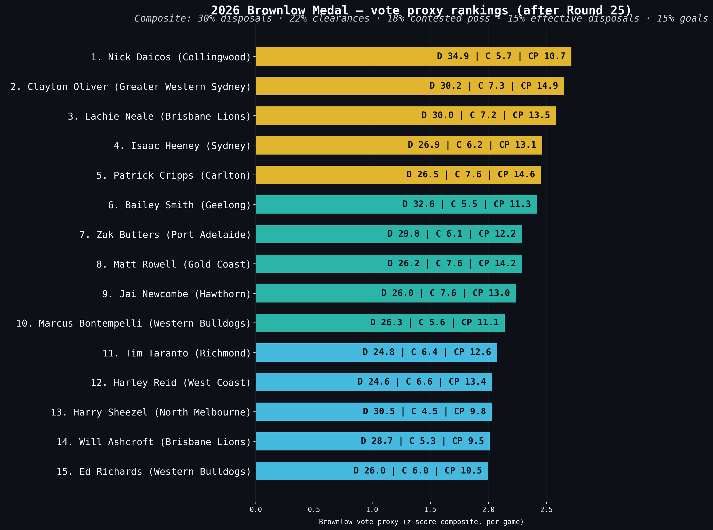

# 2026 Brownlow Medal predictor

> [← Back to 2026 season](afl-season-2026.md) | [← Back to main README](../README.md)

*This file is auto-updated by `update_team_analysis.py` / `refresh_readme.py` on every data refresh.*

<!-- 2026-BROWNLOW-PREDICTOR-START -->
The **Brownlow Medal** is the AFL's individual award for the "fairest and best" player, voted on by the on-field umpires with a 3-2-1 split per game. It is impossible to predict actual votes without modelling umpire behaviour, but we *can* build a defensible **statistical proxy** — a composite score over the stats that historically correlate with vote-earning. The weights below were validated against every player-game from 2010-2025 (n=145,150) where actual `brownlow_votes` are recorded — the top 1% of proxy games captured ~70% of vote-earning performances. Players need at least 3 games played to be ranked. Suspended players are not penalised in the proxy — this is a stat-profile model, not a vote forecaster — but because any in-season suspension makes a player ineligible to win the actual Brownlow Medal, suspended players are flagged inline in the table below so the distinction stays visible.

**Composite formula** (z-scored across all eligible players, summed with weights): `0.30 × disposals + 0.22 × clearances + 0.18 × contested-poss + 0.15 × effective-disposals + 0.15 × goals`. Effective disposals are approximated as `disposals - clangers` because the raw data does not carry a true effective-disposal column. Goals are weighted higher than the conventional midfielder-only template (15% vs the ~5% common in pure-midfielder proxies) because that materially improves correlation with actual historical Brownlow votes.

#### Top 15 Brownlow proxy candidates — 2026 season-to-date (after Round 22)

| Rank | Player | Team | Games | Disp/g | Clear/g | CP/g | Goals/g | Proxy | Proj. votes |
| ---: | --- | --- | ---: | ---: | ---: | ---: | ---: | ---: | ---: |
| 1 | Clayton Oliver | Greater Western Sydney | 20 | 30.9 | 7.7 | 15.3 | 0.20 | +2.78 | +61.2 |
| 2 | Nick Daicos | Collingwood | 19 | 35.1 | 5.7 | 10.6 | 1.11 | +2.72 | +59.9 |
| 3 | Lachie Neale | Brisbane Lions | 20 | 30.1 | 7.0 | 13.1 | 0.25 | +2.53 | +55.8 |
| 4 | Isaac Heeney | Sydney | 18 | 26.9 | 6.1 | 12.9 | 1.56 | +2.43 | +53.4 |
| 5 | Patrick Cripps | Carlton | 20 | 26.3 | 7.4 | 14.8 | 0.65 | +2.42 | +53.3 |
| 6 | Bailey Smith | Geelong | 19 | 31.9 | 5.6 | 11.3 | 0.42 | +2.35 | +51.7 |
| 7 | Jai Newcombe | Hawthorn | 20 | 26.4 | 7.8 | 13.2 | 0.30 | +2.31 | +50.8 |
| 8 | Zak Butters | Port Adelaide | 17 | 29.8 | 6.1 | 12.2 | 0.29 | +2.28 | +50.2 |
| 9 | Marcus Bontempelli | Western Bulldogs | 20 | 26.4 | 6.0 | 11.3 | 1.35 | +2.20 | +48.3 |
| 10 | Harry Sheezel | North Melbourne | 20 | 31.2 | 4.6 | 9.9 | 0.55 | +2.11 | +46.4 |
| 11 | Harley Reid | West Coast | 20 | 24.6 | 6.7 | 13.2 | 0.65 | +2.03 | +44.7 |
| 12 | Tim Taranto | Richmond | 18 | 24.6 | 6.2 | 12.2 | 0.72 | +2.00 | +44.1 |
| 13 | Matt Rowell | Gold Coast | 15 | 25.0 | 6.7 | 13.0 | 0.20 | +2.00 | +44.0 |
| 14 | Will Ashcroft | Brisbane Lions | 20 | 28.3 | 5.4 | 9.3 | 0.70 | +1.97 | +43.4 |
| 15 | Christian Petracca | Gold Coast | 18 | 24.3 | 5.3 | 11.7 | 1.22 | +1.94 | +42.7 |

On the proxy, **Clayton Oliver** (Greater Western Sydney) leads the field — built on 7.7 clearances/g, 15.3 contested poss/g across 20 games. The composite score (+2.78) sits 0.06 clear of second place. **Nick Daicos** (Collingwood) is the closest challenger at +2.72, with 35.1 disposals/g and 5.7 clearances/g. The proxy is a statistical model, not actual umpire votes — it captures the stat-profile umpires *historically* reward, but it cannot model individual game narrative, suspension impact or the umpire panel's eye for a defensive midfielder.
<!-- 2026-BROWNLOW-PREDICTOR-END -->

---
**Related:** [Team analysis](afl-team-analysis-2026.md) · [Finals pathway](afl-finals-2026.md) · [Stat leaders](afl-stat-leaders-2026.md) · [Predictions](afl-predictions-2026.md) · [Backtest](afl-backtest-2026.md)
