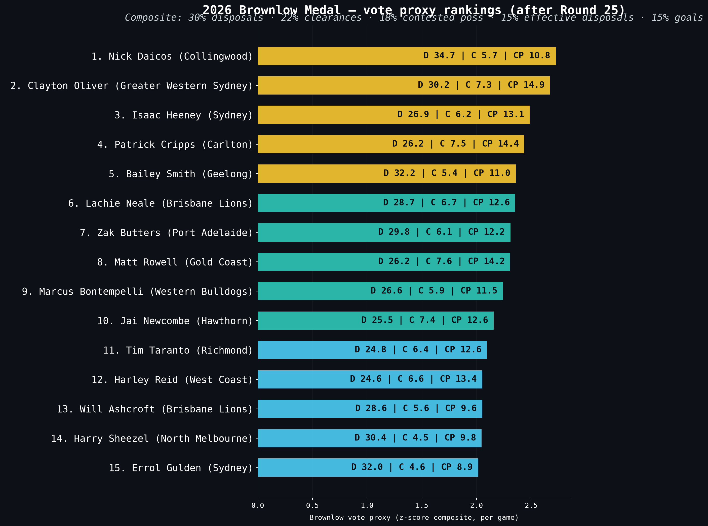

# 2026 Brownlow Medal predictor

> [← Back to 2026 season](afl-season-2026.md) | [← Back to main README](../README.md)

*This file is auto-updated by `update_team_analysis.py` / `refresh_readme.py` on every data refresh.*

<!-- 2026-BROWNLOW-PREDICTOR-START -->
The **Brownlow Medal** is the AFL's individual award for the "fairest and best" player, voted on by the on-field umpires with a 3-2-1 split per game. It is impossible to predict actual votes without modelling umpire behaviour, but we *can* build a defensible **statistical proxy** — a composite score over the stats that historically correlate with vote-earning. The weights below were validated against every player-game from 2010-2025 (n=145,150) where actual `brownlow_votes` are recorded — the top 1% of proxy games captured ~70% of vote-earning performances. Players need at least 3 games played to be ranked. Suspended players are not penalised in the proxy — this is a stat-profile model, not a vote forecaster — but because any in-season suspension makes a player ineligible to win the actual Brownlow Medal, suspended players are flagged inline in the table below so the distinction stays visible.

**Composite formula** (z-scored across all eligible players, summed with weights): `0.30 × disposals + 0.22 × clearances + 0.18 × contested-poss + 0.15 × effective-disposals + 0.15 × goals`. Effective disposals are approximated as `disposals - clangers` because the raw data does not carry a true effective-disposal column. Goals are weighted higher than the conventional midfielder-only template (15% vs the ~5% common in pure-midfielder proxies) because that materially improves correlation with actual historical Brownlow votes.

#### Top 15 Brownlow proxy candidates — 2026 season-to-date (after Round 25)

| Rank | Player | Team | Games | Disp/g | Clear/g | CP/g | Goals/g | Proxy | Season proxy (×22) |
| ---: | --- | --- | ---: | ---: | ---: | ---: | ---: | ---: | ---: |
| 1 | Nick Daicos | Collingwood | 23 | 34.7 | 5.7 | 10.8 | 1.13 | +2.72 | +59.9 |
| 2 | Clayton Oliver | Greater Western Sydney | 23 | 30.2 | 7.3 | 14.9 | 0.17 | +2.67 | +58.8 |
| 3 | Isaac Heeney | Sydney | 20 | 26.9 | 6.2 | 13.1 | 1.60 | +2.49 | +54.7 |
| 4 | Patrick Cripps | Carlton | 25 | 26.2 | 7.5 | 14.4 | 0.64 | +2.44 | +53.6 |
| 5 | Bailey Smith | Geelong | 24 | 32.2 | 5.4 | 11.0 | 0.46 | +2.36 | +51.9 |
| 6 | Lachie Neale | Brisbane Lions | 27 | 28.7 | 6.7 | 12.6 | 0.19 | +2.35 | +51.8 |
| 7 | Zak Butters | Port Adelaide | 17 | 29.8 | 6.1 | 12.2 | 0.29 | +2.31 | +50.8 |
| 8 | Matt Rowell | Gold Coast | 18 | 26.2 | 7.6 | 14.2 | 0.17 | +2.31 | +50.8 |
| 9 | Marcus Bontempelli | Western Bulldogs | 24 | 26.6 | 5.9 | 11.5 | 1.29 | +2.24 | +49.3 |
| 10 | Jai Newcombe | Hawthorn | 25 | 25.5 | 7.4 | 12.6 | 0.32 | +2.16 | +47.4 |
| 11 | Tim Taranto | Richmond | 21 | 24.8 | 6.4 | 12.6 | 0.71 | +2.10 | +46.1 |
| 12 | Harley Reid | West Coast | 23 | 24.6 | 6.6 | 13.4 | 0.65 | +2.05 | +45.1 |
| 13 | Will Ashcroft | Brisbane Lions | 27 | 28.6 | 5.6 | 9.6 | 0.63 | +2.05 | +45.1 |
| 14 | Harry Sheezel | North Melbourne | 22 | 30.4 | 4.5 | 9.8 | 0.55 | +2.05 | +45.0 |
| 15 | Errol Gulden | Sydney | 13 | 32.0 | 4.6 | 8.9 | 0.31 | +2.01 | +44.3 |

On the proxy, **Nick Daicos** (Collingwood) leads the field — built on 34.7 disposals/g, 1.1 goals/g across 23 games. The composite score (+2.72) sits 0.05 clear of second place. **Clayton Oliver** (Greater Western Sydney) is the closest challenger at +2.67, with 30.2 disposals/g and 7.3 clearances/g. The proxy is a statistical model, not actual umpire votes — it captures the stat-profile umpires *historically* reward, but it cannot model individual game narrative, suspension impact or the umpire panel's eye for a defensive midfielder.
<!-- 2026-BROWNLOW-PREDICTOR-END -->

---
**Related:** [Team analysis](afl-team-analysis-2026.md) · [Finals pathway](afl-finals-2026.md) · [Stat leaders](afl-stat-leaders-2026.md) · [Predictions](afl-predictions-2026.md) · [Backtest](afl-backtest-2026.md)
