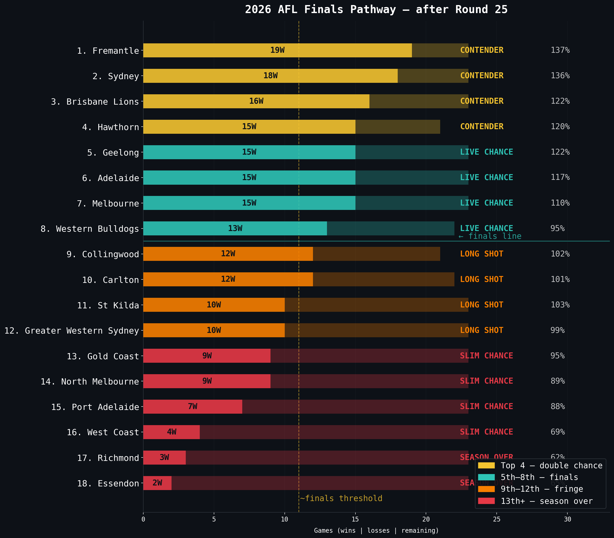

# 2026 finals pathway

> [← Back to 2026 season](afl-season-2026.md) | [← Back to main README](../README.md)

*This file is auto-updated by `update_team_analysis.py` / `refresh_readme.py` on every data refresh.*

<!-- 2026-FINALS-PATHWAY-START -->
What does each AFL team need to do — from here — to make finals this year, and what would have to go right for them to play in the grand final? After Round 25 of the 2026 season, most sides have played 22 games with roughly 0 games left in the home-and-away. The paragraphs below combine the actual 2026 ladder (wins, losses, percentage) with the team's stat profile across 16 categories to write an honest, data-driven mid-season assessment for each club. The grand-final read at the end of each paragraph maps to one of: **contender** (top-4, elite stat profile), **live chance** (top-8 with weapons), **chance** (top-8 without breadth), **long shot** (9-12), **mathematically alive** (13-16) or **season effectively over** (17-18) — the cut-offs are deliberately blunt.

### 1st — Fremantle

**Fremantle** sit 1st on the ladder after Round 25 (19-4, 76 points, 137.2%) — their job is to hold the double-chance, not chase it — every win from here is locking in a top-4 finish, not scrambling for one. On the underlying numbers they sit broadly mid-pack across the core stat lines, which is consistent with their ladder position and means the form line is honest. From here, the one thing they must keep doing is winning ugly games — their stat profile isn't elite anywhere, so the buffer is scoreboard form, not structure. For finals positioning, their nearest finals rival is **Sydney** (18-5, 2nd) — the team most likely to bump them out if they slip. Grand final read: **live chance**. The ladder position is right and the stat profile has real weapons, but they will need to either climb a rung or two further or peak at the right time — flag-winners from outside the top four are the historical exception, not the rule.

### 2nd — Sydney

**Sydney** sit 2nd on the ladder after Round 25 (18-5, 72 points, 136.1%) — their job is to hold the double-chance, not chase it — every win from here is locking in a top-4 finish, not scrambling for one. On the underlying numbers they are top-4 for goals (1st), top-4 for clearances (3rd), top-4 for tackles (4th) — that's the stat fingerprint behind the ladder position. From here, the one thing they must keep doing is their goals (1st of 18) — that is the engine of the run. For finals positioning, their nearest finals rival is **Brisbane Lions** (16-7, 3rd) — the team most likely to bump them out if they slip. Grand final read: **contender**. They have the ladder buffer and the stat profile of a side built to play deep in September — 5 of the five core categories sit top-5, which is what every recent premier has had at this point of the year.

### 3rd — Brisbane Lions

**Brisbane Lions** sit 3rd on the ladder after Round 25 (16-7, 64 points, 121.7%) — their job is to hold the double-chance, not chase it — every win from here is locking in a top-4 finish, not scrambling for one. On the underlying numbers they are top-4 for goals (2nd), top-4 for clearances (1st), bottom-4 for tackles (18th) — that's the stat fingerprint behind the ladder position. From here, the one thing they must keep doing is their clearances (1st of 18) — that is the engine of the run. For finals positioning, their nearest finals rival is **Hawthorn** (15-6, 4th) — the team most likely to bump them out if they slip. Grand final read: **contender**. They have the ladder buffer and the stat profile of a side built to play deep in September — 3 of the five core categories sit top-5, which is what every recent premier has had at this point of the year.

### 4th — Hawthorn

**Hawthorn** sit 4th on the ladder after Round 25 (15-6-2, 64 points, 120.1%) — their job is to hold the double-chance, not chase it — every win from here is locking in a top-4 finish, not scrambling for one. On the underlying numbers they sit broadly mid-pack across the core stat lines, which is consistent with their ladder position and means the form line is honest. From here, the one thing they must keep doing is winning ugly games — their stat profile isn't elite anywhere, so the buffer is scoreboard form, not structure. For finals positioning, their nearest finals rival is **Geelong** (15-8, 5th) — the team most likely to bump them out if they slip. Grand final read: **live chance**. The ladder position is right and the stat profile has real weapons, but they will need to either climb a rung or two further or peak at the right time — flag-winners from outside the top four are the historical exception, not the rule.

### 5th — Geelong

**Geelong** sit 5th on the ladder after Round 25 (15-8, 60 points, 122.3%) — they need roughly 0 wins from their remaining 0 games to lock the eight in, which their form line is comfortably on track to do. On the underlying numbers they are top-4 for goals (3rd), top-4 for clearances (2nd), top-4 for inside-50s (2nd) — that's the stat fingerprint behind the ladder position. From here, the one thing they have to fix is their rebound-50s ranking (17th of 18) — every finals-tier opponent will target it. For finals positioning, their nearest finals rival is **Adelaide** (15-8, 6th) — the team most likely to bump them out if they slip. Grand final read: **live chance**. The ladder position is right and the stat profile has real weapons, but they will need to either climb a rung or two further or peak at the right time — flag-winners from outside the top four are the historical exception, not the rule.

### 6th — Adelaide

**Adelaide** sit 6th on the ladder after Round 25 (15-8, 60 points, 117.3%) — they need roughly 0 wins from their remaining 0 games to lock the eight in, which their form line is comfortably on track to do. On the underlying numbers they are top-4 for tackles (1st), top-4 for contested possessions (1st) — that's the stat fingerprint behind the ladder position. From here, the one thing they have to fix is their marks inside 50 ranking (15th of 18) — every finals-tier opponent will target it. For finals positioning, their nearest finals rival is **Melbourne** (15-8, 7th) — the team most likely to bump them out if they slip. Grand final read: **live chance**. The ladder position is right and the stat profile has real weapons, but they will need to either climb a rung or two further or peak at the right time — flag-winners from outside the top four are the historical exception, not the rule.

### 7th — Melbourne

**Melbourne** sit 7th on the ladder after Round 25 (15-8, 60 points, 109.6%) — they need roughly 0 wins from their remaining 0 games to lock the eight in, which their form line is comfortably on track to do. On the underlying numbers they are top-4 for goals (4th), top-4 for inside-50s (4th) — that's the stat fingerprint behind the ladder position. From here, the one thing they have to fix is their marks ranking (14th of 18) — every finals-tier opponent will target it. For finals positioning, their nearest finals rival is **Western Bulldogs** (13-9, 8th) — the team most likely to bump them out if they slip. Grand final read: **live chance**. The ladder position is right and the stat profile has real weapons, but they will need to either climb a rung or two further or peak at the right time — flag-winners from outside the top four are the historical exception, not the rule.

### 8th — Western Bulldogs

**Western Bulldogs** sit 8th on the ladder after Round 25 (13-9-1, 54 points, 95.4%) — they need roughly 0 wins from their remaining 0 games to lock the eight in, which their form line is comfortably on track to do. On the underlying numbers they are top-4 for clearances (3rd) — that's the stat fingerprint behind the ladder position. From here, the one thing they have to fix is their marks ranking (15th of 18) — every finals-tier opponent will target it. For finals positioning, their nearest finals rival is **Collingwood** (12-9, 9th) — the team most likely to bump them out if they slip. Grand final read: **chance, not a contender**. Sitting inside the eight is the easy bit; the stat profile doesn't yet have the breadth to beat top-4 sides three weeks running, which is what the path demands once finals arrive.

### 9th — Collingwood

**Collingwood** sit 9th on the ladder after Round 25 (12-9-2, 52 points, 102.4%) — they need ~0 of their remaining 0 games to push into the eight — tough, but not impossible. On the underlying numbers they are bottom-4 for clearances (16th), top-4 for tackles (2nd) — that's the stat fingerprint behind the ladder position. From here, the one thing they have to fix is their clearances ranking (16th of 18) — every finals-tier opponent will target it. For finals positioning, the side blocking their road back in is **Western Bulldogs** (13-9, 8th) — leapfrog them and the finals door reopens. Grand final read: **realistically out of premiership contention**. Even if they sneak into the eight from here, finishing 7th or 8th means winning four straight against teams who finished above them — that's not how flags get won.

### 10th — Carlton

**Carlton** sit 10th on the ladder after Round 25 (12-10-1, 50 points, 101.5%) — they need ~0 of their remaining 0 games to push into the eight — tough, but not impossible. On the underlying numbers they sit broadly mid-pack across the core stat lines, which is consistent with their ladder position and means the form line is honest. From here, the one thing they have to fix is their tackles ranking (13th of 18) — every finals-tier opponent will target it. For finals positioning, the side blocking their road back in is **Collingwood** (12-9, 9th) — leapfrog them and the finals door reopens. Grand final read: **realistically out of premiership contention**. Even if they sneak into the eight from here, finishing 7th or 8th means winning four straight against teams who finished above them — that's not how flags get won.

### 11th — St Kilda

**St Kilda** sit 11th on the ladder after Round 25 (10-13, 40 points, 102.8%) — they need ~2 of their remaining 0 games to push into the eight — tough, but not impossible. On the underlying numbers they sit broadly mid-pack across the core stat lines, which is consistent with their ladder position and means the form line is honest. From here, no single stat screams crisis, but they need every part of their game to lift a notch to be a serious finals threat. For finals positioning, the side blocking their road back in is **Carlton** (12-10, 10th) — leapfrog them and the finals door reopens. Grand final read: **realistically out of premiership contention**. Even if they sneak into the eight from here, finishing 7th or 8th means winning four straight against teams who finished above them — that's not how flags get won.

### 12th — Greater Western Sydney

**Greater Western Sydney** sit 12th on the ladder after Round 25 (10-13, 40 points, 98.9%) — they need ~2 of their remaining 0 games to push into the eight — tough, but not impossible. On the underlying numbers they are top-4 for tackles (3rd), top-4 for contested possessions (4th) — that's the stat fingerprint behind the ladder position. From here, the one thing they have to fix is their marks ranking (13th of 18) — every finals-tier opponent will target it. For finals positioning, the side blocking their road back in is **St Kilda** (10-13, 11th) — leapfrog them and the finals door reopens. Grand final read: **realistically out of premiership contention**. Even if they sneak into the eight from here, finishing 7th or 8th means winning four straight against teams who finished above them — that's not how flags get won.

### 13th — Gold Coast

**Gold Coast** sit 13th on the ladder after Round 25 (9-14, 36 points, 94.5%) — they would need to win ~3 of their remaining 0 games to claim a finals spot, which would require a near-perfect run from here. On the underlying numbers they are bottom-4 for clearances (15th), bottom-4 for tackles (15th) — that's the stat fingerprint behind the ladder position. From here, the one thing they have to fix is their clearances ranking (15th of 18) — every finals-tier opponent will target it. For finals positioning, the side blocking their road back in is **Greater Western Sydney** (10-13, 12th) — leapfrog them and the finals door reopens. Grand final read: **no realistic path**. The maths technically still works — win out and percentage helps — but the form line and stat profile are pointing the other way, and no team has come from this deep at this point of the year to win a flag in the modern era.

### 14th — North Melbourne

**North Melbourne** sit 14th on the ladder after Round 25 (9-14, 36 points, 88.8%) — they would need to win ~3 of their remaining 0 games to claim a finals spot, which would require a near-perfect run from here. On the underlying numbers they are bottom-4 for inside-50s (16th), bottom-4 for contested possessions (17th) — that's the stat fingerprint behind the ladder position. From here, the one thing they have to fix is their contested possessions ranking (17th of 18) — every finals-tier opponent will target it. For finals positioning, the side blocking their road back in is **Gold Coast** (9-14, 13th) — leapfrog them and the finals door reopens. Grand final read: **no realistic path**. The maths technically still works — win out and percentage helps — but the form line and stat profile are pointing the other way, and no team has come from this deep at this point of the year to win a flag in the modern era.

### 15th — Port Adelaide

**Port Adelaide** sit 15th on the ladder after Round 25 (7-16, 28 points, 88.1%) — they would need to win ~5 of their remaining 0 games to claim a finals spot, which would require a near-perfect run from here. On the underlying numbers they are bottom-4 for goals (15th), bottom-4 for contested possessions (15th) — that's the stat fingerprint behind the ladder position. From here, the one thing they have to fix is their goals ranking (15th of 18) — every finals-tier opponent will target it. For finals positioning, the side blocking their road back in is **North Melbourne** (9-14, 14th) — leapfrog them and the finals door reopens. Grand final read: **no realistic path**. The maths technically still works — win out and percentage helps — but the form line and stat profile are pointing the other way, and no team has come from this deep at this point of the year to win a flag in the modern era.

### 16th — West Coast

**West Coast** sit 16th on the ladder after Round 25 (4-19, 16 points, 69.2%) — they would need to win ~8 of their remaining 0 games to claim a finals spot, which would require a near-perfect run from here. On the underlying numbers they are bottom-4 for goals (17th), bottom-4 for inside-50s (15th) — that's the stat fingerprint behind the ladder position. From here, the one thing they have to fix is their marks inside 50 ranking (18th of 18) — every finals-tier opponent will target it. For finals positioning, the side blocking their road back in is **Port Adelaide** (7-16, 15th) — leapfrog them and the finals door reopens. Grand final read: **no realistic path**. The maths technically still works — win out and percentage helps — but the form line and stat profile are pointing the other way, and no team has come from this deep at this point of the year to win a flag in the modern era.

### 17th — Richmond

**Richmond** sit 17th on the ladder after Round 25 (3-20, 12 points, 62.5%) — the maths is technically alive but the path requires a miracle run the form line does not support. On the underlying numbers they are bottom-4 for goals (18th), bottom-4 for clearances (17th), bottom-4 for tackles (17th) — that's the stat fingerprint behind the ladder position. From here, the one thing they have to fix is their goals ranking (18th of 18) — every finals-tier opponent will target it. For finals positioning, the side blocking their road back in is **West Coast** (4-19, 16th) — leapfrog them and the finals door reopens. Grand final read: **season effectively over**. Even a finals berth would require the kind of run that simply doesn't happen at AFL level — the priority from here is list build, draft position and next season.

### 18th — Essendon

**Essendon** sit 18th on the ladder after Round 25 (2-21, 8 points, 64.6%) — the maths is technically alive but the path requires a miracle run the form line does not support. On the underlying numbers they are bottom-4 for goals (16th), bottom-4 for clearances (18th), bottom-4 for tackles (16th) — that's the stat fingerprint behind the ladder position. From here, the one thing they have to fix is their clearances ranking (18th of 18) — every finals-tier opponent will target it. For finals positioning, the side blocking their road back in is **Richmond** (3-20, 17th) — leapfrog them and the finals door reopens. Grand final read: **season effectively over**. Even a finals berth would require the kind of run that simply doesn't happen at AFL level — the priority from here is list build, draft position and next season.
<!-- 2026-FINALS-PATHWAY-END -->

---
**Related:** [Team analysis](afl-team-analysis-2026.md) · [Brownlow predictor](afl-brownlow-2026.md) · [Stat leaders](afl-stat-leaders-2026.md) · [Predictions](afl-predictions-2026.md) · [Backtest](afl-backtest-2026.md)
