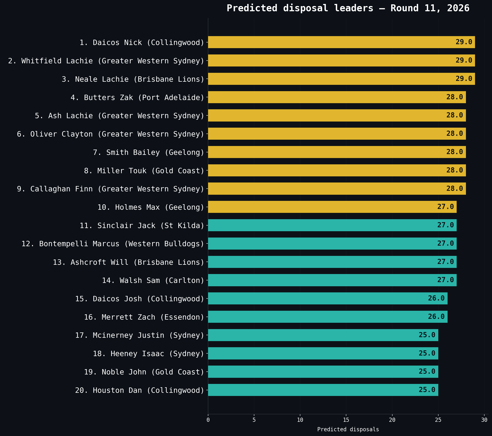

# 2026 next round predictions

> [← Back to 2026 season](afl-season-2026.md) | [← Back to main README](../README.md)

*This file is auto-updated by `update_team_analysis.py` / `refresh_readme.py` on every data refresh.*

<!-- 2026-PREDICTIONS-START -->
Predicted disposal leaders for Round 11 — generated 2026-05-12.

#### Top 30 predicted disposal leaders — Round 11, 2026

| Rank | Player | Team | Predicted disposals |
|------|--------|------|--------------------:|
| 1 | Daicos Nick | Collingwood | 29.0 |
| 2 | Whitfield Lachie | Greater Western Sydney | 29.0 |
| 3 | Neale Lachie | Brisbane Lions | 29.0 |
| 4 | Butters Zak | Port Adelaide | 28.0 |
| 5 | Ash Lachie | Greater Western Sydney | 28.0 |
| 6 | Oliver Clayton | Greater Western Sydney | 28.0 |
| 7 | Smith Bailey | Geelong | 28.0 |
| 8 | Miller Touk | Gold Coast | 28.0 |
| 9 | Callaghan Finn | Greater Western Sydney | 28.0 |
| 10 | Holmes Max | Geelong | 27.0 |
| 11 | Sinclair Jack | St Kilda | 27.0 |
| 12 | Bontempelli Marcus | Western Bulldogs | 27.0 |
| 13 | Ashcroft Will | Brisbane Lions | 27.0 |
| 14 | Walsh Sam | Carlton | 27.0 |
| 15 | Daicos Josh | Collingwood | 26.0 |
| 16 | Merrett Zach | Essendon | 26.0 |
| 17 | Mcinerney Justin | Sydney | 25.0 |
| 18 | Heeney Isaac | Sydney | 25.0 |
| 19 | Noble John | Gold Coast | 25.0 |
| 20 | Houston Dan | Collingwood | 25.0 |
| 21 | Kennedy Matthew | Western Bulldogs | 25.0 |
| 22 | Newcombe Jai | Hawthorn | 24.0 |
| 23 | Greene Toby | Greater Western Sydney | 24.0 |
| 24 | Pickett Kysaiah | Melbourne | 24.0 |
| 25 | Wilkie Callum | St Kilda | 24.0 |
| 26 | Daniel Caleb | North Melbourne | 24.0 |
| 27 | Zorko Dayne | Brisbane Lions | 24.0 |
| 28 | Bolton Shai | Fremantle | 24.0 |
| 29 | Dale Bailey | Western Bulldogs | 24.0 |
| 30 | Petracca Christian | Gold Coast | 24.0 |

Predictions from LightGBM+HGB ensemble trained on historical player-game data. Requires GPU to generate — see [docs/technical-reference.md](technical-reference.md).
<!-- 2026-PREDICTIONS-END -->

---
**Related:** [Team analysis](afl-team-analysis-2026.md) · [Finals pathway](afl-finals-2026.md) · [Brownlow predictor](afl-brownlow-2026.md) · [Stat leaders](afl-stat-leaders-2026.md) · [Backtest](afl-backtest-2026.md)
