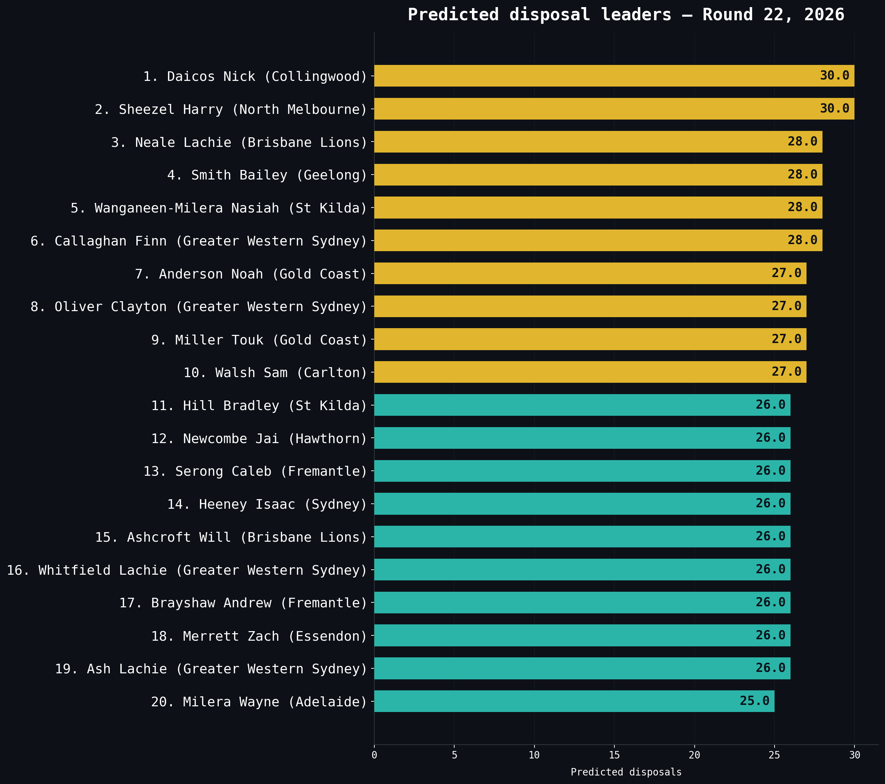

# 2026 next round predictions

> [← Back to 2026 season](afl-season-2026.md) | [← Back to main README](../README.md)

*This file is auto-updated by `update_team_analysis.py` / `refresh_readme.py` on every data refresh.*

<!-- 2026-PREDICTIONS-START -->
Predicted disposal leaders for Round 25 — generated 2026-08-18.

#### Top 30 predicted disposal leaders — Round 25, 2026

| Rank | Player | Team | Predicted disposals |
|------|--------|------|--------------------:|
| 1 | Sheezel Harry | North Melbourne | 29.0 |
| 2 | Gulden Errol | Sydney | 29.0 |
| 3 | Daicos Nick | Collingwood | 28.0 |
| 4 | Neale Lachie | Brisbane Lions | 28.0 |
| 5 | Oliver Clayton | Greater Western Sydney | 28.0 |
| 6 | Walsh Sam | Carlton | 27.0 |
| 7 | Whitfield Lachie | Greater Western Sydney | 27.0 |
| 8 | Ashcroft Will | Brisbane Lions | 27.0 |
| 9 | Merrett Zach | Essendon | 27.0 |
| 10 | Ash Lachie | Greater Western Sydney | 27.0 |
| 11 | Smith Bailey | Geelong | 27.0 |
| 12 | Heeney Isaac | Sydney | 26.0 |
| 13 | Smith Jagga | Carlton | 25.0 |
| 14 | Richards Ed | Western Bulldogs | 25.0 |
| 15 | Brayshaw Andrew | Fremantle | 25.0 |
| 16 | Daicos Josh | Collingwood | 25.0 |
| 17 | Anderson Noah | Gold Coast | 25.0 |
| 18 | Daniel Caleb | North Melbourne | 25.0 |
| 19 | Blakey Nick | Sydney | 25.0 |
| 20 | Bowey Jake | Melbourne | 25.0 |
| 21 | Impey Jarman | Hawthorn | 24.0 |
| 22 | Kelly Tim | West Coast | 24.0 |
| 23 | Roberts Archie | Essendon | 24.0 |
| 24 | Hall Max | St Kilda | 24.0 |
| 25 | Cripps Patrick | Carlton | 24.0 |
| 26 | Reid Harley | West Coast | 24.0 |
| 27 | Zorko Dayne | Brisbane Lions | 24.0 |
| 28 | Warner Chad | Sydney | 24.0 |
| 29 | Newcombe Jai | Hawthorn | 24.0 |
| 30 | Parker Luke | North Melbourne | 24.0 |

Predictions from LightGBM+HGB ensemble trained on historical player-game data. Requires GPU to generate — see [docs/technical-reference.md](technical-reference.md).
<!-- 2026-PREDICTIONS-END -->

---
**Related:** [Team analysis](afl-team-analysis-2026.md) · [Finals pathway](afl-finals-2026.md) · [Brownlow predictor](afl-brownlow-2026.md) · [Stat leaders](afl-stat-leaders-2026.md) · [Backtest](afl-backtest-2026.md)
