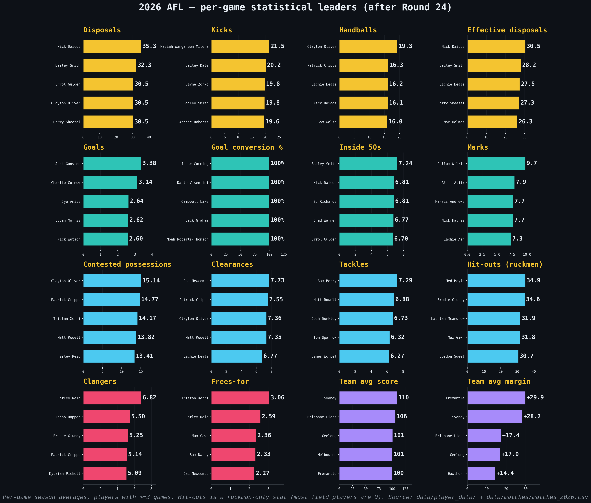

# 2026 player performance stats - what to look for and what the data says

> [← Back to 2026 season](afl-season-2026.md) | [← Back to main README](../README.md)

*This file is auto-updated by `update_team_analysis.py` / `refresh_readme.py` on every data refresh.*

<!-- 2026-STAT-LEADERS-START -->
This section is a guide to the AFL performance statistics that fans, analysts and SuperCoach players track most closely — what each stat measures, who is leading it in 2026, what the league-wide distribution looks like, and which other stats most reliably predict it. All numbers are computed live from `data/player_data/` for 2026 (rounds 1-24, **611 eligible players** with >=3 games, **9008 player-games** included). Correlations are Pearson r on the per-game frame; with several thousand player-games, p-values are universally tiny — read the magnitude of r, not the significance star.

### Disposal-based stats — volume and quality of ball use

#### Disposals per game

**What it measures.** Total kicks plus handballs in a game — the single broadest measure of how often a player has the ball. **Why it matters.** It is the headline SuperCoach scoring stat and the prediction target this repo's main model is built around. Volume midfielders and rebounding defenders dominate this leaderboard.

| Rank | Player | Team | Per game |
|---|---|---|---|
| 1 | Nick Daicos | Collingwood | 35.3 |
| 2 | Bailey Smith | Geelong | 32.3 |
| 3 | Errol Gulden | Sydney | 30.5 |
| 4 | Clayton Oliver | Greater Western Sydney | 30.5 |
| 5 | Harry Sheezel | North Melbourne | 30.5 |

League distribution (eligible players, season-to-date): mean **14.91**, std 5.65, p10 8.17 / p50 14.00 / p90 23.14, max 35.29.

Top per-game correlates: `effective_disposals` (r = +0.97 *(mechanically related)*), `uncontested_possessions` (r = +0.87), `kicks` (r = +0.83).

#### Kicks per game

**What it measures.** Just the kicked disposals. **Why it matters.** Kicks tend to come from outside-midfielders, half-backs and tall rebounders — players who clear the ball by foot rather than shovel it into a contest. A player who kicks much more than they handball is usually playing a distributor / launch role.

| Rank | Player | Team | Per game |
|---|---|---|---|
| 1 | Nasiah Wanganeen-Milera | St Kilda | 21.5 |
| 2 | Bailey Dale | Western Bulldogs | 20.2 |
| 3 | Dayne Zorko | Brisbane Lions | 19.8 |
| 4 | Bailey Smith | Geelong | 19.8 |
| 5 | Archie Roberts | Essendon | 19.6 |

League distribution (eligible players, season-to-date): mean **8.60**, std 3.53, p10 4.45 / p50 8.09 / p90 13.29, max 21.47.

Top per-game correlates: `disposals` (r = +0.83), `effective_disposals` (r = +0.81), `uncontested_possessions` (r = +0.77).

#### Handballs per game

**What it measures.** The hand-passed half of disposals. **Why it matters.** Handball volume tracks contest involvement — a player wins the ball at a stoppage, then handballs out to a runner. Inside-mids and clearance specialists tend to lead this stat.

| Rank | Player | Team | Per game |
|---|---|---|---|
| 1 | Clayton Oliver | Greater Western Sydney | 19.3 |
| 2 | Patrick Cripps | Carlton | 16.3 |
| 3 | Lachie Neale | Brisbane Lions | 16.2 |
| 4 | Nick Daicos | Collingwood | 16.1 |
| 5 | Sam Walsh | Carlton | 16.0 |

League distribution (eligible players, season-to-date): mean **6.31**, std 3.04, p10 3.05 / p50 5.64 / p90 10.42, max 19.32.

Top per-game correlates: `disposals` (r = +0.78), `effective_disposals` (r = +0.75), `contested_possessions` (r = +0.65).

#### Effective disposals per game (disposals − clangers)

**What it measures.** Disposals that did not result in a clanger, computed here as `max(disposals - clangers, 0)` because the raw data does not carry a true effective-disposal column. **Why it matters.** It is a defensible proxy for disposal *quality* — high-volume ball-users who don't turn it over. The same proxy is used in the Brownlow predictor on this page.

| Rank | Player | Team | Per game |
|---|---|---|---|
| 1 | Nick Daicos | Collingwood | 30.5 |
| 2 | Bailey Smith | Geelong | 28.2 |
| 3 | Lachie Neale | Brisbane Lions | 27.5 |
| 4 | Harry Sheezel | North Melbourne | 27.3 |
| 5 | Max Holmes | Geelong | 26.3 |

League distribution (eligible players, season-to-date): mean **12.57**, std 5.25, p10 6.33 / p50 11.85 / p90 19.91, max 30.48.

Top per-game correlates: `disposals` (r = +0.97 *(mechanically related)*), `uncontested_possessions` (r = +0.86), `kicks` (r = +0.81).

### Scoring stats — goals, behinds and conversion

#### Goals per game

**What it measures.** Goals kicked. **Why it matters.** Forwards live and die by this stat. It is volatile game-to-game (a single missed shot can halve your score), so multi-game averages and shot-source context (marks-inside-50, contested marks) matter more than any one game.

| Rank | Player | Team | Per game |
|---|---|---|---|
| 1 | Jack Gunston | Hawthorn | 3.38 |
| 2 | Charlie Curnow | Sydney | 3.14 |
| 3 | Jye Amiss | Fremantle | 2.64 |
| 4 | Logan Morris | Brisbane Lions | 2.62 |
| 5 | Nick Watson | Hawthorn | 2.60 |

League distribution (eligible players, season-to-date): mean **0.51**, std 0.58, p10 0.00 / p50 0.32 / p90 1.33, max 3.38.

Top per-game correlates: `marks_inside_50` (r = +0.67), `behinds` (r = +0.32), `rebound_50s` (r = -0.30).

**Goal conversion rate.** Defined as `goals / (goals + behinds)`, season-to-date, for players with >=2 goals total. League distribution (n=423): mean **58.3%**, std 16.0pp, p10 40% / p50 57% / p90 78%.

| Rank | Player | Team | G | B | Conversion |
|---|---|---|---|---|---|
| 1 | Isaac Cumming | Adelaide | 7 | 0 | 100.0% |
| 2 | Dante Visentini | Port Adelaide | 6 | 0 | 100.0% |
| 3 | Campbell Lake | St Kilda | 5 | 0 | 100.0% |
| 4 | Jack Graham | West Coast | 4 | 0 | 100.0% |
| 5 | Noah Roberts-Thomson | Richmond | 4 | 0 | 100.0% |

#### Behinds per game

**What it measures.** Minor scores — shots that hit the post or go through the smaller posts. **Why it matters.** Rarely predicted alone — it is too noisy. Best read alongside goals to compute **conversion rate** (`goals / (goals + behinds)`), the cleanest available signal of forward accuracy.

| Rank | Player | Team | Per game |
|---|---|---|---|
| 1 | Jake Waterman | West Coast | 2.50 |
| 2 | Mitch Georgiades | Port Adelaide | 2.30 |
| 3 | Jack Gunston | Hawthorn | 2.12 |
| 4 | Logan Morris | Brisbane Lions | 2.00 |
| 5 | Jake Stringer | Greater Western Sydney | 1.95 |

League distribution (eligible players, season-to-date): mean **0.39**, std 0.39, p10 0.00 / p50 0.29 / p90 0.92, max 2.50.

Top per-game correlates: `marks_inside_50` (r = +0.54), `goals` (r = +0.32), `rebound_50s` (r = -0.24).

### Contested and ground-ball stats — the inside game

#### Contested possessions per game

**What it measures.** Wins of the ball under physical pressure — ground-balls, taps, and contested marks. **Why it matters.** This is the cleanest stat for separating a midfielder's *contest* role from an outside ball-user's *spread* role. It correlates strongly with clearances and tackles.

| Rank | Player | Team | Per game |
|---|---|---|---|
| 1 | Clayton Oliver | Greater Western Sydney | 15.14 |
| 2 | Patrick Cripps | Carlton | 14.77 |
| 3 | Tristan Xerri | North Melbourne | 14.17 |
| 4 | Matt Rowell | Gold Coast | 13.82 |
| 5 | Harley Reid | West Coast | 13.41 |

League distribution (eligible players, season-to-date): mean **5.23**, std 2.34, p10 2.95 / p50 4.64 / p90 8.67, max 15.14.

Top per-game correlates: `clearances` (r = +0.75), `handballs` (r = +0.65), `disposals` (r = +0.59).

#### Clearances per game

**What it measures.** Disposals that move the ball clear of a stoppage (a centre-bounce or boundary throw-in). **Why it matters.** Stoppage dominance is one of the few team-level wins a midfield can manufacture. Top clearance players are almost always the inside-mid fulcrums of their team.

| Rank | Player | Team | Per game |
|---|---|---|---|
| 1 | Jai Newcombe | Hawthorn | 7.73 |
| 2 | Patrick Cripps | Carlton | 7.55 |
| 3 | Clayton Oliver | Greater Western Sydney | 7.36 |
| 4 | Matt Rowell | Gold Coast | 7.35 |
| 5 | Lachie Neale | Brisbane Lions | 6.77 |

League distribution (eligible players, season-to-date): mean **1.39**, std 1.62, p10 0.10 / p50 0.75 / p90 4.05, max 7.73.

Top per-game correlates: `contested_possessions` (r = +0.75), `handballs` (r = +0.56), `disposals` (r = +0.50).

#### Tackles per game

**What it measures.** Pressure acts that physically stop a ball-carrier. **Why it matters.** Defensive midfield work — the unsung currency of forward-half pressure and turnover football. It correlates with clearances (you tackle the same opponent you compete against) but tells a different story.

| Rank | Player | Team | Per game |
|---|---|---|---|
| 1 | Sam Berry | Adelaide | 7.29 |
| 2 | Matt Rowell | Gold Coast | 6.88 |
| 3 | Josh Dunkley | Brisbane Lions | 6.73 |
| 4 | Tom Sparrow | Melbourne | 6.32 |
| 5 | James Worpel | Geelong | 6.27 |

League distribution (eligible players, season-to-date): mean **2.39**, std 1.22, p10 1.12 / p50 2.12 / p90 4.11, max 7.29.

Top per-game correlates: `clearances` (r = +0.39), `contested_possessions` (r = +0.37), `handballs` (r = +0.31).

#### Hit-outs per game (ruckmen only)

**What it measures.** Wins by a ruckman at a ruck contest (the tap from a centre bounce or stoppage). **Why it matters.** Ruckman-only stat — the distribution is bimodal: ~1 player per team registers double-digits, everyone else is 0. Always read this leaderboard as "top ruckmen", not "top players".

**Bimodal distribution warning.** 88% of eligible 2026 players average less than 1 hit-out per game — they are not ruckmen. The league mean below is dragged down by all the zeros; the meaningful comparison is between ruckmen, where the top of the distribution sits in the 25-35 range.

| Rank | Player | Team | Per game |
|---|---|---|---|
| 1 | Ned Moyle | Gold Coast | 34.9 |
| 2 | Brodie Grundy | Sydney | 34.6 |
| 3 | Lachlan Mcandrew | Adelaide | 31.9 |
| 4 | Max Gawn | Melbourne | 31.8 |
| 5 | Jordon Sweet | Port Adelaide | 30.7 |

League distribution (eligible players, season-to-date): mean **1.49**, std 5.30, p10 0.00 / p50 0.00 / p90 1.68, max 34.87.

Top per-game correlates: `clearances` (r = +0.27), `uncontested_possessions` (r = -0.24), `contested_possessions` (r = +0.20).

### Territory stats — moving the ball forward

#### Inside 50s per game

**What it measures.** Disposals or carries that move the ball into the team's attacking 50m arc. **Why it matters.** Territory currency — the precondition for goals. Wing/half-forward players who launch attacks lead this stat. It correlates with kicks and disposals because most inside-50s are foot-delivered.

| Rank | Player | Team | Per game |
|---|---|---|---|
| 1 | Bailey Smith | Geelong | 7.24 |
| 2 | Nick Daicos | Collingwood | 6.81 |
| 3 | Ed Richards | Western Bulldogs | 6.81 |
| 4 | Chad Warner | Sydney | 6.77 |
| 5 | Errol Gulden | Sydney | 6.70 |

League distribution (eligible players, season-to-date): mean **2.14**, std 1.20, p10 0.71 / p50 2.00 / p90 3.65, max 7.24.

Top per-game correlates: `disposals` (r = +0.52), `effective_disposals` (r = +0.48), `kicks` (r = +0.48).

#### Marks per game

**What it measures.** Total uncontested + contested marks taken. **Why it matters.** Aerial dominance and intercept defence. Loose-half-back roles dominate the total-marks leaderboard because they sit behind the play and fly under kicks. Tall forwards lead a separate, narrower stat — marks inside 50.

| Rank | Player | Team | Per game |
|---|---|---|---|
| 1 | Callum Wilkie | St Kilda | 9.7 |
| 2 | Aliir Aliir | Port Adelaide | 7.9 |
| 3 | Harris Andrews | Brisbane Lions | 7.7 |
| 4 | Nick Haynes | Carlton | 7.7 |
| 5 | Lachie Ash | Greater Western Sydney | 7.3 |

League distribution (eligible players, season-to-date): mean **3.78**, std 1.48, p10 1.93 / p50 3.68 / p90 5.64, max 9.73.

Top per-game correlates: `kicks` (r = +0.56), `uncontested_possessions` (r = +0.53), `effective_disposals` (r = +0.42).

#### Marks inside 50 per game

**What it measures.** Marks taken inside the attacking 50m arc — i.e. marks that turn directly into shots on goal. **Why it matters.** This is the strongest single predictor of a forward's goal output. It is what separates a deep-forward role from a high-half-forward role, and the correlation with goals is the highest of any stat in this section.

| Rank | Player | Team | Per game |
|---|---|---|---|
| 1 | Jack Gunston | Hawthorn | 4.12 |
| 2 | Mitch Georgiades | Port Adelaide | 3.80 |
| 3 | Jye Amiss | Fremantle | 3.41 |
| 4 | Jay Polkinghorne | Geelong | 3.40 |
| 5 | Josh Treacy | Fremantle | 3.27 |

League distribution (eligible players, season-to-date): mean **0.50**, std 0.66, p10 0.00 / p50 0.27 / p90 1.50, max 4.12.

Top per-game correlates: `goals` (r = +0.67), `behinds` (r = +0.54), `contested_marks` (r = +0.34).

### Discipline stats — errors and free kicks

#### Clangers per game

**What it measures.** Errors — missed targets, fumbles, free kicks given away by the ball-carrier. **Why it matters.** Clangers are the friction term on disposal volume — a high-disposal player who also leads in clangers is being asked to play through traffic, not necessarily playing badly. The correlation with frees-against is mechanical: many clangers *are* frees-against.

| Rank | Player | Team | Per game |
|---|---|---|---|
| 1 | Harley Reid | West Coast | 6.82 |
| 2 | Jacob Hopper | Richmond | 5.50 |
| 3 | Brodie Grundy | Sydney | 5.25 |
| 4 | Patrick Cripps | Carlton | 5.14 |
| 5 | Kysaiah Pickett | Melbourne | 5.09 |

League distribution (eligible players, season-to-date): mean **2.34**, std 0.81, p10 1.43 / p50 2.21 / p90 3.36, max 6.82.

Top per-game correlates: `free_kicks_against` (r = +0.61 *(mechanically related)*), `contested_possessions` (r = +0.34), `disposals` (r = +0.32).

#### Free kicks for per game

**What it measures.** Free kicks paid to the player. **Why it matters.** A weak isolated signal — frees-for tracks contest involvement (rucks especially) more than skill. Best used as a tiebreaker rather than a standalone metric.

| Rank | Player | Team | Per game |
|---|---|---|---|
| 1 | Tristan Xerri | North Melbourne | 3.06 |
| 2 | Harley Reid | West Coast | 2.59 |
| 3 | Max Gawn | Melbourne | 2.36 |
| 4 | Sam Darcy | Western Bulldogs | 2.33 |
| 5 | Jai Newcombe | Hawthorn | 2.27 |

League distribution (eligible players, season-to-date): mean **0.78**, std 0.42, p10 0.33 / p50 0.72 / p90 1.32, max 3.06.

Top per-game correlates: `contested_possessions` (r = +0.42), `clearances` (r = +0.30), `tackles` (r = +0.21).

#### Free kicks against per game

**What it measures.** Free kicks paid against the player. **Why it matters.** Discipline / aggression marker, with the caveat that ruck contest infringements inflate the number for ruckmen. Reads like a clanger when it correlates with them.

| Rank | Player | Team | Per game |
|---|---|---|---|
| 1 | Harley Reid | West Coast | 3.00 |
| 2 | Brodie Grundy | Sydney | 2.60 |
| 3 | Luke Trainor | Richmond | 2.10 |
| 4 | Patrick Cripps | Carlton | 2.09 |
| 5 | Clayton Oliver | Greater Western Sydney | 2.05 |

League distribution (eligible players, season-to-date): mean **0.80**, std 0.41, p10 0.33 / p50 0.75 / p90 1.33, max 3.00.

Top per-game correlates: `clangers` (r = +0.61 *(mechanically related)*), `clearances` (r = +0.16), `contested_possessions` (r = +0.16).

### Team-level stats — what the scoreboard says

Team-level stats use `data/matches/matches_2026.csv` rather than per-player aggregates. Total team score is `goals × 6 + behinds`; margin is the team's score minus the opponent's. A first-quarter score is a useful early-momentum signal — strong starters tend to keep the lead.

#### Total team score per game

| Rank | Team | Avg score | Avg margin | Avg Q1 |
|---|---|---|---|---|
| 1 | Sydney | 110.0 | +28.2 | 28.6 |
| 2 | Brisbane Lions | 106.4 | +17.4 | 24.2 |
| 3 | Geelong | 101.0 | +17.0 | 24.6 |
| 4 | Melbourne | 100.6 | +10.1 | 25.5 |
| 5 | Fremantle | 100.2 | +29.9 | 24.4 |

League distribution of per-game team scores: mean **88.5**, std 25.0, p10 60 / p50 88 / p90 122, min 29 / max 170.

#### Winning margin

| Rank | Team | Avg margin | Avg score |
|---|---|---|---|
| 1 | Fremantle | +29.9 | 100.2 |
| 2 | Sydney | +28.2 | 110.0 |
| 3 | Brisbane Lions | +17.4 | 106.4 |
| 4 | Geelong | +17.0 | 101.0 |
| 5 | Hawthorn | +14.4 | 97.9 |

League distribution of margins (signed, per team-game): mean ~0 by construction, std 41.1, p10 -54 / p50 0 / p90 54.

#### First-quarter score

| Rank | Team | Avg Q1 score | Avg full-game score |
|---|---|---|---|
| 1 | Sydney | 28.6 | 110.0 |
| 2 | Melbourne | 25.5 | 100.6 |
| 3 | Adelaide | 25.0 | 91.5 |
| 4 | Geelong | 24.6 | 101.0 |
| 5 | North Melbourne | 24.5 | 84.6 |

League distribution of Q1 scores: mean **22.1**, std 10.8, p10 9 / p50 21 / p90 38.

### Going deeper with this repo's models

For the stats above, three artefacts in this repo will help you form your own view rather than just reading a leaderboard:

1. The **disposal prediction model** (`prediction.py` / `prediction_cpu.py`) forecasts a player's next-round disposal count using rolling form (3/5-game, season-to-date) and opponent context. Run it with `--player surname_first --rounds 1` to see how uncertainty is quantified for any of the leaders shown above.
2. The **backtest framework** (`backtest.py`) replays a season round-by-round so you can see how the model performed on real, out-of-sample games — the honest way to judge whether a leaderboard ranking will continue to hold.
3. The **Brownlow proxy section** above is the same per-game stat structure used here, weighted into a single composite. If you want a quick "who's having the best year overall" answer rather than per-stat leaders, that table is the one to look at.
<!-- 2026-STAT-LEADERS-END -->

---
**Related:** [Team analysis](afl-team-analysis-2026.md) · [Finals pathway](afl-finals-2026.md) · [Brownlow predictor](afl-brownlow-2026.md) · [Predictions](afl-predictions-2026.md) · [Backtest](afl-backtest-2026.md)
