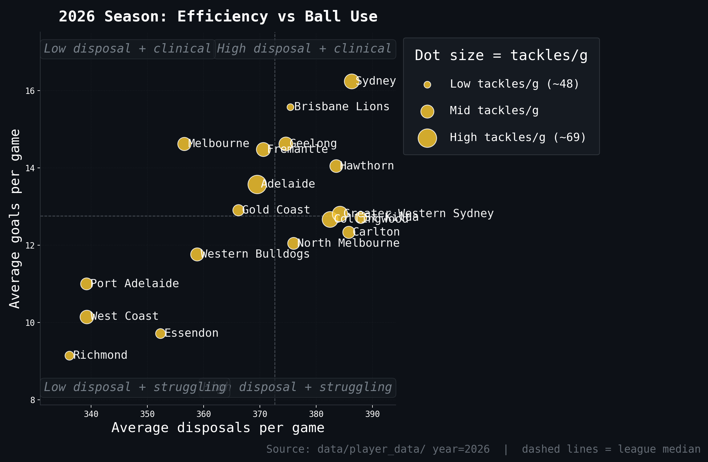
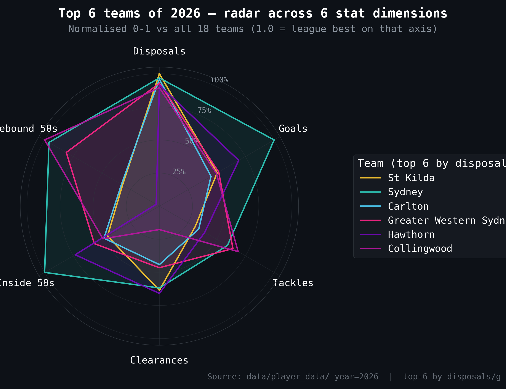
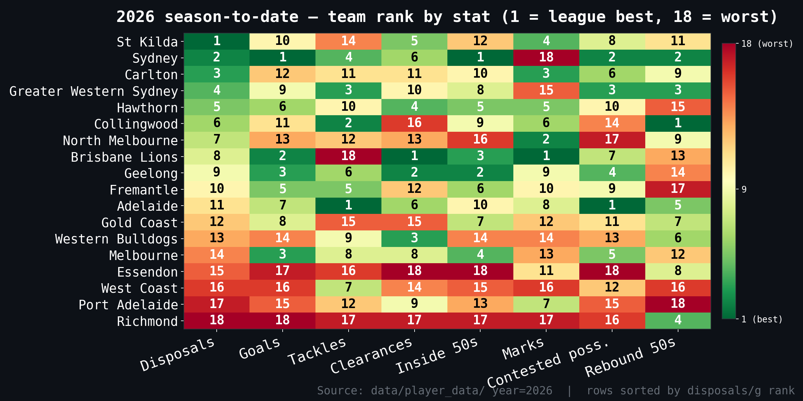
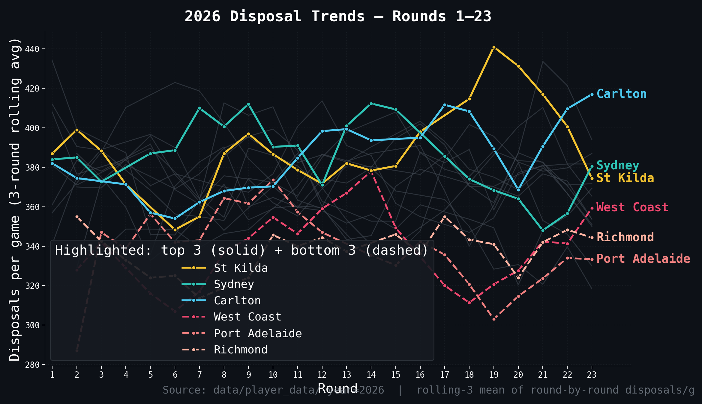

# 2026 team analysis

> [← Back to 2026 season](afl-season-2026.md) | [← Back to main README](../README.md)

*This file is auto-updated by `update_team_analysis.py` / `refresh_readme.py` on every data refresh.*

<!-- 2026-TEAM-ANALYSIS-START -->
Through 23 rounds of the 2026 season, the league averages out at around 368 disposals, 213 kicks, 155 handballs, 57 tackles, 36 clearances and 13 goals per team per game. **St Kilda** lead the comp for total disposals (388.0/g), with **Brisbane Lions** winning the most clearances (40.2/g) and **Adelaide** the most physical side (69.0 tackles/g). **Sydney** are the highest-scoring team at 16.2 goals/g, while **Richmond** prop up the table on both fronts — only 336.1 disposals/g and 9.1 goals/g. At the individual level, **Nick Daicos** (Collingwood) is the leading ball-winner at 35.2 disposals/game. Caveat: this is a small sample — single-season form can swing by round, so treat the rankings below as a snapshot rather than a settled hierarchy.

### All 18 teams ranked by total disposals — 2026 season-to-date

| # | Team | G | Disp/g | Kicks | Handballs | Marks | Goals | Tackles | Clearances | I50s | CP | Form tag |
| ---: | :--- | ---: | ---: | ---: | ---: | ---: | ---: | ---: | ---: | ---: | ---: | :--- |
| 1 | St Kilda | 21 | 388.0 | 223.6 | 164.4 | 98.9 | 12.7 | 54.6 | 37.2 | 51.9 | 129.4 | ball-winners |
| 2 | Sydney | 21 | 386.3 | 206.9 | 179.5 | 80.1 | 16.2 | 60.5 | 37.1 | 60.3 | 138.5 | ball-winners, contested-ball team |
| 3 | Carlton | 21 | 385.8 | 223.1 | 162.7 | 101.2 | 12.3 | 55.2 | 35.7 | 52.4 | 131.6 | ball-winners |
| 4 | Greater Western Sydney | 21 | 384.2 | 210.3 | 174.0 | 86.3 | 12.8 | 61.5 | 35.9 | 53.7 | 136.7 | contested-ball team, physical unit |
| 5 | Hawthorn | 21 | 383.6 | 222.7 | 160.9 | 98.5 | 14.0 | 56.3 | 37.4 | 56.2 | 128.3 | mid-pack |
| 6 | Collingwood | 21 | 382.5 | 212.7 | 169.8 | 98.1 | 12.7 | 62.4 | 33.5 | 52.5 | 124.6 | physical unit, strong rebound |
| 7 | North Melbourne | 21 | 376.0 | 214.3 | 161.7 | 102.0 | 12.0 | 54.9 | 35.0 | 49.2 | 120.0 | mid-pack |
| 8 | Brisbane Lions | 21 | 375.4 | 242.1 | 133.3 | 110.5 | 15.6 | 48.0 | 40.2 | 58.1 | 130.4 | clearance machine, low pressure |
| 9 | Geelong | 21 | 374.6 | 217.5 | 157.1 | 91.4 | 14.6 | 58.5 | 38.0 | 58.7 | 135.5 | clearance machine, scoring threat |
| 10 | Fremantle | 21 | 370.6 | 207.2 | 163.4 | 91.0 | 14.5 | 58.6 | 35.2 | 54.2 | 129.0 | mid-pack |
| 11 | Adelaide | 21 | 369.5 | 225.2 | 144.3 | 91.9 | 13.6 | 69.0 | 37.1 | 52.4 | 139.5 | contested-ball team, physical unit |
| 12 | Gold Coast | 21 | 366.2 | 203.6 | 162.6 | 88.8 | 12.9 | 53.8 | 33.8 | 53.9 | 128.2 | mid-pack |
| 13 | Western Bulldogs | 21 | 358.9 | 209.2 | 149.6 | 86.3 | 11.8 | 56.9 | 37.8 | 50.2 | 126.2 | clearance machine |
| 14 | Melbourne | 21 | 356.6 | 208.1 | 148.5 | 87.3 | 14.6 | 57.2 | 36.7 | 57.0 | 133.2 | scoring threat |
| 15 | Essendon | 21 | 352.3 | 199.5 | 152.9 | 89.2 | 9.7 | 51.7 | 32.1 | 45.0 | 117.1 | low pressure, struggling in front of goal |
| 16 | Port Adelaide | 21 | 339.2 | 216.2 | 123.0 | 96.6 | 11.0 | 54.9 | 35.9 | 50.3 | 123.8 | starved of the ball |
| 17 | West Coast | 21 | 339.2 | 198.2 | 141.0 | 84.9 | 10.1 | 57.9 | 34.6 | 49.2 | 126.6 | starved of the ball, struggling in front of goal |
| 18 | Richmond | 21 | 336.1 | 192.4 | 143.8 | 82.4 | 9.1 | 50.4 | 33.0 | 47.0 | 121.9 | starved of the ball, low pressure |

### League leaders by stat category — 2026

| Stat | League leader | Their avg/g | League avg/g | Delta vs league |
| :--- | :--- | ---: | ---: | ---: |
| Disposals | St Kilda | 388.0 | 368.1 | +19.9 |
| Kicks | Brisbane Lions | 242.1 | 212.9 | +29.2 |
| Handballs | Sydney | 179.5 | 155.1 | +24.4 |
| Marks | Brisbane Lions | 110.5 | 92.5 | +18.0 |
| Goals | Sydney | 16.2 | 12.8 | +3.4 |
| Tackles | Adelaide | 69.0 | 56.8 | +12.2 |
| Clearances | Brisbane Lions | 40.2 | 35.9 | +4.3 |
| Inside-50s | Sydney | 60.3 | 52.9 | +7.4 |
| Contested possessions | Adelaide | 139.5 | 128.9 | +10.6 |
| Rebound-50s | Collingwood | 42.4 | 39.3 | +3.1 |
| Hit-outs | Gold Coast | 44.0 | 35.4 | +8.6 |
| Contested marks | Brisbane Lions | 11.0 | 9.0 | +2.0 |

<!-- GOALS-DISPOSALS-CHART-START -->

<!-- GOALS-DISPOSALS-CHART-END -->

### Visual snapshot — top-6 radar and league-wide rank heatmap

The radar chart below picks out the top six disposal teams of the 2026 season-to-date and plots them against the six core dimensions, normalised to a 0-1 scale relative to all 18 sides — a value of 1.0 on an axis means that team is the league best on that stat. The heatmap underneath shows every team's rank across eight key stats (1 = league best in green, 18 = worst in red), with rows ordered by disposals rank.

<!-- FORM-TREND-CHART-START -->

<!-- FORM-TREND-CHART-END -->

### Team-by-team — playing style, strengths and weaknesses

Every paragraph below is generated from the team's actual 2026 stat profile (averages and league ranks across 16 stat categories). The strategy descriptions are derived from rank combinations, not hand-written takes — so they update automatically as the season progresses. Rank 1 = best, rank 18 = worst (for clangers and free kicks against, lower raw values are better, so rank 1 still means the desirable end).

### St Kilda

After 21 games of 2026, the St Kilda sit near the top of the league for ball use (1st for disposals) and average 388.0 disposals, 12.7 goals and 54.6 tackles per game. Their stat profile reads as a possession-based, uncontested-game template; with notably soft pressure around the ball. They go inside 50 51.9 times a game (12th in the league), win 129.4 contested possessions (8th) and tilt 42/58 between handball and kick. The strengths jump out clearly: they're 1st for disposals (388.0/g), 1st for uncontested possessions (247.8/g), 3rd for kicks (223.6/g). The flip side is harder to ignore: 14th for tackles (54.6/g), 14th for hit-outs (30.0/g), 12th for inside-50s (51.9/g) — that's where opposition coaches will be drawing up plans. Key player to watch is **Nasiah Wanganeen-Milera**, leading the team in disposals at 29.1/game.

### Sydney

After 21 games of 2026, the Sydney sit near the top of the league for ball use (2nd for disposals) and average 386.3 disposals, 16.2 goals and 60.5 tackles per game. Their stat profile reads as a contested-ball, clearance-first identity; a high-tempo handball game (46% of disposals by hand); dominating territory and connecting cleanly inside 50. They go inside 50 60.3 times a game (1st in the league), win 138.5 contested possessions (2nd) and tilt 46/54 between handball and kick. The strengths jump out clearly: they're 1st for handballs (179.5/g), 1st for goals (16.2/g), 1st for inside-50s (60.3/g). The flip side is harder to ignore: 18th for marks (80.1/g), 18th for clangers (60.5/g), 14th for kicks (206.9/g) — that's where opposition coaches will be drawing up plans. Key player to watch is **Errol Gulden**, leading the team in disposals at 28.7/game.

### Carlton

After 21 games of 2026, the Carlton sit near the top of the league for ball use (3rd for disposals) and average 385.8 disposals, 12.3 goals and 55.2 tackles per game. Their stat profile reads as a contest-heavy approach at the stoppages. They go inside 50 52.4 times a game (10th in the league), win 131.6 contested possessions (6th) and tilt 42/58 between handball and kick. The strengths jump out clearly: they're 3rd for disposals (385.8/g), 3rd for marks (101.2/g), 3rd for uncontested possessions (242.9/g). The flip side is harder to ignore: 17th for hit-outs (28.0/g), 15th for clangers (57.3/g), 12th for goals (12.3/g) — that's where opposition coaches will be drawing up plans. Key player to watch is **Sam Walsh**, leading the team in disposals at 28.3/game.

### Greater Western Sydney

After 21 games of 2026, the Greater Western Sydney sit near the top of the league for ball use (4th for disposals) and average 384.2 disposals, 12.8 goals and 61.5 tackles per game. Their stat profile reads as a contest-heavy approach at the stoppages; a high-tempo handball game (45% of disposals by hand); backed up by elite forward and ground-ball pressure. They go inside 50 53.7 times a game (8th in the league), win 136.7 contested possessions (3rd) and tilt 45/55 between handball and kick. The strengths jump out clearly: they're 2nd for handballs (174.0/g), 3rd for tackles (61.5/g), 3rd for contested possessions (136.7/g). The flip side is harder to ignore: 18th for free kicks for (16.4/g), 17th for clangers (60.1/g), 16th for contested marks (7.4/g) — that's where opposition coaches will be drawing up plans. Key player to watch is **Clayton Oliver**, leading the team in disposals at 30.5/game.

### Hawthorn

After 21 games of 2026, the Hawthorn are tracking inside the top half (5th for disposals) and average 383.6 disposals, 14.0 goals and 56.3 tackles per game. Their stat profile reads as a possession-based, uncontested-game template; dominating territory and connecting cleanly inside 50. They go inside 50 56.2 times a game (5th in the league), win 128.3 contested possessions (10th) and tilt 42/58 between handball and kick. The strengths jump out clearly: they're 2nd for hit-outs (43.5/g), 4th for clearances (37.4/g), 5th for disposals (383.6/g). The flip side is harder to ignore: 15th for rebound-50s (37.5/g), 14th for free kicks for (18.4/g), 10th for tackles (56.3/g) — that's where opposition coaches will be drawing up plans. Key player to watch is **Jai Newcombe**, leading the team in disposals at 26.4/game.

### Collingwood

After 21 games of 2026, the Collingwood are tracking inside the top half (6th for disposals) and average 382.5 disposals, 12.7 goals and 62.4 tackles per game. Their stat profile reads as a possession-and-control style that shies away from the contest; backed up by elite forward and ground-ball pressure; frequently absorbing entries and rebounding from defence. They go inside 50 52.5 times a game (9th in the league), win 124.6 contested possessions (14th) and tilt 44/56 between handball and kick. The strengths jump out clearly: they're 1st for rebound-50s (42.4/g), 1st for free kicks against (16.5/g), 2nd for tackles (62.4/g). The flip side is harder to ignore: 16th for clearances (33.5/g), 16th for hit-outs (29.3/g), 16th for free kicks for (17.4/g) — that's where opposition coaches will be drawing up plans. Key player to watch is **Nick Daicos**, leading the team in disposals at 35.2/game.

### North Melbourne

After 21 games of 2026, the North Melbourne are tracking inside the top half (7th for disposals) and average 376.0 disposals, 12.0 goals and 54.9 tackles per game. Their stat profile reads as a possession-and-control style that shies away from the contest; struggling to win territory and force the issue forward. They go inside 50 49.2 times a game (15th in the league), win 120.0 contested possessions (17th) and tilt 43/57 between handball and kick. The strengths jump out clearly: they're 1st for marks inside 50 (14.0/g), 2nd for marks (102.0/g), 2nd for uncontested possessions (245.8/g). The flip side is harder to ignore: 17th for contested possessions (120.0/g), 15th for inside-50s (49.2/g), 15th for free kicks against (20.8/g) — that's where opposition coaches will be drawing up plans. Key player to watch is **Harry Sheezel**, leading the team in disposals at 31.1/game.

### Brisbane Lions

After 21 games of 2026, the Brisbane Lions are tracking inside the top half (8th for disposals) and average 375.4 disposals, 15.6 goals and 48.0 tackles per game. Their stat profile reads as a kick-first ball movement (64% by foot); dominating territory and connecting cleanly inside 50; with notably soft pressure around the ball. They go inside 50 58.1 times a game (3rd in the league), win 130.4 contested possessions (7th) and tilt 36/64 between handball and kick. The strengths jump out clearly: they're 1st for kicks (242.1/g), 1st for marks (110.5/g), 1st for clearances (40.2/g). The flip side is harder to ignore: 18th for tackles (48.0/g), 17th for handballs (133.3/g), 17th for free kicks for (17.1/g) — that's where opposition coaches will be drawing up plans. Key player to watch is **Lachie Neale**, leading the team in disposals at 30.4/game.

### Geelong

After 21 games of 2026, the Geelong are floating around the middle of the pack (9th for disposals) and average 374.6 disposals, 14.6 goals and 58.5 tackles per game. Their stat profile reads as a contested-ball, clearance-first identity; dominating territory and connecting cleanly inside 50; backed up by elite forward and ground-ball pressure. They go inside 50 58.7 times a game (2nd in the league), win 135.5 contested possessions (4th) and tilt 42/58 between handball and kick. The strengths jump out clearly: they're 2nd for clearances (38.0/g), 2nd for inside-50s (58.7/g), 3rd for goals (14.6/g). The flip side is harder to ignore: 14th for rebound-50s (37.6/g), 12th for free kicks for (18.7/g), 11th for uncontested possessions (225.2/g) — that's where opposition coaches will be drawing up plans. Key player to watch is **Bailey Smith**, leading the team in disposals at 32.2/game.

### Fremantle

After 21 games of 2026, the Fremantle are floating around the middle of the pack (10th for disposals) and average 370.6 disposals, 14.5 goals and 58.6 tackles per game. Their stat profile reads as dominating territory and connecting cleanly inside 50; backed up by elite forward and ground-ball pressure. They go inside 50 54.2 times a game (6th in the league), win 129.0 contested possessions (9th) and tilt 44/56 between handball and kick. The strengths jump out clearly: they're 2nd for contested marks (10.6/g), 2nd for marks inside 50 (13.9/g), 4th for clangers (54.0/g). The flip side is harder to ignore: 17th for rebound-50s (37.4/g), 13th for kicks (207.2/g), 12th for clearances (35.2/g) — that's where opposition coaches will be drawing up plans. Key player to watch is **Andrew Brayshaw**, leading the team in disposals at 24.7/game.

### Adelaide

After 21 games of 2026, the Adelaide are floating around the middle of the pack (11th for disposals) and average 369.5 disposals, 13.6 goals and 69.0 tackles per game. Their stat profile reads as a contested-ball, clearance-first identity; backed up by elite forward and ground-ball pressure; frequently absorbing entries and rebounding from defence. They go inside 50 52.4 times a game (10th in the league), win 139.5 contested possessions (1st) and tilt 39/61 between handball and kick. The strengths jump out clearly: they're 1st for tackles (69.0/g), 1st for contested possessions (139.5/g), 1st for free kicks for (21.1/g). The flip side is harder to ignore: 14th for handballs (144.3/g), 14th for uncontested possessions (219.2/g), 14th for free kicks against (19.6/g) — that's where opposition coaches will be drawing up plans. Key player to watch is **Jordan Dawson**, leading the team in disposals at 25.9/game.

### Gold Coast

After 21 games of 2026, the Gold Coast are floating around the middle of the pack (12th for disposals) and average 366.2 disposals, 12.9 goals and 53.8 tackles per game. Their stat profile reads as with notably soft pressure around the ball. They go inside 50 53.9 times a game (7th in the league), win 128.2 contested possessions (11th) and tilt 44/56 between handball and kick. The strengths jump out clearly: they're 1st for hit-outs (44.0/g), 7th for handballs (162.6/g), 7th for inside-50s (53.9/g). The flip side is harder to ignore: 18th for free kicks against (21.2/g), 15th for kicks (203.6/g), 15th for tackles (53.8/g) — that's where opposition coaches will be drawing up plans. Key player to watch is **Noah Anderson**, leading the team in disposals at 27.4/game.

### Western Bulldogs

After 21 games of 2026, the Western Bulldogs are sitting in the lower third for ball use (13th for disposals) and average 358.9 disposals, 11.8 goals and 56.9 tackles per game. Their stat profile reads as struggling to win territory and force the issue forward; frequently absorbing entries and rebounding from defence. They go inside 50 50.2 times a game (14th in the league), win 126.2 contested possessions (13th) and tilt 42/58 between handball and kick. The strengths jump out clearly: they're 2nd for clangers (53.8/g), 3rd for clearances (37.8/g), 5th for free kicks for (19.6/g). The flip side is harder to ignore: 18th for contested marks (6.7/g), 14th for marks (86.3/g), 14th for goals (11.8/g) — that's where opposition coaches will be drawing up plans. Key player to watch is **Bailey Dale**, leading the team in disposals at 26.9/game.

### Melbourne

After 21 games of 2026, the Melbourne are sitting in the lower third for ball use (14th for disposals) and average 356.6 disposals, 14.6 goals and 57.2 tackles per game. Their stat profile reads as a contest-heavy approach at the stoppages; dominating territory and connecting cleanly inside 50. They go inside 50 57.0 times a game (4th in the league), win 133.2 contested possessions (5th) and tilt 42/58 between handball and kick. The strengths jump out clearly: they're 2nd for free kicks against (17.1/g), 3rd for goals (14.6/g), 4th for inside-50s (57.0/g). The flip side is harder to ignore: 15th for uncontested possessions (212.7/g), 15th for free kicks for (18.0/g), 14th for disposals (356.6/g) — that's where opposition coaches will be drawing up plans. Key player to watch is **Jake Bowey**, leading the team in disposals at 25.2/game.

### Essendon

After 21 games of 2026, the Essendon are sitting in the lower third for ball use (15th for disposals) and average 352.3 disposals, 9.7 goals and 51.7 tackles per game. Their stat profile reads as struggling to win territory and force the issue forward; with notably soft pressure around the ball. They go inside 50 45.0 times a game (18th in the league), win 117.1 contested possessions (18th) and tilt 43/57 between handball and kick. The strengths jump out clearly: they're 1st for clangers (51.9/g), 6th for free kicks for (19.5/g), 8th for rebound-50s (39.4/g). The flip side is harder to ignore: 18th for clearances (32.1/g), 18th for inside-50s (45.0/g), 18th for contested possessions (117.1/g) — that's where opposition coaches will be drawing up plans. Key player to watch is **Archie Roberts**, leading the team in disposals at 28.2/game.

### Port Adelaide

After 21 games of 2026, the Port Adelaide are anchored near the bottom of the table (16th for disposals) and average 339.2 disposals, 11.0 goals and 54.9 tackles per game. Their stat profile reads as a kick-first ball movement (64% by foot); struggling to win territory and force the issue forward. They go inside 50 50.3 times a game (13th in the league), win 123.8 contested possessions (15th) and tilt 36/64 between handball and kick. The strengths jump out clearly: they're 4th for hit-outs (40.9/g), 7th for kicks (216.2/g), 7th for marks (96.6/g). The flip side is harder to ignore: 18th for handballs (123.0/g), 17th for uncontested possessions (204.9/g), 17th for rebound-50s (37.4/g) — that's where opposition coaches will be drawing up plans. Key player to watch is **Zak Butters**, leading the team in disposals at 29.8/game.

### West Coast

After 21 games of 2026, the West Coast are anchored near the bottom of the table (16th for disposals) and average 339.2 disposals, 10.1 goals and 57.9 tackles per game. Their stat profile reads as struggling to win territory and force the issue forward. They go inside 50 49.2 times a game (15th in the league), win 126.6 contested possessions (12th) and tilt 42/58 between handball and kick. The strengths jump out clearly: they're 4th for free kicks for (19.9/g), 7th for tackles (57.9/g), 11th for hit-outs (33.1/g). The flip side is harder to ignore: 17th for kicks (198.2/g), 17th for marks inside 50 (9.7/g), 16th for disposals (339.2/g) — that's where opposition coaches will be drawing up plans. Key player to watch is **Harley Reid**, leading the team in disposals at 24.8/game.

### Richmond

After 21 games of 2026, the Richmond are anchored near the bottom of the table (18th for disposals) and average 336.1 disposals, 9.1 goals and 50.4 tackles per game. Their stat profile reads as struggling to win territory and force the issue forward; with notably soft pressure around the ball; frequently absorbing entries and rebounding from defence. They go inside 50 47.0 times a game (17th in the league), win 121.9 contested possessions (16th) and tilt 43/57 between handball and kick. The strengths jump out clearly: they're 4th for rebound-50s (40.4/g), 9th for free kicks for (18.9/g), 10th for free kicks against (19.0/g). The flip side is harder to ignore: 18th for disposals (336.1/g), 18th for kicks (192.4/g), 18th for goals (9.1/g) — that's where opposition coaches will be drawing up plans. Key player to watch is **Tim Taranto**, leading the team in disposals at 24.4/game.

<!-- 2026-TEAM-ANALYSIS-END -->

---
**Related:** [Finals pathway](afl-finals-2026.md) · [Brownlow predictor](afl-brownlow-2026.md) · [Stat leaders](afl-stat-leaders-2026.md) · [Predictions](afl-predictions-2026.md) · [Backtest](afl-backtest-2026.md)
