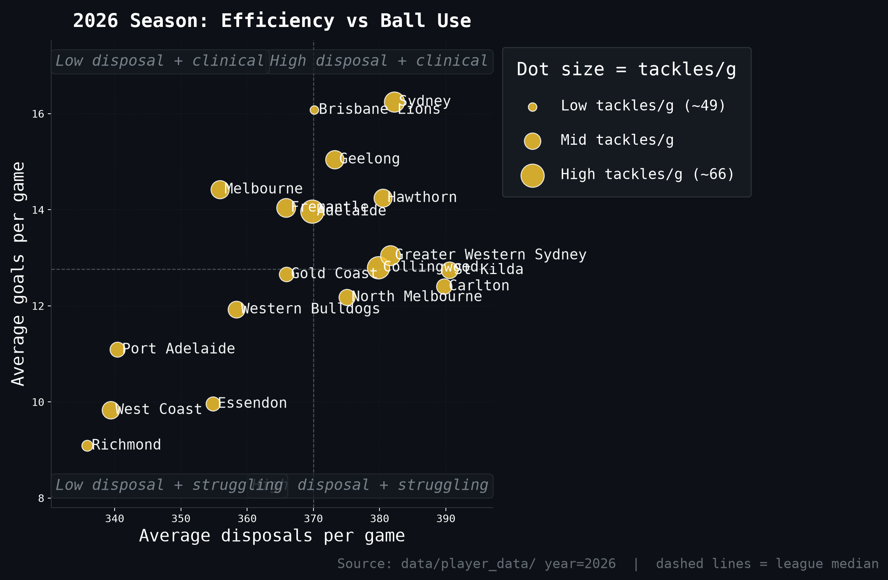
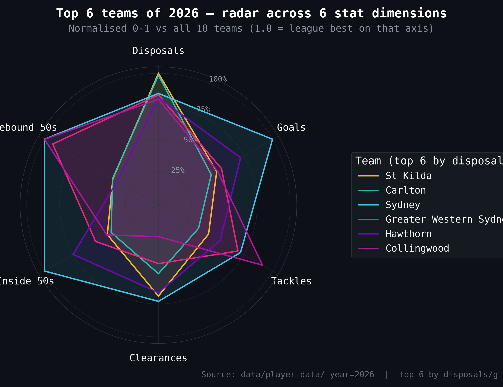
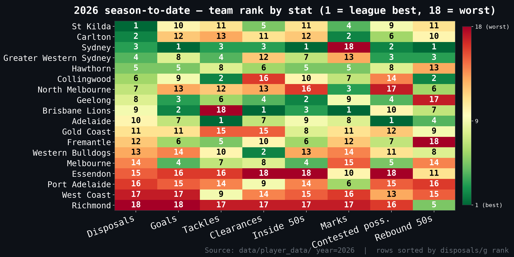
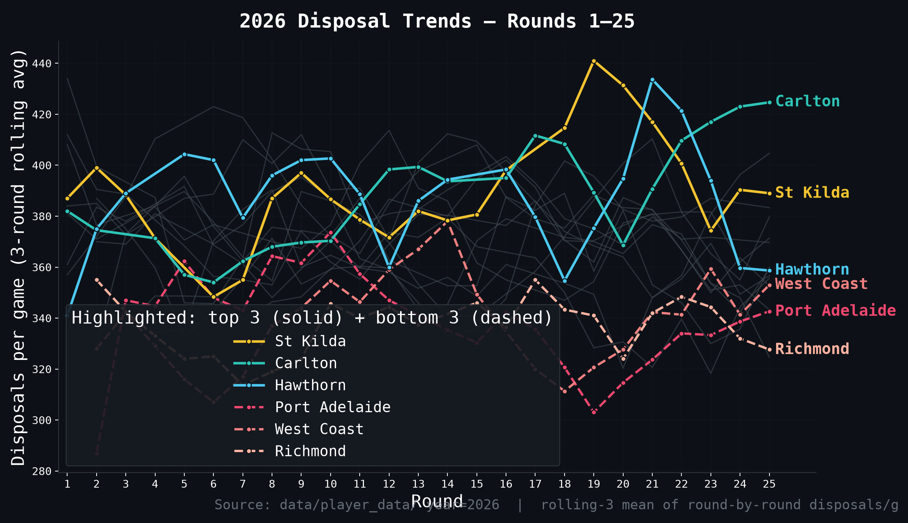

# 2026 team analysis

> [← Back to 2026 season](afl-season-2026.md) | [← Back to main README](../README.md)

*This file is auto-updated by `update_team_analysis.py` / `refresh_readme.py` on every data refresh.*

<!-- 2026-TEAM-ANALYSIS-START -->
Through 25 rounds of the 2026 season, the league averages out at around 367 disposals, 213 kicks, 155 handballs, 57 tackles, 36 clearances and 13 goals per team per game. **St Kilda** lead the comp for total disposals (390.6/g), with **Brisbane Lions** winning the most clearances (39.6/g) and **Adelaide** the most physical side (66.4 tackles/g). **Sydney** are the highest-scoring team at 16.2 goals/g, while **Richmond** prop up the table on both fronts — only 335.9 disposals/g and 9.1 goals/g. At the individual level, **Nick Daicos** (Collingwood) is the leading ball-winner at 34.7 disposals/game. Caveat: this is a small sample — single-season form can swing by round, so treat the rankings below as a snapshot rather than a settled hierarchy.

### All 18 teams ranked by total disposals — 2026 season-to-date

| # | Team | G | Disp/g | Kicks | Handballs | Marks | Goals | Tackles | Clearances | I50s | CP | Form tag |
| ---: | :--- | ---: | ---: | ---: | ---: | ---: | ---: | ---: | ---: | ---: | ---: | :--- |
| 1 | St Kilda | 23 | 390.6 | 223.8 | 166.7 | 98.7 | 12.7 | 56.6 | 37.3 | 52.2 | 130.1 | ball-winners |
| 2 | Carlton | 25 | 389.8 | 225.4 | 164.3 | 103.4 | 12.4 | 55.1 | 36.1 | 51.7 | 131.8 | ball-winners |
| 3 | Sydney | 25 | 382.2 | 205.7 | 176.6 | 77.9 | 16.2 | 61.5 | 37.6 | 60.4 | 138.7 | ball-winners, clearance machine |
| 4 | Greater Western Sydney | 23 | 381.7 | 209.6 | 172.1 | 86.4 | 13.0 | 61.1 | 35.6 | 53.7 | 134.8 | contested-ball team, strong rebound |
| 5 | Hawthorn | 25 | 380.5 | 223.4 | 157.2 | 97.6 | 14.2 | 58.4 | 37.2 | 56.6 | 130.2 | mid-pack |
| 6 | Collingwood | 24 | 379.8 | 209.5 | 170.4 | 94.9 | 12.8 | 64.8 | 34.1 | 52.3 | 124.9 | physical unit, strong rebound |
| 7 | North Melbourne | 23 | 375.1 | 212.8 | 162.3 | 100.1 | 12.2 | 56.0 | 35.4 | 48.6 | 120.6 | mid-pack |
| 8 | Geelong | 25 | 373.2 | 215.8 | 157.4 | 90.6 | 15.0 | 58.8 | 37.5 | 58.7 | 134.8 | contested-ball team, scoring threat |
| 9 | Brisbane Lions | 27 | 370.1 | 240.5 | 129.6 | 108.1 | 16.1 | 49.0 | 39.6 | 57.6 | 128.6 | clearance machine, low pressure |
| 10 | Adelaide | 25 | 369.8 | 225.1 | 144.7 | 91.5 | 14.0 | 66.4 | 37.0 | 52.4 | 139.0 | contested-ball team, physical unit |
| 11 | Gold Coast | 23 | 366.0 | 202.9 | 163.1 | 88.7 | 12.7 | 54.1 | 34.1 | 53.6 | 127.9 | mid-pack |
| 12 | Fremantle | 27 | 365.9 | 204.4 | 161.5 | 88.3 | 14.0 | 59.4 | 36.2 | 55.0 | 130.7 | mid-pack |
| 13 | Western Bulldogs | 25 | 358.4 | 208.5 | 149.9 | 85.0 | 11.9 | 56.8 | 38.4 | 51.5 | 128.4 | clearance machine |
| 14 | Melbourne | 24 | 355.9 | 207.1 | 148.8 | 84.8 | 14.4 | 58.5 | 36.6 | 56.8 | 133.3 | mid-pack |
| 15 | Essendon | 23 | 354.9 | 200.9 | 154.0 | 90.0 | 10.0 | 53.7 | 32.3 | 45.6 | 118.7 | low pressure, struggling in front of goal |
| 16 | Port Adelaide | 23 | 340.4 | 216.0 | 124.5 | 96.0 | 11.1 | 54.7 | 36.4 | 50.3 | 124.3 | starved of the ball |
| 17 | West Coast | 23 | 339.4 | 198.0 | 141.4 | 83.8 | 9.8 | 57.7 | 34.6 | 49.3 | 126.8 | starved of the ball, struggling in front of goal |
| 18 | Richmond | 23 | 335.9 | 191.5 | 144.3 | 82.2 | 9.1 | 50.7 | 33.4 | 47.0 | 121.7 | starved of the ball, low pressure |

### League leaders by stat category — 2026

| Stat | League leader | Their avg/g | League avg/g | Delta vs league |
| :--- | :--- | ---: | ---: | ---: |
| Disposals | St Kilda | 390.6 | 367.5 | +23.1 |
| Kicks | Brisbane Lions | 240.5 | 212.6 | +27.9 |
| Handballs | Sydney | 176.6 | 154.9 | +21.7 |
| Marks | Brisbane Lions | 108.1 | 91.7 | +16.4 |
| Goals | Sydney | 16.2 | 12.9 | +3.3 |
| Tackles | Adelaide | 66.4 | 57.4 | +9.0 |
| Clearances | Brisbane Lions | 39.6 | 36.2 | +3.4 |
| Inside-50s | Sydney | 60.4 | 53.1 | +7.3 |
| Contested possessions | Adelaide | 139.0 | 129.3 | +9.7 |
| Rebound-50s | Sydney | 41.8 | 39.3 | +2.5 |
| Hit-outs | Gold Coast | 44.0 | 35.8 | +8.2 |
| Contested marks | Fremantle | 11.1 | 9.1 | +2.0 |

<!-- GOALS-DISPOSALS-CHART-START -->

<!-- GOALS-DISPOSALS-CHART-END -->

### Visual snapshot — top-6 radar and league-wide rank heatmap

The radar chart below picks out the top six disposal teams of the 2026 season-to-date and plots them against the six core dimensions, normalised to a 0-1 scale relative to all 18 sides — a value of 1.0 on an axis means that team is the league best on that stat. The heatmap underneath shows every team's rank across eight key stats (1 = league best in green, 18 = worst in red), with rows ordered by disposals rank.

<!-- FORM-TREND-CHART-START -->

<!-- FORM-TREND-CHART-END -->

### Team-by-team — playing style, strengths and weaknesses

Every paragraph below is generated from the team's actual 2026 stat profile (averages and league ranks across 16 stat categories). The strategy descriptions are derived from rank combinations, not hand-written takes — so they update automatically as the season progresses. Rank 1 = best, rank 18 = worst (for clangers and free kicks against, lower raw values are better, so rank 1 still means the desirable end).

### St Kilda

After 23 games of 2026, the St Kilda sit near the top of the league for ball use (1st for disposals) and average 390.6 disposals, 12.7 goals and 56.6 tackles per game. Their stat profile reads as a possession-based, uncontested-game template. They go inside 50 52.2 times a game (11th in the league), win 130.1 contested possessions (9th) and tilt 43/57 between handball and kick. The strengths jump out clearly: they're 1st for disposals (390.6/g), 1st for uncontested possessions (249.6/g), 2nd for free kicks against (17.0/g). The flip side is harder to ignore: 14th for hit-outs (30.5/g), 11th for tackles (56.6/g), 11th for inside-50s (52.2/g) — that's where opposition coaches will be drawing up plans. Key player to watch is **Nasiah Wanganeen-Milera**, leading the team in disposals at 29.1/game.

### Carlton

After 25 games of 2026, the Carlton sit near the top of the league for ball use (2nd for disposals) and average 389.8 disposals, 12.4 goals and 55.1 tackles per game. Their stat profile reads as a contest-heavy approach at the stoppages; with notably soft pressure around the ball. They go inside 50 51.7 times a game (12th in the league), win 131.8 contested possessions (6th) and tilt 42/58 between handball and kick. The strengths jump out clearly: they're 2nd for disposals (389.8/g), 2nd for kicks (225.4/g), 2nd for marks (103.4/g). The flip side is harder to ignore: 18th for hit-outs (28.2/g), 13th for tackles (55.1/g), 12th for goals (12.4/g) — that's where opposition coaches will be drawing up plans. Key player to watch is **Sam Walsh**, leading the team in disposals at 29.1/game.

### Sydney

After 25 games of 2026, the Sydney sit near the top of the league for ball use (3rd for disposals) and average 382.2 disposals, 16.2 goals and 61.5 tackles per game. Their stat profile reads as a contested-ball, clearance-first identity; a high-tempo handball game (46% of disposals by hand); dominating territory and connecting cleanly inside 50. They go inside 50 60.4 times a game (1st in the league), win 138.7 contested possessions (2nd) and tilt 46/54 between handball and kick. The strengths jump out clearly: they're 1st for handballs (176.6/g), 1st for goals (16.2/g), 1st for inside-50s (60.4/g). The flip side is harder to ignore: 18th for marks (77.9/g), 18th for clangers (60.1/g), 14th for free kicks against (19.2/g) — that's where opposition coaches will be drawing up plans. Key player to watch is **Errol Gulden**, leading the team in disposals at 32.0/game.

### Greater Western Sydney

After 23 games of 2026, the Greater Western Sydney sit near the top of the league for ball use (4th for disposals) and average 381.7 disposals, 13.0 goals and 61.1 tackles per game. Their stat profile reads as a contest-heavy approach at the stoppages; a high-tempo handball game (45% of disposals by hand); backed up by elite forward and ground-ball pressure. They go inside 50 53.7 times a game (7th in the league), win 134.8 contested possessions (3rd) and tilt 45/55 between handball and kick. The strengths jump out clearly: they're 2nd for handballs (172.1/g), 3rd for contested possessions (134.8/g), 3rd for rebound-50s (41.5/g). The flip side is harder to ignore: 18th for free kicks for (16.5/g), 17th for contested marks (7.4/g), 17th for clangers (59.7/g) — that's where opposition coaches will be drawing up plans. Key player to watch is **Clayton Oliver**, leading the team in disposals at 30.2/game.

### Hawthorn

After 25 games of 2026, the Hawthorn are tracking inside the top half (5th for disposals) and average 380.5 disposals, 14.2 goals and 58.4 tackles per game. Their stat profile reads as a possession-based, uncontested-game template; dominating territory and connecting cleanly inside 50. They go inside 50 56.6 times a game (5th in the league), win 130.2 contested possessions (8th) and tilt 41/59 between handball and kick. The strengths jump out clearly: they're 2nd for hit-outs (42.8/g), 5th for disposals (380.5/g), 5th for kicks (223.4/g). The flip side is harder to ignore: 14th for clangers (57.0/g), 13th for rebound-50s (38.7/g), 12th for free kicks for (18.4/g) — that's where opposition coaches will be drawing up plans. Key player to watch is **Jai Newcombe**, leading the team in disposals at 25.5/game.

### Collingwood

After 24 games of 2026, the Collingwood are tracking inside the top half (6th for disposals) and average 379.8 disposals, 12.8 goals and 64.8 tackles per game. Their stat profile reads as a possession-and-control style that shies away from the contest; backed up by elite forward and ground-ball pressure; frequently absorbing entries and rebounding from defence. They go inside 50 52.3 times a game (10th in the league), win 124.9 contested possessions (14th) and tilt 45/55 between handball and kick. The strengths jump out clearly: they're 1st for rebound-50s (41.8/g), 1st for free kicks against (16.5/g), 2nd for tackles (64.8/g). The flip side is harder to ignore: 17th for free kicks for (16.8/g), 15th for clearances (34.1/g), 15th for hit-outs (30.4/g) — that's where opposition coaches will be drawing up plans. Key player to watch is **Nick Daicos**, leading the team in disposals at 34.7/game.

### North Melbourne

After 23 games of 2026, the North Melbourne are tracking inside the top half (7th for disposals) and average 375.1 disposals, 12.2 goals and 56.0 tackles per game. Their stat profile reads as a possession-and-control style that shies away from the contest; struggling to win territory and force the issue forward; frequently absorbing entries and rebounding from defence. They go inside 50 48.6 times a game (16th in the league), win 120.6 contested possessions (17th) and tilt 43/57 between handball and kick. The strengths jump out clearly: they're 1st for marks inside 50 (14.0/g), 3rd for marks (100.1/g), 3rd for uncontested possessions (243.9/g). The flip side is harder to ignore: 17th for contested possessions (120.6/g), 16th for inside-50s (48.6/g), 15th for free kicks against (20.7/g) — that's where opposition coaches will be drawing up plans. Key player to watch is **Harry Sheezel**, leading the team in disposals at 30.4/game.

### Geelong

After 25 games of 2026, the Geelong are tracking inside the top half (8th for disposals) and average 373.2 disposals, 15.0 goals and 58.8 tackles per game. Their stat profile reads as a contested-ball, clearance-first identity; dominating territory and connecting cleanly inside 50; backed up by elite forward and ground-ball pressure. They go inside 50 58.7 times a game (2nd in the league), win 134.8 contested possessions (3rd) and tilt 42/58 between handball and kick. The strengths jump out clearly: they're 1st for marks inside 50 (14.0/g), 2nd for inside-50s (58.7/g), 3rd for goals (15.0/g). The flip side is harder to ignore: 17th for rebound-50s (37.1/g), 13th for free kicks for (18.3/g), 12th for uncontested possessions (225.5/g) — that's where opposition coaches will be drawing up plans. Key player to watch is **Bailey Smith**, leading the team in disposals at 32.2/game.

### Brisbane Lions

After 27 games of 2026, the Brisbane Lions are floating around the middle of the pack (9th for disposals) and average 370.1 disposals, 16.1 goals and 49.0 tackles per game. Their stat profile reads as a kick-first ball movement (65% by foot); dominating territory and connecting cleanly inside 50; with notably soft pressure around the ball. They go inside 50 57.6 times a game (3rd in the league), win 128.6 contested possessions (10th) and tilt 35/65 between handball and kick. The strengths jump out clearly: they're 1st for kicks (240.5/g), 1st for marks (108.1/g), 1st for clearances (39.6/g). The flip side is harder to ignore: 18th for tackles (49.0/g), 17th for handballs (129.6/g), 16th for free kicks for (16.9/g) — that's where opposition coaches will be drawing up plans. Key player to watch is **Lachie Neale**, leading the team in disposals at 28.7/game.

### Adelaide

After 25 games of 2026, the Adelaide are floating around the middle of the pack (10th for disposals) and average 369.8 disposals, 14.0 goals and 66.4 tackles per game. Their stat profile reads as a contest-heavy approach at the stoppages; backed up by elite forward and ground-ball pressure; frequently absorbing entries and rebounding from defence. They go inside 50 52.4 times a game (9th in the league), win 139.0 contested possessions (1st) and tilt 39/61 between handball and kick. The strengths jump out clearly: they're 1st for tackles (66.4/g), 1st for contested possessions (139.0/g), 1st for free kicks for (20.8/g). The flip side is harder to ignore: 14th for handballs (144.7/g), 14th for uncontested possessions (218.7/g), 14th for marks inside 50 (11.5/g) — that's where opposition coaches will be drawing up plans. Key player to watch is **Jordan Dawson**, leading the team in disposals at 26.5/game.

### Gold Coast

After 23 games of 2026, the Gold Coast are floating around the middle of the pack (11th for disposals) and average 366.0 disposals, 12.7 goals and 54.1 tackles per game. Their stat profile reads as with notably soft pressure around the ball. They go inside 50 53.6 times a game (8th in the league), win 127.9 contested possessions (12th) and tilt 45/55 between handball and kick. The strengths jump out clearly: they're 1st for hit-outs (44.0/g), 6th for handballs (163.1/g), 8th for inside-50s (53.6/g). The flip side is harder to ignore: 18th for free kicks against (21.1/g), 15th for kicks (202.9/g), 15th for tackles (54.1/g) — that's where opposition coaches will be drawing up plans. Key player to watch is **Noah Anderson**, leading the team in disposals at 27.6/game.

### Fremantle

After 27 games of 2026, the Fremantle are floating around the middle of the pack (12th for disposals) and average 365.9 disposals, 14.0 goals and 59.4 tackles per game. Their stat profile reads as dominating territory and connecting cleanly inside 50; backed up by elite forward and ground-ball pressure. They go inside 50 55.0 times a game (6th in the league), win 130.7 contested possessions (7th) and tilt 44/56 between handball and kick. The strengths jump out clearly: they're 1st for contested marks (11.1/g), 2nd for clangers (53.1/g), 3rd for hit-outs (41.7/g). The flip side is harder to ignore: 18th for rebound-50s (36.9/g), 14th for kicks (204.4/g), 14th for free kicks for (18.0/g) — that's where opposition coaches will be drawing up plans. Key player to watch is **Andrew Brayshaw**, leading the team in disposals at 24.7/game.

### Western Bulldogs

After 25 games of 2026, the Western Bulldogs are sitting in the lower third for ball use (13th for disposals) and average 358.4 disposals, 11.9 goals and 56.8 tackles per game. Their stat profile reads as struggling to win territory and force the issue forward. They go inside 50 51.5 times a game (13th in the league), win 128.4 contested possessions (11th) and tilt 42/58 between handball and kick. The strengths jump out clearly: they're 2nd for clearances (38.4/g), 5th for clangers (54.4/g), 8th for rebound-50s (39.2/g). The flip side is harder to ignore: 16th for hit-outs (29.7/g), 16th for contested marks (7.5/g), 14th for marks (85.0/g) — that's where opposition coaches will be drawing up plans. Key player to watch is **Marcus Bontempelli**, leading the team in disposals at 26.6/game.

### Melbourne

After 24 games of 2026, the Melbourne are sitting in the lower third for ball use (14th for disposals) and average 355.9 disposals, 14.4 goals and 58.5 tackles per game. Their stat profile reads as a contest-heavy approach at the stoppages. They go inside 50 56.8 times a game (4th in the league), win 133.3 contested possessions (5th) and tilt 42/58 between handball and kick. The strengths jump out clearly: they're 3rd for free kicks against (17.1/g), 4th for goals (14.4/g), 4th for inside-50s (56.8/g). The flip side is harder to ignore: 15th for marks (84.8/g), 15th for uncontested possessions (211.3/g), 14th for disposals (355.9/g) — that's where opposition coaches will be drawing up plans. Key player to watch is **Jake Bowey**, leading the team in disposals at 24.9/game.

### Essendon

After 23 games of 2026, the Essendon are sitting in the lower third for ball use (15th for disposals) and average 354.9 disposals, 10.0 goals and 53.7 tackles per game. Their stat profile reads as struggling to win territory and force the issue forward; with notably soft pressure around the ball. They go inside 50 45.6 times a game (18th in the league), win 118.7 contested possessions (18th) and tilt 43/57 between handball and kick. The strengths jump out clearly: they're 1st for clangers (51.7/g), 5th for free kicks for (19.5/g), 10th for marks (90.0/g). The flip side is harder to ignore: 18th for clearances (32.3/g), 18th for inside-50s (45.6/g), 18th for contested possessions (118.7/g) — that's where opposition coaches will be drawing up plans. Key player to watch is **Archie Roberts**, leading the team in disposals at 28.1/game.

### Port Adelaide

After 23 games of 2026, the Port Adelaide are anchored near the bottom of the table (16th for disposals) and average 340.4 disposals, 11.1 goals and 54.7 tackles per game. Their stat profile reads as a kick-first ball movement (63% by foot); struggling to win territory and force the issue forward; with notably soft pressure around the ball. They go inside 50 50.3 times a game (14th in the league), win 124.3 contested possessions (15th) and tilt 37/63 between handball and kick. The strengths jump out clearly: they're 6th for kicks (216.0/g), 6th for marks (96.0/g), 6th for hit-outs (40.3/g). The flip side is harder to ignore: 18th for handballs (124.5/g), 16th for disposals (340.4/g), 16th for uncontested possessions (205.2/g) — that's where opposition coaches will be drawing up plans. Key player to watch is **Zak Butters**, leading the team in disposals at 29.8/game.

### West Coast

After 23 games of 2026, the West Coast are anchored near the bottom of the table (17th for disposals) and average 339.4 disposals, 9.8 goals and 57.7 tackles per game. Their stat profile reads as struggling to win territory and force the issue forward. They go inside 50 49.3 times a game (15th in the league), win 126.8 contested possessions (13th) and tilt 42/58 between handball and kick. The strengths jump out clearly: they're 3rd for free kicks for (20.0/g), 9th for tackles (57.7/g), 10th for hit-outs (34.3/g). The flip side is harder to ignore: 18th for marks inside 50 (9.7/g), 17th for disposals (339.4/g), 17th for kicks (198.0/g) — that's where opposition coaches will be drawing up plans. Key player to watch is **Harley Reid**, leading the team in disposals at 24.6/game.

### Richmond

After 23 games of 2026, the Richmond are anchored near the bottom of the table (18th for disposals) and average 335.9 disposals, 9.1 goals and 50.7 tackles per game. Their stat profile reads as struggling to win territory and force the issue forward; with notably soft pressure around the ball; frequently absorbing entries and rebounding from defence. They go inside 50 47.0 times a game (17th in the league), win 121.7 contested possessions (16th) and tilt 43/57 between handball and kick. The strengths jump out clearly: they're 5th for rebound-50s (40.8/g), 10th for clangers (56.4/g), 11th for free kicks for (18.6/g). The flip side is harder to ignore: 18th for disposals (335.9/g), 18th for kicks (191.5/g), 18th for goals (9.1/g) — that's where opposition coaches will be drawing up plans. Key player to watch is **Tim Taranto**, leading the team in disposals at 24.8/game.

<!-- 2026-TEAM-ANALYSIS-END -->

---
**Related:** [Finals pathway](afl-finals-2026.md) · [Brownlow predictor](afl-brownlow-2026.md) · [Stat leaders](afl-stat-leaders-2026.md) · [Predictions](afl-predictions-2026.md) · [Backtest](afl-backtest-2026.md)
