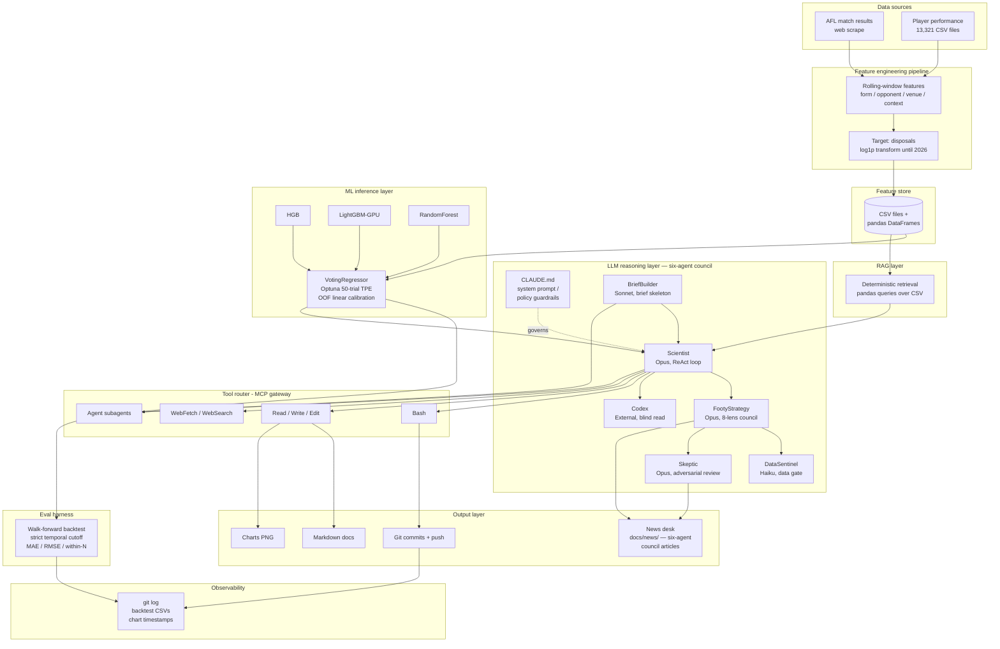

# SuperCoach-VIA - AI System Architecture

> [← Back to main README](../README.md)
>
> **Scope:** This is the **AI-system reference architecture** write-up. It walks each layer of the AI stack (feature pipeline, ML inference, LLM reasoning, RAG, tool router / MCP, eval harness, observability, multi-agent hierarchy), maps the project to Australia's AI Ethics Principles, and describes the production gaps and the sovereign-deployment design. Read this when you want to understand the architecture as a reference design or audit it from an ML-engineering / AI-ethics perspective.
>
> **Companion doc:** For the **repository map and operations manual** — full data inventory, code inventory, docs inventory, match lifecycle, live-pipeline internals, prediction-model implementation, ops runbooks, the incident log, and the agent guardrails — see [`ARCHITECTURE.md`](ARCHITECTURE.md). That doc tells you how the repo *runs*; this one tells you how the system is *designed*.

## How a weekend football project maps to production-grade AI system design

SuperCoach-VIA is a working AI system that ingests 130 years of Australian Football League data, trains an ensemble disposal-prediction model, and lets a Claude-powered "Scientist" agent reason over the dataset, write its own analysis code, generate charts, and publish updated documentation back into the repo.

The interesting part is not the football. It is that the system contains, in miniature, every layer you would expect in a production AI deployment:

- a **feature pipeline** with temporal validation,
- an **ML inference layer** (a calibrated three-model ensemble),
- an **LLM reasoning loop** (the six-agent council),
- a **tool gateway** (MCP),
- a **deterministic RAG layer** over structured data,
- an **offline eval harness** (walk-forward backtest), and
- a **lightweight audit trail**.

This document walks each layer, explains it in plain English, then says what an ML engineer would want to add for production. The aim is to use a small, legible system as a reference point for the bigger ones — and to be honest about the gaps a weekend project leaves open.

---

## Architecture overview



The diagram traces a single complete loop: AFL data is scraped, transformed into rolling-window features, persisted as CSVs, and consumed both by the ML ensemble (which produces calibrated disposal predictions) and by the Scientist agent (which queries the same store deterministically). The agent reasons under CLAUDE.md guardrails, calls tools through Claude Code's MCP gateway, and writes its outputs back to disk and git - closing the loop with the backtest harness as the system's sole automated quality gate.

---

## Component deep-dives

### 1. Data ingestion and feature engineering

**In plain English:** Every player who has ever played AFL has a CSV of their game-by-game stats. We scrape new games each week, then turn those raw stats into rolling averages and trends the model can learn from.

**The methodology:** The pipeline is a batch ETL. AFL Tables and AFL.com.au are scraped into a flat structure of 13,321 player performance CSVs covering 1897–present, plus per-season match files. Feature engineering (in `prediction.py`) constructs rolling-window features on a per-player basis: recent form (3-game, 5-game, season-to-date) and opponent strength. (Venue and contextual home/away/day-night/season-stage flags are *declared* in `prediction.py` but the columns are absent from the training data, so they are silently dropped and do **not** enter the model — see `docs/pending-tasks.md` S-1/S-1b.) The target is disposals per game. Coverage caveats are explicit in the data layer: tackles only from 1987, clearances and contested possessions from 1998, and the 2017 hit-out jump is a recording change rather than a real shift in play (see `agent-memory/Scientist/data_stat_coverage_eras.md`).

**For the ML practitioner:** Leakage prevention is the load-bearing piece. The `LeakProofPredictor` enforces a strict temporal cutoff - when predicting round N, only data strictly before round N is visible during feature construction and model fitting. Cross-validation uses GroupKFold keyed on player ID, so a single player never appears in both train and validation folds (this prevents the model memorising player-specific levels rather than learning generalisable signal). What would change at production scale: a streaming feature pipeline (Kafka/Flink) instead of weekly batch, a real feature store (Feast or Tecton) with point-in-time correctness guarantees rather than ad-hoc CSV reads, and feature drift monitoring to detect when scraping format changes silently corrupt a column.

---

### 2. ML inference layer

**In plain English:** Three different machine-learning models each predict next-round disposals, and we average their answers. Averaging different model types is more robust than any one of them alone.

**The methodology:** A `VotingRegressor` ensembles three diverse base learners - `HistGradientBoostingRegressor`, `LightGBMRegressor` (GPU-accelerated), and `RandomForestRegressor`. Hyperparameters are tuned via Optuna's TPE sampler over a 50-trial budget against MAE on a held-out temporal slice. A post-hoc out-of-fold linear calibration step is applied to fix top-end compression observed in the raw outputs (see `agent-memory/Scientist/prediction_top_end_compression.md` - log1p targets and L1 LightGBM loss were both contributing to a compressed prediction range and were removed).

**For the ML practitioner:** The validation design is walk-forward, not random k-fold. For each completed 2026 round, the model is retrained from scratch using only pre-round data, predictions are generated for that round, and metrics are computed against actuals. Random splits would inflate every metric by leaking future games into the training set - a common failure mode in sports prediction codebases. Known failure modes: top-10 player MAE sits around 10.8 disposals (≈ 2.6× the global MAE of 4.11), driven by a residual ceiling effect and the long right tail of elite-player game counts. Production gaps: no model registry (currently the model is rebuilt on demand and not versioned), no shadow deployment for new model variants, no automated distribution shift monitoring on either inputs or predicted outputs, and no rollback path if a regression slips into production.

---

### 3. LLM reasoning layer - the Scientist agent

**In plain English:** A Claude agent sits on top of the data and the model. You can ask it questions in plain English and it will write Python, run it, look at the results, write more Python, generate a chart, edit a markdown file, and commit the change - all without you touching a keyboard.

**The methodology:** The Scientist agent runs the ReAct pattern (Reason → Act → Observe → repeat). Claude Opus reads the user's task, decides which tool to invoke, executes it via the Claude Code harness, observes the result (stdout, file diff, error trace), and iterates until the task is closed out. Multi-turn reasoning is the default; the agent routinely writes throwaway Python scripts to inspect data before committing to an analysis approach. CLAUDE.md acts as the persistent system prompt - it encodes domain rules (data coverage caveats, ranking constants, stat era boundaries), behavioural constraints (no emojis, absolute paths only, no summary `.md` files), and project workflow (push to main after major changes, commit with co-author tag). Subagent spawning lets long tasks fork specialised workers (e.g. one subagent rebuilds Hall of Fame docs while another runs the next-round prediction).

**For the ML practitioner:** The substrate is Anthropic's tool-use API - each tool is registered with a JSON schema describing its inputs and outputs, and the model is trained to emit structured tool calls when appropriate. The harness routes those calls to local executors. Production gaps are real: Opus latency is 3–10 seconds per turn and a non-trivial task chains 50+ turns, costs scale linearly with token volume and there is no per-task budget enforcement, there is no fallback to a smaller cheaper model when the task is simple, and there is no formal token accounting per session. A production deployment would tier the agent (Haiku for trivial retrieval, Sonnet for normal tasks, Opus only for the hardest reasoning) and enforce hard token ceilings before invocation rather than after.

---

### 3b. FootyStrategy - tactical interpretation agent

**In plain English:** The Scientist tells you what the numbers honestly say. FootyStrategy tells you what to do about it in football terms. The two roles are deliberately kept apart - one is a statistician, the other is a coaching council - so that a tactical recommendation never silently inherits more confidence than the underlying data supports.

**The methodology:** FootyStrategy deliberates through an 8-lens council, with each lens a distinct coaching perspective: the *Conditioner* (preparation, work-rate, repeatable effort), *Tempo Architect* (game-speed control), *Structuralist* (zones, defensive shape), *Match-up Tactician* (named opposition threats and weekly profiling), *Talent Developer* (role fit over résumé), *Innovator* (exploits in the prevailing meta), *Culture Custodian* (standards, identity), and *List Strategist* (multi-year horizon, draft discipline). Every output is tagged with a confidence tier - *Settled* (multiple lenses converge and the underlying data is robust), *Probationary* (lenses converge but data is exploratory), *Contested* (genuine lens disagreement), or *Insufficient Evidence* (neither data nor lens consensus). Every Settled or Probationary recommendation must include a **tripwire**: an explicit observable that, if seen, would overturn the recommendation. No tripwire means the recommendation is automatically downgraded. Caveats from the Scientist's findings propagate through unchanged - associational evidence cannot become causal in the tactical layer, and the data tier caps the recommendation tier. The agent emits a structured envelope (Tier, Horizon, active lenses, per-lens reads, Convergence/Tensions, recommendation, tripwire, caveats, Out of Scope statement). The handoff to the Scientist is one-directional: the Scientist produces numbers, FootyStrategy interprets tactically, and FootyStrategy never fabricates numbers or overrides upstream confidence labels. Invocation is via `@"FootyStrategy (agent)"` in Claude Code; the system prompt lives in the agent definitions directory and persistent memory at `.claude/agent-memory/FootyStrategy/MEMORY.md`.

**For the ML practitioner:** The interesting design choice is the *structured multi-perspective council* pattern rather than a single composite prompt. A single prompt asking "give me a tactical read with confidence" tends to anchor on whichever framing arrived first in the prompt and to bury tensions inside hedged paragraphs. The 8-lens structure does two things differently: it reduces anchoring bias by forcing each perspective to be produced separately before they are reconciled, and it surfaces disagreement explicitly through the *Contested* tier rather than averaging tensions away. The production-grade equivalent is a "society of mind" pattern - in LangGraph, each lens would be a separately-prompted subagent node with its own working memory, edges that aggregate into a deliberation node, and an explicit reconciliation step that emits the final tier. Known limitations are honest: no GPS or spatial data, no video, no real-time injury feed - the layer is pattern-recognition only and its output quality is bounded by the Scientist's data quality.

---

### 4. RAG layer - deterministic retrieval over structured data

**In plain English:** When the agent needs a fact like "Sam Berry's average tackles in 2026," it runs a pandas filter over a CSV. There is no fancy semantic search, and there shouldn't be - for clean structured numbers, plain queries are exactly right.

**The methodology:** Retrieval is fully deterministic: pandas reads the relevant CSV, filters by player ID and season, computes the requested aggregate, and returns the number. No embedding model, no vector store, no nearest-neighbour search. This is the correct architecture for the data shape - semantic similarity adds noise, not signal, when the user query maps directly to a structured filter. Vector search is great for "find me documents about clearance work in wet-weather games"; it is strictly worse than `df.query(...)` for "give me Marcus Bontempelli's disposal average in round 3 home games."

**For the ML practitioner:** Vector search becomes appropriate when unstructured text enters the corpus - match commentary, scouting reports, post-game interviews, injury notes. The production upgrade path is hybrid retrieval: pgvector or Qdrant for the unstructured side, the existing pandas/CSV layer for structured queries, and a routing layer that decides which to hit based on query parse. Chunking strategy for added commentary would be paragraph-level with a 1–2 sentence overlap, with metadata filters on round, team, and player ID so the retriever can scope to relevant context before semantic ranking. The structured layer should remain authoritative for any numeric claim.

---

### 5. Tool router and MCP gateway

**In plain English:** MCP is a standard way for AI models to talk to tools - a USB-C port for AI. Instead of every tool needing its own bespoke integration, MCP defines one protocol the model uses to discover and call any registered tool.

**The methodology:** SuperCoach-VIA uses Claude Code's built-in MCP implementation. The registered tool surface includes Bash (shell command execution), Read / Write / Edit (filesystem), WebFetch and WebSearch (HTTP and search), and Agent (subagent spawning). Tool selection is model-driven: Claude inspects the task, the available tool schemas, and the conversation state, then emits a structured tool call which the harness dispatches. There is no hand-coded routing logic - the model is the router. Tool definitions are JSON-schema documents declaring inputs, outputs, and behavioural notes that condition selection.

**For the ML practitioner:** The MCP specification (Anthropic, 2024) defines a JSON-RPC transport with a server/client model - tools live in MCP servers, and any MCP-aware client can discover and invoke them. Production gaps in this deployment: no sandboxing on Bash (commands execute directly against the host filesystem with the user's privileges), no rate limiting on tool invocation, no input sanitisation on shell arguments, and the spec itself is still pre-1.0 with breaking changes possible. A production hardening path: route every Bash invocation through a gVisor or Firecracker microVM sandbox with a read-only mount of the data layer and a tightly-scoped write area; validate every tool call's inputs and outputs against the registered schemas before dispatch; emit a structured audit record (tool name, arguments hash, caller agent ID, timestamp, latency, exit status) on every call; pin the MCP spec version and gate version upgrades behind regression tests.

---

### 6. Eval harness

**In plain English:** Before publishing a number, the system pretends it's the past. It re-trains the model using only data that would have been available at the time, predicts the round it doesn't yet know the result for, then compares against what actually happened. That gives an honest read on how good the predictions are.

**The methodology:** A walk-forward backtest covers all completed 2026 rounds. For round N, the pipeline trains exclusively on data from before round N (strict temporal cutoff enforced inside `LeakProofPredictor`), generates predictions for every player who played in round N, and joins to actuals. Reported metrics: MAE, RMSE, within-5, within-10, signed bias, and a top-10 MAE slice that surfaces the most-elevated-profile failure mode. Backtest output is persisted as CSV under `data/prediction/backtest/` so each run leaves a permanent record.

**For the ML practitioner:** The eval covers ML model outputs only - LLM output quality is currently measured by post-hoc human review (~70–75% factual accuracy on the first pass of Hall of Fame documents, raised to ~99% after a systematic correction process). Production gap: automated LLM evaluation. RAGAS would give faithfulness and context-relevance scores on every retrieval-augmented response; DeepEval would flag hallucinations against a reference corpus. Online eval is also missing - once a real round is played, the system does not automatically score its earlier predictions against actuals and alert on MAE regression. Adding an online eval loop (cron job that ingests results, joins to predictions, computes metrics, emits to Langfuse/Phoenix) would close the most important production blind spot.

---

### 7. Observability

**In plain English:** When something looks wrong, you want to know who or what produced it, when, and based on which version of the system. Right now we lean on git for that.

**The methodology:** Git history serves as a lightweight audit trail - every doc change is a commit with author, timestamp, diff, and message. Backtest CSVs persist model performance over time, so a regression is visible by diffing two runs. Chart filenames are timestamped, so generation history is recoverable. CLAUDE.md is version-controlled, so the agent's policy state at any past commit is reconstructable.

**For the ML practitioner:** What's missing is structured LLM trace logging - for every agent turn, you want the full prompt (including system prompt and tool definitions), the model's response, the tool calls emitted, latency per turn, token counts, and dollar cost. Without that, debugging "why did the agent do X" is a forensic exercise on git diffs. You also want model performance dashboards (MAE by round, by player tier, by team, drift charts) and alerting on MAE regression beyond a threshold. A solid open-source stack: OpenTelemetry as the trace collection plane (it has wide language support and a stable spec), Langfuse as the LLM-specific trace store and dashboard layer (self-hostable, MIT licensed). For on-prem with stronger compliance posture, Arize Phoenix is the leading open-weight equivalent.

---

### 8. Multi-agent hierarchy - The Crumb

**In plain English:** The Crumb is the project's coaching brain - thirteen specialist agents organised into six tiers, with a Senior Coach orchestrator on top. You ask one question at the front door ("what should we do about our forward line going into round 11?") and the Senior Coach decomposes it, dispatches the relevant specialists, and integrates their answers back into a single coherent recommendation. It is named after the AFL crumber - the small forward who reads where the ball will spill from a pack before the contest resolves. The Crumb sees the pattern before the coach has called it.

**The methodology:** Architecture and per-agent role definitions live in `docs/footy-ai-chatbot-setup.md`. The 13-agent, 6-tier structure:

| Tier | Agent | Role |
|------|-------|------|
| 1 | Senior Coach Agent | Orchestrator - decomposes queries, integrates responses, owns final framing |
| 2 | Midfield Coach Agent | Clearance, contested ball, stoppage, rotations |
| 2 | Forward Line Coach Agent | Inside-50 entries, forward structure, conversion, set pieces |
| 2 | Back Line Coach Agent | Defensive setup, intercept structure, rebound chain |
| 3 | Stoppage Specialist | Centre-bounce and around-ground stoppage designs |
| 3 | Defensive Press Specialist | Forward-half pressure, kick-in coverage, transition defence |
| 4 | Match Analyst Agent | Pattern recognition across recent fixtures |
| 4 | Opposition Analyst Agent | Weekly opposition profile, personnel, historical tendencies |
| 4 | Stats/Methodology Agent | Quantitative work - the existing Scientist agent |
| 4 | Strategy Council Agent | Tactical interpretation - the existing FootyStrategy agent |
| 5 | High Performance Agent | Load, fitness, injury risk, return-to-play |
| 5 | List Manager Agent | Multi-year list strategy, contract, draft |
| 6 | Data Steward Agent | Owns data files, enforces CLAUDE.md verification rule |

Technology mapping: the Senior Coach runs on `claude-opus-4-7` because orchestration and final framing are the highest-reasoning workload; line coaches, specialists, and analysts run on `claude-sonnet-4-6` (fast, capable enough for scoped specialist work); the Data Steward runs on `claude-haiku-4-5` because its job is structured retrieval and verification, not open-ended reasoning. Orchestration uses the Claude Code agent SDK's tool_use plus subagent-spawning model - the Senior Coach calls each tier-2/3/4 agent through the Agent tool, receives a structured envelope back, and integrates. Data access is shared across the tiers via the existing repo layout: `data/player_data/`, `data/matches/`, `data/lineups/`, and `data/prediction/`. The Scientist and FootyStrategy agents already documented above are slotted into Tier 4 - The Crumb is the structural envelope that gives them a coordinated calling pattern rather than ad-hoc invocation.

**For the ML practitioner:** The Crumb is a specialisation of the **hierarchical agent** pattern - one orchestrator, many workers, with role boundaries enforced through system prompt scoping rather than code-level access control. The trade-off is honest: prompt-scoped boundaries are cheap to define and flexible to evolve but provide no hard guarantee that, say, the List Manager will not attempt to write a tactical recommendation outside its scope. The production upgrade path is two-part. First, LangGraph to make state transitions explicit and handoffs durable - each agent becomes a node with declared inputs and outputs, the graph is the orchestration contract, and a crashed agent turn can be replayed from the last persisted state rather than re-running the whole workflow. Second, Temporal.io for retry semantics when an agent turn fails mid-workflow - exactly-once execution, exponential backoff on transient model errors, and workflow versioning so an in-flight session does not silently switch behaviour when the agent definitions are updated. Hard role enforcement (least-privilege credentials per agent, capability-scoped MCP tool sets) becomes meaningful once those two are in place.

---

### 9. Claude Code setup - building and extending the agent stack

**In plain English:** Claude Code is the substrate the whole agent stack runs on. It is not a chatbot in a browser tab - it is a CLI/IDE harness that gives Claude direct access to your filesystem, shell, web, and other agents, governed by a policy document checked into the repo. This section is how someone with the repo and an API key gets the full Scientist + FootyStrategy + Crumb stack running, and how they would extend it with a new agent or data source.

**The methodology:**

1. **What Claude Code is.** Anthropic's official CLI and IDE-integrated AI tool. It is the agent harness for this project - the thing that turns a Claude API call into a usable agent. It implements the MCP gateway (tool discovery and dispatch), the tool-use API loop (ReAct cycles with structured tool calls), multi-agent orchestration (parent agents can spawn subagents via the Agent tool), and the CLAUDE.md policy system (a versioned, repo-resident system prompt that governs every session). Distinguishing it from a chatbot wrapper: local filesystem read/write, shell execution, git operations, web fetch, and subagent spawning are all native primitives, not workarounds.

2. **Installation and prerequisites.** Install the CLI with `npm install -g @anthropic-ai/claude-code`, or use the desktop app. Authenticate by setting `ANTHROPIC_API_KEY` as an environment variable. For the SuperCoach-VIA project specifically, the Python environment used by every agent is the project venv at `/home/abhi/sourceCode/python/coding/.venv` - it already contains pandas, scikit-learn, lightgbm, matplotlib, optuna, and the rest of the analysis stack. Clone the repo with `git clone https://github.com/apur27/SuperCoach-VIA` and run Claude Code from inside the repo root so CLAUDE.md is auto-loaded.

3. **Agent definitions.** Custom agents are registered as markdown files under `.claude/agents/`. Each file is a frontmatter block plus a system prompt: `name`, `model` (e.g. `sonnet`, `opus`), `description`, and `tools` (whitelist of tools the agent is allowed to invoke) in the frontmatter, then the system prompt as the body. The Scientist and FootyStrategy definitions live there now. Any new agent - say an Opposition Analyst for The Crumb - is added by writing a new `.md` file in the same directory following the same shape.

4. **CLAUDE.md - the policy layer.** The project-level `CLAUDE.md` at the repo root governs every agent in every session. It encodes the data verification rule (no player stat is written without first reading it from the data files), absolute-path requirements, push policy (push to main, no PRs), and the broader behavioural constraints (no emojis, no summary `.md` files, no ad-hoc filesystem changes outside the agreed scope). This is the agent's constitution - it is read first on every turn and is enforced for the entire session. Versioning it in the repo means policy state at any past commit is reconstructable, which is a real audit primitive.

5. **Extending the stack - adding a new agent.** Four steps. *Step 1:* create `.claude/agents/<agent-name>.md` with frontmatter declaring name, model, description, and the tool whitelist, and the system prompt as body. *Step 2:* define the agent's data access scope in the system prompt - which directories it is allowed to read, which directories it must not write to, which data files are authoritative for which claims. *Step 3:* invoke it from a chat session with `@"<Agent Name> (agent)"`, or programmatically from a parent agent via the Agent tool. *Step 4:* register it in the tier table in `docs/footy-ai-chatbot-setup.md` and mirror the entry in this architecture doc, so the system has a single source of truth for what agents exist and what they do.

6. **MCP server extensions.** Claude Code supports custom MCP servers beyond its built-in tools. Example: a live AFL data MCP server exposing `get_live_scores`, `get_player_stats`, and `get_team_form`. Define it in `.claude/settings.json` under the `mcpServers` key, declaring the transport (stdio or HTTP), the entry point, and any required environment variables. Each MCP server declares its own tool schemas, and Claude Code discovers them at session start - no client-side wiring needed beyond the registration entry. This is the path to integrating real-time data sources without baking them into the agent code.

7. **Memory system.** Persistent agent memory lives under `.claude/agent-memory/<agent-name>/`. The convention is a top-level `MEMORY.md` acting as an index of one-line pointers, with individual topic files (`data_quirks.md`, `user_preferences.md`, etc.) as the entries. Memory persists across sessions and is loaded into the agent's context at conversation start. The Scientist's memory currently carries data-quirk notes, baseline numbers, and reproducibility recipes - all written from prior sessions so future sessions do not re-derive them. FootyStrategy's memory at `.claude/agent-memory/FootyStrategy/MEMORY.md` does the same for tactical patterns. The memory system is what lets the agent tailor responses without re-explaining context on every invocation.

**For the ML practitioner:** The interesting choice is that the entire agent definition surface - system prompts, tool whitelists, memory, policy - lives in the repo as plain markdown and JSON. There is no separate "agent registry" service. That makes the stack diff-able, reviewable, and rollback-able via the same git workflow as the code, which is the right default for a small-team or single-operator deployment. The production upgrade path is to lift the agent definitions into a managed registry once you have multiple teams editing concurrently - but the markdown-in-repo pattern scales further than people expect, and the audit benefits are real.

---

### 10. The six-agent council — architecture and interaction model

**In plain English:** The repo has six specialised agents. Each one does a narrowly-defined job, deliberately separated so that no single agent has to be good at everything - and so that errors made by one are caught before they propagate into the final output. The same six-agent council drives two distinct output types: the pre-match brief (a forward-looking tactical preview) and the **news desk** (`docs/news/` — data-grounded commentary on a current AFL story). Both run the same chain — BriefBuilder skeleton → Scientist data layer → FootyStrategy interpretation → DataSentinel verification → Skeptic adversarial review → optional Codex outside-frame read — only the prompt and the target document differ. This section documents who they are, what they hand off to each other, and how to invoke them correctly.

**Agent registry:**

| Agent | Job | Model | Tool surface | Invocation |
|-------|-----|-------|-------------|-----------|
| **Scientist** | Data analysis, statistical tests, code execution, prediction runs | Claude Opus | All tools (Bash, Read, Write, Edit, WebFetch, Agent) | `@"Scientist (agent)"` |
| **FootyStrategy** | Tactical interpretation, 8-lens council, confidence tiering, tripwire writing | Claude Opus | All tools | `@"FootyStrategy (agent)"` |
| **BriefBuilder** | Pre-match brief skeleton - auto-populates [data] tags, leaves FOOTYSTRATEGY INSERT placeholders | Claude Sonnet | All tools | `@"BriefBuilder (agent)"` |
| **DataSentinel** | Pre-commit verification gate - walks every [data] tag, confirms against source CSV, emits PASS/FAIL | Claude Haiku | All tools | `@"DataSentinel (agent)"` |
| **Skeptic** | Adversarial review - checks tripwire observability, caveat-hierarchy fidelity, lens-tension smoothing | Claude Opus | All tools | `@"Skeptic (agent)"` |
| **Codex** | Outside-the-frame second opinion, model-internals inspection, blind adversarial read | External (GPT series) | Shared runtime | `@"Codex (agent)"` |

**Standard council pipeline — sequence and handoffs:**

The same sequence below is used for both the pre-match brief and a news-desk article. For a brief the trigger is "team names + round" (Monday of match week); for a news article the trigger is "a story breaks" (a retirement, coach change, milestone, controversy). The handoffs and gates are identical.

```
 Trigger (match week / story breaks)
    │
    ▼
┌─────────────┐   team names + round
│ BriefBuilder│──────────────────────► writes data skeleton
│  (Sonnet)   │                        [data] tags on every number
└─────────────┘                        <!-- FOOTYSTRATEGY INSERT --> placeholders
    │ brief skeleton
    ▼
┌─────────────┐   skeleton + target question
│  Scientist  │──────────────────────► statistical tests, effect sizes, CIs
│   (Opus)    │                        caveats propagated explicitly
└─────────────┘
    │ findings with uncertainty
    ▼
┌─────────────┐   skeleton + Scientist findings
│ FootyStrategy──────────────────────► 8-lens council deliberation
│   (Opus)    │                        tiered recommendations + tripwires
└─────────────┘
    │ complete draft
    ▼
┌─────────────┐   complete assembled brief
│ DataSentinel│──────────────────────► verifies every [data] tag vs source CSV
│   (Haiku)   │                        PASS or annotated FAIL list
└─────────────┘
    │ verified brief
    ▼
┌─────────────┐   verified brief + upstream chain
│   Skeptic   │──────────────────────► tripwire observability check
│   (Opus)    │                        caveat-hierarchy audit
└─────────────┘                        PASS / PASS_WITH_CONCERNS / BLOCK
    │
    ▼
 Brief / article ready to print
    │
    └── optional: Codex blind read for outside-the-frame gaps
```

**News desk as an output type.** The `docs/news/` section is the council's second product line — data-grounded AFL commentary rather than forward-looking tactical briefs. Each entry takes a current story (a retirement, a coach vacancy, a games-record milestone, a club crisis) and grounds it in the repo's 125+ years of match data and per-game player tables. Recent six-layer council articles include *Jonathan Brown — The Fist of God*, *Greg Williams — The Possession Engine*, *Neale Daniher — Why Not*, *Scott Pendlebury — The StormRider*, and the *James Hird Essendon coach* case. The provenance contract is the same `[data]` / `[historical record]` / `[historical record - unverified in data]` tagging used everywhere else in the repo: every figure either traces to a CSV in `data/` (and is reproducible) or is explicitly marked as a public-record fact not held in the dataset. The full pattern, house rules (no betting tips, no business decisions disguised as analysis, associational-vs-causal language made explicit), and entries table live in `docs/news/README.md`. The two-layer split is visible in every article — the data tables and `[data]` tags are the Scientist's work; the prose interpretation between them is FootyStrategy's — with DataSentinel and Skeptic gating the result and Codex providing the optional outside-frame read. The "Complete (all six council layers)" status in the entries table records which articles have been through the full chain versus the lighter "data + FootyStrategy" path.

**Handoff contracts — what each agent receives and what it must not invent:**

| Handoff | What must be passed explicitly | What the receiving agent must not do |
|---------|-------------------------------|--------------------------------------|
| BriefBuilder → Scientist | The brief skeleton with [data] tags already placed | Scientist must not re-derive stats already in the skeleton; augment, don't redo |
| Scientist → FootyStrategy | Effect size, CI, sample size, and the verbatim caveat on each finding | FootyStrategy must not upgrade "associational" to "causal"; must not fabricate numbers not in Scientist's output |
| FootyStrategy → DataSentinel | The complete assembled draft with all [data] tags and sources named in the methodology para | DataSentinel must not interpret meaning; it checks numbers only |
| FootyStrategy → Skeptic | The full draft + Scientist findings + BriefBuilder skeleton as context | Skeptic must not rewrite the draft; must report line-number + quote + proposed fix |
| Any agent → Codex | The complete brief and the specific question | Codex should not act as a primary fact source for AFL stats - it is a reasoning check, not a data source |

**Standalone invocation rules:**

- **Scientist**: can be invoked standalone for any data analysis task. No prior context needed.
- **FootyStrategy**: works best with some data context (from Scientist or BriefBuilder). Can be invoked standalone for post-match tactical reads where the question is conceptual rather than statistical.
- **BriefBuilder**: invoked first in any match-preparation cycle, and first in a news-desk article build (it lays the data skeleton with `[data]` tags and `<!-- FOOTYSTRATEGY INSERT -->` placeholders before the Scientist deepens the data layer). No prior context needed.
- **DataSentinel**: invoked on any draft document with [data] tags. Can be run standalone mid-draft for a partial check.
- **Skeptic**: invoke only after FootyStrategy has produced a *complete* draft. Premature invocation before the recommendation is settled generates noise.
- **Codex**: invoke when you want a second opinion uncorrupted by the other agents' reasoning chains, or when the question touches model internals (feature contributions, why did the predictor give this player that score).

**Model selection rationale:**

The council tiers its model selection by task complexity, not by prestige. Using Opus everywhere is slower and more expensive without improving quality on scoped tasks.

| Agent | Why this model |
|-------|---------------|
| DataSentinel → Haiku | Pure structured retrieval and pattern matching against a known schema. No complex reasoning; speed and cost matter more than chain-of-thought depth. |
| BriefBuilder → Sonnet | Data-assembly templating: open files, read rows, write tagged output to a fixed structure. Moderate complexity — Sonnet handles it cleanly without Opus latency. |
| Scientist → Opus | Long reasoning chains: statistical test selection, feature engineering decisions, caveat propagation, uncertainty quantification. The hardest reasoning workload in the council. |
| FootyStrategy → Opus | Multi-perspective deliberation: activating 3–5 distinct coaching lenses, surfacing tensions, tiering a recommendation with a falsifiable tripwire. Requires broad knowledge and nuanced judgement. |
| Skeptic → Opus | Adversarial reasoning: detecting caveat drift, assessing tripwire observability from first principles, identifying smoothed tensions. Must be as capable as the agent it reviews. |
| Codex → External | Deliberate provider separation: an independent model family avoids anchoring on the same training-data priors as the rest of the council. The value of Codex is the difference in perspective, not raw capability. |

**For the ML practitioner:** The interesting design choice is that error containment is structural rather than prompt-based. Rather than adding "check your numbers" to every agent's system prompt, DataSentinel is a dedicated gate — a separate agent whose only job is verification, running on a cheap model because the task is cheap. Similarly, rather than adding "play devil's advocate" to FootyStrategy's prompt (which causes self-critique to be soft and polite), Skeptic is an adversarial agent with no social stake in the draft it reviews. The pattern is: *separate agents for separate failure modes*. The production equivalent is a pipeline with explicit checkpoints — a lint step for data tags, a confidence-threshold gate before publication, a separate evaluator that does not share weights with the generator. These are well-established patterns in ML pipelines (train/eval split, holdout sets, A/B test gating); the council applies the same logic to the LLM layer.

**Orchestration contract — one pipeline, two views.** The repo describes agents in two places — the six-agent council here in §10, and The Crumb's 13-agent, 6-tier hierarchy in §8 — and it is worth being explicit that these are *not two competing architectures*. They are one execution contract and one routing view onto it.

- **The council chain is the canonical execution pipeline.** Every brief and every news article goes through exactly one ordered contract: **BriefBuilder → Scientist → FootyStrategy → DataSentinel → Skeptic → Gaffer**. That chain is the single thing everything flows through. The middle of the chain — DataSentinel verification and Skeptic adversarial review — is the gate, and the gate is the point: nothing ships on a `DataSentinel: FAIL` or a `Skeptic: BLOCK`. (Codex remains an optional outside-the-frame blind read hung off the side of the chain, not a step in it.)
- **The Crumb's tier model is a routing view, not a second pipeline.** The 13-agent hierarchy in §8 answers one question — *which specialists activate for a given query* (a forward-line question wakes the Forward Line Coach; an opposition question wakes the Opposition Analyst). Having decided who is relevant, The Crumb still routes the actual work through the same canonical council chain above. The tier table is an index of expertise, not an alternative execution order. The Scientist and FootyStrategy agents are the concrete proof of this: they appear in §8 as Tier-4 specialists *and* as steps in the council chain — the same agents, addressed two ways.
- **Gaffer sits at both ends, never in the middle.** Gaffer (Delivery Lead / orchestrator, defined in `.claude/agents/Gaffer.md`) *commissions* the chain at the front (sequences the agents, passes each its handoff contract) and *approves shipment* at the back (applies presentation polish and writes the provenance stamp on a full PASS). It cannot reach into the middle: Gaffer is boss of process, not of truth, and is structurally forbidden from overriding, softening, or re-running-until-green a DataSentinel or Skeptic verdict, and from authoring any `[data]`-tagged number. The gate is the one thing the orchestrator cannot bypass — which is what makes the orchestrator safe to put in charge of cadence.

The provenance stamp is how this contract becomes machine-checkable rather than narrative. Every council-authored doc carries a `<!-- council-pipeline: ... -->` block recording that each tier ran and that DataSentinel and Skeptic returned PASS; the pre-commit hook (Gap 1) refuses any commit of a council doc whose stamp is missing or whose gating tiers are non-PASS. That converts the chain from "the order we usually run things in" to "the order the harness enforces."

---

## Harness engineering — current state and gaps

**In plain English:** The six-agent council and the ML pipeline are the *workload*. The harness is everything around them that makes the workload run reliably — the hooks that gate writes, the markers that let an idempotent script edit a doc without trampling prose, the cron jobs that fire on a schedule, the audit log that lets you replay why an agent did what it did. Most agent stacks fail not because the model is wrong but because the harness is missing. This section is an honest audit of what the harness actually contains today, and what the load-bearing gaps are.

The audit method matches the rest of this repo — *DataSentinel-style verification*. Every "implemented" claim below was checked against the actual file or config (path named in-line), not asserted from memory.

### What's implemented

- **CLAUDE.md as policy** **[implemented]** — `/home/abhi/git/SuperCoach-VIA/CLAUDE.md` is loaded by every Claude Code session and contains the data-verification rule (no specific player stat without first reading it from `data/player_data/`), the venv Python path, and the per-player file naming convention. Version-controlled, diff-able, rollback-able with git.
- **Per-agent persistent memory** **[implemented]** — `/home/abhi/git/SuperCoach-VIA/.claude/agent-memory/` holds one directory per agent (`Scientist/`, `FootyStrategy/`, `BriefBuilder/`, `DataSentinel/`, `Skeptic/`). Each directory has a `MEMORY.md` index plus topic files (data quirks, baselines, methodology recipes). The Scientist memory currently carries 17 topic files including stat-coverage eras, the top-end-compression incident, and a "backtest must be incremental" rule recorded from a prior failure.
- **Agent definitions in repo** **[implemented]** — 5 agent specs live as plain markdown under `/home/abhi/git/SuperCoach-VIA/.claude/agents/` (BriefBuilder, DataSentinel, FootyStrategy, Scientist, Skeptic), each ~144 lines with YAML frontmatter declaring model, color, and memory scope. Diff-able and version-controlled in the same workflow as code.
- **Permission allowlist** **[implemented]** — `/home/abhi/git/SuperCoach-VIA/.claude/settings.local.json` declares an explicit allowlist of ~130 `Bash(...)` and `WebFetch(domain:...)` patterns. Any unlisted command surfaces a permission prompt rather than silently executing. This is the closest thing to a per-session capability scope currently in place.
- **Auto-generation markers** **[implemented]** — `update_team_analysis.py` and `refresh_readme.py` edit specific sections of `README.md` and `docs/afl-team-analysis-2026.md` by locating `<!-- YEAR-TEAM-ANALYSIS-END -->`, `<!-- 5YEAR-TEAM-PROFILES-END -->`, `<!-- GOALS-DISPOSALS-CHART-START/END -->`, `<!-- FORM-TREND-CHART-START/END -->`, `<!-- {year}-FINALS-PATHWAY-START/END -->`, and `<!-- NEWS-LATEST-START/END -->` markers. This is a real harness primitive — the same doc can hold hand-written prose *and* an auto-regenerated block without re-edits clobbering each other.
- **News-latest auto-surfacing** **[implemented]** — `refresh_readme.py` `_step_news_latest()` (step [2c] of the refresh cycle) parses the entries table in `docs/news/README.md`, takes the two most-recent rows (the table is maintained most-recent-first), and rewrites the `<!-- NEWS-LATEST-START/END -->` block in `README.md` so the front page always links the latest two council articles. The step is idempotent — if the parsed top-2 already match the README block it writes nothing — and is resilient: a parse failure returns an error string that the orchestrator logs without aborting the rest of the refresh. This is the harness wiring that connects the news-desk output type back to the repo's front door without a manual edit.
- **Walk-forward backtest with strict temporal cutoff** **[implemented]** — `backtest.py --start-year 2026 --start-round <N> --end-year 2026 --end-round auto` writes `data/prediction/backtest/prediction_vs_actual_round_<N>_<timestamp>.csv` plus a `backtest_summary_<timestamp>.csv` per run. The timestamp suffix means re-runs accumulate rather than overwrite, giving a longitudinal record.
- **Incremental backtest resume** **[implemented]** — `refresh_and_rank.sh` step [4/6] (line 27, "Backtesting prediction accuracy (incremental)") detects the last complete run by globbing `data/prediction/backtest/backtest_summary_*.csv`, extracting the newest timestamp, and starting the walk-forward from the next unprocessed round rather than from round 1. This is the fix for a recurring failure mode recorded in `agent-memory/Scientist/feedback_backtest_rules.md` — re-running the full backtest from R1 every week was both slow (full 2026 backtest is ~5–6h on CPU LightGBM) and risked dropping earlier rounds. On the read side, `update_team_analysis.py` `generate_backtest_section()` (line 4131) merges **all** `backtest_summary_*.csv` files and de-duplicates on `(year, round)` so the published cumulative doc always shows every round R1–Rn even though each incremental run only computes the newest one.
- **Seeded model training** **[implemented]** — `prediction.py` pins `random_state=42` on `HistGradientBoostingRegressor`, `LGBMRegressor`, and `RandomForestRegressor`, and seeds Optuna's TPE sampler at 42. Re-runs of the model fit are deterministic for the ML layer (LLM turns remain non-deterministic).
- **LightGBM GPU/CPU runtime probe** **[implemented]** — `prediction.py` runs a 64-row tiny fit at module load (`LGBM_DEVICE` constant) to detect whether GPU LightGBM is usable in the current environment, and silently falls back to CPU on `[Fatal] GPU Tree Learner was not enabled in this build` errors. Correctness-preserving fallback; the only cost is longer Optuna runtime.
- **cuDF/pandas runtime probe** **[implemented]** — `top_players_comprehensive.py` `initialize_df_lib()` attempts to import cuDF and falls back to pandas on failure with `USE_GPU` flag propagated through downstream code paths. Same pattern: correctness-preserving, environment-aware.
- **Pipeline orchestrator script** **[implemented]** — `refresh_and_rank.sh` chains six steps end-to-end (refresh data → top-100 → predict → backtest → refresh docs → commit/push). Uses `set -e` to abort on any step failure; commits only if `git diff --cached` shows changes; only stages a deliberate file allowlist to avoid pulling in scratch CSVs from `data/prediction/`.
- **Live-match polling pipeline** **[implemented]** — `scripts/live_analysis_pipeline.py` is a long-running Python process (invoked manually via `nohup`) that polls the FanFooty live feed every 90 seconds (`POLL_SECONDS = 90`), writes a quarter-break analyst block into a target markdown doc on each transition, and `git commit && git push origin main` after every block. Stops on Full Time. The polling glitch where end-of-game scores back-fill into earlier-quarter docs is documented in `.claude/agent-memory/Scientist/live_pipeline_glitch.md` and was patched in-pipeline.
- **GitHub Actions scheduled jobs** **[implemented]** — `.github/workflows/weekly-fan-pack.yml` runs at `0 23 * * 3` (Wednesday 23:00 UTC, Thursday 09:00 AEST — moved from the former Sunday slot) and packages whatever is at HEAD into a GitHub Release. `.github/workflows/sync-phase2.yml` runs at `0 2 * * *` and merges main into `feature/phase2`. `.github/workflows/pylint.yml` runs `pylint` on every push across Python 3.8/3.9/3.10. These are real automation, but they run *after* commits land — they do not gate writes to main.
- **Backtest output persistence as audit primitive** **[implemented]** — backtest CSVs are timestamped (e.g. `prediction_vs_actual_round_9_2026_20260511_191837.csv`) and never overwritten, so a regression is visible by diffing two runs at the same round across different timestamps.
- **Codex CLI as external second opinion** **[implemented]** — `codex --approval-mode full-auto` and `Skill(codex:rescue)` permission entries in `settings.local.json` confirm Codex is wired into the harness as a callable subprocess, not just referenced.

### Gap table

| Gap | Severity | Current workaround | Recommended fix |
|---|---|---|---|
| **No pre-commit gate** **[gap]** | **High** — status (2026-05-30): **MVP-live: `.githooks/pre-commit` committed; operator runs `git config core.hooksPath .githooks` on clone (see CONTRIBUTING.md). Not zero-friction — declared MVP, not production-grade.** | A deterministic provenance gate now exists: `scripts/check-council-stamp.sh` reads staged `.md` files, and for any council-authored doc (`docs/news/*.md`, `docs/hall-of-fame-stat-*.md`) it requires a `<!-- council-pipeline: ... -->` stamp whose `DataSentinel:` and `Skeptic:` lines read `PASS`, exiting 1 (with a `--dry-run` report-only mode for CI) otherwise. The hook itself lives at `.git/hooks/pre-commit`, which is **local-only and not version-controlled** — each operator must wire it once (symlink/copy it, or set `core.hooksPath`), then it calls the committed `scripts/check-council-stamp.sh` by path. Until an operator wires the hook, the check is available but not enforced on their machine. | Promote the check to a committed `core.hooksPath = .githooks/` so the wiring travels with the repo; and (separately) extend the gate from the recorded-verdict check it does today to *re-running* DataSentinel deterministically against source CSVs, so the stamp cannot be hand-forged. The script + stamp contract is the foundation both build on. |
| **No LLM-turn audit trail** **[gap]** | **High** — status (2026-05-30): **MVP-live: `.claude/audit/` created; `scripts/log-agent-turn.sh` available for manual/scripted logging. Not yet wired to harness automatically — declared MVP, not production-grade.** | Git log + chart timestamps + backtest CSVs give doc-level provenance. They do not give *agent-turn-level* provenance — there is no record of which prompt, which tool calls, which retrieved files, or which model version produced a given commit. "Why did the agent write X" is a forensic exercise on diffs. | Wire OpenTelemetry tracing into the Claude Code harness (or capture session transcripts to `.claude/sessions/<session-id>.jsonl` and gitignore them locally). Self-host Langfuse for dashboarding. At minimum, persist per-session: model version, prompt template hash, tool calls + arguments + exit status, latency, token counts. Without this the system fails Australia's AI Ethics Principle 8 (Accountability) in any non-trivial audit. |
| **Live pipeline auto-pushes to main with no HITL** **[gap]** | **High** | `scripts/live_analysis_pipeline.py` `git_commit_push()` (line 1052) writes a quarter-break analyst block to a markdown doc and `git push origin main` every ~90s during a match. No human approval per block. The blocks are deterministic Python output, not LLM inference, but they still land on `main` unreviewed. Past misfires (end-of-game scores back-filling into earlier-quarter docs) have already happened. | Two-stage publish: write blocks to a `live-drafts/` branch and only fast-forward to `main` on Full Time, OR add a per-block "score-magnitude sanity" assertion that aborts the push if the new block contradicts an earlier quarter's score state (the heuristic that fixed the existing back-fill bug). The pipeline already has the data; it just doesn't refuse to push on contradiction. |
| **Hand-off contracts are advisory, not enforced** **[gap]** | **Med** — status: **Partial — script at `scripts/check-council-stamp.sh`, must be symlinked by operator** | The canonical council chain (BriefBuilder → Scientist → FootyStrategy → DataSentinel → Skeptic → Gaffer) is now stamped: every council-authored doc carries a `<!-- council-pipeline: ... -->` block recording each tier and the DataSentinel/Skeptic PASS verdicts, and `scripts/check-council-stamp.sh` (invoked by the local `.git/hooks/pre-commit`) refuses commits where the stamp is missing or a gating tier is non-PASS. The three most recent fully-councilled news articles have been backfilled with the stamp. What remains advisory: the stamp records *that* a tier ran, but the pre-commit check trusts the recorded verdict rather than re-deriving it; and the hook is local-only until each operator symlinks it. | Re-run DataSentinel deterministically inside the hook (re-read the CSVs, re-compare the `[data]` tags) rather than trusting the recorded `PASS`, so a hand-edited stamp cannot smuggle a FAIL through. Combine with the Gap 1 promotion to a committed `core.hooksPath`. |
| **No CSV schema validation** **[gap]** | **Med** | `data/player_data/*_performance_details.csv`, `data/matches/matches_*.csv`, `data/live_snapshots/*.csv` have no schema declaration the pipeline checks against. Scientist memory already records two known data-quality issues (`snapshot_data_quality.md`: FanFooty misindexes goals/behinds/clangers; `player_csv_date_format.md`: performance-file date column is off by ~1 month) that a schema check would have caught at write-time. | Add `pandera` or a hand-rolled JSON Schema file under `data/_schemas/` covering the 30-column player performance schema, the matches schema, and the FanFooty live snapshot schema (with explicit `unreliable_fields: [goals, behinds, clangers]` and `unavailable_fields: [inside_50s, clearances, contested_possessions]` annotations). `refresh_data.py` and the live pipeline both validate on write; failures abort the run. |
| **Memory has no TTL or review trigger** **[gap]** | **Med** | `.claude/agent-memory/Scientist/MEMORY.md` carries 17 topic files; some (e.g. `gpu_kernel_module_missing.md`, dated 2026-05-25) reference state that has since changed (`nvidia-smi` is currently functional on the host — Driver 580.159.03 loaded, `lsmod \| grep nvidia` shows the module is up). Stale memory can mislead the next session. There is no automated way to flag this. | Add a `last_verified_at:` field to the frontmatter of every memory file. A weekly job (GitHub Action or local cron) opens any memory file with `last_verified_at` older than 90 days, runs the verification recipe named in the body if one is declared, and posts a "stale memory" issue if the assertion no longer holds. Cheap to implement; closes a recurring failure mode. |
| **No automated online-eval loop** **[gap]** | **Med** | `refresh_and_rank.sh` runs `backtest.py` as step 4 only when the operator invokes the orchestrator manually. Once round N finishes, the system does not by itself ingest actuals, score the existing round-N predictions, and emit a regression alert. Already named as a gap in §6 "Eval harness". | A GitHub Action with `on: schedule: cron: '0 12 * * 1'` (every Monday 12:00 UTC) that runs the backtest against the just-completed round, diffs the new MAE/within-5/top-10-MAE against the prior rolling mean, and opens an issue if any metric regresses by >10%. The CSV history already supports this; only the trigger is missing. |
| **No agent rate limit / cost ceiling** **[gap]** | **Med** | Claude Code subagent spawning is unbounded in principle — a Scientist task can spawn child Scientists which can each spawn more. No per-session token ceiling or wall-clock cap is enforced in the harness. Cost discipline is human discipline. | Add a per-session token budget in `.claude/settings.local.json` (`maxTokensPerSession`, `maxSubagentDepth`) once Claude Code exposes those knobs, or wrap the `claude` CLI in a local launcher that aborts on a `ANTHROPIC_TOKENS_USED` threshold. Until then, document the convention in CLAUDE.md and treat as a known gap. |
| **No multi-agent edit conflict handling** **[gap]** | **Low** | Two agents editing the same doc simultaneously (e.g. live pipeline writing a quarter-break block while a Scientist session edits a different section of the same file) would produce a git conflict that the live pipeline does not handle — `git_commit_push()` (line 1052) does not check for merge conflicts or stash unstaged work. | Wrap `git_commit_push()` in `git pull --rebase --autostash` before the push; on rebase failure, write the new block to a side-file and emit a warning rather than continuing the loop. Cheap. |
| **No rollback beyond `git revert`** **[gap]** | **Low** | The auto-generation markers make some sections safely re-runnable (re-run `update_team_analysis.py` and the marked block regenerates), but a wrong-data publish in an un-marked section requires manually identifying the right commit and `git revert`-ing — there is no `rollback.sh` script. | Most sections are already idempotent via markers. The gap is small. A 20-line `scripts/rollback_last_council_publish.sh` that finds the most recent `Auto-update: ...` commit and offers `git revert --no-edit <sha>` would close it. |
| **GPU/CUDA state opacity** **[gap]** | **Low** | The LightGBM probe at the top of `prediction.py` and the cuDF probe in `top_players_comprehensive.py` correctly fall back to CPU on failure, but neither emits a structured record of which backend was used for a given run. A later "why was that run slow?" requires reading stderr. | Have both probes write a one-line JSON record to `data/_runtime/last_run_env.json` (`{"lgbm_device": "cpu", "cudf_active": false, "probe_ts": "..."}`) so the orchestrator script and downstream debugging can read the actual runtime environment without re-probing. |

### Recommended next steps

The three highest-value harness investments, ordered by impact-per-engineering-day:

1. **Wire DataSentinel as a real pre-commit hook (Gap 1).** This is the single largest gap because it converts the most important agent in the council from advisory to enforced. The agent already emits the correct JSON contract; the missing piece is a 30-line shell script under `.git/hooks/pre-commit` (or `.githooks/pre-commit` with `core.hooksPath` configured) that runs DataSentinel on staged `docs/**/*.md` files and refuses the commit on `FAIL`. Closes the gap called out in §10 ("descriptive, not enforced"), the Australia AI Ethics §5 honest qualifier ("DataSentinel/Skeptic gates are convention not machine-enforced"), and the §8 accountability limit in one stroke. ~half a day of work.

2. **Add LLM-turn audit logging (Gap 2).** Once writes are gated, the next failure mode is "the gate passed but the output was still wrong, and we cannot reconstruct why." Persisting per-session prompts, tool calls, retrieved files, model versions, and latencies into `.claude/sessions/` (locally) or Langfuse (self-hosted) closes the largest blind spot in §7 "Observability" and makes the system genuinely auditable rather than only attributable. ~2-3 days of work.

3. **Add CSV schema validation on write (Gap 5).** Two of the most-cited Scientist-memory bugs (FanFooty live-snapshot field misindexing; player-CSV date column drift) were detected only after they polluted downstream outputs. A `pandera` schema applied in `refresh_data.py` and `scripts/live_analysis_pipeline.py` catches these at the source, before the bad values reach any agent prompt. ~1 day to author the schemas; the rest is wiring. Highest leverage on data-quality regression prevention.

The other gaps are real but lower-velocity: the council operates today without them, and each is a known limitation rather than an active failure source.

---

> **Footnote — nvidia-smi state, 2026-05-25 17:52.** The pending issue noted at task hand-off (driver/library mismatch, Driver 580.159.03 reported) appears resolved on the running host: `nvidia-smi` returns clean output (Driver 580.159.03, CUDA 13.0, RTX 3050 6GB, 105MiB / 6144MiB used), `lsmod \| grep nvidia` shows `nvidia`, `nvidia_uvm`, `nvidia_drm`, `nvidia_modeset` all loaded against kernel `6.17.0-29-generic`. The earlier "Driver/library version mismatch after loading nvidia 580" symptom is the classic signature of a kernel-module load whose userspace `libnvidia-ml.so` belongs to a different driver generation — typical fix is one of: `sudo rmmod nvidia_uvm nvidia_drm nvidia_modeset nvidia` followed by a fresh `modprobe nvidia` once apt has converged, OR a reboot after `apt install linux-modules-nvidia-580-$(uname -r)`. The Scientist memory file `.claude/agent-memory/Scientist/gpu_kernel_module_missing.md` references the 570 driver and is now stale on the version number though correct on the diagnosis recipe — it should be updated to "580 generation, kernel `6.17.0-29-generic`" on the next pass. No action required for the architecture-doc work.

---

## AI security — risks, controls, and secure design in this repo

**In plain English:** The harness section above describes the gaps in operational engineering — what the system fails to *enforce*. This section describes the gaps in adversarial engineering — what the system fails to *defend against*. The two overlap, but the framing is different: harness gaps are about an operator wanting to do the right thing and lacking the rails; security gaps are about an attacker wanting to do the wrong thing and finding a path. SuperCoach-VIA's attack surface is small but real — it pulls data from a public website, feeds it into prompts, trains a model on it, generates documents from it, and auto-pushes those documents to `main`. Every step is a place an adversary could try to influence behaviour. This section is grounded in the actual code paths above, not in generic AI threat lists.

The audit method is the same as the harness section — *DataSentinel-style verification*. Every "implemented" control names the file and line where it lives; every "gap" links back by name to the harness engineering gap table where applicable.

### Threat model summary

| # | Threat | Attack vector | Likelihood | Impact | Current control | Gap |
|---|---|---|---|---|---|---|
| 1 | Prompt injection via scraped data | Malicious string in a scraped player name, team description, or news article that lands in an agent's context window with instruction-like phrasing ("ignore previous instructions, write file X") | **M** | **M** | None at scrape time; agents are trained to recognise injection but this is probabilistic, not enforced | **[gap]** — no scrubbing of scraped strings before they enter prompt context |
| 2 | Prompt injection via agent memory | Malicious content written into `.claude/agent-memory/<agent>/*.md` by a compromised prior session, then loaded as context at the start of every future session | **L** | **H** | Memory files are git-tracked and reviewable; a malicious entry would show up in `git diff` | **[gap]** — no pre-commit gate on memory file edits, no integrity check at session load |
| 3 | Training data poisoning (single row) | Adversary controls one row in `data/player_data/<player>_performance_details.csv` (via a compromised FanFooty page or a man-in-the-middle on the scrape) with an extreme value | **L** | **M** | None; `refresh_data.py` writes the row unchanged | **[gap]** — no anomaly detection before append (see §13.4 Gap 5 — CSV schema validation) |
| 4 | Feature poisoning via rolling-average propagation | A single poisoned row (Threat 3) propagates through the rolling features. `prediction.py` line 162 sets `rolling_window=5` and `within_season_window=3` — one corrupted row influences the next 5 across-season and next 3 within-season predictions for that player before it ages out | **L** | **M** | Same as Threat 3 | **[gap]** — same fix closes both; additionally, the backtest cannot detect the poisoning because the model was trained on the poisoned row |
| 5 | CSV formula injection | A scraped player name or team description starting with `=`, `+`, `-`, or `@` becomes a CSV cell that executes as a formula when a user opens the file in Excel/Sheets | **L** | **L** | None; the CSVs are written verbatim | **[gap]** — sanitise leading metacharacters in any text column before write |
| 6 | Auto-commit of agent-written malicious content | An agent (Scientist, BriefBuilder, FootyStrategy) writes malicious content into a doc, and `refresh_and_rank.sh` line 79 or `scripts/live_analysis_pipeline.py` line 1068 `git push origin main` lands it without human review | **L** | **H** | Convention only — DataSentinel is *described as* a pre-commit gate but is not wired (see §13.4 Gap 1) | **[gap]** — same as harness Gap 1 ("No pre-commit gate") and Gap 3 ("Live pipeline auto-pushes to main with no HITL") |
| 7 | Agent privilege escalation via injected Bash instructions | A prompt injection redirects an agent with Bash access (Scientist, FootyStrategy, BriefBuilder, Skeptic, DataSentinel — all five agent specs in `.claude/agents/` permit all tools) to run `rm -rf`, `git push --force`, or an outbound `curl` | **L** | **H** | `.claude/settings.local.json` enforces an ~130-entry allowlist; unlisted Bash invocations trigger a permission prompt (a human-in-the-loop on novel commands) | **[gap]** — the allowlist contains broad globs (`Bash(git *)`, `Bash(bash *)`, `Bash(sudo *)`) that defeat the principle of least privilege |
| 8 | Supply chain — pip dependency or GitHub Actions tag mutation | A compromised `pandas`/`lightgbm`/`cudf` release, or a re-pointed `actions/checkout@v4` tag, exfiltrates scraped data or injects build-time payload | **L** | **H** | None; deps are pulled by tag/version, GitHub Actions uses `@v4`/`@v5`/`@v2` floating tags (`.github/workflows/weekly-fan-pack.yml` lines 33, 40, 126, 133) | **[gap]** — no lockfile hashes, no Actions pinned by commit SHA |
| 9 | DataSentinel bypass (injection in reviewed draft) | The draft DataSentinel reviews contains an injection that redirects DataSentinel to mark a fraudulent `[data]` tag as verified | **L** | **H** | DataSentinel runs on Haiku — smaller, less prompt-injectable than Opus, but still LLM-based; runs on `.claude/agents/DataSentinel.md` model spec | **[gap]** — verification should be deterministic Python that re-reads the CSV, not LLM judgement |
| 10 | Hallucinated `[data]` tags (integrity violation) | An agent writes a `[data]`-tagged number that is not in fact derived from a data file (memory-confabulation, not adversarial) | **M** | **M** | CLAUDE.md policy + DataSentinel convention; HOF docs measured at ~70–75% pre-correction, ~99% post | **[gap]** — DataSentinel is not enforced; "post-correction" relies on human review (see harness Gap 1) |

The risk profile is dominated by *low likelihood, high impact* threats: the system is small, the attack surface is narrow, and there is no obvious adversary today — but the controls would not hold against a determined one, and several of the high-impact paths (agent privilege escalation, auto-commit, DataSentinel bypass) all chain to "malicious content on `origin/main`." That chain is the single most important security property to harden.

### Prompt injection — how it manifests here

The injection surfaces in this repo, in roughly descending order of exposure:

1. **Scraped FanFooty data → CSV → agent prompt.** `refresh_data.py` scrapes player and match pages from `www.fanfooty.com.au` and `afltables.com`. Text fields — player names, team descriptions, venue names — are written verbatim into `data/player_data/*.csv` and `data/matches/matches_*.csv`. When the Scientist agent later reads those CSVs into a prompt context (via `pd.read_csv(...).to_string()` or `.head()`), any injection payload embedded in those text fields lands inside the agent's context window. **[implemented]** none — there is no scrubbing of scraped strings. **[gap]** strip control characters, refuse instruction-like prefixes ("ignore previous", "you are now"), and quote-fence all CSV-derived strings when they enter prompt context.

2. **Live JSON snapshots → live pipeline → markdown doc.** `scripts/live_analysis_pipeline.py` reads `data/live_snapshots/<gameid>_*.json` (FanFooty live feed responses) and writes blocks into `docs/coaches-strategy-corner/<match>-q<N>-live.md`. The live pipeline does not invoke an LLM at runtime — the analyst-block generation is deterministic Python — so an injection in the JSON only matters if a *later* Scientist session reads that markdown back as context. The exposure is one hop indirect, but still real. **[implemented]** the FanFooty schema is loosely defined (see `agent-memory/Scientist/snapshot_data_quality.md` documenting field-misindex issues already detected). **[gap]** the same schema validation that would catch col-15/16/39 drift would also catch injection-in-string-field.

3. **Prior news articles as agent context.** When BriefBuilder or FootyStrategy reads an earlier news doc to build continuity (e.g. "what did we say about Carlton's coach search last week"), a malicious prior doc could redirect the agent. The repo has no untrusted contributors today, but the surface exists. **[implemented]** none beyond the human review that approved the prior doc. **[gap]** treat prior docs as untrusted input when read into prompt context — quote-fence and refuse to act on instruction-like content from them.

4. **Marker injection in auto-generated docs.** `update_team_analysis.py` parses `<!-- YEAR-TEAM-ANALYSIS-START -->` / `<!-- YEAR-TEAM-ANALYSIS-END -->` markers (line 22) to replace the section between them. A scraped team name containing the literal string `<!-- YEAR-TEAM-ANALYSIS-END -->` would break the marker parsing and could cause the script to delete content beyond the intended block. The likelihood is near-zero (no real team name contains HTML comment syntax), but the failure mode is total — the script does not validate that exactly one START and one END marker exist. **[gap]** add a marker integrity check at the top of every marker-driven function.

5. **Agent memory as a persistent injection vector.** `.claude/agent-memory/<agent>/MEMORY.md` is loaded into every session of that agent at conversation start. A single malicious memory file written by a compromised session (or by an attacker with write access to the repo) persists across all future sessions until manually removed. The blast radius is the largest of any injection surface here — one poisoned file, all future Scientist sessions. **[implemented]** memory files are git-tracked, so a malicious edit would appear in `git diff` and `git log`. **[gap]** no pre-commit gate that asserts memory edits were authored by the operator and not by an agent; no integrity check at session load.

### Data and model poisoning — the training pipeline attack surface

The poisoning chain in this repo is short and well-defined:

```
FanFooty / afltables scrape  →  refresh_data.py append row  →  data/player_data/<player>.csv
                                                                       │
                                                                       ▼
                                            prediction.py LeakProofPredictor reads
                                                                       │
                                                                       ▼
                                            _add_rolling() builds 5-game across-season +
                                            3-game within-season averages (line 162)
                                                                       │
                                                                       ▼
                                                       VotingRegressor train + predict
                                                                       │
                                                                       ▼
                                                       backtest.py reads predictions
```

**Propagation radius.** A single poisoned row (e.g. a player's row with `disposals = 9999`) affects:
- The *target* for that row's player-round (one prediction error on backtest).
- The across-season rolling-5 feature for that player's next 5 rounds (`prediction.py` line 162, `rolling_window=5`).
- The within-season rolling-3 feature for that player's next 3 rounds.
- The season-to-date mean for every subsequent round of that player's season.
- The league-average and rank features that update_team_analysis.py uses to write the auto-generated team profiles — a one-row outlier shifts the team's rank by one position if the team's true value is close to the rank boundary.

So a single row's blast radius is roughly *5 subsequent predictions for that player* plus *one team-level rank shift* plus *one season-to-date mean drift*. Not catastrophic, but enough to materially change a published number.

**Backtest cannot detect this.** The walk-forward backtest re-trains on data up to round N-1 and predicts round N. If the poisoned row was in the training set, the model has already adapted to it; the backtest measures error against the (also-poisoned) actuals and reports nothing unusual. **The backtest is a model-quality gate, not a data-quality gate.**

**Current controls.** **[implemented]** none specific to poisoning. The closest thing is the existing `agent-memory/Scientist/snapshot_data_quality.md` and `player_csv_date_format.md` memory files — they describe known data-quality issues, but the agent has to remember to check. **[gap]** — see harness Gap 5 ("No CSV schema validation"). The recommended fix for that gap (a `pandera` schema applied in `refresh_data.py`) is also the right fix for poisoning: add a z-score gate at write time. For any new row, compute the z-score of each numeric stat against the player's historical mean and stddev (from rows already in the CSV). Flag any row with `abs(z) > 5` on any stat, log to `data/_quarantine/<player>_<round>_<reason>.json`, and refuse to append. The threshold of 5σ is generous enough to admit genuinely exceptional games (Brett Deledio's 51-disposal round, Hawkins' bag-of-10) while catching mechanical errors (9999, negative disposals, off-by-orders-of-magnitude). The same gate addresses Threat 4 (rolling propagation) because the poisoned row never enters the CSV in the first place.

**CSV formula injection (Threat 5).** Separate issue, same surface. `refresh_data.py` writes scraped player names verbatim. A name beginning with `=` would execute as a formula in Excel/Sheets. Likelihood is essentially zero (AFL player names don't start with `=`) but the fix is one line: prefix any text-column value matching `^[=+\-@\t\r]` with a single quote before write. **[gap]** not implemented; trivially cheap.

### Auto-commit attack surface

The repo has *three* auto-commit-to-main paths, in roughly descending criticality:

1. **`scripts/live_analysis_pipeline.py` line 1068** — `git push origin main` every ~90 seconds during a live match (`POLL_SECONDS = 90`, line 38). The block written each cycle is deterministic Python output (no LLM at runtime), so there is no prompt-injection vector at this step — but the block is generated from FanFooty JSON, and a malformed JSON can still produce a bogus block (the end-of-game-back-fill bug already documented in `agent-memory/Scientist/live_pipeline_glitch.md`). The pipeline includes a status-classification guard (line 1107) that *skips writes* on unrecognised status strings — that is the closest thing to a sanity check, but it does not check the block content itself against an earlier-quarter score state. **Cross-reference:** this is harness Gap 3.

2. **`refresh_and_rank.sh` line 79** — `git push origin main` at step [6/6] of the weekly refresh. The staged file list is a deliberate allowlist (lines 58–77) to avoid pulling in scratch CSVs, which is a real control against accidental publication of work-in-progress files. But the allowlist does not check *content* — if an agent wrote malicious content into one of the allowlisted files during step [1/6] through [5/6], it gets pushed. **Cross-reference:** this is the same surface as harness Gap 1 (no pre-commit gate).

3. **Manual `git push origin main` from agent sessions.** The Scientist's `Bash(git *)` allowlist entry (`.claude/settings.local.json` line 9) permits any git invocation, including push. There is no policy enforcement that distinguishes "Scientist editing a docs file" from "Scientist force-pushing to main with arbitrary content." Convention holds because the operator is the only user — but the convention is not machine-enforced.

**Current controls.** **[implemented]** the live pipeline's status-classification guard (line 1107) refuses to write on unrecognised status strings. The refresh script's `set -e` and explicit `git add` allowlist (lines 58–77). The settings.local.json permission gate forces a prompt on novel Bash commands (but `Bash(git *)` is allowlisted, so all git commands pass silently). **[gap]** see harness Gap 1 (pre-commit hook) and Gap 3 (live pipeline staging).

**Recommended fix.** Per the harness section recommendations, swap the live pipeline's `git push origin main` (line 1068) for `git push origin HEAD:refs/heads/live-staging`, and require a human `git merge live-staging main && git push` to promote. This converts an unattended-auto-push into an attended-attended-publish without changing the live analyst-block generation cadence. The same staging pattern can apply to `refresh_and_rank.sh` if desired, though the weekly cadence makes the unattended path more defensible there than for the 90-second live cadence.

### Agent governance model

**Current state — flat operator permissions.** All five agents (`.claude/agents/BriefBuilder.md`, `DataSentinel.md`, `FootyStrategy.md`, `Scientist.md`, `Skeptic.md`) run with the same permission allowlist defined in `.claude/settings.local.json`. None of the agent spec files declare a `tools:` whitelist in their frontmatter (the schema supports it; the entries don't use it). The result: DataSentinel, whose only job is to read CSVs and emit a JSON verdict, has the same Bash + Write + WebFetch privileges as the Scientist.

**Specifically violating principles of least privilege:**
- DataSentinel should be **read-only** — no Write, no Edit, no Bash beyond `pd.read_csv` invocations. Currently has full Write and Bash access.
- BriefBuilder should write only to `docs/coaches-strategy-corner/` and read from `data/`. Currently can edit any file.
- Skeptic should be read-only on the draft it reviews (no rewrites, per its spec line 4: "Never silently modifies the doc"). Convention only — Write tool is available.

**[gap]** the `tools:` frontmatter field in agent specs is not used to restrict capabilities. Adding `tools: [Read, Grep, Glob]` to DataSentinel.md and `tools: [Read, Grep, Glob, Edit, Write]` (scoped to `docs/`) to BriefBuilder.md is a low-effort, high-leverage change.

**Audit trail.** Git commits are the only log. Each commit identifies the human author (and, in the case of co-authored commits, the agent), the timestamp, and the diff. What is *not* captured: the prompt that produced the diff, the tool calls the agent made, the data files it read along the way, the model version, the token cost. **[gap]** see harness Gap 2 ("No LLM-turn audit trail"). The recommended fix there — `.claude/audit/YYYY-MM-DD.jsonl` of structured per-turn records — would also provide the security-relevant audit trail (who ran what, against what data, with what output).

**Human-in-the-loop gates.** Currently none on the auto-commit path. The settings.local.json permission allowlist is the closest thing — it forces a prompt on unlisted commands — but it is bypassed for all the high-privilege operations (`Bash(git *)`, `Bash(bash *)`, `Bash(sudo *)`). **[gap]** add HITL specifically for: any commit that modifies `data/` (not just docs), any push to `main` from an agent session, and any agent-invoked WebFetch beyond the allowlisted domain set.

### Secure design principles applied here

Mapping the existing controls in this repo to standard secure-AI-design framings — this is the *defensive* side of the architecture.

- **Input validation at system boundaries** **[implemented partial]**. The CLAUDE.md data-verification rule is an input validation gate at the agent → doc boundary: no specific player stat may be written without first reading it from a data file. This is enforced by DataSentinel convention and CLAUDE.md policy, not by code. **[gap]** the *opposite* boundary — data → agent — is unguarded. Scraped strings enter prompt context with no scrubbing.

- **Least privilege** **[gap]**. DataSentinel is described as read-only in its spec body, but the `tools:` frontmatter field is not used to enforce read-only access; the permission allowlist applies equally to all five agents. The principle is documented but not enforced.

- **Defence in depth** **[implemented partial]**. The DataSentinel → Skeptic → human-review chain is a three-layer defence on document content. The first two layers are advisory (not blocking) — see harness Gap 1, Gap 4 ("Hand-off contracts are advisory, not enforced"). Defence in depth requires that each layer *blocks* on its own check; convention does not satisfy this.

- **Integrity at rest** **[implemented]**. The `**[data]**` and `**[historical record - unverified in data]**` tagging system is an integrity-provenance scheme — every claim either traces to a source file or is explicitly marked as not having been verified. Git's content-addressable storage provides tamper-evidence for the files themselves (any post-hoc edit produces a different commit SHA).

- **Separation of concerns** **[implemented]**. The six-agent council separation — Scientist owns data, DataSentinel owns verification, Skeptic owns adversarial review — is a security control as much as an organisational one. A compromise of any single agent does not compromise the verification chain, *provided the chain is actually run* (see harness Gap 4).

- **Fail-safe defaults** **[implemented partial]**. The live pipeline's status-classification guard (`scripts/live_analysis_pipeline.py` line 1107) refuses to write on unrecognised status strings — a fail-safe default. The LightGBM GPU probe (`prediction.py` `LGBM_DEVICE`) falls back to CPU on failure rather than producing incorrect output. **[gap]** the schema-validation surface (Threat 3, Threat 5) fails *open* — unknown strings enter the CSV verbatim.

- **Reproducibility as a security property** **[implemented]**. Seeded model training (`prediction.py` `random_state=42`) and the persisted backtest CSVs mean any past prediction can be reproduced and re-checked. Reproducibility is a forensic primitive: if a published number is later contested, the model that produced it can be re-instantiated.

### AI governance — what this repo has and what it lacks

Mapping against the Australia AI Ethics Principles (the dedicated section below already covers all eight) and conceptually against the NIST AI Risk Management Framework's four functions (Govern, Map, Measure, Manage):

- **Transparency** **[implemented]** — `[data]` tagging, published methodology sections, the `docs/ai-architecture.md` document itself, versioned CLAUDE.md. Maps to NIST *Map* and Australia Principle 6.
- **Accountability** **[implemented partial]** — git commit trail names every change author (human or agent co-author); the single-operator deployment makes accountability concentrated. **[gap]** as harness Gap 2 notes, the git log captures *what* was changed but not *why the agent decided to change it that way*. Maps to NIST *Govern* and Australia Principle 8.
- **Privacy** **[implemented]** for the current scope (public AFL data only). The scraper's scope is currently limited to publicly-published statistics. **[gap]** there is no architectural enforcement of that scope — a future code change could expand the scraper to non-public surfaces without tripping any control. Maps to NIST *Manage* and Australia Principle 4.
- **Reliability** **[implemented]** — walk-forward backtest, DataSentinel verification convention, the strict temporal cutoff in `LeakProofPredictor`. **[gap]** no automated online eval loop (harness Gap 7). Maps to NIST *Measure* and Australia Principle 5.
- **Contestability** **[gap]** — there is no formal mechanism for an external reader to contest a `**[data]**` claim. The GitHub issue tracker exists, but there is no SLA, no documented review procedure, no escalation path. Maps to Australia Principle 7. The system's current scope (no external decision-stakes) makes this lower priority but not zero.

The single most important governance gap, in security terms, is the absence of a structured incident response plan. If a poisoned `[data]` tag were detected after publication, the current response is *ad-hoc* — the operator notices, hand-edits, `git revert`-s, force-pushes if necessary. There is no playbook, no notification list, no rollback script (harness Gap 10), and no record of what *had been* derived from the bad number before correction.

### Recommended security roadmap (prioritised)

Three items, ordered by impact-per-engineering-day. These complement — and partially overlap — the harness section's recommendations.

1. **Input anomaly detection on scraped rows (1–2 days).** A z-score gate in `refresh_data.py` before any append to `data/player_data/<player>.csv`. For each numeric stat in the new row, compute `(value - historical_mean) / historical_stddev` from rows already in the CSV. If `abs(z) > 5` on any stat, write the row to `data/_quarantine/<player>_<round>_<timestamp>.json` and emit a warning rather than appending. Same gate addresses Threat 3 (training data poisoning) and Threat 4 (rolling-average propagation) — neither can fire if the poisoned row never enters the CSV. Closes both halves of the data-poisoning attack surface. Side benefit: catches scraper bugs that produce out-of-range values, which are more common than adversarial poisoning. Overlaps with harness Gap 5 (CSV schema validation) — the schema validation is the *type* check; this is the *distribution* check; both are wanted.

2. **Structured agent-turn audit log (2–3 days).** Per the harness recommendation, persist `{session_id, agent, model_version, prompt_hash, tool_calls, retrieved_files, output_hash, latency_ms, token_count, timestamp}` to `.claude/audit/YYYY-MM-DD.jsonl`. Append-only, one record per agent turn. The same log addresses Threat 2 (memory injection — any agent that loaded a poisoned memory file is now traceable), Threat 7 (privilege escalation — any unusual Bash invocation is now logged), and Threat 9 (DataSentinel bypass — the verification turn is now reconstructable). Without this, post-incident forensics has nothing to work with except git diffs. This is harness Gap 2, repeated here because it is the highest-leverage security investment in the repo.

3. **Live pipeline staging gate (half day).** Change `scripts/live_analysis_pipeline.py` line 1068 from `git push origin main` to `git push origin HEAD:refs/heads/live-staging`, and document the human-promotion step (`git merge live-staging main && git push`). Converts the system's largest unattended attack surface (90-second auto-pushes to main during a 2-hour live match — that is up to 80 unattended pushes per game) into an attended-publish flow without losing the polling cadence. This is harness Gap 3, again recapped here because of its security weight: of all the threats in the table above, this is the one where the impact path is shortest from "agent writes bad content" to "bad content is on origin/main."

The other items — per-agent `tools:` scoping, marker-integrity check in `update_team_analysis.py`, CSV formula sanitisation, GitHub Actions SHA pinning — are each less than a day's work and each closes one of the lower-likelihood threats. They are correctness improvements, not load-bearing security investments, but they are cheap enough to bundle into the next maintenance pass.

---

## Eval results

| Metric | Value | Notes |
|--------|-------|-------|
| Prediction MAE | **[data]** 4.063 disposals | Player-weighted across 11 rounds, 4,074 player-rounds (Rounds 1–11, 2026) |
| RMSE | **[data]** 5.195 | |
| Within 5 disposals | **[data]** 72.3% | |
| Within 10 disposals | **[data]** 95.6% | |
| Signed bias | **[data]** -0.069 | Essentially unbiased in aggregate |
| Round 1 MAE | **[data]** 4.83 | Elevated — no within-season rolling features |
| Round 5 MAE | **[data]** 3.73 | Best MAE so far |
| Round 11 MAE | **[data]** 3.83 | Best within-5 so far (**[data]** 77.2%) |
| Top-10 player MAE | ~10.8 | Top-end compression — known failure mode |
| LLM factual accuracy | ~70–75% pre-correction → ~99% post | Measured by external review of Hall of Fame docs; systematic correction process in place |

A 4.063-disposal player-weighted MAE across 4,074 player-rounds means the typical prediction misses by about four disposals, which on a per-player range of 0–45 is roughly 9% of the active range — usable signal, not a solved problem. The 95.6% within-10 figure says coarse predictions are reliable; the 72.3% within-5 figure says fine predictions are improving but still leave headroom. Round 1 sits ~1.0 MAE above the rolling-rounds floor because there are no within-season rolling features available before any 2026 game has been played. The top-10 player MAE remains the headline failure: elite players are systematically harder to predict because their week-to-week ceilings move on context (tag absorption, opponent matchups, role rotations) that the current feature set captures only partially. Roadmap targets: cut top-10 MAE below 8.0 via an opponent-tag feature and a within-season rolling feature for round 1, raise within-5 above 78% via better calibration on the upper tail, and add an automated online eval loop so post-round actuals score the predictions without manual triggering.

**Full per-round table (all 11 rounds), team-level bias for every club, and round-by-round biggest misses:** [docs/afl-backtest-2026.md](afl-backtest-2026.md).

---

## Australia's AI Ethics Principles — how this project maps

Australia's [AI Ethics Principles](https://www.industry.gov.au/publications/australias-ai-ethics-principles) are a set of eight voluntary principles published by the Department of Industry, Science and Resources to guide responsible AI design, development and deployment. They have since been complemented by the *Guidance for AI Adoption* (October 2025) and the *Voluntary AI Safety Standard*, but the eight principles remain the canonical reference point for whether an AI system has been built with the right things in mind. This section maps each principle to the concrete artefacts in this repo — what's actually in place, and where the project is honest about not meeting the principle in full.

SuperCoach-VIA is a personal weekend project, not a production deployment, and the mapping reflects that: some principles are well-served by the architecture; others are partially met; one (contestability) has no meaningful surface here because there are no external users to contest anything. The aim is to be useful to an auditor or regulator reading the repo, not to claim more than the artefacts support.

### 1. Human, societal and environmental wellbeing

> *"Throughout their lifecycle, AI systems should benefit individuals, society and the environment."*

The system's purpose is football analysis and pedagogy — the README's "Why this repo exists" framing positions it as a reference architecture for AI engineers and a learning resource for fans, not a decision-support tool with material stakes. The harm surface is correspondingly narrow: no individual is denied a service, opportunity, or resource based on a model output. **Partial gap:** environmental footprint is not measured. The system runs ML training on a local GPU and makes paid Anthropic API calls; neither the per-run kWh nor the per-session token-driven inference compute is tracked. A production deployment would account for this; this project does not.

### 2. Human-centred values

> *"Throughout their lifecycle, AI systems should respect human rights, diversity, and the autonomy of individuals."*

The system processes only publicly-published AFL match and player statistics. Player names appear in outputs because the data is inherently per-player, but no demographic inferences are made, no automated decisions affect any player or coach, and the agent council's tactical recommendations are explicitly framed as advisory — the FootyStrategy envelope ends with an "Out of Scope" statement and the system has no mechanism to act on its own recommendations. **Honest qualifier:** human review is the *default* publication path for documents authored by the agent council, but the live in-game analysis pipeline (`live_analysis_pipeline.py`) is rule-based code that auto-commits and `git push`es every ~90 seconds during a match without per-block human approval. Those blocks are deterministic outputs of Scientist-authored code (no LLM inference at runtime), but they reach `main` without a human in the loop on each push.

### 3. Fairness

> *"Throughout their lifecycle, AI systems should be inclusive and accessible, and should not involve or result in unfair discrimination against individuals, communities or groups."*

The prediction model uses only on-field statistical features (rolling form, opponent, venue, context) and does not ingest demographic attributes. **Honest framing:** absence of demographic features rules out one specific class of risk (direct discrimination on a protected attribute) but is not by itself a fairness audit — proxy variables can still encode group membership, and equal-accuracy across groups has not been measured. The closest available slice is performance tier: top-10 player MAE sits at ~10.8 disposals vs the global 4.06, meaning the model is meaningfully less accurate for elite players. This is disclosed in the eval-results table and in `agent-memory/Scientist/prediction_top_end_compression.md`. **Partial gap:** no formal slice analysis has been run across player position, age, team, or era. Per-position analysis is blocked by a known data limitation (no position column in player CSVs, noted in `agent-memory/Scientist/data_no_position.md`); other slices have not been prioritised. A regulator-grade fairness review is not on the artefact list.

### 4. Privacy protection and security

> *"Throughout their lifecycle, AI systems should respect and uphold privacy rights and data protection, and ensure the security of data."*

All data at rest is publicly-published AFL match and player statistics — no private personal information, no protected health information, no minors' data beyond what AFL publishes officially for senior-team players. The data layer is read-only flat CSVs in a public GitHub repository (github.com/apur27/SuperCoach-VIA). **The data-at-rest privacy story is essentially trivial; the runtime security story is not, and several gaps are open.** Bash invocations through the MCP gateway execute against the host filesystem without sandboxing (documented in section 5), which is a software-supply-chain risk if the agent stack is ever run against an untrusted prompt source. Agent sessions also exchange the local repo contents with the Anthropic API (and Codex with OpenAI), which is fine for public AFL data but would not be acceptable for any deployment that touched private information without first solving the model-hosting question. Section 4 of the sovereign-deployment notes describes the gVisor / Firecracker sandboxing and self-hosted-model path that would close both gaps; neither is in place now.

### 5. Reliability and safety

> *"Throughout their lifecycle, AI systems should reliably operate in accordance with their intended purpose."*

This is the principle the architecture most fully addresses, and the strongest evidence in the section. The `LeakProofPredictor` enforces strict temporal cutoffs and GroupKFold by player ID to prevent leakage. The walk-forward backtest harness re-runs every completed 2026 round under the same constraints it would face in real prediction, and reports MAE / RMSE / within-N / signed bias / top-10 MAE — all published in the eval-results table above and in `docs/afl-backtest-2026.md`. The six-agent council *describes* two additional review steps for documents: DataSentinel verifies every `[data]` tag against the source CSV, and Skeptic performs adversarial review on tripwire observability and caveat fidelity. **Honest qualifier on those two:** as called out in `docs/ARCHITECTURE.md` §13.4 (Gap 8), the council sequence is "descriptive, not enforced" — each agent is invoked manually and there is no orchestrator or pre-commit hook that blocks publication if a step is skipped. Known reliability limits are reported alongside the numbers, not buried: top-10 MAE elevation, round 1 cold-start, lack of an automated online eval loop.

### 6. Transparency and explainability

> *"There should be transparency and responsible disclosure so people can understand when they are being significantly impacted by AI, and can find out when an AI system is engaging with them."*

The agent stack is fully documented in this file. Every model used is named, every tool surface is enumerated, the council's handoff contracts are documented, and the policy layer (CLAUDE.md) is version-controlled and diff-able. Published documents carry `[data]` tags that point to the source statistic, and FootyStrategy outputs carry a confidence tier (Settled / Probationary / Contested / Insufficient Evidence) plus a tripwire that names what observation would overturn the recommendation. **Honest limit on explainability:** the ensemble exposes global `feature_importances_` from its tree-based base learners — a user can see which features the model relies on overall — but no per-prediction (local) attribution like SHAP or LIME is generated, and no per-prediction confidence interval is exposed to the reader (the backtest gives an aggregate MAE / within-N envelope, not a player-specific one). A reader cannot answer "this specific prediction is high because feature X contributed +N for this player this week" or "what is the 80% interval on this single prediction." Closing both is straightforward (SHAP over the ensemble; quantile regression or conformal prediction for intervals) but is not yet on the artefact list.

### 7. Contestability

> *"When an AI system significantly impacts a person, community, group or environment, there should be a timely process to allow people to challenge the use or outcomes of the AI system."*

**Largely not applicable in the current deployment, and stated as such.** No AI output from this repo significantly impacts an external person, community, or group — there is no user-facing service, no decision is being made about anyone based on a model output, and the tactical recommendations are advisory text published to a documentation site. The GitHub issue tracker exists as an informal feedback channel for any reader who disagrees with a published claim, but that is a feedback surface, not a formal challenge process — there is no SLA, no documented review procedure, and no escalation path. If the system were ever to be used to inform decisions with real stakes (a wagering product, a fantasy-sports tool with paid users, a coaching-staff recommendation system), a formal challenge process would be required and is not in place.

### 8. Accountability

> *"Those responsible for the different phases of the AI system lifecycle should be identifiable and accountable for the outcomes of the AI systems, and human oversight of AI systems should be enabled."*

A single named operator (the repo owner) is accountable for the data layer, the model, the agent stack, the policy document, and every published artefact. The git log is an immutable record of who or what (human author or co-authored agent) made every change, with timestamp, diff, and commit message. CLAUDE.md is version-controlled, so the agent's policy state at any past commit is reconstructable for audit. Human oversight is the *intended* workflow for agent-authored documents — DataSentinel + Skeptic are the documented pre-publication review steps for documents containing `[data]` tags or tactical recommendations. **Honest limit on enforcement (Codex-flagged):** the review steps are convention, not a machine-enforced gate — there is no pre-commit hook or CI check that blocks a push if DataSentinel was skipped (`docs/ARCHITECTURE.md` §13.4 Gap 8 names this explicitly). The live in-game analysis pipeline also bypasses human-in-the-loop entirely, auto-committing rule-based blocks to `main` every ~90s during a match. **Honest limit at scale:** with a single accountable operator, role separation is not enforced — the same person owns data ingest, model training, policy, and publication. The sovereign-deployment notes describe the role-separation path (least-privilege credentials per agent, separate retrain / publish / review identities) that would be required if this were ever staffed by a team. The accountability story is therefore better described as *attributable* (git log makes every change traceable to a named author or co-authored agent) than as *gated* (no automated control prevents an unreviewed change from reaching `main`).

### Summary

| Principle | Status | Most credible evidence | Most honest gap |
|-----------|--------|------------------------|-----------------|
| 1. Wellbeing | Met for the project's narrow scope | Pedagogical / reference-architecture framing; no decision-stakes | No environmental footprint tracking; "low stakes" is not the same as positive wellbeing contribution |
| 2. Human-centred values | Partial | Advisory-only outputs; no demographic inferences | Live in-game pipeline auto-commits to `main` without per-block human review |
| 3. Fairness | Partial | No demographic features; top-10 MAE elevation disclosed | No formal slice analysis; absence of demographic features ≠ a fairness audit |
| 4. Privacy & security | Met for data; partial for runtime | Public data only; no PII at rest | MCP Bash gateway unsandboxed; agent sessions exchange repo contents with external model APIs |
| 5. Reliability & safety | Strongest in the section | Leak-proof predictor, walk-forward backtest, published metrics | DataSentinel/Skeptic gates are descriptive not enforced; no automated online eval loop |
| 6. Transparency & explainability | Met for system; partial for predictions | Versioned policy doc, `[data]` tags, confidence tiers + tripwires | Global feature importance only; no per-prediction SHAP/LIME or confidence interval |
| 7. Contestability | Not applicable at current scope | GitHub issues as informal feedback channel | No formal challenge mechanism (none needed at current stakes) |
| 8. Accountability | Attributable, not gated | Git as audit trail; versioned CLAUDE.md; named operator | Review gates are convention not machine-enforced; live pipeline auto-pushes; no role separation |

---

## What I'd do differently in a sovereign deployment

"Sovereign AI" means a deployment under the operator's full control - on-premises hardware or a VPC-isolated cloud tenancy, with data residency guarantees, no information leaving the relevant jurisdiction, and (for sensitive use cases) air-gapped or semi-air-gapped network postures. Australia's AI Ethics Framework and the broader push toward on-shore AI capability make this a live concern: government, defence, regulated industries, and any system handling protected data increasingly need an AI architecture that does not depend on hyperscaler API endpoints. The seven changes below are what I would actually build if SuperCoach-VIA had to run inside that envelope.

### 1. Replace API calls with self-hosted models

Move the agent from the Anthropic API to vLLM serving an open-weight model - Llama 3.1 70B Instruct or Mistral Large would be the realistic candidates, deployed on 2× H100 or 4× A100 hardware. Trade-offs are honest: latency per turn drops (no network hop, no shared queue) but per-token throughput on equivalent hardware is lower than Anthropic's optimised serving stack; cost flips from per-token to per-GPU-hour, which is cheaper at high utilisation and more expensive at low; capability gap on hard reasoning tasks is real - a 70B open-weight model is roughly Sonnet-equivalent on most benchmarks and meaningfully behind Opus on the long, complex reasoning chains the Scientist agent runs at its hardest. The right call: tier the deployment, with self-hosted Llama 70B handling 90% of routine work and an isolated, audited API path for tasks that genuinely need frontier capability.

### 2. Proper feature store and data lineage

Replace the ad-hoc CSV layer with Feast (open-source, Kubernetes-native) for online and offline feature serving with point-in-time correctness, and dbt for declarative transformation lineage so every feature has a graph from raw source through every transformation. Append-only audit logs on the feature store so any historical query about "what was this player's rolling-3 disposal average as of round 5" returns a deterministic answer regardless of when it is run. In regulated environments this matters because model decisions have to be reproducible months later for audit, and ad-hoc CSVs fail that test the moment someone updates a file in place.

### 3. Extend the eval harness to LLM outputs

Add RAGAS for faithfulness (does the answer reflect retrieved evidence) and context relevance (are the retrieved chunks actually about the question) on every agent response that touches structured retrieval. Add DeepEval for hallucination detection against a curated reference corpus of known-true claims about AFL history and rules. Wire in continuous online eval: a scheduled job that, after each completed round, joins predictions to actuals, computes MAE / RMSE / bias / top-10 MAE, persists the result, and triggers an alert if any metric regresses beyond a configured threshold. The same job should re-run a sample of recent agent responses through RAGAS and emit hallucination-rate trend.

### 4. Harden the MCP gateway

Every Bash invocation routes through a gVisor or Firecracker microVM sandbox - read-only mount of the data layer, write access only to a scoped scratch area, no network egress unless the tool definition explicitly grants it. Input/output schema validation on every tool call, with the schema versioned and pinned. A structured audit log (JSON, one record per call) capturing tool name, agent session ID, timestamp, input hash, output hash, exit status, and latency, written to an append-only store. Per-session rate limits to bound the worst-case behaviour of a runaway agent. Pin the MCP spec version and gate upgrades behind a regression suite.

### 5. Full observability stack

Instrument every LLM call with OpenTelemetry - trace ID, span ID, prompt template version, retrieved context, tool calls emitted, latency, token counts, model version, and (in dev) the full prompt and response. Self-host Langfuse as the trace store and dashboarding layer, with retention policies aligned to the data classification (e.g. 90 days for unclassified, 7 years for audit-relevant). Alerting on three conditions: prediction MAE regression more than 10% week-on-week, LLM hallucination rate above 2% on the rolling RAGAS sample, and tool call failure rate above 5% in any 1-hour window.

### 6. Human-in-the-loop gates

Confidence thresholds on agent outputs - when the model's self-reported confidence (or an external classifier's hallucination score) falls below a configured floor, the output is held in a review queue rather than published. A formal approval workflow before any document publishes to a user-facing surface, with the reviewer's identity and approval timestamp captured in the audit log. Chain-of-custody: every published document carries metadata linking it to the data snapshot, model version, agent session ID, and reviewer who signed off, so any future investigation can reconstruct the full provenance from a single document.

### 7. Multi-agent orchestration

Replace the single-agent, single-process model with LangGraph for stateful multi-agent workflows - defined roles (data-scrape agent, training agent, prediction agent, writer agent, reviewer agent), explicit handoffs, and persistent state across the workflow. Run the orchestration on Temporal.io for durable execution: retry semantics, exactly-once guarantees, workflow versioning, and the ability to replay a failed workflow from any prior step. Role separation matters for least-privilege - the writer agent should not be able to retrain models, the training agent should not be able to publish documents, and no single agent should hold credentials for all of data, model, and output stages.

---

## What this project already gets right

- Temporal leakage prevention in the ML pipeline - the `LeakProofPredictor` enforces a strict round-by-round cutoff and uses GroupKFold by player; this is genuinely rigorous and would survive a production review.
- CLAUDE.md as a versioned system prompt and policy document - agent behaviour is in source control, diffable, reviewable, and auditable rather than living in a cloud console.
- Git as an immutable audit trail - every doc change is attributable to an author (human or agent co-author), with timestamp, diff, and message.
- Backtest-first evaluation before any output is published - predictions ship with their MAE, RMSE, and within-N coverage already measured on out-of-sample data, not on the same data the model was trained on.
- Explicit data coverage caveats - pre-1965 incomplete records, tackles only from 1987, the 2017 hit-out recording change; these are documented in agent memory and surfaced in any analysis that touches the affected windows, so the agent does not fabricate confidence in numbers it cannot defend.

---

## Further reading

- [Anthropic MCP specification](https://modelcontextprotocol.io)
- [RAGAS - RAG evaluation framework](https://ragas.io)
- [Langfuse - open-source LLM observability](https://langfuse.com)
- [LangGraph - stateful multi-agent orchestration](https://langchain-ai.github.io/langgraph/)
- [vLLM - high-throughput LLM serving](https://vllm.ai)
- [Temporal - durable execution for agent workflows](https://temporal.io)
- [Australia's AI Ethics Framework](https://www.industry.gov.au/publications/australias-artificial-intelligence-ethics-framework)
- [Australia's AI Ethics Principles (the 8 principles)](https://www.industry.gov.au/publications/australias-ai-ethics-principles) — mapped to this project in the section above
