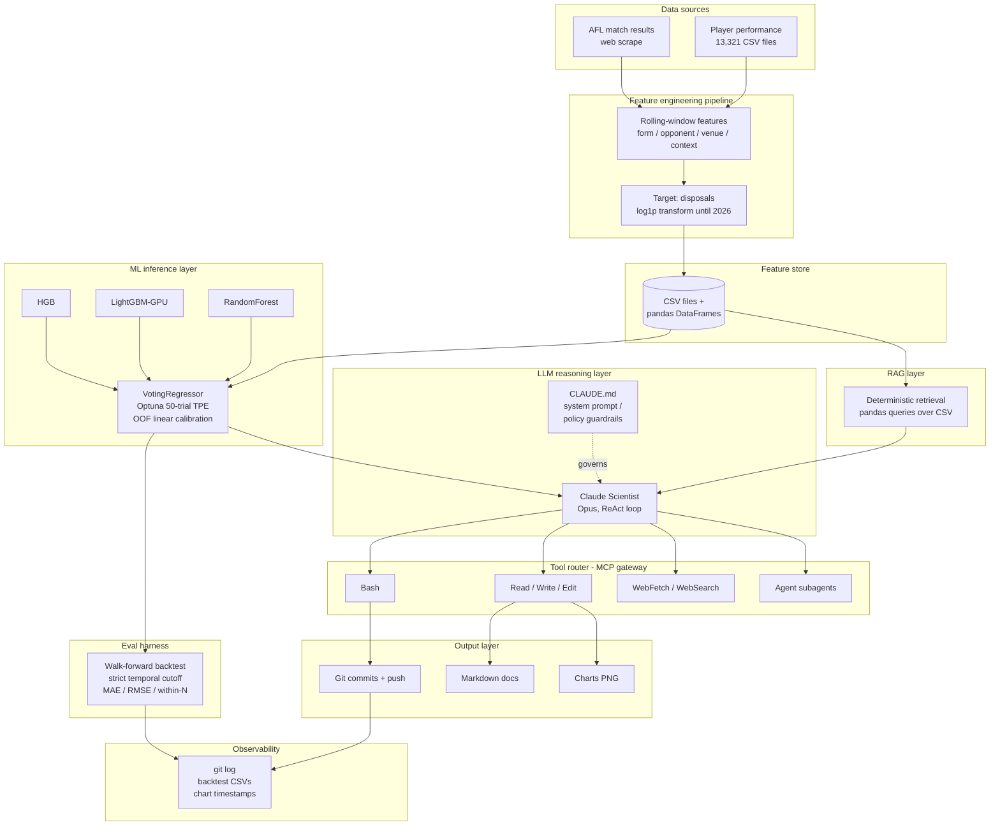

# SuperCoach-VIA - AI System Architecture

> [← Back to main README](../README.md)

> How a weekend football project maps to production-grade AI system design

SuperCoach-VIA is a working AI system that ingests 130 years of Australian Football League data, trains an ensemble disposal-prediction model, and lets a Claude-powered "Scientist" agent reason over the dataset, write its own analysis code, generate charts, and publish updated documentation back into the repo. The interesting part is not the football - it is that the system contains, in miniature, every layer you would expect in a production AI deployment: a feature pipeline, an ML inference layer with temporal validation, an LLM reasoning loop, a tool gateway, a deterministic RAG layer over structured data, an offline eval harness, and a lightweight audit trail. This document walks each layer, explains it in plain English, then says what an ML engineer would want to add for production. The aim is to use a small, legible system as a reference point for the bigger ones - and to be honest about the gaps a weekend project leaves open.

---

## Architecture overview

The diagram traces a single complete loop: AFL data is scraped, transformed into rolling-window features, persisted as CSVs, and consumed both by the ML ensemble (which produces calibrated disposal predictions) and by the Scientist agent (which queries the same store deterministically). The agent reasons under CLAUDE.md guardrails, calls tools through Claude Code's MCP gateway, and writes its outputs back to disk and git - closing the loop with the backtest harness as the system's sole automated quality gate.

---

## Component deep-dives

### 1. Data ingestion and feature engineering

**In plain English:** Every player who has ever played AFL has a CSV of their game-by-game stats. We scrape new games each week, then turn those raw stats into rolling averages and trends the model can learn from.

**The methodology:** The pipeline is a batch ETL. AFL Tables and AFL.com.au are scraped into a flat structure of 13,321 player performance CSVs covering 1897–present, plus per-season match files. Feature engineering (in `prediction.py`) constructs rolling-window features on a per-player basis: recent form (3-game, 5-game, season-to-date), opponent strength, venue effects, and contextual flags (home/away, day/night, season stage). The target is disposals per game. Coverage caveats are explicit in the data layer: tackles only from 1987, clearances and contested possessions from 1998, and the 2017 hit-out jump is a recording change rather than a real shift in play (see `agent-memory/Scientist/data_stat_coverage_eras.md`).

**For the ML practitioner:** Leakage prevention is the load-bearing piece. The `LeakProofPredictor` enforces a strict temporal cutoff - when predicting round N, only data strictly before round N is visible during feature construction and model fitting. Cross-validation uses GroupKFold keyed on player ID, so a single player never appears in both train and validation folds (this prevents the model memorising player-specific levels rather than learning generalisable signal). What would change at production scale: a streaming feature pipeline (Kafka/Flink) instead of weekly batch, a real feature store (Feast or Tecton) with point-in-time correctness guarantees rather than ad-hoc CSV reads, and feature drift monitoring to detect when scraping format changes silently corrupt a column.

---

### 2. ML inference layer

**In plain English:** Three different machine-learning models each predict next-round disposals, and we average their answers. Averaging different model types is more robust than any one of them alone.

**The methodology:** A `VotingRegressor` ensembles three diverse base learners - `HistGradientBoostingRegressor`, `LightGBMRegressor` (GPU-accelerated), and `RandomForestRegressor`. Hyperparameters are tuned via Optuna's TPE sampler over a 50-trial budget against MAE on a held-out temporal slice. A post-hoc out-of-fold linear calibration step is applied to fix top-end compression observed in the raw outputs (see `agent-memory/Scientist/prediction_top_end_compression.md` - log1p targets and L1 LightGBM loss were both contributing to a compressed prediction range and were removed).

**For the ML practitioner:** The validation design is walk-forward, not random k-fold. For each completed 2026 round, the model is retrained from scratch using only pre-round data, predictions are generated for that round, and metrics are computed against actuals. Random splits would inflate every metric by leaking future games into the training set - a common failure mode in sports prediction codebases. Known failure modes: top-10 player MAE sits around 10.8 disposals (≈ 2.6× the global MAE of 4.11), driven by a residual ceiling effect and the long right tail of elite-player game counts. Production gaps: no model registry (currently the model is rebuilt on demand and not versioned), no shadow deployment for new model variants, no automated distribution shift monitoring on either inputs or predicted outputs, and no rollback path if a regression slips into production.

---

### 3. LLM reasoning layer - the Scientist agent

**In plain English:** A Claude agent sits on top of the data and the model. You can ask it questions in plain English and it will write Python, run it, look at the results, write more Python, generate a chart, edit a markdown file, and commit the change - all without you touching a keyboard.

**The methodology:** The Scientist agent runs the ReAct pattern (Reason → Act → Observe → repeat). Claude Opus reads the user's task, decides which tool to invoke, executes it via the Claude Code harness, observes the result (stdout, file diff, error trace), and iterates until the task is closed out. Multi-turn reasoning is the default; the agent routinely writes throwaway Python scripts to inspect data before committing to an analysis approach. CLAUDE.md acts as the persistent system prompt - it encodes domain rules (data coverage caveats, ranking constants, stat era boundaries), behavioural constraints (no emojis, absolute paths only, no summary `.md` files), and project workflow (push to main after major changes, commit with co-author tag). Subagent spawning lets long tasks fork specialised workers (e.g. one subagent rebuilds Hall of Fame docs while another runs the next-round prediction).

**For the ML practitioner:** The substrate is Anthropic's tool-use API - each tool is registered with a JSON schema describing its inputs and outputs, and the model is trained to emit structured tool calls when appropriate. The harness routes those calls to local executors. Production gaps are real: Opus latency is 3–10 seconds per turn and a non-trivial task chains 50+ turns, costs scale linearly with token volume and there is no per-task budget enforcement, there is no fallback to a smaller cheaper model when the task is simple, and there is no formal token accounting per session. A production deployment would tier the agent (Haiku for trivial retrieval, Sonnet for normal tasks, Opus only for the hardest reasoning) and enforce hard token ceilings before invocation rather than after.

---

### 4. RAG layer - deterministic retrieval over structured data

**In plain English:** When the agent needs a fact like "Sam Berry's average tackles in 2026," it runs a pandas filter over a CSV. There is no fancy semantic search, and there shouldn't be - for clean structured numbers, plain queries are exactly right.

**The methodology:** Retrieval is fully deterministic: pandas reads the relevant CSV, filters by player ID and season, computes the requested aggregate, and returns the number. No embedding model, no vector store, no nearest-neighbour search. This is the correct architecture for the data shape - semantic similarity adds noise, not signal, when the user query maps directly to a structured filter. Vector search is great for "find me documents about clearance work in wet-weather games"; it is strictly worse than `df.query(...)` for "give me Marcus Bontempelli's disposal average in round 3 home games."

**For the ML practitioner:** Vector search becomes appropriate when unstructured text enters the corpus - match commentary, scouting reports, post-game interviews, injury notes. The production upgrade path is hybrid retrieval: pgvector or Qdrant for the unstructured side, the existing pandas/CSV layer for structured queries, and a routing layer that decides which to hit based on query parse. Chunking strategy for added commentary would be paragraph-level with a 1–2 sentence overlap, with metadata filters on round, team, and player ID so the retriever can scope to relevant context before semantic ranking. The structured layer should remain authoritative for any numeric claim.

---

### 5. Tool router and MCP gateway

**In plain English:** MCP is a standard way for AI models to talk to tools - a USB-C port for AI. Instead of every tool needing its own bespoke integration, MCP defines one protocol the model uses to discover and call any registered tool.

**The methodology:** SuperCoach-VIA uses Claude Code's built-in MCP implementation. The registered tool surface includes Bash (shell command execution), Read / Write / Edit (filesystem), WebFetch and WebSearch (HTTP and search), and Agent (subagent spawning). Tool selection is model-driven: Claude inspects the task, the available tool schemas, and the conversation state, then emits a structured tool call which the harness dispatches. There is no hand-coded routing logic - the model is the router. Tool definitions are JSON-schema documents declaring inputs, outputs, and behavioural notes that condition selection.

**For the ML practitioner:** The MCP specification (Anthropic, 2024) defines a JSON-RPC transport with a server/client model - tools live in MCP servers, and any MCP-aware client can discover and invoke them. Production gaps in this deployment: no sandboxing on Bash (commands execute directly against the host filesystem with the user's privileges), no rate limiting on tool invocation, no input sanitisation on shell arguments, and the spec itself is still pre-1.0 with breaking changes possible. A production hardening path: route every Bash invocation through a gVisor or Firecracker microVM sandbox with a read-only mount of the data layer and a tightly-scoped write area; validate every tool call's inputs and outputs against the registered schemas before dispatch; emit a structured audit record (tool name, arguments hash, caller agent ID, timestamp, latency, exit status) on every call; pin the MCP spec version and gate version upgrades behind regression tests.

---

### 6. Eval harness

**In plain English:** Before publishing a number, the system pretends it's the past. It re-trains the model using only data that would have been available at the time, predicts the round it doesn't yet know the result for, then compares against what actually happened. That gives an honest read on how good the predictions are.

**The methodology:** A walk-forward backtest covers all completed 2026 rounds. For round N, the pipeline trains exclusively on data from before round N (strict temporal cutoff enforced inside `LeakProofPredictor`), generates predictions for every player who played in round N, and joins to actuals. Reported metrics: MAE, RMSE, within-5, within-10, signed bias, and a top-10 MAE slice that surfaces the most-elevated-profile failure mode. Backtest output is persisted as CSV under `data/prediction/backtest/` so each run leaves a permanent record.

**For the ML practitioner:** The eval covers ML model outputs only - LLM output quality is currently measured by post-hoc human review (~70–75% factual accuracy on the first pass of Hall of Fame documents, raised to ~99% after a systematic correction process). Production gap: automated LLM evaluation. RAGAS would give faithfulness and context-relevance scores on every retrieval-augmented response; DeepEval would flag hallucinations against a reference corpus. Online eval is also missing - once a real round is played, the system does not automatically score its earlier predictions against actuals and alert on MAE regression. Adding an online eval loop (cron job that ingests results, joins to predictions, computes metrics, emits to Langfuse/Phoenix) would close the most important production blind spot.

---

### 7. Observability

**In plain English:** When something looks wrong, you want to know who or what produced it, when, and based on which version of the system. Right now we lean on git for that.

**The methodology:** Git history serves as a lightweight audit trail - every doc change is a commit with author, timestamp, diff, and message. Backtest CSVs persist model performance over time, so a regression is visible by diffing two runs. Chart filenames are timestamped, so generation history is recoverable. CLAUDE.md is version-controlled, so the agent's policy state at any past commit is reconstructable.

**For the ML practitioner:** What's missing is structured LLM trace logging - for every agent turn, you want the full prompt (including system prompt and tool definitions), the model's response, the tool calls emitted, latency per turn, token counts, and dollar cost. Without that, debugging "why did the agent do X" is a forensic exercise on git diffs. You also want model performance dashboards (MAE by round, by player tier, by team, drift charts) and alerting on MAE regression beyond a threshold. A solid open-source stack: OpenTelemetry as the trace collection plane (it has wide language support and a stable spec), Langfuse as the LLM-specific trace store and dashboard layer (self-hostable, MIT licensed). For on-prem with stronger compliance posture, Arize Phoenix is the leading open-weight equivalent.

---

## Eval results

| Metric | Value | Notes |
|--------|-------|-------|
| Prediction MAE | 4.11 disposals | Weighted across 8 rounds, 2,879 player-rounds |
| RMSE | 5.21 | |
| Within 5 disposals | 68.5% | |
| Within 10 disposals | 94.5% | |
| Bias | −0.06 | Near-zero - calibration working |
| Top-10 player MAE | ~10.8 | Top-end compression - known failure mode |
| Round 1 MAE | 4.89 | Elevated - no within-season rolling features |
| LLM factual accuracy | ~70–75% pre-correction → ~99% post | Measured by external review of Hall of Fame docs; systematic correction process in place |

A 4.11-disposal MAE means the typical prediction misses by about four disposals, which on a per-player range of 0–45 is roughly 9% of the active range - usable signal, not a solved problem. The 94.5% within-10 figure says coarse predictions are reliable; the 68.5% within-5 figure says fine predictions are not. The top-10 player MAE is the headline failure: elite players are systematically harder to predict because their week-to-week ceilings move on context (tag absorption, opponent matchups, role rotations) that the current feature set captures only partially. Roadmap targets: cut top-10 MAE below 8.0 via an opponent-tag feature and a within-season rolling feature for round 1, raise within-5 above 75% via better calibration on the upper tail, and add an automated online eval loop so post-round actuals score the predictions without manual triggering.

---

## What I'd do differently in a sovereign deployment

"Sovereign AI" means a deployment under the operator's full control - on-premises hardware or a VPC-isolated cloud tenancy, with data residency guarantees, no information leaving the relevant jurisdiction, and (for sensitive use cases) air-gapped or semi-air-gapped network postures. Australia's AI Ethics Framework and the broader push toward on-shore AI capability make this a live concern: government, defence, regulated industries, and any system handling protected data increasingly need an AI architecture that does not depend on hyperscaler API endpoints. The seven changes below are what I would actually build if SuperCoach-VIA had to run inside that envelope.

### 1. Replace API calls with self-hosted models

Move the agent from the Anthropic API to vLLM serving an open-weight model - Llama 3.1 70B Instruct or Mistral Large would be the realistic candidates, deployed on 2× H100 or 4× A100 hardware. Trade-offs are honest: latency per turn drops (no network hop, no shared queue) but per-token throughput on equivalent hardware is lower than Anthropic's optimised serving stack; cost flips from per-token to per-GPU-hour, which is cheaper at high utilisation and more expensive at low; capability gap on hard reasoning tasks is real - a 70B open-weight model is roughly Sonnet-equivalent on most benchmarks and meaningfully behind Opus on the long, complex reasoning chains the Scientist agent runs at its hardest. The right call: tier the deployment, with self-hosted Llama 70B handling 90% of routine work and an isolated, audited API path for tasks that genuinely need frontier capability.

### 2. Proper feature store and data lineage

Replace the ad-hoc CSV layer with Feast (open-source, Kubernetes-native) for online and offline feature serving with point-in-time correctness, and dbt for declarative transformation lineage so every feature has a graph from raw source through every transformation. Append-only audit logs on the feature store so any historical query about "what was this player's rolling-3 disposal average as of round 5" returns a deterministic answer regardless of when it is run. In regulated environments this matters because model decisions have to be reproducible months later for audit, and ad-hoc CSVs fail that test the moment someone updates a file in place.

### 3. Extend the eval harness to LLM outputs

Add RAGAS for faithfulness (does the answer reflect retrieved evidence) and context relevance (are the retrieved chunks actually about the question) on every agent response that touches structured retrieval. Add DeepEval for hallucination detection against a curated reference corpus of known-true claims about AFL history and rules. Wire in continuous online eval: a scheduled job that, after each completed round, joins predictions to actuals, computes MAE / RMSE / bias / top-10 MAE, persists the result, and triggers an alert if any metric regresses beyond a configured threshold. The same job should re-run a sample of recent agent responses through RAGAS and emit hallucination-rate trend.

### 4. Harden the MCP gateway

Every Bash invocation routes through a gVisor or Firecracker microVM sandbox - read-only mount of the data layer, write access only to a scoped scratch area, no network egress unless the tool definition explicitly grants it. Input/output schema validation on every tool call, with the schema versioned and pinned. A structured audit log (JSON, one record per call) capturing tool name, agent session ID, timestamp, input hash, output hash, exit status, and latency, written to an append-only store. Per-session rate limits to bound the worst-case behaviour of a runaway agent. Pin the MCP spec version and gate upgrades behind a regression suite.

### 5. Full observability stack

Instrument every LLM call with OpenTelemetry - trace ID, span ID, prompt template version, retrieved context, tool calls emitted, latency, token counts, model version, and (in dev) the full prompt and response. Self-host Langfuse as the trace store and dashboarding layer, with retention policies aligned to the data classification (e.g. 90 days for unclassified, 7 years for audit-relevant). Alerting on three conditions: prediction MAE regression more than 10% week-on-week, LLM hallucination rate above 2% on the rolling RAGAS sample, and tool call failure rate above 5% in any 1-hour window.

### 6. Human-in-the-loop gates

Confidence thresholds on agent outputs - when the model's self-reported confidence (or an external classifier's hallucination score) falls below a configured floor, the output is held in a review queue rather than published. A formal approval workflow before any document publishes to a user-facing surface, with the reviewer's identity and approval timestamp captured in the audit log. Chain-of-custody: every published document carries metadata linking it to the data snapshot, model version, agent session ID, and reviewer who signed off, so any future investigation can reconstruct the full provenance from a single document.

### 7. Multi-agent orchestration

Replace the single-agent, single-process model with LangGraph for stateful multi-agent workflows - defined roles (data-scrape agent, training agent, prediction agent, writer agent, reviewer agent), explicit handoffs, and persistent state across the workflow. Run the orchestration on Temporal.io for durable execution: retry semantics, exactly-once guarantees, workflow versioning, and the ability to replay a failed workflow from any prior step. Role separation matters for least-privilege - the writer agent should not be able to retrain models, the training agent should not be able to publish documents, and no single agent should hold credentials for all of data, model, and output stages.

---

## What this project already gets right

- Temporal leakage prevention in the ML pipeline - the `LeakProofPredictor` enforces a strict round-by-round cutoff and uses GroupKFold by player; this is genuinely rigorous and would survive a production review.
- CLAUDE.md as a versioned system prompt and policy document - agent behaviour is in source control, diffable, reviewable, and auditable rather than living in a cloud console.
- Git as an immutable audit trail - every doc change is attributable to an author (human or agent co-author), with timestamp, diff, and message.
- Backtest-first evaluation before any output is published - predictions ship with their MAE, RMSE, and within-N coverage already measured on out-of-sample data, not on the same data the model was trained on.
- Explicit data coverage caveats - pre-1965 incomplete records, tackles only from 1987, the 2017 hit-out recording change; these are documented in agent memory and surfaced in any analysis that touches the affected windows, so the agent does not fabricate confidence in numbers it cannot defend.

---

## Further reading

- [Anthropic MCP specification](https://modelcontextprotocol.io)
- [RAGAS - RAG evaluation framework](https://ragas.io)
- [Langfuse - open-source LLM observability](https://langfuse.com)
- [LangGraph - stateful multi-agent orchestration](https://langchain-ai.github.io/langgraph/)
- [vLLM - high-throughput LLM serving](https://vllm.ai)
- [Temporal - durable execution for agent workflows](https://temporal.io)
- [Australia's AI Ethics Framework](https://www.industry.gov.au/publications/australias-artificial-intelligence-ethics-framework)
