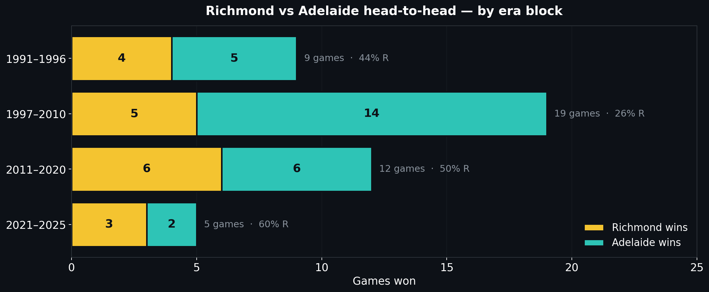
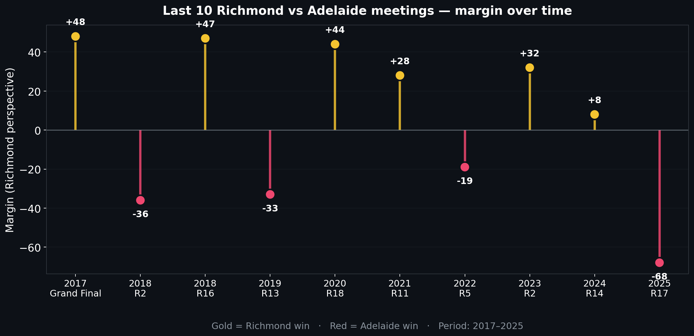
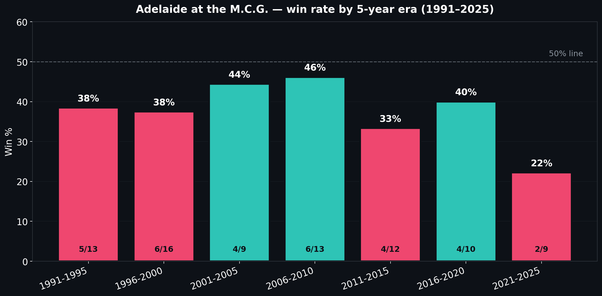

# Richmond vs Adelaide — Round 9 2026: Head-to-head history

> [← Back to main brief](richmond-vs-adelaide-round-9-2026.md) | [← Coaches Strategy Corner](README.md)
>
> **Status: pre-match.** The Round 9 fixture (10 May 2026, M.C.G.) is upcoming — not yet played. All head-to-head numbers below cover completed historical meetings only.

The full 35-year ledger between Richmond and Adelaide, with the venue, era, and recent-form patterns separated out. All numbers reproduced from `data/matches/matches_*.csv` **[data]**.

---

## All-time record

**45 matches since 1991. Adelaide leads 27–18, no draws.**

| Metric | Richmond | Adelaide |
|---|---:|---:|
| Wins | 18 | 27 |
| Average score | 82.2 | 102.8 |
| Average margin | –20.5 | +20.5 |

Source: 45 matches in `data/matches/matches_1991.csv` through `data/matches/matches_2025.csv` containing both clubs **[data]**.

The all-time number is heavily era-skewed. The lead is built almost entirely in the **1997–2010 era**, where Richmond went 5–14. The 1990s (R4–A5), 2010s (R6–A6), and 2020s (R3–A2) are all even or in Richmond's favour **[data]**.

Richmond's first H2H win came in **1994 R15** at Football Park (90–83). From 1994 onwards: R18–A22.

### Era breakdown

| Era | Games | Richmond W | Adelaide W | Avg margin (Rich pov) |
|---|:-:|:-:|:-:|---:|
| 1991–1996 | 9 | 4 | 5 | –34.6 **[data]** |
| 1997–2010 | 19 | 5 | 14 | –29.8 **[data]** |
| 2011–2020 | 12 | 6 | 6 | –2.2 **[data]** |
| 2021–2025 | 5 | 3 | 2 | –3.8 **[data]** |

The 1997–2010 block is where Adelaide's ledger advantage came from. The 2021–2025 era — broadly the modern Adelaide list — is R3–A2 in Richmond's favour. The 2025 R17 thumping (Richmond 54 – Adelaide 122) is the outlier that drags the period margin into negative.

---

## MCG record specifically

**13 matches at the MCG. Richmond leads 7–6.** Richmond average 90.4; Adelaide average 101.7 **[data]**.

| MCG meeting | Year | Round | Score | Result |
|---|---|---|---|---|
| Game 1 | 1991 | R13 | 47–85 | L (–38) |
| Game 2 | 1992 | R20 | 53–163 | L (–110) |
| Game 3 | 1993 | R1 | 84–178 | L (–94) |
| Game 4 | 1995 | R7 | 72–58 | **W (+14)** |
| Game 5 | 1996 | R12 | 128–82 | **W (+46)** |
| Game 6 | 1997 | R2 | 128–100 | **W (+28)** |
| Game 7 | 2001 | R8 | 92–120 | L (–28) |
| Game 8 | 2008 | R11 | 96–146 | L (–50) |
| Game 9 | 2010 | R18 | 100–80 | **W (+20)** |
| Game 10 | 2013 | R12 | 110–72 | **W (+38)** |
| Game 11 | 2017 | **Grand Final** | 108–60 | **W (+48)** |
| Game 12 | 2018 | R16 | 103–56 | **W (+47)** |
| Game 13 | 2025 | R17 | 54–122 | L (–68) |

**Richmond MCG wins** average margin: **+34.4** **[data]**.
**Adelaide MCG wins** average margin: **+64.7** **[data]**.

The asymmetry is striking: Richmond's MCG wins are workmanlike — the +34.4 average is built across 1995, 1996, 1997, 2010, 2013, 2017, 2018. Adelaide's MCG wins are blowouts — three of the six are by 50+ (1992 –110, 1993 –94, 2008 –50, 2025 –68). Adelaide either flattens Richmond at the MCG or doesn't win the game.

**The 2017 game listed above is the AFL Grand Final** — Richmond's 48-point premiership win, not a preliminary final. That game is the historical high point of this fixture.

**Strip the early Crows era (1991–1993, three Adelaide wins by 81 average margin) and the MCG record from 1995 onwards is Richmond 7 – Adelaide 3** **[data]**.

The 2025 R17 result is the most recent MCG reference and the freshest data Adelaide will have on Richmond's defensive structure.

---

## Last 10 meetings — the modern picture

## Last 5 meetings

| # | Year | Round | Venue | Score | Result | Pattern |
|---|---|---|---|---|---|---|
| 5 ago | 2021 | R11 | Sydney Showground | 111–83 | **W +28** | Richmond's premiership-era machine still rolling |
| 4 ago | 2022 | R5 | Adelaide Oval | 82–101 | L –19 | Adelaide's home advantage manifest |
| 3 ago | 2023 | R2 | Adelaide Oval | 108–76 | **W +32** | Richmond's 100+ point game on the road |
| 2 ago | 2024 | R14 | Adelaide Oval | 79–71 | **W +8** | Tight, low-scoring, Richmond's defensive plan held |
| 1 ago | 2025 | R17 | M.C.G. | **54–122** | **L –68** | The cautionary tale |

**Three Richmond wins in the last 5.** All three away from the MCG (Sydney Showground, Adelaide Oval, Adelaide Oval).

The 2025 R17 thumping is the only data point at the MCG and is a 68-point loss. Adelaide that day produced 122 points on the back of a contested-ball field day from the same midfield core that is intact in 2026 (Berry, Dawson, Laird).

The Round 17 vision should anchor the Tuesday review. What it shows:

- Adelaide's contested-ball game is most dangerous when Richmond's midfield is out-pressured. In 2025 Round 17, Richmond's tackle count was reportedly under 50 — the same area where Richmond is currently 16/18 in 2026.
- The Richmond response in 2025 was to chase the game with style — long bombs forward, which Adelaide rebounded into transition goals. Adelaide's rebound-50 rank is 2/18 in 2026 (41.8/g) — the same pattern is structurally in place.
- The 2025 thumping was not a one-off; it was Adelaide's identity meeting a Richmond side that didn't have the contested-ball volume to slow it. The same identity meets a Richmond 2026 side at the same MCG. Read the upcoming Round 9 game as the 2025 R17 problem with one structural fix available — the ruck.

---

## Adelaide at the MCG: the persistent travel pattern

Across all 83 MCG appearances since their 1991 entry **[data]**:

- **Record**: 32W–50L–1D (38.6%)
- **Average score**: 90.7 for, 95.3 against (–4.5 margin)
- **Last 10 MCG games**: 3W–7L (30%)
- **Win rate has been below 50% in every 5-year era**, and is at a 35-year low (22%) in 2021–2025

The recent 9-game MCG sample (2022–2026 R2):

| Year | Round | Opponent | Score | Result |
|---|---|---|---|---|
| 2022 | R2 | Collingwood | 58–100 | L –42 |
| 2023 | R15 | Collingwood | 80–82 | L –2 |
| 2023 | R19 | Melbourne | 93–97 | L –4 |
| 2024 | R11 | Collingwood | 74–78 | L –4 |
| 2024 | R13 | Hawthorn | 80–107 | L –27 |
| 2025 | R3 | Essendon | 161–100 | **W +61** |
| 2025 | R11 | Collingwood | 68–78 | L –10 |
| 2025 | R17 | Richmond | 122–54 | **W +68** |
| 2026 | R2 | Collingwood | 93–79 | **W +14** |

3W–6L across 9 games. Two of the three wins are blowouts (61, 68); the recent Round 2 win was a respectable +14. Pattern: Adelaide either has a great day at the MCG or loses by single digits in a tight game — they rarely have a comfortable, ground-out road victory at the venue.

A close game at the MCG favours Richmond historically.

---

## Adelaide home vs road (last 5 years, 2022–2026)

From the same data:

| Split | Games | Win % | Avg margin |
|---|:-:|:-:|---:|
| Adelaide Oval (home) | 58 | 58.6% | +12.8 |
| Anywhere else | 43 | 34.9% | –3.4 |

Across 35 years (1991+):

| Split | Games | Win % | Avg margin |
|---|:-:|:-:|---:|
| Home (Adelaide Oval / Football Park) | 433 | 62.4% | +16.0 |
| Road | 378 | 39.4% | –7.0 |

Across the entire SA-club era, Adelaide are demonstrably a home-state club. The road-form gap is ~23 percentage points and has been consistent for three decades. The 2026 sample so far supports the pattern: completed 2026 home games — **3W–2L** (all at Adelaide Oval, R3 vs WB L, R5 vs Fremantle L, R6 vs Carlton W +28, R7 vs St Kilda W +1, R9 vs Port +1); completed 2026 road games — **1W–2L** (R2 MCG vs Collingwood W +14, R4 Kardinia Park vs Geelong L –8, R8 Gabba vs Brisbane L –52) **[data]**.

The upcoming Round 9 fixture at the MCG places Adelaide on the road again after their R9 home win vs Port Adelaide; their most recent road trip (R8) was the Gabba beating by Brisbane. Richmond plays its second consecutive Melbourne game off the back of a road win at Optus Stadium.

---

## Caveats

- **Round numbers in finals**: finals games carry text labels (e.g. "Grand Final") in the source data. Numeric round filters are applied where ordering is needed; finals games are labelled with the actual round name (e.g. "Grand Final") in tables.
- **Pre-1991 absent by definition**: Adelaide entered the AFL in 1991, so the 130-year match dataset only contains H2H from 1991 onwards.
- **MCG and Adelaide Oval venue strings**: filtered with the strings `M.C.G.` and `Adelaide Oval | Football Park | AAMI` (the latter for pre-2014 era). All matches verified against the venue field in the source CSVs.
- **No advanced stats for early matches**: pre-2017 matches in this dataset are score-and-quarter-by-quarter only at the team level. The current-form analysis in the main brief uses only 2026 data, where the player-level box scores are complete.
