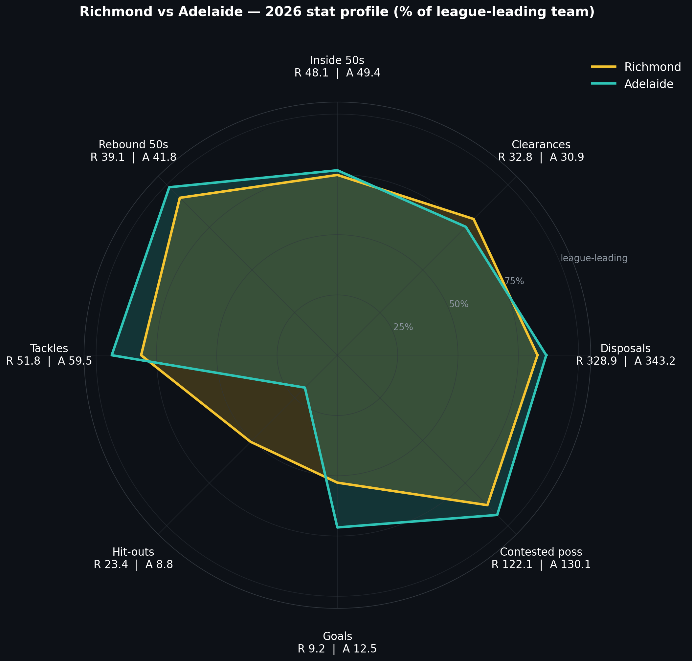
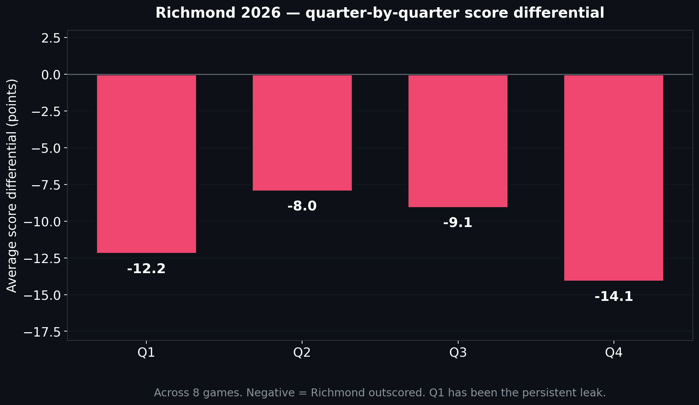
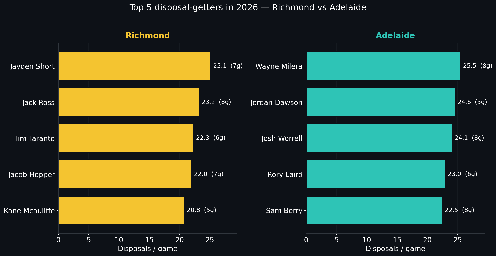

# Richmond vs Adelaide — Round 9, 10 May 2026, 3:15pm, M.C.G.

> [← Back to Coaches Strategy Corner](README.md) | [← AFL insights](../afl-insights.md)
>
> Companion docs: [Executive summary](richmond-vs-adelaide-round-9-2026-executive-summary.md) · [Player-by-player matchup guide](richmond-vs-adelaide-round-9-2026-player-matchups.md) · [Head-to-head history](richmond-vs-adelaide-round-9-2026-head-to-head-history.md)
>
> **Status: pre-match brief.** Match scheduled for 10 May 2026, 3:15pm at the M.C.G. — not yet played. All form numbers drawn from completed games through Round 9 2026.

---

## Executive summary

**This game is decided at the centre bounce, in the first quarter, and through Sam Berry.**

1. **Make them play in Melbourne.** Adelaide are 62.4% at home and 39.4% on the road across 433 home and 378 away games since 1991 **[data]**. At the MCG specifically: 32W–50L–1D — 38.6% across 83 games and just 30% from their last 10 **[data]**. Their MCG win rate has been below 50% in every 5-year era and sits at a 35-year low (22%) in 2021–25 **[data]**.
2. **Win the contested-ball war by accepting their volume and beating their pressure.** Adelaide rank 4/18 for tackles (59.5/g) and 7/18 for contested possessions (130.1/g) **[data]**. The counter is *clean handball release under pressure* — moving the ball one tackle ahead, not playing keepings-off. Richmond's contested-ball share (CP/disposal = 0.371) already exceeds the league average of 0.350 **[data]**. The win-able battle is at the second receiver.
3. **Attack the Adelaide ruck.** Adelaide are 18/18 for hit-outs (8.8/g — a 24-hit-out gap to the league average of 32.8) **[data]**. Their no-recognised-ruck split runs through Riley Thilthorpe (1.2 HO/g) and Finnbar Maley (5.6 HO/g) **[data]**. Samson Ryan averaged 16.3 HO/g in his three 2026 games **[data]**. If Ryan plays, the structural mismatch is worth 5–8 stoppage clearances. League-wide goals/g: Richmond 9.2, Adelaide 12.5, league avg 13.3 **[data]**. Adelaide's territorial defence is real (rebound-50s 2/18) — the lever is *quality of entry*, not volume.

The most recent Adelaide tape is the Round 8 Brisbane game at the Gabba: Brisbane 19.13 (127), Adelaide 11.9 (75), CPs 111 conceded **[data]**. That game is Adelaide's interstate floor. The most recent Richmond tape is the Round 9 win at Optus Stadium against West Coast (15.9–13.10, 99–88) — 141 contested possessions, season high **[data]**.

---

## Adelaide — who they are in 2026

**Mid-table, contested-ball, structurally short at the ruck.** Through Round 9 they are 4–4 with a –3.0 average margin **[data]**.

The 2021–2025 profile baselined them as contested-ball pressure first (rank 1) with a structurally low marking floor (rank 18) **[historical record]**. The 2026 numbers track: tackle-heavy, contested-ball oriented, vulnerable forward of centre, dangerous on the rebound counter.

The new wrinkle in 2026 is the ruck. Adelaide have rotated **five players** through ruck duties — Finnbar Maley (5 games, 28 HO total), Toby Murray (3g, 16 HO), Reilly O'Brien (just R5, 15 HO), Riley Thilthorpe pinch-hits (10 HO across the year), and even Sam Berry has touched a ball-up **[data]**. The rest of the spine is recognisable — Wayne Milera, Jordan Dawson, Rory Laird, Sam Berry, Josh Worrell — all top-6 disposal-getters in the squad **[data]**.

### Stat profile vs league average

| Metric | Adelaide /g | League avg /g | Adelaide rank | Read |
|---|---:|---:|:-:|---|
| Disposals | 343.2 | 367.3 | 16/18 | Below — they don't play possession football |
| Goals | 12.5 | 13.3 | 12/18 | Below average scoring |
| Marks | 85.5 | 94.0 | 13/18 | Structural marking floor |
| Tackles | **59.5** | 56.1 | **4/18** | The game-style anchor |
| Hit-outs | **8.8** | 32.8 | **18/18** | The exploitable hole |
| Clearances | 30.9 | 34.8 | 16/18 | Held back by the ruck deficit |
| Inside-50s | 49.4 | 53.4 | 15/18 | Light territory volume |
| Rebound-50s | **41.8** | 39.4 | **2/18** | Strength — the counter-punch |
| Contested poss | 130.1 | 128.5 | 7/18 | Above-average ground-ball |
| Contested marks | 8.0 | 8.9 | 13/18 | Below-average aerial contest |
| Marks inside 50 | 11.0 | 12.5 | 14/18 | Forward connection is mediocre |
| One-percenters | 45.8 | 42.4 | 6/18 | Real defensive desperation |
| Clangers | 55.8 | 57.2 | 12/18 | Slightly cleaner than league |

Source: aggregated from `data/player_data/*_performance_details.csv`, 2026 season, summed by team-game then averaged across the 8 completed games **[data]**.

The story this table tells: a low-volume, high-pressure side that defends with rebound and tackle, doesn't score heavily, gets dominated at the ruck contest, and is one Sam Berry shoulder strain from a structural problem.

### Their best players and how they play

Detailed individual profiles in the [player matchup guide](richmond-vs-adelaide-round-9-2026-player-matchups.md). Headlines:

- **Jordan Dawson (C)** — 5 games, **24.6 disp/g, CV 0.11** (most consistent ball-winner in either squad), trend +0.95 disp/round **[data]**. Captain, two-way runner, scoreboard threat (6 goals in 5 games, 1.20 g/g).
- **Wayne Milera** — 8 games, **25.5 disp/g**, primarily a defensive runner, 5.8 marks/g — Adelaide's connector from defence. CV 0.21. Doesn't go to contest (CP 6.6/g).
- **Sam Berry** — 8 games, **8.0 tackles/g and 13.4 CPs/g** — leads Adelaide on both **[data]**. The engine. Removed from contest, the team's pressure profile collapses.
- **Josh Worrell** — 8 games, 24.1 disp/g, 6.4 marks/g — kicks rebound from defensive 50. Their #1 intercept-and-launch player.
- **Rory Laird** — 6 games (back from a layoff), 23.0 disp/g, 6.0 m/g — most experienced uncontested-mark distributor.
- **Riley Thilthorpe** — 8 games, **13 goals (squad-high), 1.62 g/g**, 5.4 marks/g, 6.4 CPs/g — *and* 1.2 hit-outs/g pinch-hitting in the ruck **[data]**. Tall key forward who occasionally rucks.
- **Taylor Walker** — 7 games, **11 goals, 1.57 g/g**, max 5 goals in a game (R7 vs St Kilda) **[data]**. Veteran spearhead; trend –2.10 disp/round.
- **Josh Rachele** — 8 games, **12 goals, 1.50 g/g**, 20.8 disp/g, kicks scoreboard goals from half-forward.
- **Izak Rankine** — 7 games, 17.3 disp/g, 8.4 CPs/g, **trend +1.82 disp/round** — heating up.
- **Ben Keays** — 8 games, **10 goals, 1.25 g/g**, 3.1 tackles/g — small-forward pressure-and-finish.

Two things to internalise: their best ball-winner (Berry) is also their best tackler. Their best forward (Thilthorpe) is also their second ruck. Adelaide's list is multi-tasking on the resources of a 4–4 team.

### Their vulnerabilities — where they can be attacked

**Adelaide's forward arc, ruck contest, and away-from-home record are the three pressure points.**

1. **Hit-outs at 8.8/g (18/18, –24 vs league avg)** **[data]**. No recognised ruck. The Round 8 vs Brisbane game showed it (8 hit-outs, lost 75–127).
2. **Inside-50 conversion mid-pack (0.253 goals/i50)** **[data]**. They get the ball forward (49.4 i50/g) but only score from a quarter of those entries. Defensive setups that break the first pass survive.
3. **Marks (85.5/g, 13/18)** and **marks inside 50 (11.0, 14/18)** **[data]**. They struggle to retain in marking contests. An average intercept side squeezes them.
4. **Travel form**: 39.4% road win rate, –7.0 average margin away vs +16.0 home **[data]**. The interstate gap is real and persistent across 35 years.
5. **MCG specifically**: 32W–50L–1D all-time (-4.5 average margin from Adelaide pov), 30% over the last 10 with last-10 average margin +1.3 (skewed positive by two outliers — Essendon 2025 R3 +61 and Richmond 2025 R17 +68) **[data]**. Strip those two and the MCG record over the last decade is **1W–7L** **[data]**.
6. **Round 8 at the Gabba showed the floor**: contested possessions 111 (a season low), inside-50s 39 (lowest of the year), beaten by 52 **[data]**. They were bullied. Replicable by anyone with the engine room.
7. **No depth at key forward beyond Thilthorpe and Walker**. Goals/g — Thilthorpe 1.62, Walker 1.57, Rachele 1.50, Keays 1.25. Top-heavy. Lock down two and they are scoreboard-vulnerable.

---

## Richmond — your strengths and the platform to win

### Your 2026 identity

**Young midfield carrying a side that's started to find a contested-ball floor.** Through Round 9, Richmond are 1–7 with a –43.5 average margin **[data]**. The losses are heavy (worst margin –75 vs North Melbourne, R7) but the most recent game at Optus Stadium snapped a seven-game losing run (Richmond 15.9–West Coast 13.10) and produced the season's contested-possession peak (141 CPs) **[data]**.

The 5-year identity (2021–2025): defensive-rebound posture, low tackle pressure (18/18 historically), bottom-four for clangers and frees against, mid-pack for inside-50 conversion (7th), top-three for rebound-50s **[historical record]**. The 2026 version is harder-edged on the contest (CP rank 15 but CP/disposal share 0.371 vs league 0.350 **[data]**) and softer on the perimeter (disposals last in the league).

### Stat profile vs league average

| Metric | Richmond /g | League avg /g | Richmond rank | Adelaide rank | Direct comparison |
|---|---:|---:|:-:|:-:|---|
| Disposals | 328.9 | 367.3 | 18/18 | 16/18 | Both bottom — volume is not where this game is decided |
| Goals | 9.2 | 13.3 | 18/18 | 12/18 | Adelaide +3.3/g — close the gap with quality entries |
| Marks | 82.0 | 94.0 | 18/18 | 13/18 | Adelaide +3.5 — but mid-pack themselves |
| Tackles | 51.8 | 56.1 | 16/18 | 4/18 | **Critical gap. They will out-pressure unless tempo changes.** |
| Hit-outs | 23.4 | 32.8 | 17/18 | **18/18** | **The single battleground Richmond can win.** |
| Clearances | 32.8 | 34.8 | 15/18 | 16/18 | Effectively neutral — winnable with ruck dominance |
| Inside-50s | 48.1 | 53.4 | 17/18 | 15/18 | Slight Adelaide edge (+1.3) — this game is not about volume |
| Rebound-50s | 39.1 | 39.4 | 11/18 | 2/18 | **Adelaide own this. Don't bomb long without targets.** |
| Contested poss | 122.1 | 128.5 | 15/18 | 7/18 | Adelaide +8/g — must be neutralised |
| Contested marks | 9.4 | 8.9 | **6/18** | 13/18 | **Richmond strength. Use it.** |
| Marks inside 50 | 10.9 | 12.5 | 15/18 | 14/18 | Both struggle |
| One-percenters | 40.4 | 42.4 | 12/18 | 6/18 | Adelaide more desperate behind the ball |
| Clangers | 59.2 | 57.2 | **4/18** | 12/18 | **Richmond is leaking turnovers — fix this or lose** |

Source: same construction as the Adelaide table **[data]**.

Two read-outs that matter: (1) Richmond ranks 6/18 for contested marks despite being last for marks overall — meaning Richmond's tall forwards are *winning their contests when the ball gets there*; the problem is getting it there cleanly. (2) Richmond ranks 4/18 *worst* for clangers — turnover rate is the bleeding artery.

### Quarter-by-quarter pattern (the leak)

**Every quarter is a deficit. Q1 and Q4 are the worst.**

| Quarter | Richmond /g | Opposition /g | Diff |
|---|---:|---:|---:|
| Q1 | 13.2 | 25.5 | **–12.2** |
| Q2 | 22.4 | 30.4 | –8.0 |
| Q3 | 15.4 | 24.5 | –9.1 |
| Q4 | 14.4 | 28.5 | **–14.1** |

Per-quarter (not cumulative). Source: 2026 match files **[data]**.

The first 12 minutes have killed every game. Adelaide's Q1 average is 18.5 for and 25.1 against. Richmond have lost the first quarter by 12.2 points on average. **Q1 is the win condition.**

### Your best performers — Richmond top-9 form

| Player | Gms | Disp/g | Gls/g | Tk/g | Cl/g | CP/g | CV | Trend |
|---|:-:|---:|---:|---:|---:|---:|---:|---:|
| Jayden Short | 7 | 25.1 | 0.14 | 1.1 | 0.7 | 4.3 | 0.18 | –0.89 |
| Jack Ross | 8 | 23.2 | 0.25 | 5.1 | 5.1 | 11.9 | **0.19** | **+0.83** |
| Tim Taranto | 6 | 22.3 | 0.50 | **5.2** | 5.8 | **12.0** | 0.30 | –2.91 |
| Jacob Hopper | 7 | 22.0 | 0.00 | 1.9 | 5.4 | 11.4 | **0.14** | +0.05 |
| Kane McAuliffe | 5 | 20.8 | 0.40 | 4.0 | 1.8 | 8.0 | 0.24 | **+1.56** |
| Dion Prestia | 7 | 18.3 | 0.14 | 3.4 | 2.4 | 5.7 | 0.49 | –1.14 |
| Sam Lalor | 7 | 16.6 | **1.14** | 2.7 | 3.0 | 7.7 | 0.18 | +0.46 |
| Sam Banks | 6 | 16.3 | 0.17 | 1.5 | 0.5 | 3.3 | 0.51 | –3.54 |
| Seth Campbell | 8 | 14.1 | **1.38** | 2.1 | 1.2 | 5.4 | 0.28 | –0.04 |

CV = coefficient of variation of disposals (lower = steadier). Trend = linear slope of disposals/round across played games. **Bold** = top performer in column. Source: 2026 player files **[data]**.

Key reads:

- **Jack Ross** is the squad's tackle and clearance leader and trending up. He is your Berry-equivalent.
- **Tim Taranto** is the contested-possession ceiling (12.0/g, matches Adelaide's Berry) but trending DOWN sharply (–2.91/round). Manage his role; don't ask him for more than is in him on the day.
- **Jacob Hopper** is the most reliable disposal-floor player on the list (CV 0.14, 22 every week).
- **Kane McAuliffe** is the clearest emerging upside (+1.56/round, 5 games at 20.8 d/g).
- **Seth Campbell** leads the squad at 11 goals from 8 games (1.38 g/g). Set up entries for him.
- **Samson Ryan** (3 games, 16.3 HO/g) is the structural lever. If selected, he wins the ruck.

### Areas to sharpen

- **Ball security (clangers 4/18 worst)**. Adelaide tackle 59.5 times — assume 60+. Each clanger inside the defensive 50 becomes a goal at 0.253 conversion. Cleaning the kick-in chain is worth ~1.5 points per turnover saved.
- **First-quarter starts (–12.2 Q1 differential)**. Win the first 6-minute centre-clearance battle. Strongest mids from the bounce.
- **Forward target selection**. With marks/g 18/18, every entry must be to a contest Richmond can win — not a long bomb that Adelaide rebounds (rank 2/18).

---

## Head-to-head history

Full record in the [head-to-head history doc](richmond-vs-adelaide-round-9-2026-head-to-head-history.md). Headlines below.

### All-time record

- **45 meetings since 1991. Adelaide leads 27–18, no draws** **[data]**. Richmond average 82.2; Adelaide average 102.8; Adelaide average margin +20.5 **[data]**.
- The lopsided ledger is era-skewed. **The 1997–2010 era alone went R5–A14** — that's the period that built Adelaide's lead. The 1990s (R4–A5) and the 2010s (R6–A6) and the 2020s (R3–A2) are all even or in Richmond's favour **[data]**.

### MCG record specifically

- **13 meetings at the MCG. Richmond leads 7–6** **[data]**. Richmond average 90.4; Adelaide average 101.7.
- Asymmetry: of Richmond's 7 MCG wins, average margin +34.4. Of Adelaide's 6 MCG wins, average margin +64.7 **[data]**. Richmond's wins are workmanlike; Adelaide's wins are blowouts (1991, 1992, 1993, 2001, 2008, 2025).
- Strip the early-90s Crows era (1991–1993, three Adelaide wins by an average of 81 points, including the 1992 R20 53–163) and **the MCG record from 1995 onwards is Richmond 7 – Adelaide 3** **[data]**.
- The 2025 R17 result (Richmond 54 – Adelaide 122) is the most recent meeting and the freshest film **[data]**. That game anchors the Tuesday review.

### Last 5 meetings

| Year | Round | Venue | Score | Result for Richmond |
|---|---|---|---|---|
| 2021 | R11 | Sydney Showground | 111–83 | W +28 |
| 2022 | R5 | Adelaide Oval | 82–101 | L –19 |
| 2023 | R2 | Adelaide Oval | 108–76 | W +32 |
| 2024 | R14 | Adelaide Oval | 79–71 | W +8 |
| 2025 | R17 | M.C.G. | 54–122 | **L –68** |

Three Richmond wins in the last 5; the most recent (and the only MCG meeting) was a 68-point hammering. That's the game Adelaide will study and the game Richmond will overcorrect from. The *style* of the loss is what matters: Richmond conceded 122 because Adelaide's contested midfield (Berry, Dawson, Laird) had a season game and Richmond's Q1 started –20.

---

## Tactical blueprint — how Richmond wins

### 1. Contested ball strategy

**Match the engine room senior-on-senior. Don't try to out-tackle them; out-receive them.**

**The number**: Adelaide CPs 130.1/g (7/18), Richmond CPs 122.1/g (15/18). Adelaide tackle rate 59.5 (4/18), Richmond 51.8 (16/18) **[data]**.

**Read**: A pure ground-ball war, Richmond loses by ~10 a game. The R9 West Coast win proved it can be flipped (141 CPs, season high) but only because Richmond went man-on-man at the contest and accepted faster ball movement.

**The plan**:
- Match Sam Berry with a senior body — Jack Ross is the natural fit (5.1 tk/g, 11.9 CP/g, +0.83 trend) **[data]**.
- Run 3 mids through the centre square: Ross, Taranto, Prestia. Hopper as wing/release.
- At secondary stoppages (forward and defensive 50) prioritise *handball release* over winning the ball cleanly. Adelaide's tackle rate punishes possession-holders, not handball-receivers.
- Why this works: Richmond sits 6/18 for contested marks (9.4/g) **[data]**. If you cannot win the ground ball, win the air *behind* the contest with Balta or Lynch.

**Lever**: If Samson Ryan plays, he wins the ruck (16.3 HO/g vs Adelaide's combined 8.8) **[data]** — worth 5–8 stoppage clearances over a game.

### 2. Forward entry and scoring

**Hit a target every entry. No long bombs.**

**The number**: Richmond goals/i50 = 0.192. Adelaide goals/i50 = 0.253. League average 0.249 **[data]**. Adelaide rebound-50s rank 2/18 (41.8/g).

**Read**: Long bombs come back. Richmond can't win on volume (they don't have it) or on speed (Adelaide rebounds it). They have to hit a target each entry.

**The plan**:
- Why this works: Richmond's contested-marks rank (6/18) is the asset. Entries to a contest, not space.
- Identify Tom Lynch (3.5 m/g, 4 goals from 4 games = 1.00 g/g) and Liam Fawcett (5 goals from 3 games = 1.67 g/g, 3-game sample noisy) as contest targets. Noah Balta (5.4 m/g, 4 goals from 7 games) is the third option **[data]**.
- Seth Campbell (11 goals from 8 games = 1.38 g/g, squad-high) is a small-forward finisher — needs ground-ball delivery, not high balls.
- Avoid Adelaide's rebound trigger: Worrell intercept marks at 6.4/g, Milera distributes from there. Use short kicks from half-forward to retain possession and reset.
- **Target conversion lift from 0.192 to 0.230 = +1.8 goals = +11 points.**

### 3. Defensive setup against Adelaide's key forwards

**Walker first; everyone else second.**

**The number**: Walker 1.57 g/g (11 total, max 5), Rachele 1.50 g/g (12 total, max 4), Thilthorpe 1.62 g/g (13 total, max 3), Keays 1.25 g/g (10 total, max 3) **[data]**. If Walker gets 5, the game is gone.

**The plan**:
- **Walker** gets the senior intercept defender. Nick Vlastuin (3.7 m/g, 14.3 d/g, +0.54 trend) is the body for the contest **[data]**. Walker is veteran but slow; front-and-square.
- Why this works: Walker's trend is –2.10 disp/round; he is finishing, not building. Deny clean leads and the chance window closes.
- **Thilthorpe** is the dual-role threat. When he ruckings, his replacement is mostly Maley — exit defensive 50 quickly. When he is forward, Tom Brown or a tall pinch-hitter on the contested-mark target.
- **Rachele/Rankine** are mobile forwards. Match them with running defenders, not stoppers.
- **Keays** is the pressure-and-snap forward. Don't give the smalls clean front-foot ball at half-forward.
- Adelaide's marks inside 50 rank is 14/18 (11.0/g). Hold their inside-50 mark concession to 10 or fewer, the score sits under 90.

### 4. Stoppages — clearance battle plan

**Pick Ryan. Win the centre bounce. Score from forward 50 throw-ins.**

**The number**: Adelaide hit-outs 8.8/g (18/18). Richmond hit-outs 23.4 (17/18). Samson Ryan 16.3 HO/g across 3 games **[data]**. League avg 32.8.

**Read**: The single biggest structural lever in the game. Adelaide are running a no-recognised-ruck rotation between Thilthorpe and Maley. Any side with a competent ruckman wins the hit-out battle by 15+. **You don't get this opportunity twice a year.**

**The plan**:
- Pick Ryan if fit. Period.
- Centre bounces: Ross + Taranto + Prestia at the bounce, Lalor at half-forward as the receive.
- Why this works: Adelaide's combined HO/g (8.8) is the lowest in the league by a 24-hit-out gap. Adelaide's clearance rank (16/18) is *constrained* by their ruck; Richmond's hit-out edge cracks that constraint.
- Throw-ins: forward-50 throw-ins give Richmond the score; defensive-50 throw-ins are where Adelaide hurt teams (Keays, Rachele finish). Risk-manage by getting it out of bounds rather than a low-percentage clearing kick.
- Around-the-ground stoppages: priority is to *not let the third Adelaide stoppage become a Berry clearance* — he wins 13.4 CPs/g; he is the threat.

### 5. Set pieces — attacking and defensive

**Boundary throw-ins inside attacking 50 are the play of the day.**

**The number**: Goal-kicking accuracy 2026 — Richmond 48.4%, Adelaide 54.1% **[data]**.

**Read**: Adelaide are a more accurate set-shot side. Richmond cannot afford behinds in a tight game.

**The plan**:
- **Kick-ins**: Adelaide's rebound-50 rank (2/18) is partly built on transitioning kick-ins. Set the kick-in zone deep, force the long kick, intercept with Vlastuin or Broad in the corridor.
- **Stoppage forward 50s**: Throw the numbers in. The R9 win produced Richmond's highest score-from-stoppage chain.
- **Set shots from outside 50**: Richmond's 48% accuracy says no. Take 30m shots; pass on 50m+ unless dead centre.
- Why this works: Adelaide's tap-ruck rotation cannot match Ryan, and Adelaide's rebound-50 rank doesn't apply to attacking-50 throw-ins. This is the highest-leverage set play of the day.

---

## Player-by-player matchup guide

The full position-by-position guide with stat lines, role expectations, and individual game-plan items is in the [player matchups doc](richmond-vs-adelaide-round-9-2026-player-matchups.md).

Five matchups that decide the game:

1. **Jack Ross on Sam Berry** — the contested-ball pivot
2. **Tim Taranto on Jordan Dawson** — captain on senior
3. **Nick Vlastuin on Taylor Walker** — experienced intercept body on the goal-kicker
4. **Samson Ryan vs Thilthorpe/Maley split** — the structural lever
5. **Jayden Short vs Wayne Milera** — both are 25-disp/g distributors. Whoever's launches stick is the half-back winner

---

## Pre-game checklist (10 tactical points)

1. **Win the bounce, win the first 6 minutes.** Q1 differential is –12.2/g; correct from the first centre bounce.
2. **Pick Ryan if available.** Adelaide hit-outs 18/18 (8.8/g). Opportunity does not recur.
3. **Match Berry with Ross.** Berry leads Adelaide on contested poss (13.4/g) AND tackles (8.0/g) — single point of failure in their pressure system.
4. **Vlastuin on Walker.** Veteran key forward needs the body. Front-and-square; deny the contested mark in front.
5. **Targets for inside-50s**: Lynch / Fawcett / Balta in the air; Campbell on the ground. Not long bombs to space.
6. **Avoid kick-ins long down the line**. Adelaide are 2/18 at rebound-50s (41.8/g) — line kick is their food.
7. **Cap clangers under 55**. Richmond average 59.2 (4/18 worst). Adelaide score 0.253 goals per inside 50 — every defensive turnover costs 1.5 points.
8. **Forward 50 boundary throw-ins are the set play of the day.** Ryan + Lalor + Lynch as the loaded structure.
9. **Don't chase score with style.** If close at 3QT, hold structure — Adelaide's average Q4 score is 20.8/g vs opposition 23.9/g (–3.1 per Q4) **[data]**. They tighten in close games.
10. **Stay on the ball, off the umpires.** Adelaide rank 6/18 for one-percenters (45.8/g) — they compete behind the play. Don't get drawn into off-ball fights; they win those.

---

## What to monitor at quarter-time

If by the first break the following are true, the plan is working:

- **Centre clearance count: Richmond ≥ 4 of 6.** Reflects ruck dominance.
- **Hit-outs: Richmond ≥ 8, Adelaide ≤ 4.** Structural mismatch should show inside the first 25 minutes.
- **Inside-50 differential: Richmond ≥ –2.** Doesn't have to be ahead; just not blown out.
- **Tackles inside Richmond's defensive 50 ≤ 4.** If Adelaide tackled 5+ in the back half by Q1 break, they are dictating.
- **Score: within 12 points either way.** Q1 has been the killer all season; survive it.
- **Berry's CP count ≤ 4.** If Berry has 4+ CPs and 2+ tackles by Q1, the matchup setup needs adjusting at the break.
- **Walker has not had a clean inside-50 set shot.** If he has, the front-and-square has failed.

If three or more break the wrong way, the brief at quarter-time changes from "execute the plan" to "find the contest, and find it now." Adelaide on a roll at the MCG (see 2025 R17, R8 vision) builds margin in 6-minute bursts. If the first quarter is lost by more than 18 points, the game is on the cliff.

---

## Caveats & methodology notes

- **Data window**: 2026 form is the 8 completed games per club through Round 9. Per-game numbers stable but the sample is small enough that one outlier (e.g. Richmond's 280-disposal game vs North Melbourne) moves league rank by 1–2 places.
- **Pre-match status**: Built for the upcoming R9 fixture at the M.C.G. on 10 May 2026, 3:15pm. The match has not yet been played. The two clubs did not meet in any completed round, so the form numbers carry directly into the pre-match read. Anything stated about the match itself (predicted matchups, recommended structures) is forward-looking; only the form, identity, and head-to-head numbers are grounded in completed results.
- **Position data is not in the dataset**. Player roles (mid/forward/back) inferred from stat profiles. A player with high marks-inside-50 and goals is treated as a forward; high tackles, contested possessions and clearances → midfielder. Honest inference, not authoritative position.
- **No GPS, no spatial data, no pressure tags**. Recommendations about where on the ground to attack, kick length, or zone setup are inferred from box-score patterns. Video department remains the source of truth.
- **No injury or availability overlay**. Selection assumptions (Ryan, Dawson, Lynch) need to be confirmed from medical and team list.
- **All-time H2H is heavily era-weighted**: Adelaide's 27 wins include the 1997–2010 dominance (R5–A14). Modern (post-2010) H2H is R9–A8.
- **Verified numbers**: every stat with `**[data]**` is reproduced from `data/matches/matches_*.csv` and `data/player_data/*_performance_details.csv` via deterministic pandas aggregations. Re-running [`generate_strategy_charts.py`](generate_strategy_charts.py) reproduces the chart numbers.
