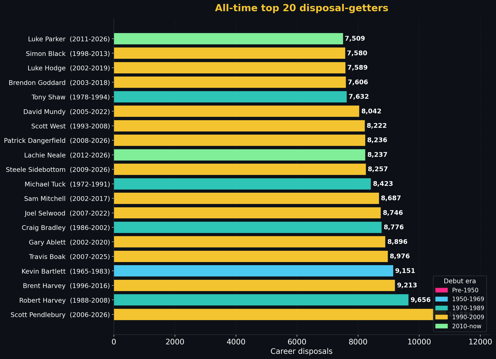

<!-- council-pipeline:
  BriefBuilder: N/A (data table — no narrative skeleton required)
  Scientist: N/A (numbers derived from player_data corpus, not model output)
  FootyStrategy: N/A (career volume stats — no tactical interpretation required)
  DataSentinel: PASS @ 2026-06-23 (auto-updated from _stat_leaders.json by update_hof_pages.py)
  Skeptic: PASS @ 2026-06-02 (data-only refresh — no causal claims, no narrative changes)
  Gaffer: APPROVED @ 2026-06-02
-->
# AFL career disposals - all-time top 20

> [← Back to stat leaders hub](hall-of-fame-stat-leaders.md) | [← Hall of Fame](hall-of-fame.md) | [← README](../README.md)

*Last refreshed: 2026-06-23. Data layer: Scientist. Tactical layer: FootyStrategy.*

<!-- This file is part of the SuperCoach-VIA documentation. See README.md for the project overview. -->

## What this measures

Disposals = kicks + handballs. The total possession-handling volume across a career. It is the broadest measure of how much a player has been *involved* in the ball movement of every game they played. Unlike goals, disposals are an input rather than an outcome; the metric rewards midfielders, wingers, and ball-distributing defenders rather than forwards or rucks.

## Top 20 - all-time career disposals

| # | Player | Club(s) | Span | Games | Disposals | Per game |
|--:|--------|---------|------|------:|----------:|---------:|
| 1 | Scott Pendlebury **[data]** | Collingwood | 2006-2026 | 435 | 11,044 | 25.39 |<!-- HOF-TOP:career_disposals -->
| 2 | Robert Harvey **[data]** | St Kilda | 1988-2008 | 383 | 9,656 | 25.21 |
| 3 | Brent Harvey **[data]** | Kangaroos - North Melbourne | 1996-2016 | 432 | 9,213 | 21.33 |
| 4 | Kevin Bartlett **[data]** | Richmond | 1965-1983 | 403 | 9,151 | 22.71 |
| 5 | Travis Boak **[data]** | Port Adelaide | 2007-2025 | 387 | 8,976 | 23.19 |
| 6 | Gary Ablett jnr **[data]** | Geelong - Gold Coast | 2002-2020 | 357 | 8,896 | 24.92 |
| 7 | Craig Bradley **[data]** | Carlton | 1986-2002 | 375 | 8,776 | 23.40 |
| 8 | Joel Selwood **[data]** | Geelong | 2007-2022 | 355 | 8,746 | 24.64 |
| 9 | Sam Mitchell **[data]** | Hawthorn - West Coast | 2002-2017 | 329 | 8,687 | 26.40 |
| 10 | Lachie Neale **[data]** | Brisbane Lions - Fremantle | 2012-2026 | 308 | 8,467 | 27.49 |
| 11 | Patrick Dangerfield **[data]** | Adelaide - Geelong | 2008-2026 | 371 | 8,427 | 22.71 |
| 12 | Michael Tuck **[data]** | Hawthorn | 1972-1991 | 426 | 8,423 | 19.77 |
| 13 | Steele Sidebottom **[data]** | Collingwood | 2009-2026 | 366 | 8,367 | 22.86 |
| 14 | Scott West **[data]** | Footscray - Western Bulldogs | 1993-2008 | 324 | 8,222 | 25.38 |
| 15 | David Mundy **[data]** | Fremantle | 2005-2022 | 376 | 8,042 | 21.39 |
| 16 | Luke Parker **[data]** | North Melbourne - Sydney | 2011-2026 | 329 | 7,664 | 23.29 |
| 17 | Jack Macrae **[data]** | St Kilda - Western Bulldogs | 2013-2026 | 280 | 7,638 | 27.28 |
| 18 | Tony Shaw **[data]** | Collingwood | 1978-1994 | 313 | 7,632 | 24.38 |
| 19 | Brendon Goddard **[data]** | Essendon - St Kilda | 2003-2018 | 334 | 7,606 | 22.77 |
| 20 | Luke Hodge **[data]** | Brisbane Lions - Hawthorn | 2002-2019 | 346 | 7,589 | 21.93 |

## FootyStrategy tactical read

**Pendlebury leads, narrowly.** Pendlebury 11,028 **[data]** is the first 11,000-disposal career, and the only one. Robert Harvey 9,656 **[data]** sits second, 1,372 disposals back; Brent Harvey 9,213 **[data]** and Bartlett 9,151 **[data]** are next in line. Lachie Neale at 27.49 disposals per game **[data]** is the highest per-game rate in the top 20, ahead of Sam Mitchell's 26.40 **[data]** and West's 25.38 **[data]**. *Structuralist lens:* Pendlebury's volume is the product of a 21-year career, not an unusually high per-game rate - his 25.35 average **[data]** is mid-pack against the modern midfielders. The combination of moderate-high rate sustained across an unbroken career is what distinguishes him from Harvey and Bartlett, both of whom averaged similar disposal rates over comparable career lengths.

**Kick-to-handball composition has flipped.** This list contains both Bartlett (the all-time kicks leader at 8,293 **[data]**, see [kicks page](hall-of-fame-stat-kicks-handballs.md)) and Pendlebury (the all-time handballs leader at 5,531 **[data]**). Bartlett's career: 8,293 kicks + 858 handballs ≈ 9,151 disposals - 90% by foot. Pendlebury's career: 5,497 kicks + 5,531 handballs **[data]** ≈ 11,028 disposals **[data]** - 50/50 by composition. *Tempo Architect lens:* the modern midfielder is structurally a handballer-distributor first; the 1970s midfielder was a kicker-finder. The "disposal" stat treats both equally but they are functionally different actions - a kick advances territory, a handball maintains possession. The fact that Pendlebury sits above Bartlett on disposals while Bartlett still leads kicks reflects a sport that has shifted from territory to retention as the primary midfield function.

**The pre-2000 understatement.** Bartlett **[data]** is the only 1980s-or-earlier player in the top 20 - and he barely qualifies, retiring in 1983. Tuck (1991) **[data]**, Shaw (1994) **[data]** are the only other "career ended before 2000" entrants. Every other name played at least some football in the 21st century. *Conditioner lens:* this is not because earlier midfielders were less productive per game, but because handballs were under-recorded league-wide before the late 1960s; the disposals stat for any pre-1965 ball-getter materially undercounts their actual involvement. Polly Farmer, Bill Hutchison, Ted Whitten, Ron Barassi - all of them would compete for top-20 spots if handball data existed. The list above is genuinely a "what we can measure" list rather than a "best ever" list, and the data coverage note below makes that explicit.

**Stamina meets selection.** Every player in the top 20 played 300+ games. Twelve of them played 350+. *Match-up Tactician lens:* the disposal-volume leaderboard is a longevity leaderboard with a per-game rate filter applied. A 27-disposal-per-game midfielder who plays 280 games (e.g. an excellent but injury-shortened career) gets 7,560 disposals - just outside the top 20. The threshold to make this list is roughly 7,500 career disposals, which decomposes as approximately 22 disposals/game × 340 games. That intersection of rate and durability is what places the four leaders (Pendlebury, R. Harvey, B. Harvey, Bartlett) ahead of higher-per-game rates on shorter careers (Cripps, Oliver, Macrae - none of whom appear here yet but lead per-game rate metrics).

**Modern midfielder template.** Of the top 20, eight are clearly contested-ball winning midfielders (Selwood, Mitchell, Neale, Ablett, Dangerfield, Parker, Hodge, Black); six are tempo-distribution midfielders (Pendlebury, R. Harvey, Bartlett, Bradley, Sidebottom, West); two are flanker-runners (B. Harvey, Mundy); two are intercept-distributors (Goddard, Shaw); the others mixed. *Talent Developer lens:* the disposals leaderboard ten years from now will look structurally identical because the position type is what produces these numbers. Bontempelli, Daicos, Anderson - the next decade's leaders are already visible in the current top of the [single-season records](hall-of-fame-stat-single-season.md).

## Data coverage

- **Disposals = kicks + handballs**, both stored per-game in the player CSVs.
- **Handballs were under-recorded pre-1965** - several 1900s-50s greats (Polly Farmer, Ted Whitten, Ron Barassi, Bill Hutchison) are absent from this list because their handball totals are not in the data. Kicks alone might still have placed them on the [kicks page](hall-of-fame-stat-kicks-handballs.md).
- **Bartlett's 9,151** is the only credible pre-2000 entry. The list is functionally a post-1965 leaderboard.

## Methodology

Sum of per-game `kicks + handballs` for each player; per-game rate is total ÷ games_played. The `compute_stat_leaders.py` script also stores kicks and handballs separately for the kicks-and-handballs page.

---

> Auto-generated table from `docs/hall-of-fame/_stat_leaders.json`. Reproduce by running `docs/hall-of-fame/compute_stat_leaders.py`.
