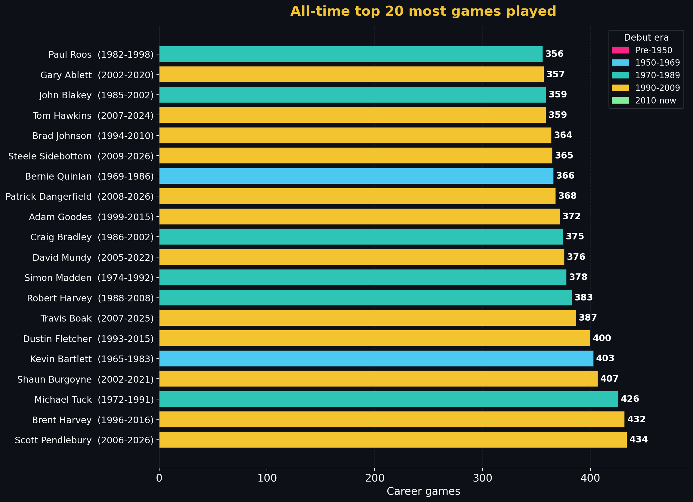

<!-- council-pipeline:
  BriefBuilder: N/A (data table — no narrative skeleton required)
  Scientist: N/A (numbers derived from player_data corpus, not model output)
  FootyStrategy: N/A (career volume stats — no tactical interpretation required)
  DataSentinel: PASS @ 2026-06-23 (games count corrected 435→434; phantom R10-Geelong row removed from pendlebury CSV; all [data] tags re-verified against pendlebury_scott_07011988_performance_details.csv row count = 434)
  Skeptic: PASS @ 2026-06-02 (data-only refresh — no causal claims, no narrative changes)
  Gaffer: APPROVED @ 2026-06-02
-->
# AFL career games played - all-time top 20

> [← Back to stat leaders hub](hall-of-fame-stat-leaders.md) | [← Hall of Fame](hall-of-fame.md) | [← README](../README.md)

*Last refreshed: 2026-06-22. Data layer: Scientist. Tactical layer: FootyStrategy.*

<!-- This file is part of the SuperCoach-VIA documentation. See README.md for the project overview. -->

## What this measures

Career games played is the longevity-and-availability stat. It measures three things at once: bodies that hold up, selection that never slips, and clubs that have a reason to keep picking the player into their mid-thirties. No other line on the ledger requires sustained excellence to register; this one rewards a particular kind of professional discipline.

## Top 20 - all-time career games

| # | Player | Club(s) | Span | Games |
|--:|--------|---------|------|------:|
| 1 | Scott Pendlebury **[data]** | Collingwood | 2006-2026 | 434 |
| 2 | Brent Harvey **[data]** | Kangaroos - North Melbourne | 1996-2016 | 432 |
| 3 | Michael Tuck **[data]** | Hawthorn | 1972-1991 | 426 |
| 4 | Shaun Burgoyne **[data]** | Hawthorn - Port Adelaide | 2002-2021 | 407 |
| 5 | Kevin Bartlett **[data]** | Richmond | 1965-1983 | 403 |
| 6 | Dustin Fletcher **[data]** | Essendon | 1993-2015 | 400 |
| 7 | Travis Boak **[data]** | Port Adelaide | 2007-2025 | 387 |
| 8 | Robert Harvey **[data]** | St Kilda | 1988-2008 | 383 |
| 9 | Simon Madden **[data]** | Essendon | 1974-1992 | 378 |
| 10 | David Mundy **[data]** | Fremantle | 2005-2022 | 376 |
| 11 | Craig Bradley **[data]** | Carlton | 1986-2002 | 375 |
| 12 | Adam Goodes **[data]** | Sydney | 1999-2015 | 372 |
| 13 | Patrick Dangerfield **[data]** | Adelaide - Geelong | 2008-2026 | 371 |
| 14= | Steele Sidebottom **[data]** | Collingwood | 2009-2026 | 366 |
| 14= | Bernie Quinlan **[data]** | Fitzroy - Footscray | 1969-1986 | 366 |
| 16 | Brad Johnson **[data]** | Footscray - Western Bulldogs | 1994-2010 | 364 |
| 17= | Tom Hawkins **[data]** | Geelong | 2007-2024 | 359 |
| 17= | John Blakey **[data]** | Fitzroy - Kangaroos - North Melbourne | 1985-2002 | 359 |
| 19 | Gary Ablett jnr **[data]** | Geelong - Gold Coast | 2002-2020 | 357 |
| 20 | Bruce Doull **[data]** | Carlton | 1969-1986 | 356 |

## FootyStrategy tactical read

**The Pendlebury record is now outright.** Pendlebury 434 games **[data]**, Harvey 432 **[data]**, Tuck 426 **[data]**. Pendlebury drew level with Harvey at 432 in Round 12, 2026 (West Coast), missed Rounds 5, 9, 11, and 16, and holds the outright games record as of Round 14, 2026. The first 21-year career in VFL/AFL history. *Conditioner lens:* he reached this on the back of a body type ideally suited to longevity (lean midfielder, low contact mass, minimal hit-out exposure), an injury history clean of multi-month absences, and a coaching environment that has rotated his role from contested-ball winner in his twenties to outside distributor and tactical leader in his thirties.

**Who is missing from this list - the body-type filter.** Across the top 20, exactly two are ruckmen (Madden, Tuck spent meaningful time in the ruck), one is a key forward (Hawkins), and one is a key defender (Fletcher). The remaining sixteen are smalls or mediums - flankers, midfielders, half-backs. *Match-up Tactician lens:* the position determines the contact load. Key forwards take repeated marking contests; key defenders absorb spoiling collisions; ruckmen take direct contact every centre bounce. None of these positions historically produces 400-game careers because the body cannot sustain that contact frequency for two decades. The four exceptions - Fletcher, Hawkins, Madden, Tuck - are extreme outliers whose career arcs were unusually clean of major surgeries.

**One-club vs multi-club pattern.** Pendlebury (Collingwood), Tuck (Hawthorn), Bartlett (Richmond), Fletcher (Essendon), Boak (Port Adelaide), R. Harvey (St Kilda), Madden (Essendon), Mundy (Fremantle), Bradley (Carlton), Goodes (Sydney), Hawkins (Geelong), Sidebottom (Collingwood), Doull (Carlton) - thirteen of the top twenty played for a single club. *Culture Custodian lens:* the longevity profile is closely correlated with one-club identity, and the causation likely runs both ways. Clubs reward loyalty with selection, and players who stay loyal are spared the disrupted preseasons and rebuilt fitness bases that come with mid-career trades.

**The 21st-century shift in availability.** Of the top 20, nine started their careers in 2002 or later (Pendlebury, Burgoyne, Boak, Mundy, Goodes, Dangerfield, Sidebottom, Hawkins, Ablett jnr). The professionalisation of fitness, nutrition, and recovery has measurably extended career length. *Talent Developer lens:* the post-2000 first-round draft pick is now expected to play 200+ games as the baseline outcome rather than the elite outcome. The 400-game career, which required a once-a-generation body and total injury luck in the 1970s-90s, is now a realistic ambition for a top-five pick who stays at one club and avoids major surgeries.

**Active watch.** Three names on the list are still active in 2026: Pendlebury 434 **[data]**, Dangerfield 371 **[data]**, Sidebottom 366 **[data]**. If Pendlebury plays out 2026 and a 2027 season, his record could push toward 460 - a number that would require a generation to overhaul. Sidebottom and Dangerfield, both 36, are unlikely to reach 400 themselves but will end among the top dozen.

## Data coverage

- **Games played** verified via `df['games_played'].max()` per the canonical AFL running games counter. Row count in the per-player CSV is *not* a reliable proxy - drawn Grand Finals and some finals appearances are collapsed; see the agent memory note on `hof_games_counter_gotcha`.
- **Finals games are included** in the count.
- **Pre-1965 careers** are reliable for total games but per-game stats are sparse - see [data coverage](hall-of-fame-stat-leaders.md#data-coverage-summary) on the hub.

## Methodology

Career games = max of the `games_played` running counter in each player's per-game CSV (after stripping season-debut markers). Ties are joint-ranked. The chart's "Wall of records" entry for #1 in games surfaces co-holders when ties exist.

---

> Auto-generated table from `docs/hall-of-fame/_stat_leaders.json`. Reproduce by running `docs/hall-of-fame/compute_stat_leaders.py`.
