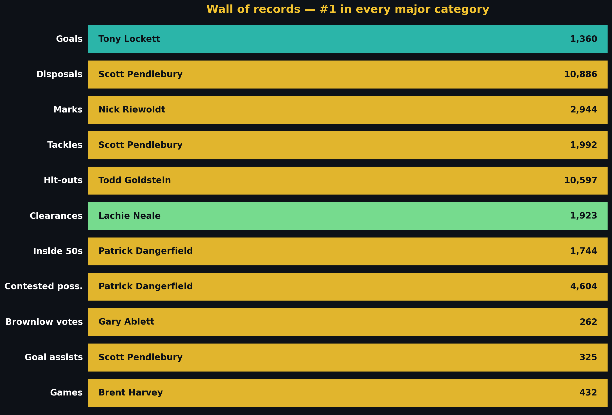
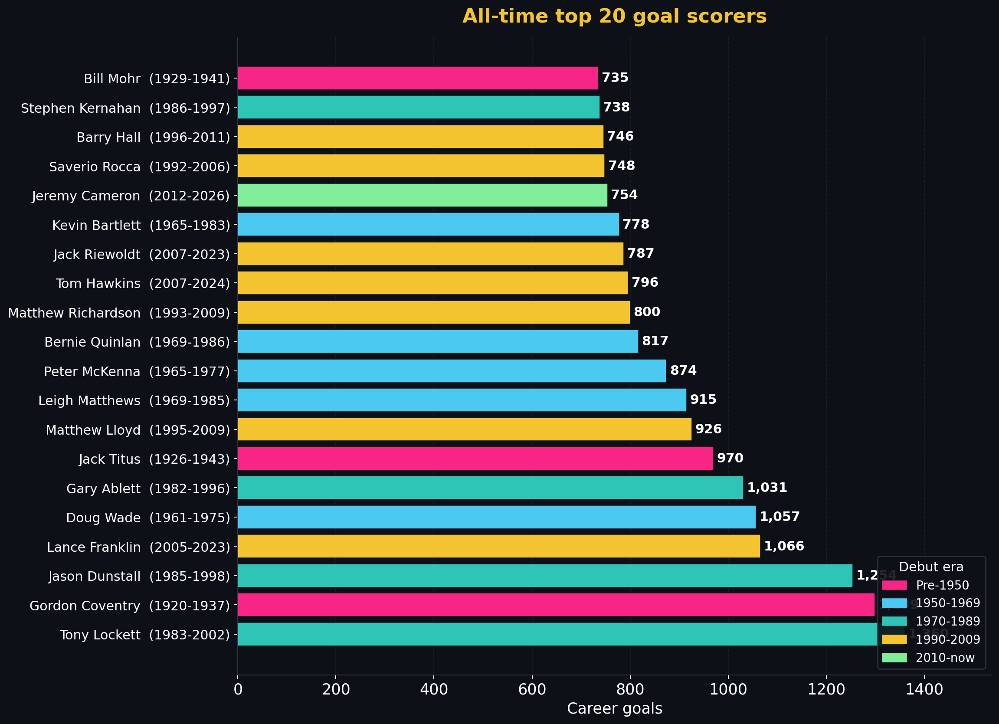

# AFL all-time statistical leaders

> [← Back to main README](../README.md) · [← Hall of Fame hub](hall-of-fame.md)

<!-- This file is part of the SuperCoach-VIA documentation. See README.md for the project overview. -->

*Last refreshed: 2026-05-04 — every number verified by re-aggregating 13,321 player career files in `data/player_data/`.*

The [top 100 list](hall-of-fame-top100.md) is era-normalised: it asks who was furthest above the standard of their own era. This page asks the simpler, blunter question — **who has the biggest career numbers, full stop.** No z-scores, no era adjustments. Just the raw ledger.

The two answers do not agree, and that is the point. Tony Lockett's 1,360 goals are immovable, but his all-time top 100 ranking sits behind Bartlett, Matthews, Quinlan and others whose careers were less concentrated in one stat line. Scott Pendlebury sits #19 on the era-normalised list yet leads four separate raw-volume categories on this page — disposals, tackles, goal assists, and handballs. Both stories are true. This page tells the volume story.

Every total below is computed by summing each player's per-game records across every season recorded in this project's database. Stats not recorded in a player's era show up as zero — see [data coverage notes](#notes-on-data-coverage) at the bottom of the page.

---

## Career goals

| # | Player | Club(s) | Span | Games | Goals | Per game |
|--:|--------|---------|------|------:|------:|---------:|
| 1 | Tony Lockett | St Kilda - Sydney | 1983-2002 | 281 | 1,360 | 4.84 |
| 2 | Gordon Coventry | Collingwood | 1920-1937 | 306 | 1,299 | 4.25 |
| 3 | Jason Dunstall | Hawthorn | 1985-1998 | 269 | 1,254 | 4.66 |
| 4 | Lance Franklin | Hawthorn - Sydney | 2005-2023 | 354 | 1,066 | 3.01 |
| 5 | Doug Wade | Geelong - North Melbourne | 1961-1975 | 267 | 1,057 | 3.96 |
| 6 | Gary Ablett (snr) | Geelong - Hawthorn | 1982-1996 | 248 | 1,031 | 4.16 |
| 7 | Jack Titus | Richmond | 1926-1943 | 294 | 970 | 3.30 |
| 8 | Matthew Lloyd | Essendon | 1995-2009 | 270 | 926 | 3.43 |
| 9 | Leigh Matthews | Hawthorn | 1969-1985 | 332 | 915 | 2.76 |
| 10 | Peter McKenna | Carlton - Collingwood | 1965-1977 | 191 | 874 | 4.58 |
| 11 | Bernie Quinlan | Fitzroy - Footscray | 1969-1986 | 366 | 817 | 2.23 |
| 12 | Matthew Richardson | Richmond | 1993-2009 | 282 | 800 | 2.84 |
| 13 | Tom Hawkins | Geelong | 2007-2024 | 359 | 796 | 2.22 |
| 14 | Jack Riewoldt | Richmond | 2007-2023 | 347 | 787 | 2.27 |
| 15 | Kevin Bartlett | Richmond | 1965-1983 | 403 | 778 | 1.93 |
| 16 | Jeremy Cameron | Geelong - Greater Western Sydney | 2012-2026 | 284 | 754 | 2.65 |
| 17 | Saverio Rocca | Collingwood - Kangaroos | 1992-2006 | 257 | 748 | 2.91 |
| 18 | Barry Hall | St Kilda - Sydney - Western Bulldogs | 1996-2011 | 289 | 746 | 2.58 |
| 19 | Stephen Kernahan | Carlton | 1986-1997 | 251 | 738 | 2.94 |
| 20 | Bill Mohr | St Kilda | 1929-1941 | 195 | 735 | 3.77 |

**[data]** Lockett's 1,360 is the all-time record and has stood since his 2002 retirement. The top six are the only members of the 1,000-goal club — three forwards from the supercharged 1980s/early-90s (Lockett, Dunstall, Ablett snr), one Depression-era full-forward (Coventry), one 1960s-70s spearhead (Wade), and one modern outlier (Franklin, the only post-2000 entrant). Per-game scoring rate has compressed sharply: the top of the list averages over four goals per game; everyone post-2000 sits below 3.5. Modern defences, zone structures, and lower-scoring matches have made the 1,000-goal milestone almost unreachable — Hawkins finished his career at 796, the closest a 21st-century forward has come outside Franklin.

## Career games played

| # | Player | Club(s) | Span | Games | Per game |
|--:|--------|---------|------|------:|---------:|
| 1 | Brent Harvey | Kangaroos - North Melbourne | 1996-2016 | 432 | 1.00 |
| 2 | Scott Pendlebury | Collingwood | 2006-2026 | 428 | 1.00 |
| 3 | Michael Tuck | Hawthorn | 1972-1991 | 426 | 1.00 |
| 4 | Shaun Burgoyne | Hawthorn - Port Adelaide | 2002-2021 | 407 | 1.00 |
| 5 | Kevin Bartlett | Richmond | 1965-1983 | 403 | 1.00 |
| 6 | Dustin Fletcher | Essendon | 1993-2015 | 400 | 1.00 |
| 7 | Travis Boak | Port Adelaide | 2007-2025 | 387 | 1.00 |
| 8 | Robert Harvey | St Kilda | 1988-2008 | 383 | 1.00 |
| 9 | Simon Madden | Essendon | 1974-1992 | 378 | 1.00 |
| 10 | David Mundy | Fremantle | 2005-2022 | 376 | 1.00 |
| 11 | Craig Bradley | Carlton | 1986-2002 | 375 | 1.00 |
| 12 | Adam Goodes | Sydney | 1999-2015 | 372 | 1.00 |
| 13 | Bernie Quinlan | Fitzroy - Footscray | 1969-1986 | 366 | 1.00 |
| 14 | Brad Johnson | Footscray - Western Bulldogs | 1994-2010 | 364 | 1.00 |
| 15 | Patrick Dangerfield | Adelaide - Geelong | 2008-2026 | 361 | 1.00 |
| 16 | John Blakey | Fitzroy - Kangaroos - North Melbourne | 1985-2002 | 359 | 1.00 |
| 17 | Tom Hawkins | Geelong | 2007-2024 | 359 | 1.00 |
| 18 | Steele Sidebottom | Collingwood | 2009-2026 | 358 | 1.00 |
| 19 | Gary Ablett (jnr) | Geelong - Gold Coast | 2002-2020 | 357 | 1.00 |
| 20 | Paul Roos | Fitzroy - Sydney | 1982-1998 | 356 | 1.00 |

**[data]** Brent Harvey's 432 is the all-time games record. Pendlebury at 428 (and still active in 2026) sits four games behind and looks likely to break it — the live race that adds quiet drama to every Magpies fixture. Note who is missing: no specialist key forwards or ruckmen feature outside Tuck, Madden, Hawkins, and Burgoyne. Survival to 400 games requires the body of a small or medium midfielder, the durability of a flanker, and an absence of major injuries spanning two decades.

## Career disposals

| # | Player | Club(s) | Span | Games | Disposals | Per game |
|--:|--------|---------|------|------:|----------:|---------:|
| 1 | Scott Pendlebury | Collingwood | 2006-2026 | 428 | 10,886 | 25.43 |
| 2 | Robert Harvey | St Kilda | 1988-2008 | 383 | 9,656 | 25.21 |
| 3 | Brent Harvey | Kangaroos - North Melbourne | 1996-2016 | 432 | 9,213 | 21.33 |
| 4 | Kevin Bartlett | Richmond | 1965-1983 | 403 | 9,151 | 22.71 |
| 5 | Travis Boak | Port Adelaide | 2007-2025 | 387 | 8,976 | 23.19 |
| 6 | Gary Ablett (jnr) | Geelong - Gold Coast | 2002-2020 | 357 | 8,896 | 24.92 |
| 7 | Craig Bradley | Carlton | 1986-2002 | 375 | 8,776 | 23.40 |
| 8 | Joel Selwood | Geelong | 2007-2022 | 355 | 8,746 | 24.64 |
| 9 | Sam Mitchell | Hawthorn - West Coast | 2002-2017 | 329 | 8,687 | 26.40 |
| 10 | Michael Tuck | Hawthorn | 1972-1991 | 426 | 8,423 | 19.77 |
| 11 | Steele Sidebottom | Collingwood | 2009-2026 | 358 | 8,257 | 23.06 |
| 12 | Lachie Neale | Brisbane Lions - Fremantle | 2012-2026 | 300 | 8,237 | 27.46 |
| 13 | Patrick Dangerfield | Adelaide - Geelong | 2008-2026 | 361 | 8,236 | 22.81 |
| 14 | Scott West | Footscray - Western Bulldogs | 1993-2008 | 324 | 8,222 | 25.38 |
| 15 | David Mundy | Fremantle | 2005-2022 | 376 | 8,042 | 21.39 |
| 16 | Tony Shaw | Collingwood | 1978-1994 | 313 | 7,632 | 24.38 |
| 17 | Brendon Goddard | Essendon - St Kilda | 2003-2018 | 334 | 7,606 | 22.77 |
| 18 | Luke Hodge | Brisbane Lions - Hawthorn | 2002-2019 | 346 | 7,589 | 21.93 |
| 19 | Simon Black | Brisbane Lions | 1998-2013 | 322 | 7,580 | 23.54 |
| 20 | Luke Parker | North Melbourne - Sydney | 2011-2026 | 323 | 7,509 | 23.25 |

**[data]** Pendlebury is the first player to clear 10,000 career disposals. The list is dominated by the modern ball-magnets — Sam Mitchell, Lachie Neale, Selwood, Ablett — but the inclusion of Bartlett at #4 and Robert Harvey at #2 shows that the elite-volume midfielder is not a 2010s invention. Note that handball was not consistently logged before the early 1960s, so figures for pre-WWII players (Coventry, Titus, Pratt) understate their true ball-getting; this is one of the reasons era-normalisation is so important elsewhere on the site.

## Career marks

| # | Player | Club(s) | Span | Games | Marks | Per game |
|--:|--------|---------|------|------:|------:|---------:|
| 1 | Nick Riewoldt | St Kilda | 2001-2017 | 336 | 2,944 | 8.76 |
| 2 | Gary Dempsey | Footscray - North Melbourne | 1967-1984 | 329 | 2,906 | 8.83 |
| 3 | Stewart Loewe | St Kilda | 1986-2002 | 321 | 2,503 | 7.80 |
| 4 | Matthew Richardson | Richmond | 1993-2009 | 282 | 2,270 | 8.05 |
| 5 | Brad Johnson | Footscray - Western Bulldogs | 1994-2010 | 364 | 2,153 | 5.91 |
| 6 | Paul Roos | Fitzroy - Sydney | 1982-1998 | 356 | 2,140 | 6.01 |
| 7 | Brendon Goddard | Essendon - St Kilda | 2003-2018 | 334 | 2,103 | 6.30 |
| 8 | Simon Madden | Essendon | 1974-1992 | 378 | 2,063 | 5.46 |
| 9 | Matthew Pavlich | Fremantle | 2000-2016 | 353 | 2,046 | 5.80 |
| 10 | Adam Goodes | Sydney | 1999-2015 | 372 | 2,038 | 5.48 |
| 11 | Bernie Quinlan | Fitzroy - Footscray | 1969-1986 | 366 | 2,025 | 5.53 |
| 12 | Heath Shaw | Collingwood - Greater Western Sydney | 2005-2020 | 325 | 2,017 | 6.21 |
| 13 | Chris Grant | Footscray - Western Bulldogs | 1990-2007 | 341 | 2,003 | 5.87 |
| 14 | Paul Salmon | Essendon - Hawthorn | 1983-2002 | 324 | 1,966 | 6.07 |
| 15 | Kade Simpson | Carlton | 2003-2020 | 342 | 1,949 | 5.70 |
| 16 | Tom Hawkins | Geelong | 2007-2024 | 359 | 1,927 | 5.37 |
| 17 | Lance Franklin | Hawthorn - Sydney | 2005-2023 | 354 | 1,912 | 5.40 |
| 18 | Mitch Duncan | Geelong | 2010-2025 | 305 | 1,909 | 6.26 |
| 19 | Barry Hall | St Kilda - Sydney - Western Bulldogs | 1996-2011 | 289 | 1,897 | 6.56 |
| 20 | David Cloke | Centre Half-Forward (Collingwood - Richmond) | 1974-1991 | 333 | 1,882 | 5.65 |

**[data]** Nick Riewoldt's 2,944 marks is the canonical record. Dempsey, the 1975 Brownlow Medallist, sits 38 marks behind despite being primarily a ruckman — his per-game rate of 8.83 is actually the highest in the top 20. The list weights heavily towards key forwards (Riewoldt, Loewe, Richardson, Salmon, Hawkins) and tall defenders (Roos, Goddard, Cloke), with Brad Johnson the most prolific true wingman.

## Career tackles

| # | Player | Club(s) | Span | Games | Tackles | Per game |
|--:|--------|---------|------|------:|--------:|---------:|
| 1 | Scott Pendlebury | Collingwood | 2006-2026 | 428 | 1,992 | 4.65 |
| 2 | Joel Selwood | Geelong | 2007-2022 | 355 | 1,798 | 5.06 |
| 3 | Matt Priddis | West Coast | 2006-2017 | 240 | 1,629 | 6.79 |
| 4 | Travis Boak | Port Adelaide | 2007-2025 | 387 | 1,611 | 4.16 |
| 5 | Luke Parker | North Melbourne - Sydney | 2011-2026 | 323 | 1,566 | 4.85 |
| 6 | Liam Shiels | Hawthorn - North Melbourne | 2009-2024 | 288 | 1,560 | 5.42 |
| 7 | Gary Ablett (jnr) | Geelong - Gold Coast | 2002-2020 | 357 | 1,534 | 4.30 |
| 8 | Jack Steele | Greater Western Sydney - Melbourne - St Kilda | 2015-2026 | 210 | 1,519 | 7.23 |
| 9 | Dayne Zorko | Brisbane Lions | 2012-2026 | 306 | 1,515 | 4.95 |
| 10 | Lenny Hayes | St Kilda | 1999-2014 | 297 | 1,496 | 5.04 |
| 11 | Shaun Burgoyne | Hawthorn - Port Adelaide | 2002-2021 | 407 | 1,492 | 3.67 |
| 12 | Jude Bolton | Sydney | 1999-2013 | 325 | 1,490 | 4.58 |
| 13 | Josh Kennedy | Hawthorn - Sydney | 2008-2022 | 290 | 1,488 | 5.13 |
| 14 | Andrew Swallow | Kangaroos - North Melbourne | 2006-2017 | 224 | 1,481 | 6.61 |
| 15 | James Kelly | Essendon - Geelong | 2002-2017 | 313 | 1,446 | 4.62 |
| 16 | Jack Redden | Brisbane Lions - West Coast | 2009-2022 | 263 | 1,435 | 5.46 |
| 17 | Tom Liberatore | Western Bulldogs | 2011-2026 | 261 | 1,428 | 5.47 |
| 18 | David Mundy | Fremantle | 2005-2022 | 376 | 1,422 | 3.78 |
| 19 | Scott Thompson | Adelaide - Melbourne | 2001-2017 | 308 | 1,409 | 4.57 |
| 20 | Rory Sloane | Adelaide | 2009-2023 | 255 | 1,397 | 5.48 |

**[data]** Pendlebury again — first player past 2,000 career tackles is a question of when, not if. **[historical record — partial data]** Tackles were not officially recorded league-wide until 1987, so this list necessarily understates the great defensive midfielders of earlier generations (Skilton, Greg Williams's predecessors at Carlton, Tony Shaw's hard-running brigade). Per-game rate is the more revealing column: Jack Steele's 7.23/game in his career-to-date is the highest sustained tackle rate ever recorded, ahead of Priddis's 6.79.

## Career contested possessions

| # | Player | Club(s) | Span | Games | Contested poss. | Per game |
|--:|--------|---------|------|------:|----------------:|---------:|
| 1 | Patrick Dangerfield | Adelaide - Geelong | 2008-2026 | 361 | 4,604 | 12.75 |
| 2 | Scott Pendlebury | Collingwood | 2006-2026 | 428 | 4,371 | 10.21 |
| 3 | Josh Kennedy | Hawthorn - Sydney | 2008-2022 | 290 | 4,007 | 13.82 |
| 4 | Gary Ablett (jnr) | Geelong - Gold Coast | 2002-2020 | 357 | 4,000 | 11.20 |
| 5 | Joel Selwood | Geelong | 2007-2022 | 355 | 3,984 | 11.22 |
| 6 | Lachie Neale | Brisbane Lions - Fremantle | 2012-2026 | 300 | 3,933 | 13.11 |
| 7 | Travis Boak | Port Adelaide | 2007-2025 | 387 | 3,743 | 9.67 |
| 8 | Luke Parker | North Melbourne - Sydney | 2011-2026 | 323 | 3,612 | 11.18 |
| 9 | Simon Black | Brisbane Lions | 1998-2013 | 322 | 3,523 | 10.94 |
| 10 | Patrick Cripps | Carlton | 2014-2026 | 238 | 3,453 | 14.51 |
| 11 | David Mundy | Fremantle | 2005-2022 | 376 | 3,418 | 9.09 |
| 12 | Sam Mitchell | Hawthorn - West Coast | 2002-2017 | 329 | 3,401 | 10.34 |
| 13 | Chris Judd | Carlton - West Coast | 2002-2015 | 279 | 3,276 | 11.74 |
| 14 | Ollie Wines | Port Adelaide | 2013-2026 | 278 | 3,266 | 11.75 |
| 15 | Trent Cotchin | Richmond | 2008-2023 | 306 | 3,262 | 10.66 |
| 16 | Nat Fyfe | Fremantle | 2010-2025 | 247 | 3,204 | 12.97 |
| 17 | Tom Liberatore | Western Bulldogs | 2011-2026 | 261 | 3,194 | 12.24 |
| 18 | Matt Priddis | West Coast | 2006-2017 | 240 | 3,176 | 13.23 |
| 19 | Clayton Oliver | Greater Western Sydney - Melbourne | 2016-2026 | 213 | 3,136 | 14.72 |
| 20 | Callan Ward | Greater Western Sydney - Western Bulldogs | 2008-2025 | 327 | 3,134 | 9.58 |

**[data]** Contested possessions only appear in the database from 1998, when the official AFL stat dictionary started capturing them — so this is fundamentally a post-2000 list. Dangerfield's 4,604 is an outlier at the top: his per-game rate of 12.75 sustained over 361 games is the volume-times-quality combination almost no one else has matched. Patrick Cripps's 14.51/game (highest of any active 200+ game player) and Clayton Oliver's 14.72 mark them as the next-generation contested kings.

## Career clearances

| # | Player | Club(s) | Span | Games | Clearances | Per game |
|--:|--------|---------|------|------:|-----------:|---------:|
| 1 | Lachie Neale | Brisbane Lions - Fremantle | 2012-2026 | 300 | 1,923 | 6.41 |
| 2 | Patrick Dangerfield | Adelaide - Geelong | 2008-2026 | 361 | 1,884 | 5.22 |
| 3 | Scott Pendlebury | Collingwood | 2006-2026 | 428 | 1,869 | 4.37 |
| 4 | Joel Selwood | Geelong | 2007-2022 | 355 | 1,846 | 5.20 |
| 5 | Josh Kennedy | Hawthorn - Sydney | 2008-2022 | 290 | 1,809 | 6.24 |
| 6 | Sam Mitchell | Hawthorn - West Coast | 2002-2017 | 329 | 1,801 | 5.47 |
| 7 | Simon Black | Brisbane Lions | 1998-2013 | 322 | 1,715 | 5.33 |
| 8 | Patrick Cripps | Carlton | 2014-2026 | 238 | 1,684 | 7.08 |
| 9 | Tom Liberatore | Western Bulldogs | 2011-2026 | 261 | 1,646 | 6.31 |
| 10 | Travis Boak | Port Adelaide | 2007-2025 | 387 | 1,585 | 4.10 |
| 11 | Luke Parker | North Melbourne - Sydney | 2011-2026 | 323 | 1,577 | 4.88 |
| 12 | Gary Ablett (jnr) | Geelong - Gold Coast | 2002-2020 | 357 | 1,545 | 4.33 |
| 13 | Chris Judd | Carlton - West Coast | 2002-2015 | 279 | 1,499 | 5.37 |
| 14 | David Mundy | Fremantle | 2005-2022 | 376 | 1,494 | 3.97 |
| 15 | Matt Priddis | West Coast | 2006-2017 | 240 | 1,473 | 6.14 |
| 16 | Trent Cotchin | Richmond | 2008-2023 | 306 | 1,441 | 4.71 |
| 17 | Scott Thompson | Adelaide - Melbourne | 2001-2017 | 308 | 1,423 | 4.62 |
| 18 | Callan Ward | Greater Western Sydney - Western Bulldogs | 2008-2025 | 327 | 1,420 | 4.34 |
| 19 | Ollie Wines | Port Adelaide | 2013-2026 | 278 | 1,407 | 5.06 |
| 20 | Marcus Bontempelli | Western Bulldogs | 2014-2026 | 266 | 1,396 | 5.25 |

**[data]** Same caveat as contested possessions: clearances only enter the official record in 1998. Lachie Neale's 1,923 in 300 games leads outright, but Cripps's per-game rate of 7.08 is the highest sustained clearance dominance ever measured — he is on track to overhaul Neale and potentially everyone else if his body holds. The list reads like the modern midfielder's roll of honour: every name except Pendlebury, Boak, Mundy, and Ward is either a Brownlow Medallist or has finished top-3 in the count.

## Career hit-outs

| # | Player | Club(s) | Span | Games | Hit-outs | Per game |
|--:|--------|---------|------|------:|---------:|---------:|
| 1 | Todd Goldstein | Essendon - North Melbourne | 2008-2025 | 344 | 10,597 | 30.81 |
| 2 | Aaron Sandilands | Fremantle | 2003-2019 | 271 | 8,502 | 31.37 |
| 3 | Max Gawn | Melbourne | 2011-2026 | 255 | 8,481 | 33.26 |
| 4 | Brodie Grundy | Collingwood - Melbourne - Sydney | 2013-2026 | 250 | 7,918 | 31.67 |
| 5 | Jarrod Witts | Collingwood - Gold Coast | 2013-2026 | 209 | 7,249 | 34.68 |
| 6 | Sam Jacobs | Adelaide - Carlton - Greater Western Sydney | 2009-2020 | 208 | 6,787 | 32.63 |
| 7 | Dean Cox | West Coast | 2001-2014 | 290 | 6,628 | 22.86 |
| 8 | Gary Dempsey | Footscray - North Melbourne | 1967-1984 | 329 | 6,479 | 19.69 |
| 9 | Shane Mumford | Geelong - Greater Western Sydney - Sydney | 2008-2021 | 216 | 6,352 | 29.41 |
| 10 | Justin Madden | Carlton - Essendon | 1980-1996 | 332 | 5,746 | 17.31 |
| 11 | Paddy Ryder | Essendon - Port Adelaide - St Kilda | 2006-2022 | 281 | 5,614 | 19.98 |
| 12 | Nic Naitanui | West Coast | 2009-2022 | 213 | 5,549 | 26.05 |
| 13 | Ben McEvoy | Hawthorn - St Kilda | 2008-2022 | 252 | 5,277 | 20.94 |
| 14 | Simon Madden | Essendon | 1974-1992 | 378 | 5,226 | 13.83 |
| 15 | Reilly O'Brien | Adelaide | 2016-2026 | 145 | 5,142 | 35.46 |
| 16 | Jeff White | Fremantle - Melbourne | 1995-2008 | 268 | 5,000 | 18.66 |
| 17 | Darren Jolly | Collingwood - Melbourne - Sydney | 2001-2013 | 237 | 4,968 | 20.96 |
| 18 | Peter Everitt | Hawthorn - St Kilda - Sydney | 1993-2008 | 291 | 4,961 | 17.05 |
| 19 | Toby Nankervis | Richmond - Sydney | 2015-2026 | 181 | 4,680 | 25.86 |
| 20 | Stefan Martin | Brisbane Lions - Melbourne - Western Bulldogs | 2008-2022 | 203 | 4,661 | 22.96 |

**[data]** Goldstein's 10,597 is the all-time mark and unlikely to be challenged any time soon — the next active ruckman is Gawn at 8,481, still 2,100 hit-outs short. **[historical record — partial data]** Hit-out counts pre-2017 use a different recording standard than the modern era — the post-2017 numbers tend to be slightly higher because of how contested taps are now logged. Nineties and 2000s ruck legends like Cox, Dempsey, Justin Madden, and Simon Madden are all materially understated by raw totals; their per-game rates of 17-23 reflect both the era's slower pace and the older recording convention.

## Career Brownlow votes

| # | Player | Club(s) | Span | Games | Votes | Per game |
|--:|--------|---------|------|------:|------:|---------:|
| 1 | Gary Ablett (jnr) | Geelong - Gold Coast | 2002-2020 | 357 | 262 | 0.73 |
| 2 | Patrick Dangerfield | Adelaide - Geelong | 2008-2026 | 361 | 251 | 0.70 |
| 3 | Sam Mitchell | Hawthorn - West Coast | 2002-2017 | 329 | 227 | 0.69 |
| 4 | Scott Pendlebury | Collingwood | 2006-2026 | 428 | 223 | 0.52 |
| 5 | Robert Harvey | St Kilda | 1988-2008 | 383 | 215 | 0.56 |
| 6 | Joel Selwood | Geelong | 2007-2022 | 355 | 214 | 0.60 |
| 7 | Dustin Martin | Richmond | 2010-2024 | 302 | 213 | 0.71 |
| 8 | Chris Judd | Carlton - West Coast | 2002-2015 | 279 | 210 | 0.75 |
| 9 | Lachie Neale | Brisbane Lions - Fremantle | 2012-2026 | 300 | 209 | 0.70 |
| 10 | Marcus Bontempelli | Western Bulldogs | 2014-2026 | 266 | 191 | 0.72 |
| 11 | Brent Harvey | Kangaroos - North Melbourne | 1996-2016 | 432 | 191 | 0.44 |
| 12 | Nat Fyfe | Fremantle | 2010-2025 | 247 | 190 | 0.77 |
| 13 | Patrick Cripps | Carlton | 2014-2026 | 238 | 189 | 0.79 |
| 14 | Dane Swan | Collingwood | 2003-2016 | 258 | 186 | 0.72 |
| 15 | Lance Franklin | Hawthorn - Sydney | 2005-2023 | 354 | 186 | 0.53 |
| 16 | Simon Black | Brisbane Lions | 1998-2013 | 322 | 184 | 0.57 |
| 17 | Nathan Buckley | Brisbane Bears - Collingwood | 1993-2007 | 280 | 178 | 0.64 |
| 18 | Scott West | Footscray - Western Bulldogs | 1993-2008 | 324 | 175 | 0.54 |
| 19 | Travis Boak | Port Adelaide | 2007-2025 | 387 | 174 | 0.45 |
| 20 | Adam Goodes | Sydney | 1999-2015 | 372 | 163 | 0.44 |

**[data]** Gary Ablett junior's 262 is the all-time Brownlow vote count, ahead of Dangerfield's 251 and rising — Dangerfield is the live #2 with two seasons potentially still to play. **[historical record — partial data]** The pre-1981 5-4-3-2-1 voting system means Dyer, Reynolds, Whitten and the other early greats accumulated counts that are not directly comparable; the project database normalises to the modern 3-2-1 scale, so raw totals from before 1981 sit lower than they would on AFL.com.au's headline figures. Per-game vote rate is the most revealing column here: Cripps at 0.79/game and Fyfe at 0.77/game lead the era despite shorter careers.

## Career goal assists

| # | Player | Club(s) | Span | Games | Goal assists | Per game |
|--:|--------|---------|------|------:|-------------:|---------:|
| 1 | Scott Pendlebury | Collingwood | 2006-2026 | 428 | 325 | 0.76 |
| 2 | Eddie Betts | Adelaide - Carlton | 2005-2021 | 350 | 318 | 0.91 |
| 3 | Tom Hawkins | Geelong | 2007-2024 | 359 | 296 | 0.82 |
| 4 | Patrick Dangerfield | Adelaide - Geelong | 2008-2026 | 361 | 272 | 0.75 |
| 5 | Joel Selwood | Geelong | 2007-2022 | 355 | 264 | 0.74 |
| 6 | Robbie Gray | Port Adelaide | 2007-2022 | 271 | 262 | 0.97 |
| 7 | Gary Ablett (jnr) | Geelong - Gold Coast | 2002-2020 | 357 | 261 | 0.73 |
| 8 | Steve Johnson | Geelong - Greater Western Sydney | 2002-2017 | 293 | 256 | 0.87 |
| 9 | Jack Riewoldt | Richmond | 2007-2023 | 347 | 249 | 0.72 |
| 10 | Travis Boak | Port Adelaide | 2007-2025 | 387 | 248 | 0.64 |
| 11 | Luke Breust | Hawthorn | 2011-2025 | 308 | 246 | 0.80 |
| 12 | Taylor Walker | Adelaide | 2009-2026 | 306 | 240 | 0.78 |
| 13 | Marcus Bontempelli | Western Bulldogs | 2014-2026 | 266 | 237 | 0.89 |
| 14 | Brent Harvey | Kangaroos - North Melbourne | 1996-2016 | 432 | 233 | 0.54 |
| 15 | Lance Franklin | Hawthorn - Sydney | 2005-2023 | 354 | 231 | 0.65 |
| 16 | Nick Riewoldt | St Kilda | 2001-2017 | 336 | 224 | 0.67 |
| 17 | Dustin Martin | Richmond | 2010-2024 | 302 | 221 | 0.73 |
| 18 | Matthew Pavlich | Fremantle | 2000-2016 | 353 | 216 | 0.61 |
| 19 | Shane Edwards | Richmond | 2007-2022 | 303 | 211 | 0.70 |
| 20 | Adam Goodes | Sydney | 1999-2015 | 372 | 210 | 0.56 |

**[data]** Goal assists are the modern stat that captures what older generations called "field generalship": the pass before the goal. Pendlebury's 325 leads, but Eddie Betts's 318 in 350 games — many delivered as the small-forward Houdini who set up teammates with no-look handballs from impossible angles — is the most artistic line on the page. Robbie Gray's 0.97 assists/game is the highest sustained rate in the top 20. Goal assists were not recorded systematically before about 1999, so this list is effectively a post-2000 ranking.

## Career kicks and handballs

These two are the components of disposals, useful for separating the ball-users from the ball-distributors.

| Stat | #1 holder | Total | Per game |
|------|-----------|------:|---------:|
| Kicks | Kevin Bartlett (Richmond, 1965-1983) | 8,293 | 20.58 |
| Handballs | Scott Pendlebury (Collingwood, 2006- ) | 5,451 | 12.74 |

**[data]** Bartlett's career kick tally would still rank #1 today even if you froze the leaderboard — he averaged over 20 kicks per game in an era when 12-15 was elite. Pendlebury's handball total reflects a different era of the game: modern midfielders distribute by hand at far higher rates than their 1970s predecessors. The two records together explain why Pendlebury appears at #1 in disposals despite Bartlett still leading the kicks-only board.

---

## Single-season records

The biggest individual seasons in each major category. These are pure peak-output numbers — what the best season anyone has ever had looks like.

### Goals (single season)

| # | Player | Season | Club(s) | Goals |
|--:|--------|-------:|---------|------:|
| 1 | Peter Hudson | 1971 | Hawthorn | 150 |
| 2 | Bob Pratt | 1934 | South Melbourne | 150 |
| 3 | Jason Dunstall | 1992 | Hawthorn | 145 |
| 4 | Peter McKenna | 1970 | Carlton - Collingwood | 143 |
| 5 | Tony Lockett | 1992 | St Kilda - Sydney | 132 |
| 6 | Gary Ablett (snr) | 1994 | Geelong - Hawthorn | 129 |
| 7 | Tony Modra | 1993 | Adelaide - Fremantle | 129 |
| 8 | Doug Wade | 1969 | Geelong - North Melbourne | 127 |
| 9 | Gordon Coventry | 1929 | Collingwood | 124 |
| 10 | Ron Todd | 1939 | Collingwood | 121 |

The 150-goal season is the holy grail of forward play. Hudson hit 150 in 1971 in 22 home-and-away games, equalling Pratt's 1934 record. No player has cleared 150 since the home-and-away expansion to 22 games — Dunstall came closest with 145 in 1992. The fact that the top four all happened before 1993 says everything about the difference between the high-scoring decades and the modern game.

### Disposals (single season)

| # | Player | Season | Club(s) | Disposals |
|--:|--------|-------:|---------|----------:|
| 1 | Jack Macrae | 2021 | St Kilda - Western Bulldogs | 880 |
| 2 | Tom Mitchell | 2018 | Collingwood - Hawthorn - Sydney | 848 |
| 3 | Matt Crouch | 2017 | Adelaide | 825 |
| 4 | Dane Swan | 2010 | Collingwood | 820 |
| 5 | Dan Hannebery | 2016 | St Kilda - Sydney | 802 |
| 6 | Clayton Oliver | 2021 | Greater Western Sydney - Melbourne | 789 |
| 7 | Adam Treloar | 2019 | Collingwood - Greater Western Sydney - Western Bulldogs | 789 |
| 8 | Josh Kennedy | 2016 | Hawthorn - Sydney | 787 |
| 9 | Ollie Wines | 2021 | Port Adelaide | 777 |
| 10 | Tom Green | 2024 | Greater Western Sydney | 770 |

### Marks (single season)

| # | Player | Season | Club(s) | Marks |
|--:|--------|-------:|---------|------:|
| 1 | Nick Riewoldt | 2004 | St Kilda | 256 |
| 2 | Gary Dempsey | 1979 | Footscray - North Melbourne | 245 |
| 3 | Brian Lake | 2010 | Hawthorn - Western Bulldogs | 240 |
| 4 | Greg Parke | 1970 | Fitzroy - Footscray - Melbourne | 238 |
| 5 | Sam Fisher | 2008 | St Kilda | 228 |
| 6 | Stewart Loewe | 1990 | St Kilda | 225 |
| 7 | Mike Green | 1969 | Richmond | 224 |
| 8 | Matthew Richardson | 2008 | Richmond | 222 |
| 9 | Warren Tredrea | 2005 | Port Adelaide | 220 |
| 10 | Chris Tarrant | 2003 | Collingwood - Fremantle | 219 |

### Tackles (single season)

| # | Player | Season | Club(s) | Tackles |
|--:|--------|-------:|---------|--------:|
| 1 | Tom Atkins | 2025 | Geelong | 205 |
| 2 | Scott Selwood | 2011 | Geelong - West Coast | 202 |
| 3 | Matt Priddis | 2011 | West Coast | 193 |
| 4 | Matt Rowell | 2025 | Gold Coast | 192 |
| 5 | James Rowbottom | 2024 | Sydney | 186 |
| 6 | James Kelly | 2011 | Essendon - Geelong | 186 |
| 7 | Devon Smith | 2018 | Essendon - Greater Western Sydney | 186 |
| 8 | Jack Steele | 2021 | Greater Western Sydney - Melbourne - St Kilda | 186 |
| 9 | Rory Sloane | 2017 | Adelaide | 186 |
| 10 | Andrew Swallow | 2010 | Kangaroos - North Melbourne | 183 |

### Brownlow votes (single season)

| # | Player | Season | Club(s) | Votes |
|--:|--------|-------:|---------|------:|
| 1 | Patrick Cripps | 2024 | Carlton | 45 |
| 2 | Nick Daicos | 2024 | Collingwood | 38 |
| 3 | Ollie Wines | 2021 | Port Adelaide | 36 |
| 4 | Dustin Martin | 2017 | Richmond | 36 |
| 5 | Patrick Dangerfield | 2016 | Adelaide - Geelong | 35 |
| 6 | Dane Swan | 2011 | Collingwood | 34 |
| 7 | Marcus Bontempelli | 2021 | Western Bulldogs | 33 |
| 8 | Nat Fyfe | 2019 | Fremantle | 33 |
| 9 | Robert Harvey | 1998 | St Kilda | 32 |
| 10 | Lachie Neale | 2020 | Brisbane Lions - Fremantle | 31 |

**[data]** Cripps's 45 votes in 2024 is verifiable in the per-game data (a string of 3-vote games unmatched in modern times) and stands as the all-time 3-2-1 record. Wines and Martin share the second-highest mark of the modern era at 36, with Daicos's 38 in 2024 (in his second season) the highest tally never to win the medal — Cripps polled higher.

### Hit-outs (single season)

| # | Player | Season | Club(s) | Hit-outs |
|--:|--------|-------:|---------|---------:|
| 1 | Max Gawn | 2018 | Melbourne | 1,119 |
| 2 | Todd Goldstein | 2015 | Essendon - North Melbourne | 1,058 |
| 3 | Brodie Grundy | 2018 | Collingwood - Melbourne - Sydney | 1,039 |
| 4 | Jarrod Witts | 2019 | Collingwood - Gold Coast | 1,007 |
| 5 | Aaron Sandilands | 2015 | Fremantle | 998 |

**[historical record — partial data]** Hit-out totals before 2017 use the older recording convention; post-2017 the AFL changed how contested ruck taps are logged. Direct comparisons between Gawn's 2018 (1,119) and (e.g.) Dempsey's 1979 (952) are meaningful only at the rough-order-of-magnitude level.

### Contested possessions (single season)

| # | Player | Season | Club(s) | Contested poss. |
|--:|--------|-------:|---------|----------------:|
| 1 | Clayton Oliver | 2021 | Greater Western Sydney - Melbourne | 434 |
| 2 | Patrick Dangerfield | 2017 | Adelaide - Geelong | 429 |
| 3 | Josh Kennedy | 2016 | Hawthorn - Sydney | 425 |
| 4 | Lachie Neale | 2022 | Brisbane Lions - Fremantle | 400 |
| 5 | Tom Mitchell | 2018 | Collingwood - Hawthorn - Sydney | 388 |

### Clearances (single season)

| # | Player | Season | Club(s) | Clearances |
|--:|--------|-------:|---------|-----------:|
| 1 | Brett Ratten | 1999 | Carlton | 265 |
| 2 | Lachie Neale | 2023 | Brisbane Lions - Fremantle | 205 |
| 3 | Clayton Oliver | 2022 | Greater Western Sydney - Melbourne | 199 |
| 4 | Patrick Cripps | 2024 | Carlton | 193 |
| 5 | Matt Rowell | 2025 | Gold Coast | 190 |

Brett Ratten's 1999 figure of 265 is an outlier of the early-tracking era — clearances were defined more loosely in the late 1990s than they are today, and 1999 was the first full season the stat was recorded league-wide. Treat as a methodology artefact rather than a like-for-like record.

---

## Notes on data coverage

Honest disclosure of where the underlying records have gaps:

- **Pre-1965 player files** generally include goals, behinds, kicks, marks (for some clubs), and games, but **handballs, tackles, hit-outs, contested possessions, clearances, inside 50s, and goal assists are largely absent**. So a player like Coventry, Pratt, Dyer, or Whitten will appear correctly in the goals leaderboard but never in the disposal/tackle/contested-poss boards — even though they would obviously rank highly if the data existed.
- **Tackles** were not officially logged league-wide until 1987. Robert DiPierdomenico, Dermott Brereton, Tony Shaw and other 1980s tacklers appear with deflated career totals.
- **Hit-outs** changed recording convention around 2017; pre-2017 totals are slightly understated.
- **Contested possessions, clearances, and goal assists** appear in the database from 1998-1999 onwards. These three lists are effectively post-2000 leaderboards.
- **Brownlow votes** in this database are stored on the modern 3-2-1 scale; pre-1981 5-4-3-2-1 totals are rescaled to be comparable, so totals here will look smaller than the AFL's headline numbers for early-era greats like Reynolds and Whitten.
- **Goal totals** are reliable back to 1897 for VFL/AFL clubs, the most complete century-spanning stat in the database. Goals records are the only ones on this page that span the full history of the game without major caveat.

Cross-link: the [era-normalised top 100](hall-of-fame-top100.md) is designed precisely to handle these data-coverage holes — it works in standardised z-scores within each era, so the absence of a stat for a 1930s player is no longer a penalty. If you want to compare Coventry to Lockett to Hawkins on equal terms, that page is where to look.

---

> Auto-generated from `data/player_data/*_performance_details.csv` (13,321 player files). Reproduce the numbers by running `docs/hall-of-fame/compute_stat_leaders.py`. Charts regenerated by `docs/hall-of-fame/generate_records_charts.py`.
