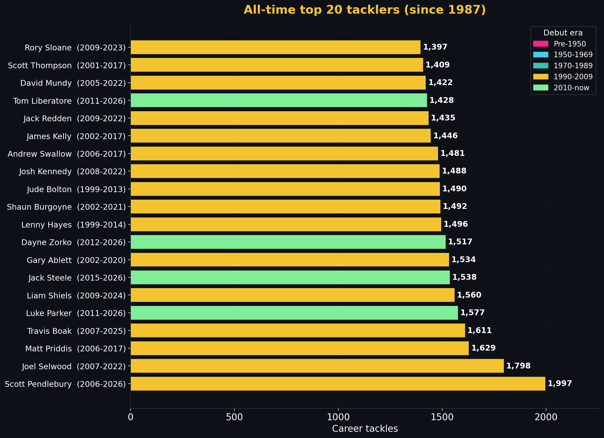

# AFL career tackles - all-time top 20

> [← Back to stat leaders hub](hall-of-fame-stat-leaders.md) | [← Hall of Fame](hall-of-fame.md) | [← README](../README.md)

*Published: 2026-05-25. Data layer: Scientist. Tactical layer: FootyStrategy.*

<!-- This file is part of the SuperCoach-VIA documentation. See README.md for the project overview. -->

## What this measures

A tackle is a contact possession against an opponent in possession that results in their disposal being affected (held, dispossessed, or pinged for holding-the-ball). It is the most direct measure of defensive pressure a single player applies. Unlike disposals or marks, tackling has no offensive value in isolation; it is the bookkeeping that captures how much physical work a player does to win the ball back when his team does not have it.

> **Data caveat.** Tackles were not officially recorded league-wide until 1987. Every player on this list played their career partly or wholly in the modern data era. Pre-1987 tacklers - Brereton, DiPierdomenico, Tony Shaw, Skilton, Stewart - are absent from the leaderboard simply because the numbers do not exist in the historical record.

## Top 20 - all-time career tackles

| # | Player | Club(s) | Span | Games | Tackles | Per game |
|--:|--------|---------|------|------:|--------:|---------:|
| 1 | Scott Pendlebury **[data]** | Collingwood | 2006-2026 | 433 | 1,997 | 4.61 |
| 2 | Joel Selwood **[data]** | Geelong | 2007-2022 | 355 | 1,798 | 5.06 |
| 3 | Matt Priddis **[data]** | West Coast | 2006-2017 | 240 | 1,629 | 6.79 |
| 4 | Travis Boak **[data]** | Port Adelaide | 2007-2025 | 387 | 1,611 | 4.16 |
| 5 | Luke Parker **[data]** | North Melbourne - Sydney | 2011-2026 | 326 | 1,577 | 4.84 |
| 6 | Liam Shiels **[data]** | Hawthorn - North Melbourne | 2009-2024 | 288 | 1,560 | 5.42 |
| 7 | Jack Steele **[data]** | Greater Western Sydney - Melbourne - St Kilda | 2015-2026 | 213 | 1,538 | 7.22 |
| 8 | Gary Ablett jnr **[data]** | Geelong - Gold Coast | 2002-2020 | 357 | 1,534 | 4.30 |
| 9 | Dayne Zorko **[data]** | Brisbane Lions | 2012-2026 | 311 | 1,517 | 4.88 |
| 10 | Lenny Hayes **[data]** | St Kilda | 1999-2014 | 297 | 1,496 | 5.04 |
| 11 | Shaun Burgoyne **[data]** | Hawthorn - Port Adelaide | 2002-2021 | 407 | 1,492 | 3.67 |
| 12 | Jude Bolton **[data]** | Sydney | 1999-2013 | 325 | 1,490 | 4.58 |
| 13 | Josh Kennedy **[data]** | Hawthorn - Sydney | 2008-2022 | 290 | 1,488 | 5.13 |
| 14 | Andrew Swallow **[data]** | Kangaroos - North Melbourne | 2006-2017 | 224 | 1,481 | 6.61 |
| 15 | James Kelly **[data]** | Essendon - Geelong | 2002-2017 | 313 | 1,446 | 4.62 |
| 16 | Jack Redden **[data]** | Brisbane Lions - West Coast | 2009-2022 | 263 | 1,435 | 5.46 |
| 17 | Tom Liberatore **[data]** | Western Bulldogs | 2011-2026 | 261 | 1,428 | 5.47 |
| 18 | David Mundy **[data]** | Fremantle | 2005-2022 | 376 | 1,422 | 3.78 |
| 19 | Scott Thompson **[data]** | Adelaide - Melbourne | 2001-2017 | 308 | 1,409 | 4.57 |
| 20 | Rory Sloane **[data]** | Adelaide | 2009-2023 | 255 | 1,397 | 5.48 |

## FootyStrategy tactical read

**Pendlebury is closing on 2,000 career tackles.** Pendlebury 1,997 tackles **[data]** through Round 12, 2026 - he will become the first player to clear 2,000 in the next handful of games. Selwood retired at 1,798 **[data]**; Priddis at 1,629 **[data]** in only 240 games shows the highest density rate of any top-10 player. *Conditioner lens:* a 4-5 tackle-per-game career average sustained across 350+ games is the modern defensive midfielder template, and only a small number of midfield roles produce it. Tagger-stoppers like Hayes and Bolton; contested-ball winners like Priddis, Steele, Swallow; chase-and-pressure midfielders like Pendlebury and Selwood. The shape of the role determines the tackle rate.

**The post-2010 spike at the top of the rate chart.** Steele 7.22/game **[data]**, Swallow 6.61 **[data]**, Priddis 6.79 **[data]**, Liberatore 5.47 **[data]** - the highest per-game tackle rates in the top 20 all sit in the 2010s. *Tempo Architect lens:* the modern game's transition speed and the demand for forward-50 pressure has shifted the role expectation. Every team carries one or two pure pressure midfielders whose job description is "tackle, tackle again, win the ground ball". The 1990s tagger averaged 3-4 tackles per game; the modern equivalent averages 6+. This is a position-design change, not a fitness change.

**Pendlebury's mix.** Pendlebury is the only player on the list whose tackle total is built primarily on volume-of-games rather than density-of-pressure. His 4.61/game **[data]** is the second-lowest rate in the top 10 (only Burgoyne 3.67 **[data]** at #11 is lower). *Match-up Tactician lens:* Pendlebury's tackle profile is the inside-clearance two-handed wrap, deployed at the centre square, rather than the chase-down forward-50 tackle. Volume × longevity × moderate rate = #1 career total. Steele or Liberatore, if they sustain their per-game rates over another 5 years, could overhaul him.

**The five 1,500+ tackle careers.** Pendlebury 1,997 **[data]**, Selwood 1,798 **[data]**, Priddis 1,629 **[data]**, Boak 1,611 **[data]**, Parker 1,577 **[data]**, Shiels 1,560 **[data]**, Steele 1,538 **[data]**, Ablett 1,534 **[data]**, Zorko 1,517 **[data]** - nine players cleared 1,500 tackles in their careers (Steele active). *Talent Developer lens:* every one is a midfielder. No defender, no forward, no ruckman appears on the list. Even the best key-position tacklers (Hodge, Cripps when used forward, Eddie Betts as the harassing small forward) do not approach the volume because their match exposure is shorter in clearance-zone time.

**The pre-1987 silence.** The most honest statement this list makes is implicit: the entire pre-1987 generation of hard tacklers is missing. Robert DiPierdomenico, Tony Shaw, Bobby Skilton, Mark Williams, Dermott Brereton - all of them, if their tackle data existed, would have produced totals competitive with the modern list. *Culture Custodian lens:* the tackle as a recorded stat is itself a 1980s invention; the *action* predates the data by a century. The reason 1990s-onwards midfielders dominate is purely a recording artefact.

## Data coverage

- **Tackles recorded league-wide from 1987.** Pre-1987 career tackles are not in the data.
- **The recording standard has been consistent since 1987**, with no major methodology shift comparable to the 2017 hit-out change.
- **Finals tackles are included** in the per-game CSVs.

## Methodology

Sum of per-game `tackles` field across each player's career; per-game rate is total ÷ games_played.

---

> Auto-generated table from `docs/hall-of-fame/_stat_leaders.json`. Reproduce by running `docs/hall-of-fame/compute_stat_leaders.py`.
