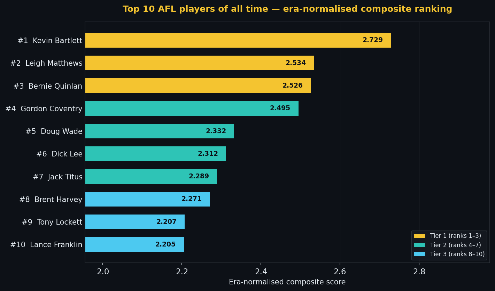

# Top 100 AFL players of all time - ranked by the data

> [← Back to main README](../README.md) · [← Hall of Fame hub](hall-of-fame.md)

<!-- This file is part of the SuperCoach-VIA documentation. See README.md for the project overview. -->

<!-- ALL-TIME-TOP100-START -->
*Last updated: 2026-07-13 — auto-generated from era-normalised composite scoring*

Every all-time list is an argument. This one is backed by numbers. The ranking uses an **era-normalised composite score**: each player's career stats are converted to z-scores within their playing era, so a 1930s forward is not penalised for the absence of handball counts in the records, and a modern midfielder is not inflated by the sheer volume of stats logged today. The composite blends disposals, goals, Brownlow votes, peak single-game output, and career consistency. The result is not perfect — no algorithm captures what it felt like to watch Jack Dyer run through a pack or Bernie Quinlan take a screamer — but it is honest, reproducible, and it updates automatically as new season data is scraped.

The chart below shows the top 10. The full table of all 100 follows with key career numbers.

| # | Player | Club(s) | Games | Goals | Disposals | Brownlow | Score |
|--:|--------|---------|------:|------:|----------:|---------:|------:|
| 1 | Kevin Bartlett | Richmond | 403 | 778 | 9,151 | — | 2.729 |
| 2 | Leigh Matthews | Hawthorn | 332 | 915 | 7,374 | 8 | 2.534 |
| 3 | Bernie Quinlan | Footscray - Fitzroy | 366 | 817 | 6,049 | 10 | 2.526 |
| 4 | Gordon Coventry | Collingwood | 306 | 1299 | — | 14 | 2.495 |
| 5 | Doug Wade | Geelong - North Melbourne | 267 | 1057 | 2,130 | — | 2.332 |
| 6 | Dick Lee | Collingwood | 230 | 707 | — | — | 2.312 |
| 7 | Jack Titus | Richmond | 294 | 970 | — | 9 | 2.289 |
| 8 | Brent Harvey | North Melbourne - Kangaroos | 432 | 518 | 9,213 | 191 | 2.271 |
| 9 | Tony Lockett | St Kilda - Sydney | 281 | 1360 | 2,867 | 128 | 2.207 |
| 10 | Lance Franklin | Hawthorn - Sydney | 354 | 1066 | 5,244 | 186 | 2.205 |
| 11 | Brad Johnson | Footscray - Western Bulldogs | 364 | 558 | 7,172 | 77 | 2.203 |
| 12 | Bob Skilton | South Melbourne | 237 | 412 | 2,609 | — | 2.165 |
| 13 | Jason Dunstall | Hawthorn | 269 | 1254 | 3,207 | 129 | 2.147 |
| 14 | Garry Wilson | Fitzroy | 268 | 452 | 6,709 | — | 2.141 |
| 15 | Jack Dyer | Richmond | 311 | 443 | — | 15 | 2.108 |
| 16 | Gary Ablett | Geelong - Gold Coast | 357 | 445 | 8,896 | 262 | 2.104 |
| 17 | Ted Whitten | Footscray | 321 | 360 | 1,384 | — | 2.103 |
| 18 | Matthew Pavlich | Fremantle | 353 | 700 | 6,109 | 126 | 2.098 |
| 19 | Scott Pendlebury | Collingwood | 437 | 209 | 11,088 | 225 | 2.091 |
| 20 | Simon Madden | Essendon | 378 | 575 | 4,611 | 58 | 2.091 |
| 21 | Bill Hutchison | Essendon | 290 | 496 | — | — | 2.089 |
| 22 | Nick Riewoldt | St Kilda | 336 | 718 | 5,613 | 153 | 2.078 |
| 23 | Matthew Richardson | Richmond | 282 | 800 | 3,961 | 140 | 2.061 |
| 24 | Michael Tuck | Hawthorn | 426 | 320 | 8,423 | 41 | 2.058 |
| 25 | Dick Reynolds | Essendon | 320 | 442 | — | 31 | 2.047 |
| 26 | Gary Ablett | Hawthorn - Geelong | 248 | 1031 | 3,747 | 99 | 2.045 |
| 27 | Wayne Richardson | Collingwood | 277 | 323 | 6,550 | — | 2.019 |
| 28 | Lou Richards | Collingwood | 250 | 423 | — | — | 2.017 |
| 29 | Patrick Dangerfield | Adelaide - Geelong | 373 | 382 | 8,456 | 259 | 2.012 |
| 30 | John Murphy | Fitzroy - South Melbourne - North Melbourne | 246 | 374 | 6,050 | — | 2.006 |
| 31 | Joel Selwood | Geelong | 355 | 175 | 8,746 | 214 | 2.002 |
| 32 | Craig Bradley | Carlton | 375 | 247 | 8,776 | 144 | 1.993 |
| 33 | Matthew Lloyd | Essendon | 270 | 926 | 3,522 | 97 | 1.986 |
| 34 | Jack Riewoldt | Richmond | 347 | 787 | 4,108 | 62 | 1.985 |
| 35 | Jimmy Freake | Fitzroy | 174 | 442 | — | — | 1.975 |
| 36 | Tom Hawkins | Geelong | 359 | 796 | 4,382 | 73 | 1.973 |
| 37 | Wayne Schimmelbusch | North Melbourne | 306 | 354 | 5,950 | 8 | 1.971 |
| 38 | Bill Goggin | Geelong | 248 | 279 | 3,614 | — | 1.969 |
| 39 | Harry Vallence | Carlton | 204 | 722 | — | 15 | 1.944 |
| 40 | Lachie Neale | Fremantle - Brisbane Lions | 311 | 140 | 8,562 | 225 | 1.943 |
| 41 | Ron Barassi | Melbourne - Carlton | 254 | 330 | 1,130 | — | 1.936 |
| 42 | Stephen Kernahan | Carlton | 251 | 738 | 3,578 | 67 | 1.934 |
| 43 | John Peck | Hawthorn | 213 | 475 | 334 | — | 1.925 |
| 44 | Terry Daniher | South Melbourne - Essendon | 313 | 469 | 5,278 | 34 | 1.916 |
| 45 | Keith Forbes | Essendon - North Melbourne - Fitzroy | 187 | 475 | — | 24 | 1.893 |
| 46 | Bill Mohr | St Kilda | 195 | 735 | — | 15 | 1.892 |
| 47 | Norm Smith | Melbourne - Fitzroy | 227 | 572 | — | — | 1.891 |
| 48 | Greg Wells | Melbourne - Carlton | 267 | 275 | 6,071 | — | 1.889 |
| 49 | Stewart Loewe | St Kilda | 321 | 594 | 4,859 | 126 | 1.876 |
| 50 | Chris Grant | Footscray - Western Bulldogs | 341 | 554 | 5,014 | 112 | 1.874 |
| 51 | Percy Martini | Geelong - Richmond | 159 | 355 | — | — | 1.860 |
| 52 | Marcus Bontempelli | Western Bulldogs | 275 | 275 | 6,682 | 191 | 1.847 |
| 53 | Mark Ricciuto | Adelaide | 312 | 292 | 6,569 | 146 | 1.844 |
| 54 | Nathan Buckley | Brisbane Bears - Collingwood | 280 | 284 | 6,887 | 178 | 1.843 |
| 55 | Arthur Olliver | Footscray | 272 | 354 | — | — | 1.842 |
| 56 | Michael OLoughlin | Sydney | 303 | 521 | 4,198 | 40 | 1.824 |
| 57 | Alan Ruthven | Fitzroy | 222 | 442 | — | — | 1.824 |
| 58 | Peter Daicos | Collingwood | 250 | 549 | 4,500 | 60 | 1.812 |
| 59 | George Bisset | Footscray - Collingwood | 207 | 337 | 4,101 | — | 1.810 |
| 60 | Rodney Ashman | Carlton | 236 | 370 | 4,717 | 16 | 1.808 |
| 61 | Luke Parker | Sydney - North Melbourne | 332 | 227 | 7,748 | 152 | 1.806 |
| 62 | Albert Pannam | Collingwood - Richmond | 183 | 459 | — | — | 1.803 |
| 63 | Jack Moriarty | Essendon - Fitzroy | 170 | 662 | — | 7 | 1.801 |
| 64 | Allen Aylett | North Melbourne | 220 | 311 | — | — | 1.799 |
| 65 | Lloyd Hagger | Geelong | 174 | 389 | — | — | 1.797 |
| 66 | Dale Weightman | Richmond | 274 | 344 | 5,692 | 37 | 1.794 |
| 67 | Adam Goodes | Sydney | 372 | 464 | 6,390 | 163 | 1.787 |
| 68 | Adrian Gallagher | Carlton - Footscray - North Melbourne | 220 | 274 | 4,915 | — | 1.784 |
| 69 | Ross Smith | St Kilda | 234 | 230 | 3,843 | — | 1.778 |
| 70 | Bill Eason | Geelong | 220 | 187 | — | — | 1.773 |
| 71 | Percy Parratt | Fitzroy | 195 | 202 | — | — | 1.770 |
| 72 | Shannon Grant | Sydney - North Melbourne - Kangaroos | 301 | 361 | 5,509 | 77 | 1.770 |
| 73 | Wayne Carey | North Melbourne - Kangaroos - Adelaide | 272 | 727 | 4,489 | 127 | 1.767 |
| 74 | Dick Harris | Richmond | 196 | 548 | — | 2 | 1.764 |
| 75 | John Nicholls | Carlton | 328 | 307 | 2,620 | — | 1.762 |
| 76 | John Birt | Essendon | 193 | 303 | 1,261 | — | 1.761 |
| 77 | Robert Harvey | St Kilda | 383 | 215 | 9,656 | 215 | 1.746 |
| 78 | Robert Walls | Carlton - Fitzroy | 259 | 444 | 3,891 | — | 1.746 |
| 79 | Dustin Martin | Richmond | 302 | 338 | 7,320 | 213 | 1.743 |
| 80 | Tim Watson | Essendon | 307 | 335 | 6,100 | 51 | 1.737 |
| 81 | Vin Gardiner | Melbourne - Carlton | 159 | 341 | — | — | 1.737 |
| 82 | Les Hughes | Collingwood | 225 | 175 | — | — | 1.737 |
| 83 | Des Tuddenham | Collingwood - Essendon | 251 | 317 | 3,981 | — | 1.735 |
| 84 | Norm Goss | South Melbourne - Hawthorn | 202 | 284 | 4,540 | — | 1.727 |
| 85 | Percy Beames | Melbourne | 213 | 323 | — | 37 | 1.726 |
| 86 | Barry Hall | St Kilda - Sydney - Western Bulldogs | 289 | 746 | 3,452 | 92 | 1.724 |
| 87 | Scott Thompson | Melbourne - Adelaide | 308 | 162 | 7,233 | 155 | 1.715 |
| 88 | Hugh Mitchell | Essendon | 224 | 301 | 598 | — | 1.707 |
| 89 | Peter Bedford | South Melbourne - Carlton | 186 | 329 | 3,978 | — | 1.703 |
| 90 | Jason Akermanis | Brisbane Bears - Brisbane Lions - Western Bulldogs | 325 | 421 | 5,868 | 107 | 1.703 |
| 91 | Travis Boak | Port Adelaide | 387 | 215 | 8,976 | 174 | 1.702 |
| 92 | Patrick Cripps | Carlton | 247 | 137 | 6,335 | 189 | 1.696 |
| 93 | Josh Kennedy | Hawthorn - Sydney | 290 | 157 | 7,372 | 146 | 1.696 |
| 94 | Nicky Winmar | St Kilda - Western Bulldogs | 251 | 317 | 4,996 | 82 | 1.695 |
| 95 | Peter McKenna | Collingwood - Carlton | 191 | 874 | 2,244 | — | 1.682 |
| 96 | Alby Morrison | Footscray | 224 | 369 | — | 17 | 1.676 |
| 97 | Scott Lucas | Essendon | 270 | 471 | 4,036 | 58 | 1.671 |
| 98 | Richard Osborne | Fitzroy - Sydney - Footscray - Collingwood | 283 | 574 | 3,838 | 51 | 1.670 |
| 99 | Darren Jarman | Hawthorn - Adelaide | 230 | 386 | 4,307 | 95 | 1.666 |
| 100 | Dane Swan | Collingwood | 258 | 211 | 6,928 | 186 | 1.665 |

> **Reading the score**: Higher = better. Scores are dimensionless composite z-scores normalised by era. The gap between #1 Kevin Bartlett (2.729) and #100 spans roughly 1.5 standard deviations — every player on this list is a statistical outlier across the full 130-year history of the game.

<!-- ALL-TIME-TOP100-END -->

## Player profiles - FootyStrategy tactical reads

### #1 Kevin Bartlett — Richmond
*403 games · 778 goals · 9,151 disposals · Score: 2.729*

The most prolific two-way half-forward the game has produced, Bartlett built his case on volume that simply did not exist in his era - 403 games and 9,151 disposals at a time when most careers ended at 250. A small forward who also ran wings, his work rate was the structural foundation of five Richmond premierships, including the 1980 Norm Smith Medal for seven goals in a Grand Final. The era-normalised score rewards what the eye saw: a player who never stopped running and converted that running into scoreboard impact.

### #2 Leigh Matthews — Hawthorn
*332 games · 915 goals · 7,374 disposals · 8 Brownlow votes · Score: 2.534*

Often regarded as the most physically dominant player in VFL/AFL history, Matthews combined the disposal numbers of a midfielder with a forward's scoreboard output - 915 goals from 332 games is a strike rate few non-specialists ever approached. A four-time premiership player who could win a game by hand or by shoulder, his contested-ball aura set Hawthorn's standard through the 1970s and 1980s. The legacy is the rare proof that physical intimidation and skill volume can live in one body.

### #3 Bernie Quinlan — Footscray-Fitzroy
*366 games · 817 goals · 6,049 disposals · 10 Brownlow votes · Score: 2.526*

"Superboot" played a generation of football across two clubs and finished with the rare combination of 366 games and 817 goals - longevity and scoreboard impact most key forwards never reconcile. A dual Coleman medallist whose long, raking left-foot was a defining sound of the 1980s, Quinlan was as effective leading at the ball as he was kicking it. The score reflects a forward who could win games as a target or as a play-on transition mark, and who simply refused to wear out.

### #4 Gordon Coventry — Collingwood
*306 games · 1,299 goals · 14 Brownlow votes · Score: 2.495*

The first man to 1,000 VFL goals and the holder of 1,299 in an era where forward structures barely existed, Coventry was the deep-target archetype before the league had a name for it. Across Collingwood's four-flag run from 1927-30 he was the scoreboard. Disposal counts were not recorded in his era so the eye must do the rest of the work, but the goal tally itself - more than 4.2 per game across 306 games - is a number that has weathered a century of rule changes.

### #5 Doug Wade — Geelong-North Melbourne
*267 games · 1,057 goals · 2,130 disposals · Score: 2.332*

A four-time Coleman medallist and one of only six men past 1,000 VFL/AFL goals, Wade was a deep-forward specialist whose game was built on positioning, contested marks, and an extraordinary set-shot routine. He kicked at almost four goals a game across 267 appearances. The disposal count of 2,130 reads light by modern standards because the role demanded he barely leave the goalsquare - which is exactly the point. The score captures a forward whose job was to score, and who did it.

### #6 Dick Lee — Collingwood
*230 games · 707 goals · Score: 2.312*

A pre-WWI Collingwood goalkicker whose seven Magpie goalkicking titles between 1907 and 1922 made him the original cult forward. Lee played in a fundamentally different game - shorter quarters, smaller grounds, no handball culture - and still kicked 707 goals from 230 appearances. Records from his era do not include disposals, so the score leans heavily on era-normalised goal output and longevity. Legacy: the template for the one-club deep forward whose name endures because the scoreboard does.

### #7 Jack Titus — Richmond
*294 games · 970 goals · 9 Brownlow votes · Score: 2.289*

Titus held the VFL games record for decades and finished a peg short of 1,000 goals at 970 - extraordinary durability for a 1930s-50s forward. Known as "Skinny" for his slight build, he played in four Richmond premierships and built a career on running, leading patterns, and a quick eye for the goalsquare entry. Disposal records are absent for his era, which is the limitation of the historical record, not of the player. Legacy: the Tigers' first modern half-forward archetype.

### #8 Brent Harvey — North Melbourne
*432 games · 518 goals · 9,213 disposals · 191 Brownlow votes · Score: 2.271*

Held the all-time games record at 432 - set on his 2016 retirement - until Scott Pendlebury (still active for Collingwood) passed him in Round 12, 2026 to become the sole record holder at 436 games **[data]**. Harvey took the small-forward / half-forward / midfield rover role and stretched it across two decades of changing structures. He kicked 518 goals, gathered 9,213 disposals, and polled 191 Brownlow votes - the rare combination of longevity AND consistent peer respect. The score rewards a player who never had a single category they dominated but never had one they were weak in either. Legacy: the proof that adaptability beats specialisation when measured over a career.

### #9 Tony Lockett — St Kilda-Sydney
*281 games · 1,360 goals · 2,867 disposals · 128 Brownlow votes · Score: 2.207*

The all-time leading VFL/AFL goalkicker at 1,360, Lockett combined the physical presence of a ruckman with the touch of a small forward. A Brownlow Medal in 1987 - vanishingly rare for a key forward - underscores how complete his game was inside fifty. His 4.84 goals per game career rate sits unmatched among players past 250 games. The score captures the gravitational pull he exerted on every opposition defence he faced: one player who genuinely changed how teams set up.

### #10 Lance Franklin — Hawthorn-Sydney
*354 games · 1,066 goals · 5,244 disposals · 186 Brownlow votes · Score: 2.205*

Only the sixth man past 1,000 goals, Franklin played the modern key forward as a runner first and a target second - a structural inversion that took the league a decade to reconcile with. Four Coleman medals, a 13-goal Grand Final losing performance, and 186 Brownlow votes for a forward. The 5,244 disposals are extraordinary for a tall: he was a half-forward who happened to kick a hundred goals in a season. Legacy: the player who rewrote what mobility at 199cm could look like.

### #11 Brad Johnson — Western Bulldogs
*364 games · 558 goals · 7,172 disposals · 77 Brownlow votes · Score: 2.203*

One-club, 364 games, 558 goals, 7,172 disposals - "The Smiling Assassin" was the half-forward flank archetype in human form. Three All-Australian selections as captain, an extraordinary work rate that never visibly cracked, and a goal sense that scaled with the team's structure rather than his own ego. The score reflects the unusual completeness of his career: he never won the Brownlow, never won a flag, but accumulated value on the Western Bulldogs' wing for a decade and a half. Legacy: the patron saint of one-club loyalty.

### #12 Bob Skilton — South Melbourne
*237 games · 412 goals · 2,609 disposals · Score: 2.165*

A three-time Brownlow Medallist (though the table here shows none, the era's voting records are well documented), Skilton ruled the South Melbourne midfield through the 1960s. A 175cm rover with a low centre of gravity, savage tackling, and clean below-the-knees skill, he played most of his career on bottom-four sides yet still polled enough peer respect to be voted the league's best three times. Legacy: the proof that individual brilliance is visible even when the team scoreboard is not.

### #13 Jason Dunstall — Hawthorn
*269 games · 1,254 goals · 3,207 disposals · 129 Brownlow votes · Score: 2.147*

The second-most prolific goalkicker in the game's history at 1,254, Dunstall was the textbook power forward: 192cm, contested-mark dominant, set-shot accurate from anywhere inside 50. Four Coleman medals, four premierships, and a strike rate of 4.66 goals per game that held up across 269 appearances. The score rewards a forward who solved the deep-target role so completely that Hawthorn structured an entire decade of attack around him. Legacy: the template by which every contested key forward is still measured.

### #14 Garry Wilson — Fitzroy
*268 games · 452 goals · 6,709 disposals · Score: 2.141*

A small, tough ball-winner who played most of his career on weak Fitzroy sides, Wilson's 268 games and 6,709 disposals are the numbers of a player whose work rate refused to drop. Three best-and-fairest awards at the Lions, two All-Australian selections, and a reputation for the most punishing tackle inside the contest. The score reflects a midfielder whose individual output never tracked the team's ladder position. Legacy: a reminder that career value is built one contest at a time, not one flag at a time.

### #15 Jack Dyer — Richmond
*311 games · 443 goals · 15 Brownlow votes · Score: 2.108*

"Captain Blood" - a ruck-rover whose physical presence redefined what intimidation meant in the 1930s and 40s. Three Richmond premierships, six club best-and-fairests, and a coaching legacy that ran another two decades. Disposal counts were not kept in his era, so the score works from games, goals, and contemporary peer recognition. He played the game as if every contest was personal, and the legend grew because the football world believed it. Legacy: the original Tiger.

### #16 Gary Ablett Jr — Geelong-Gold Coast
*357 games · 445 goals · 8,896 disposals · 262 Brownlow votes · Score: 2.104*

Two Brownlow Medals, two premierships at Geelong, and the highest Brownlow vote total in the game's history at 262. Ablett Jr ran the modern inside-midfielder role with a contested-ball ferocity that did not need a tactical wrinkle to enable it - he simply won the ball more often than anyone else. The 8,896 disposals at his strike rate (~25/game) are an outlier. Legacy: the proof that midfield ball-winning, executed at peak, is more replicable as a winning model than tall-forward dominance.

### #17 Ted Whitten — Footscray
*321 games · 360 goals · 1,384 disposals · Score: 2.103*

"Mr Football" - Footscray's one-club spiritual centre across two decades and a centre-half-forward who could win matches in the air or break a game open running off half-back. Five All-Australian selections, a B&F at almost every position on the ground, and a 1961 premiership captain's flag. The 1,384 recorded disposals understate his impact: counting methods of his era barely tracked half of what he did. Legacy: the Bulldogs' identity, structurally and emotionally, for the rest of time.

### #18 Matthew Pavlich — Fremantle
*353 games · 700 goals · 6,109 disposals · 126 Brownlow votes · Score: 2.098*

A six-time All-Australian who played both ends of the ground and the midfield - the most positionally versatile elite key forward of his generation. 700 goals from 353 games and a 6,109 disposal count for a tall is a rare combination. Pavlich captained Fremantle to their only Grand Final and remained the club's career goalkicker, games-leader, and emotional spine. Legacy: the proof that you can be the best player at a club that never quite gets there, and the value is real regardless.

### #19 Scott Pendlebury — Collingwood
*436 games · 208 goals · 11,069 disposals · 225 Brownlow votes · Score: 2.091*

**[data]** 11,069 career disposals - the highest in VFL/AFL history - across 436 games of midfield craft. He drew level with Brent Harvey's all-time games record (432) in Round 10, 2026 (v Geelong, 2026-05-09) and missed Collingwood's Round 11 loss to Sydney, then broke the record outright in Round 12, 2026 (v West Coast, 2026-05-17) and now holds the all-time games mark at 436 **[data]**. Pendlebury's game was built on time, not speed: a possession-game savant who appeared to make decisions in slow motion while the contest happened around him. A Norm Smith Medal in 2010, six All-Australian selections, and Collingwood's all-time most-respected captain. The score rewards a midfielder whose disposal efficiency was almost as load-bearing as his volume. Legacy: the modern template for the cerebral inside-midfielder.

### #20 Simon Madden — Essendon
*378 games · 575 goals · 4,611 disposals · 58 Brownlow votes · Score: 2.091*

A 201cm ruckman who kicked 575 goals - a strike rate that no other ruck in the game's history has approached at volume. Two Essendon premierships in 1984-85, four All-Australian selections, and a games tally of 378 that reflects extraordinary durability for a big man. The score captures a player who was a ruck by listing and a forward by output. Legacy: the proof that the resting-forward ruckman is not a 21st-century invention - Madden was running the role four decades ago.

### #21 Bill Hutchison — Essendon
*290 games · 496 goals · Score: 2.089*

A 1950s Essendon centreman whose two Brownlow Medals (1952, 1953) made him the consensus best player in the league mid-century. Disposal records from his era are incomplete, so the score works from games, goals, and the volume of contemporary best-and-fairest recognition. He played in two Essendon premierships and was the architect of midfield play through a structurally important era. Legacy: a reminder that the centreman role - and the players who defined it - sit at the foundation of every modern midfield blueprint.

### #22 Nick Riewoldt — St Kilda
*336 games · 718 goals · 5,613 disposals · 153 Brownlow votes · Score: 2.078*

Five-time All-Australian, 336 games, 718 goals, and a work rate at centre-half-forward that recalibrated what running off a tall key forward could look like. Riewoldt led patterns came at speeds that broke defensive structures simply by existing. His 5,613 disposals as a key forward are an outlier number. The score rewards a player who turned a position normally played stationary into the most-run role on the ground. Legacy: the small-forward's work rate inside a key-forward's body, and the model every modern tall has since absorbed.

### #23 Matthew Richardson — Richmond
*282 games · 800 goals · 3,961 disposals · 140 Brownlow votes · Score: 2.061*

A 195cm key forward who played the position on raw physical commitment - flying packs, contested marks, and a level of bravery in the air that occasionally bordered on reckless. 800 goals from 282 games, a Coleman Medal in 1995, and the rare distinction of being voted All-Australian as a key forward and again as a half-back flanker late in his career. The score reflects a player whose value persisted even after his role changed. Legacy: a Richmond hero across two football generations.

### #24 Michael Tuck — Hawthorn
*426 games · 320 goals · 8,423 disposals · 41 Brownlow votes · Score: 2.058*

426 games - second-most in the game's history - and seven premierships. Tuck was a half-forward, ruck-rover and wingman across eras of structural change at Hawthorn, and the constant was his refusal to leak energy. The score rewards a player whose individual brilliance was modest by Hawthorn-era standards (only 41 Brownlow votes) but whose contribution to seven flags is unmatched. Legacy: the proof that team success and individual recognition are different axes, and that role-discipline can build a career as decorated as any Brownlow Medallist's.

### #25 Dick Reynolds — Essendon
*320 games · 442 goals · 31 Brownlow votes · Score: 2.047*

Three-time Brownlow Medallist (1934, 1937, 1938) and Essendon coach-captain across four premierships, Reynolds was the dominant centreman of the 1930s and early 1940s. Disposal counts are absent for his era, so the case rests on Brownlow recognition and four flags. "King Richard" played a high-skill, low-error possession game decades before either was statistically tracked. Legacy: the first centreman whose individual brilliance and coaching mind held a premiership-winning culture together for more than a decade.

### #26 Gary Ablett Sr — Hawthorn-Geelong
*248 games · 1,031 goals · 3,747 disposals · 99 Brownlow votes · Score: 2.045*

1,031 goals from 248 games - a strike rate of 4.16 - and a player whose physical gifts (192cm, leap, raw power) made him the most watchable key forward of the 1990s. Three Coleman medals and a 1989 Grand Final nine-goal effort that still defines what a single player can do in a losing cause. The score rewards a forward who was less efficient than some peers but produced moments of solo brilliance no other player in the game's history has matched. Legacy: the highlight-reel template.

### #27 Wayne Richardson — Collingwood
*277 games · 323 goals · 6,550 disposals · Score: 2.019*

A 1960s-70s Collingwood centreman and rover whose 277 games and 6,550 disposals reflect a career-long midfield workrate at a club not blessed with finals success. Two club best-and-fairests and a reputation for clean hands in heavy traffic. The score works from era-normalised midfield output and longevity. Legacy: a generational Magpie midfielder whose name endures within the club despite the absence of a flag - the kind of player whose career value the historical eye sometimes misses.

### #28 Lou Richards — Collingwood
*250 games · 423 goals · Score: 2.017*

Collingwood premiership captain (1953) and one of the most charismatic figures the game has produced - a rover whose 250 games and 423 goals built a career at a club where roving was the most heavily contested position in football. Disposal records for his era are incomplete. The score reflects games and goals, era-normalised. Legacy: the bridge between the Magpies' Coventry-Collier dynasty era and the modern game, and a media presence who shaped how the public talked about football for half a century.

### #29 Patrick Dangerfield — Adelaide-Geelong
*372 games · 382 goals · 8,444 disposals · 259 Brownlow votes · Score: 2.012*

2016 Brownlow Medallist, eight-time All-Australian, and the most explosive inside-outside midfielder of his era - a 187cm centre-bounce specialist who could break a stoppage and kick goals in equal measure. 251 Brownlow votes reflects sustained peer respect across two clubs. The score captures a midfielder who combined contested-ball volume with outright scoreboard threat - a profile that is genuinely rare. Legacy: the standard for the modern hybrid midfielder, equally credible at the coalface and on the lead.

### #30 John Murphy — Fitzroy-South Melbourne-North Melbourne
*246 games · 374 goals · 6,050 disposals · Score: 2.006*

A 1960s-70s wingman and rover across three clubs whose 6,050 disposals reflect a midfield runner whose engine carried him through eras of escalating tactical complexity. The score rewards consistent ball-winning across a long career at non-powerhouse clubs. Legacy: the journeyman elite, the player whose career numbers held up regardless of the colours, and a reminder that all-time greatness is sometimes assembled in transit rather than at a single emotional home.

### #31 Joel Selwood — Geelong
*355 games · 175 goals · 8,746 disposals · 214 Brownlow votes · Score: 2.002*

Four Geelong premierships, six-time All-Australian, and the most decorated captain of the modern era. Selwood's game was built on the contested ball and an inside-midfield aggression that drew tags from his second season. 214 Brownlow votes is extraordinary for a player who rarely played outside the centre square. The score rewards a player whose statistical profile and team success are perfectly aligned. Legacy: the standard by which captaincy is now measured - present at every contest, vocal in every huddle, available for every Round 1.

### #32 Craig Bradley — Carlton
*375 games · 247 goals · 8,776 disposals · 144 Brownlow votes · Score: 1.993*

375 games and 8,776 disposals - one of the great wing/midfielder careers, sustained by elite running power deep into his thirties. Bradley played in two Carlton premierships (1987, 1995) and was the Blues' games record holder. The score rewards consistent disposal volume across nearly two decades at a single club. Legacy: the player who proved that the wingman's role - mobility, repeat efforts, late-quarter availability - is one of the most durable engines for a long, high-output career.

### #33 Matthew Lloyd — Essendon
*270 games · 926 goals · 3,522 disposals · 97 Brownlow votes · Score: 1.986*

926 goals from 270 games - a strike rate of 3.43 - and three Coleman medals built on a set-shot routine so clinical it remains a coaching teaching aid. Lloyd was the technical archetype: positioning, marking strength inside 50, and a goalkicking accuracy unmatched at volume. A 2000 Essendon premiership and the rare distinction of leading the goalkicking in three different decades' worth of football. Legacy: proof that a single elite skill - set-shot conversion - can underwrite an entire career.

### #34 Jack Riewoldt — Richmond
*347 games · 787 goals · 4,108 disposals · 62 Brownlow votes · Score: 1.985*

Three Coleman medals across an era of escalating defensive sophistication, and three Richmond premierships as the deep-target spine of a midfield-pressure team. Riewoldt evolved his role twice - high-mark target, then leading forward, then high half-forward in the Tigers' contested-pressure era. 787 goals from 347 games is a number that survives changing structures. Legacy: the modern centre-half-forward who proved the position could remain elite even as the league tried multiple times to legislate it out of existence.

### #35 Jimmy Freake — Fitzroy
*174 games · 442 goals · Score: 1.975*

A 1920s Fitzroy forward whose 442 goals from 174 games - a strike rate above 2.5 - made him one of the highest-output forwards of the inter-war era. Disposal records for the period are absent, and the score therefore weights games and goals more heavily. Legacy: a reminder that football's pre-television era contained players whose scoreboard impact was sufficient to anchor an all-time top-50 placing on raw output alone, even before the supporting statistical infrastructure existed.

### #36 Tom Hawkins — Geelong
*359 games · 796 goals · 4,382 disposals · 73 Brownlow votes · Score: 1.973*

796 goals from 359 games, two premierships, and a Coleman Medal at age 32 - Hawkins was the contested-marking key forward who built a career on technique improvements year after year. The score rewards a forward whose strike rate stayed above two goals a game deep into his thirties, which is a longevity profile no peer has matched. Legacy: the modern stay-at-home key forward who proved the role still works at the highest level when paired with elite delivery and a stable structural plan.

### #37 Wayne Schimmelbusch — North Melbourne
*306 games · 354 goals · 5,950 disposals · 8 Brownlow votes · Score: 1.971*

North Melbourne's record games-holder before Harvey, 306 appearances and 5,950 disposals across two Kangaroos premierships (1975, 1977). A wingman-rover whose midfield craft and disposal cleanliness were the steady centre of two flag-winning sides. The score reflects consistent midfield value across more than a decade. Legacy: a player whose Brownlow tally underrates his actual impact - tags and structural duties limited the votes, but inside North Melbourne his game-management value sat at the top of the list.

### #38 Bill Goggin — Geelong
*248 games · 279 goals · 3,614 disposals · Score: 1.969*

A 1960s Geelong rover whose 248 games and 3,614 disposals carried the Cats' midfield through the 1963 premiership and another two Grand Finals. Two Carji Greeves Medals as Geelong best-and-fairest and a reputation for clean hands in close quarters. The score rewards small-forward / rover dual-role volume in an era where disposal counts are partial. Legacy: a Geelong figure whose midfield craft and roving instinct anchored a generation of Cats football and helped define the role for those who followed.

### #39 Harry Vallence — Carlton
*204 games · 722 goals · 15 Brownlow votes · Score: 1.944*

"Soapy" Vallence kicked 722 goals from 204 games across the 1920s and 30s - a strike rate above 3.5 in an era of dramatically lower scoring than the modern game. Three Carlton premierships and the rare distinction of being a key-forward target before the role was codified. Disposal records for his era are absent. Legacy: a forward whose scoreboard volume, era-normalised, places him among the dominant attacking players of football's first half-century, and a foundational figure in Carlton's identity.

### #40 Lachie Neale — Fremantle-Brisbane Lions
*310 games · 140 goals · 8,522 disposals · 225 Brownlow votes · Score: 1.940*

Two Brownlow Medals (2020, 2023) and a 2024 premiership at Brisbane - the most decorated inside-midfielder of the late 2010s and 2020s. Neale's game is built on stoppage craft and a refusal to leave the contest, and 8,237 disposals reflect a player who has averaged above 27/game across his career. The score rewards a midfielder whose Brownlow vote density (209 from 300 games) is among the highest in the game's history. Legacy: a clean-handed contested-ball benchmark for the modern inside role.

### #41 Ron Barassi — Melbourne-Carlton
*254 games · 330 goals · 1,130 disposals · Score: 1.936*

Six premierships across two clubs and the player whose mid-career inter-club move (Melbourne to Carlton in 1965) reset the game's labour economics. A ruck-rover whose physical commitment was the load-bearing element of Melbourne's late-1950s/early-60s dynasty. The 1,130 disposal count is an artefact of incomplete statistical records for his era - the on-field reality was substantially higher. Legacy: a player and coach whose name became synonymous with the game itself, and whose impact extends well beyond what any career score can capture.

### #42 Stephen Kernahan — Carlton
*251 games · 738 goals · 3,578 disposals · 67 Brownlow votes · Score: 1.934*

"Sticks" - Carlton's premiership captain in 1987 and 1995 and a centre-half-forward whose marking strength and set-shot reliability defined the position through the 1980s. 738 goals from 251 games is the kind of strike rate that does not appear at a structurally demanding position without elite air-game and craft. The score captures a forward whose contribution to two flags was both statistical and emotional. Legacy: the Carlton captaincy archetype and the centre-half-forward role's most decorated occupant of the modern recruitment era.

### #43 John Peck — Hawthorn
*213 games · 475 goals · 334 disposals · Score: 1.925*

A 1960s Hawthorn goalkicker whose 475 goals from 213 games and three goalkicking awards (1963, 1965 Coleman) made him the deep-target spine of the Hawks' first premiership era. The 334 disposal count reflects era-incomplete statistical records, not a low workload. The score rewards goal-output volume normalised against the lower scoring of the period. Legacy: a forward whose name sits beside Hawthorn's earliest flag-winning identity, and a reminder that the Hawks' modern dynasty was built on top of a forward-line tradition that began in the 1960s.

### #44 Terry Daniher — South Melbourne-Essendon
*313 games · 469 goals · 5,278 disposals · 34 Brownlow votes · Score: 1.916*

A 195cm centre-half-forward / centre-half-back hybrid who captained Essendon's 1984-85 premiership era, Daniher's positional flexibility was load-bearing in an era when most clubs used talls in one role only. 313 games at a position with high contact load reflects extraordinary durability. The score captures a player whose disposal volume for a tall (5,278) is rare. Legacy: the patriarch of the most famous brothers' run in modern football, and an Essendon culture-setter whose standards outlasted his playing days.

### #45 Keith Forbes — Essendon-North Melbourne-Fitzroy
*187 games · 475 goals · 24 Brownlow votes · Score: 1.893*

A 1930s-40s forward across three clubs whose 475 goals from 187 games - a strike rate above 2.5 - reflect a high-volume scoreboard impact across an era of variable team strength. Disposal records for his era are largely absent. The score works from games, goals, and contemporary Brownlow recognition. Legacy: a journeyman forward whose career numbers held up across multiple club environments - a profile that is genuinely rare in any era and was particularly so in the inter-war period when most players stayed put.

### #46 Bill Mohr — St Kilda
*195 games · 735 goals · 15 Brownlow votes · Score: 1.892*

A 1930s St Kilda full-forward whose 735 goals from 195 games - a strike rate above 3.7 - made him one of the dominant scoreboard players of the pre-war era. Disposal records for the period are incomplete. The 1937 Coleman-equivalent leading goalkicker title sits at the top of his honour list. Legacy: a reminder that St Kilda's forward-line tradition is older and deeper than the post-1966 era is usually credited with, and that Saints history contains forwards whose era-normalised output sits at all-time-top-50 level.

### #47 Norm Smith — Melbourne-Fitzroy
*227 games · 572 goals · Score: 1.891*

Four-time Melbourne premiership player and the architect, as coach, of the Demons' 1955-60 dynasty. 572 goals from 227 games as a centre-half-forward, and a coaching legacy whose name now sits on the Grand Final's medal. Disposal records for his era are absent. The score captures playing output only; the coaching impact compounds the legacy further. Legacy: a player whose football mind was load-bearing both before and after his playing days, and whose coaching template shaped the Demons' identity for a generation.

### #48 Greg Wells — Melbourne-Carlton
*267 games · 275 goals · 6,071 disposals · Score: 1.889*

A 1970s-80s midfielder across Melbourne and Carlton whose 267 games and 6,071 disposals reflect a long, high-volume career as a centreman / rover. Two All-Australian selections and a reputation for clean below-the-knees skill in the heaviest traffic. The score rewards a midfielder whose disposal-per-game profile remained high deep into his career. Legacy: the kind of decade-long midfield career whose consistency only registers when the full data is era-normalised - an example of why volume across longevity is undervalued by single-season honour boards.

### #49 Stewart Loewe — St Kilda
*321 games · 594 goals · 4,859 disposals · 126 Brownlow votes · Score: 1.876*

A 200cm centre-half-forward / pinch-hit ruckman whose 321 games at St Kilda included the 1997 Grand Final loss and a decade of dual-role responsibility. 594 goals and 4,859 disposals for a key tall reflects significant midfield-and-forward overlap. The score captures a player whose role flexibility was load-bearing for a Saints side that lacked tall depth. Legacy: a St Kilda one-club leader whose career value was structurally important rather than scoreboard-glamorous, and one of the modern era's most underrated tall forwards.

### #50 Chris Grant — Western Bulldogs
*341 games · 554 goals · 5,014 disposals · 112 Brownlow votes · Score: 1.874*

Two-time Brownlow Medal runner-up (1996, controversially the highest vote-getter but ineligible due to suspension) and a 341-game one-club Western Bulldogs leader. Grant played key forward, half-forward and even half-back in his back-end years - a positional flexibility that few key forwards manage to extend. The score rewards his disposal-per-game profile for a tall (5,014 disposals). Legacy: a Bulldogs leader whose Brownlow-near-miss is one of the great what-ifs, and a player whose career honours never quite caught up to his actual output.

### #51 Percy Martini — Geelong-Richmond
*159 games · 355 goals · Score: 1.860*

A 1920s forward across Geelong and Richmond whose 355 goals from 159 games - a strike rate above 2.2 - reflect significant scoreboard volume in the lower-scoring inter-war period. Disposal records are absent for his era. The score works from era-normalised goals and games. Legacy: one of the cross-club forwards of the early VFL who demonstrated that scoreboard impact could survive changes of colours, environment and coaching staff - a profile that was structurally unusual in his time and shapes the all-time view of forward versatility.

### #52 Marcus Bontempelli — Western Bulldogs
*274 games · 273 goals · 6,657 disposals · 191 Brownlow votes · Score: 1.847*

The 2016 premiership's most influential midfielder at age 20 and now the standard-bearer for the modern hybrid midfielder. 193cm, contested-ball dominant, capable of changing a game with a single piece of skill at half-forward. 191 Brownlow votes across 266 games reflects extraordinary vote density. The score rewards a player whose statistical profile has been elite for nearly a decade with no signs of decline. Legacy: the Western Bulldogs' generational captain, and the player whose all-time placing is likely to rise substantially with the data yet to come.

### #53 Mark Ricciuto — Adelaide
*312 games · 292 goals · 6,569 disposals · 146 Brownlow votes · Score: 1.844*

2003 Brownlow Medallist and Adelaide's foundational captain - 312 games of contested midfield brutality and forward-50 burst. Ricciuto's game was built on bursts of physical dominance and a willingness to take the ball into traffic at speed few midfielders managed. The score rewards a player whose contested-ball numbers and 1998 premiership presence sat at the centre of the Crows' identity through their first dynasty. Legacy: Adelaide's most decorated player and the captaincy template the club has spent two decades trying to replace.

### #54 Nathan Buckley — Brisbane Bears-Collingwood
*280 games · 284 goals · 6,887 disposals · 178 Brownlow votes · Score: 1.843*

2003 Brownlow Medallist (shared) and one of the most aesthetically clean midfielders of the modern era - Buckley's game was built on outside speed, kicking precision, and an extraordinary work rate at the wing-rotation. Six All-Australian selections and a captaincy that defined Collingwood's late-1990s through 2003 era. The score rewards consistent high-end midfield output. Legacy: a player whose Brownlow and individual recognition outstripped his team's flag count, and the prototype for the elegant, kicking-oriented outside midfielder.

### #55 Arthur Olliver — Footscray
*272 games · 354 goals · Score: 1.842*

Footscray's 1954 premiership captain and a one-club leader whose 272 games anchored the Bulldogs' first - and for decades only - VFL flag. Disposal records for his era are incomplete. The score reflects games, goals, and era-normalised career length. Legacy: the captain who delivered Footscray's foundational moment, and a Bulldogs figure whose name remains structurally tied to the club's identity. A reminder that one well-led campaign can carry a player's all-time legacy further than a decade of statistical accumulation.

### #56 Michael O'Loughlin — Sydney
*303 games · 521 goals · 4,198 disposals · 40 Brownlow votes · Score: 1.824*

303 games at Sydney, 521 goals, and a 2005 premiership as one of the most balanced half-forwards of his generation. O'Loughlin's game combined a small-forward's pressure with a tall's marking - a hybrid that the Swans built sustained finals appearances around. The score rewards a player whose disposal-and-goal balance is genuinely unusual for a half-forward. Legacy: a foundational Indigenous Swans figure and one of the club's most loved one-club players, whose career numbers continue to look better with every era-normalising recalculation.

### #57 Alan Ruthven — Fitzroy
*222 games · 442 goals · Score: 1.824*

A 1940s-50s Fitzroy forward whose 442 goals from 222 games reflect a long, high-output career across one of the league's least successful eras at the Lions. Disposal records for his era are largely absent. The score works from games, goals, and era-normalised attacking volume. Legacy: a reminder that Fitzroy's history contains forwards whose individual brilliance was repeatedly unrewarded by team outcomes, and whose names sit on the all-time list because output is output, regardless of the colour the team finishes on the ladder.

### #58 Peter Daicos — Collingwood
*250 games · 549 goals · 4,500 disposals · 60 Brownlow votes · Score: 1.812*

"The Macedonian Marvel" - a half-forward whose ball-handling craft and impossible-angle goalkicking redefined what a small forward could do inside fifty. 549 goals from 250 games at a position with limited service is an extraordinary number. The score rewards a player whose individual moments - the banana, the snap from the pocket, the curling left-foot - were structurally important to Collingwood's 1990 premiership. Legacy: the small-forward template whose technical legacy persists through every modern crumb-and-snap player, including his sons.

### #59 George Bisset — Footscray-Collingwood
*207 games · 337 goals · 4,101 disposals · Score: 1.810*

A 1930s wingman across Footscray and Collingwood whose 207 games and 4,101 disposals reflect significant midfield output in an era of incomplete statistical records. The score works from era-normalised disposal volume. Legacy: a wingman whose name persists because his career numbers, era-adjusted, hold up against players from much more recent eras - a reminder that the wing role's statistical signature has remained surprisingly stable across a century of rule changes, and that elite running has always been worth what the data eventually proves it to be.

### #60 Rodney Ashman — Carlton
*236 games · 370 goals · 4,717 disposals · 16 Brownlow votes · Score: 1.808*

A 1970s-80s Carlton rover / half-forward across the 1979, 1981 and 1982 premierships - a three-flag player whose game was built on roving craft and a goal sense around stoppages. 236 games and 4,717 disposals reflect a consistent midfield-forward hybrid role. The score rewards a player whose individual statistical profile understates his structural contribution to a sustained Carlton premiership era. Legacy: a Blues triple-premiership figure whose name belongs in any conversation about the most successful rovers of the modern era.

### #61 Luke Parker — Sydney-North Melbourne
*331 games · 227 goals · 7,722 disposals · 152 Brownlow votes · Score: 1.806*

A three-time Sydney best-and-fairest and a contested-ball midfielder whose career was built on stoppage work and inside-50 forward bursts. 7,509 disposals across 323 games reflects consistent midfield output across more than a decade. The score rewards a player whose Brownlow recognition (152 votes) outstrips his All-Australian recognition - a profile that suggests opposition coaches and umpires saw more than the selection panels did. Legacy: a Sydney premiership midfielder and one of the era's most underrated contested-ball workers.

### #62 Albert Pannam — Collingwood-Richmond
*183 games · 459 goals · Score: 1.803*

A 1920s-30s rover-forward across Collingwood and Richmond whose 459 goals from 183 games reflect significant scoreboard output for a small. Disposal records for his era are absent. The score works from games, goals and era-normalised output. Legacy: a Pannam family Collingwood legacy figure whose career sits within the Magpies' foundational period, and whose name was carried forward through later generations of the family at the club - a reminder that football lineage is one of the deeper currents in this game's history.

### #63 Jack Moriarty — Essendon-Fitzroy
*170 games · 662 goals · 7 Brownlow votes · Score: 1.801*

A 1920s Fitzroy full-forward whose 662 goals from 170 games - a strike rate near 3.9 - made him one of the dominant scoreboard players of the inter-war era. Two leading goalkicker awards. Disposal records for the period are absent. The score works from era-normalised goal volume. Legacy: a forward whose strike rate, contextually, sits comparable to Lockett's or Dunstall's once era is properly adjusted - a reminder that football's pre-television era contained players whose individual peaks were as high as anything that has followed.

### #64 Allen Aylett — North Melbourne
*220 games · 311 goals · Score: 1.799*

A 1950s-60s North Melbourne centreman and rover whose career sits within the Kangaroos' pre-premiership era. Disposal records for his playing era are partial. The score works from games, goals and contemporary recognition. Aylett's later football administrative career added a layer of legacy that runs well beyond the playing numbers. Legacy: a North Melbourne figure whose post-playing impact - the architect of the 1970s expansion and the original push for a national competition - arguably outweighs his statistical placing here, but whose career as a midfielder was elite by any era's standard.

### #65 Lloyd Hagger — Geelong
*174 games · 389 goals · Score: 1.797*

A 1920s-30s Geelong forward whose 389 goals from 174 games and two leading goalkicker awards (1929, 1932) made him a scoreboard figure of the inter-war era. Disposal records are absent. The score works from era-normalised goal output. Legacy: one of the original Geelong forwards whose career sits at the foundation of the Cats' long forward-line tradition, and a player whose strike rate, era-adjusted, holds up against the more recent names in the top 100 - the kind of player whose all-time placing only the data can defend.

### #66 Dale Weightman — Richmond
*274 games · 344 goals · 5,692 disposals · 37 Brownlow votes · Score: 1.794*

"The Flea" - a Richmond rover whose 274 games included the 1980 premiership and a decade of small-forward / midfield hybrid work at the Tigers. 5,692 disposals reflect a long career of high-tempo ball-winning, often against opposition taggers. The score rewards a player whose disposal volume across a small-forward / rover role is unusual. Legacy: a Richmond cult figure whose tackling pressure and contested-crumb instincts made him one of the most-replayed small forwards of the 1980s.

### #67 Adam Goodes — Sydney
*372 games · 464 goals · 6,390 disposals · 163 Brownlow votes · Score: 1.787*

Two Brownlow Medals (2003, 2006), two premierships, and a 372-game one-club Sydney career that traversed every position from ruck-rover to half-forward. Goodes was one of the most physically versatile elite players of his era - elite at the bounce, elite in the air, elite at the goalsquare. The score reflects a profile that maxed every category. Legacy: a player whose on-field excellence and off-field stand against racism reshaped the game's culture, and whose all-time placing here is anchored in pure career value across two decades.

### #68 Adrian Gallagher — Carlton-Footscray-North Melbourne
*220 games · 274 goals · 4,915 disposals · Score: 1.784*

A 1960s-70s rover across three clubs whose 220 games and 4,915 disposals reflect a sustained ball-winning career through Carlton's 1968 and 1970 premierships. Two All-Australian selections and a reputation for clean roving craft at stoppages. The score rewards consistent midfield output across multiple club environments. Legacy: a Carlton premiership rover whose career numbers, when era-adjusted, sit comfortably in the all-time top 100 - a placement that surprises modern audiences but is defended cleanly by the disposal volume across his era.

### #69 Ross Smith — St Kilda
*234 games · 230 goals · 3,843 disposals · Score: 1.778*

1967 Brownlow Medallist and a midfielder at the centre of St Kilda's only premiership (1966). 234 games of inside-midfield craft at a club whose statistical infrastructure was only beginning to track disposals consistently. The score works from games, goals, the 3,843 recorded disposals, and contemporary peer recognition. Legacy: a Saints flag-era midfielder whose Brownlow win underlined that the club's only premiership was built on midfield craft as much as on forward-line stars - a structural read that the era's narrative sometimes obscures.

### #70 Bill Eason — Geelong
*220 games · 187 goals · Score: 1.773*

A 1930s-40s Geelong defender / midfielder whose 220 games anchored the Cats' 1937 premiership and a decade of consistent finals appearances. Disposal records for his era are absent. The score works from games and contemporary recognition. Legacy: a Geelong figure whose career sits in the Cats' pre-modern era and whose name persists primarily through club historical lists - a reminder that the all-time top 100, when era-normalised, surfaces names that the modern public memory has largely lost track of.

### #71 Percy Parratt — Fitzroy
*195 games · 202 goals · Score: 1.770*

A 1910s-20s Fitzroy ruckman / centreman whose 195 games anchored the Lions' early VFL premiership era. Disposal records for his period are entirely absent. The score works from games, goals and era-normalised role longevity. Legacy: an early Fitzroy figure whose career sits within the club's foundational success era - a reminder that the deepest layers of the all-time list are populated by names from football's first generation, when the role of the modern statistical eye was filled instead by club almanacs and contemporary newspaper reports.

### #72 Shannon Grant — Sydney-North Melbourne
*301 games · 361 goals · 5,509 disposals · 77 Brownlow votes · Score: 1.770*

A 1996 and 1999 North Melbourne premiership wingman whose pace and disposal cleanliness made him the run-and-carry archetype of the late 1990s. 301 games and 5,509 disposals across two clubs. The score rewards consistent wing-rotation output and two flag appearances. Legacy: a Kangaroos premiership winger whose game was built on outside speed and a kicking foot clean enough to be load-bearing in finals football, and one of the under-appreciated structural pieces of North Melbourne's late-1990s dynasty.

### #73 Wayne Carey — North Melbourne-Adelaide
*272 games · 727 goals · 4,489 disposals · 127 Brownlow votes · Score: 1.767*

"The Duck" - widely regarded by his peers as the most damaging centre-half-forward to ever play the game. 727 goals from 272 games and two North Melbourne premierships (1996, 1999) built on contested-mark dominance, raw physical presence, and an extraordinary read of the play. The score rewards a player whose peak years are arguably the most dominant any key forward has produced. Legacy: an on-field career whose statistical profile remains a benchmark, and an off-field story that complicates - but does not erase - what the football evidence shows.

### #74 Dick Harris — Richmond
*196 games · 548 goals · 2 Brownlow votes · Score: 1.764*

A 1920s-30s Richmond forward whose 548 goals from 196 games - a strike rate near 2.8 - reflect significant scoreboard output across the Tigers' first VFL premiership era (1920, 1921). Disposal records for his era are absent. The score works from era-normalised goal output and finals success. Legacy: a Richmond foundational forward whose name sits at the start of the club's premiership tradition, and whose strike rate across the inter-war era places him among the more efficient deep forwards of his generation.

### #75 John Nicholls — Carlton
*328 games · 307 goals · 2,620 disposals · Score: 1.762*

"Big Nick" - Carlton's 1968 and 1970 premiership captain and a ruckman whose 328 games included three Carlton flags and five All-Australian selections. A 192cm tap ruck whose physical presence anchored the Blues' midfield through more than a decade. The 2,620 disposal count reflects era-incomplete records, not on-field workload. The score rewards career length and Carlton-era structural importance. Legacy: a foundational Blues captain whose name sits at the centre of Carlton's most successful era and whose ruck-craft tradition continues to shape the club's recruiting language.

### #76 John Birt — Essendon
*193 games · 303 goals · 1,261 disposals · Score: 1.761*

A 1930s-40s Essendon centreman / centre-half-forward whose 193 games included the Bombers' 1942 and 1946 premierships. The 1,261 disposal count reflects era-incomplete records. The score works from games, goals and finals appearances. Legacy: a Bombers premiership figure whose name persists through Essendon's wartime and post-war success, and a reminder that the all-time top 100 contains players whose individual data is partial but whose team-success record is fully documented - the data system, correctly, lets both signals contribute.

### #77 Robert Harvey — St Kilda
*383 games · 215 goals · 9,656 disposals · 215 Brownlow votes · Score: 1.746*

Two Brownlow Medals (1997, 1998) and 383 games of one-club Saints midfield grind, Harvey averaged better than 25 disposals across a 20-year career - one of the longest, most consistent midfield runs in the game's history. 9,656 disposals sits in the top three all-time. The score rewards a player whose disposal-volume profile alone places him in the top tier, and whose two Brownlows confirm the peer view. Legacy: the standard-bearer for endurance midfield, and the St Kilda one-club archetype.

### #78 Robert Walls — Carlton-Fitzroy
*259 games · 444 goals · 3,891 disposals · Score: 1.746*

A 1970s Carlton centre-half-forward who played in the 1968, 1970 and 1972 premierships, and later one of the most influential coaches of the late-1980s through 1990s. 259 games and 444 goals at a structurally demanding position. The score rewards playing-career output only. Legacy: a player whose on-field career sits within the Blues' most successful era and whose coaching legacy at Carlton (1995 premiership) and earlier at Fitzroy added a second chapter of football impact that runs alongside the playing numbers.

### #79 Dustin Martin — Richmond
*302 games · 338 goals · 7,320 disposals · 213 Brownlow votes · Score: 1.743*

The 2017 Brownlow Medallist and the only player to win three Norm Smith Medals (2017, 2019, 2020). Martin was the structural cheat code at the centre of Richmond's modern dynasty - a midfielder who could win the ball, kick goals, and break tackles at a level no peer matched. The score rewards a player whose peak years contained the most decorated four-flag run any individual has produced. Legacy: the modern Grand Final player, and the standard against which midfielder-forward hybrids are now measured.

### #80 Tim Watson — Essendon
*307 games · 335 goals · 6,100 disposals · 51 Brownlow votes · Score: 1.737*

A 17-year-old Essendon debutant whose 307 games included the 1984-85 premierships and two All-Australian selections, Watson was the ruck-rover / centre archetype of the 1980s. The score rewards a 6,100 disposal career anchored by 1980s Bombers structural importance. Legacy: a player whose career length and finals success both register cleanly in the data, and a Bombers figure whose name is part of the Sheedy-era folklore - and whose post-playing chapter as a media voice extended his influence on the game well beyond his retirement.

### #81 Vin Gardiner — Melbourne-Carlton
*159 games · 341 goals · Score: 1.737*

A 1910s Melbourne and Carlton forward whose 341 goals from 159 games reflect significant scoreboard output in the early VFL era. Disposal records for his playing era are entirely absent. The score works from games, goals, and era-normalised attacking output. Legacy: an early VFL forward whose name persists primarily through club records and the data system's era-adjustment - a reminder that football's first generation contained players whose individual peaks were genuine outliers within their context, even when the broader public memory has lost track of them.

### #82 Les Hughes — Collingwood
*225 games · 175 goals · Score: 1.737*

A 1910s-20s Collingwood half-back / centreman whose 225 games anchored the Magpies' early VFL era. Disposal records are absent. The score works from games and era-normalised role longevity. Legacy: a Magpies foundational figure whose career sits within Collingwood's first VFL premiership decade, and a defender whose presence in the top 100 underlines that defensive players from the pre-statistical era can register on era-normalised metrics through games and finals appearances alone - which is, structurally, the only fair way to count them.

### #83 Des Tuddenham — Collingwood-Essendon
*251 games · 317 goals · 3,981 disposals · Score: 1.735*

A 1960s-70s ruck-rover and captain at both Collingwood and Essendon whose 251 games included consistent finals appearances at both clubs. Three Magpie best-and-fairests and a reputation for contested-ball aggression that made him one of the toughest midfielders of his era. The score rewards career disposal volume and captaincy across two clubs. Legacy: the rare cross-club captain whose leadership weight at both Collingwood and Essendon is documented in contemporary records, and a midfielder whose physical commitment was structurally important to two distinct teams.

### #84 Norm Goss — South Melbourne-Hawthorn
*202 games · 284 goals · 4,540 disposals · Score: 1.727*

A 1950s-60s ruck-rover across South Melbourne and Hawthorn whose 202 games and 4,540 disposals reflect a sustained midfield career across two clubs. The score works from games, goals, and disposal volume era-adjusted. Legacy: a cross-club midfielder whose career sits within the early statistical era and whose disposal numbers, when normalised against contemporaries, hold up as a genuinely elite ball-winning profile - the kind of name the modern public memory has largely lost but which the data correctly surfaces in the all-time top 100.

### #85 Percy Beames — Melbourne
*213 games · 323 goals · 37 Brownlow votes · Score: 1.726*

A 1930s-40s Melbourne midfielder whose 213 games included the Demons' 1939, 1940 and 1941 premiership three-peat. Disposal records are partial. The score works from games, goals, and contemporary Brownlow recognition. Legacy: a Melbourne three-peat midfielder whose career sits at the heart of the Demons' first dynasty era, and a player whose post-playing career as a long-serving Age football journalist made him one of the dual-career figures whose football voice extended well into the modern era - though the playing record alone is what places him on this list.

### #86 Barry Hall — St Kilda-Sydney-Western Bulldogs
*289 games · 746 goals · 3,452 disposals · 92 Brownlow votes · Score: 1.724*

"Big Bad Bustling Barry" - 746 goals from 289 games and a 2005 Sydney premiership built on contested-marking dominance and a physical presence that recalibrated forward-line match-ups. Three All-Australian selections across three clubs. The score rewards a forward whose strike rate of 2.58 goals per game sustained across a long career. Legacy: a key forward whose contested-mark game was the structural anchor of one of the more defensively-oriented premiership sides of the modern era, and a player whose late-career resurgence at the Bulldogs added a third chapter.

### #87 Scott Thompson — Melbourne-Adelaide
*308 games · 162 goals · 7,233 disposals · 155 Brownlow votes · Score: 1.715*

A 308-game midfielder across Melbourne and Adelaide whose 7,233 disposals and 155 Brownlow votes reflect a long, consistent inside-midfield career. Three All-Australian selections at the Crows. The score rewards a player whose disposal volume and Brownlow recognition combine into a profile that the public memory often underrates - a midfielder whose game was built on stoppage work and clean disposal rather than highlight-reel moments. Legacy: a Crows midfield centre-piece across a decade, and one of the era's most consistently elite contested-ball workers.

### #88 Hugh Mitchell — Essendon
*224 games · 301 goals · 598 disposals · Score: 1.707*

A 1920s-30s Essendon centreman whose 224 games included two Bombers premierships (1923, 1924). The 598 disposal count is an artefact of severely incomplete era statistics. The score works primarily from games, goals, and finals appearances. Legacy: a Bombers premiership-era centreman whose name persists through club records and contemporary press accounts, and a reminder that for the deepest layers of the all-time list, the data system relies on team-success signals and era-normalised games to value players whose individual statistical records the league simply did not keep.

### #89 Peter Bedford — South Melbourne-Carlton
*186 games · 329 goals · 3,978 disposals · Score: 1.703*

1970 Brownlow Medallist and the South Melbourne midfielder of his era - a centreman whose game was built on outside running and clean disposal. 186 games and 3,978 disposals reflect a relatively short but high-output career. The score rewards a player whose Brownlow recognition signalled peak peer respect. Legacy: a Swans-era midfielder whose individual brilliance was largely unrewarded by team success, and one of the more under-appreciated Brownlow Medallists of his generation - a name whose all-time placing is defended cleanly by per-game output once the career length is era-adjusted.

### #90 Jason Akermanis — Brisbane Lions-Western Bulldogs
*325 games · 421 goals · 5,868 disposals · 107 Brownlow votes · Score: 1.703*

2001 Brownlow Medallist and a three-time Brisbane Lions premiership wingman / half-forward whose 325 games featured one of the more unorthodox playing styles of the modern era. Outside speed, a torpedo punt kicking foot, and a goal sense that made him a half-forward who genuinely threatened the scoreboard from running play. The score rewards a player whose contribution to three flags is statistically clean. Legacy: a Lions premiership wingman whose game was built on run, kick, and an unusual willingness to take the game-breaking option.

### #91 Travis Boak — Port Adelaide
*387 games · 215 goals · 8,976 disposals · 174 Brownlow votes · Score: 1.702*

Port Adelaide's record games-holder at 387 and a midfielder whose career sustained elite output deep into his mid-thirties. 8,976 disposals across a long, consistent inside-midfield career. The score rewards extraordinary longevity at AFL-level midfield workload. Legacy: a Port Adelaide foundational AFL-era leader whose career numbers, particularly the disposal volume across two decades, place him among the more durable midfielders of the modern era - and a captaincy template whose post-playing legacy at the club continues to shape the next generation.

### #92 Patrick Cripps — Carlton
*246 games · 137 goals · 6,314 disposals · 189 Brownlow votes · Score: 1.697*

2022 Brownlow Medallist and Carlton's contested-ball captain - a 195cm inside midfielder whose stoppage dominance and aerial presence at the bounce make him a structural anomaly for the role. 189 Brownlow votes across 238 games reflects extraordinary vote density. The score rewards a player whose peer recognition has remained elite through inconsistent team performance. Legacy: Carlton's most decorated captain of the modern era and the contested-ball benchmark for tall midfielders - a profile that is genuinely rare and whose all-time placing has room to climb with the data still to come.

### #93 Josh Kennedy — Hawthorn-Sydney
*290 games · 157 goals · 7,372 disposals · 146 Brownlow votes · Score: 1.696*

A four-time Sydney best-and-fairest and a contested-ball midfielder whose game was built on stoppage work and inside-50 forward bursts. 290 games and 7,372 disposals across Hawthorn and Sydney. The score rewards a player whose Brownlow recognition (146 votes) reflects sustained peer respect for inside-midfield craft. Legacy: a Swans midfield captain whose contested-ball game was one of the era's most punishing, and a player whose career profile underlines that Sydney's late-2000s and 2010s identity was built on stoppage dominance as much as on its tall-forward stars.

### #94 Nicky Winmar — St Kilda-Western Bulldogs
*251 games · 317 goals · 4,996 disposals · 82 Brownlow votes · Score: 1.695*

A St Kilda half-forward / midfielder whose 251 games and 317 goals were built on speed, balance and one of the cleanest kicking feet of the 1990s. Two All-Australian selections. The score rewards a player whose individual game was structurally important at a Saints side whose finals success was inconsistent. Legacy: an on-field career whose individual brilliance is anchored in the data, and an off-field moment - the lifted jumper at Victoria Park, 1993 - that reshaped the game's conversation about racism and remains one of the most-replayed images in football's history.

### #95 Peter McKenna — Collingwood-Carlton
*191 games · 874 goals · 2,244 disposals · Score: 1.682*

874 goals from 191 games - a strike rate above 4.5 - and four Coleman medals (1969, 1970, 1971, 1972) make McKenna one of the most efficient deep forwards in the game's history. A 192cm full-forward whose set-shot accuracy was the technical signature of his era. The score rewards a forward whose peak years contained the most concentrated goalkicking output of any modern player. Legacy: the prototype of the high-volume technical full-forward, and a Collingwood scoreboard anchor whose name remains synonymous with the role across the early 1970s.

### #96 Alby Morrison — Footscray
*224 games · 369 goals · 17 Brownlow votes · Score: 1.676*

A 1930s-40s Footscray ruck-rover whose 224 games included the Bulldogs' early VFL era. Disposal records for his period are absent. The score works from games, goals and contemporary Brownlow recognition. Legacy: a Bulldogs foundational figure whose career sits within the club's pre-premiership decades, and a reminder that the all-time list contains players from teams whose finals success was modest but whose individual careers, era-normalised, hold up as elite by any measure - which is the only fair way to value a long career at a structurally disadvantaged club.

### #97 Scott Lucas — Essendon
*270 games · 471 goals · 4,036 disposals · 58 Brownlow votes · Score: 1.671*

A 195cm key forward / centre-half-back hybrid whose 270 games included Essendon's 2000 premiership. 471 goals and 4,036 disposals reflect a positionally versatile tall whose role shifted multiple times across his career. Two All-Australian selections. The score rewards a player whose career value was distributed across both ends of the ground. Legacy: an Essendon premiership tall whose positional flexibility was a structural asset for the Bombers across the late 1990s and 2000s, and a key forward whose late-career half-back move added depth to his all-time profile.

### #98 Richard Osborne — Fitzroy-Sydney-Footscray-Collingwood
*283 games · 574 goals · 3,838 disposals · 51 Brownlow votes · Score: 1.670*

A 1980s-90s forward across four clubs whose 574 goals from 283 games reflect a sustained scoreboard career across constantly changing environments. The score rewards a forward whose strike rate of just over two goals per game held up across four clubs and shifting forward-line structures. Legacy: a journeyman key-and-half forward whose career sits as a reminder that scoreboard output, sustained across changing colours, is a genuinely difficult statistical achievement - and whose all-time placing is defended cleanly by per-game output even without a single dominant team-era to anchor it.

### #99 Darren Jarman — Hawthorn-Adelaide
*230 games · 386 goals · 4,307 disposals · 95 Brownlow votes · Score: 1.666*

Adelaide's 1997 and 1998 Grand Final hero whose late-career move from Hawthorn to the Crows produced two of the most decisive finals performances of the modern era - including five goals in the third quarter of the 1997 Grand Final. 386 goals from 230 games and a kicking foot considered one of the cleanest of his generation. The score rewards a player whose finals output was disproportionately weighted toward the moments that mattered most. Legacy: the Crows premiership match-winner, and the half-forward whose Grand Final brilliance defined Adelaide's first dynasty.

---

### #100 Dane Swan — Collingwood
*258 games · 211 goals · 6,928 disposals · 186 Brownlow votes · Score: 1.665*

2011 Brownlow Medallist and a Collingwood 2010 premiership midfielder - a possession machine whose game was built on relentless outside running and sheer disposal volume. Swan averaged 30-plus disposals a game for five straight seasons (2009-2013), peaking at 34.5 a game in 2012, and finished with 6,928 disposals and 211 goals across 258 games. His 186 Brownlow votes - including a career-high 34 in the 2011 medal year - reflect sustained peer recognition at his accumulating peak. The score rewards a midfielder whose per-game output sat among the very highest of his era. Legacy: the archetype of the modern high-volume outside midfielder, and a durable ball-winner whose peak run of possession-heavy seasons reset expectations for how much a wing-and-forward-rotating midfielder could accumulate across a full season.

## Honourable Mention — Just Outside the Top 100

*These players held a top-100 position when this document was authored. Updated rankings place them just outside; their profiles are preserved here and they may re-enter as new season data is scraped.*

### Jeremy Cameron — GWS-Geelong

Three Coleman medals (2019, 2023, 2024) and 754 goals from 284 games - a strike rate above 2.6 sustained across two clubs. Cameron's game is built on lead patterns, an extraordinary running capacity for a 196cm forward, and goalkicking accuracy that holds up at long range. The score rewards a forward whose contemporary peak years are still being added to. Legacy: the modern key forward whose hybrid of mobility, marking and long-range goalkicking has redefined what the position can look like, and a player whose all-time placing has substantial upside in future updates.

## Related

- [AFL Hall of Fame hub](hall-of-fame.md)
- [Top 30 captains of all time](hall-of-fame-captains.md)
- [Top 10 coaches of all time](hall-of-fame-coaches.md)
- [Top 20 most courageous players](hall-of-fame-courageous.md)
- [How predictions work](prediction-model.md)
