# SuperCoach VIA: implementation specification for a clean rewrite

Status: ready-to-implement specification, not implemented code. Owner decisions: preserve the analytics/report product, add a browser dashboard, and refresh the current data now. The last item is tracked separately in [DATA_REFRESH.md](DATA_REFRESH.md). Audit baseline and finding IDs are in [AUDIT.md](AUDIT.md). Start Claude Code with [CLAUDE_CODE_PROMPT.md](CLAUDE_CODE_PROMPT.md).

## 1. Deliverable and boundaries

Build one maintainable AFL research product with three coordinated interfaces:

1. A responsive browser site for exploring predictions, players, matches, clubs, historical records and model accuracy.
2. A portable Python CLI for importing, refreshing, validating, analyzing, forecasting, scoring and preparing releases.
3. Compatible Markdown reports, charts, CSV exports and self-contained fan packs, all generated from the same accepted data and metric objects as the browser.

The finished implementation must work from a fresh checkout, on CPU, without Claude credentials or a live scrape. A small honest demo fixture provides offline development; the real checked-in corpus provides full integration and performance validation. Live refresh is an explicit operator action. Optional AI editorial writing is supported behind an adapter and cannot be a prerequisite for publishing deterministic statistics.

Preserve the historical corpus and curated articles. Reimplement production logic in a new package; legacy modules are reference or temporary wrappers, not the production engine hidden behind a new UI. Keep source history and the public relative URLs. Do not add login, payments, a public write API, trade optimization, gambling advice, real-time chat, a vector database, Kubernetes, Redis, Celery or an always-on backend. They are not required by the existing product or the requested browser addition.

Predictions concern **disposals**, not SuperCoach points. Existing observed FanFooty fantasy fields remain available with their provenance. Do not invent prices, injury feeds, official positions, expected selections or calibrated win probabilities. A browser watchlist is local to that browser. A shareable comparison URL contains public player IDs, not a hosted account.

## 2. Fixed architecture decisions

| Concern | Decision | Reason and constraint |
|---|---|---|
| Python | Python 3.12 as the reference runtime; `src/` package, `pyproject.toml`, `uv.lock`, `.python-version` | Portable baseline; select compatible maintained releases at implementation and lock them. The legacy audit required pandas <3, but the new implementation must not rely on removed pandas APIs. |
| CLI/config | Typer, Pydantic settings/models, TOML config and narrowly named environment overrides | Strict validation; explicit paths, season and clock; no silently ignored malformed settings. |
| Canonical data | Immutable Parquet table fragments + snapshot manifests; embedded DuckDB queries | Column projection and season filtering; no public DB. DuckDB databases/connections are disposable query/build state, not a competing source of truth. |
| Ingestion | `httpx` client; BeautifulSoup/lxml pure parsers | One connection/retry/rate/size/URL policy. Sync client with a bounded thread pool is sufficient. |
| Analytics/ML | DuckDB/SQL for aggregates; pandas/NumPy only at the model boundary; scikit-learn and optional LightGBM/Optuna groups | CPU default; one feature implementation. Tuning is separate from serving. |
| Rendering | Jinja2 Markdown templates; matplotlib for exported images; JSON schemas for public data | One typed view model feeds every output. Pin fonts/render environment. |
| Browser | Astro static output, TypeScript strict mode, React islands, CSS variables and semantic HTML | Server-rendered essentials, limited JavaScript, no runtime service credentials. |
| Browser data | Same-origin, immutable release-scoped JSON, validated with generated TypeScript types and runtime validators | Lazy season/player chunks; no browser CSV parsing or full history download. |
| Browser charts | Small accessible SVG chart components plus tabular equivalents | Avoid a chart framework for simple bars/lines/scatters. Export existing PNGs for sharing. |
| Tooling | npm with committed package-lock; runtime pinned in `.node-version`; pytest, Ruff, mypy, Vitest, Playwright, axe | Choose a maintained Node release supported by the selected Astro release; record exact versions, not floating `latest`. |
| Run state | Versioned JSON manifests, atomic replacement and one advisory filesystem lock per data root | This workload does not need an orchestration service or another database. |
| Hosting | A static artifact; GitHub Pages deployment workflow prepared but not deployed automatically during implementation | Correct `site`/`base`; also build correctly at `/`. Verify Pages size/build limits before enabling publication. |
| AI/editorial | Optional structured adapter; deterministic numeric checks remain authoritative | No unrestricted agent tooling or Git credentials. No LLM is needed to browse, ingest or calculate. |

Astro's selective hydration is documented in [islands architecture](https://docs.astro.build/en/concepts/islands/). The use of one embedded writer/build process follows [DuckDB's concurrency model](https://duckdb.org/docs/current/connect/concurrency); do not introduce a shared multiprocess writable catalog. Lock installation follows [uv's lock/sync contract](https://docs.astral.sh/uv/concepts/projects/sync/).

### Data flow and authority

```mermaid
flowchart LR
  Sources[AFLTables / Draft / FanFooty] --> Fetch[Bounded fetch + raw archive]
  Legacy[Existing CSV corpus] --> Import[Legacy importer]
  Fetch --> Parse[Parse and reconcile]
  Import --> Validate[Typed validation]
  Parse --> Validate
  Validate --> Snapshot[Immutable dataset snapshot]
  Snapshot --> Analytics[Analytics + shared feature engine]
  Analytics --> Forecast[Model bundles + fixture forecasts]
  Forecast --> Eval[Observed scoring / replay evaluation]
  Snapshot --> Views[Typed public view models]
  Analytics --> Views
  Eval --> Views
  Views --> Reports[Markdown / CSV / PNG / ZIP]
  Views --> Web[Astro HTML + JSON]
  Reports --> Gate[Release validation]
  Web --> Gate
  Gate --> Publish[Explicit atomic publication]
```



A validated dataset and a public release are different objects. A successful data refresh can advance the accepted dataset while an old public report remains correctly labelled with its old snapshot. A failed website/model/editorial build must not falsely update publication freshness.

## 3. Repository layout and module contracts

Create these paths; names below form the implementation contract. Keep modules focused; do not create an abstraction layer with only one pass-through function per file.

```text
src/supercoach_via/
  __init__.py                   # version only; no I/O, plotting or ML imports
  cli.py                        # command wiring and exit-code translation
  settings.py                   # validated settings and resolved roots
  domain/
    ids.py                      # identity registry and explicit alias resolution
    season.py                   # fixture stage/status/date rules
    schemas.py                  # data/run/release/model/public contracts
    metrics.py                  # count/mean/coverage/forecast metric definitions
  storage/
    raw.py                      # bounded payload archive + request metadata
    snapshots.py                # manifests, fragments, atomic promotion
    queries.py                  # explicit manifest table registration
    runs.py                     # run IDs, lock, state machine, resume keys
  ingest/
    http.py                     # HTTP policy and fetch results
    legacy.py                   # CSV mapping, import report, quarantine
    afltables.py                # season, match, player and lineup adapters
    drafts.py                   # national/rookie/DraftGuru adapters
    contracts.py                # AFL/ZeroHanger + fixture provenance
    fanfooty.py                 # feed schema/version and snapshots
    reconcile.py               # overlap, corrections, completeness
  analytics/
    players.py                  # career/season/game stats and coverage
    teams.py                    # team-games, ladder, form, conceded stats
    rankings.py                 # versioned legacy ranking methodology
    eras.py                     # coverage-aware era summaries/comparisons
    awards.py                   # Brownlow proxy + eligibility version
    lists.py                    # squads, drafts, schools, contracts
  ml/
    features.py                 # sole historical and prospective feature builder
    splits.py                   # grouped chronological fold definitions
    train.py                    # candidates, baselines, tuning and promotion
    bundles.py                  # trusted local persistence and manifests
    predict.py                  # explicit fixture/roster universe
    evaluate.py                 # actual scoring, replay, metrics, intervals
  live/
    monitor.py                  # per-match polling and state transitions
    commentary.py               # deterministic labelled interpretations
  editorial/
    evidence.py                 # bounded facts and claim references
    adapter.py                  # optional draft/review interface
    verify.py                   # deterministic numeric/verdict checks
  publish/
    view_models.py              # shared browser/report objects
    reports.py                  # template rendering and legacy links
    charts.py                   # scoped reproducible chart renderer
    web_data.py                 # JSON schemas, shards and manifest
    bundle.py                   # export closure, hashes, ZIP
    release.py                  # validation and separate publication
  pipeline.py                   # explicit staged DAG, not shell embedding
templates/reports/
config/
  app.example.toml
  team_aliases.csv               # dated aliases; historical entities retained
  venue_aliases.csv
  ranking_legacy_v1.toml
  coverage.yaml                 # migrate existing coverage policy
  source_policies.toml
schemas/                        # generated versioned public JSON schemas
web/
  package.json, package-lock.json, astro.config.mjs, tsconfig.json
  src/layouts/AppLayout.astro
  src/pages/                    # routes in section 9
  src/components/               # shared semantic presentation
  src/islands/                  # interactive explorers only
  src/lib/{data,filters,format,watchlist,contracts}.ts
  src/styles/{tokens,global}.css
  tests/{unit,e2e}/
tests/{unit,contract,integration,performance}/
tests/fixtures/{raw,legacy,canonical,golden}/
docs/{architecture,operations,data-contracts,model-card,migration}.md
var/                            # gitignored raw/cache/snapshots/runs/model bundles
dist/                           # gitignored release staging and static output
```

Use `Path` everywhere in Python. CLI/service functions accept a context containing settings, clock, filesystem roots, HTTP client and logger. Dependency injection is explicit at I/O boundaries; pure functions need no service container. Functions return data/result objects, not filenames chosen by glob side effects. Library code does not call `sys.exit`, `git`, print success after failure, or read global wall time.

Core callable interfaces:

```python
import_legacy(source_root: Path, context: RunContext) -> DatasetCandidate
refresh_sources(base: SnapshotRef, plan: RefreshPlan, context: RunContext) -> DatasetCandidate
validate_dataset(candidate: DatasetCandidate, policy: ValidationPolicy) -> ValidationReport
promote_dataset(candidate: DatasetCandidate, report: ValidationReport) -> SnapshotRef
build_features(snapshot: SnapshotRef, targets: TargetFrame, spec: FeatureSpec) -> FeatureFrame
train_model(snapshot: SnapshotRef, config: TrainingConfig, context: RunContext) -> ModelBundle
forecast(snapshot: SnapshotRef, model: ModelBundle, request: ForecastRequest) -> PredictionArtifact
evaluate(predictions: PredictionArtifact, actuals: SnapshotRef) -> EvaluationArtifact
build_release(snapshot: SnapshotRef, inputs: ReleaseInputs, context: RunContext) -> ReleaseCandidate
validate_release(candidate: ReleaseCandidate) -> ValidationReport
publish_release(candidate: ReleaseCandidate, request: PublishRequest) -> PublishReceipt
```

Each result includes its explicit ID and manifest location. All public functions have annotations; run mypy on the new package. No cross-layer imports from domain into CLI, renderers or network adapters.

## 4. Data model: identities, dates, nulls and provenance

### 4.1 Identity rules

- Persist an identity registry. Initial legacy player IDs may be the exact existing slug (including DOB token) under a `legacy:` namespace. Bind source player URLs/IDs to that registry when verified; discovering a better source key must not change public IDs or merge careers.
- Never use display name as a primary key. Same-name and multi-part/hyphenated names require explicit mapping. Store aliases separately. Ambiguous import rows go to quarantine with candidate matches and reasons.
- Include the concrete cases in [the accepted refresh report](DATA_REFRESH.md): multi-part source surnames, the Will/William Green duplicate and the Roan Steele file with an incorrect DOB. Import the verified canonical identities, quarantine duplicate legacy inputs, compare overlapping game cells, and preserve every original path/hash and correction. Do not silently count duplicate inputs twice or discard differing cells; all corpus reconciliation totals must explicitly account for quarantined rows.
- Use AFLTables game IDs derived from verified match URLs when available. A legacy match without a source key receives a persistent surrogate; matching candidates uses season, participants, stage, replay occurrence and date quality. Date/team combinations are matching evidence, not an identity that changes whenever a date is corrected.
- Separate historical club entities from a club lineage. An entity alias valid in a date interval can normalize spelling; it must not erase a merger or relabel every historical club as today's club. Historical totals declare whether they use entity or lineage.
- Preserve venue source name alongside normalized venue ID. All emitted IDs are validated safe tokens; filenames use an encoded ID/hash, never raw names.

### 4.2 Canonical tables

Use explicit Arrow/DuckDB types and an integer `schema_version`. `*_at` instants are UTC ISO 8601/UTC timestamps; a local date is a date, not UTC midnight guessed from a venue.

| Table / key | Required content |
|---|---|
| `players / player_id` | display/first/last name; nullable birth date; birth-date quality; source references; identity status. Height/weight are nullable descriptive observations with source date, not features by default. |
| `clubs / club_id` and `club_aliases` | name, lineage ID, valid intervals, source aliases. No inferred automatic mergers. |
| `venues / venue_id` | canonical/source aliases, nullable IANA timezone with verified mapping. |
| `seasons / season` | observed source range, fixture checked-at, schedule completeness, source-declared season status. Never conclude season finished merely because CSV rows stop. |
| `matches / match_id` | season; source stage label; `stage_type` (`regular`, `final`, `other`); nullable numeric round; stable stage order; replay occurrence; clubs; venue; scheduled/played date/time + precision; status (`scheduled`, `in_progress`, `complete`, `postponed`, `cancelled`, `unknown`); scores/quarters; source refs. |
| `player_games / (match_id, player_id, club_id)` | season, opponent, career game counter, all original stat columns under canonical names, observed/unknown availability, source refs, revision ID. Nullable numeric stats; raw markers retained in raw payload. |
| `lineups / (match_id, club_id, player_id)` | named/played/unknown role, announced-at when known, source and confidence. Historical played lineups are not pre-match selection evidence. Unresolved name tokens stay in quarantine. |
| `roster_memberships / (player_id, club_id, valid_from, source_ref)` | inferred or confirmed membership and valid-to; never label absence as injury. |
| `draft_events / draft_event_id` | season, event type (national/rookie/etc.), round/pick, club, nullable resolved player, recruited-from, source refs. |
| `contract_observations / observation_id` | player/club if resolved, contract end, FA category, observed-at, source type (`live`, `manual_fixture`, `legacy`), raw notes and confidence. |
| `school_observations / observation_id` | player/event, source wording, normalized school, classifier version/confidence; preserve ambiguity. |
| `live_snapshots / (source_game_id, payload_hash)` | match mapping, fetched-at/source time, quarter/status, reliable scores, validated fields, schema version and anomalies. |
| `source_observations / source_ref` | adapter/version, URL, request/fetch timestamp, content hash, status/ETag/Last-Modified, bytes, source mode, trust/parse outcome. |
| `quality_issues / issue_id` | severity, status, table/row/source IDs, rule ID, explanation, first/last seen, remediation, acceptance basis if applicable. |

Partition large fact tables by season; do not create one tiny Parquet file per player. Reference reusable content-hashed fragments in a snapshot manifest. Unchanged seasons reuse existing fragments. Analytics selects only columns/partitions it needs. Snapshot manifests include table row counts, SHA-256, schema version, parent, source revisions and quality report.

### 4.3 Source-to-canonical field map

The importer must explicitly map and test at least:

| Legacy | Canonical |
|---|---|
| `hit_outs` | `hitouts` |
| `free_kicks_for`, `free_kicks_against` | `frees_for`, `frees_against` |
| `goal_assist` | `goal_assists` |
| `percentage_of_game_played` | `time_on_ground_pct` |
| `games_played` including arrows | `career_game_counter` plus original token |
| match `round_num` / player `round` | explicit source stage + resolved stage fields |
| lineup `players` semicolon list | identity-resolved lineup rows plus unresolved tokens |
| root top-100 CSV | biography/presentation export; not a numeric ranking table |
| `data/top100/all_time_top_100.csv` | legacy ranking score export |

Blank counts remain null unless a source-specific, tested rule establishes that blank means zero. A stat sum with no observed games is null. Means use observed denominators; return `observed_games`, `eligible_games`, `career_games` and coverage fraction. All rankings/tables show sample and coverage policy. Implement the existing recorded-games denominator decision documented in `docs/pending-decisions.md`; do not replace it with zero filling.

Match score zero is distinct from a missing score. A completed match requires verified status and required score fields. Deduplicate repeated imports by source identity/revision, not merely name, round, venue or date. Drawn finals and replay games remain separate rows. Include the source's `WF`/`Wildcard Final` stage explicitly; the current scraper does not resolve it correctly. Preserve an unrecognized source stage and block time-sensitive interpretation until mapped rather than silently assigning it a normal round. When counters and observed rows disagree, expose both; never invent missing statistical rows to make totals agree.

Player dates reconstructed from rounds have `date_quality=inferred`; true fixture-resolved dates have `date_quality=fixture_verified`. Legacy rows without archived payloads have `available_at=unknown`, `provenance=legacy_import`. Import time is not the time the original information became available. Historical replay metrics must disclose this limitation.

### 4.4 Validation gates

Validate schemas, keys, FK coverage, allowed ranges, stage identity and score arithmetic before promotion. Check `disposals = kicks + handballs` only when all inputs are observed under a compatible source definition. Do not impose modern team sizes or all-era stat coverage on historical data.

Reconcile completed source fixtures against matches, participating players against observed lineups where reliable, and source career counters against rows. A gap in current refreshed data is blocking. Known historical exceptions require explicit row IDs, reason and scope; an exception cannot suppress a new current-season defect. Unexpected empty responses, parser drift, unknown source coverage and missing mandatory files are failures/UNKNOWN, not zero-row success.

Imported legacy data can be accepted as `legacy_unverified` for archive browsing with issues disclosed. It cannot acquire a “verified current” badge through import alone. A refresh that claims source verification needs successful source fetch and completeness results.

## 5. Refresh pipeline, persistence and recovery

### 5.1 HTTP policy

Build URLs inside adapters using validated source IDs. Allow HTTPS only and explicit hosts from source configuration. Reject credentials in URLs, redirects to unapproved hosts, local/private/link-local destinations and unbounded downloads. Revalidate every redirect. Parse source-controlled hrefs against the adapter origin and a path grammar before fetching.

Use connection pooling and a descriptive user agent. Defaults: two requests/second per host globally, two concurrent requests per host, connect timeout 10 seconds, read timeout 30 seconds, maximum three total attempts, exponential backoff with jitter and bounded `Retry-After`. Respect stricter source policies. Set default response cap 10 MiB, configurable per verified adapter. Honor ETag/Last-Modified; a 304 must reference an existing valid raw payload. Never silently fall back to a bundled fixture as if fetched today. Store any fallback's source date/mode and return partial/unknown freshness.

### 5.2 Refresh planning

`refresh --plan` reads the current manifest and prints intended sources, seasons, estimated requests and outputs without network or writes. A real refresh fetches season fixtures first, plans missing/changed match details before fetching them, updates roster discovery, then refreshes active/new/correction candidates.

Default correction overlap: current season and prior season source checks; unchanged historical fragments remain untouched. `--repair-season YEAR` forces reconciliation of the entire named season including interior gaps and known-record corrections. Dates alone must not suppress an upstream correction. Completion is the set of required successful work items, not “the process reached the end.” Record required/attempted/succeeded/unchanged/failed/quarantined counts.

Catch-up after missed weeks must discover every completed source fixture since the accepted snapshot, including finals and rescheduled early-numbered rounds. A future fixture remains scheduled, with no fake final score. Do not implement a generic `max_round + 1` to select the next fixture.

### 5.3 State machine and atomicity

Run IDs: UTC timestamp with microseconds plus random suffix, never minute-only. Run states:

```text
created -> planned -> fetching -> parsed -> validated -> dataset_promoted
                                     \-> failed / partial / cancelled
dataset_promoted -> analyzed -> forecasted_or_unavailable -> rendered -> release_validated
release_validated -> ready_to_publish -> published
```

Track each step's input hashes, code/policy version, outputs, outcome, timings and attempts. Reuse an output only if all semantic input hashes match and its outputs validate. Resume cannot silently switch code or policy; changed code requires a new run referencing completed reusable artifacts.

Acquire the whole-run writer lock before mutation. A second writer exits with an actionable locked status; readers use immutable snapshots. Stage raw/normalized fragments under `var/runs/<run_id>/`; validate, write immutable snapshot manifest, then atomically replace `var/data/current.json`. Write on the same filesystem and fsync before replacing. Power loss must leave either the previous valid pointer or the new valid pointer, never partial canonical files.

Prepare all reports/site/export files under `dist/releases/<release_id>/`. Validate complete closure and hashes before marking ready. Publishing happens separately. A publication failure leaves the prior release intact and creates a failed receipt; retry the same release without re-scraping/retraining. Never mark a dataset run as externally published merely because its local build passed.

### 5.4 Operations and freshness

Every command emits structured JSONL to the run directory and readable progress to stderr. `--json` prints one final result on stdout. Include run/snapshot/model/release IDs, counts, timings, retries, error codes and recovery command; redact secrets and cap source snippets.

Store `source_checked_at`, `latest_completed_match_at`, `coverage_through`, `generated_at`, `published_at` and validation state separately. During an active source season, a source check older than 48 hours shows a freshness warning; a forecast is expired when its target starts, regardless of run age. Outside an active season, show the last check and completed season without falsely claiming a missing weekly match. A stale site never hides the last accepted data.

Exit codes: 0 successful requested operation; 2 invalid input/config; 3 unavailable source/partial required refresh; 4 validation failure; 5 locked; 6 requested model/forecast unavailable; 7 publication failure. Distinguish an empty but valid scheduled-fixture set from parser failure. Optional editorial failure is reported in its lane and does not turn valid numeric outputs into failure.

## 6. Analytics parity and deliberate corrections

Write a feature parity registry `docs/migration.md` mapping every legacy entry point/output to its replacement, fixture, check and status (`ported`, `corrected`, `archived`). Nothing can disappear simply because it is outside the main prediction path.

| Legacy capability | Replacement / acceptance |
|---|---|
| match/player/lineup scrapers | `ingest.afltables`; source fixtures, gaps, replay and correction cases; canonical row reconciliation |
| draft, rookie, DraftGuru, school, FA, squad scripts | adapters + `analytics.lists`; stable IDs, source-mode disclosure, unresolved-name output |
| team analysis and five-year profiles | `analytics.teams`; one team-game aggregate and observed-game coverage |
| era CSV/JSON and significance summaries | `analytics.eras`; same defined statistics and explicit recording/methodology boundaries |
| annual/all-time top 100 and HOF | `analytics.rankings`; numeric legacy parity and biography export distinction |
| career/stat/season leaders | `analytics.players`; observed denominator and counter-versus-row disclosure |
| Brownlow | `analytics.awards`; preserve proxy formula/version, explicit ineligibility source and observed votes distinct from proxy |
| finals pathways | fixture-aware ladder and labelled heuristics; no unconditional fixed season length/12-win certainty |
| predictions, CPU variant, accuracy and backtest scripts | one ML implementation, separate forecast/replay/score modes |
| player cards, weekly docs, team reports, charts | shared view models + deterministic templates |
| live snapshot/monitor scripts | one generic monitor and reproducible deterministic commentary |
| news, strategy and manually curated HOF pages | import original content with frozen as-of/provenance; preserve URLs and authorship |
| fan-pack script and workflow | single release bundle packager with complete dependencies |

For `legacy_v1` rankings, extract **executable values** from the baseline rather than copying stale explanatory comments: `Z_CAP=3`, `TOP_N_SEASONS=11`, `RANK_GAMMA=0.37`, `Z_BLEND=0.20`, `SINGLE_STAT_CAP=0.55`, `MIN_POSITION_GROUP=5`, `ACTIVE_PLAYER_DISCOUNT=0.95`, era definitions/completeness, weights, cohort normalization, top-season aggregation and tiebreakers. Record the complete config plus formula version/hash. Read `compile_all_time_top_100`, `_generate_yearly_from_memory` and their helpers to port the rest exactly. Golden comparisons must preserve ordering and scores within declared numeric tolerance on an immutable snapshot. Annual in-progress results remain provisional; preserve the existing season-end publication cadence for the yearly top-100 CSV.

Do not preserve forecasting label errors, per-player categorical encoding, fabricated dates, unsafe network behavior or incorrect null handling merely to obtain parity. Put intentional numeric changes in `docs/migration.md` with before/after evidence and a new methodology version. Legacy rankings may retain their documented imputation as a named historical methodology; new general statistics must use section 4's coverage rules.

Club ladders use verified completed regular-season matches, the documented points rules and score percentage with a defined zero-denominator state. Finals are displayed separately. Season structure comes from source metadata/fixtures. Team form uses match chronology and a stated last-N-game window, not assumed sequential round numbers.

## 7. Forecasting and honest evaluation

### 7.1 Target contract and candidate universe

A forecast targets `(player_id, match_id)` at an explicit `forecast_cutoff`. The player/match row is prospective and has no current-match target/stat fields. A complete historic player-game row must never be relabelled as a future target.

Use verified announced lineups only when their announced-at time is known and precedes cutoff. Otherwise forecast an explicitly labelled candidate roster based on prior membership/appearances, with `selection_status=unconfirmed`. Include every intended candidate or emit a reason for omission (`unresolved_identity`, `insufficient_history`, `not_in_fixture`, etc.). Do not infer injury from absence or exclude older players via filename birth-year heuristics. If no valid next fixture exists, publish `forecast_status=unavailable` with reason; do not manufacture the next round. The rest of the site still builds.

Canonical prediction fields:

```text
prediction_id, prediction_run_id, snapshot_id, model_id, player_id, club_id,
match_id, season, stage_id, stage_label, scheduled_at, forecast_cutoff,
origin (prospective | replay | legacy_unknown), generated_at,
selection_status, eligibility_basis, history_games,
predicted_disposals (float), interval_low (nullable), interval_high (nullable),
interval_level (nullable), interval_method (nullable), warnings[]
```

Keep float precision through scoring. Display one decimal in the new UI. A legacy three-column CSV can retain its previous display rounding but must have a sidecar manifest with full IDs/precision and an explicit kind. Additive rich CSV/JSON exports are the preferred interface.

### 7.2 One feature engine

`build_features` accepts historical observations and explicit target rows. For target `t`, use only eligible observations whose actual event time precedes `forecast_cutoff(t)`; where archived availability timestamps exist they must also precede cutoff. Use real match timestamps/dates and tie-break by stable match ID. If same-day order is unknown, exclude the ambiguous same-day observation rather than guessing.

Version the following initial features: prior 5-game mean, within-season prior 3-game mean, season-to-date observed mean and prior EWM(span=3) for the existing six base stats; prior time-on-ground; days since last verified game; stage/season context; opponent/venue when genuinely available; optional age and career games with known source quality. All outcome features use strictly earlier rows. Historical and prospective rows run through the same functions. No duplicate train/serve feature implementation.

Fit categorical encoding and imputation within the estimator pipeline in each training fold; use unknown-category handling and fixed output feature order. Derive missingness indicators before imputation over the same domain in training and inference. Never compute target-match missingness features from hidden actual statistics.

Cold starts: use prior-season career history where valid; if insufficient, a named deterministic prior model trained on past eligible data, not a fabricated individual model prediction. Return model/baseline identity and history count. Support valid zero-disposal outcomes; constrain only to nonnegative outputs, with any upper clipping separately justified and recorded. No position-specific fallback if position is unknown.

### 7.3 Training, caching and model promotion

Train at an explicit cutoff on eligible historic rows, including settled current-season history when permitted. Default model candidates: prior-5-game mean baseline, a past-data cohort baseline, HistGradientBoosting and LightGBM if installed. Port RandomForest/ensemble as challengers for comparison; do not automatically pay for every model on every refresh.

Use expanding chronological folds grouped by match/date blocks. No later game may appear in the training set of an earlier validation target; no match splits across folds. Keep a final held-out chronological block unused for hyperparameter, feature, calibration or interval selection. Test folds across multiple seasons when data supports it. `GroupKFold(player)` may be an additional unseen-player diagnostic, never the primary future-game evaluation.

Default development budget: fixed parameters/no tuning. Explicit `train --tune` may run at most 30 trials and 20 minutes total on the reference machine, configurable and recorded. Seeds and CPU thread budget are fixed. Remove scalers where a model does not benefit; measure rather than assume GPU speedups. Never fit during import or just to print a summary.

Cache key includes snapshot hash, training cutoff, eligible population/query, feature code/schema/order/dtypes, fold definitions, estimator/dependency versions, hyperparameters, seed and device. Reuse an unchanged trained model for inference; a refresh does not imply mandatory tuning. Past run IDs and archived forecasts never get overwritten by a new fit.

A model bundle contains preprocessing, estimator(s), feature schema, train snapshot/cutoff, policy/parameters, training metrics, holdout results and checksums. Use only locally produced trusted bundles in the locked environment. Loading arbitrary pickle/joblib from users or browser uploads is forbidden. Python serialization, if used internally, must be labelled trusted-code execution and validated by manifest before loading.

Default champion gate: on matched held-out forecasts, candidate MAE must improve on the prior-5 baseline by at least 1%, with no key sufficiently-sized cohort MAE worse by more than 5% relative to the baseline. Define sufficient size as at least 100 scored outcomes and publish smaller samples descriptively. These are initial product gates, not a promise of achievable accuracy. If no candidate meets the gate, ship the transparent baseline and challenger report; never assert an improvement that the test did not demonstrate. Do not compare a new cohort to an old headline metric with a different denominator.

### 7.4 Calibration, intervals and metrics

Derive calibration from chronological out-of-fold predictions wholly before the final holdout. Include an identity calibration candidate and choose without seeing holdout. If using an 80% absolute-residual split-conformal interval, its calibration residuals must come from a later calibration block than model training but before evaluation/forecast. Use the finite-sample quantile rank `ceil((n+1)*0.8)` with boundary handling; clip lower bound at zero. Report that temporal drift can invalidate exchangeability assumptions. Do not turn MAE into a probability interval.

Require at least 200 calibration outcomes; otherwise intervals are null with a reason. Evaluate empirical holdout coverage and median width; if coverage falls outside a stated acceptable band (initially 75–85% on at least 200 outcomes), do not label the interval calibrated. Show unavailable until fixed, or label it an experimental range distinctly.

Metric definitions: error = prediction - actual; MAE = mean absolute error; RMSE = sqrt(mean squared error); bias = mean error; within-5/10 = fraction with absolute error <= threshold; median absolute error; population counts for intended, predicted, joined, played, missing and excluded. Headline values are pooled player-game weighted; mean-of-round values are separately labelled. Unknown/missing actuals are excluded with count/reason, never zero-filled. Zero actuals are valid; omit undefined percentage errors. Store and score all forecast rows, not just leaders.

Report by season/stage, club, observed-role only where verified, history size and predicted-volume band. Actual-outcome bands are labelled post-hoc diagnostics, not deployable selectors. Include uncertainty/sample counts for metrics and a table comparing champion to baseline on identical rows.

`score` evaluates immutable **prospective** archives against later settled outcomes. `replay` reconstructs a retrospective evaluation from an identified snapshot. `legacy_unknown` outputs remain an archive and cannot be merged into prospective headline accuracy without independently verified target/cutoff mapping. Preserve source corrections by versioning actuals and metric runs; rescoring does not rewrite the original forecast. Latest imported CSV history cannot prove what an operator knew at a historical cutoff.

## 8. Release data and report contracts

### 8.1 Public release manifest

Generate schema files from Pydantic and TypeScript definitions from those schemas; use runtime validation in the browser. Cross-language fixture tests must catch nullability/enum/date drift. Avoid maintaining two hand-written incompatible contracts.

```json
{
  "schema_version": 1,
  "release_id": "20260923T110000Z-example",
  "snapshot_id": "sha256:example",
  "generated_at": "2026-09-23T11:00:00Z",
  "season": 2026,
  "coverage": {"status": "verified", "through": "source-derived label"},
  "forecast": {"status": "unavailable", "reason": "no_valid_future_fixture", "artifact": null},
  "resources": {
    "overview": {"path": "overview.json", "sha256": "example", "bytes": 123},
    "players_index": {"path": "players/index.json", "sha256": "example", "bytes": 456}
  }
}
```

This is a shape example with placeholder hashes/counts, not live data. Real SHA-256 values must be valid and checked. Manifest paths are relative, same-origin, free of `..`, and rooted under the release. JSON forbids NaN/infinity. Validate row IDs and duplicate keys before serialization.

Resource contract:

| Resource | Content and loading |
|---|---|
| `overview.json` | source freshness, season overview, selected leaders, model status and public warnings; initial page only |
| `predictions/<season>/<stage_id>.json` | full candidate forecast rows, omission summaries, units/model/interval metadata; fetch when page opens |
| `players/index.json` | compact IDs, display names, club/year summaries and search terms only; load on explorer/search interaction |
| `players/<encoded_id>.json` | player biography, career/season summaries, coverage and links to per-season game files |
| `player-games/<encoded_id>/<season>.json` | selected player-season game log; never all careers by default |
| `teams/<club_id>/<season>.json` | ladder context, form, team stats, leaders, fixtures and source definitions |
| `matches/<season>/index.json`, `matches/<id>.json` | fixture/result summaries and selected match box scores/lineups |
| `history/<category>/<era>.json` | leaders/rankings with method/version/coverage |
| `accuracy/<model_id>/<season>.json` | pooled metrics, baseline comparisons, cohort counts, chart series and origin labels |
| `lists/<season>.json` | draft/rookie/contract/school observations with source freshness |
| `live/<source_game_id>/latest.json` | accepted live snapshot, feed/reliability status and last update; optional separate live manifest |
| `articles/index.json` | title, slug, type, publish/as-of date, excerpt, editorial state and source references |
| `quality.json`, `downloads.json` | public-safe coverage/issues and release assets/checksums; no internal paths/log dumps |

Every route renders from one release ID. Embed that ID in built HTML. Never combine a current pointer from one run with detail JSON from another. Retain the active release and at least the previous two public releases while respecting host size limits. An old open tab encountering an unavailable artifact displays “A newer release is available” and offers reload; it never silently mixes datasets. Do not install a service worker for v1.

### 8.2 Reports, charts and content

Generate browser, Markdown, CSV and chart labels from the same view models. Stats include their evidence references, coverage and as-of scope. Visible text, alt text and downloads must agree. Keep all original report paths through generated compatibility exports or archive pages with links to replacements. Generated numeric fragments are separate from manually curated editorial sections; marker replacement must fail on missing/duplicate markers rather than append duplicate sections.

Migrate old Markdown as plain content, not executable MDX. Sanitize external HTML with an allowlist and reject active attributes/URLs. Preserve existing source tags and frozen as-of directives. Do not restamp an old article as newly verified merely because it was imported. Build links relative to a configured public base; test local GitHub-style Markdown links and browser links independently.

Create an explicit public-content manifest during the output inventory. Only listed articles/reports and their approved assets become browser content; do not recursively publish every Markdown or JSON file. Exclude `docs/rewrite/`, operator evidence, agent instructions and operational logs from the public bundle. Retain these in the source repository for implementation and review.

Charts use fixed fonts, explicit rc context, deterministic dimensions and close figures. Assert underlying plotted values and labels separately from image comparison. Pixel/byte identity is required only in the pinned reference rendering environment. Review rendering-only changes with data equality evidence; do not weaken the numeric check to fix a font difference.

The fan ZIP includes README, manifest, complete required CSV/Markdown/chart dependencies and checksums. A missing required file blocks packaging; optional content appears as unavailable with a reason. Make ZIP member paths safe and timestamps deterministic for reproducibility. Include safe spreadsheet text escaping on human-facing CSVs without changing numeric cells or canonical analytics values.

## 9. Browser product specification

### 9.1 Navigation and visual system

Top-level navigation: **Overview, Predictions, Players, Teams, Matches, History, Accuracy, Articles**; place **Lists, Watchlist, Downloads, Data status, Methodology** in an accessible More menu/footer. Mobile navigation is a keyboard-operable disclosure, not hover-only. Every page includes season/context, freshness and a consistent source/method link. Use a restrained navy/teal palette, neutral surfaces and an amber stale state; test actual color tokens for AA contrast. Numbers use tabular numerals. Default body 16px, comfortable line height, visible focus and minimum 24px targets (aim 44px for primary mobile controls).

Use semantic page landmarks, one descriptive H1, skip link, breadcrumbs on detail pages, meaningful titles/descriptions and labelled controls. Prefer system fonts and existing licensed assets; do not add unrelated stock imagery. Charts cannot use color alone. Respect reduced motion and system light/dark preference, with an explicit persisted theme choice.

### 9.2 Routes and behavior

Use actual static routes with query-string state where a server would otherwise be needed. `site` and `base` must work at both `/` and `/SuperCoach-VIA/`. Build player/match detail shells that load a validated ID from query parameters; do not generate a heavyweight HTML file for every historical player or match. Curated articles can have individual static slug routes.

| Route | Required content and interactions | Essential acceptance |
|---|---|---|
| `/` | season/stage/source freshness; next-fixture status; useful prediction/form highlights; recent results; latest two articles; quick search and downloads | Clearly distinguish current results, upcoming predictions and unavailable data; server-render essential summaries |
| `/predictions/` | season/stage/team/name filters; sortable player, opponent, target kickoff, predicted disposals, interval, recent mean/history, selection state; compare/watchlist controls | Default target is an actual future fixture set; preserve URL filters/back button; show expired and no-fixture states honestly |
| `/players/` | all-history search; active/season/club filters; names and career bounds; pagination of 25/50/100 | Unicode/diacritic-insensitive search; same-name players disambiguated by clubs/era; no entire history fetched |
| `/player/?id=...` | source-qualified bio, career/season stats and coverage, game log, form plot, current target/model state, methodology, add-to-watchlist | Unknown ID is a helpful not-found state; missing coverage is not zero; one season log fetched at a time |
| `/compare/?players=id1,id2...` | up to four players, common stat definitions, selected season, games/coverage, form/forecast and export | Warn on incomparable eras/sample sizes; all player IDs encoded/validated; copyable URL |
| `/teams/` and `/team/?id=...&season=...` | historical/current clubs, ladder, schedule, form, team style, leaders, five-year view and finals heuristics | Historical entities are available; finals excluded from regular ladder; every heuristic labelled |
| `/matches/` and `/match/?id=...` | date/stage/club filters, actual fixture status, scores, box scores/lineups and available snapshots | Zero/missing scores distinct; postponements/replays navigable; no invented live status |
| `/history/` | HOF/stat leaders/era controls; career and single-season toggle; ranking method/version, sample and coverage | Sort correct numeric values; historical-methodology warning visible; accessible chart table |
| `/accuracy/` | current champion vs baseline; prospective/replay toggle; denominator/exclusions; round/club/history cohorts; signed errors/coverage/interval width; model card | Origins never combined implicitly; headline values reconcile to downloaded rows |
| `/lists/` | national/rookie draft, club/year filters, contract observations and school classifications | Fixture fallback/source dates prominently shown; observations not presented as guaranteed current contracts |
| `/articles/` and `/articles/<slug>/` | search/category/year filters; original article, frozen/live as-of label, sources, author/provenance and related context | Legacy HTML sanitized; archive facts not silently recalculated; old links mapped |
| `/live/?match=...` | last accepted snapshot, reliable stats, quarter timeline, labelled deterministic reads | Poll same-origin accepted snapshot only while active/visible; show stale/disconnected state and last update; stop at final |
| `/watchlist/` | saved player IDs, current form/forecast, remove/clear and JSON import/export | Local storage is optional; malformed data does not crash; no signup or hidden server persistence |
| `/downloads/` | current and retained releases, rich/legacy CSVs, charts and fan ZIP; version, size, checksums | All required links verified; downloaded values match displayed release |
| `/data-status/` | source checked-at, coverage, generated/published timestamps, forecast status, quality issues and honest limitations | Public-safe diagnostic descriptions; no tokens, local paths or private audit data |
| `/methodology/` | disposal target, statistical definitions, missing data, model/interval methods, source policy and ranking versions | Concise plain-language opening followed by reproducible detail |

Detail shells without JavaScript show context plus an explicit link to downloadable data; major overview/prediction/report summaries and articles remain readable. Do not render indefinite blank spinners when JavaScript is disabled.

### 9.3 Shared interaction rules

- URL is the source of truth for season/stage/team/search/sort/page; preserve only documented fields and validate bounds. Reset page when filters change. Back/forward restores controls and results.
- Search updates after 150ms debounce, supports keyboard selection and announces result count with a polite live region. Abort obsolete fetches. Use simple normalized substring/token matching first; no search service is required for this corpus.
- Tables have proper caption/headers/`aria-sort`; numeric sorting uses numbers and nulls sort last in either direction. Pagination precedes virtualization for accessibility and small payloads. On narrow screens, prioritize name/value/context and reveal additional columns without page-wide overflow.
- Each fetchable view has loading, empty, error/retry, stale, partial and success states. Keep the last known good view while revalidating and label it. Loading announcements are bounded, not repeated for each cell.
- Watchlist key `supercoach-via:watchlist:v1`, value is a validated versioned JSON list of public player IDs (maximum 100). Store theme separately. Catch quota/disabled-storage errors and fall back to memory. Import <=100 KiB, parse JSON only, reject unknown structure; no arbitrary files/code.
- Dates display in the user's zone with an Australia/Melbourne option and explicit zone label. Event date-only values remain date-only. Use `Intl.DateTimeFormat`/`Intl.NumberFormat`; no manual timezone offsets.
- Download buttons say what is downloaded and the as-of date. CSV values cannot disagree with filters: offer explicitly “all rows” or “filtered rows.”

Target [WCAG 2.2 AA](https://www.w3.org/TR/WCAG22/). Automated axe checks are necessary but insufficient; perform keyboard-only flows, focus checks, 200% zoom, screen-reader label inspection and 320px/375px/768px/1440px layouts.

## 10. Live and optional editorial workflows

Generalize live monitoring by source game ID and a resolved match ID; eliminate hardcoded teams/players/doc paths. Poll server-side on an explicit operator command, using the shared source policy (default 90 seconds); hash content and write only changed snapshots. Persist state per match so restarting does not duplicate quarter breaks. Accept only valid state transitions; a stale/failing fetch cannot select an older file and call it new. Preserve anomalous payloads for diagnosis, but do not promote them as valid stats.

Use the existing FanFooty schema observations as evidence. Known unreliable per-player goals/behinds/clangers and unnamed columns remain unavailable or explicitly unverified. Quarter-total sentries must distinguish partial current-quarter values from completed totals. Do not reinterpret undocumented columns as facts.

The static deployment provides last accepted snapshots; it does not itself scrape or promise sub-minute updates. Optional operator-side live export may update a separate content-addressed live bundle/current pointer on a suitable static/object host. Browser polling defaults to 90 seconds and pauses in hidden tabs. If only GitHub Pages is configured, live view is a snapshot archive/delayed feed; show actual delivery latency. Do not rebuild and push the entire site every poll.

Editorial adapter input is a bounded JSON evidence packet plus task text. Output is structured draft Markdown with claim IDs and optional review verdict. No Bash, unrestricted filesystem access, ambient secrets or publication tools. Use a dedicated temporary workspace and subprocess argument array; enforce time/output/token budget; do not add `bypassPermissions`. Prefer a text-only API or restricted CLI adapter whose permissions can actually enforce this contract; test with a fake adapter offline.

Claims reference deterministic fact objects (`claim_id`, value/unit, row IDs, aggregation/query ID, snapshot/as-of, coverage). Numeric rendering is deterministic; prose cannot invent arbitrary numbers and gain trust via a `[data]` tag. Literal tags may remain in compatibility Markdown, but verification consumes the claim structure. Reviewer verdict schema: `PASS`, `PASS_WITH_CONCERNS`, `BLOCK`, `UNKNOWN`, tied to content/snapshot/policy hashes. `PASS_WITH_CONCERNS` is not numeric certification. A failed editor produces an unpublished draft; the numerical release can proceed without it. Preserve original frozen articles and council records as archives.

## 11. Security implementation checklist

These are concrete requirements for the surfaces being built, not reasons to add a public authentication service.

1. Browser has no credentials, mutation endpoints, arbitrary SQL or direct provider calls. Fetch only manifest-listed same-origin resources. All model/source operations remain operator-side.
2. Sanitize imported Markdown/HTML at build time. Disable MDX execution. Allow only safe link protocols and sanitized local assets; use safe text rendering, never unsanitized `innerHTML`. Reject source-controlled iframe/script/style/event handlers. Neutralize spreadsheet formula strings in human CSV exports.
3. Constrain input IDs, paths, archive members and output roots; reject traversal and symlink escapes. Bound input sizes and parsing depth. Preserve source names only as data.
4. HTTP allowlists, redirect/IP checks, timeouts, size/rate limits and archive provenance are mandatory. Do not trust redirects from an allowed origin automatically. Offline tests make no external requests.
5. Publication consumes an allowlisted complete release, not whatever is in the working tree/index. All subprocesses use argument arrays, explicit cwd, timeouts, checked exits and redacted environments. Never `eval` provider text or interpolate untrusted workflow expressions into shell code. Follow [GitHub's script-injection guidance](https://docs.github.com/en/actions/concepts/security/script-injections).
6. CI defaults to `contents: read`; Pages deployment gets only required Pages/id-token permissions. Release publishing is a separate trusted job/environment. Pull-request jobs cannot access publish secrets. Pin third-party action SHAs; no privileged `pull_request_target` execution of contributor code.
7. Commit Python/JS locks, run dependency and secret scans, document triage/upgrade policy. A scan finding requires remediation or a recorded scoped acceptance; never silently suppress all advisories.
8. For built site use CSP `default-src 'self'`, `object-src 'none'`, `base-uri 'self'`, `connect-src 'self'`, safe image/font/style/script policies. Account for framework-generated hydration scripts via supported build-generated hashes; do not broadly enable `unsafe-eval` or inline scripts. Test production output, not only dev mode.
9. On a header-capable host set CSP `frame-ancestors`, `X-Content-Type-Options: nosniff`, referrer policy and suitable permissions policy. GitHub Pages does not provide arbitrary response-header configuration: use supported meta CSP directives and document the remaining host-level limits. Do not claim a meta tag enforces `frame-ancestors` or HSTS. No credentials make the baseline static site an appropriately small attack surface.
10. Public diagnostic JSON exposes counts and safe issue descriptions only. Do not copy `.env`, `.claude/audit`, raw agent transcripts, models or internal full raw payload archives into `web/public` or release ZIPs. A release allowlist test proves their absence.

## 12. Performance budgets and measurements

Reference environment: record CPU model, core/thread count, RAM, disk, Python/Node and lock hashes in benchmark output. Initial acceptance machine: Linux, four allocated CPU cores, 8 GiB RAM, local SSD, no GPU. Use the real imported corpus and a fixed release fixture; report cold and warm results. All budgets below are targets, not current measurements.

| Operation | Initial target |
|---|---|
| CLI help/doctor without ML import | <=1 second; help does not touch network/data |
| Full local legacy import + validation | <=120 seconds, peak RSS <=2 GiB; measure and explain any miss |
| No-change offline refresh plan | <=3 seconds; zero network by contract |
| Warm current-season aggregate query | p95 <=250ms across 20 runs |
| Weekly analytics + report/JSON build, excluding fetch/train | <=60 seconds, peak RSS <=2 GiB |
| Batch inference with loaded model | <=2 seconds for 1,000 candidate player-games |
| Full static site build with required historical JSON | <=120 seconds on reference machine; artifact <=300 MiB |
| Initial route transfer | HTML+CSS+JS+initial JSON <=250 KiB gzip; JavaScript <=120 KiB gzip on core routes |
| Player directory search index | <=750 KiB gzip, loaded only on search/explorer; split if larger |
| Individual detail JSON | <=150 KiB gzip per selected player-season/match; paginate if larger |
| Browser | LCP <=2.5s, CLS <=0.1; lab interaction/search/filter response <=200ms on mobile profile; assess real INP only with actual field measurements |
| Unit/contract tests | <=30 seconds in CI reference environment; network blocked |

Record network request/byte counts separately from local runtime. Cache/conditional requests and work planning, not hammering sources, are the refresh optimization. Build at least one regression test proving unchanged historical partitions are not reparsed. Keep performance tests opt-in/nightly where noisy; enforce payload and operation-count budgets deterministically on every PR. If a measured budget cannot be met, first fix the identified bottleneck and record evidence; do not silently relax it or invent an achieved speedup.

## 13. Required tests and acceptance scenarios

Follow the repository's test-first policy. Write an observable failing behavior test, implement, run the relevant tier, then run the full release checks at milestones. Tests must verify contracts and outcomes, not just that a chosen helper was called or a string appears in source. No live network in unit/contract tests.

| Test IDs | Required behavior | Finding coverage |
|---|---|---|
| D01–D04 | CSV schema/dtype normalization; missing != zero; historic coverage; malformed rows quarantined with original evidence | C08–C10, Q03 |
| D05–D08 | same-name identities, multiword names, transferred players, entity/lineage distinctions; no ambiguous silent merge | C05, Q02 |
| D09–D12 | drawn final + replay, postponed low-number round, Opening Round, two same-day matches, corrected fixture date | C03, C07 |
| D13–D15 | corrected old row updates revision; new debut validated; unchanged-count stat correction detected | C07, C09 |
| H01–H05 | 404/429/5xx/timeouts/oversized body; no zero-exit success for unavailable mandatory source; backoff/limiter with fake clock | C06, P04 |
| H06–H08 | hostile redirect/private host/path traversal, stale fixture fallback, schema drift and empty source | S06, C06 |
| M01 | completed-only history creates an explicit future fixture row; output target IDs/date are correct | C01 |
| M02 | alter every target/future outcome field; prior target features and predictions remain unchanged | C02–C04 |
| M03 | chronological split property: max eligible train time < validation time; no split match; cutoff excludes uncertain same-day observations | C02, C03 |
| M04 | imputer/encoder/calibration fit only fold training; unseen category and missing columns handled by declared schema | C02, C04 |
| M05 | identical feature values for replay and prospective construction of the same target/cutoff | C01, C04 |
| M06 | no future fixtures yields honest unavailable status; zero history uses labelled baseline; unconfirmed selection stays unconfirmed | C11, U04 |
| M07 | full-precision metrics independently recomputed; unequal round sample sizes reconcile to pooled weighted totals | C14 |
| M08 | prospective/replay/legacy_unknown isolation; wrong target manifest rejected; re-score does not alter forecast bytes | C05, C13 |
| M09 | interval quantile boundaries, insufficient calibration sample, held-out coverage display and no MAE-as-range | C14 |
| A01–A05 | legacy rankings/config parity, root/numeric top-100 distinction, coverage-aware stats, Brownlow proxy label, fixture-based ladder/finals | C10, C15 |
| R01–R04 | fail each run stage; accepted pointer unchanged; resume idempotent; competing writer blocked | P06, P07 |
| R05–R07 | incomplete manifest/hash mismatch rejected; mtime/random filename order irrelevant; no duplicate render work | C13, P05 |
| R08–R10 | source success + editorial failure still builds numeric release; failed publication preserves old release; build never touches Git/index | S01–S03 |
| R11 | site/Markdown/chart alt text/CSV/ZIP agree on values, snapshot and cutoff; asset closure valid | U02, U06 |
| L01–L04 | live transition/restart dedup; per-match isolation; invalid snapshot not promoted; fetch failure cannot return stale-as-new | P08 |
| S01–S05 tests | XSS/unsafe URL/sheet-formula payloads; hostile release tag; path/symlink/ZIP containment; secret/model exclusion; prompt injection produces text only | S01–S08 |
| W01–W05 | predictions filter/sort/back/share; player search/disambiguation; compare; watchlist persistence/import errors; empty/stale/error states | U01, U02 |
| W06–W09 | mobile/zoom/keyboard/axe; accessible charts; base-path and deep-link reload; old-release missing-resource recovery | U03 |
| P01–P04 tests | request and partition read counts, no import-time ML probe, payload budgets, benchmark report | P01–P05 |

Preserve scenarios from existing tests for phantom rows, match dedup, lineups, date repair, gate fail-closed behavior, staged content, forecast selection, vintage completeness, as-of scope, HOF consistency and chart-state isolation. Where old tests test obsolete file names/shell architecture, replace them with equivalent behavior tests and list the mapping; do not simply delete them to make the suite green.

Property-based tests are appropriate for null aggregates, alias ambiguity, dedup idempotence, temporal cutoffs, run state transitions and metric weighting. Use a synthetic multi-season fixture that deliberately contains all edge cases, plus licensed/sanitized captured HTML/feed fixtures. No test writes to the real corpus; fixtures own roots and clocks. Real-corpus verification is explicitly marked integration, performed against a snapshot/copy.

Browser e2e uses the production build served locally, with Playwright-controlled network failures and malformed payloads. Test every primary route, same-origin CSP behavior and both supported base paths. Test artifacts include screenshots of overview, predictions, player, comparison and data-status at mobile/desktop sizes, plus axe and bundle reports.

## 14. CLI specification and local developer workflow

Install/run commands once implemented:

```bash
uv sync --locked --group dev --extra ml
uv run scvia doctor
uv run scvia import-legacy --source . --data-root var --report dist/import-report.json
uv run scvia validate --snapshot current
uv run scvia refresh --season 2026 --plan
uv run scvia refresh --season 2026 --data-only
uv run scvia analyze --snapshot current
uv run scvia train --snapshot current --cutoff 2026-09-23T00:00:00Z
uv run scvia predict --snapshot current --model champion --fixtures upcoming
uv run scvia score --prediction-run <id> --actuals current
uv run scvia replay --season 2026 --snapshot <id>
uv run scvia build-release --snapshot current --editorial off
uv run scvia validate-release --release <id>
uv run scvia package --release <id>
```

The date/season above are examples. Runtime defaults come from configuration/source state, not pasted constants. `train` never implicitly launches a refresh; `predict` never implicitly retunes; `package` never scrapes. Commands accept `--data-root`, `--output-root`, `--json` and `--run-id` where applicable, with documented mutually exclusive selectors.

`uv run scvia demo --output dist/demo` builds the entire demo dataset/release without external access and labels it DEMO in site/report output. Browser commands under `web/`: `npm ci`, `npm run dev`, `npm run check`, `npm run lint`, `npm test`, `npm run build`, `npm run test:e2e`. A documented environment variable selects the input release path; do not make frontend dev require the full historic model to train.

`scvia doctor` checks executable versions, writable roots, lock consistency, required optional extras, manifest integrity, source policy configuration and public build base. It must report missing credentials only for an explicitly enabled optional adapter/publisher. A source health check is a separate explicit network option.

`scvia publish --release <id> --destination <configured-name>` is the only public mutation command, refuses unvalidated bundles and returns a receipt. Preparing this command/workflow is required; invoking it is not authorized by the rewrite prompt. Read-only local `preview` serves the built site, with host binding to localhost by default.

## 15. Implementation sequence and stop/go gates

Complete phases in dependency order. Each phase ends with a working checkpoint; the final result must include all required phases, not just a scaffold or attractive dashboard. Estimates are deliberately omitted until the implementer measures corpus/model work.

### Phase 0 — Freeze evidence and establish regression baseline

- Read root instructions and these documents. Record HEAD, dirty paths and the data-refresh report. Preserve user changes; do not reset, stash, clean or overwrite them.
- Create an isolated branch/worktree for the rewrite, ensuring the authorized refreshed-but-uncommitted data and other intended inputs are copied with a checksum manifest. A bare worktree at HEAD does not include this turn's data updates.
- Capture schema inventory, source/data hashes, available feature/output map and existing test results. Build a compact fixture suite covering section 13. Capture exact ranking config and reference numeric outputs from the frozen input in isolation.
- Gate: baseline report explains existing failures/skips; fixture/source inventory complete; no production data or harness changes during an active old cycle. Production harness changes later must honor CLAUDE.md's scratch-worktree smoke-run rule.

### Phase 1 — Package, contracts and storage

- Add locked package/tooling, typed settings/domain/schema objects, CLI help/doctor, snapshot/run storage and public JSON schema generation.
- Implement atomic filesystem promotion, containment, manifests and lock semantics with failure tests first.
- Gate: clean install; help is fast/no side effects; storage crash/race tests pass; generated TS schema fixture roundtrip passes.

### Phase 2 — Legacy migration and validation

- Import every supported CSV family and immutable article metadata. Build identity/alias registries and quarantine reports. Create coverage-aware canonical snapshots.
- Build read-only SQL query functions and validations; keep raw originals and exact old exports available. Treat legacy forecast provenance as unknown unless verified.
- Gate: every input file accounted for as imported/ignored-with-reason/quarantined; all rows reconciled; no silent drops, fake dates or ambiguous merges; rerun idempotent. Full-corpus import performance recorded.

### Phase 3 — Safe refresh and catch-up

- Build shared HTTP client and pure source adapters; port source fixtures, allowlists and reconciliation rules.
- Implement plan, data-only refresh, overlap repair, source hashes, partial/UNKNOWN outcomes and snapshot promotion.
- Verify against the latest data-refresh report and a real authorized source check; no publish/LLM calls.
- Gate: offline source/failure tests pass; missed-week + finals + interior-correction fixture handled; network failure cannot claim fresh; changed-file validation complete.

### Phase 4 — Analytics and compatible report views

- Port team/player/era/ranking/awards/list analytics and shared view models. Generate Markdown/CSV/charts/weekly/player cards using templates.
- Preserve curated content with explicit frozen/live scope. Generate migration mapping and link map.
- Gate: reference numeric parity where intended, documented methodology differences where corrected; all tables/counts/coverage reconciled; legacy output shapes and public links accounted for.

### Phase 5 — Forecasting and evaluation

- Implement fixture-target feature engine, baseline, chronological splits, fold-local preprocessing, model bundles, full-precision forecasting and separate score/replay modes.
- Add challengers, bounded optional tuning, calibration/intervals and model-promotion report.
- Gate: every temporal/identity invariance test passes; matched holdout/baseline report exists; models not meeting promotion gate remain challengers. Correctly unavailable forecast is an acceptable data state, not an acceptable missing implementation.

### Phase 6 — Public data bundle and browser foundation

- Implement resource generation/schema validation, immutable release layout, URL/base helper, static layout/navigation, tokens, data loader and all shared loading/error/freshness/accessibility components.
- Implement overview, predictions, players/detail/compare/watchlist first against demo and real releases; then teams, matches, history, accuracy, lists, articles, downloads, data-status and methodology.
- Gate: every required route works with real data or an explicitly supported unavailable state; no TODO mocks in release; saved filters/deep links work; JS-off summaries readable; screenshot/accessibility review completed.

### Phase 7 — Live, editorial and operations

- Port generic live monitor with safe snapshot promotion and replay fixtures. Implement optional editorial interface/evidence/verdicts using a fake adapter for offline tests and a documented real adapter path.
- Connect resumable pipeline, operator status/recovery commands, scheduler example using IANA timezone handling, release packager and rollback tooling.
- Gate: full offline refresh-to-release with injected failures; deterministic numeric release independent of credentials; drafts cannot masquerade as verified prose; live state survives restart.

### Phase 8 — CI, release rehearsal and migration

- Replace obsolete CI with locked lint/type/unit/contract, fixture integration, full-corpus integration, browser e2e/axe/link/security and build/size checks. Separate expensive training benchmarks from PR-required correctness tests.
- Run an old and new pipeline on the same immutable input in isolated worktrees, with commit/push/provider writes stubbed. Compare semantic outputs and document intended differences. This is the required harness smoke/rehearsal, not a live publishing cycle.
- Prepare Pages/build/release workflows and operator setup instructions. Publish jobs require an explicit dispatch/trusted release event with validation; do not enable a schedule that silently republishes stale bundles.
- Gate: all release checks pass or nonblocking environmental findings are explicitly documented; no blocking correctness/security gap waived; full browser artifact and fan ZIP produced; backup/restore and previous-release rollback exercised locally.

### Phase 9 — Remove duplicate production paths and hand off

- Switch documented CLI/browser entry points to the new package; keep useful legacy imports/exports as compatibility commands. Remove or archive duplicate production algorithms only after behavior coverage and output mapping are complete.
- Consolidate architecture/operations/install docs, update CLAUDE.md for the new test/command contract without weakening its verification intent, and leave a concise validation report with commands, measured results and unresolved data limitations.
- Gate: fresh clone + locked install + offline demo + real-data import + build + browser smoke passes from written instructions; repo changes reviewable; no commits/pushes/deployment unless separately authorized.

## 16. Migration, rollback and retention

Treat the accepted refreshed CSVs as input version zero for migration, not as disposable generated junk. Before changing their layout, write a manifest containing original paths/bytes/hashes and a mapping to canonical IDs. Preserve every unknown row in a quarantine file. Compare per-season/per-player row and stat counts with coverage awareness; any discrepancy has a named correction record. Keep at least one full verified backup outside the generated-cache cleanup scope.

Compatibility export tests cover both all-time CSV shapes, forward three-column export plus sidecar, backtest summary/team/player outputs, yearly ranking lifecycle, original Markdown paths, charts and news archives. Old forecast filenames can remain downloadable as legacy archives, but current consumers only use release manifests.

Retention: keep all accepted dataset manifests and their referenced fragments until an explicit prune policy is configured; keep raw observations used by accepted current releases; keep the active and previous two public releases by default and model/forecast artifacts needed for honest evaluation. `prune --plan` reports candidates and references; real prune cannot remove anything referenced by retained manifests, an active run or the backup baseline. Pruning is not part of initial implementation execution.

Rollback selects a previously validated public release and produces a new publication receipt referencing it; data snapshots and source evidence remain immutable. A source-schema failure stops new promotions, preserves the last good public site, records the error and points the operator to adapter fixtures and repair command. A model failure falls back only to a separately validated named baseline, with a visible model status change.

## 17. Definition of done

- [ ] New modular implementation, all required CLI commands, browser routes and legacy-capability mappings exist and work.
- [ ] Real corpus is imported and accounted for; catch-up refresh cannot silently succeed on unknown source coverage.
- [ ] Forecasts target explicit future fixtures and preserve IDs/cutoff/origin; temporal tests and independent metric recomputation pass.
- [ ] Browser, Markdown, charts, CSV and fan pack share one release snapshot and reconcile.
- [ ] Required accessibility, keyboard/mobile, hostile-input, containment, lock/resume, release and rollback tests pass.
- [ ] Locked clean environment and offline demo work without private interpreter paths, GPU, network or AI credentials.
- [ ] Reference benchmarks, source-request counts, bundle sizes and model/baseline report are saved; targets are measured honestly.
- [ ] Legacy quirks retained by policy are labelled; corrections and source limitations are documented, not hidden.
- [ ] CI/deployment configuration and a reviewable local production artifact exist; no unauthorized publishing occurred.
- [ ] Final handoff names changed areas, local preview/build paths, exact verification results and any remaining source-level limitations.

The implementer may make small internal choices that preserve these contracts. A material scope change (accounts, server API, different prediction target, destructive source-data migration or publication) needs a separate decision. Do not stop to ask about ordinary file organization, component styling or test fixtures already resolved here.
