# SuperCoach VIA — completion and improvement specification

**Date:** 27 September 2026  
**Owner decision:** static website + local Python pipeline  
**Evidence:** [repository review](REVIEW_2026-09-27.md)  
**Execution prompt:** [agent handoff](AGENT_HANDOFF_2026-09-27.md)

**Latest steering:** continue Claude Code's implementation with Cursor Agent and Grok 4.7. Start with the [reuse and branch reconciliation](CLAUDE_WORK_REUSE_2026-09-27.md), then follow the [Cursor execution plan](CURSOR_GROK47_PLAN_2026-09-27.md). The implementation baseline is `origin/rewrite/wip` at `2aad178730990aad2623bd06cb0abfb17c5b0987`, fetched on 27 September. The dirty `main` checkout is an older implementation and must be preserved.

## 1. Outcome, authority and implementation rules

Build a portable local application that imports and refreshes the AFL corpus, produces defensible statistics and disposal forecasts, and builds a complete static website with downloads. A fan can search a player, understand a forecast, compare players, inspect accuracy and save a watchlist without running Python. An operator can build, inspect and recover a release with a documented CLI.

This specifies the target behavior and acceptance checks. Claude Code's existing code, tests, configurations, archived source evidence, compact contracts, optimizations and operational documents are the implementation foundation. Apply requirements as a gap checklist: retain compliant behavior and change only what is missing or defective. The branch reconciliation and Cursor phase order control execution; this document does not instruct an agent to repeat completed phases.

The owner's later request to use Claude Code's work supersedes a literal restart. Finish the coherent replacement already in `src/supercoach_via/` and `web/`. Do not scaffold a second application, replace the stack, rewrite working modules, revert compact data to verbose objects, or copy stale files from `main` over the branch. A proposed replacement of a working component needs a specific unmet acceptance check and a smaller-change analysis recorded in the ledger.

### Completion means

1. A fresh checkout with documented prerequisites can install locked dependencies and build a complete offline demo through one command.
2. The real legacy corpus is fully accounted for in an immutable import report, including rejected and ambiguous rows.
3. The local refresh, validation, analysis, training, prediction, scoring, release, packaging and rollback commands work as a composed system.
4. Browser tests use data emitted by that Python system. Core flows work at both supported URL bases.
5. Publication validates and uploads exactly the same sealed bytes. Failure preserves the prior release.
6. Correctness, security, accessibility, performance and migration checks below have recorded results. A missing source repair is reported as an unresolved real-data acceptance item; it cannot be replaced by a demo PASS.

### Scope boundaries

The product has public read-only pages and local operator commands. Watchlists and preferences live in the visitor's browser. Include no account system, payment flow, public SQL endpoint, always-on Python API, cloud database or mandatory LLM service. Optional editorial operates after deterministic facts are available. Local live collection is supported; the default website displays release snapshots with explicit as-of labels.

Implementation work ends with reviewable local artifacts and an operator runbook. Deployments, pushes and changes to external services are separate actions. Never run the legacy weekly publishing harness merely to populate a development fixture.

## 2. Capability and migration inventory

Extend the branch's existing `docs/migration.md` parity registry. Each entry must identify legacy entry point/output, capability, replacement owner/function, retained path/schema, intentional change, regression test and status. Do not create a competing registry. Every row below must be represented.

| Capability | Existing reference | Replacement and acceptance |
|---|---|---|
| Match history and fixtures | `scrapers/game_scraper.py`, `data/matches/` | Stable source IDs, stage/status/time precision, corrected fixtures, full-season reconciliation |
| Player biography and game history | `scrapers/player_scraper.py`, `data/player_data/` | Identity registry, provenance, canonical game rows, observable gaps |
| Announced lineups | Legacy lineup scraper and `data/lineups/` | Announcement time and identity confidence; no retroactive “confirmed” selection |
| National/rookie drafts | Draft scrapers and draft CSVs | Season/pick/type/player/club/source with unresolved identity retained |
| Contracts/free agency | Contract scraper, captured source pages | Source/as-of-qualified claims; stale/manual fixtures visibly distinct |
| Schools/enrichment | School classifier, DraftGuru | Raw school string plus mapped category and mapping confidence |
| Historical statistics | Era analysis, charts and stat leaders | Coverage-aware totals, means, records and era comparisons |
| Rankings | `top_players_comprehensive.py`, `ranking_legacy_v1.toml` | Named legacy formula, deterministic ties, two distinct all-time exports and yearly cadence |
| Team analysis | `update_team_analysis.py` | Ladder, form, head-to-head, concessions, list/draft context and labelled heuristics |
| Award/finals commentary | Brownlow/finals generators | Proxy label, method version, sample scope; no invented probabilities |
| Forecasts and evaluation | Both predictors, accuracy and backtest modules | One feature/model pipeline; prospective, replay and legacy-unknown outputs separated |
| Reports and chart assets | README generators, HOF/stat/season docs | Shared facts; old public paths mapped to compatible exports or archive pages |
| Curated articles and frozen reports | News, strategy, historical prose | Preserve original as-of facts and asset links; adapt layout without updating old factual claims |
| Fan packs/player cards | Packaging, cheat-sheet and card scripts | Manifest-selected downloads, asset-complete deterministic ZIP and offline README |
| Live snapshots | FanFooty fetcher and both live scripts | Generic local collector, persisted match state and safe static snapshot export |
| Editorial council | `.claude/agents`, numeric gates | Optional evidence-bound prose adapter; deterministic numeric release independent of credentials |
| Existing browser application | `web/` on `rewrite/wip` | Preserve implemented routes and interactions; close the gaps in section 10 using Python-generated resources |

Inventory public documents from the filesystem and existing `config/public_content.toml`; do not blindly include all Markdown. Exclude operator documents, audit records, agent memory and this rewrite plan from public article export.

## 3. Architecture and technology

```mermaid
flowchart LR
  Sources[Allowed external sources] --> HTTP[Local bounded HTTP adapters]
  Legacy[Preserved CSVs and documents] --> Import[Local importer]
  HTTP --> Candidate[Candidate snapshot and source evidence]
  Import --> Candidate
  Candidate --> Validate[Deterministic validation]
  Validate --> Accepted[Immutable accepted Parquet snapshot]
  Accepted --> Analytics[Statistics and report facts]
  Accepted --> ML[Training, forecasts and scoring]
  Analytics --> Data[Versioned public JSON and downloads]
  ML --> Data
  Analytics --> Editorial[Optional isolated editorial]
  Editorial --> Data
  Data --> Build[Astro static build]
  Build --> Seal[Closure, schemas, links, CSP and checksums]
  Seal --> Bundle[Sealed release artifact]
  Bundle --> Host[Static host]
  Host --> Browser[Read-only browser and local preferences]
```



### Stack

- **Python 3.12** as the initial supported runtime; use `uv.lock` and explicit development/legacy/optional-ML groups. Pin the tested patch runtime in CI and document upgrades. Keep the existing legacy pandas compatibility bound until old regression tools are retired.
- **Pydantic** for service/public contracts, **PyArrow/Parquet** for canonical data, **DuckDB** for embedded analytical queries, **pandas/NumPy** at feature/model boundaries.
- **scikit-learn** for baseline/challenger pipelines; LightGBM is optional. CPU is the default.
- **httpx** with one source policy; BeautifulSoup/lxml adapters with captured fixtures.
- **Astro static output**, strict **TypeScript**, and **React islands** for interaction. Start from the installed lock, resolve actual incompatibilities, and record upgrades. Do not select arbitrary newer majors during implementation.
- **pytest/Hypothesis**, Ruff, mypy; **Vitest**, Playwright and axe for the browser. No online dependencies in hermetic tests.

Astro's island model supports static page content with selectively loaded interaction code. Use that separation for reports, articles and controls. [Astro islands](https://docs.astro.build/en/concepts/islands/)

DuckDB supports column and filter pushdown over Parquet. Project required columns and pass season partitions explicitly rather than rebuilding a monolithic dataframe for every view. [DuckDB Parquet documentation](https://duckdb.org/docs/current/data/parquet/overview)

### Source layout and boundaries

```text
src/supercoach_via/
  cli.py                      CLI parsing and typed error translation
  settings.py                 validated config, injected clock, environment precedence
  domain/                     IDs, stages, metrics, canonical schemas, policies
  resources/                  packaged default policies, aliases and ranking config
  storage/                    fragments, snapshots, queries, locks, runs, revisions
  ingest/                     legacy importer, HTTP, source adapters, reconciliation
  analytics/                  players, teams, rankings, eras, awards, lists
  ml/                         features, splits, models, bundles, train, predict, evaluate
  editorial/                  evidence packets, optional adapter, verifier
  live/                       collector, state, deterministic commentary
  publish/                    view models, resources, articles, reports, charts, bundle
  pipeline.py                 application services and dependency-ordered steps
web/
  src/components/             static semantic components
  src/islands/                stateful interactions
  src/lib/                    generated contracts, loader, IDs, filters, formatting
  src/pages/                  route shells and static report/article routes
  src/styles/                 tokens and component styles
  integrations/               read validated data, copy closed resource inventory
  scripts/                   generation, build, serve and budget checks
tests/scvia/{unit,contract,integration,performance}/
schemas/                     generated public schemas
config/                      explicit local policy overrides and content inventory
docs/{architecture,operations,migration,methodology}.md
```

Default config must be installable package resources accessed with `importlib.resources`. An installed wheel must work outside the repository directory. Explicit local config overrides packaged defaults; environment overrides the file; CLI flags override environment. Unknown settings fail validation. No default depends on another user's home directory.

Required typed service boundaries:

```text
import_legacy(source_root, context) -> DatasetCandidate
plan_refresh(snapshot_ref, request, context) -> RefreshPlan
refresh_sources(plan, context) -> RefreshResult
merge_refresh(base_ref, result, context) -> DatasetCandidate
validate_dataset(candidate_ref, policy, context) -> ValidationReport
promote_snapshot(candidate_ref, validation_ref, context) -> SnapshotRef
analyze(snapshot_ref, scopes, context) -> AnalysisArtifact
train(history_ref, training_config, context) -> ModelBundleRef
forecast(snapshot_ref, model_ref, request, context) -> ForecastArtifactRef
score(forecast_ref, actuals_ref, context) -> EvaluationArtifactRef
replay(snapshot_ref, replay_policy, context) -> EvaluationArtifactRef
build_release(snapshot_ref, artifacts, release_config, context) -> SealedReleaseRef
validate_release(release_ref, context) -> ReleaseValidationRef
package_release(release_ref, context) -> BundleRef
publish_release(release_ref, destination, context) -> PublishReceipt
```

References identify immutable manifests, not arbitrary caller-supplied dictionaries. Services do not import CLI/UI modules. Pure domain calculations have no filesystem/network/clock side effects. Heavy ML/chart imports occur inside their commands or services.

## 4. Canonical data and identity

### 4.1 Common rules

- UTF-8 strings; Arrow nullable fields; integer counts; finite floats; UTC instants with a timezone; local date-only values as dates. JSON uses explicit null, never NaN or Infinity.
- Preserve source tokens alongside normalized values when mapping is uncertain. Unknown is distinct from a measured zero and from not-collected-in-era.
- Stable identity does not depend on current club, display name, corrected date or changing venue text.
- Use verified source game/player keys when available. A legacy surrogate remains stable when later linked to a source ID; record an alias instead of changing every downstream key.
- Public path keys use one injective encoding: a type prefix plus unpadded base64url of the canonical ASCII ID. Bound the encoded key to 200 ASCII bytes so the filename plus extension fits filesystem component limits. Oversized source IDs need an explicit unique persisted alias; never truncate. Generate Python/TypeScript round-trip and length fixtures. Never replace colons with underscores.
- Known old prototype keys may resolve through an explicit unique alias map. Ambiguity produces a helpful not-found/disambiguation result.
- Registries distinguish club entity from historical lineage and include alias validity periods. Resolve exact period-qualified aliases before considering human-reviewed candidates.

### 4.2 Tables

Generate Arrow and JSON contract documentation from the existing definitions. Add missing semantics below to `domain/schemas.py` through explicit migrations; equivalent existing representations satisfy the requirement.

| Table / key | Required content |
|---|---|
| `players / player_id` | Display/source names, aliases, identity status, nullable birth date and quality, biography fields, source URLs and provenance |
| `player_aliases / source+source_key` | Canonical player, mapping evidence, method, confidence, validity and review record |
| `clubs / club_id` | Name, entity dates, lineage ID; active flag tied to an as-of season |
| `club_aliases / alias+valid_from` | Canonical entity and validity range |
| `venues / venue_id` | Name, aliases, nullable verified IANA timezone and evidence |
| `season_metadata / season` | Known schedule completeness, regular/final structure, source/as-of, latest completed event |
| `matches / match_id` | Season; source ID/URL; stage ID/type/label/order; nullable numeric round; replay occurrence; home/away clubs; venue; local start/date/precision; UTC start when resolvable; status; nullable scores/goals/behinds/quarters; source revision |
| `player_games / match_id+player_id` | Club/opponent, season, source row, linked match, original date token and quality, link method, count/percentage statistics, career counter, jersey/result, selected revision ID |
| `player_game_revisions / logical_key+revision_id` | Full row value, payload hash, observed-at, source-available-at when known, supersedes ID, correction reason |
| `lineups / match+club+player+announcement` | Role, announced-at nullable, source name token, identity resolution, source revision; no unknown-time row becomes confirmed |
| `draft_picks / source+season+draft_type+pick` | Raw name, nullable resolved player, selecting club, draft type, pick, origin, school and source |
| `contracts / player_or_source_key+as_of+source` | Club, nullable end year/status, report date, source and confidence; preserve conflicting claims |
| `schools / source_key` | Raw label, canonical school/category, mapping method/confidence |
| `source_observations / observation_id` | Adapter/version, requested/final URL, fetch time, response status, ETag/Last-Modified, bytes/hash, live/cache/manual mode, result |
| `quality_issues / issue_id` | Rule, severity, row key, scope, reason, evidence reference, resolution state |
| `quarantine / source_hash+row_number+reason` | Original row/token, source path/hash, reason, candidate identities and diagnostic details |
| `legacy_files / relative_path+sha256` | Classification, schema, bytes, input row count, accepted/quarantined/ignored counts, exact ignored reason |
| `legacy_predictions / source_file+row` | Original values, source filename claims, resolved IDs when proven, origin always legacy_unknown unless independently certified |
| `live_snapshots / source_game_id+payload_hash` | Resolved match, observed time, phase, score, accepted/anomalous status, schema version and private raw evidence reference |

Every persisted table has a declared primary key, schema version and row-count check. Validate references between tables. Source row revision histories are append-only; a current analytical snapshot selects exactly one revision per logical key.

### 4.3 Time and missingness

Event time, data availability and retrieval time have different meanings:

1. The linked match supplies the event date/start. A round-derived player date is evidence of a legacy approximation.
2. `source_available_at` is populated only when supported by archived evidence. A page fetched today does not prove historical availability.
3. `observed_at` says when this system first obtained a particular revision.
4. A strict historical as-of query selects the newest revision known at the cutoff. Later corrections do not replace its history.
5. A retrospective reconstruction may use imported historic values with unknown availability, but labels that limitation and remains a replay.
6. After availability filtering, sort by event time and stable match ID. Availability time must not redefine “previous five games.”

For statistics emit `value, unit, games_played, games_observed, coverage_fraction, coverage_note, as_of, methodology_id`. Mean = observed sum / observed non-null games; an empty denominator returns null. Career row counts and source career counters remain separate. No invented game rows repair a counter mismatch.

### 4.4 Validation and promotion policy

Validation reports bind candidate snapshot hash, policy hash, validator code hash, check outcomes and issue IDs. A PASS for candidate A cannot promote candidate B. Recompute manifest hashes and referenced fragment hashes at promotion.

Block on duplicate primary keys, invalid references, impossible score arithmetic, unexpected current-season gaps, unrecognized required stage/time structure, failed mandatory source work and schema errors. Preserve historical coverage gaps as scoped disclosures. Any exception names a rule, exact row, source evidence and rationale; never allow a broad “ignore errors” switch.

Claude Code resolved the B1 player-source gap with archived, hash-checked repair evidence under `docs/rewrite/evidence/b1/` on the branch. Replay that evidence offline; do not repeat its fetches. The latest branch ledger separately records a pending final-match source update. Keep the season provisional until source reconciliation establishes completeness. Allow local inspection of unpromoted candidates without selecting them as production current.

## 5. Storage, import, refresh and run control

### 5.1 Layout

```text
var/
  source-archives/<source>/<payload-sha>       private, immutable
  fragments/<table>/<sha>.parquet             immutable, compressed
  snapshots/<snapshot-sha>.json               table/partition references
  revisions/                                 immutable correction evidence
  runs/<run-id>/{run.json,events.jsonl}
  models/<bundle-id>/{manifest.json,payload}
  forecasts/<run-id>/{manifest.json,rows.parquet,omissions.json}
  evaluations/<evaluation-id>/                identified actuals and metrics
  current.json                               accepted snapshot pointer
dist/
  releases/<release-id>/{data,site,seal.json,validation.json}
  receipts/
```

Snapshot IDs hash canonical semantic content, including partition references, source revisions, policy/schema versions and quality status. Exclude incidental timestamps from data deduplication; keep them in run metadata. Serialize manifests deterministically, and check an existing immutable object before reuse.

Partition fact tables by season; compact excessive small files deliberately. Read only partitions/columns needed by a query. A DuckDB database may cache views/aggregates, but Parquet manifests remain the reproducible authority.

### 5.2 Legacy import algorithm

1. Enumerate all applicable files including untracked accepted inputs. Record relative path, size and SHA-256 before parsing.
2. Classify every file with a deterministic adapter. Unknown files enter an explicit report, never disappear.
3. Build identity/club/venue registries; load matches and explicit stages before linking player rows.
4. Link using verified source key, then an unambiguous season/participants/stage/replay mapping. Date evidence can disambiguate only according to its quality. Never fuzzy-merge same-name people automatically.
5. Preserve duplicate aliases and quarantine duplicate/conflicting rows. Carry raw evidence for malformed extra-time finals; do not guess a score to force reconciliation.
6. Parse statistics by declared types/coverage. Preserve nulls, source counters and synthetic-date quality.
7. Write canonical fragments incrementally with bounded memory. Report input = accepted + quarantined + explicitly ignored at both file and row level.
8. Validate, write an import report, and promote only if the policy passes. Re-importing identical inputs reuses the snapshot.

Frozen articles retain original content hashes. A public archive adapter may rewrite local links and presentation, but does not silently replace original facts with current-season numbers.

### 5.3 Refresh algorithm

`refresh --plan` is offline and writes nothing. It lists seasons, required source work, estimated request bounds and expected derived tasks.

An execution acquires the data-root writer lock, pins the base snapshot and creates a run record. Fetch season fixtures first. Default scope is the current and previous season plus every missed season since the base. Repair mode explicitly scans the requested historical season.

Diff by stable source identity and semantic hash, including date, venue, stage, participants, status, scores and stat cells. Request new/changed games and overlap rechecks; use conditional responses for unchanged payloads. Parse each changed payload once. Detect interior omissions, source deletions, abandoned/postponed games, status regressions, and player substitutions even when row counts are unchanged.

A corrected match produces a full set of replacement logical rows plus append-only revisions. Missing previously accepted rows are unresolved until investigated; they are not silently deleted. Unknown players require source-backed identity evidence before joining existing people. Report required/attempted/succeeded/unchanged/failed/quarantined work by source and kind.

Merge candidate partitions, run schema/domain/reconciliation checks, then atomically promote. A failed required fetch/parse/validation leaves the current pointer unchanged. Store the attempt status so the UI can distinguish “source check failed” from “source unchanged.”

### 5.4 HTTP defaults and boundaries

Start with the existing explicit source host/path inventory. Central defaults: connect timeout 10 s; read timeout 30 s; response cap 10 MiB, live-feed cap 2 MiB; at most three attempts and three redirects; host-wide limit 2 requests/s and two concurrent requests, or the source's stricter limit. Cap Retry-After at 60 s and expose total request/deadline budgets. Use a descriptive user agent.

Validate scheme, hostname, port, URL credentials, path grammar and every redirect. Reject loopback/private/link-local/reserved destinations. Resolve/connect through a consistent validated transport or enforce an egress policy; document any remaining DNS rebinding limitation. Disable implicit environment proxy use unless explicitly configured. Bound decompressed bytes as well as received bytes.

No CAPTCHA bypass, rotating identities or silent bundled-page fallback. A manual fixture is labelled manual with its actual capture date. A 304 is valid only if the archived payload exists and its hash verifies.

### 5.5 State, locking and recovery

Run states: created → planned → fetching → normalized → validated → promoted → analyzed → forecasted → built → sealed → completed, with failed/cancelled terminal states and explicit skipped optional steps. Training is a separate run that can be referenced by refresh/build.

Use an OS-held whole-run writer lock, not a PID-file guess. Release it on process death. Use a separate destination lock for publication. Temporary paths are unique per run and lie on the same filesystem as the final rename target. Write, flush, fsync and atomically replace pointers.

Step reuse requires matching input, policy and code hashes **and** verified output hashes. Resume rechecks all dependencies and cannot reuse a partially written output. The final dataset promotion and final publication are separate transactions.

Structured events include run ID, stage, duration, counts, cache hits, request bytes, outcome and recovery command. Logs redact secrets and URL credentials, truncate external payloads and never become public release files.

## 6. Analytics and compatible reports

All browser/Markdown/CSV/chart values come from shared analysis/view models. Rendering may round values for display; metric computation and raw canonical values keep full precision.

- Player statistics: career, season, recent form and records; use observed denominators and verified event ordering. Actual season membership is part of the search index.
- Team statistics: regular-season ladder, chronological form, head-to-head, scoring/concessions, player contributors and list/draft summaries. Four premiership points for a win and two for a draw are versioned policy; percentage is undefined when points against is zero. Finals are a separate view.
- Era analysis: carry collection coverage and method breaks. Significance tests name populations, effect sizes and assumptions. Low-coverage comparisons display a warning.
- Rankings: port executable `legacy_v1` constants and helpers, not stale prose. Preserve config hash, era weights, caps, eligibility and exact numeric export shape. Deterministic ties use canonical ID. Document intentional duplicate removal and null policy differences. An unfinished season's list is provisional; yearly publication cadence is explicit.
- Brownlow/finals/list-strength output: labelled proxy or rule-based analysis with formula version. No official votes, player positions, injury claims or calibrated probabilities are inferred from missing evidence.
- Frozen reports: maintain declared as-of snapshot and source links. A current data correction does not rewrite an old article unnoticed.

Create `public-routes.csv` mapping every legacy published report/asset path to an identical compatibility export, static archive page or explicit replacement link. Missing required assets fail the build. Marker-based compatibility edits require exactly one matching marker pair; missing/duplicate markers are errors.

Use pyplot-free or scoped plotting contexts, deterministic sorting, locked fonts and explicit sizes. Alt text and adjacent accessible tables derive from the plotted values. Byte comparisons run only in the locked renderer; semantic series/label checks run everywhere.

## 7. Forecasting and evaluation

### 7.1 Target and origin

A target is `(player_id, match_id, forecast_cutoff)`. Build it from a real scheduled fixture with known participants and time/date quality. Never relabel a completed historical feature row as an upcoming game.

The candidate universe uses announced lineups known before cutoff when available. Otherwise use latest known club membership/appearances within the configured lookback and mark selection unconfirmed. Record every intended candidate as predicted or omitted with a reason. Include valid zero outcomes and supported cold starts; do not filter by filename-derived age or infer injury from absence.

Prospective generation uses an injected trusted clock: cutoff cannot be in the future relative to generation, and generation must precede the target start. Where only a match date is known, require generation before the start of that local date; do not guess a kickoff. Later generation is replay, not prospective. No future fixture produces a structured unavailable artifact and a still-usable statistics site.

Preserve origins `prospective`, `replay`, and `legacy_unknown`. Imported filenames alone do not certify cutoff or target. Archive full precision, identity, snapshot/model/feature policy, scheduled time, generated time, selection, history counts, intervals and warnings.

### 7.2 Features and availability

One function constructs features for training, prospective prediction and replay. Persist the complete feature spec in the model manifest and reconstruct it during inference. Reject a mismatched fingerprint, code version, ordered columns or dtypes; matching a version string alone is insufficient.

Initial spec: previous 5 eligible games, current-season previous 3 games, observed season mean and EWM(span 3) for disposals, kicks, handballs, tackles, clearances and inside-50s; previous time-on-ground, days since the last game, verified career counter, season/stage/finals context, opponent, venue, and age only with supported birth-date quality. Missingness indicators are derived before imputation.

Eligibility algorithm for each target:

1. Resolve match event time from the match table.
2. Select the newest row revision available at cutoff. For reconstruction mode, allow explicitly labelled unknown historical availability according to policy; later known revisions remain excluded.
3. Exclude the target's own match and every observation not strictly earlier. Same-day history requires verified order and completed-before-cutoff evidence; a start time plus a guessed duration is not a verified finish.
4. Sort the remaining observations by event time and stable ID. Calculate windows after this filtering, retaining zeros and nulls.

Implement a slow independent oracle on fixtures first. Optimize by grouping targets with the same cutoff and sharing projected histories. Availability filtering must support late corrections without breaking season ordering. A conservative older-data-only fast path is acceptable when its exclusions are explicit.

### 7.3 Training and model eligibility

Require explicit `train_end`, `calibration_end` and `evaluation_end` UTC boundaries with train < calibration < evaluation. Labels used for fitting belong before train_end; model preprocessing is fitted inside chronological folds. Whole matches/date blocks stay together.

Compare a prior-five baseline, a prior-data cohort baseline, HistGradientBoosting, optional LightGBM and an opt-in RandomForest challenger. Learn cold-start priors only from eligible training labels. Keep a transparent baseline available if no challenger passes.

Use expanding inner folds for hyperparameters and model selection. Calibration occupies the following time block. Final evaluation occupies the last block, unseen by tuning/calibration choices. The promotion decision itself consumes evaluation outcomes: record `knowledge_cutoff` as the latest outcome/availability time that influenced fitting, calibration **or selection**.

Before any forecast, require bundle knowledge_cutoff < forecast cutoff, compatible policies and valid feature schema. Replay resolves an eligible historic bundle per cutoff or retrains on earlier blocks; it must never reuse today's champion for a target inside its training/calibration/evaluation interval. Reject a user-selected ineligible bundle with a specific recovery message.

Historical model files can be built today for a replay if their entire information boundary precedes the replay target. Their creation date does not make them a prospective archive. Retrospective source-availability limitations remain visible.

Use fixed parameters by default. `--tune` has a total budget of 30 trials and 20 minutes across the run, not per candidate. Fix seeds and thread count. Reuse OOF predictions; never refit for a summary or at import time.

Initial promotion policy: candidate MAE improves at least 1% relative to the prior-five baseline on identical held-out rows, with no required cohort of at least 100 outcomes worse by more than 5%. Cohorts: club, stage type, history band and predicted-volume band. These are product acceptance thresholds, not a promised model improvement.

Cache keys include snapshot/revision selection, target population, full feature spec/code, folds, all cutoffs, calibration and promotion policy, model settings, seeds, dependency versions and device/thread budget. Hash evaluation code/policy too. A changed gate cannot reuse an old promotion decision.

Fold-local preprocessing and explicit held-out evaluation follow the leakage safeguards described by scikit-learn. [Common pitfalls](https://scikit-learn.org/stable/common_pitfalls.html)

### 7.4 Intervals and metrics

Use 80% split-conformal absolute-residual intervals only with at least 200 calibration outcomes. Select the finite-sample rank `ceil((n+1)*0.8)`; handle an out-of-range rank explicitly. Lower bound is at least zero. Report interval level, method, calibration window, sample count, empirical evaluation coverage and width. Initially require coverage between 75% and 85% on at least 200 held-out outcomes to label it calibrated; otherwise public intervals are unavailable with a reason. Temporal drift is a stated limitation.

Error = prediction − actual. Report MAE, RMSE, bias, median absolute error and proportions within 5/10 disposals. Pool player-game rows for headlines; separately label mean-of-round values. Keep intended, predicted, joined, played, missing and excluded populations with mutually clear definitions and reconciliation equations.

Score by canonical player/match identity against an identified actuals snapshot. Unknown actuals are excluded with reason; zero actuals remain. Store a new evaluation when actuals are corrected. Do not alter forecast bytes or mix replay/legacy records into prospective accuracy.

Show champion and baseline on the exact same population. Bands based on actual outcomes are post-hoc diagnostics and cannot control live selection. An MAE is not a prediction interval.

### 7.5 Model persistence

Bundles contain full feature spec, preprocessing, estimator, eligible-after boundary, training snapshot, split IDs, calibration, promotion policy, dependency versions and payload hashes. Resolve only under a configured trusted local model root. Validate paths, manifest and payload before deserializing. Hashes detect accidental changes; they do not make an untrusted pickle safe. Browser and source inputs never supply model files.

## 8. Public contracts, release construction and publication

### 8.1 One contract authority

Retain the existing generator: Pydantic public models generate JSON Schema; JSON Schema generates TypeScript and precompiled runtime validators. Commit generated outputs and require regeneration to produce no diff. Keep Claude's compact columnar contracts and `LivePlayerRow`. Bump the schema version only when a required change breaks its meaning or representation; provide a legacy-release reader or retain the original validated site so rollback still works.

Every resource must be bound to the following metadata, either in its existing envelope or its verified resource reference. Avoid repeating large metadata in every row:

```text
schema_version: explicit supported version
kind: fixed resource kind
release_id: immutable release identifier
snapshot_id: identified canonical snapshot
data: kind-specific object
```

Refuse unknown schema versions, unknown properties where prohibited, invalid enum/time values, nonfinite numbers, duplicate logical rows and a payload whose release/snapshot does not match the page. Null is explicit where the field is required but unknown.

Retain `StatColumns`, `PlayerGameColumns` and `BoxScoreColumns`, including the tested derivation of means and coverage from totals and observation counts. Validate unique statistic names, compatible parallel-column lengths, nulls and zeros in Python and the browser. Extend the existing stat access helpers. Live feed rows may keep their separately typed contract; their producer, schema and consumer must agree. Compactness must preserve every displayed value and its coverage.

All browser fixtures come from `scvia demo`. A test may mutate a generated payload to simulate an error; it must not maintain a competing “correct” schema in a JavaScript fixture generator.

### 8.2 Resource tree and catalog

```text
data/<release-id>/
  release.json
  catalog-index.json
  catalog/<00..ff>.json
  overview.json
  predictions/index.json
  predictions/<season>/<set-id>.json
  players/index.json
  players/<public-key>.json
  player-games/<public-key>/<season>.json
  teams/index.json
  teams/<public-key>/<season>.json
  matches/<season>/index.json
  matches/detail/<public-key>.json
  history/index.json
  history/<method-or-stat>/<scope>.json
  accuracy/index.json
  accuracy/<evaluation-id>.json
  lists/index.json
  lists/<season>.json
  articles/index.json
  articles/<slug>.json
  live/index.json
  live/<game-key>/<snapshot-id>.json
  quality.json
  downloads.json
  downloads/<declared-file>
```

`release.json` contains release/snapshot/schema IDs, generated time, season, coverage, forecast/model status, methodology versions, and hashes of bootstrap resources. Define `ResourceRef = {path, kind, sha256, bytes}`; all paths are relative and contained.

Keep the existing resource paths where possible. Use the existing integrity index if it verifies all fetched leaves and meets the transfer budget. If it does not, add this bounded catalog: `catalog-index.json` references up to 256 catalog shards; the first two hex characters of SHA-256 of a normalized relative path select its shard. The release hashes the catalog index, the index hashes shards, and each shard hashes its leaves. Bootstrap resources and catalogs are excluded from their own leaf catalogs to prevent hash cycles. This is an implementation option for closing an observed gap, not a requirement to reorganize working resources.

Resolve every requested leaf through the verified catalog. Unknown IDs return not-found without arbitrary path fetching. Indexes carry navigation IDs and available seasons; catalogs supply integrity. Cache verified catalogs and a bounded number of leaf resources per release. Cap leaf JSON at 2 MiB decoded; explicit chunking handles larger resources. Permit a separately capped player search index as described in section 12.

### 8.3 Build and sealing sequence

1. Pin snapshot, forecast/model/evaluation refs, article inventory, policies, schemas and base path in a build manifest.
2. Produce data/downloads from shared view models in a unique staging directory.
3. Validate all data schemas, keys, references, provenance, allowed assets, content closure and cross-surface numeric equality.
4. Run the Astro build against that exact data directory. Copy only listed resources; never recursively publish arbitrary extension-allowed files.
5. Build the fan ZIP from a declared member inventory. Include README, manifest, selected CSV/Markdown/chart assets and member hashes. Use safe member names, sorted order, fixed ZIP timestamps and reproducible metadata.
6. Validate final HTML/JS/CSS/assets/data: internal links, root/subpath URL rules, CSP, source-map/private-file policy and full resource closure.
7. Generate `seal.json` outside the published `site/` directory. It contains release ID, build inputs, toolchain hashes and size/SHA-256 for **every file under site/**. There are no unlisted site files and no symlinks.
8. Write `validation.json` bound to the seal hash, validation policy and checker version. Atomically rename staging to the immutable release directory. Never add files after sealing.

The publisher uploads only `site/` from a valid SealedReleaseRef. No automatic public-directory fallback. It recomputes the seal, rejects any changed/missing/extra/symlink file, uploads to a unique destination staging area, checks destination bytes, then activates atomically. Reuse of an existing release ID requires an identical seal. A partial directory is not evidence of a completed upload.

Lock the destination while uploading/activating. On failure, leave its previous live pointer unchanged and record a failure receipt. On success, record release ID, seal hash, destination, previous release, action, time and verified outcome. Rollback activates a previously sealed release and produces a new receipt.

Preserve Claude's cross-contract rollback fix: semantic validation happens under the release's recorded contract at seal creation. Publication and rollback verify the recorded validation and exact bytes, without applying today's resource schemas to an older release. An old `public/` validation record cannot authorize a newly added `site/`; legacy artifacts require an explicit reviewed sealing migration before they can enter this publisher.

Publish time is not baked into immutable data before deployment. The release displays generated/source times; a separately produced deployment receipt can supply verified published-at metadata. Pages opened on an old release continue fetching that release. If it is no longer retained, offer a clear reload action; never combine old HTML with new data silently.

### 8.4 Retention

Keep the active site and two prior complete sealed releases locally or in an operator backup. Default hosted deployment contains the active release only; old browser tabs receive a reload action when an old resource has expired. This avoids multiplying the roughly 293 MiB site by three. Hosted history or content-addressed cross-release deduplication is an optional host-specific policy with its own measured total-size limit. Keep prospective forecasts, model/evaluation manifests, source evidence and import backup independently. A local `gc --plan` lists unreachable objects; explicit application respects every retained manifest reference. Never delete the preserved input corpus as cache cleanup.

## 9. Local live collection and optional editorial

### Live

The default static product displays snapshots captured at a stated time. Label the route “Match snapshots” and show phase, source status, observed-at and whether final. Do not claim a 90-second live update cadence for an immutable release.

The local collector can poll every 90 seconds under the source rate policy. It accepts explicit source game/match IDs, persists state, hashes payloads, writes changed snapshots once, deduplicates breaks across restart and stops after final. Failed fetches return no fresh snapshot. Backward phases, incompatible match identity, impossible score changes or schema drift are preserved as anomalies and never replace the accepted snapshot.

An unchanged successful fetch updates “last checked” separately from “last changed.” The UI must not claim network failure simply because the score stayed unchanged. Final snapshots do not poll.

To discover newly deployed snapshots, an open page may check a small deployment pointer at most every five minutes while visible and offer “New data available.” It switches release only after the user reloads. High-frequency mutable live feeds require a future separately versioned channel with its own integrity and hosting design; they are not part of this static deployment.

### Editorial

Deterministic evidence packets contain claim ID, entity, value/unit, row/query references, snapshot, as-of, coverage and policy hash. Optional generated prose refers to these claims. Render numeric fragments from facts rather than accepting model-authored numeric assertions.

Use an adapter interface with fixture/fake implementation for offline acceptance. A real provider gets bounded evidence and returns structured prose/review output. It receives no shell, filesystem exploration, Git credentials or arbitrary network tools. Treat source text as untrusted data.

Bind verdicts to content, evidence and policy hashes. Numeric verification and editorial approval are distinct. Unavailable provider credentials or a rejected draft leave an unpublished draft; the validated numeric release can still build. Existing curated articles remain archive content with their original provenance.

## 10. Browser product and interaction specification

### 10.1 Page hierarchy and visual system

Use a restrained data-oriented layout: navy header, teal primary action, neutral panels, amber stale state and red errors. Reuse the current contrast-tested palette where appropriate. Define colors, spacing, typography, radii and chart series in tokens.

Main width 72 rem; body 16 px or the user default, line height about 1.5; prose width 65–75 characters. Page gutters 16 px on phones and 24–32 px on wider screens. Primary controls target 44 px. Keep tabular numbers aligned and labels in familiar terms.

Header: brand, primary links and an accessible mobile menu. Primary navigation: Overview, Predictions, Players, Teams, Matches, History. Secondary navigation groups Accuracy, Lists, Articles, Watchlist, Downloads, Data status, Methodology and Match snapshots. Theme/timezone settings belong in a compact preferences disclosure.

Use a single concise freshness strip: season, coverage-through, source check and one status. Put release/model/snapshot hashes and detailed provenance in a “Data and method” disclosure or data-status page. Display one persistent DEMO warning when applicable. Do not repeat the same warning in every card.

Overview order:

```text
Header and compact freshness
Title + short purpose
Player search                         [Find player]
Next fixture / forecast status        [View predictions]
Recent results (compact match rows)
Form and season leaders
Latest two articles
Footer, downloads and methodology
```

On a 375 × 812 viewport, search and the next-fixture/forecast summary should be discoverable in the first screen under ordinary content. Use screenshots to assess this; it is a layout requirement, not an exact pixel assertion over arbitrary text.

### 10.2 Routes and required behavior

| Route | Content | URL state and behavior |
|---|---|---|
| `/` | Current-season overview, next-fixture/forecast availability, recent results, form/leaders, latest two articles | Search submits to players; prominent predictions/results entry points |
| `/predictions/` | Forecast set summary, cutoff, model/baseline label, selection, full candidate table, omissions | `set,team,q,selection,sort,dir,page,size`; all/filtered CSV; share link; compare/watch actions |
| `/players/` | Search with club, observed season and appearance-status filters | `q,club,season,status,page,size`; exact season membership; name/era/club disambiguation |
| `/player/?id=...` | Bio with source quality, career/season coverage, current forecast, selected-season game log and form | `id,season,stat`; changing player resets incompatible state; share selected season/stat |
| `/compare/` | Up to four players, common metric/season/career scope, coverage and era caveats | `players,season,scope,stat`; add/remove; accessible comparison table and optional chart |
| `/teams/` | Club directory and current season context | Season filter; entity/lineage distinctions |
| `/team/?id=...` | Ladder position, fixture-based form, schedule/results, contributors, concessions and list summaries | `id,season`; historical entity names preserved |
| `/matches/` | Fixtures/results with explicit stage, status and date | `season,stage,team,status,sort,dir,page`; chronological default |
| `/match/?id=...` | Score/quarters, teams, venue/time quality, player box scores and source/snapshot links | Unknown match helpful state; final/replay identity explicit |
| `/history/` | Career/season records, rankings, era comparison | `scope,method,stat,era,season,sort,dir,page`; eligibility/method/coverage visible |
| `/accuracy/` | Prospective headline by default, baseline comparison, counts, errors/intervals, cohorts | `origin,report,dimension`; replay and legacy tabs explicit; no-data state rather than fake zero |
| `/lists/` | Draft, contracts/free agency, school/enrichment views | `season,club,view`; source date and unresolved entities disclosed |
| `/articles/` | Curated/archive article index | `q,category,year`; original as-of and provenance |
| `/articles/<slug>/` | Sanitized static article with headings, sources and assets | Real title/description, stable link and canonical URL |
| `/live/` | Match snapshot index/detail | `match,snapshot`; archival language; no polling of immutable files |
| `/watchlist/` | Up to 100 players with summaries and current forecast status | Local persistence, export/import, clear action with undo, unavailable-ID recovery |
| `/downloads/` | Release-specific CSVs, reports/charts and ZIP | File size, scope, as-of, checksum and contents; working offline links; historical-release links only when actually hosted |
| `/data-status/` | Dataset/source/validation/model/forecast/build/deployment statuses | Plain-language summary, limitations and expandable technical evidence |
| `/methodology/` | Units, missingness, coverage, rankings, model/interval/evaluation definitions | Link to exact method versions used in the current release |
| `/404.html` | Helpful unavailable-route page | Search/home links, correct configured base |

Static overview, article, directory summaries, methodology and data-status content must be useful without JavaScript. Query-based entity pages provide a clear no-JS download alternative. Add crawlable static player/team summaries only if full-corpus build budgets permit; do not silently pre-render every player-season and multiply build cost.

### 10.3 Tables, charts and mobile

Tables have captions, column/row headings, units and accessible sort buttons with aria-sort. Null displays “not recorded”; zero displays zero. Keep stable tie-breaking. Default page size 25 with 50/100 options for long tables.

Prediction defaults on mobile: player, predicted disposals, opponent and selection. Additional columns live behind “More columns” or row details. Numeric/date/status columns do not break ordinary words. Use meaningful min-widths and a labelled horizontal scroll region when needed. Allow long identifiers to wrap only in technical details. Table overflow is acceptable; page-wide overflow is not.

Keep actions a readable width and move long warnings out of name cells into labelled detail rows. Provide a compact match-card layout on phones. Preserve one accessible representation at a time; duplicate desktop/mobile views must not appear twice to assistive technology.

Charts have a title, a short interpretation, unit/axes, non-color series distinction, null gaps and an adjacent data table. Forecast ranges and observed values look distinct. Limit large series to the selected scope; do not render an entire career game log as thousands of interactive DOM nodes.

### 10.4 State and loading rules

URL parameters are the source of truth for shareable views. Parse an allowlisted schema, apply bounds, omit defaults and clear incompatible fields on parent-filter changes. Define `StatePatch<T>` with explicit undefined/reset semantics under strict TypeScript. Back/forward navigation restores controls and results.

Every fetchable view has idle/loading, empty, not-found, partial, stale, invalid-payload, network-error and success states. Give actionable retry or reload text. Do not call a missing item “new release available” unless the release itself is unavailable.

Abort obsolete requests. Keep last good data only for the same logical resource during retry; changing entity/season must not present the previous entity under the new heading. Show reserved-height placeholders without repeatedly announcing every cell.

Deduplicate in-flight requests; cache by release + kind + path; use a bounded LRU for leaf resources. Successful immutable data does not re-fetch on every render. A retry after a fetch failure performs a real new request.

Search normalizes case/accents and tokenizes once at ingestion. Debounce typing by about 150 ms, cancel on unmount, and avoid stale timer closures overwriting newer filters. Clear filters is a visible action. “Appeared this season” describes observed membership; absence is not labelled retirement.

Watchlist storage key remains `supercoach-via:watchlist:v1` with a versioned ID array and migration for prototype keys. Validate a maximum 100 KiB JSON import and 100 unique IDs. Catch disabled/quota storage, continue in memory and explain persistence status. Handle cross-tab storage updates. Unknown/merged IDs remain recoverable rather than silently dropping favorites.

### 10.5 Accessibility and presentation acceptance

Target WCAG 2.2 AA. Use landmarks, one H1, labelled inputs, keyboard navigation, visible unobscured focus, appropriate contrast, non-color status cues, reduced motion and text/data alternatives. Primary controls should meet the stricter 44 px product target; small controls must meet applicable minimum size/spacing criteria. [WCAG 2.2](https://www.w3.org/TR/WCAG22/)

Check widths 320/375/768/1440, light/dark, keyboard-only flows, real browser zoom/text enlargement and reflow. A deviceScaleFactor-only test is not equivalent to browser/text zoom. Inspect screenshots for word wrapping, density and hierarchy even when axe and overflow checks pass.

Format instants in the chosen Melbourne/local/UTC zone with a visible zone label. Format date-only values without timezone conversion. Do not append “Z” to a local timestamp whose timezone is unknown. Use human stat labels from the registry, not raw snake_case keys.

## 11. Security and operational controls

These controls address the actual static/local surfaces. Keep them testable and small.

| Surface | Required behavior and test |
|---|---|
| Source HTTP | Host/path/address/redirect policy, request/byte/decompression/deadline bounds; rejected destination performs no connection |
| Filesystem | Root containment after resolution; reject traversal, separators in IDs, symlink escapes and unsafe archive members; use unique staging directories |
| JSON/data | Byte limits before parsing, bounded lists/text, strict versions/types, explicit nonfinite rejection, validated references and identity |
| Markdown/HTML | Disable executable MDX/raw unsafe HTML; sanitize allowlisted markup and link protocols; validate relative images/links; strip active SVG content or rasterize untrusted SVG |
| Browser DOM | Text rendering by default; only sanitized article HTML reaches an HTML insertion sink; test script/event/URL payloads |
| CSV/ZIP | Neutralize formula-like text including relevant leading control/whitespace cases; numeric cells remain numeric; manifest-listed members and full asset closure |
| Models | Local trusted root and manifest verification before deserialization; no browser/provider-supplied pickle or joblib |
| Editorial | Bounded evidence/output, no execution or publication credentials; injected instructions cannot change tool authority or facts |
| Public files | Exact final-site inventory; no source archives, logs, raw audit JSON, models, env files, agent memory or local paths; scan ZIP contents too |
| Publisher | Verify seal and copied destination, distinct publication credentials, destination lock, checked activation and accurate receipt |
| Workflows | Read-only PR defaults, reviewed action commit pins, input through validated env/structured args, no untrusted privileged PR code |
| Dependency management | Locked installs, recorded security/license scans, narrowly documented advisory triage and tested upgrades |

Use framework-supported build-generated CSP hashes for hydration and theme initialization. Default policy restricts resources to same origin, disables objects, limits base/form destinations and permits only required image/font sources. Verify actual production CSP and absence of console violations on both URL bases. [Astro CSP configuration](https://docs.astro.build/en/reference/configuration-reference/#securitycsp)

On header-capable hosts, set framing, MIME-sniffing, referrer and permissions headers. For a GitHub Pages target, document host-header limits. A meta CSP does not enforce frame-ancestors. [MDN frame-ancestors](https://developer.mozilla.org/en-US/docs/Web/HTTP/Reference/Headers/Content-Security-Policy/frame-ancestors)

Workflow inputs are data: pass a release tag via an environment variable, validate a bounded safe grammar and use quoted arguments. Never splice the dispatch expression into shell source. [GitHub script injection guidance](https://docs.github.com/en/actions/concepts/security/script-injections)

Checksums establish internal consistency with a trusted manifest. They do not authenticate a hostile party that can replace both artifact and manifest. The trusted publication job validates the artifact it receives; optional platform attestations may bind it to the build. Do not advertise cryptographic authenticity solely because local JSON contains hashes.

## 12. Performance requirements and measurement

Reference profile: Linux, four CPU threads, 8 GiB RAM, SSD, no GPU. Record actual CPU/RAM/filesystem/runtime/lock hashes and corpus hash. Measure cold and warm separately. Targets below are acceptance budgets, not achieved results.

| Operation | Target / deterministic companion check |
|---|---|
| CLI help/doctor | ≤1 s; no network, corpus scan, plotting or estimator import for help |
| Legacy import + validation | ≤120 s, peak RSS ≤2 GiB; every source accounted for |
| Offline refresh plan | ≤3 s; zero HTTP requests and no writes |
| No-change refresh | Fixture/conditional requests only according to declared scope; zero unnecessary history reparses |
| Warm current-season aggregate query | p95 ≤250 ms over 20 runs; partition/column count recorded |
| Weekly analytics + resource/report generation | ≤60 s excluding fetch/train; peak RSS ≤2 GiB |
| Loaded-model inference | ≤2 s per 1,000 targets including feature construction from prepared history; report cold setup separately |
| Python release build, including validation | ≤60 s, simultaneous peak RSS across parent and children ≤2 GiB; preserve Claude's 57 s / 1.4 GiB implementation and verify on the recorded profile |
| Astro full-corpus build | ≤120 s; active deployed site ≤300 MiB; separately measure local retained copies |
| Core route initial transfer | HTML+CSS+JS+initial data ≤250 KiB gzip; JS ≤120 KiB gzip, measured by actual browser requests |
| Player search index | ≤750 KiB gzip and ≤8 MiB decoded; lazy loaded only for search/compare; shard if exceeded |
| Detail resource | ≤150 KiB gzip and ≤2 MiB decoded; split logs/history when exceeded |
| Browser interaction | Search/filter update ≤200 ms on documented mobile CPU profile; input remains responsive while loading |
| Rendering | Lab LCP ≤2.5 s and CLS ≤0.1 under the documented profile; INP claims require field data |
| Hermetic Python tests | ≤30 s reference target; integration/performance tiers separate |

Extend Claude's implemented `web/scripts/budget.mjs`, `budget-lib.mjs` and `budget-routes.mjs`. Measure route dependency closures and actual requested resources, compressed and decoded. Add a projection for at least three additional modern seasons plus 5 MiB of content growth. At the reported 4.3 MiB per season, target current size ≤282 MiB so the projection remains below 300 MiB. Recompute using measured post-change marginal size rather than treating that estimate as fixed.

Profile before introducing workers, virtualization or extra dependencies. Prefer compact resources, selected-season logs, batched queries and memoized normalization. If search exceeds its budget, move only search computation to a same-origin worker and adjust CSP/test coverage deliberately.

No repeated full data scans per player, team or round. Build common aggregates once per snapshot/config hash. Use Python streaming/Arrow batches at import boundaries. Avoid repeated conversions between pandas, Python objects and Arrow. Chart generation reuses facts and renders each asset once.

Budgets must have measurements. A missing accepted snapshot is an unmet benchmark prerequisite, not a performance failure or a passing speed claim. Fix measured bottlenecks before requesting a documented budget adjustment.

Claude's 1,575-second forecast measurement was contended; its ledger distinguishes 105.7-second uncontended training from training plus replay. Never run training concurrently with integration tests that also train. Record phase timings, cache state, thread limits and process-tree memory. Preserve the bounded spawned worker pool, streamed player serialization, batched lookup and parallel validation unless a benchmark supports a change.

## 13. Operator contract and packaging

Continue the existing CLI and `docs/operations.md`. Do not rename a working command to match a conceptual service name in this specification. Make command help, examples and tests agree.

| Existing command/workflow | Required behavior |
|---|---|
| `doctor`, `status` | Offline runtime/config/root/lock checks; current snapshot, latest run and release refs; distinguish stale from failed |
| `schemas` | Deterministic schema generation and a no-write drift check; Python and browser artifacts updated together |
| `demo --output PATH` | Existing direct `PATH/{source,var,releases}` layout; fixture data and release labelled DEMO; no credentials or source HTTP |
| `import-legacy --source PATH --repair EVIDENCE:SEASON` | Import pinned bytes, replay archived evidence, validate, promote only on PASS; idempotent snapshot ID |
| `apply-repair`, `validate`, `promote` | A validation report is tied to the candidate hash; changes after validation invalidate promotion |
| `refresh --plan` | Offline, no writes or HTTP; show request scope and required sources |
| `refresh --data-only --allow-network` | Complete the declared work, validate candidate, promote atomically; partial failure leaves current unchanged |
| `refresh --new-matches-only --max-requests N` | Preserve Claude's bounded mode; count redirects and retries against the same budget; explain that it does not audit historical corrections |
| `analyze` | Shared facts and provenance from an explicit snapshot; deterministic methodology/config IDs |
| `train`, `predict`, `forecast` | Explicit temporal boundaries and exact feature spec; cached bundle reused only when eligibility and input hashes match; no implicit tuning during refresh |
| `score`, `replay` | Explicit prediction/evaluation IDs and cutoffs, no mtime lookup; eligible bundle per replay cutoff; keep prospective evidence separate |
| `build-release` | Explicit snapshot/model/prediction/evaluation/content refs; build data and then final site through the documented composition; return both release and seal status |
| `validate-release` | Validate the chosen stage explicitly: public data alone cannot certify a final site; semantic validation and seal refer to exact bytes |
| `package` | Build deterministic, inventory-complete downloads from validated release refs |
| `preview` | Loopback by default; serve the selected final site and URL base; no operator write endpoints |
| `publish`, `rollback` | Only sealed final sites, verified destination, receipt, old-contract rollback; local destination usable without credentials |

Add `--resume <run-id>` to composed local operations that can safely resume. On resume, compare input/config/code/artifact hashes before skipping a successful step; changed inputs create a new run. Checkpoint errors distinguish the last completed step from the first unfinished one. Ctrl-C cancels owned child processes, releases locks, records interruption and leaves accepted/live pointers unchanged.

Keep exit codes from Claude's runbook: 0 success, 2 invalid input/config, 3 unavailable/partial source, 4 validation failure, 5 writer lock, 6 explicitly requested model unavailable, 7 publication failure. `forecast_status=unavailable` because there is no future fixture is a successful result with exit 0. A caught exception cannot be converted into a success record.

With `--json`, stdout contains one final structured object; diagnostics/progress go to stderr or JSONL files. Include run ID, snapshot/release refs, status, reason and a recovery command where applicable. Do not log credentials, proxy passwords or unrestricted source bodies. Error messages name the failed field/path without exposing private file contents.

### Fresh install and preview acceptance

Use the branch's fixed installation command:

```bash
uv sync --locked --group dev --group legacy --extra ml
npm --prefix web ci
uv run --locked scvia doctor
uv run --locked scvia demo --output dist/demo
```

For a real browser build, `SCVIA_RELEASE_DIR` must be an **absolute path to `<release>/public`**, and `SCVIA_PUBLIC_BASE` must match the data build. Preserve the corrected example in `docs/operations.md`; do not reintroduce a relative release-root path. The new composed final-site command should resolve paths internally and report its output explicitly.

Build a wheel, install it into an isolated environment, move outside the repo and exercise `doctor`, help and demo using installed resources. Report optional ML absence clearly; baseline prediction and demo must still work. Test paths with spaces and unavailable writable roots. Pin runtime/lock versions in the runbook and CI.

## 14. Acceptance scenarios and finding coverage

Prefer extending Claude's current tests. Add tests that catch a behavioral defect, not tests that restate the implementation. Use captured/synthetic sources for hermetic checks; real-corpus tiers have explicit fixture preparation and input hashes.

| ID | Scenario and required observation | Covers |
|---|---|---|
| A01 | Import all source classes; account for every file/row, repeated import same snapshot, corrupted archived repair rejected; no source mutation | L02, L12, R09 |
| A02 | Namesakes, transferred players, merged aliases, extra-time finals, date-only/unknown times and duplicate rows retain correct identity/provenance | L02, R12 |
| A03 | Unchanged, corrected and deleted-source rows, interior gap, timeout, empty parse, malformed HTML, partial worker failure and interrupted promotion; previous current pointer survives | L03, L04, L06 |
| A04 | Source allowlist, redirects to local/private targets, compressed oversize body, unsafe path/archive member and request-budget exhaustion rejected before unsafe work | L06, security table |
| A05 | Analytics parity on identical bytes; explicit ties/duplicate corrections; frozen article facts and both top-100 CSV contracts retained | L11, L12 |
| A06 | Trained/calibrated/selection-influenced model newer than replay cutoff is rejected; a genuinely eligible bundle succeeds; evaluation preserves both populations | R02, L01 |
| A07 | Non-default windows, stat sets, missingness and category order round-trip from training to prediction; altered feature/code fingerprint is rejected | R03, R17 |
| A08 | Late correction/revision before and after cutoff; event time orders windows; unavailable later revision cannot change earlier predictions; no season-order crash | R04, L01 |
| A09 | Fold-local imputation/scaling/encoding, target exclusion, held-out model selection and interval calibration, same-day cutoff, no-future-fixture and cold-start behavior | L01 |
| A10 | Python demo and one real imported sample pass generated JS validators; player/match/live display exact known nonzero, zero and null values | R05, R06, R09 |
| A11 | Inject an extra private file into public input, final site, ZIP and destination; modify/delete a sealed file; none can be activated | R01, R10, R11 |
| A12 | Concurrent publish, interrupted copy, destination already partial, changed old release, failure after upload but before activation; previous live stays valid | R10, L07 |
| A13 | Roll back a sealed release after schema evolution; do not rerun today's semantic schema against old bytes; restore local backup and reuse its model | Claude rehearsal/rollback fix |
| A14 | URL state round-trips filters/sort/page; back/forward and reset work under strict TS; rapid search does not overwrite newer input | R07, UX |
| A15 | Player with a gap year excluded from that season; aliases/accented names found; direct links and unknown IDs work; linked actual date shown | R12, R13, R17 |
| A16 | Predictions, compare and watchlist on root/subpath; import bounds, storage unavailable/quota/cross-tab; stale/error/retry and no-JS explanation | UX |
| A17 | Current real-content screenshots at 320/375/768/1440, both themes, keyboard and zoom; readable words/dates, scoped table scroll, one concise status area | R14, R15 |
| A18 | Archived snapshot never presents immutable polling as fresh; release pointer notification verifies new metadata; final match collection stops | R16 |
| A19 | Executable Markdown/URL/SVG, formula CSV and unsafe ZIP cases; production CSP checked without console violations; no private material in site | L07, security table |
| A20 | Deterministic required reports, chart values, article/asset closure and ZIP; every public route mapped, era/Brownlow views use existing facts | L10–L13 |
| A21 | Measured build, transfer, inference, memory and growth budgets; no duplicate full scans, unbounded worker pools or concurrent benchmark training | L05, performance |
| A22 | Installed wheel outside source checkout; documented demo/path/settings commands; meaningful separated fast/real-corpus tiers; all required tests collected | R08, L09, L13 |
| A23 | Resume invalidates stale inputs; unknown settings fail; structured exits distinguish missing fixture, partial refresh and validation failure | L03, L10 |
| A24 | Workflow input passed as validated data, dependencies locked, PR jobs unprivileged; only manual publisher has deploy credentials | L07–L09 |
| A25 | Old/new rehearsal on identical bytes with documented differences; shadow evidence and scratch harness smoke include a local publish, rollback and failure | L07, L12, Phase 9 |

Property checks should cover key-codec injectivity/round trips, ordering invariance, strict cutoff exclusion, coverage bounds, exact compact-data expansion and deterministic manifest construction. They should not require a full corpus for each example.

### Essential integration fixtures

Extend existing fixtures with: a namesake; a transfer; a missed season; a source correction after the event; a fixture reschedule; a no-time match; a late lineup; a missing current-season player; an old historical coverage gap; a tied ranking cutoff; zero and null stats; a non-default feature configuration; no future fixture; a corrupt model; an older valid public schema; an interrupted destination; and hostile article/export text. Record which acceptance IDs each fixture proves.

## 15. Delivery order, CI and switch-over

The [Cursor plan](CURSOR_GROK47_PLAN_2026-09-27.md) supplies the implementation prompts. Run one writing agent at a time.

| Phase | Result | Exit gate |
|---|---|---|
| C0 | Preserve and reconcile Claude's branch, input manifests and evidence | Reuse ledger and baseline hashes; no conflicting writer |
| C1 | Exact final-site sealing and safe activation | A11–A13; existing rollback guarantee preserved |
| C2 | Temporal eligibility, persisted features and correction chronology | A06–A09, model card updated only from measured outcomes |
| C3 | Python/browser integration, exact dates/seasons, compatible keys and missing service semantics | A01–A04, A10, A15, A22–A23 |
| C4 | UX, missing analysis views, static freshness and accessible layouts | A14–A20 on demo and a real release |
| C5 | Growth headroom and preserved runtime gains | A21 and ≤30-second hermetic tier; no budget dilution |
| C6 | Fresh environment, full integration and updated rehearsal | A05, A20, A22, A24–A25; concrete local artifact and runbook |
| C7 | Prepared Phase 9 wrappers/hooks/CI and scratch smoke | Existing switch prerequisites recorded; smoke logs for each behavior change |
| C8 | Independent read-only review and repair pass | All required IDs satisfied or explicitly unresolved with evidence; no deployment claim |

### CI

Extend `scvia-ci.yml` and `scvia-pages.yml`. Keep the legacy gates operational until the switch change is ready. Use the locked install with `--group legacy` for parity tests; the earlier missing-optuna problem is already fixed.

PR jobs should run schema drift, Ruff/mypy, Python hermetic tests, web check/lint/unit tests, a Python-generated demo, production browser tests at both bases, and artifact closure/security/budget checks. Put real-corpus import/parity/model checks in their explicit integration tier. Do not mark a heavy real-data test “unit” merely to claim full fast-tier coverage. Full release validation runs in the trusted build path even when PRs use bounded fixtures.

Before final acceptance, run once on the final code revision:

```bash
uv run --locked ruff check src tests/scvia
uv run --locked mypy src/supercoach_via
uv run --locked pytest tests/scvia -m 'not integration' -q
uv run --locked pytest tests/scvia/integration tests/scvia/performance -q
npm --prefix web run gen:types:check
npm --prefix web run check
npm --prefix web run lint
npm --prefix web test
npm --prefix web run test:e2e
```

Run resource-heavy commands serially. Generate the real accepted snapshot and final site using the runbook, then run the existing budget CLI with its required site/resource arguments. Keep command output, exit status, wall time, memory profile and artifact hashes. Re-run an affected gate after any subsequent code change. Audit dependencies against current advisories and record any narrowly scoped remaining exceptions.

### Rehearsal and Phase 9

Claude already completed Phase 8 and repeated it at `208a54e21`. Keep its historical evidence. After C1/C2, repeat the changed release/model cases, plus one final old/new comparison on pinned identical inputs. Do not attempt to make known legacy defects disappear by editing its historical outputs.

Use `SWITCH_PLAN.md` as the Phase 9 implementation base. Preserve its written scope decision and `CLAUDE.md` §6.1/§6.2 freeze/smoke requirements. The current source says a green scratch-worktree smoke is the merge condition. Prepare and test the change locally; do not claim that unit tests alone satisfy it. Check both marker state and live process state before touching an active harness.

Working defaults for the reviewable switch proposal: local Python generation; static sealed artifacts; legacy generated documents retained as an archive; optional editorial off; active site only on the host, with two older sealed releases backed up locally; maintain the 300 MiB site budget and original runtime budgets. These implement the owner's static/local direction without requiring a new hosted service.

Keep actual schedule activation, external publication and legacy retirement as separately visible operational steps. The planning request does not perform them. If two shadow cycles have not happened, prepare the reproducible procedure and leave that real-world gate open; synthetic runs do not count as observed weekly cycles. If a newer owner decision already settles a switch choice, use it and update the ledger rather than asking again.

## 16. Definition of done and final handoff

The implementation handoff must contain:

1. Base and final code revisions (or exact local diff), input/snapshot hashes and modules reused from Claude.
2. A migration registry showing all capabilities accounted for; deliberate differences explained with evidence.
3. Fresh install, offline demo, real import/build, local preview, sealed local publish, rollback and backup/restore commands that were actually exercised.
4. Test/gate results mapped to A01–A25, with failed/skipped/unrun items explicit.
5. Correctness fixes, before/after performance and transfer measurements, three-season size projection and readable current screenshots.
6. A final sealed local release, its validation record and reproducible dependency/config manifests.
7. Updated `docs/operations.md`, `docs/migration.md`, `docs/model-card.md`, implementation ledger and switch plan.
8. A short list of remaining external conditions, such as a source update or genuine shadow cycles. “Application ready for local review” and “production switch completed” are distinct statuses.

Do not report completion from an agent's narrative alone. Evidence must identify the command, exact inputs/code, exit status and output artifact. Preserve source data, old releases, tests and the user's other work throughout.
