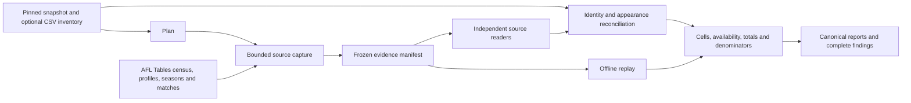

# Reconcile every AFL player with AFL Tables

## 1 Purpose and delivery

Build an opt-in command, `scvia reconcile-afltables`, that compares the repository's
player statistics with a complete, captured AFL Tables reference. It must identify
missing players, missing or duplicated games, incorrect match links, wrong statistic
cells, and incorrect totals and averages. Every result must be reproducible offline.

This is an implementation design, dated 1 October 2026. The command and modules proposed
below do not exist yet. Opus 5.5 reviews and confirms the design; Sonnet 5.5 implements,
tests and executes it; Opus then reviews the implementation and evidence. The acceptance
criteria distinguish a finished audit from a claim that the data is correct. Finding a
real mismatch is a successful detection, not permission to alter the data until it passes.

The starting code is `main` at `5d163c68c267bce751e49acbd66d261e8685f850`.
The architecture review ran at `fec9cd3d87cc7c8c823176a75f33dfe90246eeeb`; its record is
`docs/reviews/AFLTABLES_RECONCILIATION_DESIGN_REVIEW.md` (findings S-01 to S-16 are
referenced below by ID). Inspect current HEAD at execution time and preserve later work. Runtime stays a static
website plus local Python. This task adds an operator audit, without wiring it into a
schedule, publication gate or automatic correction path.

### Reuse the existing Claude agents

Keep `.claude/agents/` as the single source of agent definitions. Use **Gaffer** to
coordinate the architecture decision and delivery, **Surveyor** for independent
architecture/evidence review, **Scientist** for the Python implementation and execution,
and **QA** for independent test/schema/artifact checks. **DataSentinel** retains its
existing remit over tagged statistical claims when that document gate applies.

The user's model choices apply to this task: Gaffer and Surveyor use Opus 5.5; Scientist
uses Sonnet 5.5. Record the requested and resolved model for each invocation. These
explicit choices override task-session defaults; do not rewrite shared agent definitions
or introduce duplicate architect/engineer agents. Preserve Surveyor's advisory, read-only
role: it writes its own survey, Gaffer resolves and packages the architecture decision,
and Scientist owns code and numeric findings. Gaffer alone commits/pushes.

Consult the existing memories as investigation leads, then verify against current code
and source captures. In particular, Scientist's `reconciliation_source_afltables_player.md`
describes a career-total audit; this task requires per-game comparisons as well because
offsetting wrong cells can preserve a total. URL guesses, counter-based game counts and
blank-stat assumptions in older notes are not sufficient evidence for this audit.
The [launch guide](README.md) and task payloads describe the concrete handoffs.

## 2 Scope and the meaning of all

The default scope is men's senior VFL/AFL premiership matches, starting in 1897 and
ending at an explicit `--through-date`, inclusive in the match venue's local calendar.
For the first run use `2026-09-30`. Include home-and-away games, finals, wildcard finals
when present, drawn finals and their replays. Exclude preseason, reserves, representative
football, AFLW, coaches and umpires; state these exclusions in the report.

The population is the union of:

1. Players discovered independently from AFL Tables with an appearance in that scope.
2. Local canonical players with accepted appearances or quarantined appearance records
   in that scope, including identities reached through aliases.
3. Players represented by the legacy performance CSVs when that input is requested.

Do not discover players solely from local files: that cannot detect an entirely missing
player. Do not use a leaderboard as an all-player census. Keep source-only, local-only,
unresolved and duplicate identities in the denominator. Profiles whose scope eligibility
cannot be determined remain unresolved; they are not silently excluded. A listed player
with no appearance before the boundary is excluded only with captured evidence.

Compare every in-scope game and every supported statistic, followed by season, club-stint
and career aggregates. A sample is a development check, never the final all-player run.

### Required data layers

| Layer | Role | Required behavior |
|---|---|---|
| Immutable canonical snapshot | Primary app data | Mandatory; explicit snapshot ID, or resolve `current` once and pin it |
| Legacy performance and match CSVs | Migration/reference data | Optional adapter, required in the initial engineer run; preserve raw strings and report separately |
| Sealed app release | What the app displays | Run the existing full integrity checker separately against the same snapshot; combine evidence only when identities match |
| Captured AFL Tables pages | Independent comparison reference | External evidence manifest; never add observations to the audited snapshot to make it appear verified |

Each requested local data layer gets its own verdict. The overall result is FAIL if
either requested layer has a confirmed mismatch. A passing corrected snapshot must not
mask a failing legacy input. Raw CSVs can legitimately be older than the candidate; label
that age and retain the resulting missing-game findings for the requested boundary.

### Statistic contract

Use these canonical field names, currently the 23 `PLAYER_STAT_COLUMNS`. Maintain the
source label mapping independently of the production importer, with annotated fixtures.

| Source label | Canonical field | Source label | Canonical field |
|---|---|---|---|
| KI | kicks | MK | marks |
| HB | handballs | DI | disposals |
| GL | goals | BH | behinds |
| HO | hitouts | TK | tackles |
| RB | rebound_50s | IF | inside_50s |
| CL | clearances | CG | clangers |
| FF | frees_for | FA | frees_against |
| BR | brownlow_votes | CP | contested_possessions |
| UP | uncontested_possessions | CM | contested_marks |
| MI | marks_inside_50 | 1% | one_percenters |
| BO | bounces | GA | goal_assists |
| %P | time_on_ground_pct | GM | appearance count, derived separately |

Also compare player identity, club, opponent, match link, match date where supplied,
stage/replay, result, jumper and career-counter/substitution tokens. `SU` and arrows are
participation metadata, not counting statistics. Birth date supports identity; mutable
height/weight, fantasy scores, predictions and locally invented proxy measures are outside
this performance-statistics claim. Record their exclusion. New source columns must be
classified explicitly; an unexpected numeric performance column makes schema coverage
incomplete until supported. Never silently drop it to retain an all-statistics claim.

## 3 Evidence inspected and existing work to reuse

The source's statistics index links an all-player alphabetical directory; the inspected
A directory has alphabet navigation and profile links, including repeated display names.
This supports link-based census discovery and demonstrates why names alone are insufficient.
[Statistics index](https://afltables.com/afl/stats/stats_idx.html),
[all-player directory](https://afltables.com/afl/stats/playersA_idx.html).

An inspected profile has season summaries, per-game tables, abbreviation definitions,
and substitution markers. Use actual linked URLs instead of constructing a URL from a
CSV filename. Table layouts and links must be verified across eras during the pilot.
[Example profile](https://afltables.com/afl/stats/players/S/Scott_Pendlebury.html).

AFL Tables describes era-dependent availability, specific exceptions, and averages that
exclude games where a statistic is missing. It also states its figures are unofficial and
can contain errors. The result therefore establishes agreement with captured AFL Tables
evidence, not independent proof of historical truth.
[Source notes](https://afltables.com/afl/stats/notes.html).

These pages were read during design, not captured as an audit corpus. During architecture
review Surveyor made 27 bounded live requests (no 403/429/challenge). The bodies, headers,
request log and `SHA256SUMS` are retained locally, outside Git, at
`var/reconciliations/afltables/design-review-samples-20261001/`. Phase B builds trimmed,
annotated fixtures from them; they are not an audit corpus either. On 2026-10-01
`robots.txt` returned a genuine HTTP 404 (a 651-byte custom HTML page, byte-identical to a
missing profile). The collector must still retrieve it itself at capture time and apply the
access behavior below; page identity comes from status plus H1/title, never body heuristics.

Measured source facts the implementation relies on (review §1, verify in the pilot):
every sampled profile game row (1,370 rows, 1897–2026) carries exactly one explicit match
link in its `Rd` cell; profile and season tables have no rowspans (match pages use them
only in navigation cells); profile rows carry no match date; some profiles have no `Born:`
line; a drawn final and its replay have distinct match URLs but no "Replay" text; per-letter
directories carry no DOB and regenerate independently. The existing reader silently keeps
the last value when a header label is duplicated (`sourcepages.py`, dict built from
`zip(labels, cells)`): the reconciliation reader must not inherit that (S-10).

| Existing code | Reuse or limitation |
|---|---|
| `scrapers/game_scraper.py::audit_player_career_totals` | Historical reference and fixtures. It derives URLs from names, compares a small set of totals, uses the maximum career counter, and returns an empty issue list when a page is unavailable. Do not use that as the new verdict engine or modify its live refresh behavior. |
| `src/supercoach_via/integrity/sourcepages.py` | Reuse the independent raw HTML reader; extend it with tested census, biography, summary and link extraction. It currently assumes a particular per-season header/colspan and lacks all required aggregate/link information. |
| `integrity/checks_source.py::check_player_pages` | Reuse test cases and comparison concepts. It selects pages from snapshot observations, can report NOT_APPLICABLE with no pages, and checks only available captures. Simply passing more `--evidence` files does not discover all profiles. |
| `ingest/http.py` | Reuse allowlisted HTTPS, redirect checks, bounded responses, the rate limiter (as a floor only) and `RawArchive` objects. Retries move to the capture coordinator and validators are unused (§6, S-04/S-09). Supply a reconciliation-specific policy and isolated archive. |
| `storage/snapshots.py`, `storage/queries.py` | Reuse verified immutable snapshots, containment, Arrow/DuckDB queries and partition access. |
| `integrity/capture.py`, `runner.py`, `report.py` | Reuse pinned-input, canonical serialization and output-alias protection concepts. Audit their APIs before extending or extracting small shared helpers. |
| `domain/schemas.py`, existing coverage/config files | Read local schema and declared policies; independently derive expected source semantics. Policy disagreement is visible evidence, not a reason to copy local expectations. |
| `tests/scvia/fixtures/zero_semantics`, existing source-reader and reconciliation tests | Keep the annotated evidence and existing regressions. Extend coverage; do not replace it. |
| `docs/data-integrity.md`, `docs/reviews/CLAUDE_OPUS55_REVIEW.md` | Preserve the source-coverage limitation and the distinction between source comparison and release comparison. |

The new comparator must not call `ingest.afltables` parsers, production blank-resolution
functions or analytics builders to derive expected values. Share transport, verified I/O,
types and serialization, not the logic whose output is being checked. Model calls may
help agents implement and review code; reconciliation itself makes no model calls.

## 4 Architecture and file map



Recommended package: `src/supercoach_via/reconciliation/`. Keep modules small and specific:

| File | Responsibility |
|---|---|
| `cli.py` | `plan`, `capture`, `compare`; register a thin command group in existing CLI |
| `schema.py` | Strict versioned plan, capture manifest, coverage, finding and report models |
| `inventory.py` | Input pinning, complete source census, task discovery and scope accounting |
| `capture.py` | Single network coordinator, resumable queue, archive and manifest finalization |
| `source.py` | Independent profile/census/summary readers using the existing independent tokenizer |
| `identity.py` | Evidence-backed player and match joins; explicit ambiguity results |
| `local.py` | Snapshot and raw CSV adapters with immutable provenance |
| `compare.py` | Appearance/cell comparisons and per-player/season/career aggregation |
| `report.py` | Stable reduction, exact coverage accounting, schema checks, JSON/JSONL/CSV/text outputs |
| `cache.py` | Content-keyed semantic cache, invalidation and resume checks |

Add a reconciliation-only source policy and identity override file under `config/`, with
packaged copies under `src/supercoach_via/config/` if used by the installed CLI. Add schemas
under `schemas/reconciliation/`; do not feed them to the browser contract generator.
Use `tests/scvia/unit/test_reconciliation_*.py`, a small dedicated fixture directory,
and `tests/scvia/integration/test_reconciliation_real.py` for explicit real-input tests.
Architect may simplify boundaries, but must account for every responsibility and requirement.

Do not introduce a second application, service, database daemon or front end. A private
SQLite queue/checkpoint store is sufficient; the auditable exports are versioned files.

## 5 Pin the inputs and event boundary

`plan` is offline. It records schema version, repository commit plus relevant code hashes,
snapshot ID and fragment hashes, scope and statistic set, all requested input layers,
policies, identity overrides, output roots, and source seed URLs. Write it atomically.
Use logical relative names and hashes for identity; absolute paths belong in operational
metadata. Refuse output paths inside input roots, overlapping output files, symlink/hardlink
aliases, and a run directory containing another incompatible plan.

For CSV mode inventory every player performance file and the match/personal-detail files
actually used. Stream their bytes, preserve row numbers and raw values, and fingerprint
file membership as well as contents. Parse integer fields strictly; malformed text must
not become null. Do not run the production importer to generate the audit's expected rows.

`--through-date` is an event boundary, not a claim that today's website is a historical
snapshot of that date. Record `reference_mode=observed_current`, each capture timestamp,
and the acquisition start/end. Source games later than the boundary are excluded using
source match dates, with exact exclusion counts. Undated games whose inclusion is unclear
remain UNKNOWN. A printed whole-career total extending past the boundary cannot validate
a truncated career; compare scoped source game aggregates and mark that printed aggregate
out of scope. Do not report it as an unavailable in-scope statistic.

Revalidate the census and scoped season pages at the end of acquisition. A changed
inventory or conflicting profile/match values triggers a new evidence revision or a
source-inconsistent finding. Per-URL revisions are explicit; never silently select the
last network response. No crawler can prove every page existed simultaneously; describe
the captured collection window accurately. Offline determinism applies to a frozen
collection, not to two separate live downloads.

Recheck local input hashes and membership after comparison. Report drift as UNKNOWN and
`complete=false`; confirmed mismatches remain FAIL. Parse retained verified bytes and
verified fragment handles so comparisons do not mix input versions. Document the existing
limitation that a change restored byte-for-byte before a final recheck is not observable.

## 6 Complete and considerate source acquisition

### Discovery

1. Capture `https://afltables.com/afl/stats/stats_idx.html`, its All Players link,
   `https://afltables.com/afl/stats/notes.html`, and `robots.txt`.
2. Traverse every alphabet directory linked by the All Players navigation. Validate its
   declared letter and all expected navigation links; a missing/failed letter prevents
   a complete census. A source-declared empty letter is a valid observed empty set.
3. Extract every profile link, retain its index-page location and display name, deduplicate
   only identical canonical URLs, and fetch every discovered profile. Also investigate
   local verified profile URLs missing from the directory; account for them explicitly.
4. Parse profiles for source identity, appearances and aggregate tables. Enumerate every
   in-scope season from the source's season navigation, and every completed in-scope match
   from those season pages, independently of profile and local membership. Reconcile that
   inventory with the profile game links, including matches absent locally.
   Capture scoped season pages and every distinct in-scope match page. Full
   match capture is required for the full run's membership and blank-availability checks.
5. Reconcile profile appearances against match lineups and season fixtures. A profile
   whose match references cannot be established remains incomplete. Do not substitute
   local games as the source discovery universe.
6. **Census closure identity (S-06).** Every profile URL linked from any in-scope match
   page must be a member of the directory census. A lineup-linked profile absent from the
   directory is a census gap that keeps `capture_complete=false` (it is still fetched and
   compared). The per-season player lists (`/afl/stats/YYYY.html`, `YYYYs.html`) are an
   optional second census; if captured, their extra columns are classified, not ignored.
7. The per-player `_gm.html` "Games Played" pages are **not** part of the required corpus
   (S-13): they duplicate profile match links and would add roughly 13,000 requests.

Use exact URL allowlists for the observed census, notes, player, season and match paths.
The current production policy permits only the last three categories, so add a separate
policy with the extra paths rather than a broad `/afl/.*` rule. Reject credentials,
non-HTTPS schemes, arbitrary hosts, encoded traversal and redirects outside that policy.
Retain rejected in-scope links as coverage gaps. The reconciliation policy enumerates, at
minimum, `^/robots\.txt$`, `^/afl/stats/stats_idx\.html$`, `^/afl/stats/players[A-Z]_idx\.html$`,
`^/afl/stats/notes\.html$`, the three existing season/match/player grammars, and the
per-season list pattern only if that optional census is adopted (S-12). Resolve each
relative `href` against the page's *final* URL, then strip the fragment, then validate.
URL fragments identify sections, not separate downloads. Preserve case-sensitive player paths and numeric suffixes. Never
invent profile URLs, proxy around a block or scrape search-engine results as substitutes.

### Network defaults and recovery

- One coordinator, one in-flight request per host, minimum two seconds between request
  starts, including retries, robots checks, redirects and revalidation fetches. CPU
  comparison workers must not multiply the request rate. Reuse cached raw objects by hash.
- Reuse the HTTP client's timeouts, response byte cap and HTTPS validation. A
  larger-than-cap response is a visible gap, not a truncated success.
- **Retry ownership (S-04).** Today's `HttpClient` sleeps `min(Retry-After, 60 s)` and
  retries internally, does not expose `Retry-After` on its result, keeps rate-limit state in
  memory only, and defaults to 0.5 s spacing with two concurrent requests. Therefore the
  reconciliation policy pins `requests_per_second = 0.5`, `max_concurrent_per_host = 1` and
  client-level `max_attempts = 1`; the capture coordinator owns every retry (at most three
  attempts per resource) and persists a per-host next-eligible timestamp in the checkpoint
  so spacing and server deadlines survive resume. Add an **additive**, default-neutral field
  to the fetch result carrying the parsed `Retry-After`. Default production behavior must
  stay byte-identical, proven by a regression in `tests/scvia/unit/test_http.py`; Scientist
  records the CLAUDE.md §6.2 scope determination for that `http.py` change in writing.
- **No conditional requests (S-09).** Capture calls the client with `conditional=False`,
  sends no `If-None-Match`/`If-Modified-Since`, and writes no `validators/` under the run.
  End-of-acquisition revalidation is a full GET plus body-hash comparison. An unsolicited
  304 is a failed fetch.
- Use a descriptive User-Agent. Honor applicable robots restrictions. A successful empty
  robots file or an actual 404/410 permits the normal policy; authentication errors,
  access denial, rate limits or a failed robots fetch pause acquisition with an explicit
  reason. This design does not claim robots has been checked successfully already.
- On 429 honor the full `Retry-After`. The existing HTTP client caps it, so the coordinator
  must not retry earlier than a longer server deadline; persist a next-eligible timestamp
  and resume later. On 403/challenge content stop this host rather than rotate identities.
- Three consecutive exhausted transient requests pause the queue. A 404 player/match
  response is an evidence gap to investigate, never an empty player career.
- Recognize HTML challenge/login/error pages even with HTTP 200. Require expected page
  identity and table structure before declaring a fetch usable.
- Capture writes only to its own archive. Copy/hardlink only verified immutable payloads
  (`objects/`) from prior archives, re-hashing each; never read or copy another archive's
  `validators/` or observations. Never mutate
  the candidate's `raw/`, source observations, snapshot or legacy files.
- Use a filesystem lock per capture root. Queue transitions are transactional. Retry or
  resume rechecks plan/code/policy identities and completed-object hashes. Changes requiring
  reinterpretation create a new plan/revision, rather than silently altering a running audit.
- SIGINT/SIGTERM checkpoints pending tasks and emits a truthful incomplete receipt.
  Network completion must not depend on the lifetime of a chat response.

Before a full run, report discovered request counts, cached/revalidation counts, expected
disk use and estimated minimum network time. At two seconds per request, 30,000 requests
alone take about 16.7 hours; this is capacity arithmetic, not a measured site count.
The review's estimate (labelled as such) is about 13,370 profiles, 17,056 match pages,
130 season pages, 29 index/notes/robots pages and about 156 revalidations: roughly
30,600–30,900 requests, at least 17 hours, and about 1.8 GB of raw HTML.
Persist progress every completed request and print a compact heartbeat at least once per
minute. Do not run competing forecast training or heavyweight integration jobs.

### Capture manifest

Every required resource has a record: logical kind/ID, original and final canonical URL,
status, payload SHA-256 and size if present, acquisition observation reference, parser
support status, and the discovery references requiring it. Failed records have reasons.
The manifest also lists census membership, discovered match membership, policies and
scope. Bind the manifest digest into every comparison report. Store raw bodies at
`capture/objects/<sha-prefix>/<sha>` and observations in a separate append-only journal.

A partial manifest is valid evidence of an incomplete capture and can be compared;
`capture_complete=false` must propagate. Completeness requires all required tasks accounted
for successfully, supported discovery, and an unchanged final census. HTTP success alone
does not establish parser or semantic coverage.

## 7 Player identity and match alignment

### Player identity

Use the normalized AFL Tables profile URL as the source key. Resolve local aliases and
canonical IDs with cycle and duplicate-target checks before matching. Use this order:

1. Verified local source URL, checked against profile identity evidence. A conflicting DOB
   or clearly incompatible career is an identity conflict, not a license to compare anyway.
2. A versioned override supported by a captured page and a stated reason.
3. A unique normalized-name plus full-DOB match, corroborated by club/season membership.
   **3b (S-05).** Where names diverge (surname splitting such as source "Ah Chee" vs local
   "Chee", "De Abel" vs "Abel", "El Achkar" vs "Achkar"): a globally unique full-DOB match
   plus an *identical* set of (season, club) memberships. Record the name difference as an
   identity-variance finding.
4. When DOB is absent on the profile, or is low precision: global uniqueness of an
   *exact* equality between the source profile's appearance set `{(match URL, club)}` and
   the local player's appearance set. Any partial overlap stays UNKNOWN pending a reviewed
   override. A 1 January DOB is treated as low precision: it may corroborate but is never a
   sole key. Rules 3b and 4 use set equality only; no similarity score participates.
   Because rule 4 requires equal appearance sets, it cannot conceal an appearance mismatch.

Normalize Unicode and whitespace without collapsing distinct names. Account for multiword
surnames, apostrophes, hyphens, nicknames, suffixes, name changes, identical names and club
transfers. Fuzzy matching may suggest candidates in a separate review file; it must never
authorize an automated match or PASS. Mapping uniqueness is enforced globally, not just
one player at a time. Two non-alias local IDs claiming one profile are a conflict.

Override rows contain local ID, source URL, evidence hash and locator, reason and reviewer.
Overrides may resolve identity; they may not waive a statistic mismatch. Hash the whole
override file into the plan and cache keys. The architect approves substantive rule changes.

### Appearance identity

An appearance key is `(source_player_url, source_match_url, source_club)`; the local key
is `(canonical_player_id, match_id, club_id)`. Retain multiplicity before any deduplication.
Source match URLs and season fixture facts provide date, opponents, stage and replay.
Do not equate two grand finals by round label alone or use row position as proof.
The source prints no "Replay" token (S-11): both 2010 grand finals show `Rd` = "GF".
Derive a replay ordinal from (season, stage, unordered club pair, date order, prior drawn
result) and key the appearance by match URL; never parse it from text.

Prefer explicit game links from the profile. If absent, join against the independently
captured season fixtures using clubs, round/stage, source date where present, and replay
evidence. Career counters and result are additional checks, not a fallback that selects
the first plausible match. An ambiguous join is UNKNOWN and contributes to gaps. Opponent
and club aliases must be season-valid; distinct historical clubs must not be merged merely
because the app groups them in a lineage.

Compare source and local appearance multisets in both directions. Count distinct validated
appearances, not `max(games_played)`. Independently check counter sequences, missing rows,
duplicates, replay occurrence, named-but-did-not-play/substitute roles and club changes.
Quarantined local rows remain visible in a separate population; quarantine is neither
automatic acceptance nor evidence that a source game did not occur. Every source appearance
must be matched, confirmed missing, or unresolved.

## 8 Cell semantics and aggregation

Preserve original cell text and its table/header/row locator before normalization. Each
source field resolves to one of:

| State | Meaning and comparison |
|---|---|
| `RECORDED_VALUE` | Valid printed integer/decimal; compare exact normalized value |
| `RECORDED_ZERO` | Blank/explicit zero whose recorded-stat and participation context proves zero; compare with numeric zero |
| `NOT_RECORDED` | Source notes and match structure establish unavailable measurement; local numeric data is unsupported, not corroborated |
| `NOT_APPLICABLE` | Rule establishes no applicable measurement, for example finals Brownlow votes |
| `UNRESOLVED_BLANK` | Evidence cannot distinguish zero from unavailable; UNKNOWN |
| `MALFORMED` | Unexpected numeric text, duplicated header labels, a rowspan inside a data table, or malformed shape; parse error and UNKNOWN (S-10) |
| `NOT_APPLICABLE_DNTF` | Cell of a credited appearance whose player did not take the field (below). A local null or zero is counted in the not-applicable bucket (never equal, never in `verified_numeric_fraction`); a positive local value is counted as a mismatch |

Two source conventions found in review need their own handling.

**Credited, did not take the field (S-02).** The rule is scoped by its conditions, not by
year. It was observed for 2021–22 unused medical substitutes; there, an unused substitute is a
credited game: the profile row advances the counter and shows a result with all 23 cells
blank, `%P` included, and the source counts the game in its averages. Assign participation
state `CREDITED_DID_NOT_TAKE_FIELD` only when all of these hold: every statistic cell of the
player's row is blank on the match page and the profile; the same team's `%P` is recorded
for other players in that match; the player is listed in that match; and the profile credits
the game. The appearance counts for membership and counters; its cells take
`NOT_APPLICABLE_DNTF`; when reproducing the source's printed averages they count as zero
in the denominator. A local null vs a local zero for such a cell is reported in a
`representation` category, not as a numeric contradiction. Rows outside 2021–22 that meet all
four conditions (local data has a handful in 2003–04) are classified by the rule and also
reported in a separate pilot-review count until the Phase E pilot confirms the convention
outside 2021–22, including for 2011–2015 substitutes.

**Season-summary-only statistics (S-01).** Before 1984 the source prints season Brownlow
votes on profiles while the per-game `BR` cells are blank (sample: Dick Reynolds 1935,
season BR printed with no per-game value; the career Totals row also prints a BR total).
Assign availability `SOURCE_SUMMARY_ONLY` to a (player, club-season, statistic) only by an
evidence-backed rule: the season row value is present; **all** of the player's per-game
cells for that statistic in that club-season are blank on the profile; and the team Totals
for that statistic are blank on **every** one of those matches' pages for the player's team.
Per-game cells in that case are `NOT_RECORDED`. The season value is the reference for that
club-season. It is never a `SOURCE_CONFLICT`.

**Composed references (N-04).** The source reference for a season, stint or career
aggregate of a statistic is the sum of per-club-season references. Each club-season's
reference is its per-game cell sum, or its season value when `SOURCE_SUMMARY_ONLY`. (In
the review sample, Reynolds' per-game BR seasons plus his summary-only seasons sum exactly
to his printed career total.) The printed career Total is compared with that composite
only as a derived figure. **Scope decision:
keep these statistics in the default scope.** If the local layer cannot reproduce a source
summary value (for example, its per-game cells are null and it stores no season aggregate),
emit a `LOCAL_MISSING_SUMMARY_VALUE` data finding. That finding makes the layer's verdict
FAIL: the local data lacks a value the source publishes. Narrowing the claim to exclude
summary-only statistics is an owner decision, not an engineering one; it must then be named
in the attestation.

Availability uses captured source notes, their match-specific exceptions, and match-table
structure independently of the local importer's era rules. A blank is not zero merely
because another player has a positive value. A whole column may legitimately be zero.
Header presence alone is also insufficient when the source documents a missing category
or an unused participant. Maintain evidence-backed rules for these cases. Preserve finals
and substitution distinctions. Time-on-ground blanks are never blanket zero-filled.
A blank team Totals cell means the category was not recorded for that team-match; a
non-blank Totals with a blank player cell is zero (except under `CREDITED_DID_NOT_TAKE_FIELD`).
No sample showed how an all-zero team column is encoded; it stays `UNRESOLVED_BLANK` until a
fixture proves its encoding. Before 1965 the notes are silent; derive availability from
match Totals structure only.

Source notes need source-specific handling (S-08). Keep a versioned notes-exception map from
lineage club names (for example "1975 … Sydney", meaning South Melbourne) to the season-valid
club. Match team pairs regardless of order. Map notes labels (`I5`, `OP`) to table labels
(`IF`, `1%`). An exception row that cannot be mapped is a schema gap, never a silent drop.
The notes map, the label map and the rule IDs are hashed into the plan and cache keys.

Raw CSV empty cells stay raw and compare using their declared legacy representation;
report unresolved/missing-value representation separately from numeric contradictions.
Do not let the CSV adapter rewrite blanks to zero and then claim it verified stored zeros.
The canonical candidate's zero policy is tested by direct source evidence here; the
audit does not grant production approval for a blanket extrapolation to uncaptured rows.

Integer statistics and counters compare exactly. Reject bool-as-int, NaN and infinity.
For `%P`, parse the printed decimal/percent with `Decimal` and compare normalized values
exactly to the local value's canonical decimal representation; do not apply a broad float
tolerance that could hide a one-point error. Report a precision/representation discrepancy
explicitly if local storage cannot preserve the source's precision.

For every player, season and club stint:

1. Compare the validated appearance set and W/D/L counts.
2. Recompute statistic totals from source game cells and compare with local game-cell
   totals and any stored/published aggregates. Missing games must not disappear through
   an inner join. Compute common-game diagnostics separately from full-scope verdicts.
3. Recompute observed and eligible counts per statistic and their means. Preserve
   numerator, denominator and unavailable/not-applicable counts. Never use one denominator
   for every statistic or sum percentages into a supposed career counting statistic.
4. Compare source game sums with the source's printed season and career summary rows;
   handle multiple clubs in a season and overall Totals without counting both twice.
   The season Totals footer combines GM and W-D-L in one cell, e.g. "26 (20-2-4)"; parse
   both strictly.
5. **Printed averages (S-03).** The source never prints average denominators, so a
   denominator cannot be "verified exactly". Model the source convention explicitly, as
   measured in review (all 1,028 sampled season averages reproduced):
   - rounding is ROUND_HALF_UP, proven by exact ties (28.125 → "28.13", 0.625 → "0.63");
   - season denominator is GM; Brownlow (`BR`) uses home-and-away games only;
   - career denominator, statistics other than BR: excludes games from eras or matches
     where the statistic is not recorded, per notes and match Totals; credited
     did-not-take-field games are included;
   - career denominator, BR (N-03): all home-and-away games in seasons in which the award
     was conducted, including pre-1984 seasons and zero-vote seasons. Profile bytes cannot
     distinguish "zero votes" from "not awarded" (both print blank), so the set of
     no-award seasons comes from a captured, versioned evidence file with a source locator,
     hashed into the plan; it is never inferred from blanks or recalled from memory. In
     review this rule reproduced 5 of 5 sampled career BR averages, when the excluded
     seasons were inferred as 1942–45 (unverified until Scientist captures the evidence);
   - the career GM average divides by distinct seasons; the W-D-L "average" is a win
     percentage.
   Compare the exact rational under this model against the displayed rounding interval.
   Verify the underlying printed totals exactly. A model miss is recorded with every
   candidate denominator considered; never choose whichever convention passes.

Only figures computed over multiple appearances are **derived source figures**: printed
averages and printed season/stint/career totals. A disagreement between one of them and the
composed reference is a source-consistency result: record `SOURCE_DERIVED_INCONSISTENCY`,
set `source_consistent=false` and retain all values. It does **not** change a local layer's
verdict, provided every contributing per-game cell is corroborated by both profile and match
page. Local per-game cells and local aggregates are always judged against the source
per-game cells and the composed references (step 2 and N-04). If a contributing per-game cell
is printed on only one source page, a disagreeing printed total instead marks that aggregate
unresolved (UNKNOWN).

**What blocks PASS (S-07, N-05).** Any disagreement between two source facts that index the
same appearance is a `SOURCE_CONFLICT`. This includes a profile cell vs the same match-page
cell; profile game membership vs match lineup; the profile game counter vs the match page's
career-games-to-date; the profile row result vs the match result; and the jumper number. It
marks the affected cells or appearances UNKNOWN and therefore blocks PASS. Where a cell is
printed on one page and blank on the other, the Phase E pilot (for example 1931–34 BR,
which profiles print per game) decides the state from captured evidence before Phase F. Record all values; do not choose a page because it agrees with the repository. A
separate unambiguous discrepancy can still make the overall result FAIL. AFL Tables
agreement is the reference claim. Historical discrepancies are not automatically warnings
that permit PASS, unlike the existing promotion policy.

## 9 Coverage, verdicts and report contract

Reports carry `schema_version`, scope, relevant code/policy hashes, snapshot/input IDs,
capture-manifest digest, per-layer results, coverage, stable finding counts, limitations,
and deterministic references to the complete findings stream. Report all source errors,
identity conflicts and gaps, not just the first failure.

For each layer publish exact counts by player, season and statistic, plus overall:

- source players discovered, in scope, excluded with evidence, unresolved and local-only;
- players uniquely mapped, missing locally, ambiguous, duplicated, compared and pending;
- required/fetched/usable/missing profiles, season pages and match pages;
- expected source appearances, local appearances, matched, source-only, local-only,
  duplicated, quarantined and unresolved;
- statistic cells expected, exact matches, mismatches, recorded zeros, source-unavailable,
  not-applicable (rule-based and did-not-take-field counted separately), malformed and
  unresolved; credited did-not-take-field appearances;
- aggregate comparisons with their own counts: equal, mismatch, local-missing-summary,
  source-unavailable, not-applicable and unresolved, plus source-derived inconsistencies
  and source conflicts as separate counts.

Accounting identities must hold. For example, every expected source appearance belongs
to exactly one of matched/missing/unresolved; every requested cell belongs to exactly one
of equal/mismatch/source-unavailable/not-applicable/unresolved (recorded-zero is a source-
state sub-count spanning equal and mismatch; malformed is a sub-count of unresolved); every
requested aggregate belongs to exactly one of equal/mismatch/local-missing-summary/
source-unavailable/not-applicable/unresolved (N-02). An aggregate whose contributing source
values are all `NOT_RECORDED`, for example most pre-1965 statistics, is source-unavailable,
neither equal nor unresolved. Duplicate findings are
orthogonal flags and must not inflate these partitions. Do not divide only by fetched
pages. A failed census makes the denominator unknown; a percentage then displays null
with a reason, never 100%.

`execution_complete` means all planned work reached a terminal state, including failures.
`capture_complete`, `identity_complete`, `comparison_complete` and `source_consistent`
are separate fields. `verified_numeric_fraction` excludes no unknown expected cells;
also show explicit available-stat and whole-matrix denominators so source-unavailable
historical data cannot masquerade as fully verified measurements.

| Result | Condition | Exit |
|---|---|---|
| PASS | Full requested census and comparisons complete; no unresolved required evidence, `SOURCE_CONFLICT`, unsupported local numeric claim or confirmed mismatch (a `SOURCE_DERIVED_INCONSISTENCY` is reported but does not block) | 0 |
| FAIL | At least one confirmed mismatch, missing/extra appearance, duplicate or `LOCAL_MISSING_SUMMARY_VALUE` corrupts a requested layer, even if other evidence is incomplete | 4 |
| UNKNOWN | No FAIL condition, but required evidence, identity, schema, drift or availability cannot be resolved | 8 |
| Invalid invocation | Bad options, incompatible resume, unsafe paths or malformed policy | 2 |
| Busy | Capture/checkpoint root already locked | 5 |
| Software failure | Unhandled internal error; no successful completed report | 9 |

PASS means agreement within the declared availability scope. `NOT_RECORDED` is accounted
for source absence, not a verified numeric cell; explicit inapplicability is not a gap.
If the local layer stores an unsupported number for a source-unavailable field, report
UNKNOWN unless contradictory evidence proves it wrong. Never elevate an undocumented
exception into NOT_APPLICABLE. A development sample may be internally clean, but must
report `scope.full_population=false` and cannot issue the full-audit PASS attestation.

Every finding includes a stable ID, category, layer, player identifiers, season/match,
field, expected/actual values and raw representations, source URL/body hash/table/row/cell,
local fragment or file/row, governing rule ID and suggested investigation. Locators must
let a reviewer open the exact evidence; no LLM-written assertion replaces that evidence.

Deliver:

```text
RUN/
  plan.json
  capture/manifest.json
  capture/objects/...
  capture/observations.jsonl
  capture/checkpoint.sqlite
  reports/cold-1/report.json
  reports/cold-1/findings.jsonl
  reports/cold-1/players.csv
  reports/cold-1/coverage.csv
  reports/cold-1/summary.md
  reports/cold-1/output-manifest.json
  reports/cold-1/execution.json
  reports/cold-4/...
  reports/warm-4/...
  reports/changed/...
  implementation-validation.json
  completion.json
```

Canonical JSON uses fixed UTF-8 serialization, sorted keys and stable ordered records.
Represent aggregate rationals/decimals losslessly. Findings IDs are hashes of rule,
entity, layer, field and evidence identity; never random UUIDs. Write streams in stable
order, then bind their hashes/counts in the report. Timings, cache hits, absolute paths,
host names, PIDs and worker counts belong in execution metadata. Hash every output except
the output-manifest itself; publish the manifest last as the completion marker. Refuse
pre-existing completed destinations. On write failure describe exactly what was written.
Human CSV exports must neutralize spreadsheet formulas without changing canonical JSON.

## 10 Performance and deterministic reuse

Create a compact source appearance index once, partitioned by season/player. Use DuckDB
or Arrow over snapshot fragments and bounded batches; do not query/scan the full player
table anew for each profile. Stream source pages, findings and raw CSVs. Compare one
partition at a time; bound worker queues and account for aggregate memory across workers.

Separate three caches: immutable downloaded bytes, parsed source facts, and comparison
results. Keys include source bodies and manifest selection, parser/schema/rule hashes,
identity and club maps, source availability notes, local input fragments/CSV hashes and
scope. Content-only keys without policy/identity dependencies are invalid. Cache success
and failure results equally; a cache hit is reused evidence, not a fresh source fetch.
**Permitted simplification (S-14):** if measured within the performance targets, the
comparison-result cache may be omitted. A parsed-facts cache keyed by (body SHA-256,
parser/schema/rule hashes) plus full recomputation then implements changed-since, provided
the report still accounts for unchanged units as reused evidence and T20/T21 pass unchanged.

`--previous`/changed-since is an optimization over a full accounting result. Reuse only
units whose complete dependencies match; newly discovered/removed players and matches
must invalidate inventory, relevant comparisons and aggregate summaries. Report every
unchanged player as reused verified evidence, not omitted. A missing cache unit recomputes
it. Corrupt cache files never authorize PASS.

Measure cold single-worker, cold four-worker, warm and changed-since runs on one frozen
manifest. All canonical outputs must be byte-identical. Change one source cell, mapping,
availability rule and local row in isolated copies; each must invalidate the right units
and expose the discrepancy with unchanged unrelated units reused.

Targets to assess, not fabricate: offline full compare at most 10 minutes and 2 GiB peak
process-tree RSS with four CPU workers on the documented reference machine; warm at most
2 minutes. Measure acquisition separately. A missed target remains open and must not be
fixed by lowering coverage. Add at most 10 seconds to the established four-worker fast
test baseline; preserve the repo's already-missed 30-second target and report both.

## 11 Proposed operator commands

These are the required interface to implement, not commands available today. Use absolute
paths. `--run-dir` owns only new audit artifacts; input roots remain read-only.

```bash
REPO=/home/abhi/git/SuperCoach-VIA
TASK_RUN="$REPO/var/reconciliations/afltables/2026-10-01-full"
DATA="$REPO/var/reviews/opus55/20260929T203757Z-followup/candidate-data"
SNAPSHOT=sha256:3de6597513b5c6eaca1b102d304a2cf128d8c08f229ee1de384c1d40fe746db0

uv sync --locked --group dev --group legacy --extra ml
uv run --locked scvia reconcile-afltables plan \
  --data-root "$DATA" --snapshot "$SNAPSHOT" --legacy-root "$REPO" \
  --through-date 2026-09-30 --scope all --run-dir "$TASK_RUN"

uv run --locked scvia reconcile-afltables capture \
  --plan "$TASK_RUN/plan.json" --allow-network --resume

uv run --locked scvia reconcile-afltables compare \
  --plan "$TASK_RUN/plan.json" \
  --capture-manifest "$TASK_RUN/capture/manifest.json" \
  --out "$TASK_RUN/reports/cold-1" --workers 1 --cache "$TASK_RUN/cache-1"

uv run --locked scvia reconcile-afltables compare \
  --plan "$TASK_RUN/plan.json" \
  --capture-manifest "$TASK_RUN/capture/manifest.json" \
  --out "$TASK_RUN/reports/cold-4" --workers 4 --cache "$TASK_RUN/cache-4"

uv run --locked scvia reconcile-afltables compare \
  --plan "$TASK_RUN/plan.json" \
  --capture-manifest "$TASK_RUN/capture/manifest.json" \
  --out "$TASK_RUN/reports/warm-4" --workers 4 --cache "$TASK_RUN/cache-4"

uv run --locked scvia reconcile-afltables compare \
  --plan "$TASK_RUN/plan.json" \
  --capture-manifest "$TASK_RUN/capture/manifest.json" \
  --out "$TASK_RUN/reports/changed" --workers 2 --cache "$TASK_RUN/cache-4" \
  --previous "$TASK_RUN/reports/cold-4/report.json"
```

The capture invocation may exit 8 with resumable evidence; continue comparing what exists
to produce a truthful incomplete report. The engineer must handle expected audit exits 4/8
explicitly rather than treating them as a shell success or abandoning the remaining
determinism checks. `plan` and `compare` prohibit network access, tested by socket denial.
A stopped capture resumes with the same command and unchanged plan.

Use a separate plan to audit the retained older snapshot
`sha256:aa836549e10e96a9039cc4642bbe563b94247e0bfaf95e745a0971cc0bb2b98f`
at `var/finalized/data/` as a control. Verified source objects may be reused without
mutating either archive. Never silently substitute that input for a missing candidate.
The primary candidate paths and IDs above were checked during design; reverify them.

For app-wide confirmation also run existing `scvia check-integrity --scope full` against
the primary snapshot and its release
`var/reviews/opus55/20260929T203757Z-followup/releases/releases/20260929T213900Z-c8938f4ddb83`,
with B1 evidence and curated content options from `docs/data-integrity.md`. Use an explicit
as-of instant no earlier than relevant captured observations. Keep the existing checker
report and the new full-source report separate and bind their input IDs in `completion.json`.
Neither PASS alone proves the other's claim. A report about the corrected local candidate
does not establish that a remote website or `var/final-site` serves that candidate.

## 12 Implementation sequence

| Phase | Concrete work | Exit evidence |
|---|---|---|
| A Architecture | Gaffer commissions Surveyor on Opus, resolves findings through their owners and packages a review tied to the design and agent-definition hashes | APPROVED with an actual Surveyor report, no blocking findings and a requirements-to-tests table |
| B Contracts and red tests | Scientist on Sonnet defines strict schemas, outcome rules, output safety and small annotated fixtures | Failing tests demonstrate the intended defects before fixes |
| C Offline comparison | Implement local adapters, identity, independent readers, appearance/cell/aggregate comparisons | Synthetic and captured edge cases pass; no network |
| D Acquisition | Census, bounded fetcher, checkpoint/resume and source manifests | Mock-network adversarial suite and bounded live pilot |
| E Pilot review | Profiles across early/modern eras, a club transfer, homonyms, substitute, historical missing statistic, drawn/replayed final. Also capture (N-08): a 1935–83 home-and-away match page for a sampled Brownlow vote-getter (e.g. Reynolds 1935); a 1933 or 1934 Essendon match page; evidence for the no-award Brownlow seasons (N-03); a 2011–15 substitute | Every pilot value manually traceable; parser/census gaps resolved before bulk capture; 1931–34 BR state, DNTF scope and the no-award evidence file decided from captured evidence |
| F Full execution | Complete census/profile/match acquisition, full comparison, four deterministic runs and mutation copies | Exact populations, coverage, verdicts, hashes and resource measurements |
| G Independent acceptance | Surveyor on Opus reviews final diff and evidence; QA independently checks tests/contracts; Gaffer packages acceptance | ACCEPTED, CHANGES_REQUIRED or EXECUTION_INCOMPLETE with actual review evidence |
| H Delivery | Gaffer preserves input bytes, commits tested code/docs via the safe wrapper and consolidates approved work into main. `.githooks/pre-commit` defaults to a Python path that no longer exists, so export `COUNCIL_PYTHON` to the repo's locked `.venv/bin/python` (or its equivalent) for the commit; never use `--no-verify` (S-15) | Clean delivery state, recovery paths, commands and outstanding data findings |

One implementation worktree/branch at most. No per-agent branches. Gaffer sequences
review, Scientist's implementation and acceptance; no simultaneous code or Git writers.
If architecture changes after
approval, update the design and review digest before dependent implementation proceeds.
Routine fixes within the approved architecture do not require repeated approval.

Code merge readiness and data agreement are independent: correct software that detects
bad source data may be merged with an honest report. The existing main/CI issues must be
recorded separately, not hidden or used as permission to skip required local checks.

## 13 Test matrix

Use bounded fixtures for unit tests; mark real-corpus tests as integration. Every row below
needs at least one meaningful regression and a named test in the architect's matrix.

| ID | Required case | Expected behavior |
|---|---|---|
| T01 | Remove a whole local player while totals for remaining players stay valid | Source census finds missing identity and appearances; FAIL |
| T02 | Fail one alphabet page or silently omit a linked letter | Census incomplete, denominator unknown; no full PASS |
| T03 | Identical names, multiword surname, numeric URL suffix, conflicting DOB | No guessed URL/first-name winner; evidence-backed mapping or UNKNOWN |
| T04 | Two canonical IDs map to one source profile; alias loop | Identity conflict and visible duplicate/unknown, no merged counts |
| T05 | Remove one game but retain the final career counter | Missing appearance detected; max-counter shortcut cannot pass |
| T06 | Swap two game values while preserving season/career totals | Both cell differences detected |
| T07 | Duplicate an appearance with equal values | Multiplicity detected before aggregation |
| T08 | Drawn final/replay share round and opponents | Source game identity distinguishes them; ambiguity cannot pick first |
| T09 | Midseason club change and combined Totals rows | Stint/season/career totals computed once at the correct level |
| T10 | Blank true zero, unavailable era, documented missing match column, all-zero column | Distinct states; no blanket fill or positive-teammate assumption |
| T11 | Finals Brownlow, unused substitute, substitution arrows, missing %P | Availability/participation and raw tokens preserved |
| T12 | Reordered/missing/new/duplicate headers, rowspan/colspan, alternate table variant | Correct extraction or explicit schema gap; no positional shift |
| T13 | Malformed number, NaN/Infinity, boolean, comma/percent decimal, rounded average | Strict parse; exact or explicitly bounded display comparison |
| T14 | Two source facts indexing the same appearance disagree (profile vs match cell, membership vs lineup, counter vs games-to-date, result, jumper); a printed total disagrees with single-sourced cells | SOURCE_CONFLICT blocks PASS; the single-sourced aggregate is unresolved; no convenient source selection. Printed totals/averages vs double-sourced cells belong to T32, not here (N-01) |
| T15 | Source contains later games than event boundary | Correct scoped rows; later whole-career totals not misused |
| T16 | 403, 404, 429 with long Retry-After, challenge HTML, timeout, oversized body | Bounded behavior and truthful missing evidence, never clean-empty |
| T17 | Capture sends no conditional headers; an unsolicited 304; a reused prior-archive object that is absent or corrupt | No validators written; 304 is a failed fetch; a corrupt object is refused and refetched explicitly; no stale PASS (S-09) |
| T18 | Interrupt capture, resume, second writer, corrupt checkpoint, changed plan | Exact queue recovery or explicit refusal; no duplicate accepted tasks |
| T19 | Offline rerun with all sockets blocked and archives relocated | Byte-identical canonical outputs |
| T20 | Cold/warm/changed-since, shuffled traversal and worker completion | Byte-identical full reports and streams |
| T21 | Change local row/source cell/notes/identity override/code | Correct dependency invalidation and changed finding |
| T22 | Evidence deleted/changed during audit or new local input appears | Drift visible, completeness false; existing FAIL retained |
| T23 | Output equals input/another output through relative path, symlink or hardlink, including a hardlink to an input file outside the input roots | Refuse before writing; original files and input inode bytes untouched (S-16) |
| T24 | File write fails halfway | No completion marker; exact written/unwritten receipt |
| T25 | Historical mismatch and newer correct data | Historical mismatch still affects requested full-audit verdict |
| T26 | Quarantined row corresponds to a real source appearance | Coverage gap/missing accepted row visible, not excluded as resolved |
| T27 | Source data lacks a statistic or exposes an unsupported numeric category | Account absence separately; unsupported category prevents completeness |
| T28 | Missing latest completed final in local data | Source fixture/census discovery catches it without a local seed |
| T29 | Root/subdirectory installation and supported Python/Node paths | No machine-specific executable paths; installed CLI/configs work |
| T30 | One requested input layer FAILs while another PASSes | Per-layer verdicts retained, combined FAIL |
| T31 | A profile linked from a match lineup is absent from its directory letter | Census gap, `capture_complete=false`, profile still fetched and compared (S-06) |
| T32 | Printed averages: half-up ties, BR over home-and-away games, career exclusion of unrecorded eras (non-BR) and of evidenced no-award seasons only (BR), a model miss | Exact model reproduction; a miss is `SOURCE_DERIVED_INCONSISTENCY` with candidates listed, never a local-layer verdict (S-03/S-07) |
| T33 | Pre-1984 season Brownlow printed with blank per-game cells; local layer lacks it; a career mixing per-game and summary-only seasons; a pre-1965 statistic with no source value | `SOURCE_SUMMARY_ONLY`, never `SOURCE_CONFLICT`; `LOCAL_MISSING_SUMMARY_VALUE` makes the layer FAIL; the career reference is the composed sum; the all-unrecorded aggregate is source-unavailable (S-01, N-02, N-04) |
| T34 | Credited unused substitute with an all-blank row; local null vs zero vs positive | Appearance matched; `NOT_APPLICABLE_DNTF` cells; null/zero agree with a representation note; positive is a mismatch; source average reproduction counts it (S-02) |
| T35 | 429 with Retry-After longer than 60 s; process restarted before the deadline | No request before the persisted deadline; at least 2 s spacing across retries, redirects, robots and resume; client default behavior unchanged (S-04) |

## 14 Definition of done

### Design accepted

- [ ] D01 The existing Surveyor agent on Opus 5.5 reviewed the current implementation,
  source samples and this document. Gaffer's architecture record links that actual report,
  agent-definition hashes, inspected files, resolved questions and exact design hash.
- [ ] D02 No blocking architecture question remains concerning census, identity, blanks,
  replay joins, source vintage, coverage, outcome semantics, independence or output safety.
- [ ] D03 Each T01–T35 case has an implementation/test owner and concrete acceptance evidence.

### Implementation complete

- [ ] D04 Proposed commands, strict schemas, operator docs and installed configuration work.
- [ ] D05 All deterministic logic is executable Python; no model decision, fuzzy auto-join,
  broad exception-to-success or ignored source failure participates in a verdict.
- [ ] D06 T01–T35 and existing relevant regressions pass. Ruff/mypy and the complete fast
  tier pass; affected real integration tests run. Existing unrelated CI failures are explicit.
- [ ] D07 Resume, lock, cancellation, output containment, stream completeness and cache
  invalidation are demonstrated, including deliberate corruptions.
- [ ] D08 Before/after inventories prove candidate, retained reference, releases and legacy
  input files were not modified. No production schedule, hook, gate or data pointer changed.

### Full execution complete

- [ ] D09 Every source directory and discovered in-scope player/match has an explicit
  terminal acquisition record. Full coverage requires all required evidence usable;
  exhausted failures are reported as execution incomplete, not audited-away exclusions.
- [ ] D10 Every local and source player, appearance and requested field is accounted for;
  all coverage identities reconcile. Summary samples do not truncate the findings stream.
- [ ] D11 All source-available fields are compared per game, and applicable season/stint/
  career totals and denominators are checked. Source-unavailable values and conflicts are
  quantified. A career-total-only report fails this requirement.
- [ ] D12 Cold-1, cold-4, warm and changed-since canonical outputs are byte-identical on
  the same frozen inputs; mutations on copies are caught and correctly invalidate caches.
- [ ] D13 A full offline rerun completes with network denied and preserves its data verdict
  (including a genuine FAIL or UNKNOWN). Network/CPU times, peak
  process-tree RSS and disk use are measured; missed targets are called out.
- [ ] D14 The report states whether the latest completed final before the event boundary
  is present and whether every participating player's row was compared with source evidence.
- [ ] D15 Surveyor's Opus review evaluates actual code and artifacts, QA independently
  checks applicable tests/contracts, and Gaffer records acceptance using their evidence.
  Scientist supplies exact commands, input IDs, hashes and any unresolved findings.

### Data integrity confirmed

- [ ] D16 Primary snapshot full-audit PASS, complete population/identity/comparison coverage,
  no unresolved required evidence, no source conflicts and no confirmed mismatches.
- [ ] D17 If claiming the app is confirmed, the full existing release checker also passes
  for exactly that snapshot/release; artifact and deployed-host claims are distinguished.
- [ ] D18 Any requested legacy layer also passes before saying **all requested data** is
  confirmed. Otherwise report precisely which layer fails and why.

D04–D08 can be complete while D09–D15 are blocked by source access. D09–D15 can finish
with genuine data FAIL findings while D16–D18 remain unmet. The completion file must
represent those states separately. Never manufacture PASS, reduce scope, loosen the
comparison or edit an input to declare completion.

Corrections are a separate task: propose minimal, source-backed changes with exact affected
rows and expected aggregate effects. Apply only to a new candidate under the existing
correction workflow when authorized; retain the original failing audit and rerun fully.
